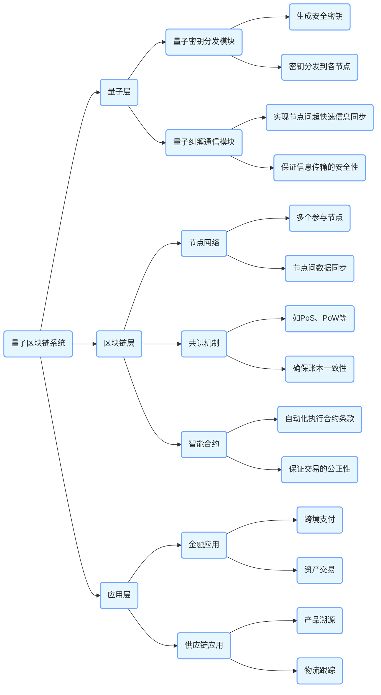

# 巴菲特 - 芒格的量子区块链投资：下一代分布式账本技术

> 关键词：巴菲特 - 芒格、量子区块链、分布式账本技术、投资、下一代技术

> 摘要：本文聚焦于巴菲特 - 芒格的量子区块链投资，深入探讨下一代分布式账本技术。首先介绍了相关背景，包括目的范围、预期读者等内容。接着阐述了量子区块链和分布式账本技术的核心概念及联系，详细讲解了核心算法原理和具体操作步骤，结合数学模型和公式进行举例说明。通过项目实战，给出代码实际案例并进行详细解释。分析了该技术的实际应用场景，推荐了学习资源、开发工具框架以及相关论文著作。最后总结了未来发展趋势与挑战，解答了常见问题并提供扩展阅读和参考资料，旨在为读者全面呈现这一前沿技术的全貌。

## 1. 背景介绍 
### 1.1 目的和范围
本文章的主要目的是深入探讨巴菲特 - 芒格的量子区块链投资所涉及的下一代分布式账本技术。一方面，分析这种投资背后的技术逻辑和潜在价值；另一方面，详细介绍量子区块链作为下一代分布式账本技术的原理、特点和应用。范围涵盖了从技术的基础概念到实际应用场景，从核心算法到代码实现，以及相关的学习资源和未来发展趋势等多个方面，力求为读者提供一个全面而深入的关于量子区块链和分布式账本技术的知识体系。

### 1.2 预期读者
预期读者包括对投资领域感兴趣，尤其是关注巴菲特 - 芒格投资策略的投资者；从事区块链、量子计算等相关技术领域的专业人士，如程序员、软件架构师等；对新兴技术有探索欲望的科研人员和学生；以及希望了解金融科技发展趋势的金融从业者。

### 1.3 文档结构概述
本文将按照以下结构展开：首先介绍相关背景信息，让读者了解文章的目的、受众和整体结构。接着阐述核心概念与联系，帮助读者建立对量子区块链和分布式账本技术的基本认识。然后详细讲解核心算法原理和具体操作步骤，并结合数学模型和公式进行说明。通过项目实战部分，给出代码实际案例并进行解读。分析该技术的实际应用场景，为读者展示其潜在价值。推荐学习资源、开发工具框架和相关论文著作，方便读者进一步深入学习。最后总结未来发展趋势与挑战，解答常见问题并提供扩展阅读和参考资料。

### 1.4 术语表
#### 1.4.1 核心术语定义
- **量子区块链**：结合了量子计算和区块链技术的新型分布式账本系统。量子计算的特性为区块链带来了更高的安全性、更快的处理速度和更强的计算能力，有望解决传统区块链在性能和安全方面的一些瓶颈问题。
- **分布式账本技术**：一种在多个节点之间共享、复制和同步的数据库技术。它通过去中心化的方式，使得账本数据在多个参与方之间进行存储和管理，保证了数据的一致性和不可篡改。
- **巴菲特 - 芒格投资**：指由沃伦·巴菲特（Warren Buffett）和查理·芒格（Charlie Munger）所领导的投资策略和决策。他们以长期价值投资而闻名，注重企业的基本面和内在价值。

#### 1.4.2 相关概念解释
- **量子计算**：基于量子力学原理的计算方式，利用量子比特（qubit）的叠加和纠缠特性，能够在某些特定问题上实现比传统计算机指数级的加速。例如，在密码破解和复杂优化问题上具有巨大的潜力。
- **区块链**：一种分布式的、去中心化的数据库，由一个个数据块组成，每个数据块包含一定时间内的交易信息。通过密码学技术保证数据的不可篡改和可追溯性，广泛应用于数字货币、供应链管理等领域。

#### 1.4.3 缩略词列表
- **QKD**：Quantum Key Distribution，量子密钥分发，是一种基于量子力学原理的密钥分发技术，能够提供无条件安全的密钥交换。
- **PoS**：Proof of Stake，权益证明，是一种区块链共识算法，根据节点持有的代币数量和时间来决定其获得记账权的概率。

## 2. 核心概念与联系 
### 核心概念原理
#### 量子区块链原理
量子区块链结合了量子计算和区块链的优势。在传统区块链中，数据的安全性主要依赖于密码学算法，如哈希函数和非对称加密。然而，随着量子计算技术的发展，这些传统密码学算法可能会受到威胁。量子区块链利用量子力学的特性，如量子密钥分发（QKD）和量子纠缠，来增强区块链的安全性。

量子密钥分发可以提供无条件安全的密钥交换，确保通信双方之间的密钥不会被窃取或破解。量子纠缠则可以用于实现更高效的信息传输和验证。例如，通过量子纠缠，可以在瞬间实现两个遥远节点之间的信息同步，大大提高了区块链的处理速度。

#### 分布式账本技术原理
分布式账本技术是一种去中心化的数据库技术，它通过多个节点之间的共识机制来维护账本的一致性和完整性。在分布式账本中，每个节点都保存着一份完整的账本副本，任何对账本的修改都需要经过大多数节点的同意。这种去中心化的方式避免了单点故障和数据篡改的风险，提高了数据的可靠性和安全性。

常见的分布式账本共识算法包括工作量证明（PoW）、权益证明（PoS）等。工作量证明通过节点进行复杂的计算来竞争记账权，而权益证明则根据节点持有的代币数量和时间来决定记账权。

### 架构的文本示意图
```plaintext
量子区块链系统
├── 量子层
│   ├── 量子密钥分发模块
│   │   ├── 生成安全密钥
│   │   ├── 密钥分发到各节点
│   ├── 量子纠缠通信模块
│   │   ├── 实现节点间超快速信息同步
│   │   ├── 保证信息传输的安全性
├── 区块链层
│   ├── 节点网络
│   │   ├── 多个参与节点
│   │   ├── 节点间数据同步
│   ├── 共识机制
│   │   ├── 如PoS、PoW等
│   │   ├── 确保账本一致性
│   ├── 智能合约
│   │   ├── 自动化执行合约条款
│   │   ├── 保证交易的公正性
├── 应用层
│   ├── 金融应用
│   │   ├── 跨境支付
│   │   ├── 资产交易
│   ├── 供应链应用
│   │   ├── 产品溯源
│   │   ├── 物流跟踪
```

### Mermaid 流程图


## 3. 核心算法原理 & 具体操作步骤 
### 量子密钥分发算法原理
量子密钥分发（QKD）是量子区块链中保证通信安全的关键技术。以 BB84 协议为例，它基于量子比特的偏振特性来生成和分发密钥。

#### 算法原理
1. **发送方操作**：发送方随机选择一组量子比特的偏振方向（水平/垂直或 +45°/-45°），并将对应的量子比特发送给接收方。
2. **接收方操作**：接收方随机选择一组测量基（与发送方的偏振方向选择类似）对收到的量子比特进行测量。由于量子力学的特性，只有当接收方选择的测量基与发送方的偏振方向一致时，才能得到正确的测量结果。
3. **密钥筛选**：发送方和接收方通过经典通信信道交换他们选择的偏振方向和测量基信息，只保留那些选择一致的测量结果作为密钥。
4. **错误检测和纠错**：通过比较部分密钥信息来检测是否存在窃听，如果存在错误，则进行纠错处理。

#### Python 源代码实现
```python
import random

# 定义量子比特的偏振方向
HORIZONTAL = 0
VERTICAL = 1
PLUS_45 = 2
MINUS_45 = 3

# 生成随机的偏振方向序列
def generate_polarizations(length):
    return [random.choice([HORIZONTAL, VERTICAL, PLUS_45, MINUS_45]) for _ in range(length)]

# 生成随机的测量基序列
def generate_bases(length):
    return [random.choice([HORIZONTAL, VERTICAL, PLUS_45, MINUS_45]) for _ in range(length)]

# 模拟量子比特的测量
def measure(polarization, base):
    if polarization == base:
        return 1  # 测量正确
    else:
        return random.choice([0, 1])  # 测量错误

# 密钥筛选
def sift_keys(sender_polarizations, receiver_bases, receiver_results):
    sifted_key = []
    for i in range(len(sender_polarizations)):
        if sender_polarizations[i] == receiver_bases[i]:
            sifted_key.append(receiver_results[i])
    return sifted_key

# 主函数
def bb84_protocol(length):
    # 发送方生成偏振方向序列
    sender_polarizations = generate_polarizations(length)
    # 接收方生成测量基序列
    receiver_bases = generate_bases(length)
    # 接收方进行测量
    receiver_results = [measure(sender_polarizations[i], receiver_bases[i]) for i in range(length)]
    # 密钥筛选
    sifted_key = sift_keys(sender_polarizations, receiver_bases, receiver_results)
    return sifted_key

# 示例
key_length = 100
final_key = bb84_protocol(key_length)
print("生成的密钥:", final_key)
```

### 具体操作步骤
1. **初始化**：确定密钥的长度，发送方和接收方分别生成随机的偏振方向序列和测量基序列。
2. **量子比特传输**：发送方将量子比特按照偏振方向发送给接收方。
3. **测量**：接收方使用测量基对收到的量子比特进行测量。
4. **经典通信**：发送方和接收方通过经典通信信道交换偏振方向和测量基信息。
5. **密钥筛选**：根据交换的信息，筛选出一致的测量结果作为密钥。
6. **错误检测和纠错**：通过比较部分密钥信息检测是否存在窃听，如果存在错误，进行纠错处理。

## 4. 数学模型和公式 & 详细讲解 & 举例说明 
### 量子比特的数学表示
在量子计算中，量子比特（qubit）是信息的基本单位。与经典比特只能取 0 或 1 不同，量子比特可以处于 0 和 1 的叠加态。一个量子比特的状态可以用二维希尔伯特空间中的向量来表示：

$$|\psi\rangle = \alpha|0\rangle + \beta|1\rangle$$

其中，$\alpha$ 和 $\beta$ 是复数，满足 $|\alpha|^2 + |\beta|^2 = 1$。$|0\rangle$ 和 $|1\rangle$ 是基态向量，分别表示经典比特的 0 和 1。

例如，当 $\alpha = \frac{1}{\sqrt{2}}$，$\beta = \frac{1}{\sqrt{2}}$ 时，量子比特处于 $|0\rangle$ 和 $|1\rangle$ 的等概率叠加态：

$$|\psi\rangle = \frac{1}{\sqrt{2}}|0\rangle + \frac{1}{\sqrt{2}}|1\rangle$$

在测量时，量子比特会以 $|\alpha|^2$ 的概率坍缩到 $|0\rangle$ 态，以 $|\beta|^2$ 的概率坍缩到 $|1\rangle$ 态。

### 量子纠缠的数学描述
量子纠缠是量子力学中的一种奇特现象，当两个或多个量子比特处于纠缠态时，它们之间存在一种非经典的关联。例如，两个纠缠的量子比特的状态可以表示为：

$$|\Psi\rangle = \frac{1}{\sqrt{2}}(|00\rangle + |11\rangle)$$

其中，$|00\rangle$ 表示第一个量子比特处于 $|0\rangle$ 态，第二个量子比特也处于 $|0\rangle$ 态；$|11\rangle$ 表示两个量子比特都处于 $|1\rangle$ 态。

这种纠缠态的特点是，当对其中一个量子比特进行测量时，另一个量子比特的状态会立即确定。例如，如果测量第一个量子比特得到 $|0\rangle$，那么第二个量子比特必然处于 $|0\rangle$ 态；如果测量第一个量子比特得到 $|1\rangle$，那么第二个量子比特必然处于 $|1\rangle$ 态。

### 举例说明
假设我们有两个纠缠的量子比特 $A$ 和 $B$，处于 $|\Psi\rangle = \frac{1}{\sqrt{2}}(|00\rangle + |11\rangle)$ 态。现在，对量子比特 $A$ 进行测量。

- 如果测量结果为 $|0\rangle$，根据纠缠态的性质，量子比特 $B$ 的状态会立即坍缩到 $|0\rangle$ 态。
- 如果测量结果为 $|1\rangle$，量子比特 $B$ 的状态会立即坍缩到 $|1\rangle$ 态。

这种非经典的关联可以用于实现超快速的信息传输和验证，在量子区块链中具有重要的应用价值。

## 5. 项目实战：代码实际案例和详细解释说明 
### 5.1  开发环境搭建
#### 操作系统
可以选择 Linux（如 Ubuntu）、Windows 或 macOS 作为开发操作系统。这里以 Ubuntu 为例进行说明。

#### 编程语言和环境
- **Python**：量子区块链的代码实现主要使用 Python 语言。可以通过以下命令安装 Python：
```bash
sudo apt update
sudo apt install python3 python3-pip
```
- **相关库**：需要安装一些 Python 库，如 `qiskit`（用于量子计算模拟）、`numpy`（用于数值计算）等。可以使用以下命令安装：
```bash
pip3 install qiskit numpy
```

#### 开发工具
- **Visual Studio Code**：一款功能强大的代码编辑器，支持 Python 开发。可以从官方网站下载并安装。

### 5.2  源代码详细实现和代码解读
#### 量子区块链简单模拟代码
```python
import qiskit
from qiskit import QuantumCircuit, Aer, execute
import numpy as np

# 定义量子比特数量
num_qubits = 4

# 创建量子电路
qc = QuantumCircuit(num_qubits, num_qubits)

# 应用量子门操作
qc.h(0)  # 对第一个量子比特应用 Hadamard 门，使其处于叠加态
qc.cx(0, 1)  # 应用 CNOT 门，实现量子纠缠
qc.cx(0, 2)
qc.cx(0, 3)

# 测量量子比特
qc.measure(range(num_qubits), range(num_qubits))

# 使用模拟器运行量子电路
backend = Aer.get_backend('qasm_simulator')
job = execute(qc, backend, shots=1024)
result = job.result()
counts = result.get_counts(qc)

# 输出测量结果
print("测量结果:", counts)
```

#### 代码解读
1. **导入库**：导入 `qiskit` 库及其相关模块，以及 `numpy` 库用于数值计算。
2. **定义量子比特数量**：设置量子电路中量子比特的数量为 4。
3. **创建量子电路**：使用 `QuantumCircuit` 类创建一个包含 4 个量子比特和 4 个经典比特的量子电路。
4. **应用量子门操作**：
    - `qc.h(0)`：对第一个量子比特应用 Hadamard 门，使其处于叠加态。
    - `qc.cx(0, 1)`、`qc.cx(0, 2)`、`qc.cx(0, 3)`：应用 CNOT 门，实现第一个量子比特与其他量子比特的纠缠。
5. **测量量子比特**：使用 `qc.measure` 方法对所有量子比特进行测量，并将测量结果存储到经典比特中。
6. **运行量子电路**：使用 `Aer.get_backend('qasm_simulator')` 获取量子模拟器后端，使用 `execute` 函数运行量子电路，并设置测量次数为 1024 次。
7. **获取测量结果**：使用 `result.get_counts(qc)` 获取测量结果的统计信息，并输出。

### 5.3  代码解读与分析
通过上述代码，我们模拟了一个简单的量子区块链中的量子操作过程。量子比特的叠加和纠缠特性在代码中得到了体现。Hadamard 门将量子比特置于叠加态，而 CNOT 门实现了量子比特之间的纠缠。

测量结果的统计信息反映了量子态的概率分布。由于量子比特处于叠加态，每次测量的结果都是随机的，但在多次测量后，我们可以得到各个可能结果的出现概率。

在实际的量子区块链应用中，这些量子操作可以用于实现安全的密钥分发、快速的信息传输和验证等功能。

## 6. 实际应用场景 
### 金融领域
#### 跨境支付
传统的跨境支付存在手续费高、结算时间长等问题。量子区块链可以利用其快速的信息传输和安全的密钥分发特性，实现跨境支付的实时结算和低手续费。通过量子纠缠通信，可以在瞬间完成不同国家和地区之间的资金转移，提高支付效率。

#### 资产交易
在资产交易中，量子区块链可以保证交易的安全性和透明度。智能合约可以自动执行交易条款，确保资产的所有权转移和资金的支付同步进行。同时，量子密钥分发可以防止交易信息被窃取或篡改，保护投资者的利益。

### 供应链领域
#### 产品溯源
量子区块链可以实现产品从原材料采购到生产、运输、销售等全过程的溯源。通过在每个环节记录产品的信息，并使用量子密钥保证信息的安全性，消费者可以随时查询产品的来源和质量信息，提高产品的可信度。

#### 物流跟踪
在物流过程中，量子区块链可以实时跟踪货物的位置和状态。物流企业可以通过分布式账本共享物流信息，提高物流效率和透明度。同时，量子纠缠通信可以实现物流信息的快速同步，减少物流延误和错误。

### 医疗领域
#### 医疗数据共享
医疗数据涉及患者的隐私和安全，量子区块链可以为医疗数据共享提供安全的解决方案。通过量子密钥分发，医疗机构可以安全地共享患者的医疗数据，同时保证数据的隐私性。智能合约可以规定数据的使用权限和条件，确保数据的合法使用。

#### 药品溯源
与供应链领域的产品溯源类似，量子区块链可以实现药品从生产到销售的全过程溯源。消费者可以通过扫描药品上的二维码，查询药品的真伪、生产日期、有效期等信息，保障用药安全。

## 7. 工具和资源推荐
### 7.1 学习资源推荐
#### 7.1.1 书籍推荐
- 《量子计算与量子信息》（*Quantum Computation and Quantum Information*）：由 Michael A. Nielsen 和 Isaac L. Chuang 所著，是量子计算领域的经典教材，全面介绍了量子计算的基本原理、算法和应用。
- 《区块链技术原理与开发实战》：详细介绍了区块链的技术原理、共识算法、智能合约等内容，并通过实际案例进行讲解，适合初学者和有一定基础的开发者。
- 《巴菲特致股东的信》（*The Essays of Warren Buffett: Lessons for Corporate America*）：由沃伦·巴菲特和劳伦斯·坎宁安所著，收录了巴菲特多年来致股东的信，从中可以学习到他的投资理念和策略。

#### 7.1.2 在线课程
- Coursera 上的 “Quantum Computing for Everyone”：由澳大利亚新南威尔士大学开设的课程，适合零基础的学习者，介绍了量子计算的基本概念和原理。
- edX 上的 “Blockchain and Cryptocurrency Technologies”：由普林斯顿大学开设的课程，深入讲解了区块链和加密货币的技术原理和应用。
- Udemy 上的 “Investing like Warren Buffett”：该课程教授如何运用巴菲特的投资策略进行股票投资。

#### 7.1.3 技术博客和网站
- Medium 上的量子计算和区块链相关博客：许多专业人士会在 Medium 上分享他们的研究成果和实践经验，是获取最新技术信息的好地方。
- Qiskit 官方博客：Qiskit 是 IBM 开发的量子计算开源框架，其官方博客会发布关于量子计算的最新进展和技术文章。
- CoinDesk：专注于区块链和加密货币领域的新闻和分析网站，提供行业动态和深度报道。

### 7.2 开发工具框架推荐
#### 7.2.1 IDE和编辑器
- Visual Studio Code：功能强大的代码编辑器，支持多种编程语言和插件扩展，适合量子区块链开发。
- PyCharm：专业的 Python 集成开发环境，提供代码调试、代码分析等功能，提高开发效率。

#### 7.2.2 调试和性能分析工具
- Qiskit Aer：IBM 开发的量子计算模拟器，可用于调试和测试量子电路。
- cProfile：Python 内置的性能分析工具，可以分析代码的运行时间和函数调用情况，帮助优化代码性能。

#### 7.2.3 相关框架和库
- Qiskit：IBM 开发的开源量子计算框架，提供了量子电路设计、模拟和执行的工具。
- Hyperledger Fabric：一个开源的企业级区块链框架，具有高度的可扩展性和安全性，适合开发分布式账本应用。
- Ethereum：一个开放的区块链平台，支持智能合约的开发和部署，广泛应用于金融和去中心化应用领域。

### 7.3 相关论文著作推荐
#### 7.3.1 经典论文
- “Quantum cryptography based on Bell's theorem”：由 Artur K. Ekert 发表的论文，提出了基于贝尔定理的量子密码学方案，为量子密钥分发奠定了基础。
- “Bitcoin: A Peer-to-Peer Electronic Cash System”：中本聪发表的比特币白皮书，介绍了比特币的原理和实现方式，开创了区块链技术的先河。

#### 7.3.2 最新研究成果
- 关注量子计算和区块链领域的顶级学术会议，如 ACM SIGKDD、IEEE International Conference on Quantum Computing and Engineering 等，这些会议上会发布最新的研究成果。
- 查阅知名学术期刊，如 *Nature*、*Science*、*Physical Review Letters* 等，其中可能会有关于量子区块链的前沿研究论文。

#### 7.3.3 应用案例分析
- 研究一些实际的量子区块链应用案例，如某银行使用量子区块链实现跨境支付的案例分析，了解该技术在实际应用中的效果和挑战。
- 分析一些成功的区块链项目，如以太坊、比特币等，学习它们的设计理念和实现方法。

## 8. 总结：未来发展趋势与挑战
### 未来发展趋势
#### 技术融合
量子区块链将与其他新兴技术，如人工智能、物联网等进行深度融合。例如，量子区块链可以为物联网设备提供安全的通信和数据存储解决方案，而人工智能可以利用量子计算的强大算力进行更复杂的数据分析和模型训练。

#### 应用拓展
量子区块链的应用领域将不断拓展，除了金融、供应链和医疗领域，还将应用于能源、政务、教育等更多领域。例如，在能源领域，量子区块链可以实现电力交易的实时结算和分布式能源的管理。

#### 标准化和监管完善
随着量子区块链技术的发展，相关的标准和监管体系将逐渐完善。标准化可以促进不同量子区块链系统之间的互操作性，而监管可以保障技术的合法合规应用，保护用户的权益。

### 挑战
#### 技术实现难度
量子计算和区块链技术本身都具有较高的技术难度，将两者结合起来实现量子区块链更是面临诸多挑战。例如，量子比特的稳定性和纠错技术仍然是量子计算领域的难题，需要进一步的研究和突破。

#### 安全风险
虽然量子区块链旨在提高安全性，但也面临着新的安全风险。例如，量子黑客可能会利用量子计算的强大算力破解传统的加密算法，对量子区块链系统造成威胁。因此，需要不断研发新的安全技术来应对这些风险。

#### 成本问题
量子计算设备的成本非常高昂，目前还难以大规模普及。此外，量子区块链的开发和维护也需要大量的人力和物力投入。降低成本是推动量子区块链技术广泛应用的关键。

## 9. 附录：常见问题与解答
### 问题 1：量子区块链与传统区块链有什么区别？
解答：量子区块链结合了量子计算和区块链技术的优势。与传统区块链相比，量子区块链具有更高的安全性，利用量子密钥分发可以提供无条件安全的密钥交换；更快的处理速度，通过量子纠缠通信可以实现节点间的超快速信息同步；更强的计算能力，量子计算可以在某些特定问题上实现指数级的加速。

### 问题 2：巴菲特 - 芒格为什么会投资量子区块链？
解答：虽然目前没有确凿的证据表明巴菲特 - 芒格已经投资了量子区块链，但从他们的投资理念来看，他们注重企业的长期价值和创新能力。量子区块链作为下一代分布式账本技术，具有巨大的发展潜力，可能符合他们的投资标准。此外，随着金融科技的发展，量子区块链在金融领域的应用前景广阔，这也可能吸引他们的关注。

### 问题 3：量子区块链的安全性如何保障？
解答：量子区块链的安全性主要通过量子密钥分发和量子纠缠等技术来保障。量子密钥分发可以提供无条件安全的密钥交换，确保通信双方之间的密钥不会被窃取或破解。量子纠缠则可以用于实现更高效的信息传输和验证，保证信息的完整性和真实性。此外，区块链的去中心化和共识机制也可以防止数据的篡改和单点故障。

### 问题 4：学习量子区块链需要具备哪些知识？
解答：学习量子区块链需要具备一定的数学基础，如线性代数、量子力学等，以理解量子计算的原理。同时，需要掌握区块链的基本概念和技术，如分布式账本、共识算法、智能合约等。编程语言方面，建议掌握 Python，因为许多量子计算和区块链开发工具都支持 Python。此外，还需要了解一些密码学知识，以理解量子区块链的安全机制。

## 10. 扩展阅读 & 参考资料
### 扩展阅读
- 《量子计算简史》：深入介绍了量子计算的发展历程和重要里程碑，帮助读者了解量子计算的背景和现状。
- 《区块链革命》：探讨了区块链技术对社会和经济的影响，以及未来的发展趋势。
- 《巴菲特的投资组合》：详细分析了巴菲特的投资策略和投资组合构建方法，为投资者提供了有益的参考。

### 参考资料
- Nielsen, M. A., & Chuang, I. L. (2000). *Quantum Computation and Quantum Information*. Cambridge University Press.
- Nakamoto, S. (2008). *Bitcoin: A Peer-to-Peer Electronic Cash System*.
- Qiskit 官方文档：https://qiskit.org/documentation/
- Hyperledger Fabric 官方文档：https://hyperledger-fabric.readthedocs.io/

作者：AI天才研究院/AI Genius Institute & 禅与计算机程序设计艺术 /Zen And The Art of Computer Programming