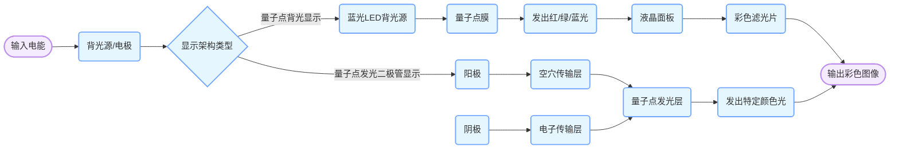

# 巴菲特 - 芒格的量子点显示技术投资：新一代显示产业的引领者

> 关键词：巴菲特；芒格；量子点显示技术；投资；新一代显示产业

> 摘要：本文深入探讨了巴菲特和芒格对量子点显示技术的投资。从量子点显示技术的背景介绍出发，详细阐述其核心概念、算法原理、数学模型等内容。通过项目实战案例展示该技术的实际应用，分析其在不同场景下的应用价值。同时，推荐了学习该技术的相关工具和资源，最后总结了量子点显示技术的未来发展趋势与挑战，并对常见问题进行解答，旨在为读者全面呈现量子点显示技术及其投资价值。

## 1. 背景介绍 
### 1.1 目的和范围
本文旨在全面深入地研究巴菲特 - 芒格对量子点显示技术的投资决策及其背后的产业意义。一方面，剖析量子点显示技术的原理、应用和发展前景，让读者了解这一前沿技术的核心要点；另一方面，分析巴菲特和芒格投资该技术的战略考量以及对新一代显示产业可能产生的引领作用。范围涵盖量子点显示技术的理论基础、实际应用案例、市场现状和未来趋势等多个方面。

### 1.2 预期读者
本文适合对投资领域感兴趣，尤其是关注科技产业投资的投资者；从事显示技术研究、开发和应用的专业技术人员；以及对新兴技术发展趋势有研究需求的行业分析师和学者阅读。

### 1.3 文档结构概述
本文将首先介绍量子点显示技术的背景信息，包括相关术语和概念。接着详细阐述核心概念与联系，通过文本示意图和 Mermaid 流程图展示其架构。然后讲解核心算法原理和具体操作步骤，结合 Python 源代码进行说明。之后介绍数学模型和公式，并举例说明。通过项目实战案例，展示代码实现和解读。分析量子点显示技术的实际应用场景，推荐相关的学习工具和资源。最后总结未来发展趋势与挑战，解答常见问题，并提供扩展阅读和参考资料。

### 1.4 术语表
#### 1.4.1 核心术语定义
- **量子点（Quantum Dots）**：是一种纳米级别的半导体晶体，其尺寸通常在 1 - 100 纳米之间。量子点具有独特的光学和电学性质，其发光颜色可以通过改变其尺寸来精确控制。
- **量子点显示技术（Quantum Dot Display Technology）**：利用量子点的发光特性实现显示功能的技术，主要包括量子点背光显示（QLED）和量子点发光二极管显示（QLED，这里与前面的 QLED 概念有区别）等类型。
- **色域（Color Gamut）**：指显示器能够显示的颜色范围，通常用百分比或特定的色域标准（如 NTSC、Rec. 2020 等）来表示。色域越广，显示器能够呈现的颜色越丰富、越鲜艳。

#### 1.4.2 相关概念解释
- **半导体（Semiconductor）**：是一种导电性介于导体和绝缘体之间的材料，常见的半导体材料有硅、锗等。量子点就是基于半导体材料制成的。
- **光致发光（Photoluminescence）**：指物质吸收光子后再发射出光子的过程。在量子点显示技术中，量子点通过吸收背光源发出的光，然后发出特定颜色的光，实现显示效果。

#### 1.4.3 缩略词列表
- **QLED**：Quantum Dot Light - Emitting Diode，量子点发光二极管，有量子点背光显示和量子点自发光显示两种含义，具体含义需根据上下文判断。
- **NTSC**：National Television System Committee，美国国家电视标准委员会，其定义的色域标准常用于衡量显示器的颜色表现。
- **Rec. 2020**：ITU - R Recommendation BT.2020，国际电信联盟无线电通信部门制定的超高清电视（UHDTV）色域标准，代表了目前较高的色域水平。

## 2. 核心概念与联系 
### 核心概念原理
量子点显示技术的核心在于量子点的独特光学性质。量子点是由少数原子组成的纳米晶体，其电子被限制在一个非常小的空间内，导致电子的能量状态呈现出离散的能级结构。当量子点吸收能量（如光子）时，电子会从低能级跃迁到高能级；当电子从高能级回落到低能级时，会释放出特定能量的光子，从而发出特定颜色的光。

量子点的发光颜色与量子点的尺寸密切相关。一般来说，较小的量子点发出较短波长的光（如蓝光），而较大的量子点发出较长波长的光（如红光）。通过精确控制量子点的尺寸，可以实现对发光颜色的精确调控。

### 架构的文本示意图
量子点显示技术主要有两种架构：量子点背光显示（QLED - BLU）和量子点发光二极管显示（QLED - Self - Emitting）。

#### 量子点背光显示（QLED - BLU）
这种架构是在传统液晶显示器（LCD）的基础上进行改进的。其基本结构包括背光源、量子点膜、液晶面板和彩色滤光片等部分。背光源通常采用蓝色 LED 灯，发出的蓝光照射到量子点膜上。量子点膜中包含不同尺寸的量子点，蓝光激发量子点使其发出红光和绿光，再与未被吸收的蓝光混合，形成白光。这种白光经过液晶面板的调制和彩色滤光片的过滤，最终在屏幕上显示出彩色图像。

#### 量子点发光二极管显示（QLED - Self - Emitting）
这是一种自发光显示技术，类似于有机发光二极管（OLED）。其基本结构包括阳极、空穴传输层、量子点发光层、电子传输层和阴极等部分。当在阳极和阴极之间施加电压时，空穴和电子分别从阳极和阴极注入到量子点发光层中，在量子点内复合并释放出光子，从而实现自发光显示。

### Mermaid 流程图


## 3. 核心算法原理 & 具体操作步骤 
### 核心算法原理
在量子点显示技术中，一个重要的算法原理是量子点发光特性的模拟和优化。通过量子力学理论，可以建立量子点的能级结构模型，从而预测量子点的发光波长和发光效率。

下面是一个简化的基于量子力学的量子点能级计算的 Python 示例代码：

```python
import numpy as np

# 定义常量
h = 6.626e-34  # 普朗克常量 (J s)
m_e = 9.109e-31  # 电子质量 (kg)
e = 1.602e-19  # 元电荷 (C)

def energy_level(n, L):
    """
    计算量子点的能级
    :param n: 量子数
    :param L: 量子点的尺寸 (m)
    :return: 能级能量 (eV)
    """
    E = (n**2 * h**2) / (8 * m_e * L**2)
    return E / e

# 示例：计算不同量子数下的能级
L = 5e-9  # 量子点尺寸为 5 nm
for n in range(1, 4):
    E = energy_level(n, L)
    print(f"量子数 n = {n} 时，能级能量为 {E:.2f} eV")
```

### 具体操作步骤
#### 量子点材料制备
1. **选择合适的前驱体**：根据所需量子点的材料和尺寸，选择合适的金属盐、有机配体等前驱体。
2. **溶液配制**：将前驱体溶解在适当的溶剂中，形成均匀的溶液。
3. **反应合成**：在特定的温度、压力和反应时间条件下，使前驱体发生化学反应，形成量子点。
4. **分离和纯化**：通过离心、过滤等方法将合成的量子点从反应溶液中分离出来，并进行纯化处理，去除杂质。

#### 显示器件制造
1. **基板制备**：选择合适的基板材料，如玻璃、塑料等，并进行表面处理，以提高量子点层的附着力。
2. **量子点层涂覆**：采用旋涂、喷涂等方法将量子点溶液涂覆在基板上，形成均匀的量子点层。
3. **其他功能层制备**：根据显示架构的要求，制备空穴传输层、电子传输层、电极等其他功能层。
4. **封装**：将制备好的器件进行封装，以防止量子点受到外界环境的影响，提高器件的稳定性和寿命。

## 4. 数学模型和公式 & 详细讲解 & 举例说明 
### 量子点能级模型
量子点的能级结构可以用一维无限深势阱模型来近似描述。在一维无限深势阱中，粒子（如电子）被限制在一个宽度为 $L$ 的区域内，其能量本征值 $E_n$ 满足以下公式：

$$E_n = \frac{n^2h^2}{8mL^2}$$

其中，$n = 1, 2, 3, \cdots$ 是量子数，$h$ 是普朗克常量，$m$ 是粒子的质量，$L$ 是势阱的宽度（即量子点的尺寸）。

### 详细讲解
从公式可以看出，量子点的能级是离散的，且能级之间的间隔随着量子数 $n$ 的增大而增大。同时，能级的大小与量子点的尺寸 $L$ 的平方成反比，即量子点尺寸越小，能级间隔越大，发光波长越短。

### 举例说明
假设一个量子点的尺寸 $L = 5 \text{ nm} = 5\times10^{-9} \text{ m}$，电子质量 $m = m_e = 9.109\times10^{-31} \text{ kg}$，普朗克常量 $h = 6.626\times10^{-34} \text{ J s}$。

当 $n = 1$ 时，能级能量为：

$$E_1 = \frac{1^2\times(6.626\times10^{-34})^2}{8\times9.109\times10^{-31}\times(5\times10^{-9})^2} \approx 0.24 \text{ eV}$$

当 $n = 2$ 时，能级能量为：

$$E_2 = \frac{2^2\times(6.626\times10^{-34})^2}{8\times9.109\times10^{-31}\times(5\times10^{-9})^2} \approx 0.96 \text{ eV}$$

能级间隔 $\Delta E = E_2 - E_1 = 0.96 - 0.24 = 0.72 \text{ eV}$。根据光子能量公式 $E = h\nu = \frac{hc}{\lambda}$（其中 $\nu$ 是光子频率，$c$ 是光速，$\lambda$ 是光子波长），可以计算出与能级间隔对应的发光波长。

### 量子点发光效率模型
量子点的发光效率可以用辐射复合速率和非辐射复合速率来描述。发光效率 $\eta$ 定义为辐射复合速率 $R_r$ 与总复合速率 $R_{total}$ 的比值：

$$\eta = \frac{R_r}{R_{total}} = \frac{R_r}{R_r + R_{nr}}$$

其中，$R_{nr}$ 是非辐射复合速率。辐射复合速率和非辐射复合速率与量子点的材料、尺寸、表面状态等因素有关。

## 5. 项目实战：代码实际案例和详细解释说明 
### 5.1 开发环境搭建
#### 硬件环境
- **计算机**：建议使用配置较高的台式机或笔记本电脑，具备至少 8GB 内存和多核处理器。
- **显示设备**：用于显示测试结果，如液晶显示器或 OLED 显示器。

#### 软件环境
- **操作系统**：推荐使用 Windows 10 或 Ubuntu 20.04 等主流操作系统。
- **Python 环境**：安装 Python 3.7 及以上版本，并使用 Anaconda 或 Miniconda 进行包管理。
- **开发工具**：可以使用 PyCharm、Jupyter Notebook 等集成开发环境。

### 5.2 源代码详细实现和代码解读
下面是一个简单的量子点显示模拟程序的 Python 代码示例：

```python
import numpy as np
import matplotlib.pyplot as plt

# 定义量子点发光颜色计算函数
def calculate_color(L):
    """
    根据量子点尺寸计算发光颜色
    :param L: 量子点尺寸 (nm)
    :return: RGB 颜色值
    """
    # 简单的线性模型，实际情况更复杂
    if L < 3:
        r, g, b = 0, 0, 1
    elif L < 5:
        r = 0
        g = (L - 3) / 2
        b = 1 - g
    else:
        r = (L - 5) / 5
        g = 1 - r
        b = 0
    return r, g, b

# 生成不同尺寸的量子点
sizes = np.linspace(2, 10, 100)
colors = []

# 计算每个量子点的发光颜色
for L in sizes:
    r, g, b = calculate_color(L)
    colors.append((r, g, b))

# 绘制量子点发光颜色随尺寸变化的图
plt.figure(figsize=(10, 6))
plt.scatter(sizes, [1] * len(sizes), c=colors, s=100)
plt.xlabel('量子点尺寸 (nm)')
plt.xticks(rotation=45)
plt.yticks([])
plt.title('量子点发光颜色随尺寸变化')
plt.show()
```

### 代码解读与分析
1. **函数 `calculate_color`**：该函数根据输入的量子点尺寸 $L$ 计算发光颜色的 RGB 值。这里使用了一个简单的线性模型，实际情况中量子点发光颜色与尺寸的关系更为复杂。
2. **生成量子点尺寸数组**：使用 `np.linspace` 函数生成从 2 到 10 nm 的 100 个等间距的量子点尺寸值。
3. **计算发光颜色**：遍历每个量子点尺寸，调用 `calculate_color` 函数计算其发光颜色的 RGB 值，并将结果存储在 `colors` 列表中。
4. **绘制图形**：使用 `matplotlib` 库的 `scatter` 函数绘制量子点发光颜色随尺寸变化的散点图，每个点的颜色由其对应的 RGB 值确定。

通过这个示例代码，可以直观地看到量子点发光颜色随尺寸的变化趋势。

## 6. 实际应用场景 
### 消费电子领域
- **电视**：量子点显示技术在电视领域的应用已经较为成熟。量子点电视具有高色域、高对比度、高亮度等优点，能够呈现出更加鲜艳、逼真的色彩，为用户带来更好的视觉体验。例如，三星、TCL 等品牌都推出了量子点电视产品。
- **显示器**：在电脑显示器、平板电脑显示器等领域，量子点显示技术也逐渐得到应用。其高色彩表现能力使得显示器在处理图像、视频等内容时更加出色，满足了专业用户和普通消费者对高品质显示的需求。

### 汽车电子领域
- **车载显示屏**：随着汽车智能化的发展，车载显示屏的尺寸和数量不断增加。量子点显示技术因其高亮度、高对比度和良好的色彩表现，能够在不同的光照条件下提供清晰、鲜艳的显示效果，适用于汽车仪表盘、中控显示屏等应用场景。
- **抬头显示（HUD）**：量子点显示技术可以为抬头显示系统提供高亮度、高分辨率的图像显示，使驾驶员能够更清晰地获取车辆信息，提高驾驶安全性。

### 医疗显示领域
- **医学影像显示**：在医学影像诊断中，如 X 光、CT、MRI 等影像的显示，需要高分辨率、高对比度和准确的色彩还原。量子点显示技术能够满足这些要求，帮助医生更准确地观察和分析医学影像，提高诊断的准确性。
- **手术导航显示**：在手术过程中，手术导航系统需要实时、清晰地显示患者的解剖结构和手术器械的位置。量子点显示技术的高亮度和高对比度特性，能够确保手术人员在不同的光照条件下都能清晰地看到显示内容，提高手术的安全性和成功率。

## 7. 工具和资源推荐
### 7.1 学习资源推荐
#### 7.1.1 书籍推荐
- 《量子点：基础、应用与前沿》：本书全面介绍了量子点的基本原理、制备方法、光学和电学性质，以及在显示、照明、生物医学等领域的应用。
- 《显示技术原理与应用》：系统阐述了各种显示技术的原理、结构和性能，包括量子点显示技术，适合作为显示技术领域的入门书籍。

#### 7.1.2 在线课程
- Coursera 上的“Nanomaterials and Nanotechnology”课程：该课程涵盖了纳米材料（包括量子点）的基本概念、制备方法和应用，由知名高校的教授授课。
- edX 上的“Advanced Display Technologies”课程：深入介绍了先进显示技术的发展趋势和前沿研究，其中包括量子点显示技术的相关内容。

#### 7.1.3 技术博客和网站
- IEEE Spectrum：提供了最新的科技动态和研究成果，包括量子点显示技术的相关文章和报道。
- Display Daily：专注于显示技术领域的新闻和分析，对量子点显示技术的市场动态和技术进展有详细的报道。

### 7.2 开发工具框架推荐
#### 7.2.1 IDE和编辑器
- PyCharm：功能强大的 Python 集成开发环境，提供代码编辑、调试、版本控制等功能，适合开发量子点显示技术相关的 Python 程序。
- Visual Studio Code：轻量级的代码编辑器，支持多种编程语言和插件扩展，可用于开发量子点显示技术的软件项目。

#### 7.2.2 调试和性能分析工具
- Py-Spy：用于分析 Python 程序的性能，能够帮助开发者找出程序中的性能瓶颈。
- TensorBoard：适用于深度学习模型的调试和可视化工具，可用于分析量子点显示技术中涉及的机器学习算法的训练过程和性能。

#### 7.2.3 相关框架和库
- NumPy：用于科学计算的 Python 库，提供了高效的数组操作和数学函数，在量子点显示技术的模拟和计算中经常使用。
- Matplotlib：用于绘制图表和可视化数据的 Python 库，可用于展示量子点显示技术的模拟结果和实验数据。

### 7.3 相关论文著作推荐
#### 7.3.1 经典论文
- “Colloidal nanocrystal quantum dots”：这篇论文对胶体量子点的基本性质和制备方法进行了系统的阐述，是量子点领域的经典文献之一。
- “Quantum - dot - based light - emitting diodes”：详细介绍了量子点发光二极管的原理、结构和性能，对量子点显示技术的发展起到了重要的推动作用。

#### 7.3.2 最新研究成果
- 定期关注《Nature》《Science》《Advanced Materials》等顶级学术期刊，这些期刊经常发表量子点显示技术领域的最新研究成果。
- 参加国际显示技术会议（如 SID Display Week），可以了解到该领域的最新研究动态和发展趋势。

#### 7.3.3 应用案例分析
- 研究三星、TCL 等公司在量子点电视产品上的技术报告和市场分析，了解量子点显示技术在消费电子领域的实际应用案例和市场反馈。
- 关注汽车制造商和医疗设备制造商在量子点显示技术应用方面的研究和开发成果，分析其在汽车电子和医疗显示领域的应用前景和挑战。

## 8. 总结：未来发展趋势与挑战
### 未来发展趋势
- **更高的性能指标**：未来量子点显示技术将朝着更高的色域、更高的对比度、更高的亮度和更低的功耗方向发展。例如，通过改进量子点材料和器件结构，实现接近或达到 Rec. 2020 色域标准的显示效果。
- **柔性显示应用**：随着柔性电子技术的发展，量子点显示技术有望在柔性显示领域得到广泛应用。柔性量子点显示器可以实现可弯曲、可折叠的显示效果，为电子产品的设计带来更多的创新空间。
- **Micro - QLED 显示技术**：Micro - QLED 显示技术是量子点显示技术的未来发展方向之一。它将量子点发光二极管的尺寸缩小到微米级别，具有更高的分辨率、更高的亮度和更低的功耗，有望成为下一代显示技术的主流。

### 挑战
- **量子点材料的稳定性**：量子点材料在长时间使用或受到外界环境因素（如高温、高湿度、氧气等）的影响下，其发光性能可能会下降。因此，提高量子点材料的稳定性是量子点显示技术面临的一个重要挑战。
- **大规模生产技术**：目前量子点显示技术的大规模生产还存在一些技术难题，如量子点材料的均匀性、器件制造的一致性等。解决这些问题需要进一步研发和改进生产工艺，降低生产成本。
- **环保问题**：部分量子点材料中含有重金属元素（如镉），可能会对环境造成污染。因此，开发无镉量子点材料是量子点显示技术可持续发展的关键。

## 9. 附录：常见问题与解答
### 量子点显示技术和 OLED 显示技术有什么区别？
量子点显示技术和 OLED 显示技术都是新型显示技术，但它们有一些区别。量子点显示技术主要是通过量子点的发光特性来实现显示，目前常见的量子点背光显示是在传统 LCD 基础上改进的，具有高色域、高亮度等优点；而 OLED 显示技术是有机材料自发光，具有自发光、可柔性显示、响应速度快等优点，但在寿命和烧屏问题上可能存在一定挑战。

### 量子点显示技术的寿命有多长？
量子点显示技术的寿命受到多种因素的影响，如量子点材料的质量、器件的封装工艺、使用环境等。一般来说，经过优化的量子点显示器件的寿命可以达到数万小时以上，能够满足大多数消费电子设备的使用需求。

### 量子点显示技术对人体有害吗？
如果使用的是符合环保标准的量子点材料，量子点显示技术对人体是安全的。目前，研究人员正在积极开发无镉等重金属的量子点材料，以减少对环境和人体的潜在危害。

## 10. 扩展阅读 & 参考资料
### 扩展阅读
- 《量子计算与量子信息》：虽然与量子点显示技术直接相关度不高，但量子计算和量子信息领域的发展可能会对量子点显示技术的研究和应用产生一定的影响，有助于拓宽读者的知识面。
- 《显示技术的未来：从液晶到量子点》：深入探讨了显示技术的发展历程和未来趋势，对量子点显示技术的发展前景进行了展望。

### 参考资料
- [1] “Quantum Dots: Fundamentals, Applications, and Frontiers” by X. Peng et al.
- [2] “Display Technology: Principles and Applications” by C. W. Tang et al.
- [3] IEEE Spectrum, https://spectrum.ieee.org/
- [4] Display Daily, https://www.displaydaily.com/

作者：AI天才研究院/AI Genius Institute & 禅与计算机程序设计艺术 /Zen And The Art of Computer Programming