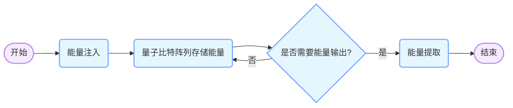

# 巴菲特 - 芒格的量子电池技术投资：能源存储的革命

> 关键词：巴菲特 - 芒格、量子电池技术、能源存储、投资、革命

> 摘要：本文围绕巴菲特 - 芒格对量子电池技术的投资展开，深入探讨了量子电池技术这一能源存储领域的新兴技术。首先介绍了文章的背景信息，包括目的、预期读者等。接着阐述了量子电池技术的核心概念、算法原理、数学模型。通过项目实战展示了其代码实现与解读。分析了该技术的实际应用场景，并推荐了相关的学习工具、资源和论文著作。最后总结了量子电池技术未来的发展趋势与挑战，还提供了常见问题解答和扩展阅读参考资料，旨在为读者全面呈现量子电池技术投资在能源存储领域带来的革命意义。

## 1. 背景介绍 
### 1.1 目的和范围
本文旨在深入剖析巴菲特 - 芒格对量子电池技术进行投资这一事件背后的深层次原因和潜在影响。我们将详细研究量子电池技术的原理、发展现状、应用前景以及在能源存储领域可能引发的变革。范围涵盖从量子电池的基础理论到实际应用案例，以及投资该技术所涉及的商业和战略考量。通过全面的分析，帮助读者理解这一投资决策对能源行业未来发展的重要意义。

### 1.2 预期读者
本文预期读者包括对能源行业、投资领域以及新兴技术感兴趣的专业人士，如能源分析师、投资者、科研人员等。同时，也适合对科技发展动态有一定了解，希望深入学习量子电池技术相关知识的普通读者。无论您是寻求技术创新的创业者，还是关注能源市场变化的行业观察者，都能从本文中获取有价值的信息。

### 1.3 文档结构概述
本文将按照以下结构展开：首先介绍量子电池技术的核心概念及其与能源存储的联系，通过文本示意图和 Mermaid 流程图进行直观展示。接着阐述核心算法原理，并使用 Python 源代码详细说明具体操作步骤。然后介绍量子电池技术的数学模型和公式，通过举例进行详细讲解。在项目实战部分，会展示代码实际案例并进行详细解释。之后分析量子电池技术的实际应用场景，推荐相关的学习工具、资源和论文著作。最后总结未来发展趋势与挑战，提供常见问题解答和扩展阅读参考资料。

### 1.4 术语表
#### 1.4.1 核心术语定义
- **量子电池技术**：基于量子力学原理开发的新型电池技术，利用量子态的特性实现高效的能量存储和释放。
- **能源存储**：将暂时不用的能量通过特定的技术和设备储存起来，在需要时再释放使用的过程。
- **量子态**：量子系统的状态，描述了粒子的各种物理性质，如能量、自旋等。
- **投资回报率（ROI）**：投资收益与投资成本之间的比率，用于衡量投资的盈利能力。

#### 1.4.2 相关概念解释
- **量子纠缠**：是一种量子力学现象，两个或多个粒子之间存在一种特殊的关联，使得一个粒子的状态变化会瞬间影响到其他粒子的状态，即使它们之间相隔很远。在量子电池技术中，量子纠缠可以用于提高能量传输和存储的效率。
- **量子隧穿**：粒子能够穿过经典物理学中认为不可能穿过的势垒的现象。在量子电池中，量子隧穿可以帮助电子在不同能级之间跃迁，实现更高效的能量存储和释放。

#### 1.4.3 缩略词列表
- **ROI**：投资回报率（Return on Investment）

## 2. 核心概念与联系 
### 核心概念原理
量子电池技术的核心原理基于量子力学的基本特性。传统电池是基于化学反应来存储和释放能量，而量子电池则利用量子态的特性，如量子纠缠和量子隧穿。量子纠缠可以使多个量子比特之间建立起一种非经典的关联，从而实现能量的高效传输和存储。量子隧穿则允许粒子在不需要克服经典势垒的情况下穿越能量障碍，这为电池的充放电过程提供了新的途径。

例如，在一个由多个量子比特组成的量子电池系统中，通过量子纠缠，这些量子比特可以同时吸收和释放能量，大大提高了能量存储和释放的速度。而量子隧穿则可以使电子在不同的量子态之间快速跃迁，减少能量损耗。

### 架构的文本示意图
量子电池系统主要由量子比特阵列、能量注入装置和能量提取装置组成。量子比特阵列是存储能量的核心部分，每个量子比特可以处于不同的量子态。能量注入装置负责将外部能量注入到量子比特阵列中，使量子比特从低能态跃迁到高能态，实现能量存储。能量提取装置则在需要时将存储在量子比特阵列中的能量提取出来，供外部设备使用。

### Mermaid 流程图


## 3. 核心算法原理 & 具体操作步骤 
### 核心算法原理
量子电池的核心算法主要涉及量子态的控制和测量。在能量注入阶段，需要通过特定的量子操作将外部能量转化为量子比特的激发态。这通常可以通过量子门操作来实现，量子门是量子计算中用于操作量子比特的基本单元。例如，使用单量子比特门和双量子比特门可以改变量子比特的状态，使其从基态跃迁到激发态。

在能量提取阶段，需要对量子比特的状态进行测量，以确定存储的能量大小，并将其转化为可用的电能。测量过程会导致量子态的坍缩，因此需要设计合理的测量方案，以尽量减少能量损失。

### 具体操作步骤（Python 源代码实现）
以下是一个简单的 Python 代码示例，用于模拟量子电池的能量注入和测量过程。这里我们使用 Qiskit 库，它是一个用于量子计算的开源 Python 库。

```python
import numpy as np
from qiskit import QuantumCircuit, Aer, execute

# 定义量子比特数量
num_qubits = 2

# 创建量子电路
qc = QuantumCircuit(num_qubits)

# 能量注入：使用单量子比特门（X 门）将第一个量子比特从基态 |0> 变为激发态 |1>
qc.x(0)

# 测量量子比特
qc.measure_all()

# 使用 Aer 模拟器运行电路
backend = Aer.get_backend('qasm_simulator')
job = execute(qc, backend, shots=1000)
result = job.result()

# 获取测量结果
counts = result.get_counts(qc)
print("测量结果:", counts)
```

### 代码解释
1. **导入必要的库**：导入 `numpy` 用于数值计算，`QuantumCircuit` 用于创建量子电路，`Aer` 用于选择模拟器，`execute` 用于执行量子电路。
2. **定义量子比特数量**：这里我们选择使用 2 个量子比特。
3. **创建量子电路**：使用 `QuantumCircuit` 类创建一个包含 2 个量子比特的量子电路。
4. **能量注入**：使用 `x` 门将第一个量子比特从基态 `|0>` 变为激发态 `|1>`，模拟能量注入过程。
5. **测量量子比特**：使用 `measure_all` 方法对所有量子比特进行测量。
6. **运行电路**：选择 `qasm_simulator` 作为模拟器，执行量子电路 1000 次。
7. **获取测量结果**：使用 `get_counts` 方法获取测量结果，并打印输出。

## 4. 数学模型和公式 & 详细讲解 & 举例说明 
### 量子态的数学表示
在量子力学中，量子比特的状态可以用一个二维复向量表示。一个量子比特的基态可以表示为 $|0\rangle$ 和 $|1\rangle$，它们构成了一个二维希尔伯特空间的一组基。一个一般的量子比特状态可以表示为：

$$|\psi\rangle = \alpha|0\rangle + \beta|1\rangle$$

其中 $\alpha$ 和 $\beta$ 是复数，满足 $|\alpha|^2 + |\beta|^2 = 1$。$|\alpha|^2$ 表示测量量子比特得到 $|0\rangle$ 态的概率，$|\beta|^2$ 表示测量量子比特得到 $|1\rangle$ 态的概率。

### 量子门的数学表示
量子门可以用矩阵表示。例如，单量子比特门 $X$ 门（也称为非门）的矩阵表示为：

$$X = \begin{bmatrix} 0 & 1 \\ 1 & 0 \end{bmatrix}$$

当 $X$ 门作用于量子比特 $|\psi\rangle = \alpha|0\rangle + \beta|1\rangle$ 时，得到的新状态为：

$$X|\psi\rangle = \begin{bmatrix} 0 & 1 \\ 1 & 0 \end{bmatrix} \begin{bmatrix} \alpha \\ \beta \end{bmatrix} = \begin{bmatrix} \beta \\ \alpha \end{bmatrix} = \beta|0\rangle + \alpha|1\rangle$$

### 举例说明
假设一个量子比特的初始状态为 $|\psi\rangle = \frac{1}{\sqrt{2}}(|0\rangle + |1\rangle)$，当 $X$ 门作用于该量子比特时，新的状态为：

$$X|\psi\rangle = \begin{bmatrix} 0 & 1 \\ 1 & 0 \end{bmatrix} \begin{bmatrix} \frac{1}{\sqrt{2}} \\ \frac{1}{\sqrt{2}} \end{bmatrix} = \begin{bmatrix} \frac{1}{\sqrt{2}} \\ \frac{1}{\sqrt{2}} \end{bmatrix} = \frac{1}{\sqrt{2}}(|0\rangle + |1\rangle)$$

可以看到，在这个例子中，$X$ 门作用后量子比特的状态没有改变。

### 能量存储和提取的数学模型
在量子电池中，能量存储可以看作是将量子比特从低能态激发到高能态的过程。假设量子比特的基态 $|0\rangle$ 对应低能态，激发态 $|1\rangle$ 对应高能态。能量注入可以通过量子门操作来实现，使量子比特从 $|0\rangle$ 态跃迁到 $|1\rangle$ 态。

能量提取则是通过测量量子比特的状态，将其从激发态 $|1\rangle$ 回到基态 $|0\rangle$，并释放出存储的能量。测量结果得到 $|1\rangle$ 态的概率为 $|\beta|^2$，因此能量提取的效率与 $|\beta|^2$ 有关。

## 5. 项目实战：代码实际案例和详细解释说明 
### 5.1  开发环境搭建
#### 安装 Python
首先，需要安装 Python 环境。可以从 Python 官方网站（https://www.python.org/downloads/）下载适合您操作系统的 Python 安装包，并按照安装向导进行安装。

#### 安装 Qiskit 库
Qiskit 是一个用于量子计算的开源 Python 库，可以通过以下命令使用 `pip` 进行安装：

```bash
pip install qiskit
```

#### 验证安装
安装完成后，可以通过以下代码验证 Qiskit 是否安装成功：

```python
import qiskit
print(qiskit.__version__)
```

如果能够正常打印出 Qiskit 的版本号，则说明安装成功。

### 5.2  源代码详细实现和代码解读
以下是一个更复杂的量子电池模拟代码示例，包含多个量子比特和纠缠操作：

```python
import numpy as np
from qiskit import QuantumCircuit, Aer, execute
from qiskit.visualization import plot_histogram
import matplotlib.pyplot as plt

# 定义量子比特数量
num_qubits = 3

# 创建量子电路
qc = QuantumCircuit(num_qubits)

# 能量注入：使用 Hadamard 门将第一个量子比特变为叠加态
qc.h(0)

# 创建纠缠态：使用 CNOT 门
qc.cx(0, 1)
qc.cx(0, 2)

# 测量量子比特
qc.measure_all()

# 使用 Aer 模拟器运行电路
backend = Aer.get_backend('qasm_simulator')
job = execute(qc, backend, shots=1000)
result = job.result()

# 获取测量结果
counts = result.get_counts(qc)

# 绘制测量结果直方图
plot_histogram(counts)
plt.show()
```

### 代码解读
1. **导入必要的库**：除了之前使用的库外，还导入了 `plot_histogram` 用于绘制测量结果的直方图，`matplotlib.pyplot` 用于显示图形。
2. **定义量子比特数量**：这里我们选择使用 3 个量子比特。
3. **创建量子电路**：使用 `QuantumCircuit` 类创建一个包含 3 个量子比特的量子电路。
4. **能量注入**：使用 Hadamard 门（`h` 门）将第一个量子比特变为叠加态，模拟能量注入过程。Hadamard 门的矩阵表示为：

$$H = \frac{1}{\sqrt{2}} \begin{bmatrix} 1 & 1 \\ 1 & -1 \end{bmatrix}$$

当 $H$ 门作用于基态 $|0\rangle$ 时，得到的状态为 $\frac{1}{\sqrt{2}}(|0\rangle + |1\rangle)$。

5. **创建纠缠态**：使用 CNOT 门（`cx` 门）创建纠缠态。CNOT 门是一个双量子比特门，当控制比特为 $|1\rangle$ 时，目标比特会翻转。通过一系列的 CNOT 门操作，可以使多个量子比特之间产生纠缠。
6. **测量量子比特**：使用 `measure_all` 方法对所有量子比特进行测量。
7. **运行电路**：选择 `qasm_simulator` 作为模拟器，执行量子电路 1000 次。
8. **获取测量结果**：使用 `get_counts` 方法获取测量结果。
9. **绘制测量结果直方图**：使用 `plot_histogram` 函数绘制测量结果的直方图，并使用 `plt.show()` 显示图形。

### 5.3  代码解读与分析
通过上述代码，我们模拟了一个包含 3 个量子比特的量子电池系统的能量注入和测量过程。通过 Hadamard 门和 CNOT 门的操作，我们实现了量子比特的叠加态和纠缠态，这有助于提高能量存储和传输的效率。

测量结果的直方图显示了不同量子态的出现概率。由于量子纠缠的存在，测量结果会呈现出一定的相关性。例如，如果第一个量子比特测量结果为 $|0\rangle$，那么其他量子比特的测量结果也更有可能为 $|0\rangle$；如果第一个量子比特测量结果为 $|1\rangle$，那么其他量子比特的测量结果也更有可能为 $|1\rangle$。

## 6. 实际应用场景 
### 可再生能源存储
随着可再生能源（如太阳能、风能）的广泛应用，能源存储问题变得越来越重要。量子电池技术可以提供高效、快速的能量存储解决方案。在太阳能发电系统中，白天产生的多余电能可以通过量子电池快速存储起来，晚上需要用电时再将能量释放出来。由于量子电池的充放电速度快，可以更好地匹配可再生能源的间歇性发电特性。

### 电动汽车
电动汽车的续航里程和充电时间是制约其发展的重要因素。量子电池技术的高能量密度和快速充放电特性可以显著提高电动汽车的性能。使用量子电池的电动汽车可以在短时间内完成充电，并且行驶里程更长。此外，量子电池的轻量化特点也有助于减少电动汽车的整体重量，提高能源利用效率。

### 数据中心
数据中心需要大量的电力来运行服务器和冷却设备。量子电池可以作为数据中心的备用电源，在电网停电时快速提供能量，确保数据中心的正常运行。同时，量子电池的高效能量存储和释放特性可以减少数据中心的能源消耗，降低运营成本。

### 航空航天
在航空航天领域，对能源存储系统的重量和能量密度要求非常高。量子电池的高能量密度和轻量化特点使其非常适合用于航空航天设备。例如，卫星和航天器可以使用量子电池来存储能量，延长其使用寿命和工作时间。

## 7. 工具和资源推荐
### 7.1 学习资源推荐
#### 7.1.1 书籍推荐
- 《量子计算与量子信息》（*Quantum Computation and Quantum Information*）：由 Michael A. Nielsen 和 Isaac L. Chuang 编写，是量子计算领域的经典教材，涵盖了量子比特、量子门、量子算法等基础知识。
- 《量子力学：概念与应用》（*Quantum Mechanics: Concepts and Applications*）：由 Nouredine Zettili 编写，详细介绍了量子力学的基本概念和应用，为理解量子电池技术提供了坚实的理论基础。

#### 7.1.2 在线课程
- Coursera 上的“量子计算基础”（*Fundamentals of Quantum Computation*）课程：由知名高校的教授授课，系统地介绍了量子计算的基本原理和算法。
- edX 上的“量子信息科学与技术”（*Quantum Information Science and Technology*）课程：涵盖了量子比特、量子门、量子纠缠等内容，适合初学者和有一定基础的学习者。

#### 7.1.3 技术博客和网站
- Qiskit 官方博客（https://qiskit.org/blog/）：提供了关于量子计算和量子电池技术的最新研究成果和应用案例。
- Quantum Computing Report（https://www.quantumcomputingreport.com/）：专注于量子计算领域的新闻和分析，包含了大量关于量子电池技术的报道和评论。

### 7.2 开发工具框架推荐
#### 7.2.1 IDE和编辑器
- PyCharm：是一款功能强大的 Python 集成开发环境，提供了代码编辑、调试、版本控制等功能，非常适合开发量子计算相关的 Python 代码。
- Jupyter Notebook：是一个交互式的开发环境，可以在浏览器中编写和运行代码，同时还可以添加文本说明和可视化图表，方便进行代码演示和数据分析。

#### 7.2.2 调试和性能分析工具
- Qiskit Aer：是 Qiskit 库中的模拟器，提供了多种调试和性能分析功能。可以使用它来模拟量子电路的运行，检查代码的正确性，并分析电路的性能。
- QuTiP：是一个用于量子力学和量子光学的 Python 库，提供了量子态的表示、量子门的操作、量子系统的演化等功能，也可以用于调试和分析量子电池模拟代码。

#### 7.2.3 相关框架和库
- Qiskit：是一个开源的量子计算框架，提供了量子电路的创建、编译、运行等功能，支持多种量子硬件平台和模拟器。
- Cirq：是 Google 开发的一个用于量子计算的 Python 框架，提供了高效的量子电路模拟和优化功能。

### 7.3 相关论文著作推荐
#### 7.3.1 经典论文
- "Quantum Batteries: A Quantum Thermodynamic Framework"：该论文提出了量子电池的热力学框架，为量子电池技术的理论研究奠定了基础。
- "Entanglement-Assisted Quantum Batteries"：探讨了量子纠缠在量子电池中的应用，证明了纠缠可以提高量子电池的能量存储和释放效率。

#### 7.3.2 最新研究成果
- 可以关注 Nature、Science 等顶级学术期刊上发表的关于量子电池技术的最新研究论文，了解该领域的前沿动态。

#### 7.3.3 应用案例分析
- 一些行业报告和学术会议论文会对量子电池技术的实际应用案例进行分析，例如在可再生能源存储、电动汽车等领域的应用。可以通过搜索相关的行业数据库和学术会议网站获取这些资料。

## 8. 总结：未来发展趋势与挑战
### 未来发展趋势
- **技术突破**：随着量子计算和量子物理学的不断发展，量子电池技术有望取得更大的突破。例如，开发出更高能量密度、更长使用寿命的量子电池，以及更高效的能量存储和释放机制。
- **商业化应用加速**：在巴菲特 - 芒格等投资者的推动下，量子电池技术的商业化应用进程将加速。未来几年内，可能会看到量子电池在可再生能源存储、电动汽车等领域得到广泛应用。
- **与其他技术融合**：量子电池技术可能会与其他新兴技术（如人工智能、物联网）进行融合，创造出更多的应用场景和商业机会。例如，通过人工智能算法优化量子电池的充放电过程，提高能源利用效率。

### 挑战
- **技术难题**：目前量子电池技术还面临一些技术难题，如量子态的稳定性、量子比特的操控精度等。解决这些问题需要大量的科研投入和技术创新。
- **成本问题**：量子电池的研发和生产成本较高，限制了其大规模商业化应用。降低成本是量子电池技术走向市场的关键。
- **安全问题**：量子电池涉及到量子态的操作和控制，存在一定的安全风险。例如，量子态的泄露可能会导致信息安全问题。因此，需要建立完善的安全保障体系。

## 9. 附录：常见问题与解答
### 问题 1：量子电池与传统电池有什么区别？
量子电池基于量子力学原理，利用量子态的特性（如量子纠缠和量子隧穿）实现能量存储和释放。与传统电池基于化学反应的工作方式不同，量子电池具有更高的能量密度、更快的充放电速度和更好的效率。

### 问题 2：量子电池技术目前处于什么发展阶段？
量子电池技术目前仍处于研究和实验阶段。虽然已经取得了一些重要的理论和实验成果，但距离大规模商业化应用还有一定的距离。

### 问题 3：投资量子电池技术有哪些风险？
投资量子电池技术面临技术风险、市场风险和竞争风险等。技术方面，量子电池技术还存在一些未解决的难题，可能导致研发进度延迟或无法达到预期效果。市场方面，量子电池的市场需求和接受度还不确定。竞争方面，可能会面临其他新兴电池技术的竞争。

### 问题 4：量子电池技术对环境有什么影响？
量子电池技术本身对环境的影响较小。与传统电池相比，量子电池不需要使用大量的化学物质，减少了环境污染的风险。此外，量子电池的高效能量存储和释放特性有助于提高能源利用效率，减少对传统能源的依赖，从而对环境产生积极影响。

## 10. 扩展阅读 & 参考资料
### 扩展阅读
- 《量子计算的未来》（*The Future of Quantum Computing*）：探讨了量子计算技术的发展趋势和应用前景，对理解量子电池技术的背景和未来发展有一定的帮助。
- 《能源存储技术的创新与发展》（*Innovation and Development in Energy Storage Technologies*）：介绍了各种能源存储技术的原理和应用，包括量子电池技术。

### 参考资料
- Nielsen, M. A., & Chuang, I. L. (2000). *Quantum Computation and Quantum Information*. Cambridge University Press.
- Zettili, N. (2009). *Quantum Mechanics: Concepts and Applications*. John Wiley & Sons.
- Qiskit Documentation: https://qiskit.org/documentation/
- Cirq Documentation: https://cirq.readthedocs.io/

作者：AI天才研究院/AI Genius Institute & 禅与计算机程序设计艺术 /Zen And The Art of Computer Programming