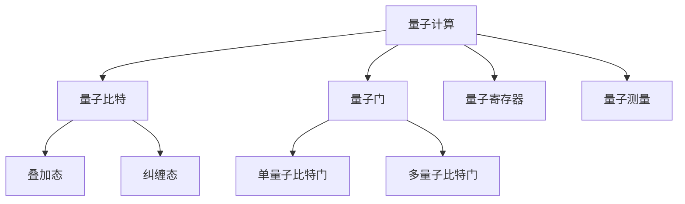

# 巴菲特 - 芒格的量子计算投资观：未来科技的潜在影响

> 关键词：巴菲特；芒格；量子计算；投资观；未来科技；潜在影响

> 摘要：本文深入探讨了巴菲特和芒格这两位投资界传奇人物在量子计算这一前沿科技领域的投资观念，以及量子计算对未来科技发展可能产生的潜在影响。通过对量子计算核心概念、算法原理、数学模型等方面的详细剖析，结合实际应用场景和项目实战案例，分析量子计算在投资领域的机遇与挑战。同时，为投资者和科技爱好者提供了学习资源、开发工具以及相关论文著作的推荐，最后对量子计算的未来发展趋势与挑战进行总结，并解答常见问题，为读者全面了解量子计算及其投资价值提供参考。

## 1. 背景介绍 
### 1.1 目的和范围
本文章的目的在于深入研究巴菲特和芒格对于量子计算这一新兴科技领域的投资观点，并探讨量子计算在未来科技发展中可能带来的各种潜在影响。我们将从量子计算的基础概念出发，逐步深入分析其算法原理、数学模型，结合实际应用案例来评估其投资价值和发展前景。研究范围涵盖了量子计算的技术层面、商业应用场景、投资机会以及面临的挑战等多个方面。

### 1.2 预期读者
本文预期读者包括对投资领域感兴趣的专业投资者、金融分析师，希望了解前沿科技发展趋势的科技爱好者，以及从事量子计算相关研究和开发的科研人员。对于那些希望在新兴科技领域寻找投资机会或者想要深入了解量子计算技术的读者来说，本文将提供有价值的参考信息。

### 1.3 文档结构概述
本文将按照以下结构进行阐述：首先介绍量子计算的核心概念与联系，包括其原理和架构；接着详细讲解量子计算的核心算法原理和具体操作步骤，并给出Python源代码示例；然后介绍量子计算的数学模型和公式，并通过举例进行说明；之后通过项目实战案例展示量子计算在实际中的应用；再探讨量子计算的实际应用场景；推荐相关的学习资源、开发工具和论文著作；最后对量子计算的未来发展趋势与挑战进行总结，并解答常见问题，同时提供扩展阅读和参考资料。

### 1.4 术语表
#### 1.4.1 核心术语定义
- **量子计算**：基于量子力学原理，利用量子比特（qubit）的叠加、纠缠等特性进行信息处理的计算方式。与传统计算机使用的二进制比特（bit）不同，量子比特可以同时处于0和1的叠加态，从而大大提高计算效率。
- **量子比特（qubit）**：量子计算中的基本信息单元，是量子系统的一个二能级量子态。它可以处于|0⟩态、|1⟩态或者它们的任意叠加态，用数学表达式表示为 $\alpha|0⟩ + \beta|1⟩$，其中 $\alpha$ 和 $\beta$ 是复数，且满足 $|\alpha|^2 + |\beta|^2 = 1$。
- **叠加态**：量子比特可以同时处于多个状态的组合，这是量子计算强大计算能力的基础。例如，一个量子比特可以同时处于|0⟩态和|1⟩态的叠加，使得量子计算机可以并行处理多个计算任务。
- **纠缠态**：多个量子比特之间存在一种特殊的关联，使得一个量子比特的状态变化会瞬间影响到其他纠缠量子比特的状态，无论它们之间的距离有多远。这种特性可以用于实现量子通信和量子算法中的高效信息传递。

#### 1.4.2 相关概念解释
- **量子门**：类似于传统计算机中的逻辑门，量子门是对量子比特进行操作的基本单元。常见的量子门包括单量子比特门（如Pauli-X门、Pauli-Y门、Pauli-Z门、Hadamard门等）和多量子比特门（如CNOT门等）。量子门的作用是改变量子比特的状态，通过一系列量子门的组合可以实现复杂的量子算法。
- **量子算法**：专门为量子计算机设计的算法，利用量子比特的叠加和纠缠特性，在某些问题上可以比传统算法具有指数级的加速。例如，Shor算法可以在多项式时间内对大整数进行因式分解，而传统算法在处理大规模整数时所需的时间呈指数级增长；Grover算法可以在无序数据库中以更快的速度搜索目标元素。

#### 1.4.3 缩略词列表
- **qubit**：量子比特（Quantum Bit）
- **CNOT**：控制非门（Controlled-NOT gate）
- **IBM Qiskit**：IBM开发的用于量子计算编程的开源框架（Quantum Information Science Kit）
- **Google Cirq**：Google开发的用于量子计算编程的Python库

## 2. 核心概念与联系 
### 2.1 量子计算的原理
量子计算的核心原理基于量子力学的基本特性，主要包括量子比特的叠加态和纠缠态。在传统计算机中，信息以二进制比特的形式存储和处理，每个比特只能处于0或1两种状态之一。而在量子计算机中，量子比特可以同时处于0和1的叠加态，用数学表达式表示为 $\alpha|0⟩ + \beta|1⟩$，其中 $\alpha$ 和 $\beta$ 是复数，且满足 $|\alpha|^2 + |\beta|^2 = 1$。这种叠加态使得量子计算机可以同时处理多个计算任务，从而在某些问题上具有比传统计算机更高的计算效率。

例如，对于一个包含 $n$ 个量子比特的量子系统，它可以同时处于 $2^n$ 种不同状态的叠加态，这意味着量子计算机可以并行处理 $2^n$ 个计算任务。而传统计算机要完成同样数量的计算任务，需要依次处理每个任务，所需的时间会随着 $n$ 的增加呈指数级增长。

纠缠态是另一个重要的量子特性，它描述了多个量子比特之间的一种特殊关联。当多个量子比特处于纠缠态时，一个量子比特的状态变化会瞬间影响到其他纠缠量子比特的状态，无论它们之间的距离有多远。这种特性可以用于实现量子通信和量子算法中的高效信息传递。

### 2.2 量子计算的架构
量子计算的架构主要包括量子比特、量子门、量子寄存器和量子测量等组件。

- **量子比特**：是量子计算的基本信息单元，如前面所述，它可以处于叠加态和纠缠态。目前实现量子比特的物理系统有多种，包括超导电路、离子阱、量子点、光子等。不同的物理系统具有不同的优缺点，例如超导电路具有较高的可扩展性和较快的操作速度，但需要极低的温度来维持量子态的稳定性；离子阱具有较长的量子态相干时间，但操作速度相对较慢。
- **量子门**：用于对量子比特进行操作，改变其状态。常见的量子门包括单量子比特门和多量子比特门。单量子比特门可以对单个量子比特进行旋转、翻转等操作，例如Hadamard门可以将一个处于|0⟩态的量子比特转换为 $\frac{1}{\sqrt{2}}(|0⟩ + |1⟩)$ 态，实现叠加态的创建。多量子比特门可以实现多个量子比特之间的相互作用，例如CNOT门是一个两量子比特门，它的作用是当控制量子比特处于|1⟩态时，将目标量子比特的状态翻转。
- **量子寄存器**：由多个量子比特组成，用于存储和处理量子信息。类似于传统计算机中的寄存器，量子寄存器可以进行读写操作，但由于量子比特的特殊性质，量子寄存器的读写操作需要遵循量子力学的规则。
- **量子测量**：用于获取量子比特的状态信息。在量子测量过程中，量子比特的叠加态会塌缩到一个确定的状态，即|0⟩态或|1⟩态。测量结果的概率由量子比特处于相应状态的概率幅决定，例如对于一个处于 $\alpha|0⟩ + \beta|1⟩$ 态的量子比特，测量得到|0⟩态的概率为 $|\alpha|^2$，测量得到|1⟩态的概率为 $|\beta|^2$。

### 2.3 核心概念的文本示意图
以下是量子计算核心概念的文本示意图：

量子计算
|-- 量子比特（qubit）
|   |-- 叠加态（$\alpha|0⟩ + \beta|1⟩$）
|   |-- 纠缠态
|-- 量子门
|   |-- 单量子比特门（如Hadamard门、Pauli-X门等）
|   |-- 多量子比特门（如CNOT门）
|-- 量子寄存器
|-- 量子测量

### 2.4 Mermaid流程图


## 3. 核心算法原理 & 具体操作步骤 
### 3.1 量子算法的重要性
量子算法是量子计算的核心，它利用量子比特的叠加和纠缠特性，在某些问题上可以比传统算法具有指数级的加速。例如，Shor算法可以在多项式时间内对大整数进行因式分解，这对于现代密码学具有重要意义，因为许多加密算法的安全性基于大整数因式分解的困难性。Grover算法可以在无序数据库中以更快的速度搜索目标元素，将搜索时间从传统算法的 $O(N)$ 降低到 $O(\sqrt{N})$。

### 3.2 Shor算法原理
Shor算法的核心思想是将大整数因式分解问题转化为求周期问题。具体步骤如下：

1. **选择一个随机整数 $a$**：$1 < a < N$，其中 $N$ 是待分解的大整数。
2. **计算 $a$ 模 $N$ 的阶 $r$**：即满足 $a^r \equiv 1 \pmod{N}$ 的最小正整数 $r$。
3. **检查 $r$ 是否为偶数**：如果 $r$ 是偶数，则计算 $x = a^{\frac{r}{2}} \pmod{N}$。
4. **检查 $x \neq \pm 1 \pmod{N}$**：如果满足条件，则 $gcd(x + 1, N)$ 和 $gcd(x - 1, N)$ 可能是 $N$ 的非平凡因子。

### 3.3 Shor算法的Python实现
```python
import math
from qiskit import QuantumCircuit, Aer, execute
from qiskit.visualization import plot_histogram

def shor_algorithm(N, a):
    # 确定量子比特数
    n = math.ceil(math.log2(N))
    m = 2 * n

    # 创建量子电路
    qc = QuantumCircuit(m + n, m)

    # 应用Hadamard门到前m个量子比特
    for i in range(m):
        qc.h(i)

    # 实现模幂运算
    for i in range(m):
        # 这里简化实现，实际中需要更复杂的电路
        power = 2**i
        qc.x(m)  # 模拟模幂运算
        qc.cx(m, i)

    # 应用逆量子傅里叶变换
    for i in range(m // 2):
        qc.swap(i, m - 1 - i)
    for i in range(m):
        for j in range(i):
            qc.cp(-math.pi / (2**(i - j)), j, i)
        qc.h(i)

    # 测量前m个量子比特
    qc.measure(range(m), range(m))

    # 执行量子电路
    backend = Aer.get_backend('qasm_simulator')
    job = execute(qc, backend, shots=1024)
    result = job.result()
    counts = result.get_counts(qc)

    # 分析测量结果
    for measurement in counts:
        # 这里简化分析，实际中需要更复杂的处理
        phase = int(measurement, 2) / (2**m)
        r = find_period(phase, N)
        if r is not None:
            if r % 2 == 0:
                x = pow(a, r // 2, N)
                factor1 = math.gcd(x + 1, N)
                factor2 = math.gcd(x - 1, N)
                if factor1 > 1 and factor1 < N and factor2 > 1 and factor2 < N:
                    return factor1, factor2

    return None

def find_period(phase, N):
    # 这里简化实现，实际中需要更复杂的算法
    # 假设我们可以通过简单的计算得到周期
    return int(1 / phase)

# 示例使用
N = 15
a = 2
factors = shor_algorithm(N, a)
if factors:
    print(f"The factors of {N} are {factors[0]} and {factors[1]}.")
else:
    print("No factors found.")
```

### 3.4 Grover算法原理
Grover算法用于在无序数据库中搜索目标元素。其基本思想是通过多次迭代，不断放大目标元素的概率幅，从而提高找到目标元素的概率。具体步骤如下：

1. **初始化量子态**：将所有量子比特初始化为均匀叠加态。
2. **Oracle操作**：通过一个Oracle函数，将目标元素的相位翻转。
3. **扩散操作**：对所有量子比特应用扩散算子，进一步放大目标元素的概率幅。
4. **重复步骤2和3**：重复多次迭代，直到找到目标元素的概率足够大。
5. **测量量子态**：得到测量结果，即为目标元素。

### 3.5 Grover算法的Python实现
```python
from qiskit import QuantumCircuit, Aer, execute
from qiskit.visualization import plot_histogram
import math

def grover_algorithm(n, target):
    # 创建量子电路
    qc = QuantumCircuit(n, n)

    # 初始化量子态为均匀叠加态
    for i in range(n):
        qc.h(i)

    # 计算迭代次数
    iterations = int(math.pi / 4 * math.sqrt(2**n))

    for _ in range(iterations):
        # Oracle操作
        oracle(qc, target)

        # 扩散操作
        diffusion(qc, n)

    # 测量量子态
    qc.measure(range(n), range(n))

    # 执行量子电路
    backend = Aer.get_backend('qasm_simulator')
    job = execute(qc, backend, shots=1024)
    result = job.result()
    counts = result.get_counts(qc)

    return counts

def oracle(qc, target):
    # 将目标元素的相位翻转
    binary_target = format(target, 'b').zfill(qc.num_qubits)
    for i in range(qc.num_qubits):
        if binary_target[i] == '0':
            qc.x(i)
    qc.mct(list(range(qc.num_qubits - 1)), qc.num_qubits - 1)
    for i in range(qc.num_qubits):
        if binary_target[i] == '0':
            qc.x(i)

def diffusion(qc, n):
    # 扩散操作
    for i in range(n):
        qc.h(i)
        qc.x(i)
    qc.mct(list(range(n - 1)), n - 1)
    for i in range(n):
        qc.x(i)
        qc.h(i)

# 示例使用
n = 3
target = 3
counts = grover_algorithm(n, target)
plot_histogram(counts).show()
```

## 4. 数学模型和公式 & 详细讲解 & 举例说明 
### 4.1 量子比特的数学表示
如前面所述，量子比特可以用一个二维复向量空间中的向量来表示，通常用狄拉克符号表示为 $\alpha|0⟩ + \beta|1⟩$，其中 $\alpha$ 和 $\beta$ 是复数，且满足 $|\alpha|^2 + |\beta|^2 = 1$。$|0⟩$ 和 $|1⟩$ 是量子比特的两个基态，分别对应传统比特的0和1。

例如，当 $\alpha = 1$，$\beta = 0$ 时，量子比特处于|0⟩态；当 $\alpha = 0$，$\beta = 1$ 时，量子比特处于|1⟩态；当 $\alpha = \frac{1}{\sqrt{2}}$，$\beta = \frac{1}{\sqrt{2}}$ 时，量子比特处于 $\frac{1}{\sqrt{2}}(|0⟩ + |1⟩)$ 态，这是一个均匀叠加态。

### 4.2 量子门的矩阵表示
量子门可以用矩阵来表示，通过矩阵乘法可以描述量子门对量子比特状态的作用。

#### 4.2.1 Pauli-X门
Pauli-X门也称为量子非门，它的矩阵表示为：
$$
X = \begin{bmatrix}
0 & 1 \\
1 & 0
\end{bmatrix}
$$
当对一个处于|0⟩态的量子比特应用Pauli-X门时，有：
$$
X|0⟩ = \begin{bmatrix}
0 & 1 \\
1 & 0
\end{bmatrix}
\begin{bmatrix}
1 \\
0
\end{bmatrix}
= \begin{bmatrix}
0 \\
1
\end{bmatrix}
= |1⟩
$$
即Pauli-X门将|0⟩态翻转到|1⟩态。

#### 4.2.2 Hadamard门
Hadamard门的矩阵表示为：
$$
H = \frac{1}{\sqrt{2}} \begin{bmatrix}
1 & 1 \\
1 & -1
\end{bmatrix}
$$
当对一个处于|0⟩态的量子比特应用Hadamard门时，有：
$$
H|0⟩ = \frac{1}{\sqrt{2}} \begin{bmatrix}
1 & 1 \\
1 & -1
\end{bmatrix}
\begin{bmatrix}
1 \\
0
\end{bmatrix}
= \frac{1}{\sqrt{2}} \begin{bmatrix}
1 \\
1
\end{bmatrix}
= \frac{1}{\sqrt{2}}(|0⟩ + |1⟩)
$$
即Hadamard门将|0⟩态转换为均匀叠加态。

#### 4.2.3 CNOT门
CNOT门是一个两量子比特门，它的矩阵表示为：
$$
CNOT = \begin{bmatrix}
1 & 0 & 0 & 0 \\
0 & 1 & 0 & 0 \\
0 & 0 & 0 & 1 \\
0 & 0 & 1 & 0
\end{bmatrix}
$$
假设控制量子比特为 $q_0$，目标量子比特为 $q_1$，当 $q_0$ 处于|0⟩态时，$q_1$ 状态不变；当 $q_0$ 处于|1⟩态时，$q_1$ 状态翻转。

### 4.3 量子测量的数学模型
量子测量是量子计算中的一个重要操作，它会导致量子比特的叠加态塌缩到一个确定的状态。对于一个处于 $\alpha|0⟩ + \beta|1⟩$ 态的量子比特，测量得到|0⟩态的概率为 $|\alpha|^2$，测量得到|1⟩态的概率为 $|\beta|^2$。

例如，对于一个处于 $\frac{1}{\sqrt{2}}(|0⟩ + |1⟩)$ 态的量子比特，测量得到|0⟩态的概率为 $(\frac{1}{\sqrt{2}})^2 = \frac{1}{2}$，测量得到|1⟩态的概率也为 $\frac{1}{2}$。

### 4.4 量子算法中的数学模型
#### 4.4.1 Shor算法中的模幂运算
Shor算法中的模幂运算 $a^x \pmod{N}$ 是一个关键步骤。在量子计算中，可以通过一系列量子门来实现模幂运算。从数学角度来看，模幂运算可以通过重复平方和乘法的方法来计算。例如，计算 $a^{13} \pmod{N}$，可以将13表示为二进制形式 $1101_2 = 2^3 + 2^2 + 2^0$，则 $a^{13} = a^{2^3 + 2^2 + 2^0} = a^{2^3} \cdot a^{2^2} \cdot a^{2^0}$。

#### 4.4.2 Grover算法中的概率幅放大
Grover算法通过Oracle操作和扩散操作来实现概率幅放大。假设初始状态为均匀叠加态 $\frac{1}{\sqrt{N}} \sum_{x=0}^{N-1} |x⟩$，其中 $N = 2^n$ 是数据库的大小。Oracle操作将目标元素的相位翻转，扩散操作可以表示为：
$$
U_s = 2|s⟩⟨s| - I
$$
其中 $|s⟩$ 是均匀叠加态，$I$ 是单位矩阵。通过多次迭代Oracle操作和扩散操作，可以不断放大目标元素的概率幅，提高找到目标元素的概率。

## 5. 项目实战：代码实际案例和详细解释说明 
### 5.1  开发环境搭建
#### 5.1.1 安装Python
首先需要安装Python，建议使用Python 3.7及以上版本。可以从Python官方网站（https://www.python.org/downloads/）下载适合自己操作系统的安装包，并按照安装向导进行安装。

#### 5.1.2 安装Qiskit
Qiskit是IBM开发的用于量子计算编程的开源框架，它提供了丰富的工具和库来构建和运行量子电路。可以使用pip命令来安装Qiskit：
```sh
pip install qiskit
```

#### 5.1.3 安装其他依赖库
为了更好地可视化量子电路和分析实验结果，还需要安装一些其他依赖库，如Matplotlib：
```sh
pip install matplotlib
```

### 5.2  源代码详细实现和代码解读
#### 5.2.1 简单量子电路示例
```python
from qiskit import QuantumCircuit, Aer, execute
from qiskit.visualization import plot_histogram

# 创建一个包含1个量子比特和1个经典比特的量子电路
qc = QuantumCircuit(1, 1)

# 应用Hadamard门到量子比特
qc.h(0)

# 测量量子比特并将结果存储到经典比特
qc.measure(0, 0)

# 打印量子电路
print(qc)

# 选择后端
backend = Aer.get_backend('qasm_simulator')

# 执行量子电路
job = execute(qc, backend, shots=1024)

# 获取结果
result = job.result()
counts = result.get_counts(qc)

# 绘制测量结果的直方图
plot_histogram(counts).show()
```

#### 代码解读
1. **导入必要的库**：从`qiskit`库中导入`QuantumCircuit`、`Aer`和`execute`，用于创建量子电路、选择后端和执行量子电路；从`qiskit.visualization`中导入`plot_histogram`，用于绘制测量结果的直方图。
2. **创建量子电路**：使用`QuantumCircuit`类创建一个包含1个量子比特和1个经典比特的量子电路。
3. **应用Hadamard门**：使用`h`方法将Hadamard门应用到量子比特上，将其初始状态从|0⟩态转换为均匀叠加态 $\frac{1}{\sqrt{2}}(|0⟩ + |1⟩)$。
4. **测量量子比特**：使用`measure`方法测量量子比特，并将结果存储到经典比特中。
5. **选择后端**：使用`Aer.get_backend`方法选择`qasm_simulator`作为后端，它是一个经典模拟器，用于模拟量子电路的运行。
6. **执行量子电路**：使用`execute`方法执行量子电路，设置`shots`参数为1024，表示重复运行量子电路1024次。
7. **获取结果**：使用`job.result()`方法获取执行结果，并使用`get_counts`方法获取测量结果的统计信息。
8. **绘制直方图**：使用`plot_histogram`方法绘制测量结果的直方图，直观展示测量得到|0⟩态和|1⟩态的概率。

#### 5.2.2 两量子比特纠缠态示例
```python
from qiskit import QuantumCircuit, Aer, execute
from qiskit.visualization import plot_histogram

# 创建一个包含2个量子比特和2个经典比特的量子电路
qc = QuantumCircuit(2, 2)

# 应用Hadamard门到第一个量子比特
qc.h(0)

# 应用CNOT门，第一个量子比特为控制比特，第二个量子比特为目标比特
qc.cx(0, 1)

# 测量两个量子比特并将结果存储到经典比特
qc.measure([0, 1], [0, 1])

# 选择后端
backend = Aer.get_backend('qasm_simulator')

# 执行量子电路
job = execute(qc, backend, shots=1024)

# 获取结果
result = job.result()
counts = result.get_counts(qc)

# 绘制测量结果的直方图
plot_histogram(counts).show()
```

#### 代码解读
1. **创建量子电路**：使用`QuantumCircuit`类创建一个包含2个量子比特和2个经典比特的量子电路。
2. **应用Hadamard门**：使用`h`方法将Hadamard门应用到第一个量子比特上，将其初始状态从|0⟩态转换为均匀叠加态 $\frac{1}{\sqrt{2}}(|0⟩ + |1⟩)$。
3. **应用CNOT门**：使用`cx`方法将CNOT门应用到两个量子比特上，第一个量子比特为控制比特，第二个量子比特为目标比特。这将使两个量子比特处于纠缠态，即 $|\psi⟩ = \frac{1}{\sqrt{2}}(|00⟩ + |11⟩)$。
4. **测量量子比特**：使用`measure`方法测量两个量子比特，并将结果存储到经典比特中。
5. **选择后端**：使用`Aer.get_backend`方法选择`qasm_simulator`作为后端。
6. **执行量子电路**：使用`execute`方法执行量子电路，设置`shots`参数为1024。
7. **获取结果**：使用`job.result()`方法获取执行结果，并使用`get_counts`方法获取测量结果的统计信息。
8. **绘制直方图**：使用`plot_histogram`方法绘制测量结果的直方图，由于两个量子比特处于纠缠态，测量结果只能是|00⟩态或|11⟩态，因此直方图中只会显示这两种结果。

### 5.3  代码解读与分析
通过上述两个示例代码，我们可以看到量子电路的基本构建和运行过程。在第一个示例中，我们创建了一个简单的单量子比特电路，通过应用Hadamard门将量子比特置于叠加态，然后进行测量。由于量子比特处于均匀叠加态，测量得到|0⟩态和|1⟩态的概率理论上应该各为50%，从直方图中可以直观地看到这一点。

在第二个示例中，我们创建了一个两量子比特纠缠态电路。通过应用Hadamard门和CNOT门，使两个量子比特处于纠缠态。在这种纠缠态下，两个量子比特的状态是相互关联的，测量一个量子比特的状态会瞬间确定另一个量子比特的状态。因此，测量结果只能是|00⟩态或|11⟩态，这也在直方图中得到了体现。

这些示例代码展示了量子计算的基本特性，如叠加态和纠缠态，以及如何使用Qiskit来构建和运行量子电路。在实际应用中，我们可以根据具体需求设计更复杂的量子电路，实现各种量子算法。

## 6. 实际应用场景 
### 6.1 密码学
量子计算对密码学既有挑战也有机遇。一方面，Shor算法可以在多项式时间内对大整数进行因式分解，这将威胁到许多基于大整数因式分解困难性的传统加密算法，如RSA算法。一旦实用化的量子计算机出现，这些传统加密算法可能会被破解，从而对信息安全造成严重威胁。

另一方面，量子计算也为密码学带来了新的发展机遇，例如量子密钥分发（QKD）。QKD利用量子力学的特性，如量子不可克隆定理和量子纠缠，实现了无条件安全的密钥分发。通过QKD，通信双方可以生成和共享一个随机的密钥，这个密钥的安全性基于量子力学原理，无法被窃听和破解。

### 6.2 优化问题
许多实际问题都可以归结为优化问题，例如旅行商问题（TSP）、车辆路径规划问题、资源分配问题等。传统计算机在解决大规模优化问题时往往面临计算复杂度高、求解时间长的问题。而量子计算可以利用量子比特的叠加和纠缠特性，并行处理多个计算任务，从而在某些优化问题上具有比传统算法更高的效率。

例如，量子退火算法可以用于解决组合优化问题，它通过模拟量子系统的退火过程，寻找问题的最优解。D-Wave公司的量子退火计算机已经在一些实际应用中展示了其在优化问题上的优势，如金融风险管理、物流调度等领域。

### 6.3 机器学习
量子计算在机器学习领域也具有潜在的应用价值。一方面，量子算法可以用于加速机器学习中的一些关键步骤，如矩阵运算、数据聚类等。例如，量子主成分分析（QPCA）算法可以在量子计算机上以更快的速度完成数据的降维和特征提取。

另一方面，量子机器学习也可以探索新的机器学习模型和算法，利用量子特性来提高模型的性能和表达能力。例如，量子神经网络可以结合量子比特的叠加和纠缠特性，实现更强大的学习能力。

### 6.4 药物研发
药物研发是一个复杂且耗时的过程，需要对大量的分子结构和生物活性进行研究和筛选。量子计算可以在药物研发中发挥重要作用，例如通过量子化学计算来模拟分子的结构和性质，预测药物与靶点的相互作用。

量子计算机可以更准确地计算分子的能量和波函数，从而为药物设计提供更精确的信息。这有助于加速药物研发的进程，降低研发成本，提高研发效率。

### 6.5 金融领域
在金融领域，量子计算可以用于风险管理、投资组合优化、金融衍生品定价等方面。例如，通过量子算法可以更快速地计算金融资产的风险价值（VaR），优化投资组合的配置，提高投资回报率。

量子计算还可以用于处理大规模的金融数据，挖掘数据中的潜在信息和规律，为金融决策提供更准确的支持。

## 7. 工具和资源推荐
### 7.1 学习资源推荐
#### 7.1.1 书籍推荐
- 《量子计算与量子信息》（*Quantum Computation and Quantum Information*）：由Michael A. Nielsen和Isaac L. Chuang所著，是量子计算领域的经典教材，全面介绍了量子计算和量子信息的基本理论、算法和应用。
- 《量子计算：从线性代数到物理实现》（*Quantum Computing: From Linear Algebra to Physical Implementations*）：这本书从线性代数的角度出发，逐步介绍量子计算的基本概念和原理，适合有一定数学基础的读者。
- 《量子计算编程实战》（*Programming Quantum Computers*）：通过实际代码示例，介绍如何使用Qiskit等工具进行量子计算编程，适合初学者快速上手。

#### 7.1.2 在线课程
- Coursera上的“量子计算基础”（*Fundamentals of Quantum Computing*）课程：由澳大利亚新南威尔士大学的教授授课，系统介绍量子计算的基本概念、算法和实验技术。
- edX上的“量子信息科学与量子计算”（*Quantum Information Science and Quantum Computing*）课程：涵盖了量子比特、量子门、量子算法等方面的内容，适合对量子计算感兴趣的学习者。
- Qiskit官方文档和教程：Qiskit是IBM开发的量子计算编程框架，其官方文档和教程提供了丰富的学习资源，包括代码示例、实验指南等。

#### 7.1.3 技术博客和网站
- Quantum Computing Report：提供量子计算领域的最新新闻、技术进展和市场动态。
- Quantum Computing Now：专注于量子计算的研究和应用，发布相关的技术文章和研究成果。
- IBM Quantum Experience：IBM提供的量子计算云平台，用户可以在上面运行量子电路，学习和探索量子计算。

### 7.2 开发工具框架推荐
#### 7.2.1 IDE和编辑器
- Jupyter Notebook：是一个交互式的开发环境，非常适合进行量子计算的实验和代码演示。可以通过Jupyter Notebook方便地编写和运行Python代码，同时展示代码的执行结果和可视化图表。
- Visual Studio Code：是一个功能强大的代码编辑器，支持多种编程语言和插件。可以安装Python和Qiskit相关的插件，提高开发效率。

#### 7.2.2 调试和性能分析工具
- Qiskit Aer：是Qiskit的模拟器后端，提供了多种模拟模式和调试工具，可以帮助开发者在本地模拟量子电路的运行，分析电路的性能和错误。
- Quantum Spy：是一个用于量子电路调试和可视化的工具，可以帮助开发者更直观地理解量子电路的运行过程和状态变化。

#### 7.2.3 相关框架和库
- Qiskit：是IBM开发的开源量子计算框架，提供了丰富的工具和库来构建和运行量子电路，支持多种后端，包括模拟器和真实的量子计算机。
- Google Cirq：是Google开发的用于量子计算编程的Python库，具有简洁的API和高效的性能，适合开发和测试量子算法。
- PennyLane：是一个跨平台的量子机器学习库，支持多种量子计算后端，如Qiskit、Cirq等，可以方便地将量子计算与机器学习相结合。

### 7.3 相关论文著作推荐
#### 7.3.1 经典论文
- “Algorithms for Quantum Computation: Discrete Logarithms and Factoring”（Peter W. Shor，1994）：提出了Shor算法，证明了量子计算机可以在多项式时间内对大整数进行因式分解，对密码学产生了深远影响。
- “A fast quantum mechanical algorithm for database search”（Lov K. Grover，1996）：提出了Grover算法，展示了量子计算机在无序数据库搜索问题上的优势。
- “Teleporting an unknown quantum state via dual classical and Einstein-Podolsky-Rosen channels”（Charles H. Bennett等，1993）：提出了量子隐形传态的概念和方案，为量子通信奠定了基础。

#### 7.3.2 最新研究成果
- 可以关注arXiv.org上的量子计算相关论文，该网站汇集了全球最新的科研成果。例如，近期关于量子纠错、量子机器学习等方面的研究论文。
- 国际知名学术期刊如*Nature*、*Science*、*Physical Review Letters*等也经常发表量子计算领域的重要研究成果。

#### 7.3.3 应用案例分析
- 可以参考D-Wave公司的官方网站和相关报告，了解量子退火计算机在金融、物流、人工智能等领域的实际应用案例。
- 一些科技公司如IBM、Google等也会发布他们在量子计算研究和应用方面的案例和成果，可以关注他们的官方博客和技术报告。

## 8. 总结：未来发展趋势与挑战
### 8.1 未来发展趋势
#### 8.1.1 量子计算机性能提升
随着技术的不断进步，量子计算机的性能将不断提升。未来，量子比特的数量将不断增加，量子态的相干时间将不断延长，量子门的操作精度将不断提高。这将使得量子计算机能够处理更复杂的问题，实现更强大的计算能力。

#### 8.1.2 量子计算与其他技术融合
量子计算将与人工智能、大数据、物联网等技术深度融合，创造出更多新的应用场景和商业模式。例如，量子机器学习可以提高机器学习模型的性能和效率，量子加密可以保障物联网设备之间的通信安全。

#### 8.1.3 量子计算云服务普及
量子计算云服务将越来越普及，更多的企业和科研机构可以通过云平台使用量子计算资源，开展相关的研究和开发工作。这将降低量子计算的使用门槛，促进量子计算技术的广泛应用。

### 8.2 挑战
#### 8.2.1 量子比特的稳定性
量子比特非常脆弱，容易受到外界环境的干扰，导致量子态的相干性丢失，即量子退相干。如何提高量子比特的稳定性，延长量子态的相干时间，是量子计算面临的一个重要挑战。

#### 8.2.2 量子纠错
由于量子比特的不稳定性，量子计算过程中容易出现错误。量子纠错技术可以检测和纠正这些错误，但目前量子纠错方案的实现复杂度较高，需要大量的额外量子比特和量子门操作。如何设计高效的量子纠错方案，是量子计算领域的一个研究热点。

#### 8.2.3 人才短缺
量子计算是一个交叉学科领域，需要具备量子力学、计算机科学、数学等多方面知识的专业人才。目前，全球范围内量子计算领域的专业人才短缺，这在一定程度上限制了量子计算技术的发展。

#### 8.2.4 成本高昂
量子计算机的研发和维护成本非常高昂，需要大量的资金和资源投入。如何降低量子计算的成本，提高其性价比，是量子计算走向实用化的关键问题之一。

## 9. 附录：常见问题与解答
### 9.1 量子计算会完全取代传统计算吗？
不会。虽然量子计算在某些特定问题上具有比传统计算更高的效率，但它并不能完全取代传统计算。传统计算机在处理日常办公、简单计算等任务时具有很高的效率和可靠性，而且成本相对较低。量子计算更适合处理一些复杂的、对计算资源要求极高的问题，如密码学破解、优化问题、量子化学模拟等。未来，量子计算和传统计算将相互补充，共同推动科技的发展。

### 9.2 普通人如何学习量子计算？
普通人可以从学习基本的量子力学和线性代数知识入手，了解量子比特、叠加态、纠缠态等基本概念。然后可以选择一些在线课程或书籍进行系统学习，如前面推荐的Coursera上的“量子计算基础”课程、《量子计算与量子信息》等书籍。同时，可以使用Qiskit、Google Cirq等开源框架进行实践，通过编写和运行简单的量子电路来加深对量子计算的理解。

### 9.3 量子计算的安全性如何保证？
量子计算的安全性主要通过量子力学的基本原理来保证。例如，量子密钥分发（QKD）利用量子不可克隆定理和量子纠缠特性，实现了无条件安全的密钥分发。在量子计算过程中，也可以采用量子纠错技术来检测和纠正错误，提高计算结果的可靠性。此外，还可以通过设计安全的量子算法和协议来保障量子计算系统的安全性。

### 9.4 目前有哪些实用化的量子计算机？
目前已经有一些公司推出了量子计算机，如IBM的Q System One、Google的Sycamore、D-Wave的量子退火计算机等。但这些量子计算机目前还处于实验和研究阶段，距离大规模实用化还有一定的距离。它们在量子比特数量、量子态相干时间、量子门操作精度等方面还存在一些限制，需要进一步的技术突破和改进。

## 10. 扩展阅读 & 参考资料
### 10.1 扩展阅读
- 《上帝掷骰子吗？：量子物理史话》：以生动有趣的方式介绍了量子力学的发展历程和基本概念，适合对量子物理感兴趣的读者。
- 《量子宇宙》：探讨了量子力学在宇宙学中的应用和影响，帮助读者从更宏观的角度理解量子世界。
- 《未来简史：从智人到智神》：虽然不是专门关于量子计算的书籍，但书中探讨了科技发展对人类社会的影响，其中也涉及到了量子计算等新兴技术的发展趋势。

### 10.2 参考资料
- Nielsen, M. A., & Chuang, I. L. (2000). *Quantum Computation and Quantum Information*. Cambridge University Press.
- Shor, P. W. (1994). Algorithms for quantum computation: discrete logarithms and factoring. In *Proceedings 35th Annual Symposium on Foundations of Computer Science* (pp. 124-134). IEEE.
- Grover, L. K. (1996). A fast quantum mechanical algorithm for database search. In *Proceedings of the twenty-eighth annual ACM symposium on Theory of computing* (pp. 212-219).
- Bennett, C. H., Brassard, G., Crépeau, C., Jozsa, R., Peres, A., & Wootters, W. K. (1993). Teleporting an unknown quantum state via dual classical and Einstein-Podolsky-Rosen channels. *Physical review letters*, 70(13), 1895.

作者：AI天才研究院/AI Genius Institute & 禅与计算机程序设计艺术 /Zen And The Art of Computer Programming