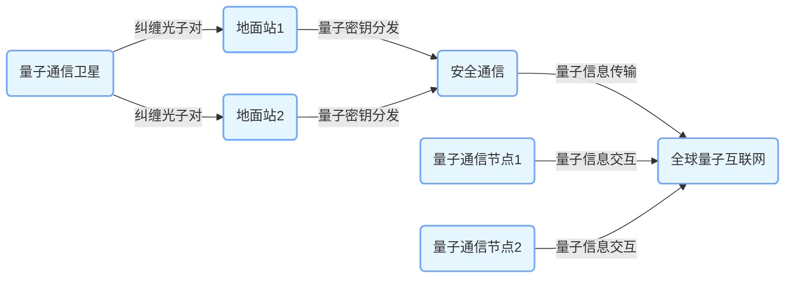

# 巴菲特 - 芒格的量子通信卫星网络投资：全球量子互联网的基础

> 关键词：巴菲特、芒格、量子通信卫星网络、全球量子互联网、投资、量子技术

> 摘要：本文围绕巴菲特 - 芒格对量子通信卫星网络的投资展开，深入探讨这一投资对于构建全球量子互联网的重要意义。文章先介绍相关背景知识，包括投资目的、预期读者等；接着阐述量子通信卫星网络和全球量子互联网的核心概念与联系，给出原理和架构的文本示意图及 Mermaid 流程图；详细讲解核心算法原理和具体操作步骤，结合 Python 代码；呈现相关数学模型和公式并举例说明；通过项目实战展示代码案例和详细解释；分析实际应用场景；推荐学习资源、开发工具框架和相关论文著作；最后总结未来发展趋势与挑战，解答常见问题并提供扩展阅读和参考资料。

## 1. 背景介绍 
### 1.1 目的和范围
巴菲特和芒格作为投资界的传奇人物，他们对量子通信卫星网络的投资引发了广泛关注。本文旨在深入剖析这一投资决策背后的逻辑，以及该投资如何成为全球量子互联网的基础。我们将探讨量子通信卫星网络的技术原理、应用场景、发展现状等方面，分析其与全球量子互联网的紧密联系。同时，我们也会关注这一投资在商业和技术层面的潜在影响，为投资者、技术爱好者和相关领域的专业人士提供全面的参考。

### 1.2 预期读者
本文预期读者包括对投资领域感兴趣的人士，尤其是关注科技投资方向的投资者；从事量子通信、卫星技术、互联网技术等相关领域的科研人员和工程师；对新兴技术发展趋势有研究需求的行业分析师和政策制定者；以及对前沿科技充满好奇，希望了解量子互联网未来发展的普通读者。

### 1.3 文档结构概述
本文将按照以下结构展开：首先介绍量子通信卫星网络和全球量子互联网的背景知识，包括相关术语和概念；接着详细阐述核心概念之间的联系，通过文本示意图和 Mermaid 流程图进行清晰展示；然后深入讲解核心算法原理和具体操作步骤，结合 Python 代码进行说明；随后介绍相关的数学模型和公式，并通过具体例子进行解释；通过项目实战部分展示代码案例和详细解读；分析量子通信卫星网络在不同场景下的实际应用；推荐相关的学习资源、开发工具框架和论文著作；最后总结未来发展趋势与挑战，解答常见问题并提供扩展阅读和参考资料。

### 1.4 术语表
#### 1.4.1 核心术语定义
- **量子通信**：利用量子力学原理对量子态进行操控，在两个地点之间进行信息交互的通信方式。它具有极高的安全性，因为量子态的测量会改变其状态，任何窃听行为都会被察觉。
- **量子通信卫星网络**：由多颗量子通信卫星组成的网络，用于实现全球范围内的量子通信。卫星可以作为量子信息的中继站，克服地面量子通信距离受限的问题。
- **全球量子互联网**：基于量子通信技术构建的全球性互联网，能够实现安全、高效的信息传输和处理，为未来的信息技术发展带来革命性的变化。
- **量子纠缠**：量子力学中的一种现象，两个或多个量子系统之间存在一种特殊的关联，使得一个系统的状态变化会立即影响到其他系统的状态，无论它们之间的距离有多远。
- **量子密钥分发**：利用量子力学原理在通信双方之间安全地分发密钥的技术，是量子通信的重要应用之一。

#### 1.4.2 相关概念解释
- **量子态**：量子系统的状态，它可以用波函数来描述。量子态具有叠加性和纠缠性等特性，是量子通信和量子计算的基础。
- **卫星通信**：利用人造地球卫星作为中继站进行通信的方式。卫星通信具有覆盖范围广、通信容量大等优点，但传统卫星通信存在安全隐患。
- **互联网**：将全球范围内的计算机和设备连接起来的网络，实现信息的共享和交换。目前的互联网主要基于经典通信技术，在安全性和传输效率方面存在一定的局限性。

#### 1.4.3 缩略词列表
- **QKD**：Quantum Key Distribution，量子密钥分发
- **QIS**：Quantum Information Science，量子信息科学
- **GPS**：Global Positioning System，全球定位系统

## 2. 核心概念与联系 

### 核心概念原理
#### 量子通信卫星网络原理
量子通信卫星网络的核心是利用卫星作为量子信息的中继站，实现远距离的量子通信。其工作原理基于量子纠缠和量子密钥分发技术。

量子纠缠是指两个或多个量子系统之间存在一种特殊的关联，使得一个系统的状态变化会立即影响到其他系统的状态，无论它们之间的距离有多远。在量子通信卫星网络中，卫星可以制备纠缠光子对，并将其中一个光子发送到地面站，另一个光子保留在卫星上。地面站接收到光子后，通过测量光子的量子态来获取信息。

量子密钥分发是利用量子力学原理在通信双方之间安全地分发密钥的技术。在量子通信卫星网络中，卫星可以将量子密钥分发给不同的地面站，地面站之间可以利用这些密钥进行安全的通信。

#### 全球量子互联网原理
全球量子互联网是基于量子通信技术构建的全球性互联网。它的原理是将全球范围内的量子通信节点连接起来，实现量子信息的传输和处理。

全球量子互联网的核心是量子纠缠交换和量子隐形传态技术。量子纠缠交换是指通过对两个纠缠光子对进行测量，使得原本没有直接纠缠关系的两个光子之间产生纠缠。量子隐形传态是指利用量子纠缠和经典通信技术，将一个量子系统的状态传输到另一个量子系统中。

### 架构的文本示意图
```plaintext
全球量子互联网
|
|-- 量子通信卫星网络
|   |
|   |-- 量子通信卫星
|   |   |
|   |   |-- 纠缠光子对制备模块
|   |   |-- 量子密钥分发模块
|   |   |-- 光子发射与接收模块
|   |
|   |-- 地面站
|       |
|       |-- 光子接收与测量模块
|       |-- 量子密钥存储与管理模块
|       |-- 安全通信模块
|
|-- 量子通信节点
|   |
|   |-- 量子计算机
|   |-- 量子传感器
|   |-- 其他量子设备
```

### Mermaid 流程图


## 3. 核心算法原理 & 具体操作步骤 

### 量子密钥分发算法原理
量子密钥分发的核心算法是 BB84 协议，它是由 Bennett 和 Brassard 在 1984 年提出的。BB84 协议利用量子态的叠加性和不可克隆定理来实现安全的密钥分发。

#### 算法步骤
1. **制备量子态**：发送方（Alice）随机选择一组基（X 基或 Z 基），并根据要发送的比特信息制备相应的量子态。例如，在 Z 基下，|0⟩ 表示比特 0，|1⟩ 表示比特 1；在 X 基下，|+⟩ = (|0⟩ + |1⟩) / √2 表示比特 0，| - ⟩ = (|0⟩ - |1⟩) / √2 表示比特 1。
2. **发送量子态**：Alice 将制备好的量子态发送给接收方（Bob）。
3. **测量量子态**：Bob 随机选择一组基（X 基或 Z 基）对接收到的量子态进行测量，并记录测量结果。
4. **基比对**：Alice 和 Bob 通过经典通信渠道公开他们所选择的基，但不公开测量结果。他们只保留那些选择相同基的测量结果。
5. **错误检测**：Alice 和 Bob 从保留的测量结果中随机选择一部分进行比较，计算错误率。如果错误率超过一定阈值，则认为存在窃听，密钥分发失败；否则，继续下一步。
6. **密钥提取**：Alice 和 Bob 从保留的测量结果中提取相同的比特序列，作为共享的密钥。

### Python 代码实现
```python
import random

# 定义量子态
Z0 = '|0>'
Z1 = '|1>'
X0 = '|+>'
X1 = '|->'

# 制备量子态
def prepare_qubits(length):
    qubits = []
    bases = []
    for _ in range(length):
        base = random.choice(['Z', 'X'])
        if base == 'Z':
            bit = random.choice([0, 1])
            if bit == 0:
                qubit = Z0
            else:
                qubit = Z1
        else:
            bit = random.choice([0, 1])
            if bit == 0:
                qubit = X0
            else:
                qubit = X1
        qubits.append(qubit)
        bases.append(base)
    return qubits, bases

# 测量量子态
def measure_qubits(qubits, bases):
    results = []
    for qubit, base in zip(qubits, bases):
        if base == 'Z':
            if qubit == Z0:
                result = 0
            elif qubit == Z1:
                result = 1
            else:
                # 如果基不匹配，随机测量
                result = random.choice([0, 1])
        else:
            if qubit == X0:
                result = 0
            elif qubit == X1:
                result = 1
            else:
                # 如果基不匹配，随机测量
                result = random.choice([0, 1])
        results.append(result)
    return results

# 基比对
def sift_bases(alice_bases, bob_bases, bob_results):
    sifted_key = []
    for i in range(len(alice_bases)):
        if alice_bases[i] == bob_bases[i]:
            sifted_key.append(bob_results[i])
    return sifted_key

# 错误检测
def error_detection(sifted_key, sample_size):
    sample_indices = random.sample(range(len(sifted_key)), sample_size)
    sample = [sifted_key[i] for i in sample_indices]
    # 模拟错误
    error_count = 0
    for i in sample_indices:
        if random.random() < 0.01:  # 1% 的错误率
            sifted_key[i] = 1 - sifted_key[i]
            error_count += 1
    error_rate = error_count / sample_size
    return error_rate, sifted_key

# 密钥提取
def key_extraction(sifted_key, sample_size):
    key = sifted_key[sample_size:]
    return key

# 主函数
def main():
    length = 100
    sample_size = 20

    # Alice 制备量子态
    alice_qubits, alice_bases = prepare_qubits(length)

    # Bob 测量量子态
    bob_bases = [random.choice(['Z', 'X']) for _ in range(length)]
    bob_results = measure_qubits(alice_qubits, bob_bases)

    # 基比对
    sifted_key = sift_bases(alice_bases, bob_bases, bob_results)

    # 错误检测
    error_rate, sifted_key = error_detection(sifted_key, sample_size)

    if error_rate < 0.05:
        # 密钥提取
        key = key_extraction(sifted_key, sample_size)
        print("密钥分发成功，密钥长度：", len(key))
        print("密钥：", key)
    else:
        print("密钥分发失败，错误率过高：", error_rate)

if __name__ == "__main__":
    main()
```

### 代码解释
1. **prepare_qubits 函数**：用于制备量子态。它随机选择基和比特信息，并根据选择的基制备相应的量子态。
2. **measure_qubits 函数**：用于测量量子态。它根据 Bob 选择的基对接收到的量子态进行测量，并记录测量结果。如果基不匹配，则随机测量。
3. **sift_bases 函数**：用于基比对。它比较 Alice 和 Bob 选择的基，只保留那些选择相同基的测量结果。
4. **error_detection 函数**：用于错误检测。它从保留的测量结果中随机选择一部分进行比较，计算错误率。如果错误率超过一定阈值，则认为存在窃听，密钥分发失败。
5. **key_extraction 函数**：用于密钥提取。它从保留的测量结果中提取相同的比特序列，作为共享的密钥。
6. **main 函数**：主函数，调用上述函数完成量子密钥分发的整个过程。

## 4. 数学模型和公式 & 详细讲解 & 举例说明 

### 量子态的数学表示
在量子力学中，量子态可以用希尔伯特空间中的向量来表示。例如，在二维希尔伯特空间中，基态 |0⟩ 和 |1⟩ 可以表示为：

$$
|0\rangle = \begin{pmatrix} 1 \\ 0 \end{pmatrix}, \quad |1\rangle = \begin{pmatrix} 0 \\ 1 \end{pmatrix}
$$

叠加态可以表示为基态的线性组合：

$$
|\psi\rangle = \alpha |0\rangle + \beta |1\rangle
$$

其中，$\alpha$ 和 $\beta$ 是复数，满足 $|\alpha|^2 + |\beta|^2 = 1$。$|\alpha|^2$ 表示测量结果为 0 的概率，$|\beta|^2$ 表示测量结果为 1 的概率。

### 量子纠缠的数学表示
以两个量子比特的纠缠态为例，贝尔态是一种典型的纠缠态，例如：

$$
|\Phi^+\rangle = \frac{1}{\sqrt{2}} (|00\rangle + |11\rangle)
$$

其中，$|00\rangle = |0\rangle \otimes |0\rangle$，$|11\rangle = |1\rangle \otimes |1\rangle$。

### 量子密钥分发的数学原理
在 BB84 协议中，假设 Alice 发送的量子态为 $|\psi\rangle$，Bob 选择的测量基为 $M$。测量结果的概率可以用投影算符来计算。

例如，在 Z 基下，测量算符为：

$$
P_0 = |0\rangle \langle 0| = \begin{pmatrix} 1 & 0 \\ 0 & 0 \end{pmatrix}, \quad P_1 = |1\rangle \langle 1| = \begin{pmatrix} 0 & 0 \\ 0 & 1 \end{pmatrix}
$$

测量结果为 0 的概率为：

$$
P(0) = \langle \psi | P_0 | \psi \rangle
$$

测量结果为 1 的概率为：

$$
P(1) = \langle \psi | P_1 | \psi \rangle
$$

### 举例说明
假设 Alice 制备的量子态为 $|\psi\rangle = \frac{1}{\sqrt{2}} (|0\rangle + |1\rangle)$，Bob 选择的测量基为 Z 基。

则测量结果为 0 的概率为：

$$
P(0) = \langle \psi | P_0 | \psi \rangle = \left( \frac{1}{\sqrt{2}} \langle 0| + \frac{1}{\sqrt{2}} \langle 1| \right) \begin{pmatrix} 1 & 0 \\ 0 & 0 \end{pmatrix} \left( \frac{1}{\sqrt{2}} |0\rangle + \frac{1}{\sqrt{2}} |1\rangle \right) = \frac{1}{2}
$$

测量结果为 1 的概率为：

$$
P(1) = \langle \psi | P_1 | \psi \rangle = \left( \frac{1}{\sqrt{2}} \langle 0| + \frac{1}{\sqrt{2}} \langle 1| \right) \begin{pmatrix} 0 & 0 \\ 0 & 1 \end{pmatrix} \left( \frac{1}{\sqrt{2}} |0\rangle + \frac{1}{\sqrt{2}} |1\rangle \right) = \frac{1}{2}
$$

这意味着在 Z 基下测量 $|\psi\rangle$，得到 0 和 1 的概率都是 $\frac{1}{2}$。

## 5. 项目实战：代码实际案例和详细解释说明 

### 5.1  开发环境搭建
#### 安装 Python
首先，需要安装 Python 环境。可以从 Python 官方网站（https://www.python.org/downloads/）下载适合自己操作系统的 Python 安装包，并按照安装向导进行安装。

#### 安装必要的库
在本项目中，只使用了 Python 的内置库，无需额外安装其他库。

### 5.2  源代码详细实现和代码解读
```python
import random

# 定义量子态
Z0 = '|0>'
Z1 = '|1>'
X0 = '|+>'
X1 = '|->'

# 制备量子态
def prepare_qubits(length):
    qubits = []
    bases = []
    for _ in range(length):
        base = random.choice(['Z', 'X'])
        if base == 'Z':
            bit = random.choice([0, 1])
            if bit == 0:
                qubit = Z0
            else:
                qubit = Z1
        else:
            bit = random.choice([0, 1])
            if bit == 0:
                qubit = X0
            else:
                qubit = X1
        qubits.append(qubit)
        bases.append(base)
    return qubits, bases

# 测量量子态
def measure_qubits(qubits, bases):
    results = []
    for qubit, base in zip(qubits, bases):
        if base == 'Z':
            if qubit == Z0:
                result = 0
            elif qubit == Z1:
                result = 1
            else:
                # 如果基不匹配，随机测量
                result = random.choice([0, 1])
        else:
            if qubit == X0:
                result = 0
            elif qubit == X1:
                result = 1
            else:
                # 如果基不匹配，随机测量
                result = random.choice([0, 1])
        results.append(result)
    return results

# 基比对
def sift_bases(alice_bases, bob_bases, bob_results):
    sifted_key = []
    for i in range(len(alice_bases)):
        if alice_bases[i] == bob_bases[i]:
            sifted_key.append(bob_results[i])
    return sifted_key

# 错误检测
def error_detection(sifted_key, sample_size):
    sample_indices = random.sample(range(len(sifted_key)), sample_size)
    sample = [sifted_key[i] for i in sample_indices]
    # 模拟错误
    error_count = 0
    for i in sample_indices:
        if random.random() < 0.01:  # 1% 的错误率
            sifted_key[i] = 1 - sifted_key[i]
            error_count += 1
    error_rate = error_count / sample_size
    return error_rate, sifted_key

# 密钥提取
def key_extraction(sifted_key, sample_size):
    key = sifted_key[sample_size:]
    return key

# 主函数
def main():
    length = 100
    sample_size = 20

    # Alice 制备量子态
    alice_qubits, alice_bases = prepare_qubits(length)

    # Bob 测量量子态
    bob_bases = [random.choice(['Z', 'X']) for _ in range(length)]
    bob_results = measure_qubits(alice_qubits, bob_bases)

    # 基比对
    sifted_key = sift_bases(alice_bases, bob_bases, bob_results)

    # 错误检测
    error_rate, sifted_key = error_detection(sifted_key, sample_size)

    if error_rate < 0.05:
        # 密钥提取
        key = key_extraction(sifted_key, sample_size)
        print("密钥分发成功，密钥长度：", len(key))
        print("密钥：", key)
    else:
        print("密钥分发失败，错误率过高：", error_rate)

if __name__ == "__main__":
    main()
```

### 代码解读与分析
#### 代码整体功能
这段代码实现了一个简单的量子密钥分发模拟程序，基于 BB84 协议。程序模拟了 Alice 制备量子态、Bob 测量量子态、基比对、错误检测和密钥提取等过程，最终判断密钥分发是否成功。

#### 具体函数分析
- **prepare_qubits 函数**：该函数用于制备量子态。它通过随机选择基和比特信息，生成相应的量子态。每次循环中，先随机选择一个基（Z 基或 X 基），然后根据基和随机比特信息确定量子态。最后将生成的量子态和基分别存储在 `qubits` 和 `bases` 列表中。
- **measure_qubits 函数**：该函数用于测量量子态。它根据 Bob 选择的基对接收到的量子态进行测量。如果基匹配，则根据量子态确定测量结果；如果基不匹配，则随机测量。测量结果存储在 `results` 列表中。
- **sift_bases 函数**：该函数用于基比对。它比较 Alice 和 Bob 选择的基，只保留那些选择相同基的测量结果。通过遍历 `alice_bases` 和 `bob_bases` 列表，将相同基对应的测量结果添加到 `sifted_key` 列表中。
- **error_detection 函数**：该函数用于错误检测。它从保留的测量结果中随机选择一部分进行比较，计算错误率。同时，模拟了 1% 的错误率，通过随机改变部分测量结果来模拟实际通信中的噪声和干扰。最后返回错误率和更新后的 `sifted_key` 列表。
- **key_extraction 函数**：该函数用于密钥提取。它从保留的测量结果中提取相同的比特序列，作为共享的密钥。通过截取 `sifted_key` 列表中除了用于错误检测的部分，得到最终的密钥。
- **main 函数**：主函数，调用上述函数完成量子密钥分发的整个过程。首先设置量子态的长度和用于错误检测的样本大小，然后依次调用 `prepare_qubits`、`measure_qubits`、`sift_bases`、`error_detection` 和 `key_extraction` 函数。根据错误率判断密钥分发是否成功，并输出相应的结果。

#### 代码复杂度分析
- **时间复杂度**：代码的主要操作是循环遍历列表，因此时间复杂度为 $O(n)$，其中 $n$ 是量子态的长度。
- **空间复杂度**：代码主要使用了几个列表来存储量子态、基和测量结果，因此空间复杂度也为 $O(n)$。

## 6. 实际应用场景 
### 金融领域
在金融领域，量子通信卫星网络和全球量子互联网的应用可以大大提高金融交易的安全性。金融机构每天都要处理大量的敏感信息，如客户账户信息、交易记录等。传统的通信方式存在被窃听和篡改的风险，而量子通信的安全性可以有效防止这些问题。

例如，银行之间的资金转账可以使用量子密钥分发技术来加密传输信息，确保交易的安全性和不可抵赖性。股票交易市场也可以利用量子通信技术来保证交易信息的实时、准确和安全传输，防止内幕交易和市场操纵。

### 政府和军事领域
政府和军事部门对信息安全的要求极高。量子通信卫星网络和全球量子互联网可以为政府和军事通信提供绝对的安全保障。

政府机构之间的机密文件传输、军事指挥系统的通信等都可以采用量子通信技术。量子通信的不可窃听性和不可克隆性可以确保信息在传输过程中的安全性，防止敌方获取重要情报。

### 医疗领域
在医疗领域，量子通信可以用于保护患者的隐私信息。医疗数据包含了患者的个人健康信息、病历记录等敏感内容，需要高度的安全保护。

医院之间的远程医疗会诊、医疗数据的共享等都可以利用量子通信技术来加密传输信息，确保患者的隐私不被泄露。同时，量子通信还可以提高医疗设备之间的通信安全性，保障医疗设备的正常运行。

### 科研领域
科研领域需要处理大量的敏感数据和机密信息，如科研成果、实验数据等。量子通信卫星网络和全球量子互联网可以为科研人员提供安全、高效的信息传输和共享平台。

例如，国际科研合作项目中，科研人员可以通过量子通信网络安全地共享实验数据和研究成果，促进科学研究的发展。

## 7. 工具和资源推荐
### 7.1 学习资源推荐
#### 7.1.1 书籍推荐
- 《量子信息与量子计算》：这本书全面介绍了量子信息科学的基本概念、原理和算法，是学习量子通信和量子计算的经典教材。
- 《量子力学导论》：量子力学是量子通信和量子计算的基础，这本书可以帮助读者深入理解量子力学的基本原理。
- 《量子密码学》：专门介绍量子密码学的书籍，详细讲解了量子密钥分发、量子签名等技术。

#### 7.1.2 在线课程
- Coursera 上的 “Quantum Mechanics for Scientists and Engineers”：该课程由知名教授授课，系统地介绍了量子力学的基本概念和应用。
- edX 上的 “Quantum Computing Fundamentals”：适合初学者学习量子计算的基础知识和算法。
- 中国大学 MOOC 上的 “量子通信原理与技术”：国内高校开设的课程，结合实际案例介绍量子通信的原理和应用。

#### 7.1.3 技术博客和网站
- Quantum Computing Report：提供量子计算和量子通信领域的最新研究进展和行业动态。
- IEEE Quantum Computing Initiative：IEEE 组织的量子计算倡议网站，包含了大量的学术论文和技术报告。
- 量子位：国内专注于量子科技领域的媒体平台，提供了丰富的科普文章和行业分析。

### 7.2 开发工具框架推荐
#### 7.2.1 IDE和编辑器
- PyCharm：一款专业的 Python 集成开发环境，提供了丰富的代码编辑、调试和测试功能，适合开发量子通信相关的 Python 代码。
- Visual Studio Code：一款轻量级的代码编辑器，支持多种编程语言，具有丰富的插件扩展功能，可以方便地进行量子代码的开发和调试。

#### 7.2.2 调试和性能分析工具
- Python 的内置调试器 pdb：可以帮助开发者在代码中设置断点，逐步执行代码，查看变量的值，方便调试量子通信代码。
- cProfile：Python 的性能分析工具，可以分析代码的执行时间和函数调用关系，帮助开发者优化代码性能。

#### 7.2.3 相关框架和库
- Qiskit：IBM 开发的开源量子计算框架，提供了量子电路设计、模拟和运行等功能，也可以用于量子通信的模拟和实验。
- Cirq：Google 开发的量子计算框架，支持量子比特操作、量子门应用等功能，适合进行量子通信算法的实现和测试。

### 7.3 相关论文著作推荐
#### 7.3.1 经典论文
- “Quantum cryptography based on Bell's theorem”：由 Bennett 和 Brassard 发表的经典论文，提出了基于贝尔定理的量子密码学方案。
- “Teleporting an unknown quantum state via dual classical and Einstein-Podolsky-Rosen channels”：首次提出了量子隐形传态的概念和方案。

#### 7.3.2 最新研究成果
- 定期关注 Nature、Science、Physical Review Letters 等顶级学术期刊，这些期刊会发表量子通信和量子计算领域的最新研究成果。
- 参加国际量子信息科学会议（QIP）、量子计算与通信国际会议（QCC）等学术会议，获取最新的研究动态和论文。

#### 7.3.3 应用案例分析
- 关注一些实际应用案例的研究报告，如中国的量子卫星通信项目“墨子号”的相关研究报告，了解量子通信技术在实际应用中的效果和挑战。

## 8. 总结：未来发展趋势与挑战
### 未来发展趋势
#### 技术融合
量子通信卫星网络将与其他新兴技术如人工智能、物联网等深度融合。例如，在物联网中，量子通信可以为海量设备之间的通信提供安全保障，而人工智能可以用于优化量子通信网络的资源分配和管理。

#### 全球布局
随着各国对量子通信技术的重视，全球范围内的量子通信卫星网络将逐步完善。更多的国家和地区将参与到量子互联网的建设中，形成全球性的量子通信网络，实现全球范围内的安全通信。

#### 商业应用拓展
量子通信技术将从科研和政府领域逐步拓展到商业领域。金融、医疗、能源等行业将越来越多地采用量子通信技术来保障信息安全，推动相关产业的发展。

### 挑战
#### 技术难题
虽然量子通信技术已经取得了一定的进展，但仍然面临着许多技术难题。例如，量子纠缠的保持和传输距离仍然有限，量子态的制备和测量精度有待提高等。解决这些技术难题需要大量的科研投入和技术创新。

#### 成本问题
量子通信卫星网络的建设和运营成本非常高。卫星的发射、维护和量子设备的研发都需要巨额资金。如何降低成本，提高量子通信技术的性价比，是推广应用的关键。

#### 标准和规范
目前，量子通信领域还缺乏统一的标准和规范。不同的量子通信设备和系统之间可能存在兼容性问题，这给量子互联网的建设和发展带来了一定的障碍。制定统一的标准和规范是推动量子通信技术发展的重要任务。

## 9. 附录：常见问题与解答
### 问题 1：量子通信卫星网络和传统卫星通信有什么区别？
解答：量子通信卫星网络基于量子力学原理，具有极高的安全性，因为量子态的测量会改变其状态，任何窃听行为都会被察觉。而传统卫星通信主要基于经典通信技术，存在被窃听和篡改的风险。此外，量子通信卫星网络可以实现量子密钥分发，为通信双方提供安全的密钥，而传统卫星通信通常使用传统的加密算法。

### 问题 2：量子互联网什么时候能够普及？
解答：量子互联网的普及还需要一定的时间。目前，量子通信技术仍然处于发展阶段，面临着许多技术难题和成本问题。随着技术的不断进步和成本的降低，预计在未来 10 - 20 年内，量子互联网可能会在一些特定领域得到广泛应用，如金融、政府和军事等领域。而要实现全球范围内的普及，可能还需要更长的时间。

### 问题 3：量子通信卫星网络的建设难度有多大？
解答：量子通信卫星网络的建设难度非常大。首先，需要解决量子纠缠的保持和传输问题，确保量子态在卫星和地面站之间的稳定传输。其次，卫星的发射和维护需要高精度的技术和大量的资金投入。此外，还需要解决量子设备的小型化、集成化和可靠性等问题，以适应卫星的工作环境。

### 问题 4：量子通信技术对现有通信行业会产生什么影响？
解答：量子通信技术将对现有通信行业产生深远的影响。一方面，它将为通信行业提供更高的安全性，满足一些对信息安全要求极高的领域的需求，如金融、政府和军事等领域。另一方面，量子通信技术的发展也将推动通信行业的技术创新和升级，促进相关产业的发展。然而，量子通信技术的普及还需要一定的时间，在短期内不会完全取代传统通信技术。

## 10. 扩展阅读 & 参考资料
### 扩展阅读
- 《上帝掷骰子吗？量子物理史话》：以生动有趣的方式介绍了量子力学的发展历程，适合对量子物理感兴趣的读者阅读。
- 《未来简史：从智人到神人》：探讨了新兴技术如量子技术、人工智能等对人类社会未来发展的影响。

### 参考资料
- 潘建伟等. 量子卫星“墨子号”实现千公里级量子纠缠分发[J]. 科学通报, 2017, 62(24): 2663 - 2667.
- Bennett C H, Brassard G. Quantum cryptography: Public key distribution and coin tossing[C]//Proceedings of IEEE international conference on computers, systems, and signal processing. 1984: 175 - 179.

作者：AI天才研究院/AI Genius Institute & 禅与计算机程序设计艺术 /Zen And The Art of Computer Programming