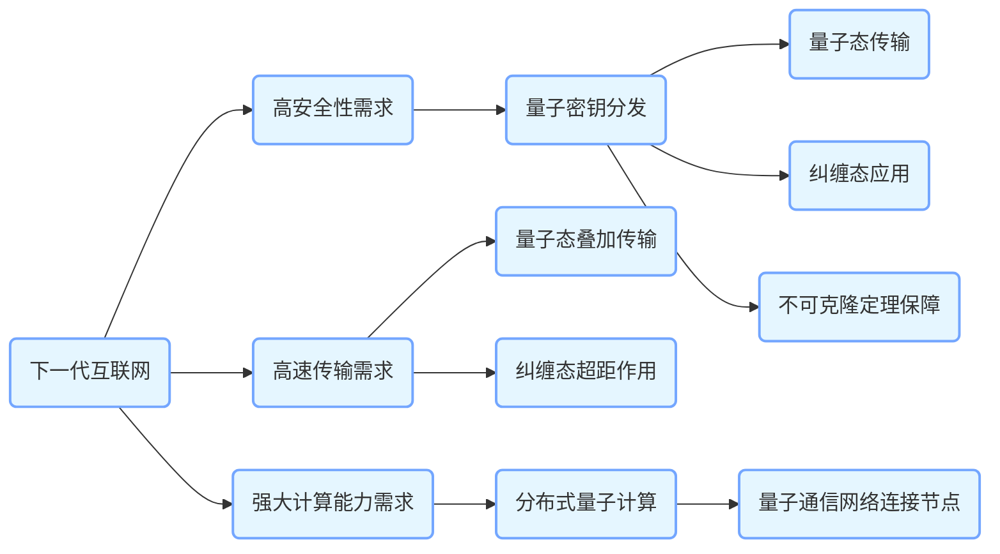

# 巴菲特 - 芒格的量子通信网络投资：下一代互联网的基础

> 关键词：巴菲特、芒格、量子通信网络、下一代互联网、投资、量子技术

> 摘要：本文深入探讨了巴菲特和芒格对量子通信网络的投资决策，剖析量子通信网络作为下一代互联网基础的重要性。通过阐述量子通信的核心概念、算法原理、数学模型，结合实际项目案例和应用场景，分析其在未来互联网发展中的潜力。同时提供相关学习资源、开发工具和论文著作推荐，最后总结量子通信网络的未来发展趋势与挑战，旨在为读者全面呈现这一前沿领域的面貌。

## 1. 背景介绍 

### 1.1 目的和范围
本文章的主要目的是详细解读巴菲特和芒格投资量子通信网络这一事件背后的意义，深入分析量子通信网络为何被视为下一代互联网的基础。文章将涵盖量子通信的核心概念、算法原理、数学模型、实际应用案例等多个方面，旨在为读者提供一个全面且深入的关于量子通信网络的知识体系，同时探讨其在未来互联网发展中的重要性和潜力。

### 1.2 预期读者
本文预期读者包括对投资领域感兴趣，尤其是关注巴菲特和芒格投资策略的投资者；从事计算机科学、通信工程等相关领域的专业技术人员；对前沿科技发展趋势有研究需求的学者和学生；以及对下一代互联网发展充满好奇的普通科技爱好者。

### 1.3 文档结构概述
文章将按照以下结构展开：首先介绍量子通信网络的核心概念以及与下一代互联网的联系；接着详细阐述量子通信的核心算法原理和具体操作步骤，并用 Python 代码进行示例；然后讲解量子通信涉及的数学模型和公式，并举例说明；再通过实际项目案例展示量子通信网络的开发过程和代码实现；之后探讨量子通信网络的实际应用场景；推荐相关的学习资源、开发工具和论文著作；最后总结量子通信网络的未来发展趋势与挑战，并附上常见问题解答和扩展阅读参考资料。

### 1.4 术语表

#### 1.4.1 核心术语定义
- **量子通信**：利用量子力学原理对量子态进行操控，在两个或多个地点之间进行信息传递的通信方式。与传统通信相比，它具有更高的安全性和传输效率。
- **量子比特（qubit）**：量子信息的基本单位，与经典比特（0 或 1）不同，量子比特可以处于 0 和 1 的叠加态，即同时具有 0 和 1 的特征。
- **纠缠态**：是多个量子系统之间的一种特殊关联状态，处于纠缠态的量子系统之间存在一种超距的相互作用，一个量子的状态发生变化，另一个量子的状态会立即相应变化，无论它们之间的距离有多远。
- **量子密钥分发（QKD）**：基于量子力学原理实现安全密钥分发的技术，确保通信双方能够安全地共享密钥，从而保证通信内容的保密性。

#### 1.4.2 相关概念解释
- **叠加原理**：量子系统可以同时处于多个不同状态的叠加，直到进行测量时才会坍缩到一个确定的状态。例如，一个量子比特可以同时处于 0 和 1 的叠加态，这是量子计算和量子通信的重要基础。
- **不可克隆定理**：量子态不能被精确地复制。这一特性保证了量子通信的安全性，因为任何试图窃取信息的行为都会改变量子态，从而被通信双方察觉。
- **量子隐形传态**：利用量子纠缠实现将一个量子态从一个地点传输到另一个地点的技术，虽然不是真正意义上的物质传输，但可以实现量子信息的远程传递。

#### 1.4.3 缩略词列表
- **QKD**：Quantum Key Distribution（量子密钥分发）
- **qubit**：Quantum bit（量子比特）

## 2. 核心概念与联系 

### 量子通信网络的核心概念
量子通信网络是基于量子力学原理构建的通信网络，其核心是利用量子态来传输和处理信息。与传统通信网络不同，量子通信网络具有独特的优势，如绝对的安全性和高效的信息传输能力。

#### 量子比特
量子比特是量子通信的基本信息单元。在经典计算机中，比特只能处于 0 或 1 两种状态之一，而量子比特可以处于 0 和 1 的叠加态，用数学表达式表示为：

$$|\psi\rangle = \alpha|0\rangle + \beta|1\rangle$$

其中，$\alpha$ 和 $\beta$ 是复数，满足 $|\alpha|^2 + |\beta|^2 = 1$。$|\alpha|^2$ 表示测量时量子比特处于 $|0\rangle$ 状态的概率，$|\beta|^2$ 表示处于 $|1\rangle$ 状态的概率。

#### 纠缠态
纠缠态是量子通信中的重要概念。当两个或多个量子系统处于纠缠态时，它们之间存在一种特殊的关联，使得对其中一个量子的测量会立即影响到其他量子的状态，无论它们之间的距离有多远。例如，两个纠缠的量子比特可以表示为：

$$|\Psi\rangle = \frac{1}{\sqrt{2}}(|00\rangle + |11\rangle)$$

这种纠缠特性为量子通信的安全性和高效性提供了基础。

### 量子通信网络与下一代互联网的联系
下一代互联网需要更高的安全性、更快的传输速度和更强的处理能力。量子通信网络正好满足这些需求，它可以为下一代互联网提供以下支持：

#### 绝对安全的通信
基于量子不可克隆定理，量子通信网络可以实现绝对安全的密钥分发。在量子密钥分发过程中，任何试图窃取密钥的行为都会改变量子态，从而被通信双方察觉。这使得通信内容在传输过程中得到了绝对的保护，避免了信息泄露的风险。

#### 高速信息传输
量子通信利用量子态的叠加和纠缠特性，可以实现超高速的信息传输。与传统通信相比，量子通信可以在更短的时间内传输更多的信息，满足下一代互联网对高速数据传输的需求。

#### 分布式量子计算
量子通信网络可以将多个量子计算节点连接起来，实现分布式量子计算。这将大大提高计算能力，为下一代互联网的复杂计算任务提供支持。

### 文本示意图
```plaintext
下一代互联网
|
|-- 高安全性需求
|   |-- 量子密钥分发
|   |   |-- 量子态传输
|   |   |-- 纠缠态应用
|   |   |-- 不可克隆定理保障
|
|-- 高速传输需求
|   |-- 量子态叠加传输
|   |-- 纠缠态超距作用
|
|-- 强大计算能力需求
|   |-- 分布式量子计算
|   |   |-- 量子通信网络连接节点
```

### Mermaid 流程图


## 3. 核心算法原理 & 具体操作步骤 

### 量子密钥分发（QKD）算法原理
量子密钥分发是量子通信网络中实现安全密钥共享的核心技术。其中，最著名的 QKD 协议是 BB84 协议，下面详细介绍其原理和操作步骤。

#### BB84 协议原理
BB84 协议基于量子比特的不同偏振态来编码信息。通常使用两种相互共轭的基：直线基（$|0\rangle$ 和 $|1\rangle$）和对角基（$|+\rangle$ 和 $|-\rangle$），其中 $|+\rangle = \frac{1}{\sqrt{2}}(|0\rangle + |1\rangle)$，$|-\rangle = \frac{1}{\sqrt{2}}(|0\rangle - |1\rangle)$。

发送方（Alice）随机选择基和比特值，制备相应的量子比特并发送给接收方（Bob）。Bob 也随机选择基对接收到的量子比特进行测量。测量后，Alice 和 Bob 通过经典通信渠道公开他们所使用的基，但不公开比特值。只有当他们使用相同的基时，测量结果才是有效的，这些有效的测量结果就构成了共享密钥。

#### Python 代码实现
```python
import random

# 定义量子比特的基
LINEAR_BASIS = 0
DIAGONAL_BASIS = 1

# 生成随机比特序列
def generate_random_bits(length):
    return [random.randint(0, 1) for _ in range(length)]

# 生成随机基序列
def generate_random_bases(length):
    return [random.randint(0, 1) for _ in range(length)]

# 制备量子比特
def prepare_qubits(bits, bases):
    qubits = []
    for bit, basis in zip(bits, bases):
        if basis == LINEAR_BASIS:
            if bit == 0:
                qubits.append('|0>')
            else:
                qubits.append('|1>')
        else:
            if bit == 0:
                qubits.append('|+>')
            else:
                qubits.append('|->')
    return qubits

# 测量量子比特
def measure_qubits(qubits, bases):
    results = []
    for qubit, basis in zip(qubits, bases):
        if basis == LINEAR_BASIS:
            if qubit == '|0>':
                results.append(0)
            elif qubit == '|1>':
                results.append(1)
            else:
                # 随机测量结果
                results.append(random.randint(0, 1))
        else:
            if qubit == '|+>':
                results.append(0)
            elif qubit == '|->':
                results.append(1)
            else:
                # 随机测量结果
                results.append(random.randint(0, 1))
    return results

# 筛选有效比特
def sift_bits(alice_bits, alice_bases, bob_bases):
    sifted_bits = []
    for i in range(len(alice_bits)):
        if alice_bases[i] == bob_bases[i]:
            sifted_bits.append(alice_bits[i])
    return sifted_bits

# 主函数
def bb84_protocol(key_length):
    # 生成随机比特和基
    alice_bits = generate_random_bits(key_length)
    alice_bases = generate_random_bases(key_length)
    bob_bases = generate_random_bases(key_length)

    # 制备和测量量子比特
    qubits = prepare_qubits(alice_bits, alice_bases)
    bob_results = measure_qubits(qubits, bob_bases)

    # 筛选有效比特
    sifted_key = sift_bits(alice_bits, alice_bases, bob_bases)

    return sifted_key

# 示例运行
key_length = 100
shared_key = bb84_protocol(key_length)
print("Shared key length:", len(shared_key))
print("Shared key:", shared_key)
```

### 具体操作步骤
1. **生成随机比特和基**：Alice 生成一个随机的比特序列和一个随机的基序列，Bob 也生成一个随机的基序列。
2. **制备量子比特**：Alice 根据她的比特值和基制备相应的量子比特，并将其发送给 Bob。
3. **测量量子比特**：Bob 用他的基对接收到的量子比特进行测量，得到测量结果。
4. **公开基信息**：Alice 和 Bob 通过经典通信渠道公开他们所使用的基。
5. **筛选有效比特**：只有当 Alice 和 Bob 使用相同的基时，测量结果才是有效的。他们根据基的匹配情况筛选出有效的比特，这些比特构成了共享密钥。

## 4. 数学模型和公式 & 详细讲解 & 举例说明 

### 量子态的数学表示
量子态可以用希尔伯特空间中的向量来表示。对于一个量子比特，其状态可以表示为二维希尔伯特空间中的向量：

$$|\psi\rangle = \alpha|0\rangle + \beta|1\rangle$$

其中，$|0\rangle$ 和 $|1\rangle$ 是基向量，$\alpha$ 和 $\beta$ 是复数，满足 $|\alpha|^2 + |\beta|^2 = 1$。$|\alpha|^2$ 表示测量时量子比特处于 $|0\rangle$ 状态的概率，$|\beta|^2$ 表示处于 $|1\rangle$ 状态的概率。

例如，当 $\alpha = \frac{1}{\sqrt{2}}$，$\beta = \frac{1}{\sqrt{2}}$ 时，量子比特处于叠加态：

$$|\psi\rangle = \frac{1}{\sqrt{2}}(|0\rangle + |1\rangle)$$

测量这个量子比特时，处于 $|0\rangle$ 状态和 $|1\rangle$ 状态的概率都是 $\frac{1}{2}$。

### 量子门的数学表示
量子门是对量子比特进行操作的基本单元，类似于经典计算机中的逻辑门。常见的量子门有 Pauli 门、Hadamard 门等。

#### Pauli-X 门
Pauli-X 门相当于经典逻辑门中的 NOT 门，它将 $|0\rangle$ 态转换为 $|1\rangle$ 态，将 $|1\rangle$ 态转换为 $|0\rangle$ 态。其矩阵表示为：

$$X = \begin{pmatrix}
0 & 1 \\
1 & 0
\end{pmatrix}$$

对量子比特 $|\psi\rangle = \alpha|0\rangle + \beta|1\rangle$ 应用 Pauli-X 门的结果为：

$$X|\psi\rangle = \begin{pmatrix}
0 & 1 \\
1 & 0
\end{pmatrix}\begin{pmatrix}
\alpha \\
\beta
\end{pmatrix} = \begin{pmatrix}
\beta \\
\alpha
\end{pmatrix} = \beta|0\rangle + \alpha|1\rangle$$

#### Hadamard 门
Hadamard 门用于创建和消除量子比特的叠加态，其矩阵表示为：

$$H = \frac{1}{\sqrt{2}}\begin{pmatrix}
1 & 1 \\
1 & -1
\end{pmatrix}$$

对 $|0\rangle$ 态应用 Hadamard 门的结果为：

$$H|0\rangle = \frac{1}{\sqrt{2}}\begin{pmatrix}
1 & 1 \\
1 & -1
\end{pmatrix}\begin{pmatrix}
1 \\
0
\end{pmatrix} = \frac{1}{\sqrt{2}}\begin{pmatrix}
1 \\
1
\end{pmatrix} = \frac{1}{\sqrt{2}}(|0\rangle + |1\rangle)$$

### 量子纠缠态的数学表示
以两个量子比特的纠缠态为例，最常见的纠缠态是贝尔态：

#### 贝尔态 $|\Phi^+\rangle$
$$|\Phi^+\rangle = \frac{1}{\sqrt{2}}(|00\rangle + |11\rangle)$$

这个态表示两个量子比特之间存在一种特殊的关联，测量其中一个量子比特的结果会立即确定另一个量子比特的状态。例如，如果测量第一个量子比特得到 $|0\rangle$，那么第二个量子比特必然处于 $|0\rangle$ 态；如果测量第一个量子比特得到 $|1\rangle$，那么第二个量子比特必然处于 $|1\rangle$ 态。

### 量子密钥分发的数学原理
在 BB84 协议中，假设 Alice 发送的量子比特处于状态 $|\psi\rangle$，Bob 用基 $B$ 进行测量。根据量子力学的测量原理，测量结果的概率可以通过投影算符来计算。

例如，当 Alice 发送的量子比特处于 $|0\rangle$ 态，Bob 用直线基（$|0\rangle$ 和 $|1\rangle$）进行测量时，测量得到 $|0\rangle$ 态的概率为：

$$P(|0\rangle) = |\langle 0|\psi\rangle|^2 = |\langle 0|0\rangle|^2 = 1$$

测量得到 $|1\rangle$ 态的概率为：

$$P(|1\rangle) = |\langle 1|\psi\rangle|^2 = |\langle 1|0\rangle|^2 = 0$$

当 Bob 用对角基（$|+\rangle$ 和 $|-\rangle$）进行测量时，测量得到 $|+\rangle$ 态的概率为：

$$P(|+\rangle) = |\langle +|0\rangle|^2 = |\frac{1}{\sqrt{2}}(\langle 0| + \langle 1|)|0\rangle|^2 = \frac{1}{2}$$

测量得到 $|-\rangle$ 态的概率也为 $\frac{1}{2}$。

## 5. 项目实战：代码实际案例和详细解释说明 

### 5.1  开发环境搭建
为了实现量子通信网络的项目实战，我们可以使用 Python 语言和 Qiskit 库。Qiskit 是 IBM 开发的一个开源量子计算框架，提供了丰富的工具和接口，方便我们进行量子电路的设计、模拟和实验。

#### 安装 Python
首先，确保你已经安装了 Python 3.6 或更高版本。你可以从 Python 官方网站（https://www.python.org/downloads/）下载并安装 Python。

#### 安装 Qiskit
使用以下命令安装 Qiskit：
```sh
pip install qiskit
```

### 5.2  源代码详细实现和代码解读
下面是一个使用 Qiskit 实现 BB84 协议的示例代码：
```python
import numpy as np
from qiskit import QuantumCircuit, Aer, execute
from qiskit.visualization import plot_histogram

# 生成随机比特序列
def generate_random_bits(length):
    return np.random.randint(2, size=length)

# 生成随机基序列
def generate_random_bases(length):
    return np.random.randint(2, size=length)

# 制备量子比特
def prepare_qubits(alice_bits, alice_bases):
    circuits = []
    for bit, basis in zip(alice_bits, alice_bases):
        qc = QuantumCircuit(1, 1)
        if bit == 1:
            qc.x(0)
        if basis == 1:
            qc.h(0)
        qc.barrier()
        circuits.append(qc)
    return circuits

# 测量量子比特
def measure_qubits(circuits, bob_bases):
    results = []
    backend = Aer.get_backend('qasm_simulator')
    for qc, basis in zip(circuits, bob_bases):
        if basis == 1:
            qc.h(0)
        qc.measure(0, 0)
        job = execute(qc, backend, shots=1, memory=True)
        result = job.result().get_memory()[0]
        results.append(int(result))
    return results

# 筛选有效比特
def sift_bits(alice_bits, alice_bases, bob_bases, bob_results):
    sifted_bits = []
    for i in range(len(alice_bits)):
        if alice_bases[i] == bob_bases[i]:
            sifted_bits.append(alice_bits[i])
    return sifted_bits

# 主函数
def bb84_protocol(key_length):
    # 生成随机比特和基
    alice_bits = generate_random_bits(key_length)
    alice_bases = generate_random_bases(key_length)
    bob_bases = generate_random_bases(key_length)

    # 制备和测量量子比特
    circuits = prepare_qubits(alice_bits, alice_bases)
    bob_results = measure_qubits(circuits, bob_bases)

    # 筛选有效比特
    sifted_key = sift_bits(alice_bits, alice_bases, bob_bases, bob_results)

    return sifted_key

# 示例运行
key_length = 100
shared_key = bb84_protocol(key_length)
print("Shared key length:", len(shared_key))
print("Shared key:", shared_key)
```

### 代码解读与分析
1. **生成随机比特和基**：`generate_random_bits` 函数和 `generate_random_bases` 函数分别用于生成随机的比特序列和基序列。
2. **制备量子比特**：`prepare_qubits` 函数根据 Alice 的比特值和基制备相应的量子比特。如果比特值为 1，则应用 Pauli-X 门；如果基为对角基，则应用 Hadamard 门。
3. **测量量子比特**：`measure_qubits` 函数根据 Bob 的基对量子比特进行测量。如果基为对角基，则先应用 Hadamard 门，然后进行测量。
4. **筛选有效比特**：`sift_bits` 函数根据 Alice 和 Bob 使用的基是否相同，筛选出有效的比特，这些比特构成了共享密钥。
5. **主函数**：`bb84_protocol` 函数将上述步骤组合起来，完成整个 BB84 协议的执行。

通过这个示例代码，我们可以看到如何使用 Qiskit 实现量子密钥分发，并且可以观察到共享密钥的生成过程。

## 6. 实际应用场景 
### 金融领域
在金融交易中，安全性是至关重要的。量子通信网络可以为金融机构提供绝对安全的通信渠道，确保交易信息的保密性和完整性。例如，银行之间的资金转移、证券交易等过程中，使用量子密钥分发可以防止信息被窃取和篡改，保障金融系统的稳定运行。

### 政府和军事领域
政府和军事部门对信息安全有着极高的要求。量子通信网络可以用于军事指挥、情报传递等重要场景，确保国家机密信息的安全传输。由于量子通信的不可窃听特性，即使敌方试图截取信息，也会被立即察觉，从而提高了信息的安全性和可靠性。

### 云计算和大数据领域
随着云计算和大数据技术的发展，数据的存储和传输面临着越来越大的安全挑战。量子通信网络可以为云计算和大数据中心提供安全的通信链路，保护用户数据的隐私。例如，在云存储中，使用量子密钥对数据进行加密，可以防止数据在传输和存储过程中被泄露。

### 互联网通信领域
下一代互联网需要更高的安全性和更快的传输速度。量子通信网络可以为互联网通信提供安全的基础设施，如安全的视频通话、加密的电子邮件等。同时，量子通信的高速传输特性也可以满足未来互联网对大数据流量的需求。

## 7. 工具和资源推荐
### 7.1 学习资源推荐

#### 7.1.1 书籍推荐
- 《量子计算与量子信息》（*Quantum Computation and Quantum Information*）：由 Michael A. Nielsen 和 Isaac L. Chuang 所著，是量子计算和量子信息领域的经典教材，全面介绍了量子计算和量子通信的基本原理和算法。
- 《量子力学原理》（*The Principles of Quantum Mechanics*）：由 Paul Dirac 所著，是量子力学领域的经典著作，对量子力学的基本原理和数学基础进行了深入的阐述。
- 《量子通信技术》：介绍了量子通信的基本概念、技术原理和应用场景，适合对量子通信感兴趣的初学者。

#### 7.1.2 在线课程
- Coursera 上的“量子计算基础”（*Foundations of Quantum Computing*）课程：由澳大利亚新南威尔士大学的教授授课，系统介绍了量子计算的基本概念和算法。
- edX 上的“量子信息科学与工程”（*Quantum Information Science and Engineering*）课程：由 MIT 的教授授课，涵盖了量子比特、量子门、量子算法等内容。

#### 7.1.3 技术博客和网站
- Quantum Computing Report（https://www.quantumcomputingreport.com/）：提供量子计算和量子通信领域的最新技术动态和研究成果。
- Qiskit 官方博客（https://medium.com/qiskit）：Qiskit 是 IBM 开发的量子计算框架，其官方博客提供了关于量子计算和量子通信的教程、案例和研究进展。

### 7.2 开发工具框架推荐

#### 7.2.1 IDE和编辑器
- Jupyter Notebook：是一个交互式的开发环境，适合进行量子计算和量子通信的实验和代码编写。可以方便地展示代码、图表和文本说明。
- PyCharm：是一款功能强大的 Python 集成开发环境，提供了丰富的代码编辑、调试和分析工具，适合开发大规模的量子通信项目。

#### 7.2.2 调试和性能分析工具
- Qiskit Aer：是 Qiskit 提供的量子模拟后端，可以用于模拟量子电路的运行，方便进行调试和性能分析。
- Quantum Inspire：是一个在线的量子计算平台，提供了量子电路的模拟和实验功能，同时支持多种编程语言。

#### 7.2.3 相关框架和库
- Qiskit：是 IBM 开发的开源量子计算框架，提供了丰富的工具和接口，方便进行量子电路的设计、模拟和实验。
- Cirq：是 Google 开发的量子计算框架，支持量子电路的创建、模拟和优化。
- Strawberry Fields：是 Xanadu 开发的基于连续变量的量子计算框架，适用于量子光学和量子通信领域。

### 7.3 相关论文著作推荐

#### 7.3.1 经典论文
- Bennett, C. H., & Brassard, G. (1984). Quantum cryptography: Public key distribution and coin tossing. *Proceedings of IEEE International Conference on Computers, Systems, and Signal Processing*, 175-179. 这篇论文提出了著名的 BB84 量子密钥分发协议，是量子通信领域的经典之作。
- Einstein, A., Podolsky, B., & Rosen, N. (1935). Can quantum-mechanical description of physical reality be considered complete? *Physical Review*, 47(10), 777-780. 这篇论文提出了 EPR 佯谬，引发了对量子纠缠和量子力学完备性的深入讨论。

#### 7.3.2 最新研究成果
- 关注 Nature、Science、Physical Review Letters 等顶级学术期刊，这些期刊经常发表量子通信领域的最新研究成果。
- 参加国际量子通信会议，如 Quantum Information Processing Conference（QIP）、International Conference on Quantum Communication, Measurement and Computing（QCMC）等，了解最新的研究动态和技术进展。

#### 7.3.3 应用案例分析
- 研究 IBM、Google 等科技公司在量子通信领域的应用案例，了解他们如何将量子通信技术应用于实际项目中。
- 分析金融、政府、军事等领域的量子通信应用案例，学习如何解决实际问题和提高信息安全水平。

## 8. 总结：未来发展趋势与挑战
### 未来发展趋势
#### 大规模量子通信网络的建设
随着技术的不断进步，未来有望建设大规模的量子通信网络，实现全球范围内的安全通信。这将为金融、政府、军事等领域提供更可靠的信息安全保障。

#### 量子通信与其他技术的融合
量子通信将与人工智能、物联网、区块链等技术深度融合，创造出更多的应用场景和商业价值。例如，量子加密的区块链可以提高区块链的安全性和可扩展性。

#### 量子计算与量子通信的协同发展
量子计算和量子通信是相辅相成的技术。未来，量子计算的发展将为量子通信提供更强大的计算能力，而量子通信的安全保障将为量子计算的应用提供支持。

### 挑战
#### 技术难题
目前，量子通信技术还面临着许多技术难题，如量子比特的稳定性、量子纠缠的远距离传输、量子噪声的控制等。解决这些技术难题需要大量的研究和实验。

#### 成本问题
量子通信设备的制造和维护成本较高，限制了其大规模应用。未来需要降低成本，提高量子通信设备的性价比，以促进其广泛应用。

#### 标准和规范的制定
随着量子通信技术的发展，需要制定相应的标准和规范，确保不同厂家的量子通信设备之间的兼容性和互操作性。

## 9. 附录：常见问题与解答
### 量子通信是否可以实现超光速通信？
量子通信不能实现超光速通信。虽然量子纠缠具有超距作用，但它不能用于直接传输信息。在量子通信中，信息的传输仍然需要通过经典通信渠道，因此通信速度不会超过光速。

### 量子通信是否绝对安全？
在理论上，基于量子力学原理的量子通信具有绝对的安全性。但在实际应用中，由于设备的不完善和环境的干扰，可能会存在一定的安全风险。因此，需要不断改进技术和设备，提高量子通信的安全性。

### 量子通信与传统通信相比有哪些优势？
量子通信与传统通信相比，具有更高的安全性和传输效率。量子通信基于量子不可克隆定理，可以实现绝对安全的密钥分发，避免信息被窃取和篡改。同时，量子通信利用量子态的叠加和纠缠特性，可以实现超高速的信息传输。

### 量子通信网络的建设需要哪些条件？
量子通信网络的建设需要具备先进的量子通信技术、可靠的量子通信设备、稳定的通信基础设施和专业的技术人才。同时，还需要解决量子比特的稳定性、量子纠缠的远距离传输等技术难题。

## 10. 扩展阅读 & 参考资料
- Nielsen, M. A., & Chuang, I. L. (2000). *Quantum Computation and Quantum Information*. Cambridge University Press.
- Dirac, P. A. M. (1930). *The Principles of Quantum Mechanics*. Oxford University Press.
- Bennett, C. H., & Brassard, G. (1984). Quantum cryptography: Public key distribution and coin tossing. *Proceedings of IEEE International Conference on Computers, Systems, and Signal Processing*, 175-179.
- Einstein, A., Podolsky, B., & Rosen, N. (1935). Can quantum-mechanical description of physical reality be considered complete? *Physical Review*, 47(10), 777-780.
- Qiskit 官方文档：https://qiskit.org/documentation/
- Cirq 官方文档：https://cirq.readthedocs.io/en/stable/
- Strawberry Fields 官方文档：https://strawberryfields.ai/

作者：AI天才研究院/AI Genius Institute & 禅与计算机程序设计艺术 /Zen And The Art of Computer Programming