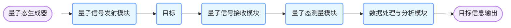
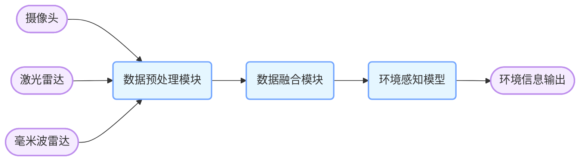

# 巴菲特 - 芒格的量子雷达和传感器融合技术投资：智能交通的基石

> 关键词：巴菲特 - 芒格投资、量子雷达、传感器融合技术、智能交通、投资价值

> 摘要：本文深入探讨了巴菲特 - 芒格对量子雷达和传感器融合技术的投资，阐述了这两项技术的核心概念、原理及算法，分析了其数学模型，并结合实际案例展示了在智能交通领域的应用。同时，介绍了相关的学习资源、开发工具和研究论文，最后对未来发展趋势与挑战进行了总结，旨在揭示这两项技术作为智能交通基石的重要性及投资价值。

## 1. 背景介绍 
### 1.1 目的和范围
本博客的目的是全面剖析巴菲特 - 芒格对量子雷达和传感器融合技术投资背后的逻辑，以及这两项技术在智能交通领域的关键作用。范围涵盖了从技术的基本概念、原理算法到实际应用场景，同时探讨投资决策与技术发展的关联，为读者提供一个深入了解这一投资领域的综合性视角。

### 1.2 预期读者
预期读者包括对智能交通技术、量子雷达和传感器融合技术感兴趣的科技爱好者，关注投资领域的金融从业者，以及从事相关技术研究和开发的专业人员。

### 1.3 文档结构概述
本文首先介绍相关背景信息，接着阐述量子雷达和传感器融合技术的核心概念与联系，然后详细讲解核心算法原理和操作步骤，分析数学模型和公式，通过项目实战展示代码案例和解释，探讨实际应用场景，推荐学习资源、开发工具和相关论文，最后总结未来发展趋势与挑战，并提供常见问题解答和扩展阅读参考资料。

### 1.4 术语表
#### 1.4.1 核心术语定义
- **量子雷达**：基于量子力学原理工作的雷达系统，利用量子态的特性来实现更高效、更精确的目标探测和识别。
- **传感器融合技术**：将来自多个不同类型传感器的数据进行整合和处理，以获得更全面、准确的环境信息。
- **智能交通**：运用先进的信息技术、通信技术、控制技术等，实现交通运输系统的智能化管理和运行。

#### 1.4.2 相关概念解释
- **量子态**：量子系统的一种状态描述，具有叠加、纠缠等独特性质，量子雷达利用这些性质来提高探测性能。
- **数据融合**：传感器融合技术中的关键步骤，通过对多个传感器数据的处理和分析，消除数据中的冗余和矛盾，提取有用信息。

#### 1.4.3 缩略词列表
- **AI**：Artificial Intelligence，人工智能
- **IoT**：Internet of Things，物联网
- **MIMO**：Multiple - Input Multiple - Output，多输入多输出

## 2. 核心概念与联系 
### 量子雷达的原理与架构
量子雷达是基于量子力学原理的新一代雷达技术。传统雷达通过发射电磁波并接收目标反射回波来探测目标，而量子雷达则利用量子态的特性，如量子纠缠和量子叠加。

量子纠缠是指两个或多个量子系统之间存在一种特殊的关联，使得一个量子系统的状态变化会瞬间影响到其他与之纠缠的量子系统。量子雷达可以利用纠缠光子对进行探测，其中一个光子被发射出去，另一个留在雷达端。当发射的光子与目标相互作用后，其状态会发生变化，通过检测留在雷达端的纠缠光子的状态变化，就可以获取目标的信息。

量子叠加是指量子系统可以同时处于多个状态的叠加态。量子雷达可以利用量子叠加态来同时探测多个目标，提高雷达的探测效率。

以下是量子雷达的架构示意图：


### 传感器融合技术的原理与架构
传感器融合技术是将来自不同类型传感器的数据进行整合和处理的过程。常见的传感器包括摄像头、激光雷达、毫米波雷达等，每种传感器都有其独特的优缺点。

摄像头可以提供丰富的视觉信息，但在光照条件不佳或目标被遮挡时，其性能会受到影响。激光雷达可以提供高精度的三维距离信息，但成本较高，且在恶劣天气条件下性能会下降。毫米波雷达对速度和距离的测量较为准确，且不受恶劣天气影响，但分辨率相对较低。

传感器融合技术的目标是通过整合这些不同传感器的数据，充分发挥各自的优势，提高环境感知的准确性和可靠性。

以下是传感器融合技术的架构示意图：


### 量子雷达与传感器融合技术的联系
量子雷达可以作为传感器融合技术中的一种新型传感器。其高精度的探测能力可以为传感器融合系统提供更准确的目标信息，特别是在复杂环境下，量子雷达的优势更加明显。

将量子雷达与其他传统传感器进行融合，可以进一步提高智能交通系统的环境感知能力。例如，在自动驾驶场景中，量子雷达可以与摄像头、激光雷达等传感器融合，为自动驾驶车辆提供更全面、准确的周围环境信息，从而提高自动驾驶的安全性和可靠性。

## 3. 核心算法原理 & 具体操作步骤 
### 量子雷达的核心算法原理及 Python 实现
量子雷达的核心算法主要涉及量子态的生成、测量和数据处理。以下是一个简化的量子雷达目标探测算法的 Python 实现示例：

```python
import numpy as np

# 模拟量子态生成
def generate_quantum_state():
    # 生成一个二维量子态向量
    state = np.array([1, 0])
    return state

# 模拟量子信号发射与目标相互作用
def interact_with_target(state):
    # 假设目标对量子态的影响是一个简单的旋转操作
    rotation_matrix = np.array([[np.cos(np.pi/4), -np.sin(np.pi/4)],
                                [np.sin(np.pi/4), np.cos(np.pi/4)]])
    new_state = np.dot(rotation_matrix, state)
    return new_state

# 模拟量子态测量
def measure_quantum_state(state):
    # 测量量子态，返回测量结果
    probabilities = np.abs(state)**2
    measurement_result = np.random.choice([0, 1], p=probabilities)
    return measurement_result

# 主函数
def quantum_radar_detection():
    state = generate_quantum_state()
    new_state = interact_with_target(state)
    result = measure_quantum_state(new_state)
    return result

# 运行量子雷达探测
detection_result = quantum_radar_detection()
print(f"量子雷达探测结果: {detection_result}")
```

### 传感器融合技术的核心算法原理及 Python 实现
传感器融合技术的核心算法主要包括数据预处理、数据关联和数据融合。以下是一个简单的基于卡尔曼滤波的传感器融合算法的 Python 实现示例：

```python
import numpy as np

# 卡尔曼滤波类
class KalmanFilter:
    def __init__(self, A, H, Q, R, x0, P0):
        self.A = A  # 状态转移矩阵
        self.H = H  # 观测矩阵
        self.Q = Q  # 过程噪声协方差矩阵
        self.R = R  # 观测噪声协方差矩阵
        self.x = x0  # 初始状态估计
        self.P = P0  # 初始估计误差协方差矩阵

    def predict(self):
        # 预测步骤
        self.x = np.dot(self.A, self.x)
        self.P = np.dot(np.dot(self.A, self.P), self.A.T) + self.Q
        return self.x

    def update(self, z):
        # 更新步骤
        y = z - np.dot(self.H, self.x)
        S = np.dot(np.dot(self.H, self.P), self.H.T) + self.R
        K = np.dot(np.dot(self.P, self.H.T), np.linalg.inv(S))
        self.x = self.x + np.dot(K, y)
        self.P = np.dot((np.eye(self.P.shape[0]) - np.dot(K, self.H)), self.P)
        return self.x

# 模拟传感器数据
def generate_sensor_data():
    # 生成两个传感器的模拟数据
    sensor1_data = np.random.normal(10, 1)
    sensor2_data = np.random.normal(11, 1)
    return np.array([sensor1_data, sensor2_data])

# 初始化卡尔曼滤波参数
A = np.eye(2)  # 状态转移矩阵
H = np.eye(2)  # 观测矩阵
Q = np.diag([0.1, 0.1])  # 过程噪声协方差矩阵
R = np.diag([0.5, 0.5])  # 观测噪声协方差矩阵
x0 = np.array([0, 0])  # 初始状态估计
P0 = np.diag([1, 1])  # 初始估计误差协方差矩阵

# 创建卡尔曼滤波器对象
kf = KalmanFilter(A, H, Q, R, x0, P0)

# 进行传感器融合
sensor_data = generate_sensor_data()
predicted_state = kf.predict()
updated_state = kf.update(sensor_data)

print(f"传感器数据: {sensor_data}")
print(f"预测状态: {predicted_state}")
print(f"融合后状态: {updated_state}")
```

### 具体操作步骤
#### 量子雷达操作步骤
1. **量子态生成**：使用量子态生成器生成特定的量子态。
2. **量子信号发射**：将生成的量子态作为信号发射出去，与目标进行相互作用。
3. **量子信号接收**：接收经过目标反射或散射后的量子信号。
4. **量子态测量**：对接收的量子信号进行测量，获取目标的相关信息。
5. **数据处理与分析**：对测量结果进行处理和分析，提取目标的特征和位置信息。

#### 传感器融合操作步骤
1. **数据采集**：从不同类型的传感器中采集数据。
2. **数据预处理**：对采集到的数据进行滤波、校准等预处理操作，以提高数据的质量。
3. **数据关联**：将不同传感器的数据进行关联，确定它们是否来自同一个目标。
4. **数据融合**：使用合适的融合算法，如卡尔曼滤波、粒子滤波等，将关联后的数据进行融合，得到更准确的环境信息。
5. **环境感知与决策**：根据融合后的环境信息，进行环境感知和决策，如自动驾驶车辆的路径规划和避障。

## 4. 数学模型和公式 & 详细讲解 & 举例说明 
### 量子雷达的数学模型和公式
#### 量子态表示
在量子力学中，量子态可以用希尔伯特空间中的向量来表示。对于一个二能级量子系统，其量子态可以表示为：

$$|\psi\rangle = \alpha|0\rangle + \beta|1\rangle$$

其中，$\alpha$ 和 $\beta$ 是复数，满足 $|\alpha|^2 + |\beta|^2 = 1$，$|0\rangle$ 和 $|1\rangle$ 是基态向量。

#### 量子操作
量子操作可以用幺正矩阵来表示。例如，一个单量子比特的旋转操作可以表示为：

$$U(\theta) = \begin{bmatrix}
\cos(\frac{\theta}{2}) & -i\sin(\frac{\theta}{2}) \\
-i\sin(\frac{\theta}{2}) & \cos(\frac{\theta}{2})
\end{bmatrix}$$

#### 量子测量
量子测量可以用投影算符来描述。对于一个二能级量子系统，测量算符可以表示为：

$$M_0 = |0\rangle\langle0|$$
$$M_1 = |1\rangle\langle1|$$

测量结果为 $0$ 的概率为 $P(0) = \langle\psi|M_0|\psi\rangle = |\alpha|^2$，测量结果为 $1$ 的概率为 $P(1) = \langle\psi|M_1|\psi\rangle = |\beta|^2$。

**举例说明**：假设一个量子态 $|\psi\rangle = \frac{1}{\sqrt{2}}(|0\rangle + |1\rangle)$，进行测量时，测量结果为 $0$ 的概率为 $P(0) = |\frac{1}{\sqrt{2}}|^2 = \frac{1}{2}$，测量结果为 $1$ 的概率为 $P(1) = |\frac{1}{\sqrt{2}}|^2 = \frac{1}{2}$。

### 传感器融合技术的数学模型和公式
#### 卡尔曼滤波
卡尔曼滤波是一种常用的传感器融合算法，其数学模型基于线性系统的状态空间表示。

状态转移方程：

$$x_{k+1} = Ax_k + w_k$$

其中，$x_k$ 是 $k$ 时刻的状态向量，$A$ 是状态转移矩阵，$w_k$ 是过程噪声，服从均值为 $0$，协方差为 $Q$ 的高斯分布。

观测方程：

$$z_k = Hx_k + v_k$$

其中，$z_k$ 是 $k$ 时刻的观测向量，$H$ 是观测矩阵，$v_k$ 是观测噪声，服从均值为 $0$，协方差为 $R$ 的高斯分布。

卡尔曼滤波的预测步骤：

$$\hat{x}_{k|k - 1} = A\hat{x}_{k - 1|k - 1}$$
$$P_{k|k - 1} = AP_{k - 1|k - 1}A^T + Q$$

其中，$\hat{x}_{k|k - 1}$ 是 $k$ 时刻的预测状态估计，$P_{k|k - 1}$ 是 $k$ 时刻的预测估计误差协方差矩阵。

卡尔曼滤波的更新步骤：

$$y_k = z_k - H\hat{x}_{k|k - 1}$$
$$S_k = HP_{k|k - 1}H^T + R$$
$$K_k = P_{k|k - 1}H^T(S_k)^{-1}$$
$$\hat{x}_{k|k} = \hat{x}_{k|k - 1} + K_ky_k$$
$$P_{k|k} = (I - K_kH)P_{k|k - 1}$$

其中，$y_k$ 是 $k$ 时刻的残差，$S_k$ 是 $k$ 时刻的残差协方差矩阵，$K_k$ 是 $k$ 时刻的卡尔曼增益，$\hat{x}_{k|k}$ 是 $k$ 时刻的更新状态估计，$P_{k|k}$ 是 $k$ 时刻的更新估计误差协方差矩阵。

**举例说明**：假设一个一维状态系统，状态转移矩阵 $A = 1$，观测矩阵 $H = 1$，过程噪声协方差 $Q = 0.1$，观测噪声协方差 $R = 0.5$。初始状态估计 $\hat{x}_{0|0} = 0$，初始估计误差协方差 $P_{0|0} = 1$。在 $k = 1$ 时刻，观测值 $z_1 = 10$。

预测步骤：

$$\hat{x}_{1|0} = A\hat{x}_{0|0} = 0$$
$$P_{1|0} = AP_{0|0}A^T + Q = 1\times1\times1 + 0.1 = 1.1$$

更新步骤：

$$y_1 = z_1 - H\hat{x}_{1|0} = 10 - 1\times0 = 10$$
$$S_1 = HP_{1|0}H^T + R = 1\times1.1\times1 + 0.5 = 1.6$$
$$K_1 = P_{1|0}H^T(S_1)^{-1} = 1.1\times1\times\frac{1}{1.6} = 0.6875$$
$$\hat{x}_{1|1} = \hat{x}_{1|0} + K_1y_1 = 0 + 0.6875\times10 = 6.875$$
$$P_{1|1} = (I - K_1H)P_{1|0} = (1 - 0.6875\times1)\times1.1 = 0.34375$$

## 5. 项目实战：代码实际案例和详细解释说明 
### 5.1  开发环境搭建
#### 硬件环境
- 计算机：具备较高的计算性能，建议使用多核处理器和较大的内存。
- 传感器：根据项目需求选择合适的传感器，如摄像头、激光雷达、毫米波雷达等。
- 开发板：如果需要进行嵌入式开发，可以选择合适的开发板，如 Raspberry Pi、Jetson Nano 等。

#### 软件环境
- 操作系统：建议使用 Linux 系统，如 Ubuntu，因为 Linux 系统对开发和调试比较友好。
- Python 环境：安装 Python 3.x 版本，并使用 pip 安装所需的库，如 NumPy、OpenCV、Scikit - learn 等。
- 开发工具：可以使用 PyCharm、VS Code 等集成开发环境进行代码编写和调试。

### 5.2  源代码详细实现和代码解读
#### 量子雷达模拟项目
```python
import numpy as np

# 量子态生成函数
def generate_quantum_state():
    """
    生成一个二维量子态向量
    :return: 量子态向量
    """
    state = np.array([1, 0])
    return state

# 量子信号与目标相互作用函数
def interact_with_target(state):
    """
    模拟量子信号与目标相互作用，假设是一个旋转操作
    :param state: 输入的量子态向量
    :return: 相互作用后的量子态向量
    """
    rotation_matrix = np.array([[np.cos(np.pi/4), -np.sin(np.pi/4)],
                                [np.sin(np.pi/4), np.cos(np.pi/4)]])
    new_state = np.dot(rotation_matrix, state)
    return new_state

# 量子态测量函数
def measure_quantum_state(state):
    """
    测量量子态，返回测量结果
    :param state: 输入的量子态向量
    :return: 测量结果（0 或 1）
    """
    probabilities = np.abs(state)**2
    measurement_result = np.random.choice([0, 1], p=probabilities)
    return measurement_result

# 主函数
def quantum_radar_detection():
    """
    量子雷达探测主函数
    :return: 探测结果
    """
    state = generate_quantum_state()
    new_state = interact_with_target(state)
    result = measure_quantum_state(new_state)
    return result

# 运行量子雷达探测
if __name__ == "__main__":
    detection_result = quantum_radar_detection()
    print(f"量子雷达探测结果: {detection_result}")
```

**代码解读**：
- `generate_quantum_state` 函数：生成一个初始的二维量子态向量 $[1, 0]$，表示量子系统处于基态 $|0\rangle$。
- `interact_with_target` 函数：模拟量子信号与目标的相互作用，使用一个旋转矩阵对量子态进行变换。
- `measure_quantum_state` 函数：根据量子态的概率分布，随机选择一个测量结果（0 或 1）。
- `quantum_radar_detection` 函数：将上述步骤组合起来，完成一次量子雷达探测。

#### 传感器融合项目
```python
import numpy as np

# 卡尔曼滤波类
class KalmanFilter:
    def __init__(self, A, H, Q, R, x0, P0):
        """
        初始化卡尔曼滤波器
        :param A: 状态转移矩阵
        :param H: 观测矩阵
        :param Q: 过程噪声协方差矩阵
        :param R: 观测噪声协方差矩阵
        :param x0: 初始状态估计
        :param P0: 初始估计误差协方差矩阵
        """
        self.A = A
        self.H = H
        self.Q = Q
        self.R = R
        self.x = x0
        self.P = P0

    def predict(self):
        """
        卡尔曼滤波的预测步骤
        :return: 预测状态估计
        """
        self.x = np.dot(self.A, self.x)
        self.P = np.dot(np.dot(self.A, self.P), self.A.T) + self.Q
        return self.x

    def update(self, z):
        """
        卡尔曼滤波的更新步骤
        :param z: 观测值
        :return: 更新状态估计
        """
        y = z - np.dot(self.H, self.x)
        S = np.dot(np.dot(self.H, self.P), self.H.T) + self.R
        K = np.dot(np.dot(self.P, self.H.T), np.linalg.inv(S))
        self.x = self.x + np.dot(K, y)
        self.P = np.dot((np.eye(self.P.shape[0]) - np.dot(K, self.H)), self.P)
        return self.x

# 模拟传感器数据生成函数
def generate_sensor_data():
    """
    生成两个传感器的模拟数据
    :return: 传感器数据向量
    """
    sensor1_data = np.random.normal(10, 1)
    sensor2_data = np.random.normal(11, 1)
    return np.array([sensor1_data, sensor2_data])

# 初始化卡尔曼滤波参数
A = np.eye(2)  # 状态转移矩阵
H = np.eye(2)  # 观测矩阵
Q = np.diag([0.1, 0.1])  # 过程噪声协方差矩阵
R = np.diag([0.5, 0.5])  # 观测噪声协方差矩阵
x0 = np.array([0, 0])  # 初始状态估计
P0 = np.diag([1, 1])  # 初始估计误差协方差矩阵

# 创建卡尔曼滤波器对象
kf = KalmanFilter(A, H, Q, R, x0, P0)

# 进行传感器融合
if __name__ == "__main__":
    sensor_data = generate_sensor_data()
    predicted_state = kf.predict()
    updated_state = kf.update(sensor_data)

    print(f"传感器数据: {sensor_data}")
    print(f"预测状态: {predicted_state}")
    print(f"融合后状态: {updated_state}")
```

**代码解读**：
- `KalmanFilter` 类：实现了卡尔曼滤波的核心功能，包括预测步骤和更新步骤。
- `generate_sensor_data` 函数：生成两个传感器的模拟数据，模拟实际传感器的测量值。
- 初始化部分：设置卡尔曼滤波的参数，包括状态转移矩阵、观测矩阵、过程噪声协方差矩阵、观测噪声协方差矩阵、初始状态估计和初始估计误差协方差矩阵。
- 主程序部分：创建卡尔曼滤波器对象，生成传感器数据，进行预测和更新操作，并输出结果。

### 5.3  代码解读与分析
#### 量子雷达模拟代码分析
- 优点：代码简单易懂，通过简单的矩阵运算和随机选择模拟了量子雷达的基本工作原理，有助于理解量子雷达的核心概念。
- 缺点：代码是一个简化的模拟，没有考虑实际量子雷达中的复杂因素，如量子噪声、多光子相互作用等。在实际应用中，需要使用更复杂的量子算法和模型。

#### 传感器融合代码分析
- 优点：使用卡尔曼滤波算法进行传感器融合，代码结构清晰，易于理解和扩展。卡尔曼滤波是一种经典的传感器融合算法，具有较好的性能和稳定性。
- 缺点：代码假设传感器数据是线性的，且噪声服从高斯分布。在实际应用中，传感器数据可能是非线性的，噪声也可能不服从高斯分布，需要使用更复杂的非线性滤波算法，如扩展卡尔曼滤波（EKF）、无迹卡尔曼滤波（UKF）等。

## 6. 实际应用场景 
### 自动驾驶
在自动驾驶领域，量子雷达和传感器融合技术起着至关重要的作用。量子雷达可以提供高精度的目标探测和识别能力，特别是在远距离和复杂环境下，能够准确地检测到其他车辆、行人、障碍物等。传感器融合技术则可以将量子雷达与摄像头、激光雷达、毫米波雷达等传感器的数据进行融合，为自动驾驶车辆提供更全面、准确的周围环境信息。

例如，当自动驾驶车辆在高速公路上行驶时，量子雷达可以提前检测到前方远处的车辆，并通过传感器融合技术将其位置和速度信息与其他传感器的数据进行融合。车辆的控制系统可以根据这些信息做出合理的决策，如调整车速、保持安全距离等。

### 智能交通管理
在智能交通管理系统中，量子雷达和传感器融合技术可以用于交通流量监测、违章行为检测等。量子雷达可以实时监测道路上的车辆数量、行驶速度和行驶方向，传感器融合技术可以将量子雷达的数据与摄像头的图像数据进行融合，提高交通信息的准确性。

例如，在城市路口安装量子雷达和摄像头，通过传感器融合技术可以实时监测车辆的闯红灯、超速等违章行为，并及时将信息传输给交通管理部门。

### 物流仓储
在物流仓储领域，量子雷达和传感器融合技术可以用于货物的定位和识别。量子雷达可以精确地检测到货物的位置和形状，传感器融合技术可以将量子雷达的数据与 RFID 标签、摄像头等传感器的数据进行融合，实现货物的快速准确识别和管理。

例如，在仓库中使用量子雷达和传感器融合技术，可以实时监测货物的存储位置和数量，提高仓库的管理效率和准确性。

## 7. 工具和资源推荐
### 7.1 学习资源推荐
#### 7.1.1 书籍推荐
- 《量子力学导论》：全面介绍了量子力学的基本概念和原理，对于理解量子雷达的工作原理有很大帮助。
- 《传感器技术与应用》：详细介绍了各种传感器的工作原理、特点和应用，是学习传感器融合技术的基础书籍。
- 《概率机器人》：介绍了机器人领域中常用的概率算法，包括卡尔曼滤波、粒子滤波等，对于理解传感器融合算法有很大帮助。

#### 7.1.2 在线课程
- Coursera 上的“量子计算基础”课程：由知名高校的教授授课，系统地介绍了量子计算的基本概念和算法。
- edX 上的“传感器融合与定位”课程：深入讲解了传感器融合技术的原理和应用，包括卡尔曼滤波、扩展卡尔曼滤波等算法。
- Udemy 上的“自动驾驶技术入门”课程：介绍了自动驾驶领域的基本概念和技术，包括传感器技术、传感器融合技术等。

#### 7.1.3 技术博客和网站
- arXiv：一个预印本数据库，包含了大量的最新科研论文，对于了解量子雷达和传感器融合技术的最新研究成果非常有帮助。
- Medium：一个技术博客平台，有很多关于人工智能、传感器技术等领域的优秀文章。
- IEEE Xplore：电气和电子工程师协会（IEEE）的数字图书馆，包含了大量的学术论文和技术报告，是获取专业技术信息的重要来源。

### 7.2 开发工具框架推荐
#### 7.2.1 IDE和编辑器
- PyCharm：一款专门为 Python 开发设计的集成开发环境，具有代码自动补全、调试、版本控制等功能，非常适合 Python 项目的开发。
- VS Code：一款轻量级的代码编辑器，支持多种编程语言，具有丰富的插件生态系统，可以通过安装插件来扩展其功能。
- Jupyter Notebook：一种交互式的开发环境，适合进行数据分析和算法验证，可以实时查看代码的运行结果。

#### 7.2.2 调试和性能分析工具
- PySnooper：一个简单易用的 Python 调试工具，可以自动记录函数的输入输出和变量的变化，帮助开发者快速定位问题。
- cProfile：Python 内置的性能分析工具，可以统计函数的执行时间和调用次数，帮助开发者找出性能瓶颈。
- TensorBoard：一个用于可视化深度学习模型训练过程的工具，可以查看模型的损失曲线、准确率曲线等信息。

#### 7.2.3 相关框架和库
- NumPy：一个用于科学计算的 Python 库，提供了高效的数组操作和数学函数，是很多机器学习和科学计算库的基础。
- OpenCV：一个开源的计算机视觉库，提供了丰富的图像处理和计算机视觉算法，可用于传感器融合中的图像数据处理。
- Scikit - learn：一个用于机器学习的 Python 库，提供了各种机器学习算法和工具，可用于传感器融合中的数据处理和分析。

### 7.3 相关论文著作推荐
#### 7.3.1 经典论文
- “Quantum Radar: Principles and Potential Applications”：介绍了量子雷达的基本原理和潜在应用，是量子雷达领域的经典论文之一。
- “Sensor Fusion Techniques for Autonomous Vehicles”：探讨了自动驾驶车辆中传感器融合技术的应用和挑战，对传感器融合技术的发展具有重要的指导意义。
- “Kalman Filtering: Theory and Practice”：系统地介绍了卡尔曼滤波的理论和实践，是卡尔曼滤波领域的经典著作。

#### 7.3.2 最新研究成果
- 关注 arXiv 上关于量子雷达和传感器融合技术的最新预印本论文，了解该领域的最新研究动态。
- 关注顶级学术会议，如 IEEE International Conference on Robotics and Automation (ICRA)、IEEE International Conference on Intelligent Transportation Systems (ITSC) 等，获取最新的研究成果。

#### 7.3.3 应用案例分析
- 研究一些实际的应用案例，如特斯拉的自动驾驶系统、谷歌的 Waymo 自动驾驶项目等，了解量子雷达和传感器融合技术在实际应用中的具体实现和效果。

## 8. 总结：未来发展趋势与挑战
### 未来发展趋势
#### 技术融合趋势
量子雷达和传感器融合技术将与人工智能、物联网等技术深度融合。例如，通过将量子雷达和传感器融合技术与人工智能算法相结合，可以实现更智能的环境感知和决策。在物联网环境中，量子雷达和传感器融合技术可以为各种智能设备提供更准确的环境信息，推动物联网的发展。

#### 应用拓展趋势
量子雷达和传感器融合技术的应用领域将不断拓展。除了智能交通领域，还将在航空航天、军事国防、工业自动化等领域得到广泛应用。例如，在航空航天领域，量子雷达可以用于飞行器的导航和目标探测；在军事国防领域，量子雷达和传感器融合技术可以提高军事装备的侦察和防御能力。

#### 小型化和集成化趋势
随着技术的不断进步，量子雷达和传感器融合设备将朝着小型化和集成化的方向发展。这将使得这些设备更容易安装和使用，降低成本，提高应用的普及性。例如，未来的自动驾驶车辆可能会集成更小型化的量子雷达和传感器融合系统，提高车辆的性能和安全性。

### 挑战
#### 技术实现挑战
量子雷达的技术实现面临着许多挑战，如量子态的制备、操控和测量等。目前，量子雷达的技术还处于研究和实验阶段，要实现大规模的商业应用还需要解决许多技术难题。传感器融合技术也面临着数据处理复杂、算法优化等挑战，需要不断地进行技术创新和改进。

#### 成本挑战
量子雷达和传感器融合技术的研发和生产成本较高。量子雷达需要高精度的量子设备和复杂的控制系统，传感器融合技术需要高性能的计算设备和算法。降低成本是推广这些技术应用的关键。

#### 安全和隐私挑战
在智能交通等领域应用量子雷达和传感器融合技术，会涉及到大量的个人信息和数据。如何保障这些信息和数据的安全和隐私是一个重要的挑战。需要建立完善的安全和隐私保护机制，防止信息泄露和滥用。

## 9. 附录：常见问题与解答
### 量子雷达与传统雷达有什么区别？
量子雷达基于量子力学原理工作，利用量子态的特性，如量子纠缠和量子叠加，来实现更高效、更精确的目标探测和识别。相比传统雷达，量子雷达具有更高的灵敏度、更强的抗干扰能力和更好的目标识别能力。

### 传感器融合技术有哪些常用的算法？
常用的传感器融合算法包括卡尔曼滤波、扩展卡尔曼滤波、无迹卡尔曼滤波、粒子滤波等。卡尔曼滤波适用于线性系统和高斯噪声的情况，扩展卡尔曼滤波和无迹卡尔曼滤波适用于非线性系统，粒子滤波适用于更复杂的非线性和非高斯系统。

### 量子雷达和传感器融合技术在智能交通中的应用前景如何？
量子雷达和传感器融合技术在智能交通中具有广阔的应用前景。它们可以提高智能交通系统的环境感知能力和决策准确性，推动自动驾驶、智能交通管理等领域的发展。随着技术的不断进步和成本的降低，这些技术将在智能交通中得到更广泛的应用。

### 学习量子雷达和传感器融合技术需要具备哪些基础知识？
学习量子雷达需要具备量子力学、信号处理等基础知识；学习传感器融合技术需要具备传感器技术、概率论与数理统计、控制理论等基础知识。同时，掌握 Python 等编程语言和相关的开发工具也是很有必要的。

## 10. 扩展阅读 & 参考资料
### 扩展阅读
- 《量子计算与量子信息》：深入介绍了量子计算和量子信息的理论和技术，对于进一步理解量子雷达的原理有很大帮助。
- 《智能交通系统导论》：全面介绍了智能交通系统的概念、技术和应用，有助于了解量子雷达和传感器融合技术在智能交通中的应用场景。
- 《传感器网络技术》：介绍了传感器网络的原理、架构和应用，对于理解传感器融合技术在物联网环境中的应用有一定的参考价值。

### 参考资料
- 相关学术论文：在 IEEE Xplore、ACM Digital Library 等学术数据库中搜索关于量子雷达和传感器融合技术的论文，获取最新的研究成果和技术信息。
- 行业报告：关注市场研究机构发布的关于智能交通、传感器技术等领域的行业报告，了解行业发展趋势和市场需求。
- 官方文档：参考相关技术框架和库的官方文档，如 NumPy、OpenCV、Scikit - learn 等，深入了解其功能和使用方法。

作者：AI天才研究院/AI Genius Institute & 禅与计算机程序设计艺术 /Zen And The Art of Computer Programming