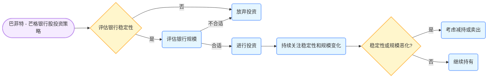

# 巴菲特 - 芒格的银行股投资策略：看重稳定性和规模

> 关键词：巴菲特、芒格、银行股投资、稳定性、规模、投资策略

> 摘要：本文深入剖析了巴菲特和芒格的银行股投资策略，着重探讨他们为何看重银行的稳定性和规模。通过介绍背景知识，阐述核心概念，解析核心算法原理、数学模型，结合项目实战案例和实际应用场景，推荐相关工具和资源，总结未来发展趋势与挑战，为投资者理解和运用这一投资策略提供全面而深入的指导。

## 1. 背景介绍 
### 1.1 目的和范围
本文章旨在全面解析巴菲特 - 芒格的银行股投资策略，聚焦于他们对银行稳定性和规模的重视。文章将从多个层面展开，包括理论原理、实际操作案例等，以帮助投资者更好地理解和借鉴这一经典投资策略。研究范围涵盖银行股投资的基本概念、评估方法、实际应用场景等，同时也会探讨该策略在不同市场环境下的适应性和发展趋势。

### 1.2 预期读者
本文预期读者包括对股票投资尤其是银行股投资感兴趣的个人投资者、金融专业学生、投资机构从业者以及关注价值投资理念的人士。无论你是投资新手还是有一定经验的投资者，都能从本文中获取有价值的信息和启示。

### 1.3 文档结构概述
本文将按照以下结构进行阐述：首先介绍核心概念与联系，明确银行稳定性和规模在投资中的关键地位；接着深入分析核心算法原理和具体操作步骤，通过 Python 代码进行详细说明；然后介绍相关的数学模型和公式，并举例说明其应用；随后通过项目实战案例，展示该投资策略在实际中的运用；之后探讨实际应用场景，分析该策略的适用范围；再推荐相关的工具和资源，帮助读者进一步学习和实践；最后总结未来发展趋势与挑战，并提供常见问题解答和扩展阅读参考资料。

### 1.4 术语表
#### 1.4.1 核心术语定义
- **银行稳定性**：指银行在面对各种内外部风险时，保持经营业绩、财务状况和市场声誉相对稳定的能力。这包括银行的资产质量、资本充足率、流动性等方面的稳定。
- **银行规模**：通常用银行的资产总额、存款规模、贷款规模等指标来衡量。较大的银行规模往往意味着更强的市场竞争力、更广泛的业务覆盖和更高的抗风险能力。
- **投资策略**：投资者为了实现投资目标，根据自身的风险承受能力、投资期限等因素制定的一系列投资决策和操作方法。

#### 1.4.2 相关概念解释
- **价值投资**：一种基于对资产内在价值的评估进行投资的理念。价值投资者认为，市场有时会低估某些资产的价值，通过深入分析和研究，选择被低估的资产进行投资，等待市场发现其真实价值，从而获得投资回报。
- **资产质量**：指银行资产的优劣程度，主要通过不良贷款率、拨备覆盖率等指标来衡量。良好的资产质量意味着银行的贷款能够按时收回，减少潜在的损失。
- **资本充足率**：银行资本与风险加权资产的比率，反映了银行抵御风险的能力。较高的资本充足率表明银行有足够的资本来应对可能的损失。

#### 1.4.3 缩略词列表
- **ROE**：Return on Equity，净资产收益率，衡量公司运用自有资本的效率。
- **ROA**：Return on Assets，总资产收益率，反映公司资产利用的综合效果。
- **NPL**：Non - Performing Loan，不良贷款，指借款人未能按时足额偿还本息的贷款。

## 2. 核心概念与联系 
### 核心概念原理
巴菲特和芒格的银行股投资策略核心在于对银行稳定性和规模的重视。银行作为金融体系的核心组成部分，其稳定性至关重要。稳定的银行能够在经济周期的波动中保持相对平稳的经营业绩，为投资者提供持续的回报。

从稳定性方面来看，银行的资产质量是关键因素之一。优质的贷款组合意味着较低的违约风险，能够保证银行的现金流稳定。例如，一家银行的不良贷款率较低，说明其在贷款审批和风险管理方面做得较好，能够有效地控制潜在的损失。

资本充足率也是衡量银行稳定性的重要指标。足够的资本可以为银行提供缓冲，使其在面临风险时能够保持正常运营。例如，在金融危机期间，资本充足率较高的银行能够更好地抵御冲击，避免破产或陷入困境。

银行的规模同样具有重要意义。大规模的银行通常具有更强的市场竞争力。它们可以利用规模经济降低成本，例如在信息技术、风险管理等方面进行更高效的投入。此外，大规模银行还具有更广泛的业务覆盖和客户基础，能够分散风险。例如，一家全国性的大型银行可以在不同地区开展业务，避免因局部地区经济衰退而受到过大影响。

### 架构的文本示意图
```plaintext
巴菲特 - 芒格银行股投资策略
|-- 稳定性
|   |-- 资产质量
|   |   |-- 不良贷款率
|   |   |-- 拨备覆盖率
|   |-- 资本充足率
|-- 规模
|   |-- 资产总额
|   |-- 存款规模
|   |-- 贷款规模
```

### Mermaid 流程图


## 3. 核心算法原理 & 具体操作步骤 
### 核心算法原理
在评估银行的稳定性和规模时，可以使用一些关键指标和算法。以下是一些常用的指标和计算方法：

#### 不良贷款率
不良贷款率（NPL Ratio）是指不良贷款占总贷款的比例，计算公式为：
$$NPL\ Ratio=\frac{不良贷款总额}{总贷款总额}\times100\%$$
不良贷款率越低，说明银行的资产质量越好，稳定性越高。

#### 拨备覆盖率
拨备覆盖率（Provision Coverage Ratio）是指银行贷款损失准备与不良贷款的比率，计算公式为：
$$Provision\ Coverage\ Ratio=\frac{贷款损失准备}{不良贷款总额}\times100\%$$
拨备覆盖率越高，说明银行对可能的贷款损失有更充足的准备，能够更好地应对风险。

#### 资本充足率
资本充足率（Capital Adequacy Ratio）是指银行资本与风险加权资产的比率，计算公式为：
$$Capital\ Adequacy\ Ratio=\frac{银行资本}{风险加权资产}\times100\%$$
资本充足率越高，说明银行的资本实力越强，能够抵御更大的风险。

#### 净资产收益率
净资产收益率（ROE）是指净利润与平均净资产的比率，计算公式为：
$$ROE=\frac{净利润}{平均净资产}\times100\%$$
ROE 反映了银行运用自有资本的效率，较高的 ROE 通常意味着银行的盈利能力较强。

### 具体操作步骤
以下是使用 Python 代码实现对银行指标评估的示例：

```python
# 定义评估银行稳定性和规模的函数
def evaluate_bank(npl_ratio, provision_coverage_ratio, capital_adequacy_ratio, roe, asset_size):
    # 设定评估标准
    npl_threshold = 2  # 不良贷款率阈值，单位：%
    provision_coverage_threshold = 150  # 拨备覆盖率阈值，单位：%
    capital_adequacy_threshold = 10  # 资本充足率阈值，单位：%
    roe_threshold = 10  # 净资产收益率阈值，单位：%
    asset_size_threshold = 10000000000  # 资产规模阈值，单位：元

    # 评估稳定性
    stability_score = 0
    if npl_ratio < npl_threshold:
        stability_score += 1
    if provision_coverage_ratio > provision_coverage_threshold:
        stability_score += 1
    if capital_adequacy_ratio > capital_adequacy_threshold:
        stability_score += 1
    if roe > roe_threshold:
        stability_score += 1

    # 评估规模
    size_score = 0
    if asset_size > asset_size_threshold:
        size_score = 1

    # 综合评估
    if stability_score >= 3 and size_score == 1:
        return "适合投资"
    else:
        return "不适合投资"

# 示例数据
npl_ratio = 1.5
provision_coverage_ratio = 200
capital_adequacy_ratio = 12
roe = 15
asset_size = 15000000000

# 调用函数进行评估
result = evaluate_bank(npl_ratio, provision_coverage_ratio, capital_adequacy_ratio, roe, asset_size)
print("评估结果:", result)
```

### 代码解释
1. **函数定义**：`evaluate_bank` 函数接受不良贷款率、拨备覆盖率、资本充足率、净资产收益率和资产规模作为输入参数。
2. **设定评估标准**：根据经验和行业标准，设定了各项指标的阈值。
3. **评估稳定性**：通过比较各项指标与阈值的大小，计算稳定性得分。
4. **评估规模**：根据资产规模与阈值的比较，确定规模得分。
5. **综合评估**：根据稳定性得分和规模得分，判断银行是否适合投资。

## 4. 数学模型和公式 & 详细讲解 & 举例说明 
### 不良贷款率
#### 公式
$$NPL\ Ratio=\frac{不良贷款总额}{总贷款总额}\times100\%$$

#### 详细讲解
不良贷款率是衡量银行资产质量的重要指标。它反映了银行贷款组合中存在违约风险的贷款比例。较高的不良贷款率意味着银行面临更大的信用风险，可能会导致资产损失和盈利能力下降。

#### 举例说明
假设某银行的总贷款总额为 100 亿元，其中不良贷款总额为 2 亿元。则该银行的不良贷款率为：
$$NPL\ Ratio=\frac{2}{100}\times100\% = 2\%$$

### 拨备覆盖率
#### 公式
$$Provision\ Coverage\ Ratio=\frac{贷款损失准备}{不良贷款总额}\times100\%$$

#### 详细讲解
拨备覆盖率反映了银行对可能的贷款损失的准备程度。较高的拨备覆盖率意味着银行有更充足的资金来弥补潜在的贷款损失，从而增强了银行的稳定性。

#### 举例说明
假设某银行的贷款损失准备为 3 亿元，不良贷款总额为 2 亿元。则该银行的拨备覆盖率为：
$$Provision\ Coverage\ Ratio=\frac{3}{2}\times100\% = 150\%$$

### 资本充足率
#### 公式
$$Capital\ Adequacy\ Ratio=\frac{银行资本}{风险加权资产}\times100\%$$

#### 详细讲解
资本充足率是衡量银行资本实力和抵御风险能力的重要指标。银行资本包括核心资本和附属资本，风险加权资产是根据不同资产的风险程度进行加权计算得出的。较高的资本充足率意味着银行有更多的资本来应对可能的风险。

#### 举例说明
假设某银行的银行资本为 10 亿元，风险加权资产为 100 亿元。则该银行的资本充足率为：
$$Capital\ Adequacy\ Ratio=\frac{10}{100}\times100\% = 10\%$$

### 净资产收益率
#### 公式
$$ROE=\frac{净利润}{平均净资产}\times100\%$$

#### 详细讲解
净资产收益率反映了银行运用自有资本的效率。它衡量了银行每单位净资产所创造的净利润。较高的 ROE 意味着银行能够更有效地利用股东的资金，具有更强的盈利能力。

#### 举例说明
假设某银行的净利润为 5 亿元，平均净资产为 50 亿元。则该银行的净资产收益率为：
$$ROE=\frac{5}{50}\times100\% = 10\%$$

## 5. 项目实战：代码实际案例和详细解释说明 
### 5.1  开发环境搭建
#### 安装 Python
首先，需要安装 Python 编程语言。可以从 Python 官方网站（https://www.python.org/downloads/）下载适合你操作系统的 Python 版本，并按照安装向导进行安装。

#### 安装必要的库
在本项目中，我们主要使用 Python 的基本库，无需额外安装其他库。

### 5.2  源代码详细实现和代码解读
以下是一个更完整的项目实战代码示例，用于批量评估多家银行的投资价值：

```python
# 定义评估银行稳定性和规模的函数
def evaluate_bank(npl_ratio, provision_coverage_ratio, capital_adequacy_ratio, roe, asset_size):
    # 设定评估标准
    npl_threshold = 2  # 不良贷款率阈值，单位：%
    provision_coverage_threshold = 150  # 拨备覆盖率阈值，单位：%
    capital_adequacy_threshold = 10  # 资本充足率阈值，单位：%
    roe_threshold = 10  # 净资产收益率阈值，单位：%
    asset_size_threshold = 10000000000  # 资产规模阈值，单位：元

    # 评估稳定性
    stability_score = 0
    if npl_ratio < npl_threshold:
        stability_score += 1
    if provision_coverage_ratio > provision_coverage_threshold:
        stability_score += 1
    if capital_adequacy_ratio > capital_adequacy_threshold:
        stability_score += 1
    if roe > roe_threshold:
        stability_score += 1

    # 评估规模
    size_score = 0
    if asset_size > asset_size_threshold:
        size_score = 1

    # 综合评估
    if stability_score >= 3 and size_score == 1:
        return "适合投资"
    else:
        return "不适合投资"

# 模拟多家银行的数据
banks = [
    {
        "name": "银行 A",
        "npl_ratio": 1.5,
        "provision_coverage_ratio": 200,
        "capital_adequacy_ratio": 12,
        "roe": 15,
        "asset_size": 15000000000
    },
    {
        "name": "银行 B",
        "npl_ratio": 3,
        "provision_coverage_ratio": 120,
        "capital_adequacy_ratio": 8,
        "roe": 8,
        "asset_size": 8000000000
    }
]

# 对每家银行进行评估
for bank in banks:
    result = evaluate_bank(
        bank["npl_ratio"],
        bank["provision_coverage_ratio"],
        bank["capital_adequacy_ratio"],
        bank["roe"],
        bank["asset_size"]
    )
    print(f"{bank['name']} 的评估结果: {result}")
```

### 代码解读与分析
1. **函数定义**：`evaluate_bank` 函数与之前的示例相同，用于评估单家银行的投资价值。
2. **模拟数据**：使用列表 `banks` 模拟了多家银行的数据，每家银行的数据以字典的形式存储。
3. **循环评估**：使用 `for` 循环遍历 `banks` 列表，对每家银行的数据调用 `evaluate_bank` 函数进行评估，并输出评估结果。

通过这个项目实战，我们可以批量评估多家银行的投资价值，为投资者提供参考。

## 6. 实际应用场景 
### 个人投资者
对于个人投资者来说，巴菲特 - 芒格的银行股投资策略可以帮助他们筛选出具有投资价值的银行股。个人投资者可以通过收集银行的财务报表，计算关键指标，如不良贷款率、拨备覆盖率、资本充足率等，运用本文介绍的评估方法，判断银行的稳定性和规模是否符合投资要求。例如，一位个人投资者希望通过长期投资银行股来实现资产增值，他可以使用该策略选择那些稳定性高、规模大的银行股进行投资，降低投资风险。

### 投资机构
投资机构在进行资产配置时，也可以借鉴这一策略。投资机构通常管理着大量的资金，需要寻找稳健的投资标的。银行股作为金融板块的重要组成部分，具有一定的稳定性和抗周期性。投资机构可以通过深入分析银行的稳定性和规模，构建合理的银行股投资组合。例如，一家大型基金公司可以根据该策略选择不同规模、不同地域的银行股进行投资，以实现分散风险和获取稳定收益的目标。

### 金融研究机构
金融研究机构可以利用这一策略进行行业研究和分析。他们可以对整个银行业进行评估，分析不同银行的稳定性和规模状况，为监管部门、投资者和金融机构提供决策参考。例如，研究机构可以发布银行股投资报告，推荐具有投资价值的银行股，同时也可以对银行业的发展趋势进行预测和分析。

## 7. 工具和资源推荐
### 7.1 学习资源推荐
#### 7.1.1 书籍推荐
- 《聪明的投资者》（The Intelligent Investor）：作者本杰明·格雷厄姆（Benjamin Graham）是价值投资的奠基人，这本书是价值投资领域的经典之作，对巴菲特和芒格的投资理念产生了深远影响。书中详细介绍了价值投资的基本原理和方法，对于理解巴菲特 - 芒格的银行股投资策略具有重要的参考价值。
- 《巴菲特致股东的信：股份公司教程》（Letters to Shareholders of Berkshire Hathaway）：这本书收录了巴菲特历年致股东的信，通过这些信件，读者可以深入了解巴菲特的投资思想、决策过程和对不同行业的看法。其中也包含了许多关于银行股投资的见解和案例。
- 《穷查理宝典：查理·芒格的智慧箴言录》（Poor Charlie's Almanack: The Wit and Wisdom of Charles T. Munger）：本书全面介绍了查理·芒格的投资哲学、思维方式和生活智慧。芒格的多元思维模型和对商业本质的深刻理解，对于投资者分析银行股的稳定性和规模具有重要的启示作用。

#### 7.1.2 在线课程
- Coursera 上的“投资学原理”（Principles of Investing）课程：该课程由知名高校的教授授课，系统地介绍了投资学的基本原理和方法，包括股票投资、债券投资等内容。课程中会涉及到价值投资的理念和方法，有助于学习者理解巴菲特 - 芒格的投资策略。
- edX 上的“金融市场”（Financial Markets）课程：这门课程由耶鲁大学的罗伯特·席勒（Robert Shiller）教授主讲，涵盖了金融市场的各个方面，包括银行、证券、保险等行业。通过学习该课程，学习者可以深入了解金融市场的运行机制和银行股的投资特点。

#### 7.1.3 技术博客和网站
- 雪球网（https://xueqiu.com/）：雪球是一个投资社区，聚集了大量的投资者和金融专家。在雪球上，你可以找到关于银行股投资的各种讨论和分析文章，了解其他投资者的观点和经验。
- 东方财富网（https://www.eastmoney.com/）：东方财富是国内知名的金融信息网站，提供丰富的金融数据和资讯。你可以在该网站上查询银行的财务报表、股价走势等信息，为投资决策提供参考。

### 7.2 开发工具框架推荐
#### 7.2.1 IDE和编辑器
- PyCharm：PyCharm 是一款专门为 Python 开发设计的集成开发环境（IDE），具有强大的代码编辑、调试和项目管理功能。在进行银行股投资分析的代码开发时，PyCharm 可以提高开发效率和代码质量。
- Jupyter Notebook：Jupyter Notebook 是一个交互式的开发环境，支持多种编程语言，包括 Python。它以笔记本的形式展示代码和运行结果，非常适合进行数据分析和可视化。在分析银行的财务数据时，Jupyter Notebook 可以方便地进行数据处理和可视化展示。

#### 7.2.2 调试和性能分析工具
- pdb：pdb 是 Python 内置的调试器，可以帮助开发者在代码运行过程中定位和解决问题。在编写银行股投资分析代码时，使用 pdb 可以快速找到代码中的错误和逻辑问题。
- cProfile：cProfile 是 Python 的性能分析工具，可以分析代码的运行时间和函数调用情况。通过使用 cProfile，开发者可以找出代码中的性能瓶颈，进行优化。

#### 7.2.3 相关框架和库
- Pandas：Pandas 是一个强大的数据分析库，提供了高效的数据结构和数据处理工具。在处理银行的财务数据时，Pandas 可以方便地进行数据读取、清洗、分析和可视化。
- NumPy：NumPy 是 Python 的数值计算库，提供了高效的数组操作和数学函数。在进行银行股投资分析的数值计算时，NumPy 可以提高计算效率。

### 7.3 相关论文著作推荐
#### 7.3.1 经典论文
- 《有效市场假说》（Efficient Market Hypothesis）：该论文由尤金·法玛（Eugene F. Fama）提出，阐述了市场有效性的概念和分类。了解有效市场假说对于理解巴菲特 - 芒格的投资策略与市场的关系具有重要意义。
- 《资本资产定价模型》（Capital Asset Pricing Model, CAPM）：威廉·夏普（William F. Sharpe）提出的 CAPM 模型，用于描述资产的预期收益率与风险之间的关系。在评估银行股的投资价值时，CAPM 模型可以作为参考工具。

#### 7.3.2 最新研究成果
- 关注顶级金融学术期刊，如《金融杂志》（Journal of Finance）、《金融经济学杂志》（Journal of Financial Economics）等，这些期刊会发表关于银行股投资、金融市场等领域的最新研究成果。
- 一些知名的金融研究机构，如国际货币基金组织（IMF）、世界银行等，会发布关于银行业和金融市场的研究报告，这些报告可以为投资者提供最新的行业动态和分析。

#### 7.3.3 应用案例分析
- 可以关注一些专业的金融分析机构发布的银行股投资案例分析报告，这些报告通常会详细分析某家银行的投资价值、投资策略和投资效果。通过学习这些案例分析，投资者可以更好地理解和应用巴菲特 - 芒格的银行股投资策略。

## 8. 总结：未来发展趋势与挑战
### 未来发展趋势
#### 数字化转型
随着科技的不断发展，银行业正面临着数字化转型的浪潮。未来，银行将更加注重数字化服务的提供，如网上银行、移动支付、智能投顾等。具有较强数字化能力的银行将在市场竞争中占据优势，巴菲特 - 芒格的投资策略也需要考虑银行在数字化转型方面的进展和潜力。

#### 监管加强
为了维护金融稳定，监管部门对银行业的监管将不断加强。银行需要满足更高的资本要求、风险管理要求等。这将促使银行更加注重稳定性和合规性，符合巴菲特 - 芒格投资策略中对银行稳定性的要求。

#### 国际化发展
随着全球经济一体化的深入，银行的国际化发展趋势将更加明显。一些大型银行将拓展海外市场，实现业务的多元化和风险的分散。在选择投资银行股时，投资者需要考虑银行的国际化战略和海外市场的发展潜力。

### 挑战
#### 科技金融的竞争
科技金融公司的崛起给传统银行带来了巨大的竞争压力。这些科技金融公司通常具有更灵活的运营模式和更先进的技术，能够提供更便捷的金融服务。传统银行需要不断创新和变革，以应对科技金融的竞争。投资者在评估银行股时，需要考虑银行在科技金融竞争中的应对能力。

#### 宏观经济不确定性
宏观经济环境的不确定性，如经济衰退、利率波动、汇率变化等，会对银行的经营业绩产生影响。银行的稳定性和盈利能力可能会受到宏观经济因素的冲击。投资者需要密切关注宏观经济形势的变化，及时调整投资策略。

#### 数据质量和透明度
在评估银行的稳定性和规模时，需要依赖准确的财务数据和信息。然而，部分银行的数据质量和透明度可能存在问题，这给投资者的分析和决策带来了困难。投资者需要通过多种渠道获取信息，提高对数据的甄别能力。

## 9. 附录：常见问题与解答
### 问题 1：如何获取银行的财务数据？
答：可以通过以下几种方式获取银行的财务数据：
- 银行官方网站：银行会定期公布年度报告、半年度报告等财务信息。
- 证券交易所网站：如果银行是上市公司，证券交易所会发布其定期报告和公告。
- 金融信息服务提供商：如东方财富网、同花顺等，提供银行的财务数据和分析报告。

### 问题 2：评估银行稳定性和规模的指标是否适用于所有银行？
答：这些指标是通用的评估银行稳定性和规模的方法，但不同类型的银行可能具有不同的特点。例如，小型银行和大型银行在业务模式、风险特征等方面可能存在差异，在使用这些指标时需要结合银行的具体情况进行分析。

### 问题 3：巴菲特 - 芒格的银行股投资策略是否适用于短期投资？
答：巴菲特 - 芒格的投资策略更侧重于长期投资。他们注重银行的内在价值和长期发展潜力，通过长期持有来获得稳定的回报。短期投资可能受到市场波动、情绪等因素的影响，与该策略的核心理念不太相符。

### 问题 4：如何判断银行的数字化转型是否成功？
答：可以从以下几个方面判断银行的数字化转型是否成功：
- 客户体验：是否提供了更便捷、高效的数字化服务，客户满意度是否提高。
- 业务增长：数字化业务的收入和用户数量是否增长。
- 技术创新：是否采用了先进的技术，如人工智能、区块链等，提升了业务效率和竞争力。

## 10. 扩展阅读 & 参考资料
### 扩展阅读
- 《金融炼金术》（The Alchemy of Finance）：作者乔治·索罗斯（George Soros）在书中阐述了他的反身性理论，对金融市场的运行机制有独特的见解。通过阅读这本书，投资者可以从不同的角度思考银行股投资和金融市场的变化。
- 《漫步华尔街》（A Random Walk Down Wall Street）：这本书介绍了各种投资理论和方法，包括技术分析、基本面分析等。读者可以了解不同投资理念的优缺点，进一步完善自己的投资策略。

### 参考资料
- 各银行的年度报告和财务报表
- 金融学术期刊和研究报告
- 财经媒体的相关报道和分析文章

作者：AI天才研究院/AI Genius Institute & 禅与计算机程序设计艺术 /Zen And The Art of Computer Programming