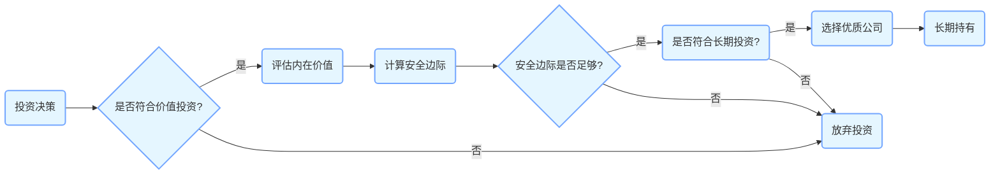

# 巴菲特 - 芒格的风险管理：如何在投资中降低风险

> 关键词：巴菲特、芒格、风险管理、投资、降低风险、价值投资、长期投资

> 摘要：本文深入探讨了巴菲特和芒格的风险管理理念及方法，旨在揭示如何在投资过程中有效降低风险。通过对其核心概念、算法原理、数学模型等多方面的详细分析，并结合实际案例，阐述了价值投资、长期投资等策略在风险管理中的重要作用。同时，介绍了相关的学习资源、开发工具等，最后对未来投资风险管理的发展趋势与挑战进行了总结，为投资者提供全面且深入的风险管理知识体系。

## 1. 背景介绍 
### 1.1 目的和范围
本文的主要目的是深入剖析巴菲特和芒格的风险管理理念与方法，帮助投资者理解如何在投资过程中降低风险。通过研究他们的投资哲学、决策过程以及实际操作案例，为广大投资者提供实用的风险管理策略和思路。范围涵盖了从基本概念到具体操作，从理论模型到实际应用的各个方面，旨在构建一个全面且深入的风险管理知识体系。

### 1.2 预期读者
本文预期读者包括各类投资者，无论是初涉投资领域的新手，还是有一定经验的专业投资者，都能从本文中获得有价值的信息。同时，金融专业的学生、研究人员以及对投资风险管理感兴趣的人士也可将本文作为学习和研究的参考资料。

### 1.3 文档结构概述
本文将按照以下结构进行阐述：首先介绍核心概念与联系，明确巴菲特 - 芒格风险管理的基本原理和架构；接着详细讲解核心算法原理及具体操作步骤，并结合 Python 源代码进行说明；然后阐述相关的数学模型和公式，并举例说明其应用；通过实际项目案例，展示如何将这些理念和方法应用到实际投资中；探讨实际应用场景，分析在不同市场环境下的风险管理策略；推荐相关的学习资源、开发工具和论文著作；最后总结未来发展趋势与挑战，并提供常见问题解答和扩展阅读参考资料。

### 1.4 术语表
#### 1.4.1 核心术语定义
- **价值投资**：一种投资策略，强调通过分析公司的内在价值，寻找被市场低估的股票进行投资。内在价值是指公司未来现金流的现值，价值投资者认为市场有时会对股票价格做出错误的定价，通过深入研究公司基本面，可以发现这些被低估的机会。
- **安全边际**：指股票的市场价格低于其内在价值的程度。安全边际为投资者提供了一定的缓冲空间，即使公司的实际表现不如预期，由于买入价格较低，投资者仍有可能避免损失或获得一定的收益。
- **长期投资**：一种投资理念，主张投资者将资金长期投入到优质的公司中，忽略短期市场波动，通过公司的长期成长实现资产的增值。

#### 1.4.2 相关概念解释
- **护城河**：巴菲特提出的概念，指公司拥有的一种可持续的竞争优势，使其能够在市场中抵御竞争对手的侵蚀，保持长期的盈利能力。护城河可以表现为品牌优势、技术壁垒、成本优势、网络效应等多种形式。
- **能力圈**：芒格强调的概念，指投资者应该专注于自己熟悉和了解的领域进行投资。在自己的能力圈内，投资者能够更好地评估公司的价值和风险，做出更明智的投资决策。

#### 1.4.3 缩略词列表
- **DCF**：Discounted Cash Flow，现金流折现法，是一种用于估算公司内在价值的方法，通过预测公司未来的现金流并将其折现到当前，得到公司的内在价值。

## 2. 核心概念与联系 

### 核心概念原理
巴菲特和芒格的风险管理理念基于价值投资和长期投资的核心思想。价值投资强调对公司内在价值的评估，通过深入研究公司的基本面，包括财务状况、商业模式、竞争优势等，来确定公司的真实价值。安全边际则是价值投资的重要原则之一，它要求投资者在买入股票时，确保股票的市场价格低于其内在价值，从而为投资提供一定的缓冲空间，降低投资风险。

长期投资理念认为，市场短期波动是不可预测的，但优质公司的长期价值是可以持续增长的。投资者应该忽略短期市场波动，将资金长期投入到具有竞争优势和良好发展前景的公司中，通过公司的长期成长实现资产的增值。同时，长期投资也可以减少交易成本和税收负担，进一步提高投资收益。

### 架构的文本示意图
```plaintext
巴菲特 - 芒格风险管理架构
|-- 价值投资
|   |-- 内在价值评估
|   |   |-- 财务分析
|   |   |-- 商业模式分析
|   |   |-- 竞争优势分析
|   |-- 安全边际原则
|       |-- 确定内在价值
|       |-- 比较市场价格与内在价值
|-- 长期投资
|   |-- 忽略短期波动
|   |-- 选择优质公司
|   |   |-- 具有护城河的公司
|   |   |-- 处于能力圈内的公司
```

### Mermaid 流程图


## 3. 核心算法原理 & 具体操作步骤 

### 核心算法原理
在巴菲特 - 芒格的风险管理体系中，核心算法主要涉及到公司内在价值的评估。其中，现金流折现法（DCF）是一种常用的方法。DCF 法的基本原理是将公司未来的现金流折现到当前，以确定公司的内在价值。具体来说，它假设公司在未来一段时间内会产生一系列的现金流，通过对这些现金流进行折现，得到它们的现值之和，即为公司的内在价值。

### 具体操作步骤
1. **预测未来现金流**：分析师需要对公司未来的现金流进行预测。这通常需要考虑公司的历史业绩、行业发展趋势、市场竞争状况等因素。一般来说，可以将预测期分为短期（1 - 3 年）、中期（3 - 5 年）和长期（5 年以上）。
2. **确定折现率**：折现率是将未来现金流折现到当前的比率，它反映了资金的时间价值和投资风险。折现率通常可以使用加权平均资本成本（WACC）来计算，WACC 考虑了公司的股权成本和债务成本。
3. **计算现金流现值**：将预测的未来现金流按照折现率进行折现，得到它们的现值。
4. **计算终端价值**：在预测期结束后，公司仍然会继续经营，产生现金流。终端价值是指预测期结束后公司未来现金流的现值。可以使用永续增长模型或退出倍数法来计算终端价值。
5. **计算内在价值**：将预测期内的现金流现值和终端价值相加，得到公司的内在价值。

### Python 源代码实现
```python
import numpy as np

def dcf_valuation(free_cash_flows, discount_rate, growth_rate, terminal_multiple=None):
    """
    现金流折现法计算公司内在价值
    
    参数:
    free_cash_flows (list): 预测的未来现金流列表
    discount_rate (float): 折现率
    growth_rate (float): 长期增长率
    terminal_multiple (float, optional): 终端倍数，用于计算终端价值
    
    返回:
    float: 公司的内在价值
    """
    n = len(free_cash_flows)
    
    # 计算预测期内现金流的现值
    present_values = []
    for i, cf in enumerate(free_cash_flows):
        pv = cf / ((1 + discount_rate) ** (i + 1))
        present_values.append(pv)
    
    # 计算终端价值
    if terminal_multiple is not None:
        terminal_value = free_cash_flows[-1] * terminal_multiple
    else:
        terminal_value = free_cash_flows[-1] * (1 + growth_rate) / (discount_rate - growth_rate)
    
    # 计算终端价值的现值
    terminal_pv = terminal_value / ((1 + discount_rate) ** n)
    
    # 计算内在价值
    intrinsic_value = sum(present_values) + terminal_pv
    
    return intrinsic_value

# 示例数据
free_cash_flows = [100, 120, 140, 160, 180]  # 预测的未来 5 年现金流
discount_rate = 0.1  # 折现率为 10%
growth_rate = 0.03  # 长期增长率为 3%

# 计算内在价值
intrinsic_value = dcf_valuation(free_cash_flows, discount_rate, growth_rate)
print(f"公司的内在价值为: {intrinsic_value}")
```

## 4. 数学模型和公式 & 详细讲解 & 举例说明 

### 现金流折现法（DCF）公式
现金流折现法的核心公式为：
$$
V = \sum_{t=1}^{n} \frac{FCF_t}{(1 + r)^t} + \frac{TV}{(1 + r)^n}
$$
其中：
- $V$ 表示公司的内在价值；
- $FCF_t$ 表示第 $t$ 期的自由现金流；
- $r$ 表示折现率；
- $n$ 表示预测期数；
- $TV$ 表示终端价值。

### 终端价值计算公式
#### 永续增长模型
当使用永续增长模型计算终端价值时，公式为：
$$
TV = \frac{FCF_n \times (1 + g)}{r - g}
$$
其中：
- $FCF_n$ 表示预测期最后一期的自由现金流；
- $g$ 表示长期增长率。

#### 退出倍数法
当使用退出倍数法计算终端价值时，公式为：
$$
TV = FCF_n \times M
$$
其中：
- $M$ 表示退出倍数。

### 详细讲解
现金流折现法的基本思想是将公司未来的现金流折现到当前，以反映资金的时间价值。预测期内的现金流现值是通过将每期的现金流按照折现率进行折现得到的，而终端价值则是考虑了预测期结束后公司未来现金流的价值。折现率反映了投资的风险，风险越高，折现率越高，公司的内在价值就越低。

### 举例说明
假设一家公司未来 5 年的自由现金流分别为 100 万元、120 万元、140 万元、160 万元和 180 万元，折现率为 10%，长期增长率为 3%。使用永续增长模型计算终端价值，步骤如下：

1. 计算预测期内现金流的现值：
    - 第 1 年现金流现值：$PV_1 = \frac{100}{(1 + 0.1)^1} \approx 90.91$（万元）
    - 第 2 年现金流现值：$PV_2 = \frac{120}{(1 + 0.1)^2} \approx 99.17$（万元）
    - 第 3 年现金流现值：$PV_3 = \frac{140}{(1 + 0.1)^3} \approx 105.18$（万元）
    - 第 4 年现金流现值：$PV_4 = \frac{160}{(1 + 0.1)^4} \approx 109.29$（万元）
    - 第 5 年现金流现值：$PV_5 = \frac{180}{(1 + 0.1)^5} \approx 111.72$（万元）

2. 计算终端价值：
    - 第 5 年现金流为 180 万元，根据永续增长模型，终端价值为：
    $TV = \frac{180 \times (1 + 0.03)}{0.1 - 0.03} \approx 2648.57$（万元）

3. 计算终端价值的现值：
    - $PV_{TV} = \frac{2648.57}{(1 + 0.1)^5} \approx 1647.08$（万元）

4. 计算公司的内在价值：
    - $V = 90.91 + 99.17 + 105.18 + 109.29 + 111.72 + 1647.08 \approx 2163.35$（万元）

因此，该公司的内在价值约为 2163.35 万元。

## 5. 项目实战：代码实际案例和详细解释说明 

### 5.1  开发环境搭建
为了运行上述的 Python 代码，需要搭建相应的开发环境。以下是具体步骤：

1. **安装 Python**：访问 Python 官方网站（https://www.python.org/downloads/），下载并安装适合你操作系统的 Python 版本。建议安装 Python 3.7 及以上版本。
2. **安装开发工具**：可以选择使用集成开发环境（IDE）如 PyCharm 或 Visual Studio Code，也可以使用文本编辑器如 Sublime Text 或 Atom。这里以 PyCharm 为例，访问 JetBrains 官方网站（https://www.jetbrains.com/pycharm/download/），下载并安装 PyCharm Community 版本。
3. **创建虚拟环境**：虚拟环境可以隔离不同项目的依赖，避免版本冲突。在命令行中执行以下命令创建并激活虚拟环境：
```bash
# 创建虚拟环境
python -m venv myenv

# 激活虚拟环境（Windows）
myenv\Scripts\activate

# 激活虚拟环境（Linux/Mac）
source myenv/bin/activate
```

### 5.2  源代码详细实现和代码解读
以下是之前给出的 Python 代码的详细实现和解读：

```python
import numpy as np

def dcf_valuation(free_cash_flows, discount_rate, growth_rate, terminal_multiple=None):
    """
    现金流折现法计算公司内在价值
    
    参数:
    free_cash_flows (list): 预测的未来现金流列表
    discount_rate (float): 折现率
    growth_rate (float): 长期增长率
    terminal_multiple (float, optional): 终端倍数，用于计算终端价值
    
    返回:
    float: 公司的内在价值
    """
    n = len(free_cash_flows)
    
    # 计算预测期内现金流的现值
    present_values = []
    for i, cf in enumerate(free_cash_flows):
        pv = cf / ((1 + discount_rate) ** (i + 1))
        present_values.append(pv)
    
    # 计算终端价值
    if terminal_multiple is not None:
        terminal_value = free_cash_flows[-1] * terminal_multiple
    else:
        terminal_value = free_cash_flows[-1] * (1 + growth_rate) / (discount_rate - growth_rate)
    
    # 计算终端价值的现值
    terminal_pv = terminal_value / ((1 + discount_rate) ** n)
    
    # 计算内在价值
    intrinsic_value = sum(present_values) + terminal_pv
    
    return intrinsic_value

# 示例数据
free_cash_flows = [100, 120, 140, 160, 180]  # 预测的未来 5 年现金流
discount_rate = 0.1  # 折现率为 10%
growth_rate = 0.03  # 长期增长率为 3%

# 计算内在价值
intrinsic_value = dcf_valuation(free_cash_flows, discount_rate, growth_rate)
print(f"公司的内在价值为: {intrinsic_value}")
```

#### 代码解读
1. **导入模块**：`import numpy as np` 导入了 NumPy 库，但在本代码中并未实际使用，可以考虑移除该导入语句。
2. **定义函数 `dcf_valuation`**：该函数接受四个参数：`free_cash_flows` 表示预测的未来现金流列表，`discount_rate` 表示折现率，`growth_rate` 表示长期增长率，`terminal_multiple` 表示终端倍数（可选参数）。
3. **计算预测期内现金流的现值**：通过循环遍历 `free_cash_flows` 列表，将每期现金流按照折现率进行折现，并将结果存储在 `present_values` 列表中。
4. **计算终端价值**：根据是否提供 `terminal_multiple` 参数，选择使用退出倍数法或永续增长模型计算终端价值。
5. **计算终端价值的现值**：将终端价值按照折现率折现到当前。
6. **计算内在价值**：将预测期内现金流的现值和终端价值的现值相加，得到公司的内在价值。
7. **示例数据和计算**：定义了示例数据，包括预测的未来 5 年现金流、折现率和长期增长率，调用 `dcf_valuation` 函数计算公司的内在价值，并将结果打印输出。

### 5.3  代码解读与分析
#### 优点
- **模块化设计**：将现金流折现法的计算封装在一个函数中，提高了代码的复用性和可维护性。
- **灵活性**：支持使用退出倍数法或永续增长模型计算终端价值，用户可以根据实际情况选择合适的方法。
- **易于理解**：代码结构清晰，注释详细，便于初学者理解和学习。

#### 缺点
- **数据依赖**：代码的计算结果高度依赖于输入的现金流预测、折现率和增长率等数据，这些数据的准确性直接影响到计算结果的可靠性。
- **缺乏错误处理**：代码没有对输入数据进行有效性检查，例如输入的现金流列表为空或折现率小于增长率等情况，可能会导致计算错误。

#### 改进建议
- **增加数据验证**：在函数开始时，对输入数据进行有效性检查，确保输入数据的合理性。
- **考虑不确定性**：可以引入蒙特卡罗模拟等方法，对现金流预测、折现率和增长率等参数进行不确定性分析，以提高计算结果的可靠性。

## 6. 实际应用场景 
### 股票投资
在股票投资中，巴菲特 - 芒格的风险管理理念可以帮助投资者筛选出具有投资价值的股票。投资者可以通过分析公司的基本面，评估其内在价值，并寻找具有足够安全边际的股票进行投资。例如，当一只股票的市场价格低于其内在价值时，投资者可以认为该股票具有投资价值，并且安全边际可以为投资提供一定的保护。同时，长期投资的理念可以帮助投资者忽略短期市场波动，避免因市场情绪而做出错误的投资决策。

### 企业并购
在企业并购中，风险管理同样至关重要。收购方需要对目标企业进行全面的评估，包括其财务状况、商业模式、竞争优势等，以确定目标企业的内在价值。通过应用现金流折现法等方法，收购方可以计算出目标企业的合理价格，并在谈判中争取有利的收购条件。同时，安全边际原则可以帮助收购方避免过高的收购价格，降低并购风险。

### 基金投资
对于基金投资者来说，了解巴菲特 - 芒格的风险管理理念可以帮助他们选择合适的基金产品。投资者可以关注基金经理的投资策略和风险管理方法，选择那些遵循价值投资和长期投资理念的基金。此外，投资者还可以通过分散投资不同类型的基金，降低投资组合的风险。

### 房地产投资
在房地产投资中，同样可以应用巴菲特 - 芒格的风险管理理念。投资者可以通过分析房地产的租金收入、市场需求、地段等因素，评估其内在价值。安全边际原则可以帮助投资者在购买房地产时，确保购买价格低于其内在价值，从而降低投资风险。同时，长期投资的理念可以让投资者从房地产的长期增值中获得收益。

## 7. 工具和资源推荐
### 7.1 学习资源推荐
#### 7.1.1 书籍推荐
- 《聪明的投资者》（The Intelligent Investor）：作者是本杰明·格雷厄姆（Benjamin Graham），这本书是价值投资的经典之作，巴菲特称其为“有史以来最伟大的投资著作”。书中详细阐述了价值投资的理念和方法，包括安全边际原则、内在价值评估等。
- 《巴菲特致股东的信：投资者和公司高管教程》（The Essays of Warren Buffett: Lessons for Corporate America）：这本书收录了巴菲特历年致股东的信，通过这些信件，读者可以深入了解巴菲特的投资哲学、风险管理理念和公司治理思想。
- 《穷查理宝典：查理·芒格的智慧箴言录》（Poor Charlie's Almanack: The Wit and Wisdom of Charles T. Munger）：本书全面介绍了芒格的人生经历、投资理念和多元思维模型，对于投资者理解芒格的风险管理方法具有重要的参考价值。

#### 7.1.2 在线课程
- Coursera 平台上的“投资学原理”（Principles of Investment）课程：该课程由知名大学的教授授课，涵盖了投资学的基本原理、资产定价模型、风险管理等内容，适合初学者系统学习投资知识。
- edX 平台上的“价值投资：从理论到实践”（Value Investing: From Theory to Practice）课程：课程结合实际案例，深入讲解价值投资的理论和方法，包括财务报表分析、内在价值评估等。

#### 7.1.3 技术博客和网站
- 价值投资网（https://www.valueinvestorsclub.com/）：这是一个专注于价值投资的社区网站，汇聚了众多价值投资者的观点和分析报告。
- 雪球网（https://xueqiu.com/）：国内知名的投资社区，提供股票、基金、债券等多种投资品种的资讯和分析，用户可以在上面交流投资经验和分享投资观点。

### 7.2 开发工具框架推荐
#### 7.2.1 IDE和编辑器
- PyCharm：一款专业的 Python 集成开发环境，提供了丰富的代码编辑、调试、版本控制等功能，适合开发复杂的 Python 项目。
- Visual Studio Code：一款轻量级的代码编辑器，支持多种编程语言，通过安装插件可以扩展其功能，非常适合快速开发和调试 Python 代码。

#### 7.2.2 调试和性能分析工具
- pdb：Python 自带的调试工具，可以帮助开发者在代码中设置断点、单步执行代码，方便查找和解决代码中的问题。
- cProfile：Python 标准库中的性能分析工具，可以分析代码的执行时间和函数调用次数，帮助开发者找出代码中的性能瓶颈。

#### 7.2.3 相关框架和库
- Pandas：一个强大的数据分析库，提供了高效的数据结构和数据处理功能，适合处理和分析金融数据。
- NumPy：一个用于科学计算的基础库，提供了多维数组对象和各种数学函数，可用于实现现金流折现法等数学模型。

### 7.3 相关论文著作推荐
#### 7.3.1 经典论文
- 《证券分析》（Security Analysis）：作者是本杰明·格雷厄姆和大卫·多德（David Dodd），这篇论文奠定了价值投资的理论基础，提出了内在价值、安全边际等重要概念。
- 《有效市场假说》（Efficient Market Hypothesis）：作者是尤金·法玛（Eugene F. Fama），该论文提出了有效市场假说，对金融市场的定价机制和投资策略产生了深远影响。

#### 7.3.2 最新研究成果
- 《行为金融学》（Behavioral Finance）：行为金融学是近年来兴起的一个研究领域，它结合了心理学和金融学的理论，研究投资者的行为偏差和市场的非理性现象。相关研究成果可以帮助投资者更好地理解市场行为，制定更有效的投资策略。
- 《量化投资》（Quantitative Investment）：量化投资是利用数学模型和计算机技术进行投资决策的一种方法。最新的量化投资研究成果可以为投资者提供更科学、更精确的投资分析工具。

#### 7.3.3 应用案例分析
- 《巴菲特的投资案例分析》：这类案例分析书籍详细介绍了巴菲特在不同时期的投资决策过程和投资案例，通过对这些案例的分析，读者可以学习到巴菲特的投资思路和风险管理方法。
- 《企业并购案例研究》：企业并购是风险管理的重要应用场景之一，相关的案例研究可以帮助读者了解在并购过程中如何进行风险评估和控制。

## 8. 总结：未来发展趋势与挑战
### 未来发展趋势
- **数字化和智能化**：随着科技的不断发展，投资领域将越来越多地应用数字化和智能化技术。例如，人工智能和机器学习可以帮助投资者更准确地预测市场趋势、评估公司价值和管理风险。量化投资策略也将得到更广泛的应用，通过大数据分析和算法模型，实现更科学、更高效的投资决策。
- **可持续投资**：越来越多的投资者开始关注企业的社会责任和可持续发展，可持续投资将成为未来的一个重要发展趋势。投资者将更加注重企业的环境、社会和治理（ESG）表现，将 ESG 因素纳入投资决策过程中，以实现长期的投资回报和社会价值的统一。
- **全球化投资**：随着全球经济一体化的深入发展，投资者将有更多的机会参与全球化投资。跨国投资和多元化资产配置将成为投资者降低风险、提高收益的重要手段。同时，不同国家和地区的金融市场和投资环境也将为投资者带来更多的挑战和机遇。

### 挑战
- **市场不确定性增加**：全球政治、经济和社会环境的不确定性不断增加，如贸易摩擦、地缘政治冲突、自然灾害等，这些因素将导致市场波动加剧，增加投资风险。投资者需要具备更强的风险管理能力和应对不确定性的能力。
- **数据质量和隐私问题**：数字化和智能化投资依赖于大量的数据，数据的质量和隐私问题将成为一个重要的挑战。投资者需要确保所使用的数据准确、可靠，并遵守相关的数据保护法规，以避免数据泄露和滥用带来的风险。
- **竞争加剧**：随着投资领域的不断发展，竞争将越来越激烈。投资者需要不断提升自己的专业能力和投资水平，以在竞争中脱颖而出。同时，金融科技的发展也将催生更多的新型投资机构和投资产品，投资者需要更加谨慎地选择投资渠道和产品。

## 9. 附录：常见问题与解答
### 问题 1：如何准确预测公司的未来现金流？
解答：准确预测公司的未来现金流是一项具有挑战性的任务，需要综合考虑多个因素。可以从以下几个方面入手：
- 分析公司的历史业绩：通过研究公司过去的财务报表，了解其收入、利润、现金流等指标的变化趋势，为未来现金流预测提供参考。
- 研究行业发展趋势：了解行业的市场规模、增长率、竞争格局等情况，评估公司在行业中的地位和发展前景，从而对公司的未来现金流做出合理预测。
- 关注宏观经济环境：宏观经济环境的变化会对公司的经营产生影响，如经济增长、通货膨胀、利率等因素。投资者需要关注宏观经济指标的变化，评估其对公司现金流的影响。
- 考虑公司的战略规划：了解公司的战略规划和业务发展方向，评估其对未来现金流的影响。例如，公司是否有新的产品或业务推出，是否有扩张计划等。

### 问题 2：如何确定合适的折现率？
解答：折现率的确定需要考虑多个因素，以下是一些常用的方法和考虑因素：
- 加权平均资本成本（WACC）：WACC 是一种常用的计算折现率的方法，它考虑了公司的股权成本和债务成本。股权成本可以使用资本资产定价模型（CAPM）来计算，债务成本可以根据公司的债务利率来确定。
- 市场风险溢价：市场风险溢价是指投资者要求的超过无风险利率的额外回报，它反映了市场的风险水平。可以通过历史数据或市场调研来估计市场风险溢价。
- 公司特定风险：除了市场风险外，公司还可能面临一些特定的风险，如行业竞争、技术变革、管理风险等。投资者需要根据公司的具体情况，对这些特定风险进行评估，并在折现率中予以体现。

### 问题 3：安全边际是不是越大越好？
解答：一般来说，安全边际越大，投资的风险就越低，但并不意味着安全边际越大越好。安全边际过大可能意味着市场对该股票存在过度悲观的预期，或者公司本身存在一些潜在的问题。投资者在追求安全边际的同时，还需要关注公司的基本面和发展前景。如果公司具有良好的商业模式、强大的竞争优势和可持续的盈利能力，即使安全边际相对较小，也可能是一个值得投资的机会。

### 问题 4：长期投资是否意味着一直持有股票，不进行任何交易？
解答：长期投资并不意味着一直持有股票，不进行任何交易。长期投资的核心是基于对公司长期价值的判断，忽略短期市场波动。但在某些情况下，投资者可能需要对投资组合进行调整。例如，当公司的基本面发生重大变化，如业绩大幅下滑、竞争优势丧失等，投资者可能需要考虑卖出股票；或者当市场出现明显的高估或低估时，投资者也可以根据自己的投资策略进行适当的买卖操作。

## 10. 扩展阅读 & 参考资料
### 扩展阅读
- 《金融炼金术》（The Alchemy of Finance）：作者是乔治·索罗斯（George Soros），这本书介绍了索罗斯的反身性理论和投资哲学，对于理解金融市场的复杂性和不确定性具有重要的启示作用。
- 《漫步华尔街》（A Random Walk Down Wall Street）：作者是伯顿·马尔基尔（Burton G. Malkiel），本书介绍了各种投资理论和投资策略，包括有效市场假说、指数基金投资等，适合投资者全面了解投资领域的知识。

### 参考资料
- Graham, B., & Dodd, D. (1934). Security Analysis. McGraw-Hill.
- Buffett, W. E. (Various years). Letters to Shareholders of Berkshire Hathaway Inc.
- Munger, C. T. (2005). Poor Charlie's Almanack: The Wit and Wisdom of Charles T. Munger. Donning Company Publishers.

作者：AI天才研究院/AI Genius Institute & 禅与计算机程序设计艺术 /Zen And The Art of Computer Programming