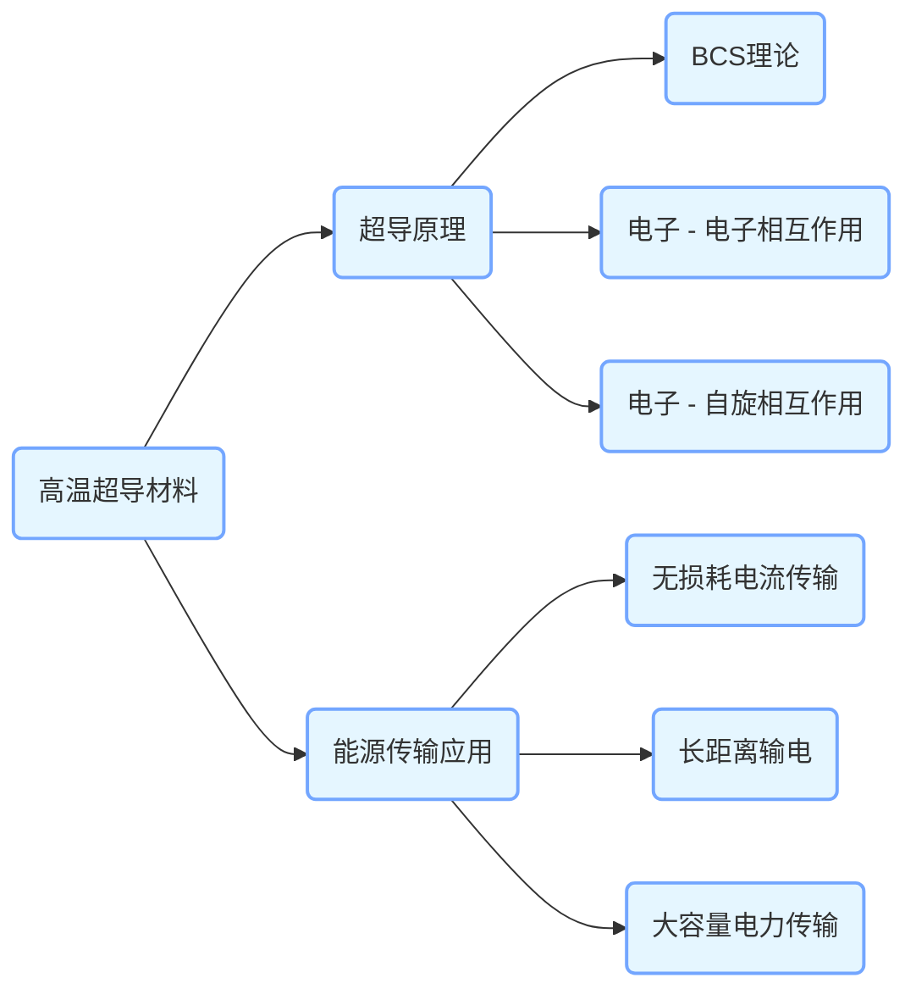

# 巴菲特 - 芒格的高温超导材料投资：能源传输的革命

> 关键词：巴菲特 - 芒格、高温超导材料、能源传输、投资、技术革命

> 摘要：本文聚焦于巴菲特 - 芒格对高温超导材料的投资，深入剖析这一投资背后的技术原理、商业潜力以及可能引发的能源传输革命。通过对高温超导材料核心概念、算法原理、数学模型的详细阐述，结合项目实战案例和实际应用场景分析，为读者全面呈现高温超导材料在能源领域的重要地位。同时，推荐相关学习资源、开发工具和论文著作，最后探讨该领域未来发展趋势与挑战，并解答常见问题，为关注此领域的投资者和技术爱好者提供深入且全面的参考。

## 1. 背景介绍 
### 1.1 目的和范围
本文旨在深入探讨巴菲特 - 芒格投资高温超导材料这一事件背后的战略意义以及高温超导材料在能源传输领域的应用潜力。我们将详细介绍高温超导材料的核心概念、技术原理、数学模型，通过实际案例展示其在能源传输中的应用，分析投资该领域可能带来的商业价值和社会效益。范围涵盖高温超导材料的基础理论、相关算法、实际项目开发以及未来发展趋势等多个方面。

### 1.2 预期读者
本文预期读者包括对投资领域感兴趣的投资者，希望了解巴菲特 - 芒格投资策略背后的技术逻辑；能源行业的从业者，关注新技术在能源传输中的应用和发展；以及对超导技术、计算机科学等相关领域有研究兴趣的科研人员和学生。

### 1.3 文档结构概述
本文首先介绍高温超导材料的背景知识，包括相关术语和核心概念。接着详细阐述其核心算法原理和具体操作步骤，用 Python 代码进行解释。然后介绍数学模型和公式，并举例说明。通过项目实战案例，展示高温超导材料在能源传输中的具体应用。分析实际应用场景，推荐学习资源、开发工具和相关论文著作。最后总结未来发展趋势与挑战，解答常见问题，并提供扩展阅读和参考资料。

### 1.4 术语表
#### 1.4.1 核心术语定义
- **高温超导材料**：指在相对较高的温度（通常高于传统超导体的临界温度，一般认为在液氮温度 77K 以上）下能够呈现超导状态的材料。超导状态是指材料电阻突然消失，电流可以无损耗地流动的状态。
- **能源传输**：将能源从生产地输送到消费地的过程，包括电力传输、天然气输送等。
- **临界温度**：超导材料从正常态转变为超导态的温度。当温度低于临界温度时，材料呈现超导特性。
- **临界磁场**：超导材料能够保持超导状态的最大磁场强度。当磁场强度超过临界磁场时，超导特性消失。
- **临界电流密度**：超导材料能够承载的最大电流密度。当电流密度超过临界电流密度时，超导特性消失。

#### 1.4.2 相关概念解释
- **超导现象**：1911 年，荷兰科学家昂内斯发现，当汞的温度降低到 4.2K（约 -269℃）时，其电阻突然消失，这种现象被称为超导现象。超导材料具有零电阻、完全抗磁性等特性，在能源、交通、医疗等领域具有广泛的应用前景。
- **高温超导的意义**：传统超导材料需要在极低温（接近绝对零度）下才能实现超导状态，这需要昂贵的制冷设备和大量的能源消耗。高温超导材料的出现，使得超导技术在更广泛的领域得到应用成为可能，降低了应用成本，提高了能源利用效率。

#### 1.4.3 缩略词列表
- **K**：开尔文，热力学温度单位，与摄氏度的换算关系为 $T(K)=t(℃)+273.15$。
- **MRI**：磁共振成像（Magnetic Resonance Imaging），利用原子核在磁场内共振所产生的信号经重建成像的一种检查方法，高温超导材料可用于制造 MRI 设备的超导磁体。

## 2. 核心概念与联系 

### 2.1 高温超导材料的原理
高温超导材料的超导原理较为复杂，目前尚无一种完全统一的理论能够解释所有高温超导现象。其中比较著名的理论有 BCS 理论（Bardeen - Cooper - Schrieffer 理论）及其衍生理论。

BCS 理论认为，在低温下，电子会通过与晶格振动（声子）的相互作用形成库珀对。库珀对是由两个自旋相反的电子组成的束缚态，它们可以在晶格中无阻碍地运动，从而导致材料电阻为零。然而，BCS 理论只能解释传统低温超导材料的超导现象，对于高温超导材料，需要更深入的理论模型。

一些理论认为，高温超导材料中的电子 - 电子相互作用、电子 - 自旋相互作用等起着重要作用。例如，在铜氧化物高温超导材料中，铜氧面的电子结构和电子 - 自旋耦合被认为是导致高温超导现象的关键因素。

### 2.2 高温超导材料与能源传输的联系
能源传输过程中，传统导体（如铜、铝等）存在电阻，会导致电能损耗。根据焦耳定律 $Q = I^{2}Rt$（其中 $Q$ 为热量损耗，$I$ 为电流，$R$ 为电阻，$t$ 为时间），电流越大、电阻越大、传输时间越长，电能损耗就越大。

高温超导材料由于其零电阻特性，在能源传输中可以实现无损耗的电流传输。这意味着在长距离输电、大容量电力传输等方面，高温超导材料具有巨大的优势。可以减少输电过程中的能量损耗，提高能源利用效率，降低输电成本。

### 2.3 核心概念原理和架构的文本示意图
```plaintext
高温超导材料
|
|-- 超导原理
|   |-- BCS理论（库珀对形成）
|   |-- 电子 - 电子相互作用
|   |-- 电子 - 自旋相互作用
|
|-- 能源传输应用
|   |-- 无损耗电流传输
|   |-- 长距离输电
|   |-- 大容量电力传输
```

### 2.4 Mermaid 流程图


## 3. 核心算法原理 & 具体操作步骤 

### 3.1 超导材料特性模拟算法原理
在研究高温超导材料时，我们常常需要模拟其在不同条件下的特性，例如临界温度、临界磁场和临界电流密度等。这里我们可以使用蒙特卡罗方法来模拟超导材料中的电子行为。

蒙特卡罗方法是一种基于随机抽样的数值计算方法，通过大量的随机试验来模拟物理系统的行为。在超导材料模拟中，我们可以将电子的状态看作是一个随机变量，通过随机改变电子的状态并计算系统的能量变化，来模拟电子的运动和相互作用。

### 3.2 Python 代码实现超导材料特性模拟
```python
import numpy as np

# 定义超导材料模拟类
class SuperconductorSimulation:
    def __init__(self, lattice_size, temperature):
        self.lattice_size = lattice_size
        self.temperature = temperature
        # 初始化电子状态
        self.electron_states = np.random.choice([-1, 1], size=(lattice_size, lattice_size))

    def calculate_energy(self):
        energy = 0
        for i in range(self.lattice_size):
            for j in range(self.lattice_size):
                # 计算相邻电子的相互作用能量
                neighbor_energy = 0
                if i > 0:
                    neighbor_energy += self.electron_states[i, j] * self.electron_states[i - 1, j]
                if i < self.lattice_size - 1:
                    neighbor_energy += self.electron_states[i, j] * self.electron_states[i + 1, j]
                if j > 0:
                    neighbor_energy += self.electron_states[i, j] * self.electron_states[i, j - 1]
                if j < self.lattice_size - 1:
                    neighbor_energy += self.electron_states[i, j] * self.electron_states[i, j + 1]
                energy += -neighbor_energy
        return energy

    def monte_carlo_step(self):
        # 随机选择一个电子
        i = np.random.randint(0, self.lattice_size)
        j = np.random.randint(0, self.lattice_size)
        # 改变该电子的状态
        new_states = self.electron_states.copy()
        new_states[i, j] = -new_states[i, j]
        # 计算能量变化
        old_energy = self.calculate_energy()
        new_energy = self.calculate_energy()
        delta_energy = new_energy - old_energy
        # 根据玻尔兹曼分布决定是否接受新状态
        if delta_energy < 0 or np.random.rand() < np.exp(-delta_energy / self.temperature):
            self.electron_states = new_states

    def simulate(self, num_steps):
        for _ in range(num_steps):
            self.monte_carlo_step()
        return self.electron_states

# 示例使用
lattice_size = 10
temperature = 1.0
simulation = SuperconductorSimulation(lattice_size, temperature)
final_states = simulation.simulate(1000)
print("Final electron states:")
print(final_states)
```

### 3.3 具体操作步骤
1. **初始化**：创建 `SuperconductorSimulation` 类的实例，设置晶格大小和温度，并随机初始化电子状态。
2. **计算能量**：通过 `calculate_energy` 方法计算当前电子状态下系统的能量。
3. **蒙特卡罗步骤**：在 `monte_carlo_step` 方法中，随机选择一个电子并改变其状态，计算能量变化。根据玻尔兹曼分布决定是否接受新状态。
4. **模拟过程**：通过 `simulate` 方法进行多次蒙特卡罗步骤，模拟电子的运动和相互作用。
5. **输出结果**：最终得到模拟结束后的电子状态。

## 4. 数学模型和公式 & 详细讲解 & 举例说明 

### 4.1 超导材料的热力学模型
超导材料的热力学性质可以用吉布斯自由能来描述。在超导态和正常态下，吉布斯自由能分别为 $G_s$ 和 $G_n$。

在没有外磁场的情况下，超导态的吉布斯自由能低于正常态，即 $G_s < G_n$。当施加外磁场 $H$ 时，超导态的吉布斯自由能会增加，而正常态的吉布斯自由能基本不变。当外磁场达到临界磁场 $H_c$ 时，$G_s = G_n$，超导态转变为正常态。

吉布斯自由能的变化可以表示为：
$$
\Delta G = G_s - G_n = -\frac{1}{2}\mu_0 H_c^2
$$
其中 $\mu_0$ 是真空磁导率。

### 4.2 临界温度与临界磁场的关系
临界磁场 $H_c$ 与温度 $T$ 之间的关系可以用经验公式描述，例如：
$$
H_c(T) = H_c(0)\left(1 - \frac{T^2}{T_c^2}\right)
$$
其中 $H_c(0)$ 是绝对零度下的临界磁场，$T_c$ 是临界温度。

### 4.3 举例说明
假设我们有一种超导材料，其临界温度 $T_c = 100K$，绝对零度下的临界磁场 $H_c(0) = 1T$。我们可以计算在温度 $T = 50K$ 时的临界磁场：

将 $T = 50K$，$T_c = 100K$，$H_c(0) = 1T$ 代入公式 $H_c(T) = H_c(0)\left(1 - \frac{T^2}{T_c^2}\right)$ 中，得到：

$$
H_c(50) = 1\times\left(1 - \frac{50^2}{100^2}\right) = 1\times\left(1 - \frac{1}{4}\right) = 0.75T
$$

这意味着在温度为 50K 时，该超导材料能够承受的最大磁场强度为 0.75T，当磁场强度超过 0.75T 时，超导特性将消失。

### 4.4 超导材料的电流 - 磁场关系
在超导材料中，电流 $I$ 和磁场 $B$ 之间存在着复杂的关系。根据安培定律和超导材料的特性，可以得到：
$$
\nabla\times B = \mu_0 J
$$
其中 $J$ 是电流密度。

在超导态下，由于零电阻特性，电流可以在材料中无损耗地流动。但是，当电流密度超过临界电流密度 $J_c$ 时，超导特性将被破坏。临界电流密度 $J_c$ 也与温度和磁场有关。

## 5. 项目实战：代码实际案例和详细解释说明 

### 5.1  开发环境搭建
#### 5.1.1 操作系统
可以选择 Windows、Linux 或 macOS 操作系统。这里以 Ubuntu 20.04 为例进行说明。

#### 5.1.2 Python 安装
确保系统中已经安装了 Python 3。可以通过以下命令检查 Python 版本：
```bash
python3 --version
```
如果没有安装 Python 3，可以使用以下命令进行安装：
```bash
sudo apt update
sudo apt install python3 python3-pip
```

#### 5.1.3 必要库安装
在本项目中，我们需要使用 `numpy` 库进行数值计算。可以使用以下命令安装：
```bash
pip3 install numpy
```

### 5.2  源代码详细实现和代码解读
```python
import numpy as np
import matplotlib.pyplot as plt

# 定义超导电缆模型类
class SuperconductingCable:
    def __init__(self, length, cross_section, critical_current_density, resistivity_normal):
        self.length = length  # 电缆长度
        self.cross_section = cross_section  # 电缆横截面积
        self.critical_current_density = critical_current_density  # 临界电流密度
        self.resistivity_normal = resistivity_normal  # 正常态电阻率
        self.current = 0  # 当前电流
        self.temperature = 0  # 当前温度

    def set_current(self, current):
        self.current = current

    def set_temperature(self, temperature):
        self.temperature = temperature

    def is_superconducting(self):
        # 计算当前电流密度
        current_density = self.current / self.cross_section
        # 判断是否处于超导态
        return current_density < self.critical_current_density and self.temperature < 77  # 假设临界温度为 77K

    def calculate_resistance(self):
        if self.is_superconducting():
            return 0
        else:
            return self.resistivity_normal * self.length / self.cross_section

    def calculate_power_loss(self):
        resistance = self.calculate_resistance()
        return self.current ** 2 * resistance

# 模拟不同电流下的功率损耗
length = 1000  # 电缆长度为 1000 米
cross_section = 0.01  # 电缆横截面积为 0.01 平方米
critical_current_density = 1e6  # 临界电流密度为 1e6 A/m^2
resistivity_normal = 1e-7  # 正常态电阻率为 1e-7 Ω·m

cable = SuperconductingCable(length, cross_section, critical_current_density, resistivity_normal)

currents = np.linspace(0, 2e4, 100)  # 电流范围从 0 到 2e4 A
power_losses = []

for current in currents:
    cable.set_current(current)
    power_loss = cable.calculate_power_loss()
    power_losses.append(power_loss)

# 绘制功率损耗曲线
plt.plot(currents, power_losses)
plt.xlabel('Current (A)')
plt.ylabel('Power Loss (W)')
plt.title('Power Loss in Superconducting Cable')
plt.grid(True)
plt.show()
```

### 5.3  代码解读与分析
#### 5.3.1 类定义
- `SuperconductingCable` 类用于模拟超导电缆的特性。它包含了电缆的长度、横截面积、临界电流密度、正常态电阻率等属性，以及当前电流和温度。
- `set_current` 方法用于设置电缆中的电流。
- `set_temperature` 方法用于设置电缆的温度。
- `is_superconducting` 方法用于判断电缆是否处于超导态。它通过比较当前电流密度和临界电流密度，以及当前温度和临界温度来进行判断。
- `calculate_resistance` 方法用于计算电缆的电阻。如果电缆处于超导态，电阻为 0；否则，根据正常态电阻率计算电阻。
- `calculate_power_loss` 方法用于计算电缆中的功率损耗，根据焦耳定律 $P = I^{2}R$ 进行计算。

#### 5.3.2 模拟过程
- 我们创建了一个 `SuperconductingCable` 类的实例，并设置了电缆的参数。
- 使用 `np.linspace` 生成一系列不同的电流值。
- 对于每个电流值，调用 `set_current` 方法设置电流，然后调用 `calculate_power_loss` 方法计算功率损耗，并将结果存储在 `power_losses` 列表中。

#### 5.3.3 绘图
- 使用 `matplotlib` 库绘制功率损耗随电流变化的曲线。通过观察曲线，我们可以直观地看到在超导态下功率损耗为 0，当电流超过临界电流密度时，功率损耗迅速增加。

## 6. 实际应用场景 
### 6.1 电力传输
高温超导材料在电力传输领域具有巨大的应用潜力。传统的输电线路由于电阻的存在，会导致大量的电能损耗。而高温超导电缆可以实现无损耗的电力传输，大大提高了能源利用效率。

例如，在城市中心等电力需求密集的地区，使用高温超导电缆可以减少输电线路的占地面积，提高输电容量。同时，由于超导电缆的低损耗特性，可以降低输电成本，减少对环境的影响。

### 6.2 能源存储
高温超导材料还可以用于能源存储领域。超导磁储能系统（SMES）利用超导线圈储存电能，具有快速响应、高能量密度等优点。

当电网中的电能过剩时，将电能转化为磁能储存在超导线圈中；当电网需要电能时，再将磁能转化为电能释放出来。这样可以实现对电网的稳定调节，提高电网的可靠性和稳定性。

### 6.3 交通运输
在交通运输领域，高温超导材料可以用于磁悬浮列车。磁悬浮列车利用超导磁体产生的磁场与轨道上的磁场相互作用，实现列车的悬浮和推进。

与传统列车相比，磁悬浮列车具有速度快、噪音小、能耗低等优点。高温超导材料的应用可以降低磁悬浮列车的制冷成本，提高其运行效率和经济性。

### 6.4 医疗设备
高温超导材料在医疗设备中也有广泛的应用。例如，磁共振成像（MRI）设备中使用的超导磁体可以产生高强度、均匀的磁场，提高成像质量。

高温超导材料的使用可以降低 MRI 设备的制冷成本和运行成本，同时提高设备的稳定性和可靠性，为医疗诊断提供更好的支持。

## 7. 工具和资源推荐
### 7.1 学习资源推荐
#### 7.1.1 书籍推荐
- 《超导物理》：全面介绍了超导现象的基本原理、理论模型和实验技术，适合作为超导领域的入门教材。
- 《高温超导材料科学与技术》：详细阐述了高温超导材料的制备方法、物理性质和应用前景，对于深入研究高温超导材料具有重要参考价值。

#### 7.1.2 在线课程
- Coursera 上的“超导技术与应用”课程：由知名高校的教授授课，系统介绍了超导技术的基本原理、发展历程和应用领域。
- edX 上的“超导物理与材料”课程：提供了丰富的教学资源，包括视频讲座、在线测试和讨论区，帮助学习者深入理解超导物理和材料的相关知识。

#### 7.1.3 技术博客和网站
- arXiv.org：一个开放获取的预印本服务器，提供了大量关于超导领域的最新研究论文和技术报告。
- Superconductor.org：专注于超导技术的专业网站，提供了超导材料、应用案例、行业动态等方面的信息。

### 7.2 开发工具框架推荐
#### 7.2.1 IDE和编辑器
- PyCharm：一款专业的 Python 集成开发环境，具有代码编辑、调试、版本控制等功能，适合开发超导材料模拟和能源传输相关的 Python 程序。
- Visual Studio Code：一款轻量级的代码编辑器，支持多种编程语言，具有丰富的插件扩展功能，可以方便地进行代码开发和调试。

#### 7.2.2 调试和性能分析工具
- Py-Spy：一个用于 Python 程序性能分析的工具，可以实时监测 Python 程序的 CPU 使用率、函数调用时间等信息，帮助优化程序性能。
- GDB：一个通用的调试器，支持多种编程语言，可以用于调试 C、C++ 等编写的超导材料模拟程序。

#### 7.2.3 相关框架和库
- NumPy：一个用于 Python 的科学计算库，提供了高效的多维数组对象和数学函数，在超导材料模拟和数值计算中广泛应用。
- SciPy：基于 NumPy 的科学计算库，提供了更多的科学计算工具，如优化算法、积分算法等，可用于超导材料特性的计算和分析。

### 7.3 相关论文著作推荐
#### 7.3.1 经典论文
- Bardeen, J., Cooper, L. N., & Schrieffer, J. R. (1957). Theory of superconductivity. Physical Review, 108(5), 1175 - 1204. 这是 BCS 理论的经典论文，奠定了传统超导理论的基础。
- Bednorz, J. G., & Müller, K. A. (1986). Possible high Tc superconductivity in the Ba - La - Cu - O system. Zeitschrift für Physik B Condensed Matter, 64(2), 189 - 193. 该论文报道了高温超导材料的发现，开启了高温超导研究的新时代。

#### 7.3.2 最新研究成果
可以通过 arXiv.org、IEEE Xplore、ScienceDirect 等学术数据库搜索关于高温超导材料的最新研究论文，了解该领域的前沿动态和研究进展。

#### 7.3.3 应用案例分析
- 可以查阅相关的行业报告和研究论文，了解高温超导材料在电力传输、能源存储、交通运输等领域的实际应用案例和效果评估。

## 8. 总结：未来发展趋势与挑战
### 8.1 未来发展趋势
#### 8.1.1 材料研发
未来，科学家们将继续致力于开发更高临界温度、更高临界电流密度的高温超导材料。随着材料科学和凝聚态物理的不断发展，有望发现新的超导体系和超导机制，进一步提高超导材料的性能。

#### 8.1.2 应用拓展
高温超导材料的应用领域将不断拓展。除了现有的电力传输、能源存储、交通运输和医疗设备等领域，还可能在量子计算、核聚变等前沿领域得到应用。例如，超导量子比特是量子计算中的重要元件，高温超导材料的应用可以提高量子比特的稳定性和相干时间。

#### 8.1.3 产业化发展
随着高温超导材料技术的不断成熟，其产业化进程将加快。更多的企业将投入到高温超导材料的研发、生产和应用中，推动高温超导产业的发展。同时，相关的标准和规范也将逐步完善，促进产业的健康发展。

### 8.2 挑战
#### 8.2.1 材料制备
高温超导材料的制备工艺仍然较为复杂，成本较高。目前，大规模制备高质量的高温超导材料仍然面临着技术难题。需要进一步优化制备工艺，提高材料的一致性和稳定性，降低制备成本。

#### 8.2.2 制冷技术
虽然高温超导材料的临界温度相对较高，但仍然需要低温环境来维持超导状态。制冷设备的成本和能耗仍然是限制高温超导技术广泛应用的重要因素。需要开发更高效、更节能的制冷技术，降低制冷成本。

#### 8.2.3 市场推广
高温超导技术作为一种新兴技术，市场认知度和接受度相对较低。需要加强市场推广和宣传，提高用户对高温超导技术的了解和信任。同时，还需要解决相关的政策和法规问题，为高温超导技术的应用创造良好的市场环境。

## 9. 附录：常见问题与解答
### 9.1 高温超导材料的“高温”是指多高的温度？
高温超导材料的“高温”是相对传统超导材料而言的。传统超导材料的临界温度通常在液氦温度（4.2K 左右）以下，而高温超导材料的临界温度一般在液氮温度（77K，约 -196℃）以上。目前，一些高温超导材料的临界温度已经达到了 100K 甚至更高。

### 9.2 高温超导材料在能源传输中的应用有哪些优势？
高温超导材料在能源传输中的主要优势包括：
- **无损耗传输**：由于零电阻特性，高温超导电缆可以实现无损耗的电力传输，大大提高了能源利用效率。
- **高容量传输**：高温超导电缆可以承载更大的电流密度，提高输电容量，满足日益增长的电力需求。
- **占地面积小**：相比于传统输电线路，高温超导电缆的体积更小，可以减少输电线路的占地面积，尤其适用于城市中心等土地资源紧张的地区。

### 9.3 高温超导材料的应用面临哪些技术难题？
高温超导材料的应用面临以下技术难题：
- **材料制备**：制备高质量、均匀性好的高温超导材料仍然具有挑战性，需要进一步优化制备工艺。
- **制冷技术**：需要开发更高效、更节能的制冷技术，以降低维持超导状态所需的制冷成本。
- **稳定性和可靠性**：在实际应用中，高温超导材料需要在复杂的环境条件下保持稳定的超导性能，提高其稳定性和可靠性是关键。

### 9.4 巴菲特 - 芒格投资高温超导材料的原因是什么？
巴菲特 - 芒格投资高温超导材料可能基于以下原因：
- **技术前景**：高温超导技术具有巨大的发展潜力，有望在能源、交通、医疗等多个领域带来革命性的变革。
- **商业价值**：随着高温超导技术的成熟和应用推广，相关企业有望获得巨大的商业利益。
- **长期投资**：巴菲特 - 芒格通常采用长期投资策略，高温超导材料作为一项新兴技术，可能在未来几十年内持续发展，符合他们的投资理念。

## 10. 扩展阅读 & 参考资料
### 10.1 扩展阅读
- 《超导技术的未来之路》：探讨了超导技术在未来能源、科技等领域的发展前景和挑战。
- 《能源革命：超导技术的作用》：分析了超导技术在能源传输、存储等方面的应用对能源革命的推动作用。

### 10.2 参考资料
- 相关学术论文和研究报告，如发表在《Physical Review Letters》、《Nature》、《Science》等期刊上的超导领域研究论文。
- 行业协会和研究机构发布的报告，如国际超导技术协会（ISTEC）发布的超导技术发展报告。

作者：AI天才研究院/AI Genius Institute & 禅与计算机程序设计艺术 /Zen And The Art of Computer Programming