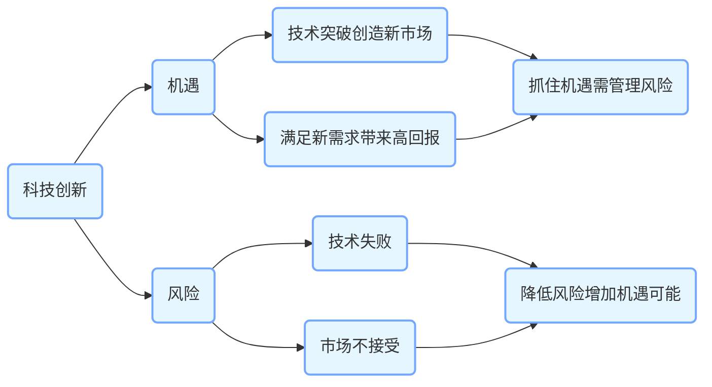

# 巴菲特 - 芒格看待科技创新：机遇与风险的平衡

> 关键词：巴菲特；芒格；科技创新；机遇；风险；平衡

> 摘要：本文围绕巴菲特和芒格对科技创新的看法，深入探讨了科技创新所带来的机遇与风险的平衡问题。首先介绍了相关背景，包括目的、预期读者等。接着阐述了核心概念与联系，分析了科技创新中的机遇和风险的原理及相互关系。通过核心算法原理与具体操作步骤，从数学模型和公式角度进行详细讲解并举例说明。结合项目实战案例，包括开发环境搭建、代码实现与解读等。探讨了科技创新在实际中的应用场景，推荐了学习工具和资源，最后总结了未来发展趋势与挑战，解答常见问题并提供扩展阅读和参考资料，旨在为读者全面理解巴菲特 - 芒格视角下科技创新的机遇与风险平衡提供深入的分析和指导。

## 1. 背景介绍
### 1.1 目的和范围
本文章旨在深入剖析巴菲特和芒格对于科技创新的独特见解，探讨他们如何看待科技创新所蕴含的机遇以及可能伴随的风险，并阐述如何在这两者之间找到平衡。我们将从多个层面展开分析，包括理论原理、实际案例以及未来趋势等，范围涵盖了科技创新的各个领域，无论是新兴的科技行业，还是传统行业中的科技应用。

### 1.2 预期读者
本文适合对投资、科技创新感兴趣的各类人群。对于投资者而言，可以借鉴巴菲特和芒格的投资理念，更好地把握科技创新领域的投资机会；对于科技从业者，有助于从投资角度理解科技创新的价值和风险，从而在技术研发和商业应用中做出更明智的决策；对于学术研究人员，可作为研究科技创新与投资关系的参考资料。

### 1.3 文档结构概述
本文将按照以下结构进行阐述：首先介绍核心概念与联系，明确科技创新中机遇和风险的内涵及相互关系；接着讲解核心算法原理和具体操作步骤，运用数学模型和公式进行详细分析并举例说明；然后通过项目实战案例，展示科技创新在实际中的应用和面临的机遇与风险；之后探讨科技创新的实际应用场景；推荐相关的学习工具和资源；最后总结未来发展趋势与挑战，解答常见问题并提供扩展阅读和参考资料。

### 1.4 术语表
#### 1.4.1 核心术语定义
- **科技创新**：指创造和应用新知识、新技术、新工艺，采用新的生产方式和经营管理模式，开发新产品，提高产品质量，提供新服务的过程。
- **机遇**：在科技创新领域，机遇指的是由于新技术的出现、市场需求的变化等因素所带来的潜在的发展机会和商业价值。
- **风险**：科技创新过程中面临的各种不确定性和可能导致损失的因素，如技术失败、市场竞争、政策变化等。
- **平衡**：在科技创新中，平衡指的是在追求机遇的同时，合理评估和管理风险，以实现可持续的发展和收益。

#### 1.4.2 相关概念解释
- **投资理念**：巴菲特和芒格所秉持的投资理念强调价值投资，即寻找具有长期竞争优势和稳定现金流的企业进行投资。在科技创新领域，他们注重评估企业的技术实力、市场前景和管理团队等因素。
- **护城河理论**：这是巴菲特提出的一个重要概念，指的是企业所拥有的可持续的竞争优势，如品牌、专利、成本优势等。在科技创新中，拥有强大的技术护城河的企业更有可能在竞争中脱颖而出。

#### 1.4.3 缩略词列表
本文中暂未使用缩略词。

## 2. 核心概念与联系
### 科技创新中的机遇
科技创新为企业和社会带来了诸多机遇。从技术层面来看，新的科技突破可以创造全新的产品和服务，满足人们未被满足的需求。例如，智能手机的出现不仅改变了人们的通讯方式，还催生了移动互联网、电子商务等多个新兴产业。从市场层面来看，科技创新可以打破传统市场的格局，为企业开辟新的市场空间。以共享经济为例，通过互联网技术和平台，共享出行、共享住宿等业务迅速发展，改变了人们的消费习惯和出行方式。

### 科技创新中的风险
然而，科技创新也伴随着巨大的风险。技术风险是其中之一，新技术的研发和应用往往具有不确定性，可能会遇到技术难题无法攻克，导致项目失败。例如，一些新兴的生物技术公司在研发新药时，可能会面临临床试验失败的风险。市场风险也是不可忽视的，即使技术成功，市场是否接受新产品和服务也是未知数。如果市场需求不足或者竞争过于激烈，企业可能无法实现盈利。此外，政策风险、资金风险等也会对科技创新产生影响。

### 机遇与风险的联系
机遇和风险是科技创新中不可分割的两个方面。机遇往往伴随着风险，高回报的机会通常意味着高风险。例如，投资新兴的人工智能企业可能会获得巨大的收益，但同时也面临着技术发展不确定、市场竞争激烈等风险。另一方面，合理地管理风险可以增加抓住机遇的可能性。通过对风险的评估和控制，企业可以在科技创新中更加稳健地前行，提高成功的概率。

下面是科技创新中机遇与风险关系的 Mermaid 流程图：


## 3. 核心算法原理 & 具体操作步骤
### 风险评估算法
在科技创新中，我们可以使用一些算法来评估风险。以下是一个简单的风险评估算法的 Python 实现：

```python
# 定义风险评估函数
def risk_evaluation(technology_risk, market_risk, policy_risk):
    # 假设每个风险因素的权重相同
    total_risk = (technology_risk + market_risk + policy_risk) / 3
    return total_risk

# 示例数据
technology_risk = 0.7  # 技术风险，取值范围 0 - 1
market_risk = 0.6  # 市场风险，取值范围 0 - 1
policy_risk = 0.5  # 政策风险，取值范围 0 - 1

# 计算总风险
total_risk = risk_evaluation(technology_risk, market_risk, policy_risk)
print(f"总风险评估值: {total_risk}")
```

### 操作步骤
1. **数据收集**：收集与科技创新项目相关的技术风险、市场风险、政策风险等数据。可以通过市场调研、专家评估等方式获取这些数据。
2. **风险量化**：将收集到的风险数据进行量化，例如使用 0 - 1 的范围来表示风险的程度，0 表示无风险，1 表示高风险。
3. **算法计算**：使用上述风险评估算法计算总风险值。
4. **决策制定**：根据总风险值，结合项目的预期收益和自身的风险承受能力，做出是否投资或推进项目的决策。

## 4. 数学模型和公式 & 详细讲解 & 举例说明
### 风险 - 收益模型
在科技创新中，我们可以使用风险 - 收益模型来评估项目的可行性。该模型可以用以下公式表示：

$$R = E - \lambda \times \sigma$$

其中，$R$ 表示项目的实际收益，$E$ 表示项目的预期收益，$\lambda$ 表示风险厌恶系数，$\sigma$ 表示项目的风险标准差。

### 详细讲解
- **预期收益 $E$**：是指项目在理想情况下可能获得的收益，可以通过市场分析、财务预测等方法来估算。
- **风险标准差 $\sigma$**：衡量了项目收益的不确定性，标准差越大，说明项目的风险越高。可以通过历史数据或者蒙特卡罗模拟等方法来计算。
- **风险厌恶系数 $\lambda$**：反映了投资者对风险的厌恶程度，$\lambda$ 值越大，说明投资者越厌恶风险。

### 举例说明
假设一个科技创新项目的预期收益 $E$ 为 100 万元，风险标准差 $\sigma$ 为 20 万元，投资者的风险厌恶系数 $\lambda$ 为 0.5。则该项目的实际收益 $R$ 为：

$$R = 100 - 0.5 \times 20 = 90 \text{（万元）}$$

这意味着考虑到风险因素后，投资者实际可能获得的收益为 90 万元。如果投资者认为这个收益是可以接受的，那么可以考虑投资该项目；否则，可能需要重新评估项目或者寻找其他投资机会。

## 5. 项目实战：代码实际案例和详细解释说明
### 5.1 开发环境搭建
假设我们要开发一个简单的科技创新项目评估系统，以下是开发环境的搭建步骤：

1. **安装 Python**：从 Python 官方网站（https://www.python.org/downloads/）下载并安装 Python 3.x 版本。
2. **安装必要的库**：使用以下命令安装所需的库：
```bash
pip install numpy pandas matplotlib
```
3. **选择开发工具**：可以使用 PyCharm、Jupyter Notebook 等开发工具。

### 5.2 源代码详细实现和代码解读
以下是一个简单的科技创新项目评估系统的 Python 代码实现：

```python
import numpy as np
import pandas as pd
import matplotlib.pyplot as plt

# 定义项目类
class InnovationProject:
    def __init__(self, expected_income, risk_std, risk_aversion):
        self.expected_income = expected_income
        self.risk_std = risk_std
        self.risk_aversion = risk_aversion

    def calculate_actual_income(self):
        # 计算实际收益
        actual_income = self.expected_income - self.risk_aversion * self.risk_std
        return actual_income

# 示例项目数据
projects = [
    InnovationProject(100, 20, 0.5),
    InnovationProject(120, 30, 0.6),
    InnovationProject(80, 15, 0.4)
]

# 计算每个项目的实际收益
actual_incomes = []
for project in projects:
    actual_income = project.calculate_actual_income()
    actual_incomes.append(actual_income)

# 创建 DataFrame 存储项目信息
project_data = pd.DataFrame({
    '预期收益': [project.expected_income for project in projects],
    '风险标准差': [project.risk_std for project in projects],
    '风险厌恶系数': [project.risk_aversion for project in projects],
    '实际收益': actual_incomes
})

# 打印项目信息
print(project_data)

# 绘制柱状图展示实际收益
plt.bar(range(len(projects)), actual_incomes)
plt.xlabel('项目编号')
plt.ylabel('实际收益')
plt.title('科技创新项目实际收益')
plt.show()
```

### 代码解读与分析
1. **类定义**：`InnovationProject` 类用于表示一个科技创新项目，包含预期收益、风险标准差和风险厌恶系数三个属性，以及计算实际收益的方法 `calculate_actual_income`。
2. **数据存储**：使用列表 `projects` 存储多个项目的信息。
3. **实际收益计算**：遍历每个项目，调用 `calculate_actual_income` 方法计算实际收益，并将结果存储在 `actual_incomes` 列表中。
4. **数据展示**：使用 `pandas` 库创建 `DataFrame` 存储项目信息，并打印出来。使用 `matplotlib` 库绘制柱状图展示每个项目的实际收益。

通过这个项目实战案例，我们可以直观地看到不同科技创新项目在考虑风险因素后的实际收益情况，从而为投资决策提供参考。

## 6. 实际应用场景
### 科技创业公司
对于科技创业公司来说，科技创新带来了巨大的机遇。例如，一些人工智能创业公司通过开发先进的算法和模型，为金融、医疗等行业提供解决方案，获得了快速的发展。然而，这些公司也面临着技术研发失败、市场竞争激烈等风险。在创业过程中，公司需要平衡机遇和风险，合理规划资金、技术研发和市场推广等方面的工作。

### 传统企业转型
传统企业在面对科技创新的浪潮时，也需要积极寻求转型。例如，制造业企业可以引入智能制造技术，提高生产效率和产品质量。但是，转型过程中可能会面临技术更新成本高、员工培训难度大等风险。企业需要评估转型的机遇和风险，制定合适的转型策略。

### 投资机构
投资机构在科技创新领域的投资中扮演着重要的角色。他们需要寻找具有潜力的科技创新项目进行投资，但同时也需要评估项目的风险。例如，风险投资机构在投资初创科技公司时，会对公司的技术团队、市场前景、商业模式等进行深入的调研和分析，以平衡投资的机遇和风险。

## 7. 工具和资源推荐
### 7.1 学习资源推荐
#### 7.1.1 书籍推荐
- 《聪明的投资者》：作者本杰明·格雷厄姆，这本书是价值投资的经典之作，巴菲特称其为自己“投资圣经”，书中的投资理念对理解科技创新领域的投资具有重要的指导意义。
- 《穷查理宝典：查理·芒格的智慧箴言录》：收录了芒格的演讲、文章等内容，展示了他的多元思维模型和投资智慧，对于学习如何看待科技创新的机遇和风险有很大的帮助。
- 《创新者的窘境》：作者克莱顿·克里斯坦森，探讨了创新对企业的影响以及企业如何应对颠覆性创新，适合科技从业者和投资者阅读。

#### 7.1.2 在线课程
- Coursera 平台上的“投资学原理”课程：由知名教授授课，系统地介绍了投资的基本原理和方法，包括风险评估、资产配置等内容。
- edX 平台上的“科技创新管理”课程：讲解了科技创新的管理策略和方法，帮助学习者了解科技创新的全过程。

#### 7.1.3 技术博客和网站
- 36氪：关注科技、商业等领域的创新动态，提供大量的科技创业公司案例和行业分析文章。
- 创业邦：为创业者和投资者提供创业资讯、项目推荐等服务，是了解科技创新领域的重要渠道。

### 7.2 开发工具框架推荐
#### 7.2.1 IDE和编辑器
- PyCharm：一款专业的 Python 集成开发环境，具有代码自动补全、调试等功能，适合 Python 开发者使用。
- Visual Studio Code：一款轻量级的代码编辑器，支持多种编程语言，具有丰富的插件扩展功能。

#### 7.2.2 调试和性能分析工具
- PDB：Python 自带的调试工具，可以帮助开发者定位代码中的问题。
- cProfile：Python 的性能分析工具，可以分析代码的运行时间和函数调用情况，帮助优化代码性能。

#### 7.2.3 相关框架和库
- TensorFlow：一个开源的机器学习框架，广泛应用于人工智能领域，可用于开发各种深度学习模型。
- Pandas：Python 的数据处理库，提供了高效的数据结构和数据分析工具，适合处理科技创新项目中的数据。

### 7.3 相关论文著作推荐
#### 7.3.1 经典论文
- “Capital Asset Pricing Model (CAPM)”：该论文提出了资本资产定价模型，用于描述资产的预期收益与风险之间的关系，对投资决策具有重要的指导意义。
- “The Theory of Economic Development”：约瑟夫·熊彼特的经典论文，阐述了创新在经济发展中的重要作用，为理解科技创新的经济意义提供了理论基础。

#### 7.3.2 最新研究成果
- 关注顶级学术期刊如《Nature》《Science》《Management Science》等上关于科技创新、投资等领域的最新研究论文，了解行业的前沿动态和研究成果。

#### 7.3.3 应用案例分析
- 一些知名的商业案例研究机构如哈佛商学院案例库、中欧国际工商学院案例中心等提供了大量的科技创新企业的案例分析，通过学习这些案例可以深入了解企业在科技创新过程中如何平衡机遇和风险。

## 8. 总结：未来发展趋势与挑战
### 未来发展趋势
- **技术融合加速**：未来，不同领域的科技将加速融合，如人工智能与生物技术、物联网与新能源技术等。这种融合将创造出更多的创新机会，为企业和社会带来更大的价值。
- **可持续创新成为主流**：随着人们对环境保护和可持续发展的关注度不断提高，科技创新将更加注重可持续性。例如，开发清洁能源技术、推广绿色制造等将成为未来的发展方向。
- **全球化竞争加剧**：科技创新的全球化趋势将更加明显，企业将面临来自全球的竞争。这将促使企业不断提高自身的创新能力和竞争力，以在全球市场中占据一席之地。

### 挑战
- **技术伦理和法律问题**：随着科技创新的快速发展，技术伦理和法律问题日益凸显。例如，人工智能的隐私保护、自动驾驶的责任认定等问题需要得到妥善解决。
- **人才短缺**：科技创新需要大量的高素质人才，但目前相关领域的人才短缺问题较为严重。如何培养和吸引优秀的科技人才是企业和社会面临的重要挑战。
- **资金压力**：科技创新项目通常需要大量的资金投入，而且回报周期较长。对于一些中小企业来说，资金压力可能会成为制约其创新发展的瓶颈。

## 9. 附录：常见问题与解答
### 问题 1：巴菲特和芒格是否完全排斥科技创新领域的投资？
解答：并不是。虽然巴菲特和芒格早期更倾向于投资传统行业，但他们也认识到科技创新的重要性。近年来，他们也对一些科技创新企业进行了投资，如苹果公司。他们在投资科技创新企业时，会更加注重企业的基本面和长期价值。

### 问题 2：如何准确评估科技创新项目的风险？
解答：可以从多个方面进行评估，包括技术风险、市场风险、政策风险等。可以通过收集相关数据、进行市场调研、咨询专家等方式来获取信息，并使用合适的风险评估模型和算法进行计算。同时，还需要考虑项目的不确定性和未来的发展趋势。

### 问题 3：科技创新项目的机遇和风险是否可以完全平衡？
解答：在实际情况中，很难实现机遇和风险的完全平衡。因为科技创新本身具有不确定性，风险是不可避免的。但是，通过合理的评估和管理，可以在一定程度上降低风险，提高抓住机遇的可能性，实现相对的平衡。

## 10. 扩展阅读 & 参考资料
### 扩展阅读
- 《黑天鹅：如何应对不可预知的未来》：作者纳西姆·尼古拉斯·塔勒布，探讨了极端不确定性事件对投资和决策的影响，对于理解科技创新中的风险具有启发意义。
- 《从0到1：开启商业与未来的秘密》：作者彼得·蒂尔，分享了创业和创新的经验和见解，适合科技创业者和投资者阅读。

### 参考资料
- 巴菲特和芒格的历年股东大会讲话和致股东信，可在伯克希尔·哈撒韦公司官方网站上查阅。
- 相关的学术研究论文和行业报告，如麦肯锡、波士顿咨询等机构发布的关于科技创新的研究报告。

作者：AI天才研究院/AI Genius Institute & 禅与计算机程序设计艺术 /Zen And The Art of Computer Programming