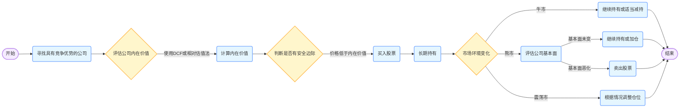

# 巴菲特 - 芒格策略在不同市场环境下的表现

> 关键词：巴菲特 - 芒格策略、市场环境、价值投资、长期投资、投资表现

> 摘要：本文深入探讨了巴菲特 - 芒格策略在不同市场环境下的表现。通过详细介绍该策略的核心概念、算法原理、数学模型，结合实际案例分析其在不同市场中的应用效果。阐述了策略在牛市、熊市、震荡市等环境中的优势与挑战，并提供了相关的工具和资源推荐。最后总结了该策略的未来发展趋势与挑战，旨在为投资者提供全面深入的参考，帮助他们更好地理解和运用巴菲特 - 芒格策略进行投资决策。

## 1. 背景介绍 
### 1.1 目的和范围
本研究的目的是全面剖析巴菲特 - 芒格策略在不同市场环境下的具体表现。范围涵盖了各种典型的市场环境，如牛市、熊市、震荡市等，通过理论分析和实际案例研究，揭示该策略在不同市场条件下的适应性、优势以及可能面临的挑战，为投资者提供在不同市场中运用该策略的指导和参考。

### 1.2 预期读者
本文预期读者主要包括专业投资者、投资机构从业者、金融领域的研究人员以及对价值投资感兴趣的普通投资者。这些读者希望深入了解巴菲特 - 芒格策略在不同市场环境下的实际应用和效果，以提升自己的投资决策能力和投资绩效。

### 1.3 文档结构概述
本文首先介绍了巴菲特 - 芒格策略的相关背景知识，包括目的、预期读者和文档结构。接着阐述了该策略的核心概念与联系，通过文本示意图和 Mermaid 流程图进行直观展示。然后详细讲解了核心算法原理和具体操作步骤，并给出 Python 源代码示例。随后介绍了相关的数学模型和公式，并举例说明。通过项目实战部分，展示了代码的实际案例和详细解释。分析了该策略在不同市场环境下的实际应用场景。提供了学习该策略的工具和资源推荐。最后总结了该策略的未来发展趋势与挑战，并附上常见问题与解答以及扩展阅读和参考资料。

### 1.4 术语表
#### 1.4.1 核心术语定义
- **巴菲特 - 芒格策略**：以沃伦·巴菲特和查理·芒格为代表的投资策略，强调价值投资、长期投资、集中投资等原则，注重公司的内在价值和竞争优势。
- **价值投资**：通过对公司基本面的分析，寻找被市场低估的股票，以合理的价格买入并长期持有，等待其价值回归。
- **内在价值**：公司未来现金流的折现值，是衡量公司真实价值的重要指标。
- **安全边际**：买入价格与公司内在价值之间的差值，用于降低投资风险。

#### 1.4.2 相关概念解释
- **长期投资**：投资者将资金投入股票或其他资产，并持有较长时间，通常为数年甚至数十年，以获取资产的长期增值。
- **集中投资**：将投资组合集中于少数几只具有高确定性的股票，而不是分散投资于大量股票。
- **护城河**：公司所拥有的可持续竞争优势，如品牌优势、成本优势、技术优势等，能够保护公司的市场份额和盈利能力。

#### 1.4.3 缩略词列表
- **DCF**：Discounted Cash Flow，现金流折现法，用于计算公司内在价值的一种方法。

## 2. 核心概念与联系 

### 核心概念原理
巴菲特 - 芒格策略的核心原理基于价值投资理念。其核心在于寻找具有长期竞争优势和稳定现金流的公司，通过对公司基本面的深入分析，评估其内在价值，并在价格低于内在价值时买入股票，长期持有等待价值回归。

该策略强调公司的“护城河”，即公司所拥有的可持续竞争优势。具有“护城河”的公司能够在市场竞争中保持领先地位，抵御竞争对手的挑战，从而实现长期稳定的盈利增长。例如，可口可乐公司的品牌优势就是其强大的“护城河”，使得该公司在饮料市场占据主导地位，拥有稳定的现金流和较高的盈利能力。

同时，该策略注重安全边际的概念。安全边际是指买入价格与公司内在价值之间的差值，它为投资者提供了一定的缓冲空间，降低了投资风险。当市场出现波动或公司面临短期困境时，具有足够安全边际的投资能够更好地抵御风险，保护投资者的本金。

### 架构的文本示意图
```plaintext
巴菲特 - 芒格策略
|-- 价值投资理念
|   |-- 寻找具有长期竞争优势的公司
|   |   |-- 品牌优势
|   |   |-- 成本优势
|   |   |-- 技术优势
|   |-- 评估公司内在价值
|   |   |-- 现金流折现法（DCF）
|   |   |-- 相对估值法
|   |-- 确定安全边际
|-- 长期投资原则
|   |-- 忽略短期市场波动
|   |-- 分享公司长期成长红利
|-- 集中投资策略
|   |-- 选择少数优质股票
|   |-- 深入研究和跟踪
```

### Mermaid 流程图


## 3. 核心算法原理 & 具体操作步骤 

### 核心算法原理
在巴菲特 - 芒格策略中，核心算法主要用于评估公司的内在价值。其中，现金流折现法（DCF）是一种常用的方法。其基本原理是将公司未来的现金流按照一定的折现率折现到当前，得到公司的内在价值。

### 具体操作步骤
1. **预测未来现金流**：分析公司的历史财务数据、行业发展趋势、市场竞争格局等因素，预测公司未来若干年的自由现金流。
2. **确定折现率**：折现率反映了投资者对投资回报的要求，通常可以使用资本资产定价模型（CAPM）来确定。
3. **计算现金流现值**：将预测的未来现金流按照折现率折现到当前，得到每年现金流的现值。
4. **计算终值**：在预测期结束后，假设公司进入稳定增长阶段，使用戈登增长模型计算公司的终值。
5. **计算内在价值**：将预测期内的现金流现值和终值相加，得到公司的内在价值。

### Python 源代码示例
```python
import numpy as np

def dcf_valuation(free_cash_flows, discount_rate, growth_rate):
    """
    现金流折现法计算公司内在价值
    :param free_cash_flows: 预测的未来自由现金流列表
    :param discount_rate: 折现率
    :param growth_rate: 稳定增长阶段的增长率
    :return: 公司内在价值
    """
    n = len(free_cash_flows)
    # 计算预测期内现金流的现值
    present_values = []
    for i, fcf in enumerate(free_cash_flows):
        present_value = fcf / ((1 + discount_rate) ** (i + 1))
        present_values.append(present_value)
    
    # 计算终值
    last_fcf = free_cash_flows[-1]
    terminal_value = last_fcf * (1 + growth_rate) / (discount_rate - growth_rate)
    terminal_present_value = terminal_value / ((1 + discount_rate) ** n)
    
    # 计算内在价值
    intrinsic_value = sum(present_values) + terminal_present_value
    return intrinsic_value

# 示例数据
free_cash_flows = [100, 120, 140, 160, 180]  # 预测的未来 5 年自由现金流
discount_rate = 0.1  # 折现率为 10%
growth_rate = 0.03  # 稳定增长阶段的增长率为 3%

intrinsic_value = dcf_valuation(free_cash_flows, discount_rate, growth_rate)
print(f"公司内在价值: {intrinsic_value}")
```

### 代码解释
- `dcf_valuation` 函数接受三个参数：`free_cash_flows` 是预测的未来自由现金流列表，`discount_rate` 是折现率，`growth_rate` 是稳定增长阶段的增长率。
- 函数首先计算预测期内现金流的现值，然后使用戈登增长模型计算终值，并将终值折现到当前。
- 最后将预测期内现金流的现值和终值相加，得到公司的内在价值。

## 4. 数学模型和公式 & 详细讲解 & 举例说明 

### 现金流折现法（DCF）公式
$$
V = \sum_{t=1}^{n} \frac{FCF_t}{(1 + r)^t} + \frac{FCF_n \times (1 + g)}{(r - g) \times (1 + r)^n}
$$
其中：
- $V$ 表示公司的内在价值。
- $FCF_t$ 表示第 $t$ 年的自由现金流。
- $r$ 表示折现率。
- $n$ 表示预测期的年数。
- $g$ 表示稳定增长阶段的增长率。

### 详细讲解
- **预测期现金流现值**：$\sum_{t=1}^{n} \frac{FCF_t}{(1 + r)^t}$ 部分计算了预测期内每年自由现金流的现值。将每年的自由现金流按照折现率 $r$ 折现到当前，反映了未来现金流的时间价值。
- **终值**：$\frac{FCF_n \times (1 + g)}{(r - g) \times (1 + r)^n}$ 部分计算了预测期结束后公司的终值。假设公司在预测期结束后进入稳定增长阶段，使用戈登增长模型计算终值，并将其折现到当前。

### 举例说明
假设一家公司未来 5 年的自由现金流分别为 100 万元、120 万元、140 万元、160 万元和 180 万元，折现率为 10%，稳定增长阶段的增长率为 3%。

1. **计算预测期内现金流的现值**：
    - 第 1 年现金流现值：$\frac{100}{(1 + 0.1)^1} \approx 90.91$ 万元
    - 第 2 年现金流现值：$\frac{120}{(1 + 0.1)^2} \approx 99.17$ 万元
    - 第 3 年现金流现值：$\frac{140}{(1 + 0.1)^3} \approx 105.18$ 万元
    - 第 4 年现金流现值：$\frac{160}{(1 + 0.1)^4} \approx 109.28$ 万元
    - 第 5 年现金流现值：$\frac{180}{(1 + 0.1)^5} \approx 111.73$ 万元
    - 预测期内现金流现值总和：$90.91 + 99.17 + 105.18 + 109.28 + 111.73 = 516.27$ 万元

2. **计算终值**：
    - 第 5 年自由现金流为 180 万元，终值为：$\frac{180 \times (1 + 0.03)}{(0.1 - 0.03) \times (1 + 0.1)^5} \approx 1747.34$ 万元

3. **计算内在价值**：
    - 内在价值 = 预测期内现金流现值总和 + 终值 = $516.27 + 1747.34 = 2263.61$ 万元

通过以上计算，我们可以得出该公司的内在价值约为 2263.61 万元。

## 5. 项目实战：代码实际案例和详细解释说明 

### 5.1  开发环境搭建
- **Python 环境**：建议使用 Python 3.7 及以上版本。可以从 Python 官方网站（https://www.python.org/downloads/）下载并安装。
- **开发工具**：推荐使用 PyCharm 或 Jupyter Notebook 作为开发工具。PyCharm 是一款功能强大的 Python 集成开发环境，提供了代码编辑、调试、版本控制等功能；Jupyter Notebook 则适合进行交互式编程和数据分析。
- **所需库**：在本项目中，需要使用 `numpy` 库进行数值计算。可以使用以下命令安装：
```sh
pip install numpy
```

### 5.2  源代码详细实现和代码解读
以下是一个完整的 Python 代码示例，用于使用现金流折现法评估公司的内在价值，并根据内在价值和当前股价判断是否具有投资价值。

```python
import numpy as np

def dcf_valuation(free_cash_flows, discount_rate, growth_rate):
    """
    现金流折现法计算公司内在价值
    :param free_cash_flows: 预测的未来自由现金流列表
    :param discount_rate: 折现率
    :param growth_rate: 稳定增长阶段的增长率
    :return: 公司内在价值
    """
    n = len(free_cash_flows)
    # 计算预测期内现金流的现值
    present_values = []
    for i, fcf in enumerate(free_cash_flows):
        present_value = fcf / ((1 + discount_rate) ** (i + 1))
        present_values.append(present_value)
    
    # 计算终值
    last_fcf = free_cash_flows[-1]
    terminal_value = last_fcf * (1 + growth_rate) / (discount_rate - growth_rate)
    terminal_present_value = terminal_value / ((1 + discount_rate) ** n)
    
    # 计算内在价值
    intrinsic_value = sum(present_values) + terminal_present_value
    return intrinsic_value

def investment_decision(intrinsic_value, current_price):
    """
    根据内在价值和当前股价判断是否具有投资价值
    :param intrinsic_value: 公司内在价值
    :param current_price: 当前股价
    :return: 投资建议
    """
    if intrinsic_value > current_price:
        return "具有投资价值，可以考虑买入"
    else:
        return "不具有投资价值，建议观望"

# 示例数据
free_cash_flows = [100, 120, 140, 160, 180]  # 预测的未来 5 年自由现金流
discount_rate = 0.1  # 折现率为 10%
growth_rate = 0.03  # 稳定增长阶段的增长率为 3%
current_price = 2000  # 当前股价

# 计算内在价值
intrinsic_value = dcf_valuation(free_cash_flows, discount_rate, growth_rate)
print(f"公司内在价值: {intrinsic_value}")

# 做出投资决策
decision = investment_decision(intrinsic_value, current_price)
print(f"投资建议: {decision}")
```

### 代码解读
- `dcf_valuation` 函数：该函数实现了现金流折现法的核心计算逻辑，接受预测的未来自由现金流列表、折现率和稳定增长阶段的增长率作为输入，返回公司的内在价值。
- `investment_decision` 函数：该函数根据公司的内在价值和当前股价判断是否具有投资价值，返回相应的投资建议。
- 主程序部分：定义了示例数据，调用 `dcf_valuation` 函数计算公司的内在价值，然后调用 `investment_decision` 函数做出投资决策，并打印结果。

### 5.3  代码解读与分析
- **现金流预测的重要性**：在实际应用中，准确预测公司未来的自由现金流是使用现金流折现法的关键。这需要对公司的业务模式、市场竞争格局、行业发展趋势等进行深入分析。
- **折现率的选择**：折现率的选择直接影响到公司内在价值的计算结果。折现率反映了投资者对投资回报的要求，通常可以使用资本资产定价模型（CAPM）来确定。
- **投资决策的局限性**：仅仅根据内在价值和当前股价做出投资决策是不够的，还需要考虑市场环境、公司的基本面变化、行业竞争等因素。因此，在实际投资中，需要综合考虑多方面的因素，做出更加谨慎的投资决策。

## 6. 实际应用场景 
### 牛市环境
在牛市环境中，市场整体上涨，投资者情绪乐观。巴菲特 - 芒格策略在牛市中的表现通常具有以下特点：
- **长期持股收益显著**：由于该策略强调长期投资，持有具有竞争优势的公司股票，在牛市中这些公司的股价往往会随着市场的上涨而大幅上升，投资者可以获得显著的收益。例如，在 2006 - 2007 年的大牛市中，巴菲特持有可口可乐、富国银行等股票，获得了丰厚的回报。
- **适当减持锁定利润**：当市场估值过高时，巴菲特 - 芒格策略会适当减持部分股票，锁定利润。例如，在 2000 年互联网泡沫破裂之前，巴菲特减持了部分科技股，避免了随后的市场暴跌带来的损失。

### 熊市环境
在熊市环境中，市场整体下跌，投资者情绪悲观。巴菲特 - 芒格策略在熊市中的表现具有以下优势：
- **安全边际提供保护**：该策略注重安全边际，在买入股票时会选择价格低于内在价值的公司，因此在熊市中能够更好地抵御市场下跌的风险。例如，在 2008 年金融危机期间，巴菲特以较低的价格买入了高盛、通用电气等公司的股票，当市场逐渐复苏时，这些投资获得了丰厚的回报。
- **寻找低估机会**：熊市中市场恐慌情绪蔓延，许多优质公司的股价也会被过度低估。巴菲特 - 芒格策略会抓住这些机会，以低价买入具有长期竞争优势的公司股票，为未来的投资收益奠定基础。

### 震荡市环境
在震荡市环境中，市场波动较大，缺乏明显的趋势。巴菲特 - 芒格策略在震荡市中的表现如下：
- **坚守优质公司**：该策略会坚守具有长期竞争优势的优质公司，忽略短期市场波动。例如，在市场震荡期间，巴菲特继续持有消费、金融等行业的优质公司股票，通过公司的业绩增长获得稳定的收益。
- **调整仓位应对波动**：根据市场的波动情况，适当调整投资组合的仓位。当市场估值过高时，降低仓位；当市场估值过低时，增加仓位。

## 7. 工具和资源推荐
### 7.1 学习资源推荐
#### 7.1.1 书籍推荐
- 《聪明的投资者》（The Intelligent Investor）：本杰明·格雷厄姆著，被誉为投资界的圣经，介绍了价值投资的基本原理和方法。
- 《巴菲特致股东的信：股份公司教程》（Letters to Shareholders of Berkshire Hathaway）：沃伦·巴菲特著，收录了巴菲特历年致股东的信，展示了他的投资理念和决策过程。
- 《穷查理宝典：查理·芒格的智慧箴言录》（Poor Charlie's Almanack: The Wit and Wisdom of Charles T. Munger）：查理·芒格著，介绍了芒格的多元思维模型和投资哲学。

#### 7.1.2 在线课程
- Coursera 上的“投资学原理”（Principles of Investing）：由哥伦比亚大学教授授课，系统介绍了投资学的基本原理和方法。
- edX 上的“价值投资：从入门到精通”（Value Investing: From Beginner to Expert）：深入讲解了价值投资的理论和实践。

#### 7.1.3 技术博客和网站
- 雪球网（https://xueqiu.com/）：国内知名的投资社区，提供股票行情、投资分析、交流讨论等功能。
- Seeking Alpha（https://seekingalpha.com/）：全球知名的投资研究网站，提供大量的股票分析报告和投资建议。

### 7.2 开发工具框架推荐
#### 7.2.1 IDE和编辑器
- PyCharm：功能强大的 Python 集成开发环境，提供代码编辑、调试、版本控制等功能。
- Jupyter Notebook：适合进行交互式编程和数据分析，方便展示代码和结果。

#### 7.2.2 调试和性能分析工具
- PySnooper：可以自动记录函数的执行过程，方便调试代码。
- cProfile：Python 内置的性能分析工具，用于分析代码的性能瓶颈。

#### 7.2.3 相关框架和库
- Pandas：用于数据处理和分析的 Python 库，提供了高效的数据结构和数据操作方法。
- NumPy：用于科学计算的 Python 库，提供了高效的数组操作和数学函数。

### 7.3 相关论文著作推荐
#### 7.3.1 经典论文
- 《证券分析》（Security Analysis）：本杰明·格雷厄姆和大卫·多德著，奠定了价值投资的理论基础。
- 《有效市场假说》（Efficient Markets Hypothesis）：尤金·法玛著，探讨了市场效率和股票价格的关系。

#### 7.3.2 最新研究成果
- 关注顶级金融学术期刊，如《Journal of Finance》《Review of Financial Studies》等，了解价值投资领域的最新研究动态。

#### 7.3.3 应用案例分析
- 《巴菲特的投资组合》（The Warren Buffett Portfolio）：罗伯特·哈格斯特朗著，通过分析巴菲特的投资组合，介绍了价值投资的实际应用案例。

## 8. 总结：未来发展趋势与挑战
### 未来发展趋势
- **数字化转型**：随着科技的发展，金融行业也在不断进行数字化转型。巴菲特 - 芒格策略可能会结合大数据、人工智能等技术，更加精准地评估公司的内在价值和投资风险。
- **全球投资机会增加**：随着全球经济一体化的发展，投资者可以更容易地投资于全球市场。巴菲特 - 芒格策略可能会更加关注全球范围内的投资机会，寻找具有竞争优势的公司。
- **社会责任投资兴起**：越来越多的投资者开始关注公司的社会责任和可持续发展。巴菲特 - 芒格策略可能会在投资决策中更加注重公司的社会责任表现，选择具有良好社会形象和可持续发展能力的公司。

### 挑战
- **市场环境变化**：市场环境日益复杂多变，新兴技术、政策法规等因素都会对市场产生影响。巴菲特 - 芒格策略需要不断适应市场环境的变化，调整投资策略。
- **信息过载**：随着信息传播的速度加快，投资者面临着大量的信息。如何从海量信息中筛选出有价值的信息，准确评估公司的基本面，是巴菲特 - 芒格策略面临的挑战之一。
- **竞争加剧**：价值投资理念已经被越来越多的投资者所接受，市场竞争加剧。寻找被低估的优质公司变得更加困难，需要投资者具备更高的分析能力和洞察力。

## 9. 附录：常见问题与解答
### 问题 1：巴菲特 - 芒格策略是否适合所有投资者？
解答：巴菲特 - 芒格策略强调长期投资和价值投资，需要投资者具备较强的耐心和分析能力。对于短期投机者或风险偏好较高的投资者来说，该策略可能不太适合。但对于追求长期稳定收益、注重基本面分析的投资者来说，该策略是一种值得借鉴的投资方法。

### 问题 2：如何准确预测公司的未来现金流？
解答：准确预测公司的未来现金流是一项具有挑战性的任务。需要综合考虑公司的历史财务数据、行业发展趋势、市场竞争格局、公司的战略规划等因素。可以参考分析师的研究报告，但也要进行自己的独立分析和判断。同时，要注意现金流预测的不确定性，适当考虑不同情景下的现金流情况。

### 问题 3：现金流折现法中的折现率如何确定？
解答：折现率反映了投资者对投资回报的要求，通常可以使用资本资产定价模型（CAPM）来确定。CAPM 公式为：$r = R_f + \beta \times (R_m - R_f)$，其中 $r$ 是折现率，$R_f$ 是无风险利率，$\beta$ 是股票的贝塔系数，$R_m$ 是市场预期收益率。无风险利率可以参考国债收益率，贝塔系数可以通过历史数据计算或参考专业机构的估计，市场预期收益率可以根据市场的长期平均收益率来确定。

## 10. 扩展阅读 & 参考资料
### 扩展阅读
- 《投资最重要的事》（The Most Important Thing Illuminated）：霍华德·马克斯著，介绍了投资中的重要原则和思维方式。
- 《金融炼金术》（The Alchemy of Finance）：乔治·索罗斯著，探讨了金融市场的运行规律和投资者的心理因素。

### 参考资料
- 沃伦·巴菲特历年致股东的信：https://www.berkshirehathaway.com/letters/letters.html
- 查理·芒格的演讲和文章：https://fs.blog/charlie-munger-speeches/

作者：AI天才研究院/AI Genius Institute & 禅与计算机程序设计艺术 /Zen And The Art of Computer Programming