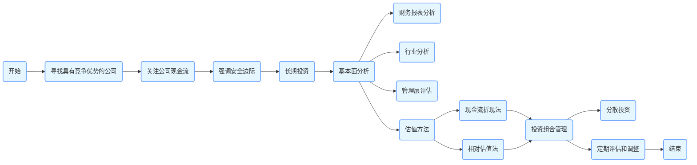

# 巴菲特 - 芒格策略在个人投资中的应用

> 关键词：巴菲特 - 芒格策略、个人投资、价值投资、长期投资、安全边际

> 摘要：本文旨在深入探讨巴菲特 - 芒格策略在个人投资中的应用。通过介绍该策略的背景和核心概念，详细阐述其核心算法原理、数学模型，结合实际案例展示如何在个人投资中运用这一策略。同时，分析其实际应用场景，推荐相关的学习资源、开发工具框架以及论文著作。最后，总结该策略在未来投资领域的发展趋势与挑战，并对常见问题进行解答。

## 1. 背景介绍 
### 1.1 目的和范围
本文的目的是帮助个人投资者理解并应用巴菲特 - 芒格策略进行投资决策。我们将探讨该策略的核心思想、具体方法以及如何将其应用于个人投资组合的构建和管理。范围涵盖了从基础概念的介绍到实际案例的分析，以及对未来发展趋势的展望。

### 1.2 预期读者
本文预期读者为对投资感兴趣的个人投资者，无论其投资经验水平如何。对于初学者，本文将提供一个全面的入门指南；对于有一定经验的投资者，本文将提供深入的分析和新的思考角度。

### 1.3 文档结构概述
本文将按照以下结构进行组织：首先介绍巴菲特 - 芒格策略的核心概念与联系，包括其原理和架构；接着详细阐述核心算法原理和具体操作步骤，并结合 Python 代码进行说明；然后介绍相关的数学模型和公式，并通过举例进行详细讲解；随后通过实际案例展示该策略在个人投资中的应用；分析其实际应用场景；推荐相关的工具和资源；总结未来发展趋势与挑战；最后提供常见问题的解答和扩展阅读参考资料。

### 1.4 术语表
#### 1.4.1 核心术语定义
- **价值投资**：一种投资策略，强调通过分析公司的内在价值来选择投资标的，而不是仅仅关注市场价格的波动。
- **安全边际**：指在购买股票时，以低于其内在价值的价格买入，以降低投资风险。
- **长期投资**：投资者持有资产的时间较长，通常为数年甚至数十年，以获得资产的长期增值。
- **护城河**：指公司具有的一种可持续的竞争优势，使其能够在市场中抵御竞争对手的挑战，保持较高的盈利能力。

#### 1.4.2 相关概念解释
- **内在价值**：公司未来现金流的现值，是评估公司真实价值的重要指标。
- **市场先生**：巴菲特提出的一个概念，将市场比喻为一个情绪不稳定的先生，他会在不同的时间给出不同的报价，投资者应该利用市场先生的情绪波动，而不是被其左右。
- **能力圈**：投资者应该只投资于自己熟悉和了解的领域，避免涉足自己不熟悉的行业。

#### 1.4.3 缩略词列表
- **PE**：市盈率，即股票价格与每股收益的比率，用于衡量股票的估值水平。
- **PB**：市净率，即股票价格与每股净资产的比率，也是衡量股票估值的重要指标。

## 2. 核心概念与联系 
### 核心概念原理
巴菲特 - 芒格策略的核心是价值投资，其基本原理是通过深入研究公司的基本面，评估其内在价值，并在价格低于内在价值时买入股票，长期持有以获得资产的增值。该策略强调以下几个方面：
- **寻找具有竞争优势的公司**：巴菲特和芒格认为，具有竞争优势的公司能够在市场中获得高于平均水平的利润，并且能够抵御竞争对手的挑战。这些竞争优势可以表现为品牌优势、技术优势、成本优势等。
- **关注公司的现金流**：现金流是公司生存和发展的基础，巴菲特和芒格非常重视公司的现金流状况。他们认为，只有具有稳定和充足现金流的公司才能在长期内保持良好的发展态势。
- **强调安全边际**：安全边际是价值投资的重要原则之一，它可以帮助投资者降低投资风险。在购买股票时，巴菲特和芒格会尽量以低于公司内在价值的价格买入，以确保在市场波动时有足够的缓冲空间。
- **长期投资**：巴菲特和芒格主张长期投资，他们认为短期市场波动是不可预测的，而长期来看，优秀公司的价值会不断增长。因此，投资者应该耐心持有股票，避免频繁交易。

### 架构的文本示意图
```plaintext
巴菲特 - 芒格策略
|-- 价值投资理念
|   |-- 寻找具有竞争优势的公司
|   |-- 关注公司的现金流
|   |-- 强调安全边际
|   |-- 长期投资
|-- 投资分析方法
|   |-- 基本面分析
|   |   |-- 财务报表分析
|   |   |-- 行业分析
|   |   |-- 管理层评估
|   |-- 估值方法
|   |   |-- 现金流折现法
|   |   |-- 相对估值法
|-- 投资组合管理
|   |-- 分散投资
|   |-- 定期评估和调整
```

### Mermaid 流程图


## 3. 核心算法原理 & 具体操作步骤 
### 核心算法原理
巴菲特 - 芒格策略的核心算法原理主要围绕公司内在价值的评估和投资决策的制定。其中，现金流折现法是评估公司内在价值的重要方法之一，其基本原理是将公司未来的现金流按照一定的折现率折现到当前时刻，得到公司的内在价值。

### 具体操作步骤
#### 步骤 1：选择具有竞争优势的公司
通过研究行业竞争格局、公司的市场地位、品牌影响力、技术实力等因素，筛选出具有竞争优势的公司。

#### 步骤 2：分析公司的财务报表
仔细研究公司的资产负债表、利润表和现金流量表，了解公司的财务状况、盈利能力和现金流状况。重点关注以下指标：
- **净利润**：反映公司的盈利能力。
- **毛利率**：反映公司产品或服务的盈利能力。
- **净资产收益率（ROE）**：反映公司运用自有资本的效率。
- **自由现金流**：反映公司在扣除必要的资本支出后能够自由支配的现金流量。

#### 步骤 3：评估公司的管理层
考察公司管理层的能力、诚信和战略眼光。优秀的管理层能够带领公司实现长期稳定的发展。

#### 步骤 4：估算公司的内在价值
使用现金流折现法或相对估值法估算公司的内在价值。以下是现金流折现法的 Python 代码示例：
```python
import numpy as np

def discounted_cash_flow(free_cash_flows, discount_rate):
    """
    计算现金流折现价值
    :param free_cash_flows: 未来各期的自由现金流列表
    :param discount_rate: 折现率
    :return: 现金流折现价值
    """
    n = len(free_cash_flows)
    discounted_flows = []
    for i in range(n):
        discounted_flows.append(free_cash_flows[i] / ((1 + discount_rate) ** (i + 1)))
    return sum(discounted_flows)

# 示例数据
free_cash_flows = [100, 120, 150, 180, 200]
discount_rate = 0.1

# 计算现金流折现价值
intrinsic_value = discounted_cash_flow(free_cash_flows, discount_rate)
print(f"公司的内在价值为: {intrinsic_value}")
```

#### 步骤 5：确定安全边际
根据公司的内在价值和当前市场价格，确定安全边际。一般来说，安全边际越大，投资风险越低。

#### 步骤 6：构建投资组合
根据筛选出的具有投资价值的公司，构建投资组合。投资组合应该具有一定的分散性，以降低单一股票的风险。

#### 步骤 7：定期评估和调整
定期对投资组合进行评估，根据公司的基本面变化和市场情况，调整投资组合。

## 4. 数学模型和公式 & 详细讲解 & 举例说明 
### 现金流折现法
现金流折现法（Discounted Cash Flow, DCF）是一种常用的估值方法，其基本公式为：
$$V = \sum_{t=1}^{n} \frac{FCF_t}{(1 + r)^t}$$
其中：
- $V$ 表示公司的内在价值
- $FCF_t$ 表示第 $t$ 期的自由现金流
- $r$ 表示折现率
- $n$ 表示预测期数

### 详细讲解
现金流折现法的核心思想是将公司未来的现金流按照一定的折现率折现到当前时刻，得到公司的内在价值。折现率反映了投资者对资金时间价值和投资风险的要求。一般来说，折现率越高，公司的内在价值越低。

### 举例说明
假设一家公司未来 5 年的自由现金流分别为 100 万元、120 万元、150 万元、180 万元和 200 万元，折现率为 10%。则该公司的内在价值为：
$$V = \frac{100}{(1 + 0.1)^1} + \frac{120}{(1 + 0.1)^2} + \frac{150}{(1 + 0.1)^3} + \frac{180}{(1 + 0.1)^4} + \frac{200}{(1 + 0.1)^5}$$
```python
import numpy as np

free_cash_flows = [100, 120, 150, 180, 200]
discount_rate = 0.1
n = len(free_cash_flows)
intrinsic_value = 0
for i in range(n):
    intrinsic_value += free_cash_flows[i] / ((1 + discount_rate) ** (i + 1))

print(f"公司的内在价值为: {intrinsic_value} 万元")
```
通过计算，该公司的内在价值约为 573.56 万元。

### 相对估值法
相对估值法是通过比较公司与同行业其他公司的估值指标，来评估公司的价值。常用的相对估值指标包括市盈率（PE）、市净率（PB）等。

#### 市盈率法
市盈率法的基本公式为：
$$P = EPS \times PE$$
其中：
- $P$ 表示股票价格
- $EPS$ 表示每股收益
- $PE$ 表示市盈率

#### 市净率法
市净率法的基本公式为：
$$P = BVPS \times PB$$
其中：
- $P$ 表示股票价格
- $BVPS$ 表示每股净资产
- $PB$ 表示市净率

### 详细讲解
相对估值法的优点是简单易懂，容易操作。通过比较公司与同行业其他公司的估值指标，可以快速判断公司的估值水平是偏高还是偏低。但是，相对估值法也存在一定的局限性，因为不同公司的盈利能力、成长前景等因素可能存在较大差异，单纯依靠估值指标进行比较可能会得出不准确的结论。

### 举例说明
假设一家公司的每股收益为 2 元，同行业平均市盈率为 15 倍。则该公司的合理股价为：
$$P = 2 \times 15 = 30$$（元）

## 5. 项目实战：代码实际案例和详细解释说明 
### 5.1  开发环境搭建
为了实现巴菲特 - 芒格策略的投资分析，我们需要搭建一个 Python 开发环境。以下是具体的步骤：
1. **安装 Python**：从 Python 官方网站（https://www.python.org/downloads/）下载并安装 Python 3.x 版本。
2. **安装必要的库**：使用 `pip` 命令安装以下必要的库：
```sh
pip install pandas numpy matplotlib yfinance
```
- `pandas`：用于数据处理和分析。
- `numpy`：用于数值计算。
- `matplotlib`：用于数据可视化。
- `yfinance`：用于获取股票数据。

### 5.2  源代码详细实现和代码解读
以下是一个使用 Python 实现巴菲特 - 芒格策略的投资分析的示例代码：
```python
import yfinance as yf
import pandas as pd
import numpy as np
import matplotlib.pyplot as plt

# 定义股票代码和时间范围
ticker = 'AAPL'
start_date = '2010-01-01'
end_date = '2023-01-01'

# 获取股票数据
data = yf.download(ticker, start=start_date, end=end_date)

# 计算简单移动平均线（SMA）
data['SMA_50'] = data['Close'].rolling(window=50).mean()
data['SMA_200'] = data['Close'].rolling(window=200).mean()

# 绘制股票价格和移动平均线
plt.figure(figsize=(12, 6))
plt.plot(data['Close'], label='Close Price')
plt.plot(data['SMA_50'], label='SMA 50')
plt.plot(data['SMA_200'], label='SMA 200')
plt.title(f'{ticker} Stock Price and Moving Averages')
plt.xlabel('Date')
plt.ylabel('Price')
plt.legend()
plt.show()

# 计算收益率
data['Returns'] = data['Close'].pct_change()

# 计算夏普比率
risk_free_rate = 0.02  # 假设无风险利率为 2%
sharpe_ratio = (data['Returns'].mean() - risk_free_rate) / data['Returns'].std() * np.sqrt(252)
print(f'Sharpe Ratio: {sharpe_ratio}')

# 模拟投资策略：当 SMA_50 上穿 SMA_200 时买入，下穿时卖出
data['Signal'] = 0
data.loc[data['SMA_50'] > data['SMA_200'], 'Signal'] = 1
data.loc[data['SMA_50'] < data['SMA_200'], 'Signal'] = -1
data['Position'] = data['Signal'].diff()

# 计算投资组合的收益率
data['Portfolio_Returns'] = data['Returns'] * data['Signal'].shift(1)

# 绘制投资组合的累计收益率
cumulative_returns = (1 + data['Portfolio_Returns']).cumprod()
plt.figure(figsize=(12, 6))
plt.plot(cumulative_returns, label='Portfolio Cumulative Returns')
plt.title(f'{ticker} Portfolio Cumulative Returns')
plt.xlabel('Date')
plt.ylabel('Cumulative Returns')
plt.legend()
plt.show()
```

### 代码解读与分析
#### 数据获取
使用 `yfinance` 库获取指定股票在指定时间范围内的历史数据。
```python
data = yf.download(ticker, start=start_date, end=end_date)
```

#### 移动平均线计算
计算股票价格的 50 日和 200 日简单移动平均线（SMA），用于判断股票的趋势。
```python
data['SMA_50'] = data['Close'].rolling(window=50).mean()
data['SMA_200'] = data['Close'].rolling(window=200).mean()
```

#### 数据可视化
使用 `matplotlib` 库绘制股票价格和移动平均线的图表，直观展示股票的走势。
```python
plt.figure(figsize=(12, 6))
plt.plot(data['Close'], label='Close Price')
plt.plot(data['SMA_50'], label='SMA 50')
plt.plot(data['SMA_200'], label='SMA 200')
plt.title(f'{ticker} Stock Price and Moving Averages')
plt.xlabel('Date')
plt.ylabel('Price')
plt.legend()
plt.show()
```

#### 收益率计算
计算股票的每日收益率，并计算夏普比率，评估投资组合的风险调整后收益。
```python
data['Returns'] = data['Close'].pct_change()
risk_free_rate = 0.02
sharpe_ratio = (data['Returns'].mean() - risk_free_rate) / data['Returns'].std() * np.sqrt(252)
```

#### 投资策略模拟
根据 50 日和 200 日移动平均线的交叉情况生成买卖信号，并计算投资组合的收益率。
```python
data['Signal'] = 0
data.loc[data['SMA_50'] > data['SMA_200'], 'Signal'] = 1
data.loc[data['SMA_50'] < data['SMA_200'], 'Signal'] = -1
data['Position'] = data['Signal'].diff()
data['Portfolio_Returns'] = data['Returns'] * data['Signal'].shift(1)
```

#### 投资组合累计收益率绘制
绘制投资组合的累计收益率图表，展示投资组合的长期表现。
```python
cumulative_returns = (1 + data['Portfolio_Returns']).cumprod()
plt.figure(figsize=(12, 6))
plt.plot(cumulative_returns, label='Portfolio Cumulative Returns')
plt.title(f'{ticker} Portfolio Cumulative Returns')
plt.xlabel('Date')
plt.ylabel('Cumulative Returns')
plt.legend()
plt.show()
```

## 6. 实际应用场景 
### 股票投资
巴菲特 - 芒格策略在股票投资中具有广泛的应用。个人投资者可以通过深入研究公司的基本面，寻找具有竞争优势、现金流稳定、估值合理的公司进行投资。例如，巴菲特长期持有可口可乐、苹果等公司的股票，获得了丰厚的回报。

### 基金投资
在选择基金时，投资者也可以运用巴菲特 - 芒格策略的思想。选择那些由具有长期投资理念、注重基本面分析的基金经理管理的基金。同时，关注基金的投资组合，选择那些投资于具有竞争优势公司的基金。

### 房地产投资
虽然巴菲特 - 芒格策略主要应用于股票投资，但其中的一些思想也可以应用于房地产投资。例如，投资者可以寻找具有良好地理位置、租金回报率高、增值潜力大的房产进行投资。同时，要关注房地产市场的基本面，避免在市场过热时盲目投资。

### 企业投资
对于企业投资者来说，巴菲特 - 芒格策略可以帮助他们评估潜在的投资项目。在进行企业并购或投资时，投资者可以通过分析目标企业的财务状况、市场地位、竞争优势等因素，评估其内在价值，并在价格合理时进行投资。

## 7. 工具和资源推荐
### 7.1 学习资源推荐
#### 7.1.1 书籍推荐
- 《聪明的投资者》（The Intelligent Investor）：本杰明·格雷厄姆著，价值投资的经典之作，巴菲特称这本书是他投资生涯的启蒙读物。
- 《巴菲特致股东的信》（Letters to Shareholders of Berkshire Hathaway）：沃伦·巴菲特著，书中包含了巴菲特多年来写给股东的信，详细阐述了他的投资理念和方法。
- 《穷查理宝典》（Poor Charlie's Almanack）：查理·芒格著，书中收录了芒格的演讲和文章，展示了他的多元思维模型和投资智慧。

#### 7.1.2 在线课程
- Coursera 上的“投资学原理”（Principles of Investing）：该课程由宾夕法尼亚大学的教授授课，介绍了投资的基本原理和方法。
- edX 上的“价值投资基础”（Foundations of Value Investing）：该课程由哥伦比亚大学的教授授课，深入讲解了价值投资的理论和实践。

#### 7.1.3 技术博客和网站
- 雪球（https://xueqiu.com/）：国内知名的投资社区，提供股票、基金等投资产品的信息和分析。
- Seeking Alpha（https://seekingalpha.com/）：国外知名的投资分析网站，提供专业的股票分析和投资建议。

### 7.2 开发工具框架推荐
#### 7.2.1 IDE和编辑器
- PyCharm：一款专业的 Python 集成开发环境，提供代码编辑、调试、版本控制等功能。
- Jupyter Notebook：一个交互式的编程环境，适合进行数据分析和可视化。

#### 7.2.2 调试和性能分析工具
- PDB：Python 自带的调试工具，可以帮助开发者定位代码中的问题。
- cProfile：Python 的性能分析工具，可以分析代码的运行时间和内存使用情况。

#### 7.2.3 相关框架和库
- Pandas：用于数据处理和分析的 Python 库，提供了丰富的数据结构和函数。
- NumPy：用于数值计算的 Python 库，提供了高效的数组操作和数学函数。
- Matplotlib：用于数据可视化的 Python 库，提供了多种绘图工具。

### 7.3 相关论文著作推荐
#### 7.3.1 经典论文
- 《证券分析》（Security Analysis）：本杰明·格雷厄姆和戴维·多德著，价值投资理论的奠基之作。
- 《有效市场假说》（Efficient Market Hypothesis）：尤金·法玛著，阐述了市场效率的概念和分类。

#### 7.3.2 最新研究成果
- 《行为金融学》（Behavioral Finance）：研究投资者心理和行为对金融市场的影响，为投资决策提供了新的视角。
- 《量化投资》（Quantitative Investing）：结合数学模型和计算机技术进行投资决策，提高投资效率和准确性。

#### 7.3.3 应用案例分析
- 《巴菲特的投资组合》（The Warren Buffett Portfolio）：详细分析了巴菲特的投资组合和投资策略，为投资者提供了实际操作的参考。
- 《芒格的投资智慧》（Charlie Munger's Investment Wisdom）：介绍了芒格的投资思想和方法，并通过实际案例进行了说明。

## 8. 总结：未来发展趋势与挑战
### 未来发展趋势
- **数字化和智能化**：随着科技的不断发展，投资领域也将越来越数字化和智能化。人工智能、大数据等技术将被广泛应用于投资分析和决策，提高投资效率和准确性。
- **全球一体化**：全球经济的一体化趋势将继续加强，投资者将有更多的机会参与全球市场的投资。同时，跨国投资和并购活动也将更加频繁。
- **社会责任投资**：越来越多的投资者开始关注企业的社会责任和可持续发展，社会责任投资将成为未来投资的一个重要趋势。

### 挑战
- **市场不确定性增加**：全球政治、经济形势的不确定性增加，市场波动加剧，给投资者带来了更大的挑战。
- **信息过载**：互联网的发展使得信息传播速度加快，投资者面临着信息过载的问题。如何筛选和分析有用的信息，成为投资者需要解决的重要问题。
- **技术变革带来的挑战**：科技的快速发展也带来了新的投资风险，例如区块链、人工智能等新兴技术的应用可能会对传统行业产生冲击。

## 9. 附录：常见问题与解答
### 问题 1：巴菲特 - 芒格策略适合所有投资者吗？
解答：巴菲特 - 芒格策略并不适合所有投资者。该策略需要投资者具备一定的财务知识和分析能力，能够深入研究公司的基本面。同时，该策略强调长期投资，需要投资者有足够的耐心和定力。对于那些追求短期收益、缺乏专业知识的投资者来说，可能不太适合采用该策略。

### 问题 2：如何确定公司的内在价值？
解答：确定公司的内在价值是一个复杂的过程，需要综合考虑多个因素。常用的方法包括现金流折现法、相对估值法等。现金流折现法需要预测公司未来的现金流，并选择合适的折现率进行折现；相对估值法需要比较公司与同行业其他公司的估值指标。在实际应用中，投资者可以结合多种方法进行评估，并根据自己的判断进行调整。

### 问题 3：安全边际的大小应该如何确定？
解答：安全边际的大小没有固定的标准，需要根据市场情况、公司的基本面和投资者的风险偏好等因素来确定。一般来说，市场波动较大、公司的不确定性较高时，安全边际应该适当扩大；反之，安全边际可以适当缩小。投资者可以通过比较公司的内在价值和市场价格，结合自己的风险承受能力来确定合适的安全边际。

### 问题 4：长期投资是否意味着一直持有股票，不进行买卖操作？
解答：长期投资并不意味着一直持有股票，不进行买卖操作。在投资过程中，投资者需要定期评估公司的基本面和市场情况，如果发现公司的基本面发生了重大变化，或者市场价格已经大幅偏离了公司的内在价值，投资者可以考虑进行买卖操作。同时，投资者也可以根据自己的投资目标和风险偏好，对投资组合进行适当的调整。

## 10. 扩展阅读 & 参考资料
### 扩展阅读
- 《金融炼金术》（The Alchemy of Finance）：乔治·索罗斯著，介绍了索罗斯的反身性理论和投资实践。
- 《黑天鹅》（The Black Swan）：纳西姆·尼古拉斯·塔勒布著，探讨了不确定性事件对金融市场的影响。

### 参考资料
- [1] 沃伦·巴菲特. 巴菲特致股东的信[M]. 机械工业出版社, 2018.
- [2] 查理·芒格. 穷查理宝典[M]. 中信出版社, 2016.
- [3] 本杰明·格雷厄姆. 聪明的投资者[M]. 人民邮电出版社, 2015.

作者：AI天才研究院/AI Genius Institute & 禅与计算机程序设计艺术 /Zen And The Art of Computer Programming