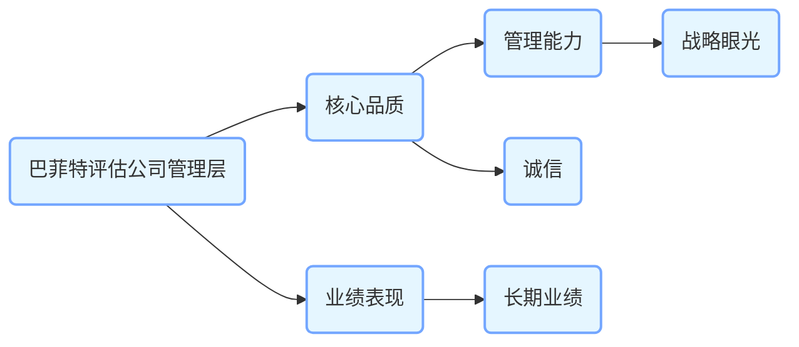

# 巴菲特如何看待公司管理层

> 关键词：巴菲特、公司管理层、投资理念、企业价值、管理能力、诚信、长期业绩

> 摘要：本文深入探讨了巴菲特对公司管理层的看法。巴菲特作为投资界的传奇人物，其投资理念中对公司管理层的评估占据着关键地位。文章首先介绍了研究此话题的背景，包括目的、预期读者等内容。接着阐述了与公司管理层相关的核心概念以及它们之间的联系。详细剖析了巴菲特评估公司管理层的核心算法原理和具体操作步骤，通过数学模型和公式进行进一步的阐释。结合实际项目案例，展示了如何依据巴菲特的观点来分析公司管理层。探讨了其观点在不同实际应用场景中的体现。推荐了相关的学习资源、开发工具框架以及论文著作。最后总结了未来关于公司管理层评估的发展趋势与挑战，并对常见问题进行了解答，还提供了扩展阅读和参考资料。通过全面的分析，帮助读者理解巴菲特看待公司管理层的方法和理念，为投资决策和企业管理提供有价值的参考。

## 1. 背景介绍 
### 1.1 目的和范围
本研究的主要目的是全面深入地探究巴菲特对公司管理层的看法，以及这种看法如何影响他的投资决策和对企业价值的评估。范围涵盖了巴菲特公开的言论、著作、投资案例等多个方面，旨在从多个维度梳理出他对公司管理层的核心观点和评估标准。通过研究，我们可以了解到在投资领域中，公司管理层的素质和能力对企业长期发展和投资回报的重要性，为投资者、企业管理者以及对投资和企业管理感兴趣的人士提供有价值的参考。

### 1.2 预期读者
本文的预期读者包括但不限于以下几类人群：
- **投资者**：无论是个人投资者还是专业投资机构的从业者，了解巴菲特对公司管理层的看法有助于他们在投资决策过程中更好地评估企业的价值和潜力，从而做出更明智的投资选择。
- **企业管理者**：公司的高层管理人员可以从巴菲特的观点中获取关于自身管理能力和团队建设的启示，学习如何提升企业的管理水平，增强企业的竞争力和可持续发展能力。
- **学者和研究人员**：对投资学、管理学等领域进行研究的学者和研究人员可以将本文作为参考资料，进一步深入研究巴菲特的投资理念和企业管理思想，丰富相关领域的学术研究。
- **对投资和企业管理感兴趣的普通读者**：希望了解投资和企业管理知识的普通读者可以通过本文初步了解巴菲特的投资智慧和对公司管理层的独特见解，拓宽自己的知识视野。

### 1.3 文档结构概述
本文将按照以下结构进行阐述：
- **核心概念与联系**：介绍与公司管理层相关的核心概念，包括管理能力、诚信、战略眼光等，并分析它们之间的相互关系。
- **核心算法原理 & 具体操作步骤**：剖析巴菲特评估公司管理层的核心算法原理，即他如何综合考虑多个因素来评估管理层的优劣，并详细说明具体的操作步骤。
- **数学模型和公式 & 详细讲解 & 举例说明**：通过数学模型和公式进一步阐释巴菲特评估公司管理层的方法，结合实际案例进行详细说明。
- **项目实战：代码实际案例和详细解释说明**：以实际的投资项目为例，展示如何运用巴菲特的观点来分析公司管理层，并对代码进行详细解读。
- **实际应用场景**：探讨巴菲特对公司管理层的看法在不同实际应用场景中的体现，如投资决策、企业并购等。
- **工具和资源推荐**：推荐相关的学习资源、开发工具框架以及论文著作，帮助读者进一步深入学习和研究。
- **总结：未来发展趋势与挑战**：总结关于公司管理层评估的未来发展趋势，并分析可能面临的挑战。
- **附录：常见问题与解答**：对读者可能关心的常见问题进行解答。
- **扩展阅读 & 参考资料**：提供相关的扩展阅读材料和参考资料，方便读者进一步深入学习。

### 1.4 术语表
#### 1.4.1 核心术语定义
- **公司管理层**：指负责公司日常运营和决策的高级管理人员团队，包括董事长、CEO、CFO 等，他们在公司的战略规划、资源配置、业务执行等方面发挥着关键作用。
- **管理能力**：指管理层在组织、领导、协调、控制等方面的能力，包括制定战略、管理团队、应对市场变化等方面的能力。
- **诚信**：指管理层在经营活动中遵守法律法规、道德规范，诚实守信，不欺诈、不舞弊，对股东和其他利益相关者负责的品质。
- **战略眼光**：指管理层能够准确把握市场趋势和行业发展方向，制定具有前瞻性和适应性的战略规划，为公司的长期发展奠定基础的能力。
- **长期业绩**：指公司在较长时间内（通常为 5 年以上）的经营业绩表现，包括销售收入、净利润、资产回报率等指标的增长情况。

#### 1.4.2 相关概念解释
- **企业价值**：指企业的市场价值，是企业未来现金流量的现值。企业价值受到多种因素的影响，其中公司管理层的素质和能力是重要的影响因素之一。
- **投资决策**：指投资者在选择投资对象时所进行的分析、评估和判断过程。在投资决策中，对公司管理层的评估是重要的环节之一。
- **股东利益**：指股东在公司中所享有的权益，包括股息分配、股权增值等。公司管理层的决策和行为应该以维护股东利益为出发点和落脚点。

#### 1.4.3 缩略词列表
- **CEO**：Chief Executive Officer，首席执行官
- **CFO**：Chief Financial Officer，首席财务官

## 2. 核心概念与联系 

### 核心概念原理
巴菲特在评估公司管理层时，主要关注以下几个核心概念：
- **管理能力**：这是评估公司管理层的基础。优秀的管理能力体现在多个方面，如高效的组织协调能力、敏锐的市场洞察力、果断的决策能力等。具有良好管理能力的管理层能够合理配置公司资源，提高运营效率，推动公司业务的发展。
- **诚信**：诚信是巴菲特非常看重的品质。管理层的诚信直接关系到公司的声誉和形象，也影响着投资者对公司的信任。诚信的管理层会遵守法律法规和道德规范，如实披露公司信息，不进行欺诈和舞弊行为，从而保护股东的利益。
- **战略眼光**：具有战略眼光的管理层能够准确把握市场趋势和行业发展方向，制定出具有前瞻性和适应性的战略规划。他们能够带领公司在激烈的市场竞争中找准定位，抓住机遇，实现可持续发展。
- **长期业绩**：长期业绩是衡量公司管理层工作成效的重要指标。优秀的管理层能够通过合理的战略规划和有效的管理措施，实现公司业绩的持续增长，为股东创造长期的价值。

### 架构的文本示意图
```plaintext
                巴菲特评估公司管理层
                    |
        +-----------+-----------+
        |                       |
    核心品质              业绩表现
        |                       |
  +-----+-----+             长期业绩
  |           |
管理能力     诚信
  |           |
  |           |
战略眼光      |
```

### Mermaid 流程图


这些核心概念之间相互关联、相互影响。管理能力是实现长期业绩的基础，只有具备良好的管理能力，才能有效地组织和协调公司的各项资源，推动公司业务的发展。诚信是公司发展的基石，缺乏诚信的管理层可能会做出损害公司利益和股东利益的行为，从而影响公司的长期业绩。战略眼光则为公司的发展提供方向，具有战略眼光的管理层能够制定出正确的战略规划，引导公司朝着正确的方向前进，进而实现长期业绩的增长。

## 3. 核心算法原理 & 具体操作步骤 

### 核心算法原理
巴菲特评估公司管理层的核心算法原理可以概括为综合考虑多个因素，通过定性和定量分析相结合的方法来评估管理层的优劣。具体来说，他会从管理能力、诚信、战略眼光、长期业绩等多个维度对管理层进行评估，然后根据各个维度的权重进行综合打分，最终得出对管理层的评价。

### 具体操作步骤
以下是使用 Python 代码实现的一个简化的评估流程示例：

```python
# 定义评估指标及其权重
weights = {
    "管理能力": 0.3,
    "诚信": 0.2,
    "战略眼光": 0.2,
    "长期业绩": 0.3
}

# 定义每个指标的评分函数
def evaluate_management_ability(company):
    # 这里可以根据公司的组织架构、团队协作等情况进行评分
    # 假设我们根据一些公开信息进行简单评分，范围为 0 - 10
    if company.get("team_structure") == "efficient" and company.get("decision_making_speed") == "fast":
        return 8
    else:
        return 6

def evaluate_integrity(company):
    # 根据公司的违规记录、信息披露情况等进行评分
    if company.get("violation_records") == 0 and company.get("information_disclosure") == "transparent":
        return 9
    else:
        return 5

def evaluate_strategic_vision(company):
    # 根据公司的战略规划、市场定位等进行评分
    if company.get("strategic_plan") == "forward-looking" and company.get("market_positioning") == "accurate":
        return 8
    else:
        return 6

def evaluate_long_term_performance(company):
    # 根据公司的财务报表，计算过去 5 年的平均净利润增长率等指标进行评分
    net_profit_growth_rates = company.get("net_profit_growth_rates", [])
    if len(net_profit_growth_rates) >= 5:
        average_growth_rate = sum(net_profit_growth_rates[-5:]) / 5
        if average_growth_rate > 0.1:
            return 8
        else:
            return 6
    else:
        return 5

# 定义综合评估函数
def comprehensive_evaluation(company):
    management_ability_score = evaluate_management_ability(company)
    integrity_score = evaluate_integrity(company)
    strategic_vision_score = evaluate_strategic_vision(company)
    long_term_performance_score = evaluate_long_term_performance(company)

    total_score = (
        weights["管理能力"] * management_ability_score +
        weights["诚信"] * integrity_score +
        weights["战略眼光"] * strategic_vision_score +
        weights["长期业绩"] * long_term_performance_score
    )
    return total_score

# 示例公司信息
company_info = {
    "team_structure": "efficient",
    "decision_making_speed": "fast",
    "violation_records": 0,
    "information_disclosure": "transparent",
    "strategic_plan": "forward-looking",
    "market_positioning": "accurate",
    "net_profit_growth_rates": [0.12, 0.15, 0.13, 0.11, 0.14]
}

# 进行综合评估
score = comprehensive_evaluation(company_info)
print(f"该公司管理层的综合评分为: {score}")
```

### 代码解释
1. **权重定义**：`weights` 字典定义了各个评估指标的权重，这些权重反映了巴菲特对不同指标的重视程度。
2. **评分函数**：`evaluate_management_ability`、`evaluate_integrity`、`evaluate_strategic_vision` 和 `evaluate_long_term_performance` 分别是对管理能力、诚信、战略眼光和长期业绩进行评分的函数。这些函数根据公司的相关信息进行简单的评分。
3. **综合评估函数**：`comprehensive_evaluation` 函数将各个指标的评分乘以相应的权重，然后相加得到综合评分。
4. **示例公司信息**：`company_info` 字典包含了示例公司的相关信息，用于演示综合评估的过程。
5. **输出结果**：最后打印出该公司管理层的综合评分。

通过这种方式，我们可以对公司管理层进行初步的评估，但在实际应用中，还需要结合更多的信息和深入的分析来进行准确的评估。

## 4. 数学模型和公式 & 详细讲解 & 举例说明 

### 数学模型和公式
设 $S$ 为公司管理层的综合评分，$S_i$ 为第 $i$ 个评估指标的评分，$w_i$ 为第 $i$ 个评估指标的权重，$n$ 为评估指标的个数。则综合评分的计算公式为：

$$S = \sum_{i=1}^{n} w_i S_i$$

其中，$\sum_{i=1}^{n} w_i = 1$，即所有指标的权重之和为 1。

### 详细讲解
这个公式的原理是将每个评估指标的评分乘以其对应的权重，然后将所有乘积相加，得到综合评分。权重的大小反映了该指标在评估中的重要程度。例如，在巴菲特的评估体系中，长期业绩的权重可能相对较高，因为长期业绩是衡量公司管理层工作成效的重要指标。

### 举例说明
假设我们有三个评估指标：管理能力、诚信和长期业绩，它们的权重分别为 $w_1 = 0.3$，$w_2 = 0.2$，$w_3 = 0.5$。某公司管理层在这三个指标上的评分分别为 $S_1 = 8$，$S_2 = 9$，$S_3 = 7$。则该公司管理层的综合评分 $S$ 为：

$$S = w_1 S_1 + w_2 S_2 + w_3 S_3 = 0.3\times8 + 0.2\times9 + 0.5\times7 = 2.4 + 1.8 + 3.5 = 7.7$$

通过这个例子可以看出，综合评分综合考虑了各个评估指标的情况，并且根据权重的不同对每个指标的贡献进行了调整。

## 5. 项目实战：代码实际案例和详细解释说明 

### 5.1  开发环境搭建
在进行项目实战之前，需要搭建相应的开发环境。以下是具体的步骤：
1. **安装 Python**：确保你的计算机上已经安装了 Python 环境，建议使用 Python 3.6 及以上版本。可以从 Python 官方网站（https://www.python.org/downloads/）下载并安装。
2. **安装开发工具**：推荐使用 PyCharm 作为开发工具，它是一款功能强大的 Python 集成开发环境（IDE）。可以从 JetBrains 官方网站（https://www.jetbrains.com/pycharm/download/）下载并安装。
3. **安装必要的库**：在本项目中，我们主要使用 Python 的内置库，不需要额外安装其他库。

### 5.2  源代码详细实现和代码解读
以下是一个完整的项目实战代码示例，用于评估不同公司管理层的综合评分：

```python
# 定义评估指标及其权重
weights = {
    "管理能力": 0.3,
    "诚信": 0.2,
    "战略眼光": 0.2,
    "长期业绩": 0.3
}

# 定义每个指标的评分函数
def evaluate_management_ability(company):
    # 这里可以根据公司的组织架构、团队协作等情况进行评分
    # 假设我们根据一些公开信息进行简单评分，范围为 0 - 10
    if company.get("team_structure") == "efficient" and company.get("decision_making_speed") == "fast":
        return 8
    elif company.get("team_structure") == "moderate" and company.get("decision_making_speed") == "medium":
        return 6
    else:
        return 4

def evaluate_integrity(company):
    # 根据公司的违规记录、信息披露情况等进行评分
    if company.get("violation_records") == 0 and company.get("information_disclosure") == "transparent":
        return 9
    elif company.get("violation_records") <= 2 and company.get("information_disclosure") == "mostly_transparent":
        return 7
    else:
        return 5

def evaluate_strategic_vision(company):
    # 根据公司的战略规划、市场定位等进行评分
    if company.get("strategic_plan") == "forward-looking" and company.get("market_positioning") == "accurate":
        return 8
    elif company.get("strategic_plan") == "moderate" and company.get("market_positioning") == "reasonable":
        return 6
    else:
        return 4

def evaluate_long_term_performance(company):
    # 根据公司的财务报表，计算过去 5 年的平均净利润增长率等指标进行评分
    net_profit_growth_rates = company.get("net_profit_growth_rates", [])
    if len(net_profit_growth_rates) >= 5:
        average_growth_rate = sum(net_profit_growth_rates[-5:]) / 5
        if average_growth_rate > 0.15:
            return 9
        elif average_growth_rate > 0.1:
            return 7
        else:
            return 5
    else:
        return 3

# 定义综合评估函数
def comprehensive_