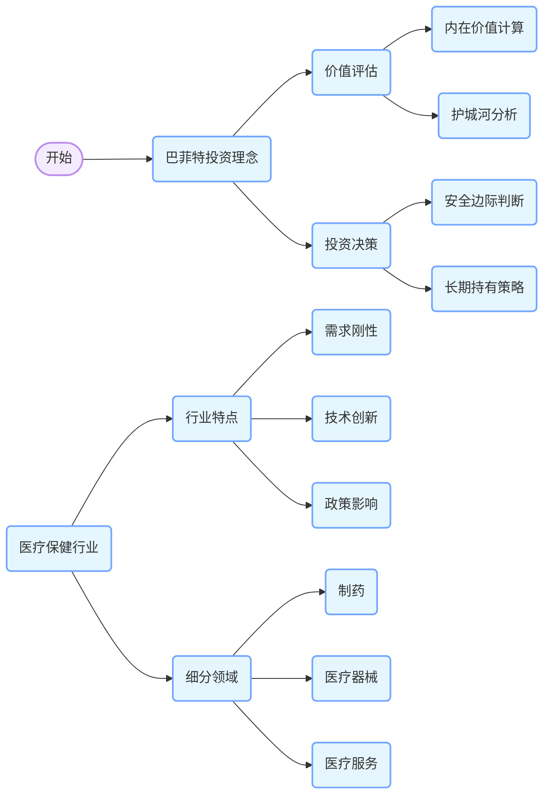

# 巴菲特如何看待医疗保健行业投资

> 关键词：巴菲特、医疗保健行业投资、价值投资、长期投资、行业趋势、风险评估

> 摘要：本文深入探讨巴菲特对于医疗保健行业投资的观点和理念。通过对巴菲特投资思想的分析，结合医疗保健行业的特点，阐述了他如何在该行业进行价值发现和投资决策。从背景介绍入手，详细讲解核心概念、算法原理、数学模型等，通过实际案例展示投资操作，探讨实际应用场景，推荐相关工具和资源，最后总结行业未来发展趋势与挑战，为投资者提供全面的参考。

## 1. 背景介绍 
### 1.1 目的和范围
本文旨在深入剖析巴菲特对医疗保健行业投资的看法和策略。医疗保健行业作为一个具有巨大发展潜力和社会影响力的领域，一直是投资者关注的焦点。巴菲特作为投资界的传奇人物，他的投资理念和决策对众多投资者具有重要的指导意义。我们将研究他在医疗保健行业的投资历史、决策依据、风险评估等方面，为投资者提供关于该行业投资的深入见解。范围涵盖医疗保健行业的各个细分领域，包括制药、医疗器械、医疗服务等。

### 1.2 预期读者
本文的预期读者包括对投资领域感兴趣的个人投资者、金融行业从业者、投资研究人员以及关注医疗保健行业发展的人士。无论是初学者希望了解巴菲特的投资方法，还是有一定经验的投资者寻求在医疗保健行业的投资思路，都能从本文中获得有价值的信息。

### 1.3 文档结构概述
本文将按照以下结构展开：首先介绍相关核心概念，明确医疗保健行业和巴菲特投资理念的关键要素；接着阐述核心算法原理和具体操作步骤，以模拟巴菲特的投资决策过程；然后通过数学模型和公式详细讲解投资评估方法，并举例说明；之后给出项目实战案例，包括开发环境搭建、源代码实现和代码解读；探讨医疗保健行业投资的实际应用场景；推荐相关的工具和资源，帮助读者进一步学习和实践；最后总结行业未来发展趋势与挑战，并提供常见问题解答和扩展阅读参考资料。

### 1.4 术语表
#### 1.4.1 核心术语定义
- **价值投资**：一种投资策略，强调寻找被低估的资产，通过长期持有来实现资产的增值。巴菲特是价值投资的代表人物，他注重公司的内在价值和长期发展潜力。
- **医疗保健行业**：包括制药、医疗器械、医疗服务、生物技术等多个领域，旨在提供预防、诊断、治疗和康复等医疗保健服务的产业。
- **护城河**：巴菲特提出的概念，指公司具有的可持续竞争优势，能够保护公司的市场份额和盈利能力，如品牌优势、专利技术、成本优势等。
- **内在价值**：公司未来现金流的折现值，是价值投资中评估公司价值的重要指标。

#### 1.4.2 相关概念解释
- **长期投资**：巴菲特倡导长期持有股票，认为短期市场波动是不可预测的，而优秀公司的长期价值会随着时间的推移不断增长。
- **安全边际**：在购买股票时，以低于公司内在价值的价格买入，为投资提供一定的缓冲空间，降低投资风险。

#### 1.4.3 缩略词列表
- **PE**：市盈率（Price-to-Earnings Ratio），反映股票价格与每股收益的比率，用于评估股票的估值水平。
- **EPS**：每股收益（Earnings Per Share），公司净利润除以总股本，反映公司的盈利能力。

## 2. 核心概念与联系 

### 核心概念原理
#### 巴菲特的价值投资理念
巴菲特的价值投资理念是基于对公司内在价值的评估。他认为市场是有波动的，但优秀公司的内在价值会随着时间的推移而增长。投资者应该寻找那些具有持续竞争优势（护城河）、管理团队优秀、财务状况良好的公司，并在其股价低于内在价值时买入，长期持有。

#### 医疗保健行业的特点
医疗保健行业具有需求刚性、技术创新驱动、政策影响大等特点。人们对医疗保健的需求是持续存在的，不受经济周期的影响。同时，行业的发展依赖于不断的技术创新，如新药研发、医疗器械的升级等。政策的变化，如医保政策、药品审批政策等，也会对行业产生重大影响。

### 架构的文本示意图
```plaintext
巴菲特投资理念
|
|--价值评估
|   |--内在价值计算
|   |--护城河分析
|
|--投资决策
|   |--安全边际判断
|   |--长期持有策略

医疗保健行业
|
|--行业特点
|   |--需求刚性
|   |--技术创新
|   |--政策影响
|
|--细分领域
|   |--制药
|   |--医疗器械
|   |--医疗服务
```

### Mermaid 流程图


## 3. 核心算法原理 & 具体操作步骤 

### 核心算法原理
#### 内在价值计算
内在价值的计算通常采用现金流折现法（DCF）。该方法的基本原理是将公司未来的现金流按照一定的折现率折现到当前时刻，得到公司的内在价值。公式如下：

$$V = \sum_{t=1}^{n} \frac{CF_t}{(1 + r)^t}$$

其中，$V$ 表示公司的内在价值，$CF_t$ 表示第 $t$ 年的现金流，$r$ 表示折现率，$n$ 表示预测的年数。

#### 安全边际计算
安全边际是指股票价格与内在价值之间的差值。计算公式为：

$$安全边际 = \frac{内在价值 - 股票价格}{内在价值} \times 100\%$$

### 具体操作步骤
#### 步骤 1：筛选医疗保健行业公司
通过财务报表分析、行业研究等方法，筛选出具有一定规模、盈利能力和发展潜力的医疗保健行业公司。

#### 步骤 2：分析公司基本面
对筛选出的公司进行基本面分析，包括公司的业务模式、市场份额、竞争优势、管理团队等方面。重点关注公司的护城河，如专利技术、品牌优势等。

#### 步骤 3：预测未来现金流
根据公司的历史财务数据和行业发展趋势，预测公司未来的现金流。这需要考虑公司的营业收入增长、成本控制、研发投入等因素。

#### 步骤 4：确定折现率
折现率反映了投资者对投资回报的要求，通常可以采用资本资产定价模型（CAPM）来确定。公式如下：

$$r = R_f + \beta \times (R_m - R_f)$$

其中，$r$ 表示折现率，$R_f$ 表示无风险利率，$\beta$ 表示公司股票的贝塔系数，$R_m$ 表示市场平均收益率。

#### 步骤 5：计算内在价值
将预测的未来现金流代入现金流折现公式，计算公司的内在价值。

#### 步骤 6：计算安全边际
根据当前股票价格和计算出的内在价值，计算安全边际。如果安全边际大于一定阈值（如 30%），则认为该股票具有投资价值。

#### 步骤 7：做出投资决策
根据安全边际和公司的基本面情况，做出投资决策。如果安全边际足够大且公司基本面良好，则可以考虑买入该股票并长期持有。

### Python 源代码实现
```python
import numpy as np

# 预测未来现金流
def predict_cash_flows(growth_rate, initial_cf, years):
    cash_flows = [initial_cf]
    for i in range(1, years):
        cash_flows.append(cash_flows[i - 1] * (1 + growth_rate))
    return cash_flows

# 计算内在价值
def calculate_intrinsic_value(cash_flows, discount_rate):
    years = len(cash_flows)
    discounted_cash_flows = []
    for i in range(years):
        discounted_cash_flows.append(cash_flows[i] / ((1 + discount_rate) ** (i + 1)))
    return sum(discounted_cash_flows)

# 计算安全边际
def calculate_margin_of_safety(intrinsic_value, stock_price):
    return ((intrinsic_value - stock_price) / intrinsic_value) * 100

# 示例数据
growth_rate = 0.1  # 现金流年增长率
initial_cf = 100  # 初始现金流
years = 10  # 预测年数
discount_rate = 0.08  # 折现率
stock_price = 800  # 股票价格

# 预测现金流
cash_flows = predict_cash_flows(growth_rate, initial_cf, years)

# 计算内在价值
intrinsic_value = calculate_intrinsic_value(cash_flows, discount_rate)

# 计算安全边际
margin_of_safety = calculate_margin_of_safety(intrinsic_value, stock_price)

print(f"预测的未来现金流: {cash_flows}")
print(f"公司的内在价值: {intrinsic_value}")
print(f"安全边际: {margin_of_safety}%")
```

## 4. 数学模型和公式 & 详细讲解 & 举例说明 

### 现金流折现模型（DCF）
#### 公式
$$V = \sum_{t=1}^{n} \frac{CF_t}{(1 + r)^t}$$

#### 详细讲解
- $V$：公司的内在价值，即公司未来现金流的折现值。
- $CF_t$：第 $t$ 年的现金流，是公司在该年产生的现金流入减去现金流出后的净额。
- $r$：折现率，反映了投资者对投资回报的要求，考虑了资金的时间价值和投资风险。
- $n$：预测的年数，通常根据公司的发展阶段和行业特点来确定。

#### 举例说明
假设一家医疗保健公司预计未来 5 年的现金流分别为 100 万元、120 万元、140 万元、160 万元和 180 万元，折现率为 10%。则该公司的内在价值计算如下：

$$
\begin{align*}
V &= \frac{100}{(1 + 0.1)^1} + \frac{120}{(1 + 0.1)^2} + \frac{140}{(1 + 0.1)^3} + \frac{160}{(1 + 0.1)^4} + \frac{180}{(1 + 0.1)^5}\\
&= \frac{100}{1.1} + \frac{120}{1.21} + \frac{140}{1.331} + \frac{160}{1.4641} + \frac{180}{1.61051}\\
&\approx 90.91 + 99.17 + 105.18 + 109.29 + 111.76\\
&\approx 516.31 \text{（万元）}
\end{align*}
$$

### 资本资产定价模型（CAPM）
#### 公式
$$r = R_f + \beta \times (R_m - R_f)$$

#### 详细讲解
- $r$：折现率，即投资者要求的必要收益率。
- $R_f$：无风险利率，通常可以用国债收益率来近似表示。
- $\beta$：公司股票的贝塔系数，反映了股票价格相对于市场整体波动的敏感程度。$\beta > 1$ 表示股票的波动比市场大，$\beta < 1$ 表示股票的波动比市场小。
- $R_m$：市场平均收益率，通常可以用股票市场指数的收益率来近似表示。

#### 举例说明
假设无风险利率 $R_f$ 为 3%，市场平均收益率 $R_m$ 为 10%，某医疗保健公司股票的贝塔系数 $\beta$ 为 1.2。则该公司股票的折现率计算如下：

$$r = 0.03 + 1.2 \times (0.1 - 0.03) = 0.03 + 1.2 \times 0.07 = 0.03 + 0.084 = 0.114 = 11.4\%$$

### 安全边际公式
#### 公式
$$安全边际 = \frac{内在价值 - 股票价格}{内在价值} \times 100\%$$

#### 详细讲解
安全边际反映了股票价格相对于内在价值的折扣程度。安全边际越大，说明股票的投资风险越小，潜在回报越高。

#### 举例说明
假设某医疗保健公司的内在价值计算为 100 元，当前股票价格为 70 元。则该股票的安全边际计算如下：

$$安全边际 = \frac{100 - 70}{100} \times 100\% = 30\%$$

这意味着该股票的价格相对于内在价值有 30% 的折扣，具有一定的投资价值。

## 5. 项目实战：代码实际案例和详细解释说明 

### 5.1  开发环境搭建
#### 安装 Python
首先需要安装 Python 编程语言。可以从 Python 官方网站（https://www.python.org/downloads/）下载适合自己操作系统的 Python 版本，并按照安装向导进行安装。

#### 安装必要的库
在 Python 环境中，我们需要安装一些必要的库来进行数据处理和分析。可以使用以下命令来安装：

```sh
pip install numpy pandas matplotlib
```

- `numpy`：用于进行数值计算和数组操作。
- `pandas`：用于数据处理和分析。
- `matplotlib`：用于数据可视化。

### 5.2  源代码详细实现和代码解读
```python
import numpy as np
import pandas as pd
import matplotlib.pyplot as plt

# 读取医疗保健公司财务数据
def read_financial_data(file_path):
    data = pd.read_csv(file_path)
    return data

# 预测未来现金流
def predict_cash_flows(data, growth_rate, years):
    initial_cf = data['CashFlow'].iloc[-1]
    cash_flows = [initial_cf]
    for i in range(1, years):
        cash_flows.append(cash_flows[i - 1] * (1 + growth_rate))
    return cash_flows

# 计算内在价值
def calculate_intrinsic_value(cash_flows, discount_rate):
    years = len(cash_flows)
    discounted_cash_flows = []
    for i in range(years):
        discounted_cash_flows.append(cash_flows[i] / ((1 + discount_rate) ** (i + 1)))
    return sum(discounted_cash_flows)

# 计算安全边际
def calculate_margin_of_safety(intrinsic_value, stock_price):
    return ((intrinsic_value - stock_price) / intrinsic_value) * 100

# 主函数
def main():
    # 读取财务数据
    file_path = 'healthcare_company_data.csv'
    data = read_financial_data(file_path)

    # 示例参数
    growth_rate = 0.1  # 现金流年增长率
    years = 10  # 预测年数
    discount_rate = 0.08  # 折现率
    stock_price = 800  # 股票价格

    # 预测现金流
    cash_flows = predict_cash_flows(data, growth_rate, years)

    # 计算内在价值
    intrinsic_value = calculate_intrinsic_value(cash_flows, discount_rate)

    # 计算安全边际
    margin_of_safety = calculate_margin_of_safety(intrinsic_value, stock_price)

    print(f"预测的未来现金流: {cash_flows}")
    print(f"公司的内在价值: {intrinsic_value}")
    print(f"安全边际: {margin_of_safety}%")

    # 绘制现金流预测图
    plt.plot(range(1, years + 1), cash_flows)
    plt.xlabel('Year')
    plt.ylabel('Cash Flow')
    plt.title('Predicted Cash Flows')
    plt.show()

if __name__ == "__main__":
    main()
```

### 5.3  代码解读与分析
#### 读取财务数据
`read_financial_data` 函数用于读取医疗保健公司的财务数据，假设数据存储在 CSV 文件中。

#### 预测未来现金流
`predict_cash_flows` 函数根据历史现金流数据和设定的增长率，预测未来若干年的现金流。

#### 计算内在价值
`calculate_intrinsic_value` 函数使用现金流折现法计算公司的内在价值。

#### 计算安全边际
`calculate_margin_of_safety` 函数根据内在价值和股票价格计算安全边际。

#### 主函数
`main` 函数是程序的入口，调用上述函数完成数据读取、现金流预测、内在价值计算和安全边际计算，并绘制现金流预测图。

## 6. 实际应用场景 
### 个人投资者
个人投资者可以借鉴巴菲特的投资理念，在医疗保健行业寻找具有投资价值的股票。通过分析公司的基本面和计算内在价值，确定安全边际，选择合适的投资时机。例如，个人投资者可以关注一些具有创新药物研发能力、市场份额稳定的制药公司，在其股价低估时买入并长期持有。

### 机构投资者
机构投资者如基金公司、保险公司等，在资产配置中会考虑医疗保健行业。他们可以运用专业的研究团队和分析工具，对医疗保健行业的公司进行深入研究和评估。通过构建投资组合，分散投资风险，实现资产的增值。例如，基金公司可以投资于不同细分领域的医疗保健公司，包括制药、医疗器械和医疗服务等，以平衡风险和收益。

### 企业战略投资
医疗保健行业的企业也可以进行战略投资，通过并购、合作等方式拓展业务领域和提升竞争力。例如，一家制药公司可以投资于生物技术公司，获取其创新药物研发技术；或者医疗器械公司可以收购其他公司，扩大市场份额和产品线。

## 7. 工具和资源推荐
### 7.1 学习资源推荐
#### 7.1.1 书籍推荐
- 《聪明的投资者》（The Intelligent Investor）：本杰明·格雷厄姆（Benjamin Graham）著，价值投资的经典之作，巴菲特称这本书是他投资生涯的启蒙读物。
- 《巴菲特致股东的信：投资者和公司高管教程》（Letters to Shareholders of Berkshire Hathaway）：沃伦·巴菲特（Warren Buffett）著，通过巴菲特历年致股东的信，深入了解他的投资理念和决策方法。
- 《医疗行业投资策略与方法》：介绍医疗保健行业的投资特点、分析方法和投资策略，适合对医疗行业投资感兴趣的读者。

#### 7.1.2 在线课程
- Coursera 上的“投资学原理”课程：由知名教授授课，系统介绍投资学的基本原理和方法。
- 网易云课堂上的“医疗行业投资分析”课程：专门针对医疗保健行业投资进行讲解，包括行业分析、公司估值等内容。

#### 7.1.3 技术博客和网站
- 雪球网：提供股票投资的资讯、分析和讨论平台，有很多关于医疗保健行业投资的文章和讨论。
- 东方财富网：涵盖财经新闻、股票行情、研究报告等内容，是投资者获取信息的重要渠道。
- Seeking Alpha：一个全球性的投资研究平台，有大量专业的投资分析文章和研究报告。

### 7.2 开发工具框架推荐
#### 7.2.1 IDE和编辑器
- PyCharm：一款专业的 Python 集成开发环境，提供代码编辑、调试、版本控制等功能，适合 Python 开发。
- Jupyter Notebook：一种交互式的开发环境，支持代码、文本、图表等多种元素的展示，方便进行数据分析和可视化。

#### 7.2.2 调试和性能分析工具
- pdb：Python 自带的调试工具，可以帮助开发者定位代码中的问题。
- cProfile：Python 标准库中的性能分析工具，可以分析代码的运行时间和函数调用情况。

#### 7.2.3 相关框架和库
- Pandas：用于数据处理和分析的 Python 库，提供了高效的数据结构和数据操作方法。
- NumPy：用于数值计算的 Python 库，提供了多维数组和各种数学函数。
- Matplotlib：用于数据可视化的 Python 库，可以绘制各种类型的图表。

### 7.3 相关论文著作推荐
#### 7.3.1 经典论文
- “The Theory of Investment Value”（投资价值理论）：由约翰·伯尔·威廉姆斯（John Burr Williams）撰写，提出了现金流折现法的基本思想。
- “Security Analysis”（证券分析）：本杰明·格雷厄姆和戴维·多德（David Dodd）合著，奠定了价值投资的理论基础。

#### 7.3.2 最新研究成果
- 关注学术期刊如《Journal of Financial Economics》（金融经济学杂志）、《Review of Financial Studies》（金融研究评论）等，这些期刊会发表关于投资领域的最新研究成果。
- 参加学术会议，如美国金融协会年会（AFA Annual Meeting），了解行业最新动态和研究进展。

#### 7.3.3 应用案例分析
- 可以参考一些专业的投资研究报告和案例分析书籍，了解医疗保健行业投资的实际案例和经验教训。例如，一些投资银行会发布关于医疗保健行业的研究报告，分析行业趋势和投资机会。

## 8. 总结：未来发展趋势与挑战
### 未来发展趋势
#### 技术创新驱动
医疗保健行业将继续受到技术创新的推动，如基因编辑技术、人工智能在医疗领域的应用、新型医疗器械的研发等。这些技术的发展将带来新的治疗方法和医疗服务模式，为行业带来巨大的发展机遇。

#### 老龄化趋势加剧
随着全球老龄化趋势的加剧，对医疗保健的需求将持续增长。老年人群体对慢性病治疗、康复护理等方面的需求增加，将推动医疗保健行业的发展。

#### 政策支持加强
政府对医疗保健行业的重视程度不断提高，出台了一系列政策支持行业的发展，如医保政策的完善、对创新药物研发的扶持等。这些政策将为行业的发展提供良好的环境。

### 挑战
#### 研发风险高
医疗保健行业的研发投入大、周期长、风险高。新药研发需要经过多年的临床试验，成功率较低。一旦研发失败，将给企业带来巨大的损失。

#### 政策不确定性
政策的变化对医疗保健行业的影响较大，如医保政策的调整、药品审批政策的变化等。政策的不确定性增加了行业的投资风险。

#### 竞争激烈
医疗保健行业竞争激烈，尤其是在制药和医疗器械领域。企业需要不断创新和提高产品质量，才能在市场中立足。

## 9. 附录：常见问题与解答
### 问题 1：巴菲特为什么会投资医疗保健行业？
解答：医疗保健行业具有需求刚性、技术创新驱动等特点，符合巴菲特寻找具有持续竞争优势和长期发展潜力的公司的投资理念。随着人口老龄化和人们对健康的重视，医疗保健行业的市场需求不断增长，为投资者提供了良好的投资机会。

### 问题 2：如何确定医疗保健公司的护城河？
解答：医疗保健公司的护城河可以从以下几个方面来确定：专利技术，拥有独特的专利药物或医疗器械可以保护公司的市场份额；品牌优势，知名的医疗品牌可以吸引更多的患者和客户；成本优势，通过优化生产流程和供应链管理，降低成本，提高竞争力；客户转换成本，如患者对某种治疗方法或医疗器械的依赖，使得他们难以轻易转换到其他产品。

### 问题 3：现金流折现法中的折现率如何确定？
解答：折现率可以采用资本资产定价模型（CAPM）来确定，公式为 $r = R_f + \beta \times (R_m - R_f)$。其中，$R_f$ 表示无风险利率，通常可以用国债收益率来近似表示；$\beta$ 表示公司股票的贝塔系数，反映了股票价格相对于市场整体波动的敏感程度；$R_m$ 表示市场平均收益率，通常可以用股票市场指数的收益率来近似表示。

### 问题 4：安全边际的阈值应该如何确定？
解答：安全边际的阈值没有固定的标准，通常可以根据投资者的风险偏好和市场情况来确定。一般来说，安全边际大于 30% 被认为是比较理想的，但在不同的市场环境和行业中，阈值可能会有所不同。投资者可以根据自己的经验和研究来调整安全边际的阈值。

## 10. 扩展阅读 & 参考资料
### 扩展阅读
- 《创新者的窘境》（The Innovator's Dilemma）：克莱顿·克里斯坦森（Clayton Christensen）著，探讨了创新对企业和行业的影响，对理解医疗保健行业的技术创新和竞争格局有一定的帮助。
- 《资本回报：穿越资本周期的投资》（Capital Returns: Investing Through the Capital Cycle）：爱德华·钱塞勒（Edward Chancellor）等著，介绍了资本周期理论在投资中的应用，对分析医疗保健行业的投资机会和风险有一定的启示。

### 参考资料
- 巴菲特历年致股东的信，可从伯克希尔·哈撒韦公司官方网站获取。
- 医疗保健行业的财务报表和研究报告，可从各大金融数据提供商和行业研究机构获取。
- 相关学术论文和研究成果，可通过学术数据库如知网、万方、Web of Science 等进行查询。

作者：AI天才研究院/AI Genius Institute & 禅与计算机程序设计艺术 /Zen And The Art of Computer Programming