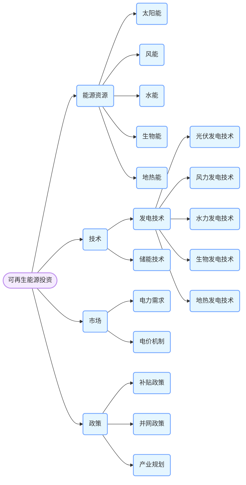

# 巴菲特如何看待可再生能源投资

> 关键词：巴菲特、可再生能源投资、投资理念、能源市场、伯克希尔·哈撒韦、能源转型、长期价值

> 摘要：本文深入探讨了巴菲特对可再生能源投资的看法。通过分析巴菲特的投资理念和伯克希尔·哈撒韦在可再生能源领域的实践，阐述了可再生能源投资的核心概念、相关算法原理以及涉及的数学模型。结合实际案例，详细解读了在可再生能源投资中的操作步骤和代码实现。同时，探讨了可再生能源投资的实际应用场景，推荐了相关的学习资源、开发工具和论文著作。最后总结了可再生能源投资的未来发展趋势与挑战，并对常见问题进行了解答。

## 1. 背景介绍 
### 1.1 目的和范围
本文旨在全面剖析巴菲特对于可再生能源投资的观点和态度。通过研究巴菲特的投资哲学、伯克希尔·哈撒韦在可再生能源领域的布局以及相关决策背后的逻辑，为投资者、能源行业从业者以及对投资和能源领域感兴趣的人士提供深入的见解。我们将探讨可再生能源投资的各个方面，包括市场趋势、技术发展、经济可行性等，以了解巴菲特如何评估和把握这一领域的投资机会。

### 1.2 预期读者
- **投资者**：希望从巴菲特的投资智慧中获取灵感，了解可再生能源投资的潜在价值和风险，从而优化自己的投资组合。
- **能源行业从业者**：关注可再生能源市场的发展动态，借鉴巴菲特的投资理念来推动企业的战略规划和业务发展。
- **学术研究人员**：对投资理论和能源经济感兴趣，通过研究巴菲特在可再生能源领域的实践，为学术研究提供案例和数据支持。
- **普通读者**：对金融和能源领域有一定的兴趣，希望通过本文了解可再生能源投资的基本知识和巴菲特的投资魅力。

### 1.3 文档结构概述
本文将按照以下结构进行阐述：
- **核心概念与联系**：介绍可再生能源投资的基本概念、相关原理和架构，通过文本示意图和Mermaid流程图进行直观展示。
- **核心算法原理 & 具体操作步骤**：讲解在可再生能源投资中涉及的核心算法原理，并使用Python源代码详细阐述具体操作步骤。
- **数学模型和公式 & 详细讲解 & 举例说明**：介绍用于评估可再生能源投资的数学模型和公式，并通过具体例子进行详细说明。
- **项目实战：代码实际案例和详细解释说明**：通过实际案例展示可再生能源投资项目的开发过程，包括开发环境搭建、源代码实现和代码解读。
- **实际应用场景**：探讨可再生能源投资在不同场景下的应用，如电力供应、交通、工业等。
- **工具和资源推荐**：推荐学习可再生能源投资的相关资源，包括书籍、在线课程、技术博客和网站，以及开发工具、框架和相关论文著作。
- **总结：未来发展趋势与挑战**：总结可再生能源投资的未来发展趋势，分析可能面临的挑战。
- **附录：常见问题与解答**：对读者可能关心的常见问题进行解答。
- **扩展阅读 & 参考资料**：提供进一步阅读的建议和参考资料来源。

### 1.4 术语表
#### 1.4.1 核心术语定义
- **可再生能源**：指在自然界中可以不断再生、永续利用的能源，具有取之不尽，用之不竭的特点，主要包括太阳能、风能、水能、生物能、地热能等。
- **可再生能源投资**：对可再生能源项目进行资金投入，以获取经济回报和社会效益的行为，包括对可再生能源发电项目、技术研发、设备制造等方面的投资。
- **巴菲特投资理念**：以价值投资为核心，强调寻找具有长期竞争优势、稳定现金流和合理估值的企业进行投资，注重企业的内在价值和长期发展潜力。
- **伯克希尔·哈撒韦**：由巴菲特领导的一家多元化投资公司，涉足保险、能源、铁路、制造业等多个领域，是全球知名的投资机构。

#### 1.4.2 相关概念解释
- **能源转型**：指从传统的化石能源向可再生能源的转变过程，是应对气候变化、实现可持续发展的重要举措。
- **投资回报率（ROI）**：指投资收益与投资成本的比率，用于衡量投资的盈利能力。在可再生能源投资中，ROI是评估项目可行性的重要指标之一。
- **补贴政策**：政府为了鼓励可再生能源的发展，通常会出台一系列补贴政策，如电价补贴、税收优惠等，以降低可再生能源项目的投资成本，提高项目的经济效益。

#### 1.4.3 缩略词列表
- **ROI**：Return on Investment（投资回报率）
- **PV**：Photovoltaic（光伏发电）
- **WT**：Wind Turbine（风力发电机）

## 2. 核心概念与联系 

### 可再生能源投资的核心概念
可再生能源投资涉及多个方面的概念，主要包括能源资源、技术、市场和政策等。

- **能源资源**：可再生能源资源的分布和质量是投资的基础。例如，太阳能资源丰富的地区适合建设光伏发电项目，风能资源充足的地区则更适合发展风力发电。
- **技术**：可再生能源技术的发展水平直接影响项目的投资成本和发电效率。如高效的太阳能电池技术、先进的风力发电技术等。
- **市场**：可再生能源电力的市场需求和价格机制是投资回报的关键。市场需求的增长和合理的电价机制能够保证项目的盈利能力。
- **政策**：政府的政策支持对于可再生能源投资至关重要。补贴政策、并网政策等能够降低投资风险，提高项目的可行性。

### 核心概念的架构关系
这些核心概念之间相互关联，形成了一个复杂的架构体系。能源资源是基础，决定了项目的选址和类型；技术的进步可以提高资源的利用效率，降低投资成本；市场需求和价格机制影响项目的收益；政策则为整个投资环境提供保障。

下面是可再生能源投资核心概念架构的文本示意图：

```
可再生能源投资
|-- 能源资源
|   |-- 太阳能
|   |-- 风能
|   |-- 水能
|   |-- 生物能
|   |-- 地热能
|-- 技术
|   |-- 发电技术
|   |   |-- 光伏发电技术
|   |   |-- 风力发电技术
|   |   |-- 水力发电技术
|   |   |-- 生物发电技术
|   |   |-- 地热发电技术
|   |-- 储能技术
|-- 市场
|   |-- 电力需求
|   |-- 电价机制
|-- 政策
|   |-- 补贴政策
|   |-- 并网政策
|   |-- 产业规划
```

### Mermaid流程图


## 3. 核心算法原理 & 具体操作步骤 

### 核心算法原理
在可再生能源投资中，一个重要的算法是评估项目的投资回报率（ROI）。投资回报率是指投资收益与投资成本的比率，计算公式为：

$$ROI = \frac{总收益 - 总成本}{总成本} \times 100\%$$

总收益包括项目在运营期间的发电收入、补贴收入等，总成本包括项目的建设成本、运营成本、维护成本等。

### 具体操作步骤
下面我们使用Python代码来详细阐述计算投资回报率的具体操作步骤。

```python
# 定义项目参数
construction_cost = 1000000  # 建设成本
annual_operation_cost = 100000  # 每年运营成本
project_lifetime = 20  # 项目运营年限
annual_energy_generation = 500000  # 每年发电量（度）
electricity_price = 0.5  # 电价（元/度）
annual_subsidy = 50000  # 每年补贴收入

# 计算总成本
total_cost = construction_cost + annual_operation_cost * project_lifetime

# 计算总收益
total_income = (annual_energy_generation * electricity_price + annual_subsidy) * project_lifetime

# 计算投资回报率
roi = (total_income - total_cost) / total_cost * 100

# 输出结果
print(f"项目投资回报率: {roi:.2f}%")
```

### 代码解释
1. **定义项目参数**：首先，我们定义了项目的各项参数，包括建设成本、每年运营成本、项目运营年限、每年发电量、电价和每年补贴收入。
2. **计算总成本**：总成本等于建设成本加上每年运营成本乘以项目运营年限。
3. **计算总收益**：总收益等于每年的发电收入（每年发电量乘以电价）加上每年补贴收入，再乘以项目运营年限。
4. **计算投资回报率**：根据投资回报率的计算公式，计算项目的投资回报率。
5. **输出结果**：使用`print`函数输出项目的投资回报率，保留两位小数。

通过这个算法和操作步骤，我们可以初步评估一个可再生能源项目的投资可行性。

## 4. 数学模型和公式 & 详细讲解 & 举例说明 

### 净现值（NPV）模型
净现值是评估投资项目是否可行的另一个重要指标，它考虑了资金的时间价值。净现值的计算公式为：

$$NPV = \sum_{t=0}^{n} \frac{CF_t}{(1 + r)^t}$$

其中，$NPV$ 是净现值，$CF_t$ 是第 $t$ 期的现金流量，$r$ 是折现率，$n$ 是项目的运营年限。

### 详细讲解
- **现金流量（$CF_t$）**：包括项目的收入和支出。在可再生能源项目中，收入主要是发电收入和补贴收入，支出主要是建设成本、运营成本和维护成本。
- **折现率（$r$）**：反映了资金的时间价值和投资的风险。折现率越高，未来现金流量的现值越低。
- **项目运营年限（$n$）**：指项目从开始运营到结束的时间长度。

### 举例说明
假设一个太阳能光伏发电项目，建设成本为 $200$ 万元，每年的运营成本为 $20$ 万元，项目运营年限为 $25$ 年，每年的发电收入为 $50$ 万元，补贴收入为 $10$ 万元，折现率为 $8\%$。

下面我们使用Python代码来计算该项目的净现值：

```python
import numpy as np

# 定义项目参数
construction_cost = 2000000  # 建设成本
annual_operation_cost = 200000  # 每年运营成本
project_lifetime = 25  # 项目运营年限
annual_energy_income = 500000  # 每年发电收入
annual_subsidy = 100000  # 每年补贴收入
discount_rate = 0.08  # 折现率

# 计算每年的现金流量
cash_flows = [-construction_cost] + [(annual_energy_income + annual_subsidy - annual_operation_cost) for _ in range(project_lifetime)]

# 计算净现值
npv = np.npv(discount_rate, cash_flows)

# 输出结果
print(f"项目净现值: {npv:.2f} 元")
```

### 代码解释
1. **导入必要的库**：使用`numpy`库来计算净现值。
2. **定义项目参数**：包括建设成本、每年运营成本、项目运营年限、每年发电收入、每年补贴收入和折现率。
3. **计算每年的现金流量**：第一年的现金流量为负的建设成本，后续每年的现金流量为发电收入加上补贴收入减去运营成本。
4. **计算净现值**：使用`np.npv`函数计算项目的净现值。
5. **输出结果**：使用`print`函数输出项目的净现值，保留两位小数。

如果净现值大于 $0$，则说明该项目在经济上是可行的；如果净现值小于 $0$，则说明该项目可能不具有投资价值。

## 5. 项目实战：代码实际案例和详细解释说明 

### 5.1  开发环境搭建
在进行可再生能源投资项目的开发时，我们可以使用Python作为开发语言。以下是搭建开发环境的步骤：

1. **安装Python**：从Python官方网站（https://www.python.org/downloads/）下载并安装Python 3.x版本。
2. **安装必要的库**：我们需要安装`numpy`和`pandas`库来进行数据处理和分析。可以使用以下命令进行安装：
```sh
pip install numpy pandas
```
3. **选择开发工具**：可以使用PyCharm、Jupyter Notebook等开发工具。这里我们推荐使用Jupyter Notebook，它可以方便地进行代码编写、调试和可视化。

### 5.2  源代码详细实现和代码解读
下面我们通过一个实际案例来展示如何使用Python进行可再生能源投资项目的分析。假设我们要分析一个风力发电项目的投资回报率和净现值。

```python
import numpy as np
import pandas as pd

# 定义项目参数
construction_cost = 5000000  # 建设成本
annual_operation_cost = 300000  # 每年运营成本
project_lifetime = 20  # 项目运营年限
annual_energy_generation = 1000000  # 每年发电量（度）
electricity_price = 0.6  # 电价（元/度）
annual_subsidy = 80000  # 每年补贴收入
discount_rate = 0.07  # 折现率

# 计算每年的现金流量
cash_flows = [-construction_cost] + [(annual_energy_generation * electricity_price + annual_subsidy - annual_operation_cost) for _ in range(project_lifetime)]

# 计算投资回报率
total_cost = construction_cost + annual_operation_cost * project_lifetime
total_income = sum(cash_flows[1:]) + construction_cost
roi = (total_income - total_cost) / total_cost * 100

# 计算净现值
npv = np.npv(discount_rate, cash_flows)

# 创建DataFrame来展示结果
results = pd.DataFrame({
    '指标': ['投资回报率', '净现值'],
    '数值': [f'{roi:.2f}%', f'{npv:.2f} 元']
})

# 输出结果
print(results)
```

### 5.3  代码解读与分析
1. **导入必要的库**：导入`numpy`和`pandas`库，用于数据处理和分析。
2. **定义项目参数**：包括建设成本、每年运营成本、项目运营年限、每年发电量、电价、每年补贴收入和折现率。
3. **计算每年的现金流量**：第一年的现金流量为负的建设成本，后续每年的现金流量为发电收入加上补贴收入减去运营成本。
4. **计算投资回报率**：根据投资回报率的计算公式，计算项目的投资回报率。
5. **计算净现值**：使用`np.npv`函数计算项目的净现值。
6. **创建DataFrame来展示结果**：使用`pandas`库的`DataFrame`对象来创建一个表格，展示投资回报率和净现值的结果。
7. **输出结果**：使用`print`函数输出结果表格。

通过这个案例，我们可以清晰地看到如何使用Python进行可再生能源投资项目的分析，评估项目的投资可行性。

## 6. 实际应用场景 
### 电力供应领域
可再生能源投资在电力供应领域有着广泛的应用。例如，建设大型的太阳能光伏发电站和风电场，可以将可再生能源转化为电能，并入电网，为社会提供清洁、可持续的电力。这些项目不仅可以减少对传统化石能源的依赖，降低碳排放，还可以为投资者带来稳定的收益。

### 交通领域
可再生能源在交通领域的应用也越来越受到关注。例如，发展电动汽车和氢燃料电池汽车，需要大量的电力和氢气作为能源。通过投资可再生能源发电项目，可以为电动汽车和氢燃料电池汽车提供绿色能源，推动交通领域的能源转型。

### 工业领域
一些工业企业对能源的需求量较大，通过投资可再生能源项目，如建设分布式太阳能发电系统或生物质能发电设施，可以满足企业自身的能源需求，降低能源成本，同时减少对环境的影响。

### 农村和偏远地区
在农村和偏远地区，由于电网覆盖不足，可再生能源投资可以为当地居民提供可靠的电力供应。例如，建设小型的风力发电站或太阳能光伏电站，可以解决农村地区的用电问题，促进当地经济的发展。

## 7. 工具和资源推荐
### 7.1 学习资源推荐
#### 7.1.1 书籍推荐
- 《聪明的投资者》（The Intelligent Investor）：由本杰明·格雷厄姆（Benjamin Graham）所著，是价值投资的经典之作，巴菲特称这本书是他投资生涯的启蒙书籍。
- 《巴菲特致股东的信：投资者和公司高管教程》（The Essays of Warren Buffett: Lessons for Corporate America）：收集了巴菲特历年致股东的信，通过这些信件可以深入了解巴菲特的投资理念和方法。
- 《可再生能源经济学》（Renewable Energy Economics）：介绍了可再生能源的经济原理、市场机制和投资评估方法，对于学习可再生能源投资具有重要的参考价值。

#### 7.1.2 在线课程
- Coursera平台上的“投资学原理”（Principles of Investing）课程：由知名教授授课，系统地介绍了投资的基本原理和方法。
- edX平台上的“可再生能源系统设计与分析”（Renewable Energy Systems Design and Analysis）课程：深入讲解了可再生能源系统的设计、建模和分析方法。

#### 7.1.3 技术博客和网站
- Seeking Alpha（https://seekingalpha.com/）：提供了丰富的投资分析和研究报告，包括可再生能源投资领域的相关内容。
- CleanTechnica（https://cleantechnica.com/）：专注于清洁能源和可再生能源领域的新闻、分析和评论，是了解行业动态的重要渠道。

### 7.2 开发工具框架推荐
#### 7.2.1 IDE和编辑器
- PyCharm：一款专业的Python集成开发环境，具有强大的代码编辑、调试和分析功能。
- Jupyter Notebook：一种交互式的开发环境，适合进行数据处理、分析和可视化。

#### 7.2.2 调试和性能分析工具
- pdb：Python自带的调试工具，可以帮助开发者定位和解决代码中的问题。
- cProfile：Python的性能分析工具，可以分析代码的运行时间和资源消耗情况。

#### 7.2.3 相关框架和库
- numpy：用于科学计算和数值分析的Python库，提供了高效的数组操作和数学函数。
- pandas：用于数据处理和分析的Python库，提供了灵活的数据结构和数据操作方法。
- matplotlib：用于数据可视化的Python库，可以绘制各种类型的图表和图形。

### 7.3 相关论文著作推荐
#### 7.3.1 经典论文
- “The Capital Asset Pricing Model: Theory and Evidence”：由Fischer Black、Michael C. Jensen和Myron Scholes发表的论文，介绍了资本资产定价模型（CAPM），是投资理论的重要基础。
- “Efficient Capital Markets: A Review of Theory and Empirical Work”：由Eugene F. Fama发表的论文，探讨了有效市场假说，对投资决策具有重要的指导意义。

#### 7.3.2 最新研究成果
- 关注国际知名学术期刊，如《Renewable Energy》、《Energy Policy》等，这些期刊发表了大量关于可再生能源投资、技术和政策的最新研究成果。
- 参加国际学术会议，如国际可再生能源大会（IREC），可以了解行业内的最新研究动态和前沿技术。

#### 7.3.3 应用案例分析
- 研究一些成功的可再生能源投资项目案例，如丹麦的海上风电场项目、德国的太阳能光伏发电项目等，分析这些项目的投资策略、技术应用和经济效益，从中吸取经验教训。

## 8. 总结：未来发展趋势与挑战
### 未来发展趋势
- **技术创新加速**：随着科技的不断进步，可再生能源技术将不断创新和提高。例如，太阳能电池的转换效率将不断提高，风力发电机的单机容量将不断增大，储能技术将更加成熟，这些都将降低可再生能源的成本，提高其市场竞争力。
- **市场需求增长**：全球对清洁能源的需求将持续增长，主要原因包括应对气候变化、减少对传统化石能源的依赖以及提高能源安全等。政府将出台更多的政策支持可再生能源的发展，推动市场需求的进一步扩大。
- **投资规模扩大**：越来越多的投资者将关注可再生能源领域，投资规模将不断扩大。除了传统的能源企业和投资机构外，一些大型企业和金融机构也将加大在可再生能源领域的投资力度。
- **能源互联网发展**：可再生能源的分布式特性决定了其需要与能源互联网相结合。未来，能源互联网将实现可再生能源的高效配置和利用，提高能源系统的智能化水平。

### 挑战
- **成本仍然较高**：尽管可再生能源技术不断进步，但目前其成本仍然相对较高，尤其是在储能领域。降低成本是可再生能源大规模发展的关键。
- **间歇性和不稳定性**：可再生能源具有间歇性和不稳定性的特点，如太阳能光伏发电受天气影响较大，风力发电受风速影响较大。如何解决可再生能源的间歇性和不稳定性问题，是保证电力供应可靠性的重要挑战。
- **政策不确定性**：政府的政策支持对于可再生能源的发展至关重要，但政策的不确定性可能会给投资者带来风险。例如，补贴政策的调整、并网政策的变化等都可能影响项目的经济效益。
- **技术标准和规范不完善**：随着可再生能源技术的快速发展，相关的技术标准和规范还不够完善。这可能会导致市场竞争混乱，影响行业的健康发展。

## 9. 附录：常见问题与解答
### 1. 巴菲特为什么会关注可再生能源投资？
巴菲特关注可再生能源投资主要有以下几个原因：
- **长期价值投资理念**：可再生能源是未来能源发展的趋势，具有长期的发展潜力。巴菲特注重寻找具有长期竞争优势和稳定现金流的企业进行投资，可再生能源领域符合他的投资理念。
- **政策支持**：政府为了推动可再生能源的发展，出台了一系列补贴政策和产业规划，为投资提供了政策保障。
- **能源转型需求**：全球对清洁能源的需求不断增长，可再生能源投资可以满足这一需求，同时也有助于减少对传统化石能源的依赖，降低碳排放。

### 2. 可再生能源投资的风险有哪些？
可再生能源投资的风险主要包括以下几个方面：
- **技术风险**：可再生能源技术仍在不断发展和完善中，存在技术不成熟、可靠性低等风险。例如，太阳能电池的转换效率可能无法达到预期，风力发电机可能出现故障等。
- **市场风险**：可再生能源电力的市场需求和价格机制可能不稳定。市场需求的波动、电价的下降等都可能影响项目的收益。
- **政策风险**：政府的政策支持是可再生能源投资的重要保障，但政策的变化可能会给投资带来风险。例如，补贴政策的调整、并网政策的变化等都可能影响项目的经济效益。
- **自然风险**：可再生能源的生产受自然条件的影响较大，如太阳能光伏发电受天气影响较大，风力发电受风速影响较大。自然灾害如台风、暴雨等也可能对项目造成损害。

### 3. 如何评估一个可再生能源投资项目的可行性？
评估一个可再生能源投资项目的可行性可以从以下几个方面入手：
- **技术可行性**：评估项目所采用的技术是否成熟、可靠，是否具有较高的效率和稳定性。
- **经济可行性**：计算项目的投资回报率、净现值等经济指标，评估项目的盈利能力和投资价值。
- **市场可行性**：分析项目所在地区的电力市场需求、电价机制和竞争情况，评估项目的市场前景。
- **政策可行性**：了解政府的相关政策支持，如补贴政策、并网政策等，评估政策对项目的影响。
- **环境可行性**：评估项目对环境的影响，确保项目符合环保要求。

### 4. 可再生能源投资与传统能源投资相比有哪些优势？
可再生能源投资与传统能源投资相比，具有以下优势：
- **可持续性**：可再生能源是取之不尽、用之不竭的能源，具有可持续性。而传统化石能源是有限的资源，面临着枯竭的风险。
- **环境友好**：可再生能源的开发和利用对环境的影响较小，能够减少碳排放，降低对环境的污染。而传统化石能源的燃烧会产生大量的温室气体和污染物，对环境造成严重破坏。
- **政策支持**：政府为了推动可再生能源的发展，出台了一系列补贴政策和产业规划，为可再生能源投资提供了政策保障。而传统能源投资可能面临着越来越严格的环保要求和政策限制。
- **市场潜力**：随着全球对清洁能源的需求不断增长，可再生能源市场具有巨大的发展潜力。而传统能源市场的增长空间相对有限。

## 10. 扩展阅读 & 参考资料
### 扩展阅读
- 《能源转型：从化石能源到可再生能源》：深入探讨了能源转型的背景、趋势和挑战，为读者提供了更全面的能源知识。
- 《可再生能源投资策略与案例分析》：介绍了可再生能源投资的策略和方法，并通过实际案例进行分析，对投资者具有重要的参考价值。

### 参考资料
- 伯克希尔·哈撒韦公司官方网站（https://www.berkshirehathaway.com/）：获取巴菲特的投资理念和伯克希尔·哈撒韦在可再生能源领域的投资动态。
- 国际可再生能源机构（IRENA）官方网站（https://www.irena.org/）：提供了全球可再生能源发展的最新数据和研究报告。
- 能源信息署（EIA）官方网站（https://www.eia.gov/）：提供了能源市场的相关数据和分析报告。

作者：AI天才研究院/AI Genius Institute & 禅与计算机程序设计艺术 /Zen And The Art of Computer Programming