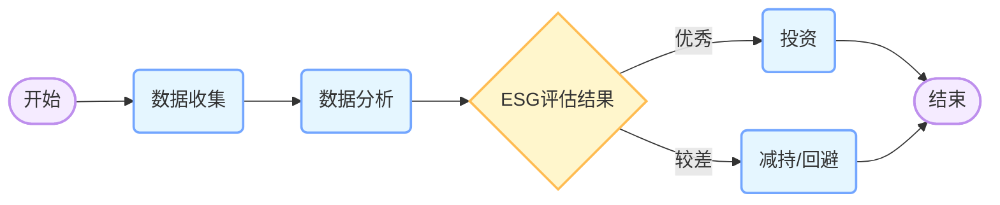

# 巴菲特如何看待环境、社会和治理(ESG)投资

> 关键词：巴菲特、ESG投资、投资理念、价值投资、可持续发展

> 摘要：本文深入探讨了巴菲特对环境、社会和治理（ESG）投资的看法。首先介绍了相关背景，包括目的范围、预期读者等内容。接着阐述了ESG投资的核心概念及其与传统投资的联系，通过流程图进行直观展示。详细分析了相关核心算法原理和操作步骤，并给出Python代码示例。讲解了涉及的数学模型和公式，并举例说明。通过项目实战，包括开发环境搭建、代码实现和解读，让读者更深入理解。探讨了ESG投资的实际应用场景，推荐了学习资源、开发工具框架和相关论文著作。最后总结了未来发展趋势与挑战，还设置了常见问题解答和扩展阅读参考资料。旨在全面剖析巴菲特视角下的ESG投资，为投资者和相关研究人员提供有价值的参考。

## 1. 背景介绍 
### 1.1 目的和范围
本文章的目的在于深入探究巴菲特对于环境、社会和治理（ESG）投资的观点和看法。通过对巴菲特的投资理念、公开言论以及其旗下伯克希尔·哈撒韦公司的投资实践进行分析，揭示他对ESG投资的态度和思考。研究范围不仅涵盖了巴菲特本人的相关观点，还涉及到伯克希尔·哈撒韦公司在投资决策过程中对ESG因素的考量，以及这些观点和实践对整个投资界的影响。

### 1.2 预期读者
预期读者主要包括投资者，无论是个人投资者还是机构投资者，他们希望从巴菲特的视角中获取关于ESG投资的启示，为自己的投资决策提供参考。同时，也适合金融行业的从业者，如基金经理、分析师等，他们可以通过本文了解巴菲特对ESG投资的态度，丰富自己的投资知识体系。此外，对可持续发展和企业社会责任感兴趣的研究人员和学者也能从本文中获得有价值的信息，用于学术研究和理论探讨。

### 1.3 文档结构概述
本文首先介绍背景信息，包括目的范围、预期读者和文档结构概述等内容。接着阐述ESG投资的核心概念以及其与传统投资的联系，通过流程图进行直观展示。然后详细分析核心算法原理和具体操作步骤，并给出Python代码示例。之后讲解涉及的数学模型和公式，并举例说明。通过项目实战，包括开发环境搭建、代码实现和解读，让读者更深入理解。探讨ESG投资的实际应用场景，推荐学习资源、开发工具框架和相关论文著作。最后总结未来发展趋势与挑战，设置常见问题解答和扩展阅读参考资料。

### 1.4 术语表
#### 1.4.1 核心术语定义
- **ESG投资**：是一种关注企业在环境（Environmental）、社会（Social）和治理（Governance）方面表现的投资理念和方法。投资者在评估企业时，不仅考虑财务指标，还会综合考虑企业在环境保护、社会责任履行和公司治理等方面的表现。
- **价值投资**：由本杰明·格雷厄姆和大卫·多德提出，经巴菲特发扬光大。价值投资强调通过分析企业的内在价值，寻找被市场低估的股票进行投资，长期持有以获取收益。
- **伯克希尔·哈撒韦**：是巴菲特旗下的一家多元化投资公司，业务涵盖保险、能源、铁路、制造业等多个领域，是全球知名的投资企业。

#### 1.4.2 相关概念解释
- **环境因素**：包括企业的能源使用效率、碳排放情况、污染治理措施、资源可持续利用等方面。例如，一家能源企业采用清洁能源技术、降低碳排放，就体现了较好的环境表现。
- **社会因素**：涉及企业与员工、客户、供应商、社区等利益相关者的关系。比如，企业为员工提供良好的工作环境和发展机会，积极参与社区公益活动等。
- **治理因素**：主要关注企业的治理结构、董事会独立性、高管薪酬政策、信息披露透明度等方面。良好的公司治理可以确保企业决策的科学性和公正性，保护股东的利益。

#### 1.4.3 缩略词列表
- **ESG**：环境（Environmental）、社会（Social）和治理（Governance）
- **BRK**：伯克希尔·哈撒韦公司（Berkshire Hathaway）

## 2. 核心概念与联系 

### 核心概念原理
ESG投资的核心原理是认为企业在环境、社会和治理方面的表现会对其长期的财务绩效产生影响。从环境方面来看，注重环境保护的企业可以降低环境风险，如减少污染罚款、避免资源短缺带来的成本上升等。例如，一家化工企业采用环保生产工艺，虽然前期可能需要投入一定的资金，但从长期来看，可以降低因环境污染导致的法律风险和社会舆论压力，同时也有助于提高企业的品牌形象。

在社会方面，积极履行社会责任的企业可以吸引优秀的人才，提高员工的忠诚度和工作效率。例如，一家科技企业为员工提供良好的福利待遇和职业发展机会，员工会更愿意为企业付出，从而提高企业的创新能力和竞争力。

治理方面，完善的公司治理结构可以确保企业决策的科学性和公正性，避免内部利益输送和管理混乱等问题。例如，一家上市公司设立独立的董事会和监事会，加强对管理层的监督和约束，可以提高企业的运营效率和透明度，增强投资者的信心。

### 架构的文本示意图
ESG投资架构可以分为三个层次：
- **底层数据收集**：收集企业在环境、社会和治理方面的相关数据，如企业的环境报告、社会责任报告、公司治理文件等。这些数据可以通过企业官方网站、第三方数据提供商等渠道获取。
- **中间层数据分析**：对收集到的数据进行分析和评估，建立ESG评价指标体系。常见的评价指标包括环境绩效指标（如碳排放强度、能源消耗率等）、社会绩效指标（如员工满意度、客户投诉率等）和治理绩效指标（如董事会独立性、高管薪酬合理性等）。通过对这些指标的分析，可以对企业的ESG表现进行量化评估。
- **上层投资决策**：根据ESG评估结果，投资者可以将ESG因素纳入投资决策过程中。例如，投资者可以选择ESG表现优秀的企业进行投资，或者对ESG表现较差的企业进行减持或回避。

### Mermaid流程图


## 3. 核心算法原理 & 具体操作步骤 

### 核心算法原理
在ESG投资中，一种常见的算法原理是基于多指标综合评价的方法。通过对企业的环境、社会和治理指标进行量化评估，然后根据各个指标的权重计算出企业的ESG综合得分。具体步骤如下：
1. **指标选取**：根据ESG的定义和相关标准，选取合适的指标来衡量企业的环境、社会和治理表现。例如，环境指标可以包括碳排放、能源消耗等；社会指标可以包括员工满意度、社区贡献等；治理指标可以包括董事会独立性、信息披露透明度等。
2. **数据标准化**：由于不同指标的量纲和取值范围可能不同，需要对收集到的数据进行标准化处理，使其具有可比性。常见的标准化方法有Z-score标准化、Min-Max标准化等。
3. **指标权重确定**：根据各个指标的重要性程度，确定其在ESG综合得分中的权重。权重的确定可以采用主观赋权法（如德尔菲法、层次分析法等）或客观赋权法（如熵权法、主成分分析法等）。
4. **综合得分计算**：根据标准化后的数据和指标权重，计算企业的ESG综合得分。计算公式如下：
$$ESG_{score}=\sum_{i=1}^{n}w_{i}x_{i}$$
其中，$ESG_{score}$ 表示企业的ESG综合得分，$w_{i}$ 表示第 $i$ 个指标的权重，$x_{i}$ 表示第 $i$ 个指标的标准化值，$n$ 表示指标的个数。

### 具体操作步骤
以下是使用Python实现上述算法的具体步骤：

```python
import pandas as pd
import numpy as np

# 1. 数据收集（假设已经收集到数据并存放在DataFrame中）
data = pd.DataFrame({
    '企业名称': ['企业A', '企业B', '企业C'],
    '碳排放': [100, 200, 150],
    '员工满意度': [0.8, 0.6, 0.7],
    '董事会独立性': [0.9, 0.8, 0.85]
})

# 2. 数据标准化（使用Min-Max标准化）
def min_max_scaling(data):
    return (data - data.min()) / (data.max() - data.min())

# 对除企业名称外的指标进行标准化
numerical_columns = data.columns[1:]
data[numerical_columns] = data[numerical_columns].apply(min_max_scaling)

# 3. 指标权重确定（假设采用主观赋权法，手动设定权重）
weights = {
    '碳排放': 0.3,
    '员工满意度': 0.3,
    '董事会独立性': 0.4
}

# 4. 综合得分计算
data['ESG综合得分'] = 0
for column, weight in weights.items():
    data['ESG综合得分'] += data[column] * weight

print(data)
```

在上述代码中，首先模拟了企业的ESG数据，并将其存储在DataFrame中。然后使用Min-Max标准化方法对数据进行标准化处理，使其取值范围在0到1之间。接着手动设定了各个指标的权重，最后根据权重计算企业的ESG综合得分。

## 4. 数学模型和公式 & 详细讲解 & 举例说明 

### 数学模型和公式
#### 数据标准化公式
- **Z-score标准化**：
$$z_{i}=\frac{x_{i}-\bar{x}}{s}$$
其中，$z_{i}$ 表示第 $i$ 个数据的标准化值，$x_{i}$ 表示第 $i$ 个原始数据，$\bar{x}$ 表示原始数据的均值，$s$ 表示原始数据的标准差。

- **Min-Max标准化**：
$$x_{i}^{*}=\frac{x_{i}-x_{min}}{x_{max}-x_{min}}$$
其中，$x_{i}^{*}$ 表示第 $i$ 个数据的标准化值，$x_{i}$ 表示第 $i$ 个原始数据，$x_{min}$ 表示原始数据的最小值，$x_{max}$ 表示原始数据的最大值。

#### ESG综合得分计算公式
$$ESG_{score}=\sum_{i=1}^{n}w_{i}x_{i}$$
其中，$ESG_{score}$ 表示企业的ESG综合得分，$w_{i}$ 表示第 $i$ 个指标的权重，$x_{i}$ 表示第 $i$ 个指标的标准化值，$n$ 表示指标的个数。

### 详细讲解
- **数据标准化**：由于不同指标的量纲和取值范围可能不同，直接使用原始数据进行计算会导致某些指标对综合得分的影响过大或过小。因此，需要对数据进行标准化处理，使其具有可比性。Z-score标准化是将数据转换为均值为0，标准差为1的标准正态分布；Min-Max标准化是将数据缩放到0到1的范围内。
- **ESG综合得分计算**：通过对各个指标的标准化值乘以相应的权重，然后求和得到企业的ESG综合得分。权重的确定反映了各个指标在综合评价中的重要性程度。

### 举例说明
假设我们有三家企业A、B、C，它们的环境指标（碳排放）、社会指标（员工满意度）和治理指标（董事会独立性）的数据如下：

| 企业名称 | 碳排放（吨） | 员工满意度 | 董事会独立性 |
| ---- | ---- | ---- | ---- |
| 企业A | 100 | 0.8 | 0.9 |
| 企业B | 200 | 0.6 | 0.8 |
| 企业C | 150 | 0.7 | 0.85 |

采用Min-Max标准化方法对数据进行标准化处理：

- 碳排放指标：
  - $x_{min}=100$，$x_{max}=200$
  - 企业A：$x_{A}^{*}=\frac{100 - 100}{200 - 100}=0$
  - 企业B：$x_{B}^{*}=\frac{200 - 100}{200 - 100}=1$
  - 企业C：$x_{C}^{*}=\frac{150 - 100}{200 - 100}=0.5$

- 员工满意度指标：
  - $x_{min}=0.6$，$x_{max}=0.8$
  - 企业A：$x_{A}^{*}=\frac{0.8 - 0.6}{0.8 - 0.6}=1$
  - 企业B：$x_{B}^{*}=\frac{0.6 - 0.6}{0.8 - 0.6}=0$
  - 企业C：$x_{C}^{*}=\frac{0.7 - 0.6}{0.8 - 0.6}=0.5$

- 董事会独立性指标：
  - $x_{min}=0.8$，$x_{max}=0.9$
  - 企业A：$x_{A}^{*}=\frac{0.9 - 0.8}{0.9 - 0.8}=1$
  - 企业B：$x_{B}^{*}=\frac{0.8 - 0.8}{0.9 - 0.8}=0$
  - 企业C：$x_{C}^{*}=\frac{0.85 - 0.8}{0.9 - 0.8}=0.5$

假设各个指标的权重分别为：碳排放0.3，员工满意度0.3，董事会独立性0.4。则三家企业的ESG综合得分计算如下：

- 企业A：$ESG_{A}=0.3\times0 + 0.3\times1 + 0.4\times1 = 0.7$
- 企业B：$ESG_{B}=0.3\times1 + 0.3\times0 + 0.4\times0 = 0.3$
- 企业C：$ESG_{C}=0.3\times0.5 + 0.3\times0.5 + 0.4\times0.5 = 0.5$

通过比较ESG综合得分，我们可以看出企业A的ESG表现相对较好，企业B的ESG表现相对较差。

## 5. 项目实战：代码实际案例和详细解释说明 

### 5.1  开发环境搭建
#### 安装Python
首先需要安装Python环境，建议使用Python 3.7及以上版本。可以从Python官方网站（https://www.python.org/downloads/）下载适合自己操作系统的安装包，按照安装向导进行安装。

#### 安装必要的库
在项目中，我们需要使用`pandas`和`numpy`库进行数据处理和计算。可以使用以下命令进行安装：
```sh
pip install pandas numpy
```

### 5.2  源代码详细实现和代码解读
```python
import pandas as pd
import numpy as np

# 1. 数据收集（假设已经收集到数据并存放在CSV文件中）
data = pd.read_csv('esg_data.csv')

# 2. 数据标准化（使用Min-Max标准化）
def min_max_scaling(data):
    return (data - data.min()) / (data.max() - data.min())

# 对除企业名称外的指标进行标准化
numerical_columns = data.columns[1:]
data[numerical_columns] = data[numerical_columns].apply(min_max_scaling)

# 3. 指标权重确定（假设采用主观赋权法，手动设定权重）
weights = {
    '环境指标1': 0.2,
    '环境指标2': 0.2,
    '社会指标1': 0.3,
    '治理指标1': 0.3
}

# 4. 综合得分计算
data['ESG综合得分'] = 0
for column, weight in weights.items():
    data['ESG综合得分'] += data[column] * weight

# 5. 结果排序并保存到新的CSV文件中
sorted_data = data.sort_values(by='ESG综合得分', ascending=False)
sorted_data.to_csv('esg_scores.csv', index=False)
```

### 代码解读与分析
1. **数据收集**：使用`pandas`的`read_csv`函数从CSV文件中读取企业的ESG数据。假设CSV文件名为`esg_data.csv`，第一列是企业名称，后面几列是各个ESG指标的数据。
2. **数据标准化**：定义了一个`min_max_scaling`函数，用于对数据进行Min-Max标准化处理。使用`apply`方法将该函数应用到除企业名称外的所有指标列上。
3. **指标权重确定**：手动设定了各个指标的权重，存储在字典`weights`中。
4. **综合得分计算**：初始化一个新的列`ESG综合得分`，并将其值设为0。然后遍历权重字典，将每个指标的标准化值乘以相应的权重，并累加到`ESG综合得分`列中。
5. **结果排序和保存**：使用`sort_values`方法对数据按照`ESG综合得分`列进行降序排序。最后将排序后的数据保存到新的CSV文件`esg_scores.csv`中，不保存行索引。

通过这个项目实战，我们可以对企业的ESG表现进行量化评估，并根据评估结果进行排序和分析。

## 6. 实际应用场景 
### 投资决策
投资者可以将ESG因素纳入投资决策过程中，选择ESG表现优秀的企业进行投资。研究表明，长期来看，ESG表现良好的企业往往具有更低的风险和更好的财务绩效。例如，一些养老基金和慈善基金会等机构投资者，会将ESG投资作为一种长期的投资策略，以实现资产的保值增值和社会可持续发展的目标。

### 企业风险管理
企业可以通过改善自身的ESG表现来降低风险。例如，加强环境保护可以避免因环境污染导致的法律诉讼和罚款；关注员工福利和社会责任可以提高员工的忠诚度和工作效率，减少人才流失和劳动纠纷；完善公司治理结构可以避免内部腐败和管理混乱等问题。

### 政策制定和监管
政府和监管机构可以制定相关政策和法规，鼓励企业加强ESG管理。例如，一些国家和地区出台了碳排放交易制度、企业社会责任报告制度等，促使企业更加注重环境和社会问题。同时，监管机构也可以加强对企业ESG信息披露的监管，提高信息透明度，保护投资者和社会公众的利益。

### 行业评估和比较
通过对不同行业企业的ESG表现进行评估和比较，可以了解各个行业在环境、社会和治理方面的优势和不足。这有助于行业协会和企业制定针对性的发展策略，推动整个行业的可持续发展。例如，在能源行业，可以比较不同能源企业在清洁能源开发、碳排放控制等方面的表现，促进能源行业的转型升级。

## 7. 工具和资源推荐
### 7.1 学习资源推荐
#### 7.1.1 书籍推荐
- 《ESG投资：从入门到精通》：本书系统地介绍了ESG投资的概念、方法和实践案例，适合初学者和有一定经验的投资者阅读。
- 《可持续发展投资：环境、社会和治理（ESG）因素整合》：深入探讨了ESG因素在投资决策中的整合方法和实践经验，对于专业投资者和研究人员具有较高的参考价值。
- 《企业社会责任与可持续发展》：介绍了企业社会责任和可持续发展的理论和实践，帮助读者了解企业在环境、社会和治理方面的责任和义务。

#### 7.1.2 在线课程
- Coursera平台上的“ESG投资与可持续金融”课程：由知名高校和金融机构的专家授课，内容涵盖ESG投资的各个方面，包括理论基础、评估方法和投资策略等。
- edX平台上的“可持续发展与企业责任”课程：从企业战略的角度出发，介绍了可持续发展和企业社会责任的重要性，以及如何将ESG因素纳入企业管理和决策过程中。

#### 7.1.3 技术博客和网站
- 负责任投资原则组织（PRI）官网（https://www.unpri.org/）：提供了大量关于ESG投资的研究报告、案例分析和最佳实践，是ESG投资领域的权威信息来源。
- 晨星公司（Morningstar）的ESG研究板块（https://www.morningstar.com/esg-investing）：提供了基金和股票的ESG评级和分析报告，帮助投资者了解投资标的的ESG表现。
- 商道纵横官网（https://www.syntao.com/）：专注于企业社会责任和可持续发展领域的研究和咨询服务，发布了许多关于ESG投资和企业社会责任的研究报告和文章。

### 7.2 开发工具框架推荐
#### 7.2.1 IDE和编辑器
- PyCharm：是一款专业的Python集成开发环境，具有强大的代码编辑、调试和项目管理功能，适合开发Python程序。
- Jupyter Notebook：是一个交互式的开发环境，支持Python、R等多种编程语言。可以方便地进行数据探索、分析和可视化，非常适合进行ESG数据分析和建模。

#### 7.2.2 调试和性能分析工具
- PDB：是Python自带的调试工具，可以在代码中设置断点，逐行执行代码，帮助开发者找出代码中的错误。
- cProfile：是Python的性能分析工具，可以统计代码中各个函数的执行时间和调用次数，帮助开发者优化代码性能。

#### 7.2.3 相关框架和库
- Pandas：是Python中用于数据处理和分析的重要库，提供了丰富的数据结构和函数，方便进行数据清洗、转换和分析。
- Numpy：是Python中用于科学计算的基础库，提供了高效的多维数组对象和数学函数，用于进行数值计算和矩阵运算。
- Scikit-learn：是Python中用于机器学习的常用库，提供了各种机器学习算法和工具，可用于ESG数据的建模和预测。

### 7.3 相关论文著作推荐
#### 7.3.1 经典论文
- “Does the Stock Market Fully Value Intangibles? Employee Satisfaction and Equity Prices”：研究了员工满意度与股票价格之间的关系，发现员工满意度高的企业具有更高的股票回报率，为ESG投资中社会因素的重要性提供了实证支持。
- “Corporate Social Responsibility and Financial Performance: A Meta - analysis”：通过对大量实证研究的元分析，探讨了企业社会责任与财务绩效之间的关系，得出了两者之间存在正相关关系的结论。

#### 7.3.2 最新研究成果
- 近年来，许多学术期刊如《Journal of Financial Economics》《Management Science》等发表了大量关于ESG投资的研究论文，涉及ESG投资的绩效评估、风险分析、投资策略等多个方面。可以通过学术数据库如Web of Science、EBSCOhost等进行检索和阅读。

#### 7.3.3 应用案例分析
- 《ESG投资案例集》：收集了国内外多个行业的ESG投资案例，包括投资决策过程、ESG评估方法和投资效果分析等内容，为投资者提供了实际操作的参考。
- 一些金融机构和咨询公司也会发布ESG投资的案例研究报告，如摩根士丹利、普华永道等，可以通过它们的官方网站进行查询和下载。

## 8. 总结：未来发展趋势与挑战
### 未来发展趋势
#### 市场规模持续增长
随着投资者对可持续发展和社会责任的关注度不断提高，ESG投资的市场规模有望持续增长。越来越多的机构投资者和个人投资者将ESG因素纳入投资决策过程中，推动ESG投资产品的不断创新和发展。

#### 监管要求日益严格
政府和监管机构将加强对ESG信息披露和投资管理的监管。例如，要求企业更加详细地披露ESG信息，规范ESG投资产品的命名和宣传，确保投资者能够获得准确、透明的信息。

#### 技术应用不断深化
人工智能、大数据、区块链等技术将在ESG投资中得到更广泛的应用。例如，利用人工智能技术对企业的ESG信息进行自动收集、分析和评估；利用区块链技术保证ESG数据的真实性和不可篡改。

#### 行业融合趋势明显
ESG投资将与其他金融领域如绿色金融、社会责任投资等深度融合，形成更加多元化的投资生态。同时，ESG投资也将与实体经济紧密结合，推动企业的可持续发展和产业升级。

### 挑战
#### 数据质量和可比性问题
目前，企业的ESG信息披露标准不统一，数据质量参差不齐，导致不同企业之间的ESG表现难以进行准确的比较和评估。这给投资者的决策带来了一定的困难。

#### 评估方法和指标体系不完善
虽然已经有多种ESG评估方法和指标体系，但尚未形成统一的标准。不同的评估机构可能采用不同的方法和指标，导致评估结果存在差异，影响了ESG投资的有效性和可信度。

#### 短期利益与长期价值的平衡
在投资决策中，投资者往往面临短期利益和长期价值的权衡。一些ESG表现优秀的企业可能在短期内的财务绩效不如传统企业，这使得投资者在追求短期收益的同时，难以坚定地选择ESG投资。

#### 专业人才短缺
ESG投资涉及环境、社会、治理、金融等多个领域的知识，需要具备跨学科背景的专业人才。目前，市场上这类专业人才相对短缺，限制了ESG投资的发展。

## 9. 附录：常见问题与解答
### 问题1：巴菲特是否支持ESG投资？
巴菲特并没有明确表示完全支持或反对ESG投资。他更强调企业的内在价值和长期盈利能力。不过，他旗下的伯克希尔·哈撒韦公司在一些投资决策中也会考虑企业的社会责任和治理等因素，但不是将ESG作为唯一的投资标准。

### 问题2：ESG投资一定能获得更高的回报吗？
不一定。虽然研究表明长期来看，ESG表现良好的企业可能具有更低的风险和更好的财务绩效，但这并不意味着ESG投资一定能获得更高的回报。市场情况是复杂多变的，ESG投资也受到多种因素的影响，如行业竞争、宏观经济环境等。

### 问题3：如何衡量企业的ESG表现？
可以通过多种方式衡量企业的ESG表现，如收集企业的环境报告、社会责任报告等公开信息，使用第三方ESG评估机构的评级结果，或者自己建立ESG评价指标体系进行评估。

### 问题4：ESG投资与传统投资有什么区别？
传统投资主要关注企业的财务指标，如盈利能力、资产负债状况等。而ESG投资在考虑财务指标的同时，还会综合考虑企业在环境、社会和治理方面的表现。ESG投资更注重企业的长期可持续发展和社会价值。

### 问题5：个人投资者如何参与ESG投资？
个人投资者可以通过购买ESG主题的基金、ETF等金融产品参与ESG投资。也可以在选择股票时，关注企业的ESG表现，将ESG因素纳入投资决策过程中。

## 10. 扩展阅读 & 参考资料
### 扩展阅读
- 《聪明的投资者》：巴菲特的导师本杰明·格雷厄姆的经典著作，介绍了价值投资的理念和方法，对理解巴菲特的投资思想有很大帮助。
- 《巴菲特致股东的信：股份公司教程》：收集了巴菲特历年致股东的信，从中可以了解巴菲特的投资理念、公司管理和决策思路。

### 参考资料
- 巴菲特历年股东大会的会议记录和视频资料，可通过伯克希尔·哈撒韦公司官网获取。
- 相关的财经媒体报道和研究报告，如《金融时报》《华尔街日报》等。
- 学术期刊上发表的关于ESG投资和巴菲特投资理念的研究论文。

作者：AI天才研究院/AI Genius Institute & 禅与计算机程序设计艺术 /Zen And The Art of Computer Programming