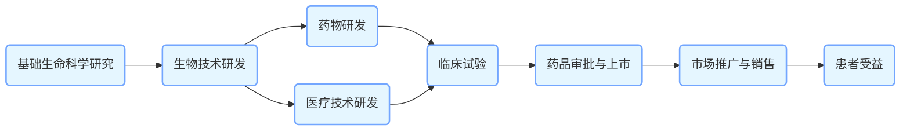

# 巴菲特如何看待生物科技领域的投资机会

> 关键词：巴菲特、生物科技领域、投资机会、价值投资、风险评估

> 摘要：本文深入探讨了巴菲特对生物科技领域投资机会的看法。从巴菲特一贯秉持的价值投资理念出发，分析生物科技领域的特点对其投资决策的影响。详细阐述了生物科技行业的核心概念、投资该领域涉及的算法原理（虽巴菲特投资非传统算法但可类比分析）、相关数学模型和公式。通过实际案例展示在生物科技领域的投资实践，介绍生物科技投资的实际应用场景，推荐相关学习资源、开发工具和论文著作。最后总结生物科技领域投资的未来发展趋势与挑战，并对常见问题进行解答。旨在为投资者全面了解巴菲特在生物科技领域的投资观点及相关投资知识提供参考。

## 1. 背景介绍 
### 1.1 目的和范围
本文的目的在于深入探究巴菲特对生物科技领域投资机会的看法，剖析其背后的投资逻辑和决策依据。范围涵盖生物科技领域的基本概念、投资分析方法、实际案例以及未来发展趋势等多个方面，旨在全面呈现巴菲特投资理念在生物科技领域的应用和影响。

### 1.2 预期读者
本文预期读者包括对投资领域感兴趣的普通投资者、金融从业者、生物科技行业研究人员以及关注巴菲特投资理念的人群。通过阅读本文，读者能够深入了解生物科技领域的投资特点以及巴菲特的投资观点，为自身的投资决策和研究提供参考。

### 1.3 文档结构概述
本文首先介绍背景信息，包括目的、预期读者和文档结构概述等。接着阐述生物科技领域的核心概念与联系，展示其原理和架构。然后讲解核心算法原理和具体操作步骤，运用 Python 源代码进行详细阐述。之后介绍数学模型和公式，并结合实际例子进行说明。通过项目实战展示生物科技领域的投资案例和代码解读。随后介绍生物科技投资的实际应用场景，推荐相关工具和资源。最后总结未来发展趋势与挑战，解答常见问题，并提供扩展阅读和参考资料。

### 1.4 术语表
#### 1.4.1 核心术语定义
- **价值投资**：一种基于公司内在价值进行投资的策略，投资者通过分析公司的财务状况、行业地位等因素，寻找被低估的股票进行投资。
- **生物科技**：利用生物体（包括微生物、动物细胞、植物细胞）或其组成部分（细胞器和酶）来生产有用物质，或为人类提供某种服务的技术。
- **研发管线**：生物科技公司正在进行的一系列研发项目的集合，代表了公司未来的发展潜力。
- **临床试验**：在人体上进行的药物或医疗技术的研究试验，分为不同阶段，用于评估其安全性和有效性。

#### 1.4.2 相关概念解释
- **专利保护**：生物科技公司的研发成果通常通过专利进行保护，以防止竞争对手的模仿和侵权，确保公司在一定时期内对该技术或产品的独占权。
- **行业壁垒**：生物科技行业具有较高的进入壁垒，包括技术难度、资金需求、监管要求等方面，这些因素限制了新企业的进入，保护了现有企业的市场地位。
- **风险投资**：对具有高风险、高潜在回报的项目进行投资，生物科技领域由于研发周期长、不确定性大，常常吸引风险投资的参与。

#### 1.4.3 缩略词列表
- **FDA**：美国食品药品监督管理局（Food and Drug Administration），负责监管美国的食品、药品、医疗器械等产品的安全性和有效性。
- **NDA**：新药申请（New Drug Application），生物科技公司在完成临床试验后，向监管机构提交的申请新药批准的文件。
- **IPO**：首次公开募股（Initial Public Offering），公司首次向公众发行股票，以筹集资金并实现上市。

## 2. 核心概念与联系 
### 生物科技领域核心概念原理
生物科技领域主要基于生命科学的基本原理，通过对生物体的研究和操作，开发出具有创新性的产品和技术。例如，基因编辑技术是利用特定的酶对生物体的基因进行精确修改，以达到治疗疾病、改良作物等目的。其原理是基于对 DNA 分子结构和功能的深入理解，通过识别和切割特定的 DNA 序列，实现对基因的编辑。

生物制药则是利用生物技术生产药物，通过培养细胞或微生物来表达具有治疗作用的蛋白质或其他生物活性物质。例如，利用基因工程技术将人类的胰岛素基因导入细菌细胞中，使其表达出胰岛素，用于治疗糖尿病。

### 生物科技领域架构示意图

这个流程图展示了生物科技领域从基础研究到最终患者受益的整个过程。基础生命科学研究为生物技术研发提供理论基础，生物技术研发包括药物研发和医疗技术研发。研发成果需要经过临床试验验证其安全性和有效性，然后通过药品审批才能上市。上市后进行市场推广和销售，最终使患者受益。

## 3. 核心算法原理 & 具体操作步骤 
### 巴菲特投资决策的类比算法原理
虽然巴菲特的投资决策并非基于传统的算法，但我们可以类比一种简单的价值评估算法来理解他的投资逻辑。以下是一个简化的 Python 代码示例，用于评估一家生物科技公司的潜在价值：

```python
class BiotechCompany:
    def __init__(self, revenue, profit,研发管线价值, 专利价值):
        self.revenue = revenue
        self.profit = profit
        self.研发管线价值 = 研发管线价值
        self.patent_value = 专利价值

    def calculate_intrinsic_value(self):
        # 简单的内在价值计算，假设各因素权重相同
        intrinsic_value = (self.revenue + self.profit + self.研发管线价值 + self.patent_value) / 4
        return intrinsic_value

    def is_undervalued(self, market_value):
        intrinsic_value = self.calculate_intrinsic_value()
        if intrinsic_value > market_value:
            return True
        else:
            return False

# 示例公司数据
revenue = 1000000
profit = 200000
研发管线价值 = 500000
专利价值 = 300000
market_value = 600000

company = BiotechCompany(revenue, profit, 研发管线价值, 专利价值)
if company.is_undervalued(market_value):
    print("该生物科技公司被低估，具有投资价值")
else:
    print("该生物科技公司未被低估，需谨慎投资")
```

### 具体操作步骤
1. **数据收集**：收集生物科技公司的财务数据，包括收入、利润等，同时评估其研发管线的价值和专利的价值。研发管线的价值可以通过对各个研发项目的预期收益和成功概率进行评估得到，专利的价值可以根据其市场竞争力和保护期限等因素进行估算。
2. **内在价值计算**：根据上述代码中的方法，计算公司的内在价值。在实际应用中，各因素的权重可能需要根据具体情况进行调整。
3. **市场价值评估**：了解公司的市场价值，可以通过查看其股票价格和市值等信息。
4. **投资决策**：比较内在价值和市场价值，如果内在价值大于市场价值，则认为公司被低估，具有投资价值；反之，则需谨慎投资。

## 4. 数学模型和公式 & 详细讲解 & 举例说明 
### 现金流折现模型
现金流折现模型是一种常用的评估公司内在价值的方法，其基本公式为：

$$V = \sum_{t=1}^{n} \frac{CF_t}{(1 + r)^t} + \frac{TV}{(1 + r)^n}$$

其中，$V$ 表示公司的内在价值，$CF_t$ 表示第 $t$ 期的现金流，$r$ 表示折现率，$TV$ 表示终值，$n$ 表示预测期数。

### 详细讲解
- **现金流（$CF_t$）**：对于生物科技公司，现金流包括研发投入、销售收入、利润等。在预测现金流时，需要考虑公司的研发进度、市场需求、竞争情况等因素。例如，一家生物科技公司正在研发一种新药，预计在未来 5 年内完成临床试验并上市销售。在研发阶段，公司的现金流主要为负，因为需要投入大量的资金进行研发；上市后，公司的现金流将逐渐变为正，随着市场份额的扩大，现金流也会不断增加。
- **折现率（$r$）**：折现率反映了资金的时间价值和投资的风险。对于生物科技公司，由于其研发周期长、不确定性大，折现率通常较高。一般来说，可以根据市场利率、行业风险等因素来确定折现率。
- **终值（$TV$）**：终值表示预测期结束后公司的价值。可以采用永续增长模型来计算终值，公式为：

$$TV = \frac{CF_{n+1}}{r - g}$$

其中，$CF_{n+1}$ 表示预测期结束后下一期的现金流，$g$ 表示永续增长率。

### 举例说明
假设一家生物科技公司预计未来 5 年的现金流分别为 -$100$ 万元、 -$200$ 万元、 -$300$ 万元、$500$ 万元和 $800$ 万元，折现率为 $15\%$，永续增长率为 $5\%$。预测期结束后下一期的现金流为 $900$ 万元。

首先计算各期现金流的折现值：

$PV_1 = \frac{-100}{(1 + 0.15)^1} \approx -86.96$（万元）

$PV_2 = \frac{-200}{(1 + 0.15)^2} \approx -151.23$（万元）

$PV_3 = \frac{-300}{(1 + 0.15)^3} \approx -197.25$（万元）

$PV_4 = \frac{500}{(1 + 0.15)^4} \approx 285.88$（万元）

$PV_5 = \frac{800}{(1 + 0.15)^5} \approx 404.63$（万元）

然后计算终值：

$TV = \frac{900}{0.15 - 0.05} = 9000$（万元）

终值的折现值为：

$PV_{TV} = \frac{9000}{(1 + 0.15)^5} \approx 4552.88$（万元）

最后计算公司的内在价值：

$V = -86.96 - 151.23 - 197.25 + 285.88 + 404.63 + 4552.88 \approx 4707.95$（万元）

## 5. 项目实战：代码实际案例和详细解释说明 
### 5.1  开发环境搭建
- **Python 安装**：从 Python 官方网站（https://www.python.org/downloads/）下载并安装 Python 3.x 版本。
- **开发工具**：推荐使用 PyCharm 或 Jupyter Notebook 作为开发工具。可以从 JetBrains 官方网站（https://www.jetbrains.com/pycharm/download/）下载 PyCharm，从 Anaconda 官方网站（https://www.anaconda.com/products/individual）下载 Anaconda 并安装 Jupyter Notebook。
- **相关库安装**：在命令行中使用以下命令安装所需的库：

```sh
pip install pandas numpy matplotlib
```

### 5.2  源代码详细实现和代码解读
以下是一个更复杂的生物科技公司投资分析的 Python 代码示例：

```python
import pandas as pd
import numpy as np
import matplotlib.pyplot as plt

# 模拟生物科技公司数据
data = {
    '年份': [2020, 2021, 2022, 2023, 2024],
    '收入': [100, 120, 150, 200, 250],
    '利润': [20, 25, 30, 40, 50],
    '研发投入': [50, 60, 70, 80, 90],
    '研发管线价值': [200, 250, 300, 350, 400],
    '专利价值': [100, 120, 150, 180, 200]
}

df = pd.DataFrame(data)

# 计算每年的内在价值
def calculate_intrinsic_value(row):
    # 简单的内在价值计算，假设各因素权重不同
    revenue_weight = 0.3
    profit_weight = 0.2
    rnd_weight = 0.1
    pipeline_weight = 0.2
    patent_weight = 0.2

    intrinsic_value = (row['收入'] * revenue_weight +
                       row['利润'] * profit_weight -
                       row['研发投入'] * rnd_weight +
                       row['研发管线价值'] * pipeline_weight +
                       row['专利价值'] * patent_weight)
    return intrinsic_value

df['内在价值'] = df.apply(calculate_intrinsic_value, axis=1)

# 绘制内在价值变化曲线
plt.plot(df['年份'], df['内在价值'])
plt.xlabel('年份')
plt.ylabel('内在价值')
plt.title('生物科技公司内在价值变化趋势')
plt.show()
```

### 5.3  代码解读与分析
1. **数据模拟**：使用字典 `data` 模拟生物科技公司的财务数据和相关价值数据，包括收入、利润、研发投入、研发管线价值和专利价值。
2. **数据处理**：使用 `pandas` 库将数据转换为 DataFrame 格式，方便进行数据处理和分析。
3. **内在价值计算**：定义 `calculate_intrinsic_value` 函数，根据不同的权重计算每年的内在价值。在这个函数中，考虑了收入、利润、研发投入、研发管线价值和专利价值等因素，通过加权求和的方式计算内在价值。
4. **可视化**：使用 `matplotlib` 库绘制内在价值随年份变化的曲线，直观地展示公司内在价值的变化趋势。

通过这个代码示例，我们可以看到如何对生物科技公司的财务数据进行处理和分析，计算其内在价值，并通过可视化的方式展示内在价值的变化趋势。这有助于投资者更好地了解公司的发展状况和投资价值。

## 6. 实际应用场景 
### 制药公司投资
巴菲特可能会关注那些具有强大研发能力和丰富研发管线的制药公司。例如，一些大型制药公司在多个治疗领域都有正在进行的临床试验项目，一旦这些项目成功，将为公司带来巨大的收益。通过对这些公司的财务状况、研发能力、市场竞争力等因素进行分析，巴菲特可以评估其投资价值，决定是否进行投资。

### 医疗器械公司投资
生物科技领域还包括医疗器械公司，这些公司研发和生产各种医疗设备，如心脏起搏器、血糖仪等。巴菲特可能会关注那些具有创新性技术和良好市场前景的医疗器械公司。例如，一些公司研发的新型医疗器械能够提高医疗效率、降低成本，具有广阔的市场需求。通过对这些公司的技术实力、产品质量、市场份额等因素进行评估，巴菲特可以判断其投资潜力。

### 基因编辑技术公司投资
基因编辑技术是生物科技领域的前沿技术，具有巨大的发展潜力。巴菲特可能会关注那些在基因编辑技术领域具有领先地位的公司。例如，一些公司的基因编辑技术能够用于治疗遗传性疾病、癌症等重大疾病，具有广阔的应用前景。然而，基因编辑技术也面临着伦理、法律等方面的挑战，巴菲特在投资时需要综合考虑这些因素。

## 7. 工具和资源推荐
### 7.1 学习资源推荐
#### 7.1.1 书籍推荐
- 《聪明的投资者》（The Intelligent Investor）：本杰明·格雷厄姆（Benjamin Graham）著，这本书是价值投资的经典之作，介绍了价值投资的基本理念和方法，对巴菲特的投资理念产生了深远的影响。
- 《巴菲特致股东的信》（Letters to Shareholders）：沃伦·巴菲特（Warren Buffett）著，这本书收录了巴菲特多年来致股东的信，通过这些信件可以深入了解巴菲特的投资思想和决策过程。
- 《生物技术产业》（Biotechnology Industry）：这本书全面介绍了生物科技产业的发展现状、技术原理、市场趋势等方面的内容，是了解生物科技领域的重要参考书籍。

#### 7.1.2 在线课程
- Coursera 上的“投资学原理”（Principles of Investing）课程：该课程由知名教授授课，介绍了投资的基本原理和方法，包括价值投资、风险评估等内容。
- edX 上的“生物科技导论”（Introduction to Biotechnology）课程：该课程介绍了生物科技的基本概念、技术原理和应用领域，适合初学者学习。

#### 7.1.3 技术博客和网站
- Seeking Alpha（https://seekingalpha.com/）：这是一个金融投资领域的专业网站，提供了大量的投资