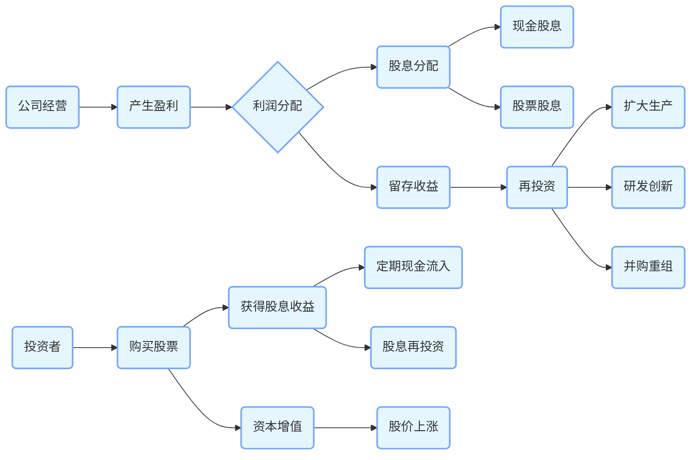

# 巴菲特如何看待股息投资

> 关键词：巴菲特、股息投资、价值投资、长期投资、股票选择、现金流、股东回报

> 摘要：本文深入探讨巴菲特对于股息投资的看法。通过对巴菲特投资理念的剖析，阐述股息投资在其价值投资体系中的地位和作用。详细分析核心概念、算法原理、数学模型，结合实际案例说明股息投资的重要性和实际操作方法。同时介绍股息投资的应用场景、相关工具资源，最后总结未来发展趋势与挑战，并解答常见问题，为投资者理解和运用股息投资提供全面的指导。

## 1. 背景介绍 
### 1.1 目的和范围
本部分旨在全面探究巴菲特对于股息投资的观点和态度。将研究范围聚焦于巴菲特长期以来的投资言论、投资案例以及其公司伯克希尔·哈撒韦的投资策略，以此来揭示股息投资在其价值投资框架中的重要性和具体应用方式。通过对这些内容的分析，为投资者提供有价值的参考，帮助他们更好地理解股息投资并运用到实际投资中。

### 1.2 预期读者
本文预期读者主要包括对价值投资感兴趣的个人投资者、金融专业学生、投资领域的从业者以及关注巴菲特投资理念的人群。无论你是初涉投资领域的新手，还是经验丰富的专业投资者，都能从本文中获得关于股息投资的深入见解和实用建议。

### 1.3 文档结构概述
本文将按照以下结构展开：首先介绍核心概念与联系，明确股息投资相关的基本概念和原理；接着阐述核心算法原理和具体操作步骤，通过Python代码进行详细说明；然后给出数学模型和公式，并结合实际例子进行讲解；之后通过项目实战展示股息投资的代码实现和详细解读；再介绍股息投资的实际应用场景；推荐相关的工具和资源；最后总结未来发展趋势与挑战，解答常见问题并提供扩展阅读和参考资料。

### 1.4 术语表
#### 1.4.1 核心术语定义
- **股息投资**：是指投资者购买能够定期向股东支付股息的股票，通过获取股息收益来实现投资回报的一种投资策略。股息是公司盈利的一部分，按一定比例分配给股东。
- **价值投资**：由本杰明·格雷厄姆提出，巴菲特进一步发展的投资理念。其核心是通过分析股票的内在价值，寻找价格低于内在价值的股票进行投资，注重长期投资和基本面分析。
- **股息率**：是股息与股票价格之间的比率，计算公式为：$股息率=\frac{每股股息}{股票价格}\times100\%$ 。它反映了投资者从股息中获得的收益比例。
- **留存收益**：公司在支付股息后剩余的利润，用于公司的再投资、扩大生产、研发等活动，以促进公司的长期发展。

#### 1.4.2 相关概念解释
- **股息稳定性**：指公司支付股息的连续性和金额的相对稳定程度。具有稳定股息的公司通常经营状况良好，现金流充足，能够为股东提供持续的回报。
- **股息增长**：公司的股息随着时间的推移逐渐增加的现象。股息增长表明公司盈利能力不断提升，对股东的回报也在增加，是衡量公司质量的重要指标之一。
- **股东权益**：股东对公司资产和利润的所有权。股息分配是股东权益的一种体现，合理的股息政策能够保障股东的利益。

#### 1.4.3 缩略词列表
- **EPS**：Earnings Per Share，每股收益，是指公司净利润与发行在外普通股股数的比值，反映了每股股票的盈利水平。
- **ROE**：Return on Equity，净资产收益率，是净利润与股东权益的百分比，衡量公司运用自有资本的效率。

## 2. 核心概念与联系 
### 核心概念原理
股息投资的核心原理在于投资者通过购买具有稳定股息支付能力的股票，分享公司的盈利成果。从公司的角度来看，盈利是股息分配的基础。公司在经营过程中产生利润后，会根据自身的发展战略和财务状况决定将多少利润以股息的形式分配给股东，剩余的利润则作为留存收益用于公司的再投资和发展。

对于投资者而言，股息不仅是一种直接的现金收益，还可以作为衡量公司质量和稳定性的重要指标。具有稳定股息支付记录的公司通常具有较强的盈利能力、良好的现金流管理和稳定的经营模式。此外，股息还可以通过再投资的方式实现复利增长，进一步提高投资者的长期回报。

### 架构的文本示意图
```plaintext
股息投资
|-- 公司盈利
|   |-- 股息分配
|   |   |-- 现金股息
|   |   |-- 股票股息
|   |-- 留存收益
|       |-- 再投资
|       |   |-- 扩大生产
|       |   |-- 研发创新
|       |   |-- 并购重组
|-- 投资者收益
|   |-- 股息收益
|   |   |-- 定期现金流入
|   |   |-- 股息再投资
|   |-- 资本增值
|       |-- 股价上涨
```

### Mermaid 流程图


## 3. 核心算法原理 & 具体操作步骤 
### 核心算法原理
在股息投资中，一个重要的算法是计算股息率和股息增长率。股息率的计算公式为：
$股息率=\frac{每股股息}{股票价格}\times100\%$

股息增长率可以通过以下公式计算：
$股息增长率=\frac{本期每股股息 - 上期每股股息}{上期每股股息}\times100\%$

### 具体操作步骤
#### 步骤 1：筛选具有稳定股息支付记录的公司
投资者可以通过查阅公司的财务报表、股息历史记录等资料，筛选出那些连续多年支付股息且股息金额相对稳定或呈增长趋势的公司。

#### 步骤 2：计算股息率和股息增长率
使用上述公式计算目标公司的股息率和股息增长率，以评估公司的股息回报水平和增长潜力。

#### 步骤 3：分析公司的基本面
除了股息指标外，还需要分析公司的盈利能力、财务状况、行业前景等基本面因素，以确保公司具有持续支付股息的能力。

#### 步骤 4：构建投资组合
根据分析结果，选择多只符合要求的股票构建投资组合，以分散风险。

#### 步骤 5：定期监控和调整
定期监控投资组合中公司的股息政策、财务状况等变化，根据市场情况和公司表现适时调整投资组合。

### Python 代码实现
```python
import pandas as pd

# 示例数据：股票价格和每股股息
data = {
    '股票代码': ['AAPL', 'MSFT', 'JNJ'],
    '股票价格': [150, 250, 180],
    '上期每股股息': [2, 3, 4],
    '本期每股股息': [2.2, 3.3, 4.2]
}

df = pd.DataFrame(data)

# 计算股息率
df['股息率'] = (df['本期每股股息'] / df['股票价格']) * 100

# 计算股息增长率
df['股息增长率'] = ((df['本期每股股息'] - df['上期每股股息']) / df['上期每股股息']) * 100

print(df)
```

### 代码解释
上述代码使用 Pandas 库来处理数据。首先，创建一个包含股票代码、股票价格、上期每股股息和本期每股股息的 DataFrame。然后，根据公式计算股息率和股息增长率，并将结果添加到 DataFrame 中。最后，打印出包含计算结果的 DataFrame。

## 4. 数学模型和公式 & 详细讲解 & 举例说明 
### 股息率模型
股息率是衡量股息投资收益的重要指标，其公式为：
$$股息率=\frac{每股股息}{股票价格}\times100\%$$

### 详细讲解
股息率反映了投资者以当前股价购买股票时，每年从股息中获得的收益率。较高的股息率通常意味着投资者可以获得更高的现金回报，但需要注意的是，股息率过高也可能暗示公司存在潜在问题，如盈利不稳定或股价被低估。

### 举例说明
假设某股票的每股股息为 2 元，股票价格为 50 元，则该股票的股息率为：
$$股息率=\frac{2}{50}\times100\% = 4\%$$

这意味着投资者以 50 元的价格购买该股票，每年可以从股息中获得 4% 的收益。

### 股息增长率模型
股息增长率用于衡量公司股息的增长速度，公式为：
$$股息增长率=\frac{本期每股股息 - 上期每股股息}{上期每股股息}\times100\%$$

### 详细讲解
股息增长率反映了公司盈利能力和股息政策的变化趋势。持续的股息增长通常表明公司经营状况良好，盈利能力不断提升，对股东的回报也在增加。

### 举例说明
假设某公司上期每股股息为 1 元，本期每股股息为 1.1 元，则该公司的股息增长率为：
$$股息增长率=\frac{1.1 - 1}{1}\times100\% = 10\%$$

这表明该公司的股息较上期增长了 10%。

### 股息贴现模型（DDM）
股息贴现模型是一种基于股息的股票估值模型，其基本公式为：
$$V=\frac{D_1}{r - g}$$

其中，$V$ 表示股票的内在价值，$D_1$ 表示下一期预计股息，$r$ 表示投资者要求的回报率，$g$ 表示股息增长率。

### 详细讲解
该模型的核心思想是将股票的价值视为未来股息的现值之和。假设股息以固定增长率 $g$ 增长，通过将未来各期的股息贴现到当前时刻，得到股票的内在价值。如果股票的市场价格低于其内在价值，则认为该股票被低估，具有投资价值。

### 举例说明
假设某公司下一期预计股息为 2 元，投资者要求的回报率为 10%，股息增长率为 5%，则该股票的内在价值为：
$$V=\frac{2}{0.1 - 0.05}=40（元）$$

如果该股票的市场价格低于 40 元，则可以认为该股票具有投资价值。

## 5. 项目实战：代码实际案例和详细解释说明 
### 5.1  开发环境搭建
#### 安装 Python
首先，需要安装 Python 环境。可以从 Python 官方网站（https://www.python.org/downloads/）下载适合自己操作系统的 Python 版本，并按照安装向导进行安装。

#### 安装必要的库
在本项目中，需要使用 Pandas、Numpy 等库进行数据处理和分析。可以使用以下命令进行安装：
```sh
pip install pandas numpy
```

### 5.2  源代码详细实现和代码解读
```python
import pandas as pd
import numpy as np

# 读取历史股息数据文件（假设文件名为 dividend_data.csv）
data = pd.read_csv('dividend_data.csv')

# 计算每股股息
data['每股股息'] = data['总股息'] / data['总股本']

# 计算股息率
data['股息率'] = (data['每股股息'] / data['股票价格']) * 100

# 计算股息增长率
data['股息增长率'] = data['每股股息'].pct_change()

# 筛选出股息率大于 3% 且股息增长率为正的股票
selected_stocks = data[(data['股息率'] > 3) & (data['股息增长率'] > 0)]

# 计算平均股息率和平均股息增长率
average_dividend_yield = selected_stocks['股息率'].mean()
average_dividend_growth_rate = selected_stocks['股息增长率'].mean()

print(f"平均股息率: {average_dividend_yield}%")
print(f"平均股息增长率: {average_dividend_growth_rate * 100}%")
```

### 代码解读
1. **读取数据**：使用 Pandas 的 `read_csv` 函数读取包含历史股息数据的 CSV 文件。
2. **计算每股股息**：通过总股息除以总股本得到每股股息。
3. **计算股息率**：根据股息率公式计算每只股票的股息率。
4. **计算股息增长率**：使用 Pandas 的 `pct_change` 函数计算每股股息的增长率。
5. **筛选股票**：筛选出股息率大于 3% 且股息增长率为正的股票。
6. **计算平均值**：计算筛选出的股票的平均股息率和平均股息增长率。
7. **输出结果**：打印出平均股息率和平均股息增长率。

### 5.3  代码解读与分析
通过上述代码，我们可以对历史股息数据进行处理和分析，筛选出具有较高股息率和正股息增长率的股票。平均股息率和平均股息增长率可以作为评估这些股票整体股息回报水平和增长潜力的指标。需要注意的是，这只是一个简单的示例，实际投资中还需要考虑更多因素，如公司的基本面、行业前景等。

## 6. 实际应用场景 
### 退休投资计划
对于即将退休或已经退休的投资者来说，股息投资是一种理想的投资策略。通过投资具有稳定股息支付的股票，可以获得定期的现金流入，作为退休生活的补充收入。同时，股息的再投资可以实现资产的增值，保障退休后的财务稳定。

### 长期资产配置
在长期资产配置中，股息投资可以作为一种重要的组成部分。与其他投资品种如债券、现金等相结合，可以降低投资组合的风险，提高整体收益。具有稳定股息的股票通常具有较强的抗跌性，在市场波动时可以为投资组合提供一定的保护。

### 价值投资策略
股息投资是价值投资的重要体现。巴菲特等价值投资者认为，通过投资具有稳定股息和良好基本面的公司，可以获得长期的投资回报。股息不仅是公司盈利能力的体现，还可以为投资者提供一定的安全边际。当股票价格下跌时，股息可以弥补部分损失；当股票价格上涨时，投资者可以同时获得资本增值和股息收益。

### 家族财富传承
对于家族财富传承来说，股息投资可以为家族成员提供持续的收入来源。通过长期持有具有稳定股息的股票，家族财富可以不断积累和增值，实现财富的代际传承。同时，股息投资也可以培养家族成员的投资意识和理财能力。

## 7. 工具和资源推荐
### 7.1 学习资源推荐
#### 7.1.1 书籍推荐
- 《聪明的投资者》（The Intelligent Investor）：本杰明·格雷厄姆著，被誉为价值投资的圣经，详细阐述了价值投资的理念和方法，对股息投资也有深入的探讨。
- 《巴菲特致股东的信：股份公司教程》（Letters to Shareholders of Berkshire Hathaway）：沃伦·巴菲特著，收录了巴菲特多年来致股东的信，从中可以了解他的投资理念、策略和对股息投资的看法。
- 《股息投资策略》（The Dividend Investor's Strategy）：作者通过实际案例和数据分析，介绍了股息投资的原理、方法和技巧，适合初学者和有一定投资经验的读者。

#### 7.1.2 在线课程
- Coursera 上的“投资学原理”（Principles of Investing）：该课程由知名大学教授授课，涵盖了投资学的基本原理和方法，包括股息投资的相关内容。
- Udemy 上的“股息投资入门”（Dividend Investing for Beginners）：专门针对股息投资初学者设计，通过视频教程和案例分析，帮助学员掌握股息投资的基本技巧。

#### 7.1.3 技术博客和网站
- Seeking Alpha：提供大量的投资分析文章和研究报告，包括股息投资的相关内容。投资者可以在这里了解到最新的市场动态和股息投资策略。
- Dividend.com：专注于股息投资的网站，提供股息数据、股息筛选工具、股息新闻等信息，是股息投资者的重要资源平台。

### 7.2 开发工具框架推荐
#### 7.2.1 IDE和编辑器
- PyCharm：一款专业的 Python 集成开发环境，具有强大的代码编辑、调试和分析功能，适合进行股息投资数据分析和代码开发。
- Jupyter Notebook：交互式的编程环境，支持 Python 等多种编程语言。可以方便地进行数据探索、可视化和代码演示，非常适合进行股息投资的数据分析和模型验证。

#### 7.2.2 调试和性能分析工具
- PDB：Python 自带的调试器，可以帮助开发者在代码执行过程中进行调试，定位和解决问题。
- cProfile：Python 的性能分析工具，可以分析代码的执行时间和资源消耗情况，帮助开发者优化代码性能。

#### 7.2.3 相关框架和库
- Pandas：用于数据处理和分析的 Python 库，提供了高效的数据结构和数据分析工具，非常适合处理股息数据。
- Numpy：Python 的数值计算库，提供了高性能的多维数组对象和各种数学函数，可用于股息投资中的数值计算和模型实现。

### 7.3 相关论文著作推荐
#### 7.3.1 经典论文
- “Dividend Policy, Growth, and the Valuation of Shares”（《股息政策、增长与股票估值》）：由 Myron J. Gordon 和 Eli Shapiro 撰写，该论文提出了股息贴现模型的基本思想，对股息投资的理论发展产生了重要影响。
- “The Information Content of Dividends”（《股息的信息含量》）：由 Paul Asquith 和 David W. Mullins 撰写，研究了股息公告对股票价格的影响，揭示了股息背后的信息传递机制。

#### 7.3.2 最新研究成果
- 近年来，随着金融科技的发展，一些学者开始运用大数据、机器学习等技术研究股息投资。例如，有研究通过分析社交媒体数据和公司财务数据，预测公司的股息政策和股票价格走势。

#### 7.3.3 应用案例分析
- 一些金融研究机构和投资公司会发布股息投资的应用案例分析报告。这些报告通过实际案例展示了股息投资的策略和效果，为投资者提供了参考和借鉴。

## 8. 总结：未来发展趋势与挑战
### 未来发展趋势
#### 数字化和智能化
随着金融科技的不断发展，股息投资将越来越数字化和智能化。投资者可以利用大数据、人工智能等技术进行股息数据的分析和挖掘，更精准地筛选出具有投资价值的股票。同时，智能投资顾问也将为投资者提供更加个性化的股息投资建议。

#### 全球投资机会增加
随着全球经济一体化的深入，投资者将有更多的机会参与全球股息投资。不同国家和地区的公司具有不同的股息政策和投资价值，投资者可以通过全球资产配置，分散风险，提高投资回报。

#### 社会责任投资兴起
越来越多的投资者开始关注公司的社会责任和可持续发展。在股息投资中，投资者将更加倾向于选择那些具有良好社会形象、注重环境保护和员工福利的公司。这将促使公司更加注重社会责任，推动股息投资向更加可持续的方向发展。

### 挑战
#### 市场波动和不确定性
股票市场的波动和不确定性是股息投资面临的主要挑战之一。市场的大幅下跌可能导致股票价格下降，股息率上升，但同时也可能影响公司的盈利能力和股息支付能力。投资者需要具备较强的风险承受能力和应对市场波动的能力。

#### 公司业绩变化
公司的业绩变化直接影响股息的支付。如果公司业绩下滑，可能会减少或暂停股息支付。投资者需要密切关注公司的基本面变化，及时调整投资组合。

#### 政策和法规变化
政策和法规的变化也可能对股息投资产生影响。例如，税收政策的调整可能会影响投资者的实际收益；监管政策的变化可能会影响公司的股息政策和经营环境。投资者需要及时了解政策和法规的变化，调整投资策略。

## 9. 附录：常见问题与解答
### 问题 1：股息投资一定能获得稳定的收益吗？
解答：股息投资并不一定能获得稳定的收益。虽然具有稳定股息支付记录的公司通常经营状况较好，但公司的业绩可能会受到市场环境、行业竞争、宏观经济等多种因素的影响，导致股息支付减少或暂停。此外，股票价格的波动也会影响投资者的总收益。

### 问题 2：如何选择具有投资价值的股息股票？
解答：选择具有投资价值的股息股票需要综合考虑多个因素。首先，要关注公司的股息稳定性和股息增长率，选择那些连续多年支付股息且股息逐年增长的公司。其次，要分析公司的基本面，包括盈利能力、财务状况、行业前景等。此外，还可以参考股息率、市盈率、市净率等指标，评估股票的估值水平。

### 问题 3：股息再投资有什么好处？
解答：股息再投资可以实现复利增长，提高投资者的长期回报。通过将股息再次投资于股票，可以购买更多的股份，从而在未来获得更多的股息收益。随着时间的推移，复利的效果会越来越明显，使投资者的资产实现快速增长。

### 问题 4：股息投资适合短期投资吗？
解答：股息投资更适合长期投资。股息投资的核心是通过长期持有具有稳定股息的股票，分享公司的盈利增长和股息回报。短期投资中，股票价格的波动可能会掩盖股息收益，而且频繁买卖还会增加交易成本。因此，建议投资者将股息投资作为一种长期的投资策略。

## 10. 扩展阅读 & 参考资料
### 扩展阅读
- 《金融市场与金融机构》（Financial Markets and Institutions）：这本书涵盖了金融市场的各个方面，包括股票市场、债券市场等，对理解股息投资的市场环境有很大帮助。
- 《行为金融学》（Behavioral Finance）：研究投资者的心理和行为对金融市场的影响，有助于投资者更好地理解市场波动和自身的投资决策。

### 参考资料
- 伯克希尔·哈撒韦公司年报：可以从公司官方网站获取，其中包含了巴菲特对投资理念和策略的阐述，以及公司的投资组合和股息政策等信息。
- 金融数据提供商：如 Bloomberg、Wind 等，提供了丰富的金融数据和研究报告，可用于股息投资的数据分析和研究。

作者：AI天才研究院/AI Genius Institute & 禅与计算机程序设计艺术 /Zen And The Art of Computer Programming