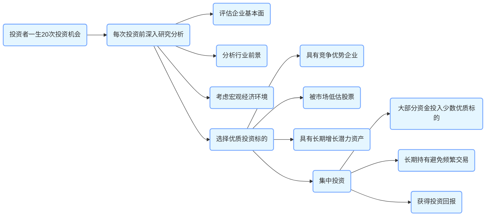

# 巴菲特的20格打孔卡：集中投资的艺术

> 关键词：巴菲特、20格打孔卡、集中投资、投资艺术、价值投资

> 摘要：本文围绕巴菲特提出的20格打孔卡这一投资理念展开深入探讨。详细介绍了该理念的背景、核心概念、算法原理以及数学模型，通过实际案例展示了其在投资中的应用。同时，分析了这一理念在实际投资场景中的作用，推荐了相关的学习资源、开发工具和研究论文，最后总结了其未来发展趋势与挑战，并解答了常见问题。旨在帮助投资者深入理解集中投资的艺术，提升投资决策能力。

## 1. 背景介绍 
### 1.1 目的和范围
本文章的目的在于深入剖析巴菲特的20格打孔卡这一独特的投资理念，全面解读其背后的原理、应用方法以及在实际投资中的价值。通过详细的阐述和丰富的案例，帮助投资者理解集中投资的艺术，为他们在投资决策过程中提供有价值的参考。文章的范围涵盖了该理念的核心概念、算法原理、数学模型、实际应用场景等多个方面，同时还会推荐相关的学习资源和研究成果，以拓宽读者的知识面和视野。

### 1.2 预期读者
本文预期读者主要包括对投资领域感兴趣的个人投资者，无论是初涉投资市场的新手，还是有一定投资经验的老手，都能从文章中获取有价值的信息和启示。此外，金融专业的学生、研究人员以及从事投资咨询、金融分析等相关职业的人士也可以通过阅读本文，加深对集中投资策略的理解和应用。

### 1.3 文档结构概述
本文将按照以下结构进行详细阐述：首先介绍巴菲特20格打孔卡理念的背景信息，包括目的、预期读者和文档结构概述等内容；接着深入讲解核心概念，通过文本示意图和Mermaid流程图展示其原理和架构；然后阐述核心算法原理，并使用Python源代码进行详细说明；之后介绍相关的数学模型和公式，并通过具体例子进行解释；再通过项目实战，展示代码实际案例并进行详细解读；分析该理念在实际应用场景中的作用；推荐相关的学习资源、开发工具和研究论文；最后总结其未来发展趋势与挑战，解答常见问题，并提供扩展阅读和参考资料。

### 1.4 术语表
#### 1.4.1 核心术语定义
- **20格打孔卡**：巴菲特提出的一种投资理念，假设投资者一生只有20次投资机会，每进行一次投资就相当于在这张卡片上打一个孔，用完即止。这一理念强调投资者要谨慎选择投资机会，集中精力投资于少数优质资产。
- **集中投资**：是指将大部分资金集中投入到少数经过精心挑选的投资标的上，而不是分散投资于众多不同的资产。与分散投资相对，集中投资更注重对优质资产的深度研究和长期持有。
- **价值投资**：一种投资策略，强调通过对企业的基本面进行深入分析，寻找被市场低估的股票，并长期持有，等待其价值回归，从而获得投资收益。

#### 1.4.2 相关概念解释
- **投资机会成本**：是指投资者在做出投资决策时，放弃其他投资机会所可能带来的最大收益。在20格打孔卡的理念下，每一次投资都意味着放弃了其他潜在的投资机会，因此需要谨慎评估投资机会的价值。
- **长期投资**：是指投资者将资金投入到某项资产中，并持有较长的时间周期，通常为数年甚至数十年。长期投资的目的是通过资产的长期增值来获得收益，避免短期市场波动的影响。

#### 1.4.3 缩略词列表
- **ROE**：Return on Equity，净资产收益率，是衡量企业盈利能力的重要指标，反映了股东权益的收益水平。
- **PE**：Price-to-Earnings Ratio，市盈率，是指股票价格除以每股收益的比率，用于评估股票的估值水平。

## 2. 核心概念与联系 
### 核心概念原理
巴菲特的20格打孔卡理念基于一个简单而深刻的假设：投资者一生只有20次投资机会。这一假设迫使投资者在做出每一次投资决策时都要深思熟虑，因为每一次投资都消耗了一次宝贵的机会。该理念的核心在于强调集中投资的重要性，鼓励投资者将有限的资金集中投入到少数经过深入研究和分析的优质资产上，而不是分散投资于众多不同的资产。

集中投资的优势在于可以让投资者更加专注于少数投资标的，深入了解其基本面、行业前景和竞争优势，从而做出更准确的投资决策。同时，集中投资也可以提高投资组合的回报率，因为优质资产在长期内往往能够创造更高的价值。

### 架构的文本示意图
以下是20格打孔卡理念的架构文本示意图：

投资者一生拥有20次投资机会（20格打孔卡）
|
|-- 每次投资前进行深入研究和分析
|   |-- 评估企业基本面（财务状况、盈利能力、管理团队等）
|   |-- 分析行业前景（市场规模、增长趋势、竞争格局等）
|   |-- 考虑宏观经济环境（利率、通胀、政策等）
|
|-- 选择优质投资标的
|   |-- 具有竞争优势的企业（品牌、技术、成本等）
|   |-- 被市场低估的股票
|   |-- 具有长期增长潜力的资产
|
|-- 集中投资
|   |-- 将大部分资金投入到少数优质标的上
|   |-- 长期持有，避免频繁交易
|
|-- 获得投资回报

### Mermaid流程图


## 3. 核心算法原理 & 具体操作步骤 
### 核心算法原理
20格打孔卡理念的核心算法原理可以概括为以下几个步骤：

1. **筛选投资标的**：通过对大量的企业和资产进行研究和分析，筛选出具有潜在投资价值的标的。这可以基于多种因素，如企业的财务指标（ROE、PE等）、行业前景、竞争优势等。
2. **评估投资价值**：对筛选出的投资标的进行详细的评估，计算其内在价值。可以使用多种估值方法，如现金流折现法、相对估值法等。
3. **选择优质标的**：根据评估结果，选择少数具有较高投资价值的标的作为投资对象。这些标的应该具有较强的竞争优势、良好的财务状况和长期增长潜力。
4. **确定投资比例**：根据投资者的风险承受能力和投资目标，确定每个投资标的的投资比例。通常情况下，应该将大部分资金集中投入到少数优质标的上。
5. **长期持有**：一旦做出投资决策，应该长期持有投资标的，避免频繁交易。长期持有可以让投资者充分享受企业成长带来的收益，同时减少交易成本和市场波动的影响。

### 具体操作步骤（Python源代码实现）
以下是一个简单的Python代码示例，用于演示如何根据20格打孔卡理念进行投资标的的筛选和评估：

```python
import pandas as pd

# 假设我们有一个包含多个企业财务数据的DataFrame
data = {
    '企业名称': ['企业A', '企业B', '企业C', '企业D', '企业E'],
    'ROE': [0.2, 0.15, 0.18, 0.22, 0.12],
    'PE': [15, 20, 18, 16, 22],
    '行业前景评分': [8, 6, 7, 9, 5]
}
df = pd.DataFrame(data)

# 第一步：筛选投资标的
# 设定筛选条件，如ROE大于0.15，PE小于20，行业前景评分大于6
filtered_df = df[(df['ROE'] > 0.15) & (df['PE'] < 20) & (df['行业前景评分'] > 6)]

# 第二步：评估投资价值
# 这里简单假设投资价值 = ROE * 行业前景评分 / PE
filtered_df['投资价值'] = filtered_df['ROE'] * filtered_df['行业前景评分'] / filtered_df['PE']

# 第三步：选择优质标的
# 按投资价值降序排序，选择前2个标的
top_2_df = filtered_df.sort_values(by='投资价值', ascending=False).head(2)

print("筛选出的优质投资标的：")
print(top_2_df)

# 第四步：确定投资比例
# 假设将80%的资金平均分配到这2个标的上
investment_ratio = 0.8
each_ratio = investment_ratio / len(top_2_df)
print(f"每个标的的投资比例：{each_ratio * 100}%")

# 第五步：长期持有（这里代码中无法体现，只是理念说明）
```

### 代码解释
1. **数据准备**：使用`pandas`库创建一个包含多个企业财务数据的DataFrame，包括ROE、PE和行业前景评分等信息。
2. **筛选投资标的**：根据设定的筛选条件（ROE大于0.15，PE小于20，行业前景评分大于6），筛选出符合要求的企业。
3. **评估投资价值**：使用简单的公式（投资价值 = ROE * 行业前景评分 / PE）计算每个筛选出的企业的投资价值。
4. **选择优质标的**：按投资价值降序排序，选择前2个标的作为优质投资对象。
5. **确定投资比例**：假设将80%的资金平均分配到这2个标的上，计算每个标的的投资比例。

## 4. 数学模型和公式 & 详细讲解 & 举例说明 
### 数学模型和公式
在20格打孔卡理念下，评估投资标的的价值是关键。以下是一些常用的数学模型和公式：

#### 1. 现金流折现法（Discounted Cash Flow, DCF）
现金流折现法是一种常用的估值方法，其基本原理是将企业未来的现金流折现到当前时刻，以计算企业的内在价值。公式如下：

$$
V = \sum_{t=1}^{n} \frac{CF_t}{(1 + r)^t} + \frac{TV}{(1 + r)^n}
$$

其中：
- $V$ 表示企业的内在价值
- $CF_t$ 表示第 $t$ 期的现金流
- $r$ 表示折现率
- $n$ 表示预测期数
- $TV$ 表示终值

#### 2. 相对估值法（如市盈率法）
市盈率法是一种相对简单的估值方法，通过比较目标企业与同行业其他企业的市盈率，来评估目标企业的估值水平。公式如下：

$$
P = EPS \times PE
$$

其中：
- $P$ 表示股票价格
- $EPS$ 表示每股收益
- $PE$ 表示市盈率

### 详细讲解
#### 现金流折现法
现金流折现法的核心思想是，企业的价值等于其未来所能产生的全部现金流的现值之和。在使用该方法时，需要对企业未来的现金流进行预测，并选择合适的折现率。折现率反映了投资者对投资风险的预期，风险越高，折现率越高。终值是指预测期结束后企业的价值，可以使用多种方法进行估算，如永续增长模型等。

#### 相对估值法
相对估值法的优点是简单易懂，易于操作。通过比较目标企业与同行业其他企业的市盈率，可以快速判断目标企业的估值水平是高估还是低估。但该方法也存在一定的局限性，因为不同企业的盈利能力、成长前景等因素可能存在差异，单纯使用市盈率进行比较可能不够准确。

### 举例说明
#### 现金流折现法举例
假设某企业未来3年的现金流分别为100万元、120万元和150万元，预测期结束后的终值为1000万元，折现率为10%。则该企业的内在价值计算如下：

$$
\begin{align*}
V &= \frac{100}{(1 + 0.1)^1} + \frac{120}{(1 + 0.1)^2} + \frac{150}{(1 + 0.1)^3} + \frac{1000}{(1 + 0.1)^3}\\
&= \frac{100}{1.1} + \frac{120}{1.21} + \frac{150}{1.331} + \frac{1000}{1.331}\\
&\approx 90.91 + 99.17 + 112.69 + 751.31\\
&= 1054.08 \text{（万元）}
\end{align*}
$$

#### 相对估值法举例
假设同行业平均市盈率为20倍，某企业每股收益为2元，则该企业的合理股价为：

$$
P = 2 \times 20 = 40 \text{（元）}
$$

如果该企业当前股价为35元，则说明该企业的股票可能被低估；如果当前股价为45元，则说明该企业的股票可能被高估。

## 5. 项目实战：代码实际案例和详细解释说明 
### 5.1  开发环境搭建
为了实现基于20格打孔卡理念的投资分析项目，我们需要搭建以下开发环境：

1. **Python环境**：建议使用Python 3.7及以上版本。可以从Python官方网站（https://www.python.org/downloads/）下载并安装。
2. **开发工具**：推荐使用PyCharm作为开发工具，它是一款功能强大的Python集成开发环境（IDE），可以提高开发效率。可以从JetBrains官方网站（https://www.jetbrains.com/pycharm/download/）下载并安装。
3. **必要的Python库**：需要安装`pandas`、`numpy`等库，用于数据处理和分析。可以使用以下命令进行安装：

```sh
pip install pandas numpy
```

### 5.2  源代码详细实现和代码解读
以下是一个更完整的基于20格打孔卡理念的投资分析项目的Python代码示例：

```python
import pandas as pd
import numpy as np

# 模拟获取企业财务数据
def get_company_data():
    data = {
        '企业名称': ['企业A', '企业B', '企业C', '企业D', '企业E', '企业F', '企业G', '企业H', '企业I', '企业J'],
        'ROE': [0.2, 0.15, 0.18, 0.22, 0.12, 0.16, 0.19, 0.21, 0.14, 0.17],
        'PE': [15, 20, 18, 16, 22, 17, 19, 15, 21, 18],
        '行业前景评分': [8, 6, 7, 9, 5, 7, 8, 9, 6, 7]
    }
    return pd.DataFrame(data)

# 筛选投资标的
def filter_investment_targets(df):
    # 设定筛选条件，如ROE大于0.15，PE小于20，行业前景评分大于6
    return df[(df['ROE'] > 0.15) & (df['PE'] < 20) & (df['行业前景评分'] > 6)]

# 评估投资价值
def evaluate_investment_value(df):
    # 这里简单假设投资价值 = ROE * 行业前景评分 / PE
    df['投资价值'] = df['ROE'] * df['行业前景评分'] / df['PE']
    return df

# 选择优质标的
def select_top_investment_targets(df, top_n=2):
    return df.sort_values(by='投资价值', ascending=False).head(top_n)

# 确定投资比例
def determine_investment_ratio(top_df, total_investment=1000000, investment_ratio=0.8):
    each_ratio = investment_ratio / len(top_df)
    top_df['投资金额'] = total_investment * each_ratio
    return top_df

# 主函数
def main():
    # 获取企业财务数据
    company_data = get_company_data()
    print("原始企业财务数据：")
    print(company_data)

    # 筛选投资标的
    filtered_data = filter_investment_targets(company_data)
    print("\n筛选后的投资标的：")
    print(filtered_data)

    # 评估投资价值
    evaluated_data = evaluate_investment_value(filtered_data)
    print("\n评估投资价值后的结果：")
    print(evaluated_data)

    # 选择优质标的
    top_investment_targets = select_top_investment_targets(evaluated_data)
    print("\n选择的优质投资标的：")
    print(top_investment_targets)

    # 确定投资比例
    final_investment_plan = determine_investment_ratio(top_investment_targets)
    print("\n最终投资计划：")
    print(final_investment_plan)

if __name__ == "__main__":
    main()
```

### 5.3  代码解读与分析
1. **数据获取**：`get_company_data`函数模拟获取企业的财务数据，包括ROE、PE和行业前景评分等信息，并返回一个`pandas`的DataFrame对象。
2. **筛选投资标的**：`filter_investment_targets`函数根据设定的筛选条件（ROE大于0.15，PE小于20，行业前景评分大于6），筛选出符合要求的企业。
3. **评估投资价值**：`evaluate_investment_value`函数使用简单的公式（投资价值 = ROE * 行业前景评分 / PE）计算每个筛选出的企业的投资价值，并将结果添加到DataFrame中。
4. **选择优质标的**：`select_top_investment_targets`函数按投资价值降序排序，选择前2个标的作为优质投资对象。
5. **确定投资比例**：`determine_investment_ratio`函数假设将80%的资金平均分配到这2个标的上，计算每个标的的投资金额，并将结果添加到DataFrame中。
6. **主函数**：`main`函数调用上述各个函数，完成数据获取、筛选、评估、选择和投资比例确定等步骤，并打印出每一步的结果。

通过这个项目实战，我们可以看到如何使用Python实现基于20格打孔卡理念的投资分析过程，帮助投资者筛选出优质的投资标的，并制定合理的投资计划。

## 6. 实际应用场景 
### 个人投资者
对于个人投资者来说，20格打孔卡理念可以帮助他们更加谨慎地做出投资决策。在面对众多的投资机会时，个人投资者往往容易受到市场情绪的影响，做出冲动的投资决策。而20格打孔卡理念提醒投资者，一生只有有限的投资机会，需要认真研究和分析每一个投资标的，选择真正具有价值的资产进行投资。

例如，个人投资者小张在考虑投资股票时，运用20格打孔卡理念，对市场上的股票进行了深入的研究和分析。他首先筛选出了一些具有稳定盈利能力和良好行业前景的企业，然后对这些企业的财务报表、管理层能力等方面进行了详细的评估。最终，他选择了2只股票进行投资，并长期持有。经过几年的时间，这2只股票的价格大幅上涨，小张获得了丰厚的投资回报。

### 机构投资者
机构投资者管理着大量的资金，需要对投资组合进行合理的配置。20格打孔卡理念可以帮助机构投资者更加集中地投资于少数优质资产，提高投资组合的回报率。

例如，某基金公司在构建投资组合时，采用了20格打孔卡理念。基金经理对市场上的各类资产进行了全面的研究和分析，筛选出了一些具有核心竞争力和长期增长潜力的企业。然后，将大部分资金集中投入到这些企业的股票上，并长期持有。通过这种集中投资的策略，该基金在过去几年中取得了优异的业绩表现，跑赢了市场平均水平。

### 风险投资领域
在风险投资领域，20格打孔卡理念同样具有重要的应用价值。风险投资家需要在众多的创业项目中选择少数具有高潜力的项目进行投资，因为他们的资金和资源是有限的。

例如，风险投资家小李在评估创业项目时，会运用20格打孔卡理念，对项目的团队背景、技术创新、市场需求等方面进行深入的分析。他会仔细筛选出那些具有独特商业模式和高增长潜力的项目，并对这些项目进行重点投资。通过这种方式，小李成功地投资了几个具有潜力的创业项目，其中一些项目在后期获得了巨大的成功，为他带来了丰厚的回报。

## 7. 工具和资源推荐
### 7.1 学习资源推荐
#### 7.1.1 书籍推荐
- 《聪明的投资者》（The Intelligent Investor）：本杰明·格雷厄姆（Benjamin Graham）著，这本书是价值投资领域的经典之作，被誉为投资者的“圣经”。书中介绍了价值投资的基本理念和方法，对巴菲特的投资思想产生了深远的影响。
- 《巴菲特致股东的信：股份公司教程》（Letters to Shareholders of Berkshire Hathaway）：沃伦·巴菲特（Warren Buffett）著，这本书收录了巴菲特多年来写给伯克希尔·哈撒韦股东的信，通过这些信件，读者可以深入了解巴菲特的投资理念、决策过程和管理经验。
- 《穷查理宝典：查理·芒格的智慧箴言录》（Poor Charlie's Almanack: The Wit and Wisdom of Charles T. Munger）：彼得·考夫曼（Peter D. Kaufman）编著，这本书介绍了查理·芒格的多元思维模型和投资哲学，芒格是巴菲特的长期合作伙伴，他的思想对巴菲特的投资决策产生了重要的影响。

#### 7.1.2 在线课程
- Coursera上的“投资学原理”（Principles of Investing）课程：由宾夕法尼亚大学沃顿商学院的教授授课，课程涵盖了投资学的基本概念、理论和方法，包括资产定价、投资组合管理等内容。
- edX上的“价值投资基础”（Foundations of Value Investing）课程：由哥伦比亚大学商学院的教授授课，课程深入讲解了价值投资的原理和实践，通过案例分析和实际操作，帮助学员掌握价值投资的方法和技巧。

#### 7.1.3 技术博客和网站
- 雪球网（https://xueqiu.com/）：是一个投资者社区，提供股票、基金等投资产品的信息和分析，投资者可以在上面交流投资经验、分享投资观点。
- 价值投资网（https://www.value-investing.net/）：专注于价值投资领域，提供价值投资的理论、方法和案例分析，同时还推荐一些优质的投资标的。

### 7.2 开发工具框架推荐
#### 7.2.1 IDE和编辑器
- PyCharm：是一款功能强大的Python集成开发环境（IDE），提供了代码编辑、调试、版本控制等功能，适合Python开发。
- Jupyter Notebook：是一个交互式的开发环境，支持多种编程语言，包括Python。它可以让用户在浏览器中编写和运行代码，同时还可以添加文本说明和可视化图表，非常适合数据分析和机器学习项目。

#### 7.2.2 调试和性能分析工具
- Py-Spy：是一个用于Python程序的性能分析工具，可以实时监测Python程序的CPU使用率、内存占用等情况，帮助开发者找出程序中的性能瓶颈。
- pdb：是Python自带的调试器，可以让开发者在程序运行过程中暂停执行，查看变量的值、调用栈等信息，帮助调试程序。

#### 7.2.3 相关框架和库
- pandas：是一个用于数据处理和分析的Python库，提供了高效的数据结构和数据分析工具，如DataFrame和Series等，非常适合处理金融数据。
- numpy：是一个用于科学计算的Python库，提供了高效的多维数组对象和各种数学函数，是许多数据分析和机器学习库的基础。

### 7.3 相关论文著作推荐
#### 7.3.1 经典论文
- 《证券分析》（Security Analysis）：本杰明·格雷厄姆和戴维·多德（David Dodd）著，这篇论文是价值投资领域的经典之作，提出了价值投资的基本理念和方法，对后来的投资理论和实践产生了深远的影响。
- 《有效市场假说》（Efficient Market Hypothesis）：尤金·法玛（Eugene F. Fama）著，这篇论文提出了有效市场假说，认为在有效市场中，股票价格已经反映了所有可用的信息，投资者无法通过分析历史数据或其他信息来获得超额收益。

#### 7.3.2 最新研究成果
- 《行为金融学》（Behavioral Finance）：理查德·泰勒（Richard H. Thaler）等著，行为金融学是近年来兴起的一个研究领域，它结合了心理学和金融学的理论和方法，研究投资者的行为和决策过程，以及这些行为和决策对金融市场的影响。
- 《量化投资》（Quantitative Investing）：近年来，量化投资成为了投资领域的一个热门话题，相关的研究成果不断涌现。量化投资通过运用数学模型和计算机算法来进行投资决策，提高投资效率和回报率。

#### 7.3.3 应用案例分析
- 《巴菲特的投资案例分析》：通过对巴菲特的投资案例进行深入分析，可以了解他的投资理念和决策过程，以及如何运用20格打孔卡理念进行投资。
- 《风险投资案例分析》：对一些成功的风险投资案例进行分析，了解风险投资家如何运用20格打孔卡理念选择投资项目，并实现投资回报。

## 8. 总结：未来发展趋势与挑战
### 未来发展趋势
#### 更加注重基本面分析
随着市场的不断发展和变化，投资者将更加注重对企业基本面的分析。20格打孔卡理念强调投资者要深入研究企业的财务状况、盈利能力、管理团队等方面的信息，选择具有真正价值的资产进行投资。未来，这种基于基本面分析的投资策略将更加受到投资者的重视。

#### 与科技的结合更加紧密
随着科技的不断进步，投资领域也将迎来更多的创新和变革。例如，人工智能、大数据等技术将被广泛应用于投资分析和决策过程中，帮助投资者更加准确地筛选投资标的、评估投资价值。20格打孔卡理念也将与这些技术相结合，提高投资决策的效率和准确性。

#### 全球化投资趋势加强
随着全球经济的一体化，投资者将有更多的机会参与全球市场的投资。20格打孔卡理念可以帮助投资者在全球范围内筛选优质的投资标的，实现资产的全球化配置。未来，全球化投资将成为投资领域的一个重要趋势。

### 挑战
#### 市场不确定性增加
市场环境是复杂多变的，充满了各种不确定性因素。例如，宏观经济形势的变化、政策法规的调整、突发事件的影响等，都可能对投资市场产生重大影响。在这种情况下，投资者要准确地判断投资机会和风险变得更加困难，20格打孔卡理念的应用也面临着更大的挑战。

#### 信息过载问题
在信息时代，投资者可以获取到大量的信息。然而，信息过载也给投资者带来了困扰，如何从海量的信息中筛选出有价值的信息，并做出正确的投资决策，是投资者面临的一个重要挑战。20格打孔卡理念要求投资者进行深入的研究和分析，但在信息过载的情况下，投资者很难做到全面、准确地了解每一个投资标的。

#### 投资者情绪的影响
投资者的情绪往往会对投资决策产生重要影响。在市场上涨时，投资者容易产生贪婪情绪，盲目追涨；在市场下跌时，投资者容易产生恐惧情绪，恐慌抛售。这种情绪的波动可能导致投资者做出错误的投资决策，影响20格打孔卡理念的有效实施。

## 9. 附录：常见问题与解答
### 问题1：20格打孔卡理念是否适用于所有投资者？
解答：20格打孔卡理念并不是适用于所有投资者。该理念更适合那些有一定投资经验、具备较强的研究和分析能力、能够承受一定风险的投资者。对于初涉投资市场的新手来说，可能需要先积累一定的投资知识和经验，再尝试运用该理念进行投资。

### 问题2：如何确定投资标的的内在价值？
解答：确定投资标的的内在价值是一个复杂的过程，需要综合考虑多个因素。常用的方法包括现金流折现法、相对估值法等。现金流折现法需要对企业未来的现金流进行预测，并选择合适的折现率；相对估值法需要比较目标企业与同行业其他企业的估值指标。此外，还需要考虑企业的竞争优势、行业前景、管理团队等因素。

### 问题3：集中投资是否会增加投资风险？
解答：集中投资在一定程度上会增加投资风险。因为集中投资将大部分资金集中投入到少数投资标的上，如果这些标的出现问题，可能会导致投资组合的价值大幅下降。然而，如果投资者能够深入研究和分析投资标的，选择具有较强竞争优势和良好财务状况的企业进行投资，并长期持有，那么集中投资也有可能获得较高的回报率。投资者在进行集中投资时，需要根据自己的风险承受能力和投资目标，合理确定投资比例。

### 问题4：如何应对市场的不确定性？
解答：市场的不确定性是不可避免的，投资者可以通过以下方法来应对：一是进行充分的研究和分析，尽可能了解投资标的的基本面和市场环境；二是分散投资，虽然20格打孔卡理念强调集中投资，但也可以适当分散投资于不同行业、不同类型的资产，以降低风险；三是保持冷静和理性，避免受到市场情绪的影响，坚持自己的投资策略。

## 10. 扩展阅读 & 参考资料
### 扩展阅读
- 《投资最重要的事》（The Most Important Thing Illuminated: Uncommon Sense for the Thoughtful Investor）：霍华德·马克斯（Howard Marks）著，这本书介绍了投资中的一些重要原则和方法，帮助投资者避免常见的投资错误。
- 《金融炼金术》（The Alchemy of Finance）：乔治·索罗斯（George Soros）著，这本书探讨了金融市场的运行规律和投资者的行为模式，提出了反身性理论。

### 参考资料
- 巴菲特历年致股东的信：可以从伯克希尔·哈撒韦公司的官方网站（https://www.berkshirehathaway.com/letters/letters.html）获取。
- 相关学术期刊和研究报告：如《金融研究》、《经济研究》等学术期刊，以及各大金融机构发布的研究报告。

作者：AI天才研究院/AI Genius Institute & 禅与计算机程序设计艺术 /Zen And The Art of Computer Programming