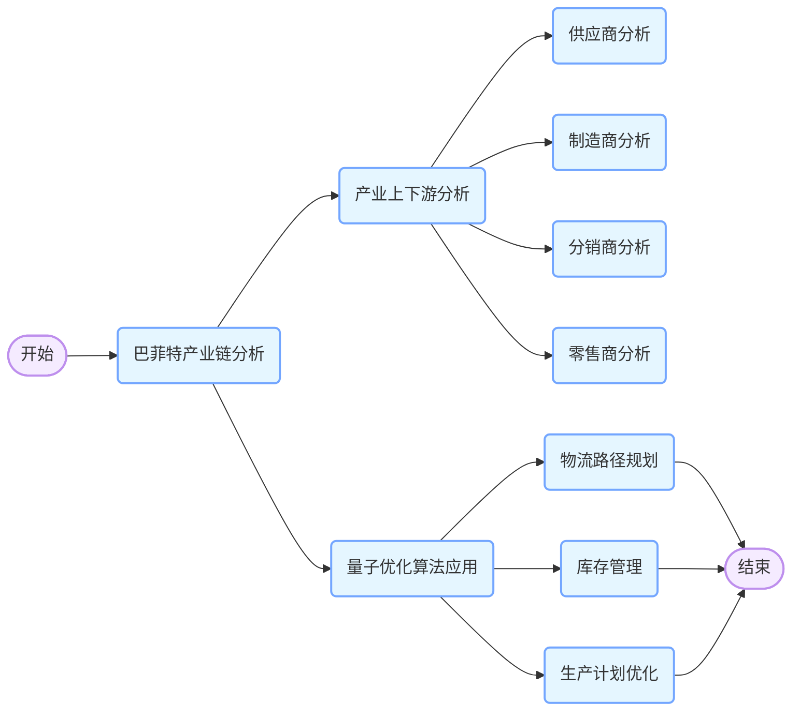

# 巴菲特的产业链分析7.0：量子优化算法在供应链管理中的应用

> 关键词：巴菲特产业链分析、量子优化算法、供应链管理、量子计算、优化策略

> 摘要：本文围绕巴菲特的产业链分析理念，深入探讨量子优化算法在供应链管理中的应用。首先介绍相关背景知识，包括研究目的、预期读者等；接着阐述核心概念与联系，展示原理和架构的示意图与流程图；详细讲解核心算法原理，用Python代码进行说明；给出数学模型和公式并举例；通过项目实战展示代码案例及解读；分析实际应用场景；推荐相关工具和资源；最后总结未来发展趋势与挑战，提供常见问题解答和扩展阅读参考资料，旨在为供应链管理领域引入量子优化算法提供全面的理论与实践指导。

## 1. 背景介绍 
### 1.1 目的和范围
在当今复杂多变的商业环境中，供应链管理面临着诸多挑战，如成本控制、物流优化、库存管理等。巴菲特的产业链分析强调对产业上下游的深入理解和把握，以寻找具有长期竞争优势的投资机会。而量子优化算法作为量子计算领域的重要成果，为解决供应链管理中的复杂优化问题提供了新的思路和方法。本文的目的在于探讨如何将量子优化算法应用于供应链管理，结合巴菲特的产业链分析理念，提升供应链的效率和竞争力。

本文的范围涵盖了量子优化算法的基本原理、在供应链管理中的具体应用场景、相关的数学模型和公式，以及通过实际项目案例展示其应用效果。同时，还将推荐相关的学习资源、开发工具和研究论文，为读者深入研究和应用该技术提供全面的参考。

### 1.2 预期读者
本文预期读者包括供应链管理领域的从业者，如物流经理、采购专员、供应链分析师等，他们希望了解量子优化算法如何改进现有的供应链管理策略；量子计算和优化算法领域的研究人员，对将算法应用于实际商业场景感兴趣；以及对投资和产业链分析有兴趣的投资者，希望从量子技术的角度深入理解产业链的优化和发展。

### 1.3 文档结构概述
本文将按照以下结构进行组织：
- 核心概念与联系：介绍量子优化算法和供应链管理的核心概念，以及它们之间的联系，通过示意图和流程图进行直观展示。
- 核心算法原理 & 具体操作步骤：详细讲解量子优化算法的原理，并用Python代码实现具体的操作步骤。
- 数学模型和公式 & 详细讲解 & 举例说明：给出量子优化算法在供应链管理中应用的数学模型和公式，并通过具体例子进行详细讲解。
- 项目实战：代码实际案例和详细解释说明：通过实际项目案例，展示量子优化算法在供应链管理中的应用，包括开发环境搭建、源代码实现和代码解读。
- 实际应用场景：分析量子优化算法在供应链管理中的具体应用场景，如物流路径规划、库存管理等。
- 工具和资源推荐：推荐相关的学习资源、开发工具和研究论文，帮助读者深入学习和应用该技术。
- 总结：未来发展趋势与挑战：总结量子优化算法在供应链管理中的应用现状，分析未来发展趋势和面临的挑战。
- 附录：常见问题与解答：提供常见问题的解答，帮助读者解决在学习和应用过程中遇到的问题。
- 扩展阅读 & 参考资料：提供相关的扩展阅读材料和参考资料，方便读者进一步深入研究。

### 1.4 术语表
#### 1.4.1 核心术语定义
- **巴菲特产业链分析**：由投资大师沃伦·巴菲特提出的一种投资分析方法，通过对产业上下游的深入研究，寻找具有长期竞争优势和稳定现金流的企业进行投资。
- **量子优化算法**：基于量子计算原理设计的优化算法，利用量子比特的叠加和纠缠特性，能够在更短的时间内找到复杂优化问题的近似最优解。
- **供应链管理**：对供应链中的物流、信息流和资金流进行计划、组织、协调和控制，以满足客户需求，提高供应链的效率和竞争力。
- **量子计算**：一种基于量子力学原理的计算方式，利用量子比特的特殊性质，能够实现比经典计算机更快的计算速度和更强的计算能力。
- **优化策略**：为了实现特定目标，在多个可行方案中选择最优方案的方法和过程。

#### 1.4.2 相关概念解释
- **量子比特（qubit）**：量子计算中的基本信息单位，与经典比特不同，量子比特可以同时处于0和1的叠加态，这使得量子计算机能够同时处理多个计算任务。
- **叠加态**：量子系统的一种状态，量子比特可以同时处于多个状态的叠加，这是量子计算能够实现并行计算的基础。
- **纠缠态**：量子系统中多个量子比特之间的一种特殊关联状态，当一个量子比特的状态发生变化时，与之纠缠的其他量子比特的状态也会立即发生相应的变化。
- **近似最优解**：在复杂优化问题中，由于求解最优解的计算复杂度过高，通常采用近似算法寻找一个接近最优解的解，称为近似最优解。

#### 1.4.3 缩略词列表
- **QC**：量子计算（Quantum Computing）
- **QAOA**：量子近似优化算法（Quantum Approximate Optimization Algorithm）
- **VQE**：变分量子特征求解器（Variational Quantum Eigensolver）
- **ERP**：企业资源计划（Enterprise Resource Planning）
- **WMS**：仓库管理系统（Warehouse Management System）

## 2. 核心概念与联系 

### 核心概念原理
#### 量子优化算法原理
量子优化算法利用量子比特的叠加和纠缠特性，能够在更短的时间内探索更多的解空间，从而找到复杂优化问题的近似最优解。以量子近似优化算法（QAOA）为例，它通过一系列的量子门操作，将初始量子态演化到一个包含最优解信息的量子态，然后通过测量量子态得到近似最优解。

#### 供应链管理原理
供应链管理的核心是对供应链中的物流、信息流和资金流进行有效的计划、组织、协调和控制。其目标是在满足客户需求的前提下，降低供应链的成本，提高供应链的效率和竞争力。供应链管理涉及到多个环节，如采购、生产、物流、销售等，每个环节都需要进行优化和协调。

### 架构的文本示意图
```plaintext
巴菲特产业链分析
    |
    |-- 产业上下游分析
    |       |
    |       |-- 供应商分析
    |       |-- 制造商分析
    |       |-- 分销商分析
    |       |-- 零售商分析
    |
    |-- 量子优化算法应用
            |
            |-- 物流路径规划
            |-- 库存管理
            |-- 生产计划优化
```

### Mermaid 流程图


## 3. 核心算法原理 & 具体操作步骤 

### 量子近似优化算法（QAOA）原理
量子近似优化算法（QAOA）是一种用于解决组合优化问题的量子算法。其基本思想是通过交替应用驱动哈密顿量和问题哈密顿量，将初始量子态演化到一个包含最优解信息的量子态，然后通过测量量子态得到近似最优解。

#### 步骤 1：定义问题哈密顿量
问题哈密顿量 $H_P$ 是一个与优化问题相关的量子力学算符，其基态对应于优化问题的最优解。对于一个具有 $n$ 个变量的组合优化问题，问题哈密顿量可以表示为：

$$H_P = \sum_{i,j} w_{ij} Z_i Z_j + \sum_i b_i Z_i$$

其中，$Z_i$ 是第 $i$ 个量子比特的泡利 $Z$ 算符，$w_{ij}$ 和 $b_i$ 是与问题相关的系数。

#### 步骤 2：定义驱动哈密顿量
驱动哈密顿量 $H_D$ 是一个用于驱动量子态演化的量子力学算符，通常选择为：

$$H_D = \sum_i X_i$$

其中，$X_i$ 是第 $i$ 个量子比特的泡利 $X$ 算符。

#### 步骤 3：交替应用驱动哈密顿量和问题哈密顿量
通过交替应用驱动哈密顿量和问题哈密顿量，将初始量子态 $|\psi_0\rangle$ 演化到一个包含最优解信息的量子态 $|\psi(\vec{\gamma}, \vec{\beta})\rangle$：

$$|\psi(\vec{\gamma}, \vec{\beta})\rangle = U_D(\beta_p) U_P(\gamma_p) \cdots U_D(\beta_1) U_P(\gamma_1) |\psi_0\rangle$$

其中，$U_P(\gamma) = e^{-i \gamma H_P}$ 和 $U_D(\beta) = e^{-i \beta H_D}$ 分别是问题哈密顿量和驱动哈密顿量的时间演化算符，$\vec{\gamma} = (\gamma_1, \cdots, \gamma_p)$ 和 $\vec{\beta} = (\beta_1, \cdots, \beta_p)$ 是待优化的参数。

#### 步骤 4：测量量子态
对演化后的量子态 $|\psi(\vec{\gamma}, \vec{\beta})\rangle$ 进行测量，得到一个经典比特串，该比特串对应于优化问题的一个近似解。

#### 步骤 5：优化参数
通过经典优化算法，如梯度下降法，优化参数 $\vec{\gamma}$ 和 $\vec{\beta}$，使得测量结果对应的目标函数值最小。

### Python 代码实现
```python
import numpy as np
from qiskit import QuantumCircuit, Aer, execute
from qiskit.visualization import plot_histogram
from scipy.optimize import minimize

# 定义问题哈密顿量的系数
w = np.array([[0, 1, 1], [1, 0, 1], [1, 1, 0]])
b = np.array([0, 0, 0])

# 定义问题哈密顿量
def problem_hamiltonian(qubit_state):
    energy = 0
    n = len(qubit_state)
    for i in range(n):
        for j in range(n):
            energy += w[i][j] * qubit_state[i] * qubit_state[j]
        energy += b[i] * qubit_state[i]
    return energy

# 定义驱动哈密顿量
def driver_hamiltonian(circuit, beta):
    n = circuit.num_qubits
    for i in range(n):
        circuit.rx(2 * beta, i)

# 定义问题哈密顿量的演化算符
def problem_hamiltonian_evolution(circuit, gamma):
    n = circuit.num_qubits
    for i in range(n):
        for j in range(i + 1, n):
            if w[i][j]!= 0:
                circuit.rzz(2 * gamma * w[i][j], i, j)
        if b[i]!= 0:
            circuit.rz(2 * gamma * b[i], i)

# 定义 QAOA 电路
def qaoa_circuit(p, gamma, beta):
    n = len(w)
    circuit = QuantumCircuit(n)
    # 初始态
    for i in range(n):
        circuit.h(i)
    # 交替应用驱动哈密顿量和问题哈密顿量
    for i in range(p):
        problem_hamiltonian_evolution(circuit, gamma[i])
        driver_hamiltonian(circuit, beta[i])
    # 测量
    circuit.measure_all()
    return circuit

# 定义目标函数
def objective_function(params):
    p = len(params) // 2
    gamma = params[:p]
    beta = params[p:]
    circuit = qaoa_circuit(p, gamma, beta)
    backend = Aer.get_backend('qasm_simulator')
    job = execute(circuit, backend, shots=1000)
    result = job.result()
    counts = result.get_counts(circuit)
    energy = 0
    for state, count in counts.items():
        qubit_state = [int(s) for s in state[::-1]]
        energy += problem_hamiltonian(qubit_state) * count
    return energy / 1000

# 优化参数
p = 2
initial_params = np.random.rand(2 * p)
result = minimize(objective_function, initial_params, method='COBYLA')
optimal_params = result.x

# 生成最优电路
gamma = optimal_params[:p]
beta = optimal_params[p:]
optimal_circuit = qaoa_circuit(p, gamma, beta)

# 运行最优电路
backend = Aer.get_backend('qasm_simulator')
job = execute(optimal_circuit, backend, shots=1000)
result = job.result()
counts = result.get_counts(optimal_circuit)

# 绘制测量结果
plot_histogram(counts).show()
```

### 代码解释
1. **定义问题哈密顿量的系数**：`w` 是问题哈密顿量中 $Z_i Z_j$ 项的系数矩阵，`b` 是 $Z_i$ 项的系数向量。
2. **定义问题哈密顿量和驱动哈密顿量**：`problem_hamiltonian` 函数计算给定量子态的问题哈密顿量的能量，`driver_hamiltonian` 函数实现驱动哈密顿量的时间演化算符。
3. **定义问题哈密顿量的演化算符**：`problem_hamiltonian_evolution` 函数实现问题哈密顿量的时间演化算符。
4. **定义 QAOA 电路**：`qaoa_circuit` 函数根据给定的参数 $p$、$\gamma$ 和 $\beta$ 生成 QAOA 电路。
5. **定义目标函数**：`objective_function` 函数计算给定参数下的目标函数值，即测量结果对应的平均能量。
6. **优化参数**：使用 `scipy.optimize.minimize` 函数优化参数 $\gamma$ 和 $\beta$。
7. **生成最优电路并运行**：根据优化后的参数生成最优电路，并在量子模拟器上运行，得到测量结果。
8. **绘制测量结果**：使用 `qiskit.visualization.plot_histogram` 函数绘制测量结果的直方图。

## 4. 数学模型和公式 & 详细讲解 & 举例说明 

### 数学模型
在供应链管理中，许多问题可以转化为组合优化问题，如物流路径规划、库存管理等。以物流路径规划问题为例，假设有 $n$ 个城市，需要找到一条经过所有城市且每个城市只经过一次的最短路径，这就是著名的旅行商问题（TSP）。

#### 旅行商问题的数学模型
设 $x_{ij}$ 是一个二进制变量，如果路径从城市 $i$ 到城市 $j$，则 $x_{ij} = 1$，否则 $x_{ij} = 0$。$d_{ij}$ 是城市 $i$ 到城市 $j$ 的距离。则旅行商问题的目标函数是：

$$\min \sum_{i=1}^{n} \sum_{j=1}^{n} d_{ij} x_{ij}$$

约束条件包括：
- 每个城市必须被访问一次：
  $$\sum_{j=1}^{n} x_{ij} = 1, \quad i = 1, \cdots, n$$
  $$\sum_{i=1}^{n} x_{ij} = 1, \quad j = 1, \cdots, n$$
- 消除子回路：
  这是一个比较复杂的约束条件，可以通过引入额外的变量和约束来实现。

### 量子优化算法求解旅行商问题
将旅行商问题转化为量子优化问题，可以使用量子近似优化算法（QAOA）来求解。具体步骤如下：

#### 步骤 1：将问题转化为哈密顿量
将旅行商问题的目标函数和约束条件转化为一个量子力学算符，即问题哈密顿量 $H_P$。对于旅行商问题，问题哈密顿量可以表示为：

$$H_P = \sum_{i,j} d_{ij} Z_i Z_j + \sum_{i} \lambda_i \left( \sum_{j} x_{ij} - 1 \right)^2 + \cdots$$

其中，$\lambda_i$ 是约束条件的惩罚系数。

#### 步骤 2：应用 QAOA 算法
按照 QAOA 算法的步骤，交替应用驱动哈密顿量和问题哈密顿量，将初始量子态演化到一个包含最优解信息的量子态，然后通过测量量子态得到近似最优解。

### 举例说明
假设有 3 个城市，城市之间的距离矩阵为：

$$D = \begin{bmatrix}
0 & 1 & 2 \\
1 & 0 & 3 \\
2 & 3 & 0
\end{bmatrix}$$

#### 步骤 1：定义问题哈密顿量
根据旅行商问题的数学模型，问题哈密顿量可以表示为：

$$H_P = d_{12} Z_1 Z_2 + d_{13} Z_1 Z_3 + d_{23} Z_2 Z_3 + \lambda_1 \left( \sum_{j} x_{1j} - 1 \right)^2 + \lambda_2 \left( \sum_{j} x_{2j} - 1 \right)^2 + \lambda_3 \left( \sum_{j} x_{3j} - 1 \right)^2$$

#### 步骤 2：应用 QAOA 算法
使用 Python 代码实现 QAOA 算法，求解旅行商问题的近似最优解。代码如下：

```python
import numpy as np
from qiskit import QuantumCircuit, Aer, execute
from qiskit.visualization import plot_histogram
from scipy.optimize import minimize

# 定义距离矩阵
D = np.array([[0, 1, 2], [1, 0, 3], [2, 3, 0]])

# 定义问题哈密顿量
def problem_hamiltonian(qubit_state):
    energy = 0
    n = len(qubit_state)
    for i in range(n):
        for j in range(i + 1, n):
            energy += D[i][j] * qubit_state[i] * qubit_state[j]
    # 约束条件
    lambda_ = 10
    for i in range(n):
        constraint = sum([qubit_state[k] for k in range(n) if k!= i]) - 1
        energy += lambda_ * constraint ** 2
    return energy

# 定义驱动哈密顿量
def driver_hamiltonian(circuit, beta):
    n = circuit.num_qubits
    for i in range(n):
        circuit.rx(2 * beta, i)

# 定义问题哈密顿量的演化算符
def problem_hamiltonian_evolution(circuit, gamma):
    n = circuit.num_qubits
    for i in range(n):
        for j in range(i + 1, n):
            if D[i][j]!= 0:
                circuit.rzz(2 * gamma * D[i][j], i, j)

# 定义 QAOA 电路
def qaoa_circuit(p, gamma, beta):
    n = len(D)
    circuit = QuantumCircuit(n)
    # 初始态
    for i in range(n):
        circuit.h(i)
    # 交替应用驱动哈密顿量和问题哈密顿量
    for i in range(p):
        problem_hamiltonian_evolution(circuit, gamma[i])
        driver_hamiltonian(circuit, beta[i])
    # 测量
    circuit.measure_all()
    return circuit

# 定义目标函数
def objective_function(params):
    p = len(params) // 2
    gamma = params[:p]
    beta = params[p:]
    circuit = qaoa_circuit(p, gamma, beta)
    backend = Aer.get_backend('qasm_simulator')
    job = execute(circuit, backend, shots=1000)
    result = job.result()
    counts = result.get_counts(circuit)
    energy = 0
    for state, count in counts.items():
        qubit_state = [int(s) for s in state[::-1]]
        energy += problem_hamiltonian(qubit_state) * count
    return energy / 1000

# 优化参数
p = 2
initial_params = np.random.rand(2 * p)
result = minimize(objective_function, initial_params, method='COBYLA')
optimal_params = result.x

# 生成最优电路
gamma = optimal_params[:p]
beta = optimal_params[p:]
optimal_circuit = qaoa_circuit(p, gamma, beta)

# 运行最优电路
backend = Aer.get_backend('qasm_simulator')
job = execute(optimal_circuit, backend, shots=1000)
result = job.result()
counts = result.get_counts(optimal_circuit)

# 绘制测量结果
plot_histogram(counts).show()
```

#### 步骤 3：分析结果
运行代码后，绘制测量结果的直方图。直方图中出现频率最高的比特串对应于旅行商问题的近似最优解。通过分析测量结果，可以得到经过所有城市且每个城市只经过一次的最短路径。

## 5. 项目实战：代码实际案例和详细解释说明 

### 5.1  开发环境搭建
#### 安装 Python
首先，需要安装 Python 3.x 版本。可以从 Python 官方网站（https://www.python.org/downloads/） 下载并安装适合自己操作系统的 Python 版本。

#### 安装 Qiskit
Qiskit 是一个开源的量子计算框架，用于开发和运行量子算法。可以使用以下命令安装 Qiskit：

```bash
pip install qiskit
```

#### 安装其他依赖库
还需要安装一些其他的依赖库，如 `numpy`、`scipy`、`matplotlib` 等。可以使用以下命令安装：

```bash
pip install numpy scipy matplotlib
```

### 5.2  源代码详细实现和代码解读
以下是一个完整的量子优化算法在供应链管理中的库存管理问题的应用案例：

```python
import numpy as np
from qiskit import QuantumCircuit, Aer, execute
from qiskit.visualization import plot_histogram
from scipy.optimize import minimize

# 定义库存管理问题的参数
# 库存成本
holding_cost = np.array([1, 2, 3])
# 缺货成本
shortage_cost = np.array([5, 6, 7])
# 初始库存
initial_inventory = np.array([10, 20, 30])
# 需求预测
demand = np.array([15, 25, 35])

# 定义问题哈密顿量
def problem_hamiltonian(qubit_state):
    energy = 0
    n = len(qubit_state)
    inventory = initial_inventory.copy()
    for i in range(n):
        # 计算当前库存
        inventory[i] += qubit_state[i] - demand[i]
        # 计算库存成本
        if inventory[i] > 0:
            energy += holding_cost[i] * inventory[i]
        # 计算缺货成本
        elif inventory[i] < 0:
            energy += shortage_cost[i] * (-inventory[i])
    return energy

# 定义驱动哈密顿量
def driver_hamiltonian(circuit, beta):
    n = circuit.num_qubits
    for i in range(n):
        circuit.rx(2 * beta, i)

# 定义问题哈密顿量的演化算符
def problem_hamiltonian_evolution(circuit, gamma):
    n = circuit.num_qubits
    for i in range(n):
        # 这里简化处理，只考虑单比特的演化
        circuit.rz(2 * gamma * holding_cost[i], i)

# 定义 QAOA 电路
def qaoa_circuit(p, gamma, beta):
    n = len(holding_cost)
    circuit = QuantumCircuit(n)
    # 初始态
    for i in range(n):
        circuit.h(i)
    # 交替应用驱动哈密顿量和问题哈密顿量
    for i in range(p):
        problem_hamiltonian_evolution(circuit, gamma[i])
        driver_hamiltonian(circuit, beta[i])
    # 测量
    circuit.measure_all()
    return circuit

# 定义目标函数
def objective_function(params):
    p = len(params) // 2
    gamma = params[:p]
    beta = params[p:]
    circuit = qaoa_circuit(p, gamma, beta)
    backend = Aer.get_backend('qasm_simulator')
    job = execute(circuit, backend, shots=1000)
    result = job.result()
    counts = result.get_counts(circuit)
    energy = 0
    for state, count in counts.items():
        qubit_state = [int(s) for s in state[::-1]]
        energy += problem_hamiltonian(qubit_state) * count
    return energy / 1000

# 优化参数
p = 2
initial_params = np.random.rand(2 * p)
result = minimize(objective_function, initial_params, method='COBYLA')
optimal_params = result.x

# 生成最优电路
gamma = optimal_params[:p]
beta = optimal_params[p:]
optimal_circuit = qaoa_circuit(p, gamma, beta)

# 运行最优电路
backend = Aer.get_backend('qasm_simulator')
job = execute(optimal_circuit, backend, shots=1000)
result = job.result()
counts = result.get_counts(optimal_circuit)

# 绘制测量结果
plot_histogram(counts).show()

# 找到最优解
optimal_state = max(counts, key=counts.get)
optimal_qubit_state = [int(s) for s in optimal_state[::-1]]
print("最优解的比特串:", optimal_state)
print("最优库存补货策略:", optimal_qubit_state)
```

### 5.3  代码解读与分析
#### 定义库存管理问题的参数
- `holding_cost`：每个产品的库存成本。
- `shortage_cost`：每个产品的缺货成本。
- `initial_inventory`：每个产品的初始库存。
- `demand`：每个产品的需求预测。

#### 定义问题哈密顿量
`problem_hamiltonian` 函数根据给定的量子态计算库存管理问题的总成本，包括库存成本和缺货成本。

#### 定义驱动哈密顿量和问题哈密顿量的演化算符
`driver_hamiltonian` 函数实现驱动哈密顿量的时间演化算符，`problem_hamiltonian_evolution` 函数实现问题哈密顿量的时间演化算符。

#### 定义 QAOA 电路
`qaoa_circuit` 函数根据给定的参数 $p$、$\gamma$ 和 $\beta$ 生成 QAOA 电路。

#### 定义目标函数
`objective_function` 函数计算给定参数下的目标函数值，即测量结果对应的平均总成本。

#### 优化参数
使用 `scipy.optimize.minimize` 函数优化参数 $\gamma$ 和 $\beta$。

#### 生成最优电路并运行
根据优化后的参数生成最优电路，并在量子模拟器上运行，得到测量结果。

#### 绘制测量结果并找到最优解
使用 `qiskit.visualization.plot_histogram` 函数绘制测量结果的直方图，找到出现频率最高的比特串，即为最优解的比特串，对应的量子态即为最优库存补货策略。

## 6. 实际应用场景 
### 物流路径规划
在供应链管理中，物流路径规划是一个重要的问题。传统的算法在处理大规模的物流网络时，计算复杂度较高，难以在短时间内找到最优解。量子优化算法可以利用量子比特的叠加和纠缠特性，在更短的时间内探索更多的解空间，从而找到近似最优的物流路径。例如，在一个包含多个仓库和客户的物流网络中，量子优化算法可以帮助企业确定最佳的配送路线，降低物流成本，提高配送效率。

### 库存管理
库存管理是供应链管理中的另一个关键问题。企业需要在满足客户需求的前提下，尽可能降低库存成本。量子优化算法可以通过优化库存补货策略，减少库存积压和缺货现象的发生。例如，根据市场需求预测和库存成本，量子优化算法可以确定每个产品的最优补货量和补货时间，从而实现库存的有效管理。

### 生产计划优化
生产计划优化涉及到多个方面，如生产任务分配、设备调度、原材料采购等。量子优化算法可以帮助企业在考虑各种约束条件的情况下，制定最优的生产计划。例如，根据订单需求、设备产能和原材料供应情况，量子优化算法可以确定每个生产任务的最优分配方案，提高生产效率，降低生产成本。

### 供应商选择
在供应链管理中，选择合适的供应商对于企业的运营至关重要。量子优化算法可以通过综合考虑供应商的价格、质量、交货期等因素，帮助企业选择最优的供应商组合。例如，通过构建供应商选择的优化模型，量子优化算法可以在众多供应商中筛选出最符合企业需求的供应商，降低采购成本，提高供应链的稳定性。

## 7. 工具和资源推荐
### 7.1 学习资源推荐
#### 7.1.1 书籍推荐
- 《量子计算与量子信息》（Quantum Computation and Quantum Information）：由 Michael A. Nielsen 和 Isaac L. Chuang 所著，是量子计算领域的经典教材，涵盖了量子计算的基本原理、算法和应用。
- 《Python 量子计算实战》（Practical Quantum Computing for Developers）：由 Paul A. Smith 所著，介绍了如何使用 Python 和 Qiskit 进行量子计算开发，适合初学者入门。
- 《供应链管理：战略、规划与运营》（Supply Chain Management: Strategy, Planning, and Operation）：由 Sunil Chopra 和 Peter Meindl 所著，是供应链管理领域的经典教材，全面介绍了供应链管理的理论和实践。

#### 7.1.2 在线课程
- Coursera 上的“量子计算基础”（Fundamentals of Quantum Computation）课程：由 University of Maryland 提供，介绍了量子计算的基本概念和原理。
- edX 上的“供应链分析”（Supply Chain Analytics）课程：由 Massachusetts Institute of Technology 提供，介绍了供应链分析的方法和技术。
- Qiskit 官方文档和教程：Qiskit 是一个开源的量子计算框架，其官方文档和教程提供了丰富的学习资源，包括量子算法的实现和应用案例。

#### 7.1.3 技术博客和网站
- Quantum Computing Report：提供量子计算领域的最新新闻、研究成果和行业动态。
- Supply Chain Dive：专注于供应链管理领域的新闻和分析，提供供应链战略、物流、采购等方面的信息。
- Medium 上的量子计算和供应链管理相关博客：Medium 上有许多关于量子计算和供应链管理的博客文章，作者们分享了自己的研究成果和实践经验。

### 7.2 开发工具框架推荐
#### 7.2.1 IDE和编辑器
- PyCharm：是一款功能强大的 Python 集成开发环境，支持代码编辑、调试、版本控制等功能，适合量子计算和供应链管理项目的开发。
- Jupyter Notebook：是一个交互式的开发环境，支持 Python 代码的编写和运行，同时可以插入文本、图片和公式，方便进行数据分析和算法验证。
- Visual Studio Code：是一款轻量级的代码编辑器，支持多种编程语言，具有丰富的插件生态系统，可以方便地进行量子计算和供应链管理项目的开发。

#### 7.2.2 调试和性能分析工具
- Qiskit Debugger：Qiskit 提供的调试工具，可以帮助开发者调试量子电路，查看量子态的演化过程。
- Profiling 工具：如 Python 的 `cProfile` 模块，可以用于分析代码的性能，找出性能瓶颈。
- Quantum Inspire：是一个量子计算云平台，提供了调试和性能分析工具，方便开发者在真实的量子硬件上测试和优化量子算法。

#### 7.2.3 相关框架和库
- Qiskit：是一个开源的量子计算框架，提供了丰富的量子算法和工具，支持多种量子硬件平台。
- PennyLane：是一个量子机器学习框架，支持量子计算和经典机器学习的结合，可用于解决供应链管理中的复杂优化问题。
- NumPy 和 Pandas：是 Python 中常用的科学计算和数据分析库，可用于处理供应链管理中的数据和模型。

### 7.3 相关论文著作推荐
#### 7.3.1 经典论文
- "Quantum Approximate Optimization Algorithm"：由 Edward Farhi、Jeffrey Goldstone 和 Sam Gutmann 所著，介绍了量子近似优化算法（QAOA）的基本原理和应用。
- "The Traveling Salesman Problem: A Guided Tour of Combinatorial Optimization"：由 Eugene L. Lawler、Jan Karel Lenstra、Alexander H. G. Rinnooy Kan 和 David B. Shmoys 所著，是旅行商问题领域的经典著作，介绍了旅行商问题的各种算法和应用。
- "Supply Chain Network Design: Models, Algorithms, and Applications"：由 Panos M. Pardalos 和 Min Yu 所著，介绍了供应链网络设计的模型、算法和应用，是供应链管理领域的重要参考文献。

#### 7.3.2 最新研究成果
- 关注 arXiv 上的量子计算和供应链管理相关的预印本论文，了解最新的研究动态和成果。
- 参加量子计算和供应链管理领域的学术会议，如 Quantum Computing and Engineering Conference (QCE)、Council of Supply Chain Management Professionals (CSCMP) Annual Conference 等，获取最新的研究报告和论文。

#### 7.3.3 应用案例分析
- 一些企业和研究机构会发布量子优化算法在供应链管理中的应用案例分析报告，可以通过企业官网、行业报告网站等渠道获取相关信息。例如，IBM 发布的关于量子计算在供应链优化中的应用案例，展示了量子优化算法在实际供应链管理中的效果和优势。

## 8. 总结：未来发展趋势与挑战
### 未来发展趋势
#### 量子硬件的不断发展
随着量子计算技术的不断进步，量子硬件的性能将不断提高，量子比特的数量将不断增加，量子门的保真度将不断提高。这将使得量子优化算法能够处理更复杂的供应链管理问题，为供应链管理带来更大的变革。

#### 与其他技术的融合
量子优化算法将与人工智能、大数据、区块链等技术深度融合，形成更加智能化、高效化的供应链管理解决方案。例如，结合人工智能技术，可以实现供应链管理的智能决策和预测；结合区块链技术，可以提高供应链的透明度和安全性。

#### 行业应用的拓展
量子优化算法在供应链管理中的应用将不断拓展到更多的行业和领域，如制造业、零售业、医疗保健等。随着行业应用的不断深入，量子优化算法将为企业带来更大的竞争优势，推动供应链管理的创新和发展。

### 挑战
#### 量子硬件的局限性
目前，量子硬件仍然存在一些局限性，如量子比特的数量有限、量子门的保真度较低、量子退相干等问题。这些问题限制了量子优化算法的应用范围和效果，需要进一步的技术突破来解决。

#### 算法复杂度和可扩展性
虽然量子优化算法在理论上具有比经典算法更高的计算效率，但在实际应用中，算法的复杂度和可扩展性仍然是一个挑战。例如，对于大规模的供应链管理问题，量子优化算法的计算资源需求可能会非常大，需要进一步优化算法和提高计算资源的利用效率。

#### 人才短缺
量子计算和供应链管理是两个相对较新的领域，目前缺乏既懂量子计算又懂供应链管理的复合型人才。培养和吸引相关人才是推动量子优化算法在供应链管理中应用的关键。

## 9. 附录：常见问题与解答
### 量子优化算法在供应链管理中的应用是否已经成熟？
目前，量子优化算法在供应链管理中的应用还处于研究和实验阶段，尚未完全成熟。虽然在理论上量子优化算法具有比经典算法更高的计算效率，但由于量子硬件的局限性和算法复杂度等问题，实际应用还面临一些挑战。不过，随着量子计算技术的不断发展和算法的不断优化，量子优化算法在供应链管理中的应用前景非常广阔。

### 如何选择适合的量子优化算法？
选择适合的量子优化算法需要考虑多个因素，如问题的类型、问题的规模、计算资源的限制等。不同的量子优化算法适用于不同类型的问题，例如，量子近似优化算法（QAOA）适用于组合优化问题，变分量子特征求解器（VQE）适用于量子化学和量子物理中的优化问题。在选择算法时，需要根据具体问题的特点和需求进行综合考虑。

### 量子优化算法是否可以替代经典算法？
目前，量子优化算法还不能完全替代经典算法。虽然量子优化算法在某些特定问题上具有比经典算法更高的计算效率，但由于量子硬件的局限性和算法复杂度等问题，在实际应用中，经典算法仍然具有重要的作用。未来，随着量子计算技术的不断发展，量子优化算法和经典算法可能会相互补充，共同推动供应链管理的发展。

### 学习量子优化算法需要具备哪些基础知识？
学习量子优化算法需要具备一定的量子力学、线性代数、概率论和计算机科学等基础知识。了解量子比特、叠加态、纠缠态等量子力学概念，掌握矩阵运算、向量空间等线性代数知识，熟悉概率分布、期望值等概率论知识，以及掌握 Python 等编程语言的基本语法和编程技巧是学习量子优化算法的基础。

## 10. 扩展阅读 & 参考资料
### 扩展阅读
- 《量子计算：从基础到应用》（Quantum Computing: From Basics to Applications）：进一步深入学习量子计算的原理和应用。
- 《供应链创新与应用》（Supply Chain Innovation and Applications）：了解供应链管理领域的最新创新和应用案例。
- 《量子机器学习》（Quantum Machine Learning）：探索量子计算与机器学习的结合，为供应链管理提供更强大的数据分析和决策支持。

### 参考资料
- Nielsen, M. A., & Chuang, I. L. (2000). Quantum Computation and Quantum Information. Cambridge University Press.
- Smith, P. A. (2020). Practical Quantum Computing for Developers. Apress.
- Chopra, S., & Meindl, P. (2016). Supply Chain Management: Strategy, Planning, and Operation. Pearson.
- Farhi, E., Goldstone, J., & Gutmann, S. (2014). A Quantum Approximate Optimization Algorithm. arXiv preprint arXiv:1411.4028.
- Lawler, E. L., Lenstra, J. K., Rinnooy Kan, A. H. G., & Shmoys, D. B. (1985). The Traveling Salesman Problem: A Guided Tour of Combinatorial Optimization. Wiley.
- Pardalos, P. M., & Yu, M. (1998). Supply Chain Network Design: Models, Algorithms, and Applications. Kluwer Academic Publishers.

作者：AI天才研究院/AI Genius Institute & 禅与计算机程序设计艺术 /Zen And The Art of Computer Programming