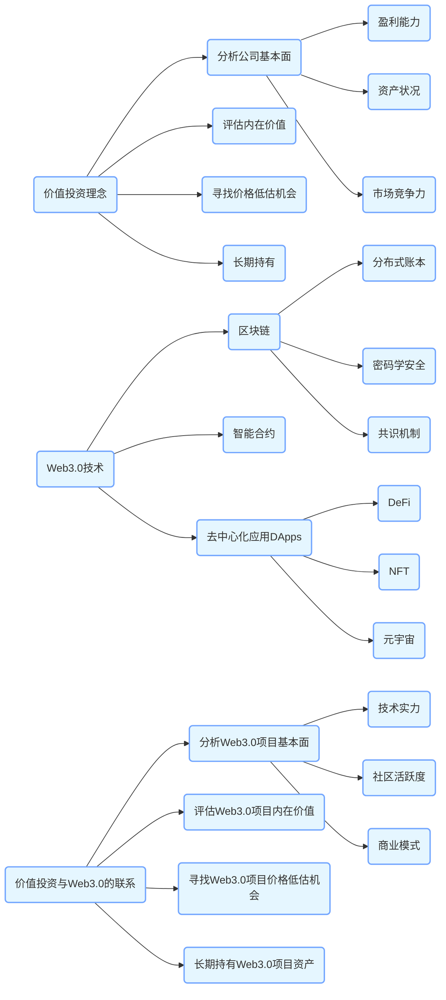

# 巴菲特的价值投资在Web3.0时代的新解读

> 关键词：巴菲特、价值投资、Web3.0时代、新解读、投资策略

> 摘要：本文旨在对巴菲特的价值投资理念在Web3.0时代进行全新解读。首先介绍了研究的背景、目的、预期读者、文档结构及相关术语。接着阐述了价值投资与Web3.0的核心概念及两者的联系，通过文本示意图和Mermaid流程图展示其架构。详细讲解了价值投资的核心算法原理，用Python代码说明，并给出数学模型和公式进行举例。在项目实战部分，以Web3.0项目为例搭建开发环境，实现源代码并解读。分析了价值投资在Web3.0时代的实际应用场景，推荐了学习、开发工具及相关论文著作。最后总结了未来发展趋势与挑战，解答常见问题并提供扩展阅读和参考资料，为投资者在Web3.0时代运用价值投资理念提供全面的指导。

## 1. 背景介绍 
### 1.1 目的和范围
在当今快速发展的科技时代，Web3.0正逐渐崭露头角，它代表着互联网的下一代演进，带来了全新的技术和商业模式。而巴菲特的价值投资理念，作为投资领域的经典理论，在传统金融市场取得了巨大的成功。本研究的目的在于探讨如何将巴菲特的价值投资理念应用于Web3.0时代的投资环境中，为投资者提供在这个新兴领域进行价值投资的思路和方法。研究范围涵盖了Web3.0的主要技术和应用，如区块链、去中心化金融（DeFi）、非同质化代币（NFT）等，并分析这些领域中价值投资的机会和挑战。

### 1.2 预期读者
本文的预期读者主要包括对投资领域感兴趣的个人投资者，他们希望在Web3.0时代找到新的投资机会，并借助价值投资理念进行决策。同时，也适合金融行业的从业者，如基金经理、分析师等，他们可以通过本文了解如何将传统的价值投资方法应用到新兴的Web3.0市场中。此外，对于从事Web3.0技术研发和项目运营的人员，也可以从价值投资的角度来审视自己的项目，更好地规划发展方向。

### 1.3 文档结构概述
本文将按照以下结构进行阐述：首先介绍相关的核心概念，包括巴菲特的价值投资理念和Web3.0的定义、特点，以及两者之间的联系；接着详细讲解价值投资在Web3.0时代的核心算法原理和具体操作步骤，并用Python代码进行实现；然后给出价值投资的数学模型和公式，并通过具体例子进行说明；在项目实战部分，将以一个Web3.0项目为例，展示如何进行开发环境搭建、源代码实现和代码解读；之后分析价值投资在Web3.0时代的实际应用场景；推荐一些学习、开发工具和相关论文著作；最后总结Web3.0时代价值投资的未来发展趋势与挑战，解答常见问题，并提供扩展阅读和参考资料。

### 1.4 术语表
#### 1.4.1 核心术语定义
- **价值投资**：由本杰明·格雷厄姆提出，经沃伦·巴菲特发展和完善的一种投资策略。其核心思想是通过分析公司的内在价值，在价格低于内在价值时买入股票，并长期持有，以获得投资回报。
- **Web3.0**：是互联网的下一代发展阶段，强调去中心化、用户主权和价值的自由流动。它基于区块链技术，构建了一个更加开放、透明、可信的网络环境，允许用户直接参与和控制自己的数据和资产。
- **区块链**：一种分布式账本技术，通过密码学方法确保数据的不可篡改和透明性。它由一个个区块组成，每个区块包含一定数量的交易信息，并通过哈希值与前一个区块相连，形成一个链式结构。
- **去中心化金融（DeFi）**：基于区块链技术构建的金融系统，旨在去除传统金融中介，实现金融服务的去中心化。它包括借贷、交易、保险等多种金融业务，用户可以通过智能合约直接参与。
- **非同质化代币（NFT）**：一种基于区块链的数字资产，每个代币都具有独特的标识符，代表着独一无二的物品或权益，如艺术品、游戏道具、虚拟土地等。

#### 1.4.2 相关概念解释
- **内在价值**：指公司或资产的真实价值，它基于公司的基本面，如盈利能力、资产状况、市场竞争力等因素进行评估。在价值投资中，投资者通过分析公司的内在价值，来判断其股票价格是否被低估或高估。
- **智能合约**：一种自动执行的合约，其条款和条件以代码的形式存储在区块链上。当满足预设的条件时，智能合约会自动执行相应的操作，无需第三方干预。智能合约是Web3.0和DeFi的重要组成部分，它提高了交易的效率和透明度。
- **共识机制**：区块链网络中用于达成共识的算法，确保所有节点对交易记录的一致性。常见的共识机制包括工作量证明（PoW）、权益证明（PoS）等。不同的共识机制具有不同的特点和适用场景，影响着区块链网络的性能和安全性。

#### 1.4.3 缩略词列表
- **DeFi**：Decentralized Finance（去中心化金融）
- **NFT**：Non-Fungible Token（非同质化代币）
- **PoW**：Proof of Work（工作量证明）
- **PoS**：Proof of Stake（权益证明）

## 2. 核心概念与联系 
### 价值投资核心概念
价值投资的核心是寻找被市场低估的资产，通过深入研究公司的基本面，评估其内在价值，并在价格低于内在价值时买入。巴菲特认为，股票不仅仅是一张纸，而是代表了公司的一部分所有权。投资者应该关注公司的长期发展前景、盈利能力、管理团队等因素，而不是被短期的市场波动所左右。例如，巴菲特长期持有可口可乐的股票，因为他认为可口可乐具有强大的品牌优势、稳定的现金流和广阔的市场前景，其内在价值远远高于当时的市场价格。

### Web3.0核心概念
Web3.0是互联网发展的新阶段，它具有以下几个核心特点：
- **去中心化**：Web3.0基于区块链技术，去除了传统互联网中的中心化机构，如互联网巨头、银行等。用户可以直接在区块链网络上进行交易和互动，数据和资产由用户自己控制。
- **用户主权**：在Web3.0中，用户对自己的数据和资产拥有完全的主权。他们可以自主决定如何使用、分享和交易这些数据和资产，而不需要经过第三方的同意。
- **价值流动**：Web3.0实现了价值的自由流动，通过智能合约和加密货币，用户可以在全球范围内快速、安全地进行价值交换。例如，DeFi应用允许用户进行借贷、交易等金融活动，无需传统金融机构的参与。

### 价值投资与Web3.0的联系
虽然Web3.0是一个新兴的领域，与传统金融市场有很大的不同，但价值投资的理念仍然可以应用于其中。在Web3.0项目中，投资者可以通过分析项目的技术实力、社区活跃度、商业模式等因素，评估其内在价值。例如，一个具有创新技术和强大社区支持的DeFi项目，可能具有较高的内在价值。同时，Web3.0的发展也为价值投资带来了新的机会，如NFT市场的兴起，为投资者提供了投资独特数字资产的可能。

### 文本示意图
```plaintext
价值投资理念
|
|-- 分析公司基本面
|   |-- 盈利能力
|   |-- 资产状况
|   |-- 市场竞争力
|
|-- 评估内在价值
|
|-- 寻找价格低估机会
|
|-- 长期持有

Web3.0技术
|
|-- 区块链
|   |-- 分布式账本
|   |-- 密码学安全
|   |-- 共识机制
|
|-- 智能合约
|
|-- 去中心化应用（DApps）
|   |-- DeFi
|   |-- NFT
|   |-- 元宇宙

价值投资与Web3.0的联系
|
|-- 分析Web3.0项目基本面
|   |-- 技术实力
|   |-- 社区活跃度
|   |-- 商业模式
|
|-- 评估Web3.0项目内在价值
|
|-- 寻找Web3.0项目价格低估机会
|
|-- 长期持有Web3.0项目资产
```

### Mermaid流程图


## 3. 核心算法原理 & 具体操作步骤 
### 核心算法原理
在Web3.0时代应用价值投资理念，核心算法原理仍然是评估项目的内在价值。可以采用现金流折现法（DCF）来计算项目的内在价值。现金流折现法的基本思想是，将项目未来的现金流按照一定的折现率折现到当前时刻，得到项目的现值，即内在价值。

### Python代码实现
```python
def calculate_dcf(cash_flows, discount_rate):
    """
    计算现金流折现价值
    :param cash_flows: 未来各期的现金流列表
    :param discount_rate: 折现率
    :return: 现金流折现价值
    """
    present_value = 0
    for i, cash_flow in enumerate(cash_flows):
        present_value += cash_flow / ((1 + discount_rate) ** (i + 1))
    return present_value

# 示例数据
cash_flows = [100, 120, 150, 180, 200]  # 未来五年的现金流
discount_rate = 0.1  # 折现率为10%

# 计算内在价值
intrinsic_value = calculate_dcf(cash_flows, discount_rate)
print(f"项目的内在价值为: {intrinsic_value}")
```
### 具体操作步骤
1. **确定项目的现金流**：对于Web3.0项目，现金流可以包括项目的收入、利润等。需要对项目的商业模式进行深入分析，预测其未来的现金流情况。例如，对于一个DeFi借贷项目，可以预测其未来的借贷利息收入、手续费收入等。
2. **确定折现率**：折现率反映了资金的时间价值和投资风险。一般来说，折现率可以参考市场的无风险利率加上项目的风险溢价。无风险利率可以选择国债收益率等，风险溢价则需要根据项目的风险程度进行评估。例如，一个新兴的Web3.0项目可能具有较高的风险溢价。
3. **计算内在价值**：使用现金流折现法，将未来的现金流按照折现率折现到当前时刻，得到项目的内在价值。
4. **比较内在价值和市场价格**：如果项目的内在价值高于市场价格，则认为该项目被低估，可以考虑投资；反之，如果内在价值低于市场价格，则认为该项目被高估，应该谨慎投资。

## 4. 数学模型和公式 & 详细讲解 & 举例说明 
### 数学模型和公式
现金流折现法的数学模型可以表示为：

$$
V = \sum_{t=1}^{n} \frac{CF_t}{(1 + r)^t}
$$

其中：
- $V$ 表示项目的内在价值
- $CF_t$ 表示第 $t$ 期的现金流
- $r$ 表示折现率
- $n$ 表示预测的期数

### 详细讲解
该公式的核心思想是将未来各期的现金流按照折现率折现到当前时刻，然后将它们相加，得到项目的现值。折现率 $r$ 反映了资金的时间价值和投资风险，$r$ 越大，未来现金流的现值就越小。预测的期数 $n$ 可以根据项目的实际情况进行确定，一般可以预测未来几年的现金流。

### 举例说明
假设一个Web3.0项目未来三年的现金流分别为 $CF_1 = 200$ 万元，$CF_2 = 300$ 万元，$CF_3 = 400$ 万元，折现率 $r = 0.1$（即10%）。则该项目的内在价值为：

$$
\begin{align*}
V &= \frac{CF_1}{(1 + r)^1} + \frac{CF_2}{(1 + r)^2} + \frac{CF_3}{(1 + r)^3}\\
&= \frac{200}{(1 + 0.1)^1} + \frac{300}{(1 + 0.1)^2} + \frac{400}{(1 + 0.1)^3}\\
&= \frac{200}{1.1} + \frac{300}{1.21} + \frac{400}{1.331}\\
&\approx 181.82 + 247.93 + 300.53\\
&= 730.28 \text{（万元）}
\end{align*}
$$

如果该项目的市场价格低于730.28万元，则可以认为该项目被低估，具有投资价值；反之，如果市场价格高于730.28万元，则需要谨慎考虑。

## 5. 项目实战：代码实际案例和详细解释说明 
### 5.1  开发环境搭建
为了进行Web3.0项目的价值投资分析，我们需要搭建一个开发环境。以下是具体的步骤：
1. **安装Python**：Python是一种广泛使用的编程语言，具有丰富的库和工具。可以从Python官方网站（https://www.python.org/downloads/）下载并安装最新版本的Python。
2. **安装必要的库**：我们需要安装一些Python库来进行数据分析和可视化，如`pandas`、`numpy`、`matplotlib`等。可以使用以下命令进行安装：
```sh
pip install pandas numpy matplotlib
```
3. **获取Web3.0项目数据**：可以通过区块链浏览器、API接口等方式获取Web3.0项目的相关数据，如交易数据、财务数据等。例如，可以使用`web3.py`库来与以太坊区块链进行交互，获取相关数据。

### 5.2  源代码详细实现和代码解读
以下是一个简单的示例代码，用于分析一个Web3.0项目的财务数据，并计算其内在价值：
```python
import pandas as pd
import numpy as np

# 模拟Web3.0项目的财务数据
data = {
    'Year': [1, 2, 3, 4, 5],
    'CashFlow': [100, 120, 150, 180, 200]
}
df = pd.DataFrame(data)

# 折现率
discount_rate = 0.1

# 计算各期现金流的现值
df['PresentValue'] = df['CashFlow'] / ((1 + discount_rate) ** df['Year'])

# 计算项目的内在价值
intrinsic_value = df['PresentValue'].sum()

# 打印结果
print("项目各期现金流及现值：")
print(df)
print(f"项目的内在价值为: {intrinsic_value}")
```
### 代码解读与分析
1. **数据模拟**：使用`pandas`库创建一个DataFrame对象，模拟Web3.0项目未来五年的现金流数据。
2. **折现率设置**：设置折现率为10%，用于计算现金流的现值。
3. **现值计算**：使用公式 $\frac{CF_t}{(1 + r)^t}$ 计算各期现金流的现值，并将结果存储在`PresentValue`列中。
4. **内在价值计算**：将各期现金流的现值相加，得到项目的内在价值。
5. **结果输出**：打印项目各期现金流及现值，以及项目的内在价值。

通过这个示例代码，我们可以清晰地看到如何使用Python进行Web3.0项目的价值投资分析。

## 6. 实际应用场景 
### DeFi领域的价值投资
在DeFi领域，价值投资可以应用于借贷协议、交易平台等项目。例如，对于一个借贷协议，可以分析其抵押物的质量、借贷利率、用户数量等因素，评估其内在价值。如果一个借贷协议具有较高的抵押物质量、合理的借贷利率和大量的用户，那么它可能具有较高的内在价值。投资者可以在该协议的代币价格被低估时买入，并长期持有，等待其价值回归。

### NFT领域的价值投资
在NFT领域，价值投资可以关注具有独特艺术价值、文化价值或稀缺性的NFT作品。例如，一些知名艺术家创作的NFT艺术品，或者具有历史意义的NFT收藏品，可能具有较高的内在价值。投资者可以通过分析NFT作品的创作者声誉、作品的稀有性、市场需求等因素，评估其价值。在NFT市场价格波动时，寻找被低估的作品进行投资。

### 元宇宙领域的价值投资
元宇宙是Web3.0的重要应用场景之一，价值投资可以应用于元宇宙项目的土地、虚拟资产等方面。例如，一个具有良好规划和发展前景的元宇宙项目，其虚拟土地可能具有较高的价值。投资者可以分析元宇宙项目的用户数量、经济系统、发展规划等因素，评估虚拟土地的内在价值。在虚拟土地价格被低估时进行投资，等待元宇宙项目的发展和繁荣。

## 7. 工具和资源推荐
### 7.1 学习资源推荐
#### 7.1.1 书籍推荐
- 《聪明的投资者》：本杰明·格雷厄姆著，是价值投资领域的经典著作，详细阐述了价值投资的基本原理和方法。
- 《巴菲特致股东的信：投资者和公司高管教程》：沃伦·巴菲特著，通过巴菲特致股东的信，展示了他的投资理念和决策过程。
- 《区块链技术指南》：邹均、张海宁等著，全面介绍了区块链的技术原理、应用场景和发展趋势，适合对Web3.0技术感兴趣的读者。

#### 7.1.2 在线课程
- Coursera上的“投资学原理”：由知名大学教授授课，系统介绍了投资学的基本理论和方法。
- Udemy上的“Web3.0开发实战”：提供了Web3.0开发的实战教程，包括区块链编程、智能合约开发等内容。

#### 7.1.3 技术博客和网站
- CoinDesk：是一个专注于加密货币和区块链领域的新闻和分析网站，提供了最新的行业动态和技术文章。
- Medium上的Web3.0相关博客：有许多开发者和研究者分享Web3.0的技术经验和研究成果。

### 7.2 开发工具框架推荐
#### 7.2.1 IDE和编辑器
- Visual Studio Code：是一个功能强大的代码编辑器，支持多种编程语言和插件，适合Web3.0开发。
- Remix：是一个基于浏览器的以太坊智能合约开发环境，提供了代码编辑、编译、部署等功能。

#### 7.2.2 调试和性能分析工具
- Truffle：是一个以太坊开发框架，提供了智能合约的调试、测试和部署工具。
- Ganache：是一个本地以太坊区块链模拟器，用于开发和测试智能合约。

#### 7.2.3 相关框架和库
- Web3.py：是一个Python库，用于与以太坊区块链进行交互，提供了账户管理、合约调用等功能。
- Solidity：是以太坊智能合约的编程语言，用于开发智能合约。

### 7.3 相关论文著作推荐
#### 7.3.1 经典论文
- “Bitcoin: A Peer-to-Peer Electronic Cash System”：中本聪著，是比特币的白皮书，介绍了比特币的基本原理和技术架构。
- “Ethereum: A Next-Generation Smart Contract and Decentralized Application Platform”：Vitalik Buterin著，是以太坊的白皮书，阐述了以太坊的智能合约和去中心化应用平台的概念。

#### 7.3.2 最新研究成果
- 可以关注IEEE、ACM等学术会议和期刊上发表的关于Web3.0和价值投资的研究论文，了解最新的研究动态和技术进展。

#### 7.3.3 应用案例分析
- 一些知名的投资机构和研究机构会发布Web3.0项目的投资分析报告和应用案例，可以参考这些资料，学习如何在Web3.0时代进行价值投资。

## 8. 总结：未来发展趋势与挑战
### 未来发展趋势
- **融合发展**：Web3.0技术将与更多的传统行业进行融合，创造出更多的应用场景和商业机会。价值投资也将在这些新兴领域中发挥重要作用，投资者可以通过挖掘具有潜力的项目，获得丰厚的回报。
- **机构参与增加**：随着Web3.0市场的不断发展和成熟，越来越多的机构投资者将进入这个领域。机构投资者的参与将带来更多的资金和专业的投资理念，推动Web3.0市场的健康发展。
- **技术创新加速**：Web3.0技术将不断创新和发展，如区块链的性能提升、智能合约的安全性增强等。这些技术创新将为价值投资带来更多的机会和挑战，投资者需要不断学习和更新知识，以适应市场的变化。

### 挑战
- **技术风险**：Web3.0技术仍处于发展阶段，存在技术漏洞、安全隐患等问题。例如，智能合约可能存在代码漏洞，导致资金损失。投资者需要对项目的技术实力和安全性进行深入评估，降低技术风险。
- **监管不确定性**：Web3.0市场的监管政策尚不完善，不同国家和地区的监管态度也存在差异。监管的不确定性可能会影响项目的发展和投资者的信心。投资者需要密切关注监管动态，遵守相关法律法规。
- **市场波动**：Web3.0市场具有较高的波动性，价格波动较大。投资者需要具备较强的风险承受能力和投资经验，避免盲目跟风投资。

## 9. 附录：常见问题与解答
### 问题1：价值投资在Web3.0时代是否仍然适用？
答：价值投资的核心思想是寻找被低估的资产并长期持有，这一理念在Web3.0时代仍然适用。虽然Web3.0市场具有一些独特的特点，如技术更新快、市场波动大等，但通过深入分析项目的基本面和内在价值，投资者仍然可以找到具有投资价值的项目。

### 问题2：如何评估Web3.0项目的内在价值？
答：可以采用现金流折现法、市场比较法等方法来评估Web3.0项目的内在价值。在评估过程中，需要考虑项目的技术实力、社区活跃度、商业模式、市场竞争力等因素。同时，还需要对项目的未来发展进行合理的预测。

### 问题3：Web3.0投资有哪些风险？
答：Web3.0投资存在技术风险、监管风险、市场波动风险等。技术风险包括智能合约漏洞、区块链性能问题等；监管风险是指监管政策的不确定性可能影响项目的发展；市场波动风险是指Web3.0市场价格波动较大，投资者可能面临资金损失。

### 问题4：如何降低Web3.0投资的风险？
答：可以通过分散投资、深入研究项目、关注监管动态等方式降低Web3.0投资的风险。分散投资可以降低单一项目的风险；深入研究项目可以了解项目的基本面和内在价值，避免盲目投资；关注监管动态可以及时了解政策变化，调整投资策略。

## 10. 扩展阅读 & 参考资料
### 扩展阅读
- 《数字资产投资实战》：介绍了数字资产投资的方法和策略，包括比特币、以太坊等加密货币，以及NFT、DeFi等新兴领域的投资。
- 《元宇宙通证》：探讨了元宇宙的经济系统和通证机制，对于理解元宇宙领域的价值投资有一定的帮助。

### 参考资料
- 相关的区块链技术文档和白皮书，如比特币、以太坊等项目的白皮书。
- 财经媒体和研究机构发布的关于Web3.0和价值投资的研究报告和分析文章。

作者：AI天才研究院/AI Genius Institute & 禅与计算机程序设计艺术 /Zen And The Art of Computer Programming