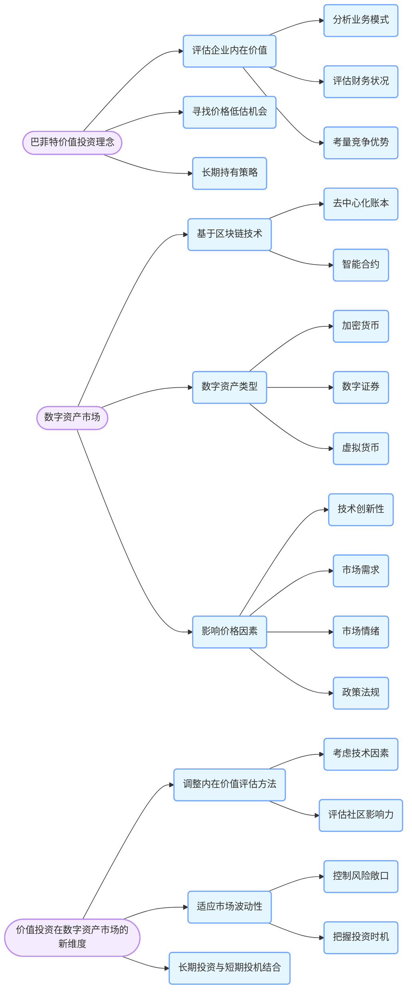

# 巴菲特的价值投资在数字资产市场中的新维度

> 关键词：巴菲特价值投资、数字资产市场、新维度、投资策略、风险评估

> 摘要：本文旨在探讨巴菲特的价值投资理念在数字资产市场中的新维度。通过对价值投资核心概念的阐述，分析其与数字资产市场的联系，深入讲解核心算法原理和数学模型，结合实际案例展示如何在数字资产市场中应用价值投资策略。同时，介绍相关的工具和资源，探讨未来发展趋势与挑战，并对常见问题进行解答，为投资者在数字资产市场运用价值投资提供全面的指导。

## 1. 背景介绍 
### 1.1 目的和范围
本文章的目的是研究巴菲特的价值投资理念如何在数字资产市场中得到新的应用和拓展。数字资产市场作为新兴的金融领域，具有高度的波动性和创新性，与传统金融市场有很大的不同。我们将探讨价值投资的核心原则在这个新市场环境下的适应性和局限性，以及如何调整和优化投资策略以实现更好的投资回报。范围涵盖了数字资产的主要类型，如加密货币、数字证券等，以及价值投资在这些资产上的具体应用方法。

### 1.2 预期读者
本文预期读者包括对数字资产投资感兴趣的个人投资者、金融从业者、投资研究人员以及对价值投资理念在新兴市场应用有探索需求的人群。无论是新手投资者希望了解如何在数字资产市场中运用价值投资，还是专业人士寻求新的投资思路和方法，都能从本文中获得有价值的信息。

### 1.3 文档结构概述
本文将按照以下结构进行阐述：首先介绍核心概念，明确巴菲特价值投资和数字资产市场的基本定义和联系；接着讲解核心算法原理和具体操作步骤，通过 Python 代码详细说明；然后给出数学模型和公式，并进行详细讲解和举例；之后通过项目实战展示代码实际案例和详细解释；再介绍数字资产市场中价值投资的实际应用场景；推荐相关的工具和资源；最后总结未来发展趋势与挑战，解答常见问题并提供扩展阅读和参考资料。

### 1.4 术语表
#### 1.4.1 核心术语定义
- **巴菲特价值投资**：由股神沃伦·巴菲特所倡导的投资理念，强调通过分析公司的内在价值，以低于其内在价值的价格买入股票，并长期持有，忽略短期市场波动。其核心是寻找具有持续竞争优势和稳定现金流的企业。
- **数字资产**：以电子数据形式存在的资产，包括但不限于加密货币（如比特币、以太坊等）、数字证券（代表对现实世界资产或权益的数字化凭证）、虚拟货币（如游戏内货币等）等。这些资产基于区块链等技术，具有去中心化、可追溯等特点。
- **内在价值**：资产本身所具有的真实价值，对于企业来说，通常通过对其未来现金流的折现来计算；在数字资产领域，内在价值的评估更为复杂，可能涉及技术创新性、市场需求、社区活跃度等多个因素。

#### 1.4.2 相关概念解释
- **区块链技术**：一种分布式账本技术，通过去中心化的方式记录交易信息，具有不可篡改、公开透明等特点。数字资产大多基于区块链技术发行和交易，确保了资产的安全性和可追溯性。
- **市场情绪**：投资者对市场的整体看法和预期，会影响资产的价格波动。在数字资产市场中，市场情绪的影响更为显著，因为市场参与者相对年轻，更容易受到社交媒体、新闻报道等因素的影响。
- **风险溢价**：投资者为承担额外风险而要求的额外回报。在数字资产市场中，由于其高度的波动性和不确定性，风险溢价通常较高。

#### 1.4.3 缩略词列表
- **BTC**：比特币（Bitcoin），是最早且最知名的加密货币。
- **ETH**：以太坊（Ethereum），一种开源的有智能合约功能的公共区块链平台，其代币为以太币。
- **ICO**：首次代币发行（Initial Coin Offering），是一种融资方式，项目方通过发行代币来筹集资金。

## 2. 核心概念与联系 
### 核心概念原理
#### 巴菲特价值投资原理
巴菲特价值投资的核心原理基于对企业内在价值的评估。他认为，股票不仅仅是一张可以买卖的凭证，而是代表了对企业的部分所有权。投资者应该关注企业的基本面，包括其业务模式、财务状况、竞争优势等，通过分析这些因素来估算企业的内在价值。如果股票价格低于其内在价值，那么就存在投资机会。例如，一家具有稳定现金流、强大品牌和持续创新能力的企业，其内在价值可能会随着时间的推移而不断增长。投资者在价格低估时买入，并长期持有，等待市场发现其价值，从而获得资本增值和股息收益。

#### 数字资产市场原理
数字资产市场是基于区块链技术的新兴金融市场。数字资产的价值主要来源于其技术创新性、市场需求、社区活跃度等因素。例如，加密货币的价值可能受到其共识机制、安全性、交易速度等技术指标的影响；数字证券的价值则与所代表的现实资产或权益相关。市场的供需关系决定了数字资产的价格，而市场情绪、政策法规等因素也会对价格产生重大影响。

### 架构的文本示意图
```plaintext
巴菲特价值投资理念
|-- 评估企业内在价值
|   |-- 分析业务模式
|   |-- 评估财务状况
|   |-- 考量竞争优势
|-- 寻找价格低估机会
|-- 长期持有策略

数字资产市场
|-- 基于区块链技术
|   |-- 去中心化账本
|   |-- 智能合约
|-- 数字资产类型
|   |-- 加密货币
|   |-- 数字证券
|   |-- 虚拟货币
|-- 影响价格因素
|   |-- 技术创新性
|   |-- 市场需求
|   |-- 市场情绪
|   |-- 政策法规

价值投资在数字资产市场的新维度
|-- 调整内在价值评估方法
|   |-- 考虑技术因素
|   |-- 评估社区影响力
|-- 适应市场波动性
|   |-- 控制风险敞口
|   |-- 把握投资时机
|-- 长期投资与短期投机结合
```

### Mermaid 流程图


## 3. 核心算法原理 & 具体操作步骤 
### 核心算法原理
在数字资产市场应用价值投资理念，核心算法原理主要围绕对数字资产内在价值的评估和价格比较。由于数字资产的特点与传统企业不同，评估内在价值的方法也需要进行调整。一种常见的方法是基于现金流折现模型（DCF）的变种，考虑数字资产的未来收益潜力、技术发展前景等因素。

### Python 代码详细阐述
```python
import numpy as np

def calculate_digital_asset_intrinsic_value(future_cash_flows, discount_rate):
    """
    计算数字资产的内在价值
    :param future_cash_flows: 未来各期的现金流列表
    :param discount_rate: 折现率
    :return: 数字资产的内在价值
    """
    present_values = []
    for i, cash_flow in enumerate(future_cash_flows):
        present_value = cash_flow / ((1 + discount_rate) ** (i + 1))
        present_values.append(present_value)
    intrinsic_value = sum(present_values)
    return intrinsic_value

# 示例数据
future_cash_flows = [100, 200, 300, 400, 500]  # 假设未来 5 年的现金流
discount_rate = 0.1  # 折现率为 10%

# 计算内在价值
intrinsic_value = calculate_digital_asset_intrinsic_value(future_cash_flows, discount_rate)
print(f"数字资产的内在价值为: {intrinsic_value}")

def decide_investment(intrinsic_value, market_price):
    """
    根据内在价值和市场价格决定是否投资
    :param intrinsic_value: 数字资产的内在价值
    :param market_price: 数字资产的市场价格
    :return: 是否投资的决策
    """
    if intrinsic_value > market_price:
        return True
    else:
        return False

# 假设市场价格为 1000
market_price = 1000
investment_decision = decide_investment(intrinsic_value, market_price)
if investment_decision:
    print("根据价值投资理念，建议投资该数字资产。")
else:
    print("根据价值投资理念，不建议投资该数字资产。")
```

### 具体操作步骤
1. **数据收集**：收集数字资产的相关信息，包括其技术白皮书、社区活跃度、市场份额、未来发展规划等。对于有现金流的数字资产，还需要收集未来各期的现金流预测数据。
2. **确定折现率**：折现率反映了投资者对风险的偏好和预期回报。在数字资产市场中，由于其高风险性，折现率通常较高。可以参考市场上类似风险资产的回报率来确定折现率。
3. **计算内在价值**：使用上述 Python 代码中的 `calculate_digital_asset_intrinsic_value` 函数，将未来现金流和折现率作为输入，计算数字资产的内在价值。
4. **比较内在价值和市场价格**：获取数字资产的当前市场价格，使用 `decide_investment` 函数比较内在价值和市场价格。如果内在价值大于市场价格，则认为该数字资产被低估，具有投资价值；反之，则不建议投资。

## 4. 数学模型和公式 & 详细讲解 & 举例说明 
### 数学模型和公式
#### 现金流折现模型（DCF）
现金流折现模型是价值投资中常用的评估企业内在价值的方法，在数字资产市场中也可以进行一定的应用。其基本公式为：
$$
V = \sum_{t=1}^{n} \frac{CF_t}{(1 + r)^t}
$$
其中，$V$ 表示资产的内在价值，$CF_t$ 表示第 $t$ 期的现金流，$r$ 表示折现率，$n$ 表示现金流的期数。

#### 详细讲解
- **现金流（$CF_t$）**：对于数字资产，现金流的定义可能与传统企业不同。例如，一些数字资产可能通过收取交易手续费、提供增值服务等方式产生现金流。在预测未来现金流时，需要考虑数字资产的市场需求、竞争状况、技术发展等因素。
- **折现率（$r$）**：折现率反映了投资者对资金时间价值和风险的考虑。在数字资产市场中，由于市场波动性较大，风险较高，折现率通常也较高。折现率的确定可以参考市场上类似风险资产的回报率，或者使用资本资产定价模型（CAPM）等方法进行计算。
- **期数（$n$）**：期数表示预测现金流的时间范围。在数字资产市场中，由于技术发展迅速，市场变化较快，期数的选择需要谨慎。一般来说，可以根据数字资产的发展阶段和市场预期来确定期数。

### 举例说明
假设我们要评估一个加密货币项目的内在价值。根据项目的白皮书和市场分析，预测该加密货币在未来 5 年的现金流分别为 100 万美元、200 万美元、300 万美元、400 万美元和 500 万美元。由于加密货币市场的高风险性，我们确定折现率为 20%。

使用现金流折现模型计算内在价值：
$$
\begin{align*}
V &= \frac{100}{(1 + 0.2)^1} + \frac{200}{(1 + 0.2)^2} + \frac{300}{(1 + 0.2)^3} + \frac{400}{(1 + 0.2)^4} + \frac{500}{(1 + 0.2)^5}\\
&= \frac{100}{1.2} + \frac{200}{1.44} + \frac{300}{1.728} + \frac{400}{2.0736} + \frac{500}{2.48832}\\
&\approx 83.33 + 138.89 + 173.61 + 192.90 + 201.09\\
&= 789.82 \text{（万美元）}
\end{align*}
$$

如果该加密货币的当前市场总市值为 600 万美元，由于内在价值大于市场价格，根据价值投资理念，该加密货币可能被低估，具有投资价值。

## 5. 项目实战：代码实际案例和详细解释说明 
### 5.1 开发环境搭建
#### 安装 Python
首先需要安装 Python 编程语言。可以从 Python 官方网站（https://www.python.org/downloads/）下载适合你操作系统的 Python 安装包，并按照安装向导进行安装。建议安装 Python 3.7 及以上版本。

#### 安装必要的库
在本项目中，我们主要使用了 Python 的基本库，如 `numpy`。可以使用以下命令来安装 `numpy`：
```sh
pip install numpy
```

### 5.2 源代码详细实现和代码解读
```python
import numpy as np

def calculate_digital_asset_intrinsic_value(future_cash_flows, discount_rate):
    """
    计算数字资产的内在价值
    :param future_cash_flows: 未来各期的现金流列表
    :param discount_rate: 折现率
    :return: 数字资产的内在价值
    """
    present_values = []
    for i, cash_flow in enumerate(future_cash_flows):
        present_value = cash_flow / ((1 + discount_rate) ** (i + 1))
        present_values.append(present_value)
    intrinsic_value = sum(present_values)
    return intrinsic_value

def decide_investment(intrinsic_value, market_price):
    """
    根据内在价值和市场价格决定是否投资
    :param intrinsic_value: 数字资产的内在价值
    :param market_price: 数字资产的市场价格
    :return: 是否投资的决策
    """
    if intrinsic_value > market_price:
        return True
    else:
        return False

# 示例数据
future_cash_flows = [100, 200, 300, 400, 500]  # 假设未来 5 年的现金流
discount_rate = 0.1  # 折现率为 10%

# 计算内在价值
intrinsic_value = calculate_digital_asset_intrinsic_value(future_cash_flows, discount_rate)
print(f"数字资产的内在价值为: {intrinsic_value}")

# 假设市场价格为 1000
market_price = 1000
investment_decision = decide_investment(intrinsic_value, market_price)
if investment_decision:
    print("根据价值投资理念，建议投资该数字资产。")
else:
    print("根据价值投资理念，不建议投资该数字资产。")
```

#### 代码解读
1. **`calculate_digital_asset_intrinsic_value` 函数**：该函数接受两个参数，`future_cash_flows` 是一个列表，表示数字资产未来各期的现金流；`discount_rate` 是折现率。函数内部使用一个循环遍历未来现金流列表，将每一期的现金流折现到当前时刻，并将折现后的现值添加到 `present_values` 列表中。最后，将所有现值相加得到数字资产的内在价值。
2. **`decide_investment` 函数**：该函数接受两个参数，`intrinsic_value` 是数字资产的内在价值，`market_price` 是数字资产的市场价格。函数通过比较内在价值和市场价格的大小，返回一个布尔值，表示是否建议投资该数字资产。
3. **主程序**：定义了示例数据，包括未来 5 年的现金流和折现率。调用 `calculate_digital_asset_intrinsic_value` 函数计算数字资产的内在价值，并打印结果。然后假设市场价格为 1000，调用 `decide_investment` 函数进行投资决策，并打印决策结果。

### 5.3 代码解读与分析
#### 优点
- **简单易懂**：代码结构清晰，逻辑简单，易于理解和修改。对于初学者来说，很容易掌握代码的核心思想。
- **可扩展性**：代码中的函数可以根据实际需求进行扩展。例如，可以添加更多的参数来考虑不同的因素，或者修改函数的实现方式来使用更复杂的模型。
- **实用性**：代码实现了价值投资中最基本的内在价值评估和投资决策功能，可以为投资者提供一定的参考。

#### 局限性
- **数据准确性**：代码的结果依赖于输入的未来现金流和折现率的准确性。在实际应用中，准确预测未来现金流是非常困难的，折现率的选择也存在一定的主观性。
- **模型简化**：代码使用的现金流折现模型是一种简化的模型，没有考虑到数字资产市场的复杂性和不确定性。例如，没有考虑到技术发展、市场竞争、政策法规等因素对数字资产价值的影响。

## 6. 实际应用场景 
### 加密货币投资
在加密货币市场中，价值投资理念可以帮助投资者筛选出具有长期投资价值的项目。例如，投资者可以通过分析加密货币的技术创新性、社区活跃度、应用场景等因素，评估其内在价值。如果某个加密货币的市场价格低于其内在价值，且项目具有良好的发展前景，那么投资者可以考虑长期持有该加密货币。同时，投资者还可以根据市场波动情况，适时调整投资组合，降低风险。

### 数字证券投资
数字证券代表了对现实世界资产或权益的数字化凭证，如股票、债券、房地产等。在数字证券市场中，价值投资的应用与传统证券市场类似。投资者可以通过分析发行数字证券的企业或项目的基本面，如财务状况、业务模式、竞争优势等，评估其内在价值。与传统证券相比，数字证券具有交易效率高、流动性强等优势，更适合价值投资者进行长期投资。

### 区块链项目投资
对于区块链项目的投资，价值投资理念同样适用。投资者可以关注项目的技术实力、团队背景、市场需求等因素，评估项目的内在价值。一些具有创新性和实用性的区块链项目，如分布式存储、供应链金融、去中心化身份验证等，可能具有较高的投资价值。投资者可以在项目早期阶段进行投资，等待项目发展成熟后获得丰厚的回报。

## 7. 工具和资源推荐
### 7.1 学习资源推荐
#### 7.1.1 书籍推荐
- 《聪明的投资者》（The Intelligent Investor）：作者是本杰明·格雷厄姆（Benjamin Graham），被誉为价值投资的圣经。这本书系统地阐述了价值投资的理论和方法，对巴菲特等投资大师产生了深远的影响。
- 《巴菲特致股东的信：投资者和公司高管教程》（Letters to Shareholders of Berkshire Hathaway）：这本书收录了巴菲特历年致股东的信，通过这些信件，读者可以深入了解巴菲特的投资理念、决策过程和对市场的看法。
- 《区块链：从数字货币到信用社会》：作者是长铗等，这本书全面介绍了区块链技术的原理、应用和发展趋势，对于了解数字资产市场的底层技术有很大的帮助。

#### 7.1.2 在线课程
- Coursera 上的“投资学原理”（Principles of Investment）：该课程由知名高校的教授授课，系统地介绍了投资学的基本原理和方法，包括价值投资、资产定价等内容。
- Udemy 上的“区块链技术入门”（Blockchain Basics）：课程适合初学者，通过视频教程和实际案例，帮助学员快速了解区块链技术的基本概念和应用场景。
- edX 上的“加密货币和区块链技术”（Cryptocurrency and Blockchain Technology）：该课程深入探讨了加密货币和区块链技术的原理、发展和挑战，对于想深入了解数字资产市场的学员有很大的帮助。

#### 7.1.3 技术博客和网站
- CoinDesk：是一家专注于区块链和加密货币的新闻媒体网站，提供最新的行业动态、市场分析和技术解读。
- Medium 上的区块链相关博客：Medium 上有很多区块链领域的专家和从业者分享他们的观点和经验，读者可以从中获取有价值的信息。
- 巴比特：是国内知名的区块链资讯平台，提供区块链技术、数字资产、行业应用等方面的资讯和分析。

### 7.2 开发工具框架推荐
#### 7.2.1 IDE和编辑器
- PyCharm：是一款专业的 Python 集成开发环境（IDE），具有代码编辑、调试、版本控制等功能，适合 Python 开发者使用。
- Visual Studio Code：是一款轻量级的代码编辑器，支持多种编程语言，具有丰富的插件和扩展功能，可以满足不同开发者的需求。
- Jupyter Notebook：是一个交互式的开发环境，适合进行数据分析和模型开发。它以笔记本的形式展示代码和结果，方便用户进行实验和分享。

#### 7.2.2 调试和性能分析工具
- pdb：是 Python 自带的调试工具，可以帮助开发者在代码执行过程中进行调试，查看变量的值和程序的执行流程。
- cProfile：是 Python 的性能分析工具，可以分析代码的执行时间和函数调用次数，帮助开发者找出代码中的性能瓶颈。
- Py-Spy：是一个轻量级的 Python 性能分析工具，可以在不修改代码的情况下对 Python 程序进行性能分析，实时显示函数的执行时间和调用次数。

#### 7.2.3 相关框架和库
- NumPy：是 Python 的一个基础科学计算库，提供了高效的多维数组对象和各种数学函数，用于数值计算和数据分析。
- Pandas：是 Python 的一个数据分析库，提供了数据结构和数据处理工具，方便用户进行数据清洗、分析和可视化。
- Matplotlib：是 Python 的一个绘图库，用于创建各种类型的图表和可视化效果，帮助用户更好地理解数据。

### 7.3 相关论文著作推荐
#### 7.3.1 经典论文
- 《有效市场假说》（Efficient Market Hypothesis）：由尤金·法玛（Eugene F. Fama）提出，该理论认为市场价格已经反映了所有可用的信息，投资者无法通过分析历史数据或其他信息来获得超额回报。这篇论文对价值投资理论产生了重要的影响。
- 《资本资产定价模型》（Capital Asset Pricing Model，CAPM）：由威廉·夏普（William F. Sharpe）等人提出，该模型描述了资产的预期回报率与市场风险之间的关系，为投资者进行资产定价和风险评估提供了重要的理论基础。
- 《区块链技术的经济影响》（The Economic Impact of Blockchain Technology）：这篇论文探讨了区块链技术对经济和金融领域的影响，分析了区块链技术在降低交易成本、提高效率、增强信任等方面的优势。

#### 7.3.2 最新研究成果
- 《数字资产的定价模型和风险评估》：该研究成果提出了一种新的数字资产定价模型，考虑了数字资产的技术创新性、市场需求、社区活跃度等因素，为数字资产的价值评估提供了新的方法。
- 《区块链技术在供应链金融中的应用研究》：这篇论文研究了区块链技术在供应链金融中的应用场景和优势，通过实际案例分析了区块链技术如何提高供应链金融的效率和安全性。
- 《加密货币市场的波动性和风险管理》：该研究成果分析了加密货币市场的波动性特征和影响因素，提出了一些风险管理策略，帮助投资者降低加密货币投资的风险。

#### 7.3.3 应用案例分析
- 《比特币的投资价值分析》：该案例分析了比特币的技术特点、市场需求和价格走势，评估了比特币的投资价值，并提出了一些投资建议。
- 《以太坊在去中心化应用开发中的应用案例》：这篇案例分析介绍了以太坊在去中心化应用开发中的应用场景和优势，通过实际案例展示了以太坊如何为开发者提供一个高效、安全的开发平台。
- 《数字证券在房地产投资中的应用案例》：该案例分析了数字证券在房地产投资中的应用模式和优势，通过实际案例展示了数字证券如何提高房地产投资的流动性和透明度。

## 8. 总结：未来发展趋势与挑战
### 未来发展趋势
#### 价值投资理念的进一步融合
随着数字资产市场的不断发展和成熟，巴菲特的价值投资理念将与数字资产市场更加深度地融合。投资者将更加注重数字资产的内在价值评估，而不仅仅是关注市场价格的波动。同时，价值投资的长期投资策略也将在数字资产市场中得到更广泛的应用。

#### 技术创新推动价值评估方法的改进
区块链技术、人工智能、大数据等技术的不断创新将为数字资产的价值评估提供更加科学、准确的方法。例如，通过人工智能算法可以对数字资产的市场数据、技术指标、社区舆情等进行分析，提高价值评估的准确性和效率。

#### 监管政策的完善促进市场健康发展
随着数字资产市场的规模不断扩大，监管政策将逐渐完善。合理的监管政策将有助于规范市场秩序，保护投资者的合法权益，促进数字资产市场的健康发展。这也将为价值投资在数字资产市场中的应用提供更加稳定的市场环境。

### 挑战
#### 数字资产的复杂性增加价值评估难度
数字资产具有高度的创新性和复杂性，其技术原理、应用场景、市场需求等因素都在不断变化。这使得准确评估数字资产的内在价值变得非常困难，需要投资者具备更加专业的知识和技能。

#### 市场波动性和不确定性增加投资风险
数字资产市场的波动性较大，价格容易受到市场情绪、政策法规、技术创新等因素的影响。这种波动性和不确定性增加了价值投资的风险，投资者需要更加谨慎地选择投资标的和把握投资时机。

#### 监管政策的不确定性
目前，全球各国对数字资产的监管政策还存在较大的差异和不确定性。一些国家对数字资产采取了严格的监管措施，而另一些国家则持开放态度。监管政策的不确定性可能会对数字资产市场的发展和价值投资的应用产生不利影响。

## 9. 附录：常见问题与解答
### 问题 1：价值投资在数字资产市场中是否适用？
解答：价值投资在数字资产市场中是适用的，但需要进行一定的调整和优化。由于数字资产市场的特点与传统金融市场不同，如高波动性、技术创新性强等，评估数字资产的内在价值需要考虑更多的因素，如技术发展前景、社区活跃度等。同时，投资者需要更加谨慎地选择投资标的和把握投资时机。

### 问题 2：如何评估数字资产的内在价值？
解答：评估数字资产的内在价值可以采用多种方法，如现金流折现模型、相对估值法等。在使用现金流折现模型时，需要预测数字资产未来的现金流，并选择合适的折现率进行折现。同时，还需要考虑数字资产的技术创新性、市场需求、竞争状况等因素。相对估值法是通过比较类似数字资产的市场价格来评估目标数字资产的价值。

### 问题 3：数字资产市场的波动性对价值投资有什么影响？
解答：数字资产市场的波动性较大，这增加了价值投资的风险。一方面，价格的大幅波动可能导致投资者在短期内面临较大的损失；另一方面，市场的不确定性也增加了评估数字资产内在价值的难度。然而，波动性也为价值投资者提供了机会。当市场价格大幅下跌时，一些具有内在价值的数字资产可能会被低估，投资者可以在此时买入，等待市场价格回归内在价值。

### 问题 4：如何控制数字资产投资的风险？
解答：控制数字资产投资的风险可以采取以下措施：
- **分散投资**：不要将所有资金集中投资于一种数字资产，而是分散投资于多种不同类型的数字资产，降低单一资产的风险。
- **设置止损点**：在投资前设定一个止损点，当数字资产的价格下跌到一定程度时，及时卖出，避免损失进一步扩大。
- **深入研究**：在投资前对数字资产进行深入的研究，了解其技术原理、市场需求、竞争状况等因素，选择具有内在价值和发展前景的数字资产进行投资。
- **长期投资**：采用价值投资的长期投资策略，忽略短期市场波动，等待数字资产的价值逐渐显现。

## 10. 扩展阅读 & 参考资料
### 扩展阅读
- 《金融市场与金融机构》：这本书系统地介绍了金融市场和金融机构的基本概念、运作机制和发展趋势，对于了解数字资产市场的宏观环境有很大的帮助。
- 《创新者的窘境》：作者是克莱顿·克里斯坦森（Clayton M. Christensen），这本书探讨了创新对企业和市场的影响，对于理解数字资产市场的技术创新和竞争格局有一定的启示。
- 《非理性繁荣》：作者是罗伯特·席勒（Robert J. Shiller），这本书分析了金融市场中的非理性行为和泡沫现象，对于投资者在数字资产市场中保持理性有一定的借鉴作用。

### 参考资料
- 沃伦·巴菲特历年致股东的信：可以从伯克希尔·哈撒韦公司的官方网站（https://www.berkshirehathaway.com/letters/letters.html）获取。
- 区块链技术相关标准和规范：可以参考国际标准化组织（ISO）、电气和电子工程师协会（IEEE）等组织发布的相关标准。
- 数字资产市场的统计数据和研究报告：可以从 CoinMarketCap、Messari 等专业数据平台获取。

作者：AI天才研究院/AI Genius Institute & 禅与计算机程序设计艺术 /Zen And The Art of Computer Programming