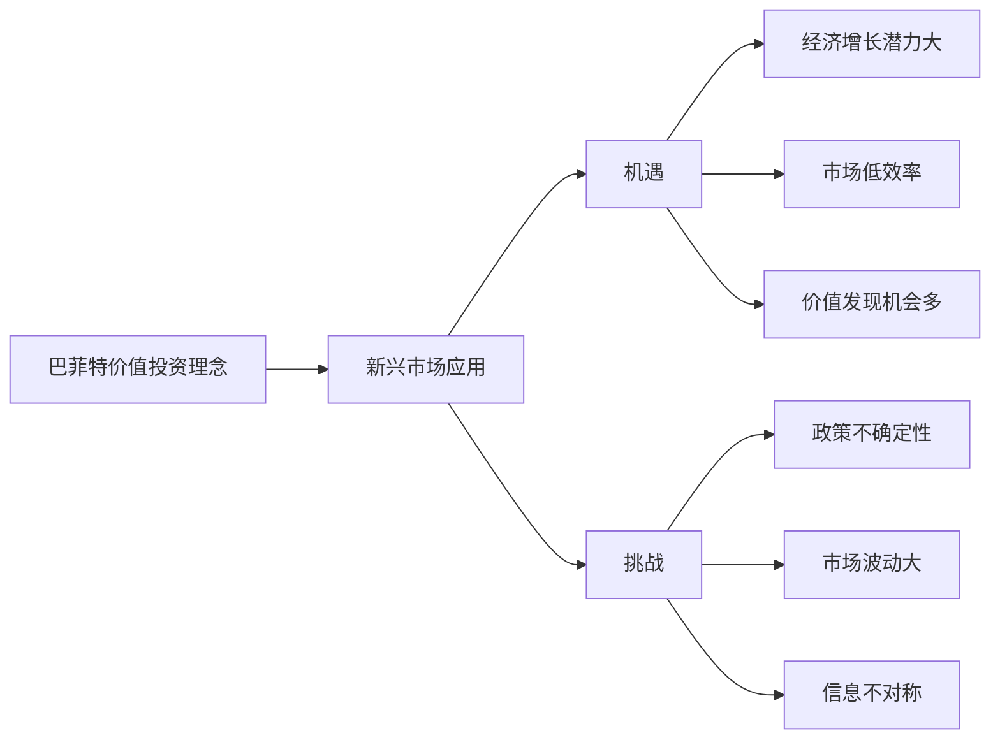

# 巴菲特的价值投资在新兴市场的应用：机遇与挑战

> 关键词：巴菲特价值投资、新兴市场、投资机遇、投资挑战、长期投资

> 摘要：本文深入探讨了巴菲特的价值投资理念在新兴市场的应用情况。首先介绍了价值投资的基本概念和新兴市场的特点，接着分析了在新兴市场应用价值投资所面临的机遇，如经济快速增长带来的企业高成长潜力、市场低效率下的价值发现机会等。同时，也阐述了可能遇到的挑战，包括市场波动大、信息不对称、政策不稳定等问题。通过具体案例和理论分析相结合，为投资者在新兴市场运用价值投资策略提供了全面的参考，并对未来的发展趋势和应对挑战的方法进行了探讨。

## 1. 背景介绍 
### 1.1 目的和范围
本文旨在全面分析巴菲特的价值投资理念在新兴市场的应用情况，探讨其中存在的机遇与挑战。我们将聚焦于新兴市场的经济、政治、社会等多方面因素对价值投资的影响，分析在这些市场中如何识别具有投资价值的企业，以及在实践价值投资策略时可能遇到的困难和解决方案。研究范围涵盖了全球主要的新兴市场，包括亚洲、非洲、拉丁美洲等地区的国家和地区的金融市场。

### 1.2 预期读者
本文的预期读者包括专业的投资者、金融分析师、投资机构从业者以及对价值投资和新兴市场感兴趣的个人投资者。对于那些希望在新兴市场寻找投资机会，学习和应用巴菲特价值投资理念的读者，本文将提供有价值的参考和指导。

### 1.3 文档结构概述
本文将按照以下结构进行阐述：首先介绍核心概念，包括巴菲特的价值投资理念和新兴市场的定义与特点；接着分析核心算法原理（虽然价值投资并非严格意义上的算法，但会阐述其投资决策的逻辑和步骤）；然后介绍相关的数学模型和公式，用于评估企业的价值；通过实际案例展示价值投资在新兴市场的应用；分析新兴市场中价值投资的实际应用场景；推荐相关的工具和资源；最后总结未来发展趋势与挑战，并解答常见问题，提供扩展阅读和参考资料。

### 1.4 术语表
#### 1.4.1 核心术语定义
- **价值投资**：是一种通过对企业内在价值的评估，寻找被市场低估的股票，并长期持有的投资策略。其核心思想是购买价格低于其内在价值的资产，以获得长期的资本增值。
- **新兴市场**：指的是发展中国家或地区的金融市场，这些市场通常具有较高的经济增长率、快速的工业化进程和不断完善的金融体系，但同时也面临着较高的风险和不确定性。
- **内在价值**：企业的内在价值是指企业未来现金流的现值，它反映了企业的真实经济价值，不受市场短期波动的影响。

#### 1.4.2 相关概念解释
- **安全边际**：是价值投资中的一个重要概念，指的是股票的市场价格与内在价值之间的差距。安全边际越大，投资的风险越低。
- **护城河**：巴菲特提出的概念，指的是企业所拥有的可持续竞争优势，如品牌优势、技术优势、成本优势等，这些优势能够保护企业在市场竞争中获得长期的利润。

#### 1.4.3 缩略词列表
- **PE**：市盈率（Price-to-Earnings Ratio），是指股票价格与每股收益的比率，用于衡量股票的估值水平。
- **PB**：市净率（Price-to-Book Ratio），是指股票价格与每股净资产的比率，反映了市场对企业净资产的估值。

## 2. 核心概念与联系 

### 2.1 巴菲特的价值投资理念
巴菲特的价值投资理念源于本杰明·格雷厄姆（Benjamin Graham）的思想，并在实践中不断发展和完善。其核心要点包括：
- **注重企业内在价值**：通过对企业的财务状况、商业模式、竞争优势等进行深入分析，评估企业的内在价值。
- **寻找安全边际**：只在股票价格低于其内在价值时买入，以降低投资风险。
- **长期投资**：相信优秀的企业会在长期内实现价值增长，因此坚持长期持有股票。
- **关注企业的护城河**：选择具有可持续竞争优势的企业进行投资，以确保企业在未来能够持续获得利润。

### 2.2 新兴市场的特点
新兴市场具有以下特点：
- **经济增长潜力大**：新兴市场国家通常处于经济快速发展阶段，具有较高的GDP增长率和消费市场潜力。
- **市场低效率**：由于信息传播不充分、投资者结构不合理等原因，新兴市场的股票价格可能更容易偏离其内在价值，为价值投资者提供了更多的价值发现机会。
- **政策不确定性**：新兴市场国家的政策环境相对不稳定，政策的变化可能对企业的经营和市场表现产生较大影响。
- **市场波动大**：新兴市场的股票市场通常具有较高的波动性，投资者需要具备较强的风险承受能力。

### 2.3 价值投资与新兴市场的联系
价值投资理念在新兴市场具有一定的适用性和独特的机遇。新兴市场的经济快速增长为企业的发展提供了良好的环境，可能孕育出具有高成长潜力的企业。同时，市场的低效率使得价值投资者有机会发现被低估的股票。然而，新兴市场的政策不确定性和市场波动大等特点也给价值投资带来了挑战，投资者需要更加谨慎地评估企业的内在价值和风险。

### 2.4 文本示意图
```plaintext
              巴菲特价值投资理念
                    |
                    | 注重内在价值、安全边际、长期投资、护城河
                    |
            ----------------------
            |                    |
      新兴市场机遇            新兴市场挑战
      | 经济增长潜力大         | 政策不确定性
      | 市场低效率             | 市场波动大
      | 价值发现机会多         | 信息不对称
```

### 2.5 Mermaid 流程图


## 3. 核心算法原理 & 具体操作步骤 

### 3.1 核心算法原理
价值投资的核心算法原理可以概括为以下几个步骤：
1. **企业内在价值评估**：通过对企业的财务报表、行业前景、竞争优势等进行分析，预测企业未来的现金流，并将其折现到当前，得到企业的内在价值。
2. **安全边际计算**：计算股票的市场价格与内在价值之间的差距，确定安全边际。安全边际越大，投资的风险越低。
3. **投资决策**：当股票的市场价格低于其内在价值，且安全边际达到一定程度时，做出买入决策；当股票的市场价格高于其内在价值时，考虑卖出或持有。

### 3.2 具体操作步骤
#### 步骤 1：筛选投资标的
- **行业分析**：选择具有良好发展前景的行业，如新兴市场中的消费、科技、医疗等行业。
- **企业筛选**：在选定的行业中，筛选出具有竞争优势、财务状况良好的企业。可以通过财务指标（如市盈率、市净率、净资产收益率等）和非财务指标（如品牌知名度、技术实力等）进行初步筛选。

#### 步骤 2：企业内在价值评估
以下是一个简单的使用Python代码实现的企业内在价值评估示例：
```python
import numpy as np

def calculate_intrinsic_value(free_cash_flow, growth_rate, discount_rate, years):
    """
    计算企业的内在价值
    :param free_cash_flow: 初始自由现金流
    :param growth_rate: 现金流增长率
    :param discount_rate: 折现率
    :param years: 预测年限
    :return: 企业的内在价值
    """
    cash_flows = []
    for i in range(years):
        if i == 0:
            cash_flows.append(free_cash_flow)
        else:
            cash_flows.append(cash_flows[i - 1] * (1 + growth_rate))
    
    discounted_cash_flows = []
    for i in range(years):
        discounted_cash_flows.append(cash_flows[i] / ((1 + discount_rate) ** i))
    
    intrinsic_value = sum(discounted_cash_flows)
    return intrinsic_value

# 示例参数
free_cash_flow = 100  # 初始自由现金流
growth_rate = 0.1  # 现金流增长率
discount_rate = 0.15  # 折现率
years = 10  # 预测年限

intrinsic_value = calculate_intrinsic_value(free_cash_flow, growth_rate, discount_rate, years)
print(f"企业的内在价值为: {intrinsic_value}")
```

#### 步骤 3：安全边际计算
安全边际可以通过以下公式计算：
```python
market_price = 80  # 假设股票的市场价格
safety_margin = (intrinsic_value - market_price) / intrinsic_value
print(f"安全边际为: {safety_margin * 100:.2f}%")
```

#### 步骤 4：投资决策
如果安全边际大于设定的阈值（如20%），则可以考虑买入该股票；如果安全边际小于0，则说明股票价格高于内在价值，需要谨慎考虑。

## 4. 数学模型和公式 & 详细讲解 & 举例说明 

### 4.1 企业内在价值评估模型
企业内在价值评估常用的模型是现金流折现模型（Discounted Cash Flow, DCF）。该模型的基本思想是将企业未来的现金流折现到当前，得到企业的内在价值。

#### 公式
$$V = \sum_{t=1}^{n} \frac{FCF_t}{(1 + r)^t} + \frac{TV}{(1 + r)^n}$$
其中：
- $V$ 表示企业的内在价值
- $FCF_t$ 表示第 $t$ 年的自由现金流
- $r$ 表示折现率
- $n$ 表示预测年限
- $TV$ 表示终值，通常采用永续增长模型计算：
$$TV = \frac{FCF_{n+1}}{r - g}$$
其中：
- $FCF_{n+1}$ 表示第 $n+1$ 年的自由现金流
- $g$ 表示永续增长率

### 4.2 详细讲解
- **自由现金流（FCF）**：是指企业在满足了所有运营和资本支出后剩余的现金流量，它反映了企业实际可用于分配给股东或进行再投资的现金。
- **折现率（r）**：是投资者要求的最低回报率，通常根据市场利率、企业风险等因素确定。折现率越高，未来现金流的现值越低。
- **预测年限（n）**：一般根据企业的发展阶段和行业特点确定，通常为5 - 10年。
- **永续增长率（g）**：是指企业在预测期结束后，预计将保持的长期增长率。永续增长率通常小于折现率。

### 4.3 举例说明
假设某企业的初始自由现金流为 $100$ 万元，预计未来10年的现金流增长率为 $10\%$，折现率为 $15\%$，永续增长率为 $3\%$。

#### 步骤 1：计算预测期内的现金流
```python
import numpy as np

free_cash_flow = 100
growth_rate = 0.1
discount_rate = 0.15
years = 10
g = 0.03

cash_flows = []
for i in range(years):
    if i == 0:
        cash_flows.append(free_cash_flow)
    else:
        cash_flows.append(cash_flows[i - 1] * (1 + growth_rate))

print("预测期内的现金流:")
for i, cf in enumerate(cash_flows):
    print(f"第 {i+1} 年: {cf:.2f} 万元")
```

#### 步骤 2：计算预测期内现金流的现值
```python
discounted_cash_flows = []
for i in range(years):
    discounted_cash_flows.append(cash_flows[i] / ((1 + discount_rate) ** i))

pv_forecast_period = sum(discounted_cash_flows)
print(f"预测期内现金流的现值: {pv_forecast_period:.2f} 万元")
```

#### 步骤 3：计算终值
```python
fcft1 = cash_flows[-1] * (1 + g)
tv = fcft1 / (discount_rate - g)
pv_tv = tv / ((1 + discount_rate) ** years)
print(f"终值的现值: {pv_tv:.2f} 万元")
```

#### 步骤 4：计算企业的内在价值
```python
intrinsic_value = pv_forecast_period + pv_tv
print(f"企业的内在价值: {intrinsic_value:.2f} 万元")
```

## 5. 项目实战：代码实际案例和详细解释说明 

### 5.1  开发环境搭建
#### 安装Python
首先，需要安装Python开发环境。可以从Python官方网站（https://www.python.org/downloads/）下载适合自己操作系统的Python版本，并按照安装向导进行安装。

#### 安装必要的库
在进行价值投资分析时，需要使用一些Python库，如`pandas`、`numpy`等。可以使用以下命令进行安装：
```sh
pip install pandas numpy
```

### 5.2  源代码详细实现和代码解读
以下是一个完整的价值投资分析代码示例，用于评估一家企业的内在价值并进行投资决策：
```python
import pandas as pd
import numpy as np

def calculate_free_cash_flow(ebit, tax_rate, depreciation, capital_expenditure, change_in_working_capital):
    """
    计算自由现金流
    :param ebit: 息税前利润
    :param tax_rate: 税率
    :param depreciation: 折旧
    :param capital_expenditure: 资本支出
    :param change_in_working_capital: 营运资金变动
    :return: 自由现金流
    """
    net_income = ebit * (1 - tax_rate)
    free_cash_flow = net_income + depreciation - capital_expenditure - change_in_working_capital
    return free_cash_flow

def calculate_intrinsic_value(free_cash_flow, growth_rate, discount_rate, years, g):
    """
    计算企业的内在价值
    :param free_cash_flow: 初始自由现金流
    :param growth_rate: 现金流增长率
    :param discount_rate: 折现率
    :param years: 预测年限
    :param g: 永续增长率
    :return: 企业的内在价值
    """
    cash_flows = []
    for i in range(years):
        if i == 0:
            cash_flows.append(free_cash_flow)
        else:
            cash_flows.append(cash_flows[i - 1] * (1 + growth_rate))
    
    discounted_cash_flows = []
    for i in range(years):
        discounted_cash_flows.append(cash_flows[i] / ((1 + discount_rate) ** i))
    
    fcft1 = cash_flows[-1] * (1 + g)
    tv = fcft1 / (discount_rate - g)
    pv_tv = tv / ((1 + discount_rate) ** years)
    
    intrinsic_value = sum(discounted_cash_flows) + pv_tv
    return intrinsic_value

def investment_decision(intrinsic_value, market_price, safety_margin_threshold):
    """
    投资决策
    :param intrinsic_value: 企业的内在价值
    :param market_price: 股票的市场价格
    :param safety_margin_threshold: 安全边际阈值
    :return: 投资决策结果
    """
    safety_margin = (intrinsic_value - market_price) / intrinsic_value
    if safety_margin > safety_margin_threshold:
        return "买入"
    else:
        return "不买入"

# 示例数据
ebit = 200  # 息税前利润
tax_rate = 0.25  # 税率
depreciation = 50  # 折旧
capital_expenditure = 30  # 资本支出
change_in_working_capital = 20  # 营运资金变动
growth_rate = 0.1  # 现金流增长率
discount_rate = 0.15  # 折现率
years = 10  # 预测年限
g = 0.03  # 永续增长率
market_price = 1500  # 股票的市场价格
safety_margin_threshold = 0.2  # 安全边际阈值

# 计算自由现金流
free_cash_flow = calculate_free_cash_flow(ebit, tax_rate, depreciation, capital_expenditure, change_in_working_capital)
print(f"自由现金流: {free_cash_flow:.2f} 万元")

# 计算企业的内在价值
intrinsic_value = calculate_intrinsic_value(free_cash_flow, growth_rate, discount_rate, years, g)
print(f"企业的内在价值: {intrinsic_value:.2f} 万元")

# 进行投资决策
decision = investment_decision(intrinsic_value, market_price, safety_margin_threshold)
print(f"投资决策结果: {decision}")
```

### 5.3  代码解读与分析
- **calculate_free_cash_flow函数**：该函数用于计算企业的自由现金流，通过息税前利润、税率、折旧、资本支出和营运资金变动等参数进行计算。
- **calculate_intrinsic_value函数**：该函数实现了现金流折现模型，用于计算企业的内在价值。首先预测未来 $n$ 年的现金流，然后将其折现到当前，最后计算终值并折现到当前，将预测期内现金流的现值和终值的现值相加得到企业的内在价值。
- **investment_decision函数**：该函数根据企业的内在价值和股票的市场价格计算安全边际，并根据安全边际阈值做出投资决策。
- **主程序**：通过设置示例数据，调用上述函数计算自由现金流、企业的内在价值，并进行投资决策。

## 6. 实际应用场景 
### 6.1 新兴市场消费行业投资
在新兴市场，随着经济的发展和居民收入水平的提高，消费行业具有巨大的发展潜力。价值投资者可以通过分析消费企业的品牌优势、市场份额、财务状况等因素，评估其内在价值。例如，在印度市场，一些本土的消费品公司受益于庞大的人口基数和消费升级趋势，具有较高的成长潜力。投资者可以通过价值投资策略，寻找被市场低估的消费企业进行投资。

### 6.2 新兴市场科技行业投资
新兴市场的科技行业也在迅速发展，一些国家和地区在互联网、人工智能、新能源等领域取得了显著的进展。价值投资者可以关注那些具有核心技术、创新能力和良好商业模式的科技企业。例如，在东南亚市场，一些电商和金融科技公司在当地市场具有较高的竞争力，通过价值投资可以挖掘这些企业的投资价值。

### 6.3 新兴市场基础设施建设投资
新兴市场国家通常需要大量的基础设施建设来支持经济的发展，如交通、能源、通信等领域。价值投资者可以关注那些参与基础设施建设项目的企业，评估其项目盈利能力和长期发展前景。例如，在非洲市场，一些中国企业参与了当地的基础设施建设项目，这些企业的股票可能具有一定的投资价值。

## 7. 工具和资源推荐
### 7.1 学习资源推荐
#### 7.1.1 书籍推荐
- 《聪明的投资者》（The Intelligent Investor）：本杰明·格雷厄姆的经典著作，是价值投资的奠基之作。
- 《巴菲特致股东的信》（Letters to Shareholders of Berkshire Hathaway）：收录了巴菲特历年致股东的信，从中可以学习到巴菲特的投资理念和方法。
- 《穷查理宝典》（Poor Charlie's Almanack）：介绍了查理·芒格的投资思想和多元思维模型。

#### 7.1.2 在线课程
- Coursera上的“投资学原理”（Principles of Investing）：由知名教授授课，涵盖了投资的基本理论和方法。
- edX上的“价值投资基础”（Fundamentals of Value Investing）：系统介绍了价值投资的理念和实践。

#### 7.1.3 技术博客和网站
- 雪球网：国内知名的投资社区，提供了丰富的股票分析和投资讨论内容。
- Seeking Alpha：国外的投资研究网站，有大量的投资分析文章和专家观点。

### 7.2 开发工具框架推荐
#### 7.2.1 IDE和编辑器
- PyCharm：功能强大的Python集成开发环境，适合进行数据分析和投资策略开发。
- Jupyter Notebook：交互式的开发环境，方便进行数据可视化和代码演示。

#### 7.2.2 调试和性能分析工具
- pdb：Python自带的调试工具，用于调试Python代码。
- cProfile：Python的性能分析工具，用于分析代码的运行时间和性能瓶颈。

#### 7.2.3 相关框架和库
- pandas：用于数据处理和分析的Python库，提供了丰富的数据结构和数据分析工具。
- numpy：用于科学计算的Python库，提供了高效的数组操作和数学函数。

### 7.3 相关论文著作推荐
#### 7.3.1 经典论文
- 《证券分析》（Security Analysis）：本杰明·格雷厄姆和戴维·多德的经典论文，奠定了价值投资的理论基础。
- 《有效市场假说》（Efficient Markets Hypothesis）：探讨了市场效率与投资策略的关系。

#### 7.3.2 最新研究成果
- 关注顶尖金融学术期刊，如《Journal of Finance》、《Review of Financial Studies》等，了解价值投资在新兴市场的最新研究成果。

#### 7.3.3 应用案例分析
- 阅读一些知名投资机构的研究报告和案例分析，了解他们在新兴市场应用价值投资策略的实践经验。

## 8. 总结：未来发展趋势与挑战
### 8.1 未来发展趋势
- **新兴市场的重要性日益凸显**：随着全球经济格局的变化，新兴市场在全球经济中的地位将不断提高，为价值投资提供了更广阔的空间。
- **科技与价值投资的融合**：科技的发展将为价值投资带来新的机遇，如利用大数据和人工智能技术进行企业价值评估和投资决策。
- **可持续投资的兴起**：投资者越来越关注企业的社会责任和可持续发展，价值投资将更加注重企业的环境、社会和治理（ESG）因素。

### 8.2 挑战
- **市场波动和不确定性**：新兴市场的市场波动较大，政策和经济环境的不确定性增加了价值投资的难度。
- **信息不对称**：新兴市场的信息披露和透明度相对较低，投资者可能面临信息不对称的问题，影响对企业内在价值的评估。
- **竞争加剧**：随着越来越多的投资者关注新兴市场，价值投资的竞争将加剧，寻找被低估的股票将变得更加困难。

### 8.3 应对策略
- **加强风险管理**：通过分散投资、设置止损点等方式降低投资风险。
- **深入研究和分析**：加强对新兴市场的研究和分析，提高对企业内在价值的评估能力。
- **关注长期价值**：坚持价值投资的理念，关注企业的长期发展潜力，避免被短期市场波动所影响。

## 9. 附录：常见问题与解答
### 问题1：价值投资在新兴市场是否适用？
答：价值投资在新兴市场具有一定的适用性。新兴市场的经济增长潜力大、市场低效率等特点为价值投资提供了机遇。然而，新兴市场也面临着政策不确定性、市场波动大等挑战，投资者需要更加谨慎地评估企业的内在价值和风险。

### 问题2：如何评估新兴市场企业的内在价值？
答：可以使用现金流折现模型等方法评估新兴市场企业的内在价值。在评估过程中，需要考虑新兴市场的特点，如经济增长率、通货膨胀率、政策环境等因素对企业未来现金流和折现率的影响。

### 问题3：价值投资在新兴市场的投资周期一般是多长？
答：价值投资强调长期投资，在新兴市场也不例外。由于新兴市场的发展需要一定的时间，企业的价值实现也需要一个过程，因此价值投资在新兴市场的投资周期通常较长，一般为3 - 5年甚至更长。

### 问题4：如何应对新兴市场的政策不确定性？
答：可以通过分散投资、关注政策导向、加强对政策的研究和分析等方式应对新兴市场的政策不确定性。同时，选择具有较强抗风险能力和适应政策变化能力的企业进行投资。

## 10. 扩展阅读 & 参考资料
### 扩展阅读
- 《投资中最简单的事》：邱国鹭著，介绍了价值投资的简单方法和实践经验。
- 《股市真规则》（The Little Book That Builds Wealth）：帕特·多尔西著，提供了分析企业竞争优势和内在价值的方法。

### 参考资料
- 巴菲特历年致股东的信：https://www.berkshirehathaway.com/letters/letters.html
- 世界银行新兴市场数据：https://data.worldbank.org/
- 国际货币基金组织新兴市场报告：https://www.imf.org/

作者：AI天才研究院/AI Genius Institute & 禅与计算机程序设计艺术 /Zen And The Art of Computer Programming