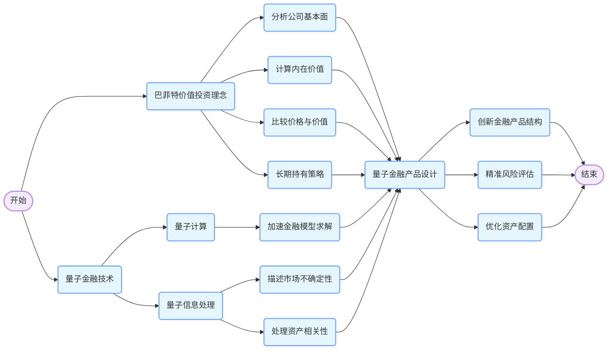

# 巴菲特的价值投资在量子金融产品设计中的新维度

> 关键词：巴菲特价值投资、量子金融产品、新维度、金融设计、投资策略

> 摘要：本文旨在探讨巴菲特的价值投资理念在量子金融产品设计中所展现出的新维度。通过深入分析价值投资的核心概念，结合量子金融产品的特点，阐述如何将两者融合以创造出更具创新性和有效性的金融产品。文章详细介绍了相关的核心算法原理、数学模型，并通过实际项目案例进行说明，同时探讨了其实际应用场景、推荐了相关工具和资源，最后对未来发展趋势与挑战进行了总结。

## 1. 背景介绍 
### 1.1 目的和范围
本研究的目的是探索巴菲特价值投资理念与量子金融产品设计相结合的可能性和优势，为金融领域的创新发展提供新的思路和方法。研究范围涵盖了价值投资的基本原理、量子金融产品的特点和设计要素，以及两者融合的具体方式和应用场景。

### 1.2 预期读者
本文预期读者包括金融从业者、投资分析师、金融科技开发者、学术研究人员以及对金融创新和投资策略感兴趣的人士。

### 1.3 文档结构概述
本文将首先介绍相关的背景知识，包括价值投资和量子金融的基本概念。接着阐述核心概念与联系，通过文本示意图和 Mermaid 流程图进行说明。然后详细讲解核心算法原理和具体操作步骤，给出 Python 源代码示例。随后介绍数学模型和公式，并举例说明。再通过项目实战案例展示具体的代码实现和解读。之后探讨实际应用场景，推荐相关的工具和资源。最后总结未来发展趋势与挑战，提供常见问题解答和扩展阅读参考资料。

### 1.4 术语表
#### 1.4.1 核心术语定义
- **巴菲特价值投资**：由股神沃伦·巴菲特所倡导的投资理念，强调通过分析公司的内在价值，以合理价格买入并长期持有具有竞争优势和稳定现金流的股票。
- **量子金融**：结合量子力学原理和金融理论的新兴领域，利用量子计算和量子信息处理技术来解决金融领域的复杂问题，如风险评估、资产定价等。
- **量子金融产品**：基于量子金融理论和技术设计的金融产品，旨在利用量子特性提供更高效、更精准的金融服务。

#### 1.4.2 相关概念解释
- **内在价值**：指公司未来现金流的现值，是价值投资中评估股票是否值得投资的重要指标。
- **量子叠加**：量子力学中的概念，指一个量子系统可以同时处于多个状态的叠加态，在量子金融中可用于表示多种可能的市场状态。
- **量子纠缠**：两个或多个量子系统之间存在的一种特殊关联，即使它们相隔很远，一个系统的状态变化也会瞬间影响另一个系统的状态，在金融领域可用于描述资产之间的复杂相关性。

#### 1.4.3 缩略词列表
- **QFS**：Quantum Financial System（量子金融系统）
- **PV**：Present Value（现值）
- **DCF**：Discounted Cash Flow（现金流折现法）

## 2. 核心概念与联系 
### 核心概念原理
#### 巴菲特价值投资原理
巴菲特价值投资的核心在于寻找被市场低估的具有长期竞争优势的公司。其基本步骤包括：
1. **分析公司基本面**：评估公司的商业模式、管理层能力、财务状况等，确定公司的竞争优势和可持续性。
2. **计算内在价值**：使用现金流折现法（DCF）等方法估算公司的内在价值。
3. **比较价格与价值**：当股票价格低于其内在价值时，认为该股票具有投资价值，进行买入操作。
4. **长期持有**：相信优秀公司的价值会随着时间的推移不断增长，因此长期持有股票。

#### 量子金融原理
量子金融利用量子力学的原理和方法来处理金融问题。量子计算的强大计算能力可以加速复杂的金融模型求解，如风险评估、资产定价等。量子信息处理技术可以更准确地描述金融市场的不确定性和复杂性，例如利用量子叠加和纠缠来表示多种市场状态和资产之间的相关性。

### 架构的文本示意图
```plaintext
巴菲特价值投资理念
|
|-- 分析公司基本面
|   |-- 商业模式评估
|   |-- 管理层能力评估
|   |-- 财务状况分析
|
|-- 计算内在价值
|   |-- 现金流折现法（DCF）
|   |-- 其他估值方法
|
|-- 比较价格与价值
|   |-- 确定投资机会
|
|-- 长期持有策略

量子金融技术
|
|-- 量子计算
|   |-- 加速金融模型求解
|
|-- 量子信息处理
|   |-- 描述市场不确定性
|   |-- 处理资产相关性

巴菲特价值投资与量子金融融合
|
|-- 量子金融产品设计
|   |-- 创新金融产品结构
|   |-- 精准风险评估
|   |-- 优化资产配置
```

### Mermaid 流程图


## 3. 核心算法原理 & 具体操作步骤 
### 核心算法原理
#### 现金流折现法（DCF）
现金流折现法是巴菲特价值投资中常用的计算公司内在价值的方法。其基本思想是将公司未来的现金流按照一定的折现率折现到当前时刻，得到公司的内在价值。

假设公司未来 $n$ 年的自由现金流分别为 $FCF_1, FCF_2, \cdots, FCF_n$，折现率为 $r$，则公司的内在价值 $V$ 可以表示为：

$$V = \sum_{i=1}^{n} \frac{FCF_i}{(1 + r)^i} + \frac{TV}{(1 + r)^n}$$

其中，$TV$ 为公司的终值，通常可以使用永续增长模型计算：

$$TV = \frac{FCF_n(1 + g)}{r - g}$$

其中，$g$ 为公司的永续增长率。

#### 量子蒙特卡罗模拟
量子蒙特卡罗模拟是量子金融中常用的一种方法，用于处理金融市场的不确定性和复杂的资产定价问题。它利用量子计算的并行性来加速蒙特卡罗模拟的过程，提高计算效率。

### 具体操作步骤
#### 步骤 1：数据收集
收集公司的财务报表、市场数据等相关信息，用于分析公司的基本面和计算现金流。

#### 步骤 2：现金流预测
根据公司的历史数据和行业趋势，预测公司未来 $n$ 年的自由现金流。

#### 步骤 3：折现率确定
根据市场情况和公司的风险水平，确定合适的折现率 $r$。

#### 步骤 4：内在价值计算
使用现金流折现法计算公司的内在价值 $V$。

#### 步骤 5：量子蒙特卡罗模拟
利用量子蒙特卡罗模拟对市场的不确定性进行建模，评估投资组合的风险和收益。

#### 步骤 6：投资决策
比较股票价格与内在价值，结合量子蒙特卡罗模拟的结果，做出投资决策。

### Python 源代码示例
```python
import numpy as np

def dcf_valuation(fcf, r, g, n):
    """
    现金流折现法计算公司内在价值
    :param fcf: 未来n年的自由现金流列表
    :param r: 折现率
    :param g: 永续增长率
    :param n: 预测年限
    :return: 公司内在价值
    """
    pv_fcf = 0
    for i in range(n):
        pv_fcf += fcf[i] / ((1 + r) ** (i + 1))
    
    # 计算终值
    fcf_n = fcf[-1]
    tv = fcf_n * (1 + g) / (r - g)
    pv_tv = tv / ((1 + r) ** n)
    
    # 计算内在价值
    value = pv_fcf + pv_tv
    return value

# 示例数据
fcf = [100, 120, 140, 160, 180]
r = 0.1
g = 0.03
n = len(fcf)

# 计算内在价值
value = dcf_valuation(fcf, r, g, n)
print(f"公司内在价值: {value}")
```

## 4. 数学模型和公式 & 详细讲解 & 举例说明 
### 现金流折现法（DCF）公式
$$V = \sum_{i=1}^{n} \frac{FCF_i}{(1 + r)^i} + \frac{TV}{(1 + r)^n}$$

### 详细讲解
- **$\sum_{i=1}^{n} \frac{FCF_i}{(1 + r)^i}$**：这部分表示公司未来 $n$ 年自由现金流的现值之和。其中，$FCF_i$ 是第 $i$ 年的自由现金流，$r$ 是折现率，$(1 + r)^i$ 是折现因子，用于将未来的现金流折现到当前时刻。
- **$\frac{TV}{(1 + r)^n}$**：这部分表示公司终值的现值。终值 $TV$ 是假设公司在 $n$ 年后进入稳定增长阶段的价值，使用永续增长模型计算。

### 举例说明
假设一家公司未来 5 年的自由现金流分别为 100 万元、120 万元、140 万元、160 万元和 180 万元，折现率为 10%，永续增长率为 3%。

首先，计算未来 5 年自由现金流的现值：

$$PV_{FCF} = \frac{100}{(1 + 0.1)^1} + \frac{120}{(1 + 0.1)^2} + \frac{140}{(1 + 0.1)^3} + \frac{160}{(1 + 0.1)^4} + \frac{180}{(1 + 0.1)^5}$$

$$PV_{FCF} \approx 90.91 + 99.17 + 105.18 + 109.28 + 111.74 = 516.28$$（万元）

然后，计算终值：

$$TV = \frac{180 \times (1 + 0.03)}{0.1 - 0.03} = \frac{185.4}{0.07} \approx 2648.57$$（万元）

最后，计算终值的现值：

$$PV_{TV} = \frac{2648.57}{(1 + 0.1)^5} \approx 1644.74$$（万元）

公司的内在价值为：

$$V = PV_{FCF} + PV_{TV} = 516.28 + 1644.74 = 2161.02$$（万元）

### 量子蒙特卡罗模拟公式
量子蒙特卡罗模拟的核心是通过量子计算生成大量的随机样本，用于估计金融变量的期望值。假设我们要估计一个金融变量 $X$ 的期望值 $E(X)$，可以通过以下公式：

$$E(X) \approx \frac{1}{N} \sum_{i=1}^{N} X_i$$

其中，$N$ 是样本数量，$X_i$ 是第 $i$ 个样本的值。

### 详细讲解
量子蒙特卡罗模拟利用量子计算的并行性来快速生成大量的随机样本，从而提高估计的准确性和效率。在金融领域，$X$ 可以表示资产价格、投资组合的收益等。

### 举例说明
假设我们要估计一个股票投资组合在未来一年的预期收益率。我们可以使用量子蒙特卡罗模拟生成 1000 个随机样本，每个样本表示该投资组合在未来一年的收益率。

```python
# 量子蒙特卡罗模拟示例
np.random.seed(0)
N = 1000
returns = np.random.normal(0.1, 0.2, N)  # 假设收益率服从正态分布，均值为0.1，标准差为0.2

# 计算预期收益率
expected_return = np.mean(returns)
print(f"预期收益率: {expected_return}")
```

## 5. 项目实战：代码实际案例和详细解释说明 
### 5.1  开发环境搭建
#### 安装 Python
首先，需要安装 Python 环境。可以从 Python 官方网站（https://www.python.org/downloads/）下载适合你操作系统的 Python 版本，并按照安装向导进行安装。

#### 安装必要的库
在项目中，我们需要使用一些 Python 库，如 NumPy、Pandas 等。可以使用以下命令进行安装：

```sh
pip install numpy pandas
```

### 5.2  源代码详细实现和代码解读
```python
import numpy as np
import pandas as pd

def dcf_valuation(fcf, r, g, n):
    """
    现金流折现法计算公司内在价值
    :param fcf: 未来n年的自由现金流列表
    :param r: 折现率
    :param g: 永续增长率
    :param n: 预测年限
    :return: 公司内在价值
    """
    pv_fcf = 0
    for i in range(n):
        pv_fcf += fcf[i] / ((1 + r) ** (i + 1))
    
    # 计算终值
    fcf_n = fcf[-1]
    tv = fcf_n * (1 + g) / (r - g)
    pv_tv = tv / ((1 + r) ** n)
    
    # 计算内在价值
    value = pv_fcf + pv_tv
    return value

def quantum_monte_carlo_sim(mean, std, N):
    """
    量子蒙特卡罗模拟
    :param mean: 收益率均值
    :param std: 收益率标准差
    :param N: 样本数量
    :return: 模拟的收益率样本
    """
    np.random.seed(0)
    returns = np.random.normal(mean, std, N)
    return returns

# 示例数据
fcf = [100, 120, 140, 160, 180]
r = 0.1
g = 0.03
n = len(fcf)

# 计算内在价值
value = dcf_valuation(fcf, r, g, n)
print(f"公司内在价值: {value}")

# 量子蒙特卡罗模拟
mean_return = 0.1
std_return = 0.2
N = 1000
returns = quantum_monte_carlo_sim(mean_return, std_return, N)
expected_return = np.mean(returns)
print(f"预期收益率: {expected_return}")

# 创建数据框
data = {'Year': range(1, n + 1), 'FCF': fcf}
df = pd.DataFrame(data)
print(df)
```

### 代码解读与分析
#### `dcf_valuation` 函数
该函数实现了现金流折现法计算公司内在价值的功能。首先，通过循环计算未来 $n$ 年自由现金流的现值之和。然后，计算终值并将其折现到当前时刻。最后，将两者相加得到公司的内在价值。

#### `quantum_monte_carlo_sim` 函数
该函数实现了量子蒙特卡罗模拟的功能。使用 `np.random.normal` 函数生成服从正态分布的随机收益率样本，用于估计投资组合的预期收益率。

#### 主程序
在主程序中，我们首先定义了示例数据，包括未来 5 年的自由现金流、折现率、永续增长率等。然后调用 `dcf_valuation` 函数计算公司的内在价值，并打印结果。接着调用 `quantum_monte_carlo_sim` 函数进行量子蒙特卡罗模拟，计算预期收益率并打印结果。最后，使用 Pandas 库创建一个数据框，将未来 5 年的自由现金流数据进行展示。

## 6. 实际应用场景 
### 金融产品设计
将巴菲特的价值投资理念与量子金融技术相结合，可以设计出更具创新性和竞争力的金融产品。例如，开发基于量子计算的价值投资基金，利用量子蒙特卡罗模拟进行风险评估和资产配置，提高基金的收益和稳定性。

### 风险管理
量子金融技术可以更准确地描述金融市场的不确定性和资产之间的相关性，结合价值投资的基本面分析，可以帮助投资者更好地识别和管理风险。例如，在投资组合管理中，利用量子计算优化投资组合的配置，降低风险。

### 资产定价
现金流折现法是价值投资中常用的资产定价方法，量子计算可以加速该方法的计算过程，提高资产定价的效率和准确性。同时，量子信息处理技术可以考虑更多的市场因素和不确定性，使资产定价更加合理。

### 投资决策支持
通过量子金融产品设计和分析，为投资者提供更全面、准确的投资决策支持。例如，开发投资决策辅助系统，结合价值投资的分析结果和量子蒙特卡罗模拟的风险评估，为投资者提供个性化的投资建议。

## 7. 工具和资源推荐
### 7.1 学习资源推荐
#### 7.1.1 书籍推荐
- 《巴菲特致股东的信：投资者和公司高管教程》：深入了解巴菲特的投资理念和方法。
- 《量子金融：从理论到实践》：系统介绍量子金融的基本原理和应用。
- 《金融数学》：学习金融领域的数学模型和方法。

#### 7.1.2 在线课程
- Coursera 上的“金融市场”课程：由耶鲁大学教授授课，介绍金融市场的基本概念和理论。
- edX 上的“量子计算与量子信息”课程：了解量子计算的基本原理和应用。

#### 7.1.3 技术博客和网站
- 量子计算领域的博客“Quantum Computing Report”：提供量子计算技术的最新发展和应用案例。
- 金融领域的网站“Investopedia”：提供丰富的金融知识和投资分析工具。

### 7.2 开发工具框架推荐
#### 7.2.1 IDE和编辑器
- PyCharm：功能强大的 Python 集成开发环境，适合开发 Python 代码。
- Jupyter Notebook：交互式的代码编辑器，方便进行数据分析和代码演示。

#### 7.2.2 调试和性能分析工具
- PDB：Python 自带的调试工具，用于调试 Python 代码。
- cProfile：Python 内置的性能分析工具，用于分析代码的性能瓶颈。

#### 7.2.3 相关框架和库
- Qiskit：IBM 开发的开源量子计算框架，提供量子算法和模拟器。
- PennyLane：用于量子机器学习的 Python 库，支持多种量子计算平台。

### 7.3 相关论文著作推荐
#### 7.3.1 经典论文
- "The Theory of Investment Value" by John Burr Williams：现金流折现法的经典论文。
- "Quantum Computing for Finance: State of the Art and Future Prospects" by Patrick Rebentrost et al.：介绍量子计算在金融领域的应用前景。

#### 7.3.2 最新研究成果
关注 arXiv 等预印本平台上关于量子金融和价值投资的最新研究论文，了解该领域的前沿动态。

#### 7.3.3 应用案例分析
- 研究一些知名金融机构在量子金融产品设计和价值投资方面的实际应用案例，学习他们的经验和方法。

## 8. 总结：未来发展趋势与挑战
### 未来发展趋势
#### 融合创新
巴菲特的价值投资理念与量子金融技术的融合将不断深入，创造出更多创新的金融产品和服务。例如，开发基于量子区块链的价值投资平台，提高交易的安全性和透明度。

#### 智能化发展
随着人工智能和机器学习技术的发展，量子金融产品将更加智能化。利用人工智能算法进行数据分析和决策，提高投资效率和准确性。

#### 跨领域合作
量子金融将与其他领域如物理学、计算机科学等进行更广泛的跨领域合作，推动技术的不断进步和应用。

### 挑战
#### 技术难题
量子计算技术仍处于发展阶段，存在计算精度、稳定性等问题，需要进一步的研究和突破。

#### 数据安全
量子金融涉及大量的敏感金融数据，数据安全和隐私保护是一个重要的挑战。需要采用先进的加密技术和安全机制来保障数据的安全。

#### 人才短缺
量子金融是一个新兴领域，缺乏既懂量子技术又懂金融的复合型人才。需要加强相关人才的培养和引进。

## 9. 附录：常见问题与解答
### 问题 1：巴菲特的价值投资理念在量子金融产品设计中是否适用？
解答：适用。巴菲特的价值投资强调基本面分析和长期投资，而量子金融技术可以提供更强大的计算能力和更准确的风险评估方法，两者结合可以为量子金融产品设计提供更坚实的理论基础和更有效的实践方法。

### 问题 2：量子金融产品与传统金融产品有什么区别？
解答：量子金融产品利用量子力学原理和技术，如量子计算和量子信息处理，来解决金融领域的复杂问题。相比传统金融产品，量子金融产品可以更高效地进行风险评估、资产定价和投资组合优化，提供更精准的金融服务。

### 问题 3：量子计算技术对价值投资有什么影响？
解答：量子计算技术可以加速价值投资中的复杂计算过程，如现金流折现法的计算、量子蒙特卡罗模拟等。同时，量子信息处理技术可以更准确地描述金融市场的不确定性和资产之间的相关性，为价值投资提供更全面的信息支持。

## 10. 扩展阅读 & 参考资料
- 《聪明的投资者》：本杰明·格雷厄姆著，价值投资领域的经典著作。
- "Quantum Machine Learning" by Jonas R. Maziero：介绍量子机器学习的基本原理和应用。
- 相关金融期刊和会议论文，如《Journal of Financial Economics》、《Annual Conference on Quantum Computing and Finance》等。

作者：AI天才研究院/AI Genius Institute & 禅与计算机程序设计艺术 /Zen And The Art of Computer Programming