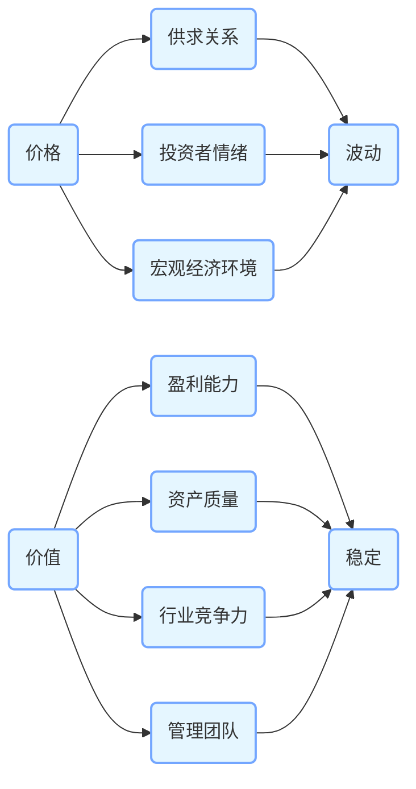

# 巴菲特的价格与价值区分

> 关键词：巴菲特、价格、价值、投资理念、价值投资、价格波动、内在价值

> 摘要：本文深入探讨了巴菲特关于价格与价值区分的投资理念。从背景介绍入手，阐述了理解这一理念的目的、适用读者以及文档结构。详细解析了价格与价值的核心概念及其联系，介绍了相关的核心算法原理和具体操作步骤，运用数学模型和公式进行说明。通过项目实战案例展示了如何在实际中运用该理念，探讨了其实际应用场景。同时推荐了学习这一理念的工具和资源，最后总结了未来发展趋势与挑战，并提供了常见问题解答和扩展阅读参考资料。旨在帮助投资者更好地理解和运用巴菲特的投资智慧，在投资领域做出更明智的决策。

## 1. 背景介绍 
### 1.1 目的和范围
巴菲特作为全球著名的投资大师，其投资理念影响深远。区分价格与价值是他投资思想的核心之一。本文的目的在于深入剖析巴菲特对于价格与价值的区分，帮助投资者理解这一关键理念的内涵、原理及应用方法。范围涵盖了理论层面的概念解释、算法原理，也包括实际应用中的案例分析和工具资源推荐。通过全面的阐述，使读者能够将这一理念运用到实际投资决策中。

### 1.2 预期读者
本文预期读者主要包括对投资领域感兴趣的初学者，希望通过学习巴菲特的投资理念来建立正确的投资思维；有一定投资经验但希望进一步提升投资水平的投资者，他们可以从本文中深入理解价格与价值区分的细节和应用技巧；以及金融专业的学生和研究人员，为他们的学术研究和实践提供参考。

### 1.3 文档结构概述
本文首先介绍背景信息，让读者了解文章的目的、受众和整体结构。接着阐述价格与价值的核心概念及其联系，通过文本示意图和 Mermaid 流程图进行直观展示。然后讲解核心算法原理和具体操作步骤，并结合 Python 代码进行说明。运用数学模型和公式对相关概念进行量化分析，同时举例说明。通过项目实战案例，详细介绍开发环境搭建、源代码实现和代码解读。探讨实际应用场景，为读者提供实践方向。推荐学习所需的工具和资源，包括书籍、在线课程、开发工具等。最后总结未来发展趋势与挑战，提供常见问题解答和扩展阅读参考资料。

### 1.4 术语表
#### 1.4.1 核心术语定义
- **价格**：指在市场交易中，买卖双方达成的商品或资产的交换价值，通常以货币形式体现。在股票市场中，就是股票的实时交易价格。
- **价值**：这里主要指内在价值，是资产本身所具有的真实价值，它基于资产的基本面因素，如公司的盈利能力、资产质量、行业前景等，是一个相对稳定的概念。
- **价值投资**：一种投资策略，强调通过分析资产的内在价值，寻找价格低于内在价值的投资机会，以获取长期的投资回报。

#### 1.4.2 相关概念解释
- **市场效率**：市场效率反映了市场价格反映资产真实价值的程度。在有效市场中，价格能够迅速反映所有可用信息，接近资产的内在价值；而在非有效市场中，价格可能会偏离内在价值。
- **安全边际**：是价值投资中的一个重要概念，指的是股票价格低于其内在价值的幅度。安全边际为投资者提供了一定的缓冲，降低了投资风险。

#### 1.4.3 缩略词列表
- **EPS**：Earnings Per Share，每股收益，是衡量公司盈利能力的重要指标，计算公式为净利润除以发行在外的普通股股数。
- **PE**：Price-to-Earnings Ratio，市盈率，是股票价格与每股收益的比率，反映了市场对公司未来盈利的预期。

## 2. 核心概念与联系 
### 核心概念原理
价格是市场交易的结果，受到供求关系、投资者情绪、宏观经济环境等多种因素的影响，因此价格具有波动性和不确定性。例如，在股票市场中，当大量投资者看好某只股票时，会纷纷买入，导致该股票价格上涨；反之，当投资者对某只股票失去信心时，会大量卖出，使股票价格下跌。

价值则是基于资产的基本面因素所确定的内在价值。对于一家公司来说，其内在价值主要取决于公司的盈利能力、资产质量、行业竞争力、管理团队等因素。例如，一家具有持续稳定盈利能力、优质资产和强大行业竞争力的公司，其内在价值通常较高。

### 文本示意图
```plaintext
             价格
           /      \
  供求关系  投资者情绪  宏观经济环境
           \      /
             波动

             价值
           /      \
  盈利能力  资产质量  行业竞争力  管理团队
           \      /
             稳定
```

### Mermaid 流程图


从流程图可以清晰地看出，价格受到多种不稳定因素的影响而产生波动，而价值则由相对稳定的基本面因素决定。这两者之间的关系是价值投资的核心关注点，当价格低于价值时，往往意味着投资机会的出现。

## 3. 核心算法原理 & 具体操作步骤 
### 核心算法原理
在评估股票的价值时，常用的方法之一是现金流折现模型（Discounted Cash Flow Model，DCF）。该模型的基本原理是将公司未来的现金流按照一定的折现率折现到当前，得到公司的内在价值。其公式为：

$$V = \sum_{t=1}^{n} \frac{CF_t}{(1 + r)^t}$$

其中，$V$ 表示公司的内在价值，$CF_t$ 表示第 $t$ 期的现金流，$r$ 表示折现率，$n$ 表示预测的期数。

### 具体操作步骤
1. **预测未来现金流**：分析公司的历史财务数据、行业发展趋势和公司的战略规划，预测公司未来各期的现金流。这需要对公司的业务有深入的了解，包括销售收入、成本、利润等方面的预测。
2. **确定折现率**：折现率反映了投资者对投资回报的要求，通常可以使用资本资产定价模型（Capital Asset Pricing Model，CAPM）来确定。其公式为：

$$r = R_f + \beta (R_m - R_f)$$

其中，$r$ 表示折现率，$R_f$ 表示无风险利率，$\beta$ 表示股票的贝塔系数，$R_m$ 表示市场收益率。

3. **计算内在价值**：将预测的未来现金流按照确定的折现率折现到当前，得到公司的内在价值。

### Python 代码实现
```python
import numpy as np

def dcf_model(cash_flows, discount_rate):
    """
    现金流折现模型计算公司内在价值
    :param cash_flows: 未来各期现金流列表
    :param discount_rate: 折现率
    :return: 公司内在价值
    """
    periods = len(cash_flows)
    discounted_cash_flows = []
    for t in range(periods):
        discounted_cash_flow = cash_flows[t] / ((1 + discount_rate) ** (t + 1))
        discounted_cash_flows.append(discounted_cash_flow)
    intrinsic_value = np.sum(discounted_cash_flows)
    return intrinsic_value

# 示例数据
cash_flows = [100, 120, 150, 180, 200]  # 未来 5 年的现金流
discount_rate = 0.1  # 折现率为 10%

intrinsic_value = dcf_model(cash_flows, discount_rate)
print(f"公司内在价值: {intrinsic_value}")
```
在上述代码中，定义了一个 `dcf_model` 函数，用于计算公司的内在价值。函数接受未来各期现金流列表和折现率作为输入，通过循环计算每期现金流的折现值，并将其累加得到公司的内在价值。最后，使用示例数据调用该函数并输出结果。

## 4. 数学模型和公式 & 详细讲解 & 举例说明 
### 现金流折现模型（DCF）
#### 详细讲解
现金流折现模型的核心思想是，资产的价值等于其未来所能产生的现金流的现值之和。未来的现金流由于存在时间价值，需要按照一定的折现率折现到当前。折现率反映了资金的机会成本和投资风险，折现率越高，未来现金流的现值越低。

#### 举例说明
假设一家公司未来 5 年的现金流分别为 100 万元、120 万元、150 万元、180 万元和 200 万元，折现率为 10%。按照现金流折现模型计算其内在价值：

第 1 年现金流的现值：$PV_1 = \frac{100}{(1 + 0.1)^1} \approx 90.91$（万元）

第 2 年现金流的现值：$PV_2 = \frac{120}{(1 + 0.1)^2} \approx 99.17$（万元）

第 3 年现金流的现值：$PV_3 = \frac{150}{(1 + 0.1)^3} \approx 112.69$（万元）

第 4 年现金流的现值：$PV_4 = \frac{180}{(1 + 0.1)^4} \approx 122.94$（万元）

第 5 年现金流的现值：$PV_5 = \frac{200}{(1 + 0.1)^5} \approx 124.18$（万元）

公司的内在价值：$V = PV_1 + PV_2 + PV_3 + PV_4 + PV_5 \approx 90.91 + 99.17 + 112.69 + 122.94 + 124.18 = 549.89$（万元）

### 资本资产定价模型（CAPM）
#### 详细讲解
资本资产定价模型用于确定投资的必要回报率，即折现率。无风险利率 $R_f$ 通常可以使用国债收益率来近似表示，它代表了投资者在无风险情况下的回报率。贝塔系数 $\beta$ 衡量了股票相对于市场的波动程度，$\beta > 1$ 表示股票的波动幅度大于市场，$\beta < 1$ 表示股票的波动幅度小于市场。市场收益率 $R_m$ 表示市场整体的平均回报率。

#### 举例说明
假设无风险利率 $R_f = 3\%$，市场收益率 $R_m = 10\%$，某股票的贝塔系数 $\beta = 1.2$。根据资本资产定价模型计算该股票的折现率：

$r = R_f + \beta (R_m - R_f) = 3\% + 1.2 \times (10\% - 3\%) = 3\% + 8.4\% = 11.4\%$

## 5. 项目实战：代码实际案例和详细解释说明 
### 5.1  开发环境搭建
- **Python 安装**：从 Python 官方网站（https://www.python.org/downloads/）下载并安装适合你操作系统的 Python 版本，建议选择 Python 3.7 及以上版本。
- **IDE 选择**：可以使用 PyCharm、Jupyter Notebook 等集成开发环境。这里以 PyCharm 为例，从 JetBrains 官方网站（https://www.jetbrains.com/pycharm/download/）下载并安装 PyCharm Community Edition 版本。
- **必要库安装**：在命令行中使用 `pip` 命令安装所需的库，如 `numpy` 用于数值计算。

```sh
pip install numpy
```

### 5.2  源代码详细实现和代码解读
```python
import numpy as np

def calculate_beta(stock_returns, market_returns):
    """
    计算股票的贝塔系数
    :param stock_returns: 股票的收益率列表
    :param market_returns: 市场的收益率列表
    :return: 股票的贝塔系数
    """
    covariance = np.cov(stock_returns, market_returns)[0, 1]
    market_variance = np.var(market_returns)
    beta = covariance / market_variance
    return beta

def capm_model(rf, beta, rm):
    """
    资本资产定价模型计算折现率
    :param rf: 无风险利率
    :param beta: 股票的贝塔系数
    :param rm: 市场收益率
    :return: 折现率
    """
    r = rf + beta * (rm - rf)
    return r

def dcf_model(cash_flows, discount_rate):
    """
    现金流折现模型计算公司内在价值
    :param cash_flows: 未来各期现金流列表
    :param discount_rate: 折现率
    :return: 公司内在价值
    """
    periods = len(cash_flows)
    discounted_cash_flows = []
    for t in range(periods):
        discounted_cash_flow = cash_flows[t] / ((1 + discount_rate) ** (t + 1))
        discounted_cash_flows.append(discounted_cash_flow)
    intrinsic_value = np.sum(discounted_cash_flows)
    return intrinsic_value

# 示例数据
stock_returns = [0.05, 0.03, -0.02, 0.06, 0.04]
market_returns = [0.04, 0.02, -0.01, 0.05, 0.03]
rf = 0.03  # 无风险利率为 3%
rm = 0.1  # 市场收益率为 10%
cash_flows = [100, 120, 150, 180, 200]  # 未来 5 年的现金流

# 计算贝塔系数
beta = calculate_beta(stock_returns, market_returns)
print(f"股票的贝塔系数: {beta}")

# 计算折现率
discount_rate = capm_model(rf, beta, rm)
print(f"折现率: {discount_rate}")

# 计算公司内在价值
intrinsic_value = dcf_model(cash_flows, discount_rate)
print(f"公司内在价值: {intrinsic_value}")
```

### 5.3  代码解读与分析
- **`calculate_beta` 函数**：该函数接受股票的收益率列表和市场的收益率列表作为输入，通过计算股票收益率和市场收益率的协方差与市场收益率的方差，得到股票的贝塔系数。
- **`capm_model` 函数**：根据资本资产定价模型，使用无风险利率、股票的贝塔系数和市场收益率计算折现率。
- **`dcf_model` 函数**：使用现金流折现模型，将未来各期现金流按照折现率折现到当前，计算公司的内在价值。
- **主程序**：定义示例数据，调用上述函数依次计算股票的贝塔系数、折现率和公司的内在价值，并输出结果。

通过这个项目实战，我们可以看到如何运用相关的算法和公式，结合 Python 代码来评估公司的内在价值，从而为投资决策提供参考。

## 6. 实际应用场景 
### 股票投资
在股票投资中，投资者可以运用巴菲特的价格与价值区分理念，通过分析公司的内在价值，寻找价格低于内在价值的股票进行投资。例如，当一只股票的市场价格为 50 元，而通过现金流折现模型等方法计算得出其内在价值为 80 元，且具有一定的安全边际时，投资者可以考虑买入该股票。随着市场对公司价值的逐渐认可，股票价格有望向内在价值回归，投资者可以获得投资收益。

### 企业并购
在企业并购中，收购方需要评估被收购企业的价值。通过区分价格与价值，收购方可以避免以过高的价格收购企业。例如，收购方在考虑收购一家公司时，会对该公司的财务状况、业务前景、行业竞争力等进行深入分析，计算其内在价值。如果市场上该公司的报价高于其内在价值，收购方可能会选择放弃收购或与卖方进行谈判，以争取更合理的价格。

### 房地产投资
在房地产投资中，投资者也可以运用价格与价值区分的理念。投资者需要评估房产的内在价值，包括地理位置、房屋质量、周边配套设施等因素。如果房产的市场价格低于其内在价值，且具有较好的增值潜力，投资者可以考虑购买。同时，投资者还需要关注市场价格的波动，避免在价格过高时买入。

### 债券投资
在债券投资中，投资者需要评估债券的价值。债券的价值主要取决于债券的票面利率、到期时间、信用等级等因素。投资者可以通过计算债券的内在价值，与市场价格进行比较。如果债券的市场价格低于其内在价值，投资者可以考虑买入该债券，以获取固定的利息收益和可能的资本增值。

## 7. 工具和资源推荐
### 7.1 学习资源推荐
#### 7.1.1 书籍推荐
- 《聪明的投资者》（The Intelligent Investor）：作者本杰明·格雷厄姆（Benjamin Graham）是巴菲特的导师，这本书是价值投资领域的经典之作，详细阐述了价值投资的理念和方法。
- 《巴菲特致股东的信：股份公司教程》（Letters to Shareholders of Berkshire Hathaway）：收录了巴菲特多年来致股东的信，从中可以深入了解巴菲特的投资思想、经营理念和对市场的看法。
- 《财务报表分析与证券定价》（Financial Statement Analysis and Security Valuation）：作者斯蒂芬·佩因曼（Stephen Penman），这本书介绍了如何通过分析公司的财务报表来评估公司的价值，是价值投资中重要的分析工具。

#### 7.1.2 在线课程
- Coursera 上的“投资学原理”（Principles of Investing）：由知名教授授课，系统介绍了投资的基本原理、方法和策略，包括价值投资的相关内容。
- edX 上的“金融市场”（Financial Markets）：耶鲁大学教授罗伯特·席勒（Robert Shiller）主讲，课程涵盖了金融市场的各个方面，对理解投资环境和价值投资有很大帮助。

#### 7.1.3 技术博客和网站
- 雪球网（https://xueqiu.com/）：国内知名的投资社区，汇聚了众多投资者和投资专家，提供股票、基金等投资品种的分析和讨论，还有丰富的研究报告和投资策略分享。
- Seeking Alpha（https://seekingalpha.com/）：国外著名的金融投资网站，提供全球金融市场的分析和评论，有很多关于价值投资的文章和研究报告。

### 7.2 开发工具框架推荐
#### 7.2.1 IDE和编辑器
- PyCharm：功能强大的 Python 集成开发环境，提供代码编辑、调试、版本控制等多种功能，适合专业的 Python 开发。
- Jupyter Notebook：交互式的开发环境，支持代码、文本、图表等多种形式的展示，方便进行数据分析和模型验证。

#### 7.2.2 调试和性能分析工具
- PySnooper：可以自动记录函数的执行过程和变量的值，方便调试代码。安装命令：`pip install pysnooper`。
- cProfile：Python 内置的性能分析工具，可以分析代码的执行时间和函数调用情况，帮助优化代码性能。

#### 7.2.3 相关框架和库
- Pandas：用于数据处理和分析的 Python 库，提供了高效的数据结构和数据操作方法，方便处理金融数据。安装命令：`pip install pandas`。
- NumPy：用于数值计算的 Python 库，提供了多维数组对象和各种数学函数，是进行金融模型计算的基础库。

### 7.3 相关论文著作推荐
#### 7.3.1 经典论文
- 《证券分析》（Security Analysis）：本杰明·格雷厄姆和大卫·多德（David Dodd）的经典著作，提出了价值投资的基本理论和方法，对后来的投资理论和实践产生了深远影响。
- 《有效资本市场：理论与实证研究回顾》（Efficient Capital Markets: A Review of Theory and Empirical Work）：尤金·法玛（Eugene F. Fama）的论文，系统阐述了有效市场假说，对理解市场价格与价值的关系有重要意义。

#### 7.3.2 最新研究成果
- 关注《金融研究》《经济研究》等国内外知名金融经济期刊，这些期刊会发表关于价值投资、市场效率等方面的最新研究成果。
- 各大高校和研究机构的工作论文，如 NBER（美国国家经济研究局）的工作论文，通常包含前沿的金融研究内容。

#### 7.3.3 应用案例分析
- 《巴菲特的投资组合：集中投资策略的秘诀》（The Warren Buffett Portfolio: Mastering the Power of the Focus Investment Strategy）：通过分析巴菲特的投资案例，介绍了集中投资策略的应用和优势。
- 各类财经媒体和研究机构发布的投资案例分析报告，如券商的研究报告，会对具体的投资案例进行深入分析，为投资者提供参考。

## 8. 总结：未来发展趋势与挑战
### 未来发展趋势
- **科技融合**：随着科技的不断发展，人工智能、大数据等技术将与价值投资理念进一步融合。例如，利用人工智能算法可以更高效地分析海量的财务数据和市场信息，帮助投资者更准确地评估公司的内在价值。
- **全球投资**：经济全球化的趋势将促使投资者更加关注全球市场的投资机会。价值投资理念将在全球范围内得到更广泛的应用，投资者可以通过跨市场投资，寻找价格与价值偏离更大的投资标的。
- **社会责任投资**：越来越多的投资者开始关注企业的社会责任，将环境、社会和治理（ESG）因素纳入投资决策。未来，价值投资可能会与社会责任投资相结合，寻找那些既具有内在价值又符合社会可持续发展要求的企业进行投资。

### 挑战
- **信息过载**：在信息爆炸的时代，投资者面临着海量的信息。如何从众多信息中筛选出有价值的信息，准确评估公司的内在价值，是投资者面临的一大挑战。
- **市场不确定性**：宏观经济环境、政策变化、突发事件等因素都会增加市场的不确定性，导致价格与价值的偏离更加复杂和难以预测。投资者需要具备更强的风险意识和应对能力。
- **竞争加剧**：随着价值投资理念的普及，越来越多的投资者开始运用这一理念进行投资，市场竞争将更加激烈。投资者需要不断提升自己的分析能力和投资技巧，才能在市场中获得超额收益。

## 9. 附录：常见问题与解答
### 问题 1：如何准确预测公司的未来现金流？
解答：预测公司的未来现金流需要综合考虑多个因素。首先，要分析公司的历史财务数据，了解其收入、成本、利润等指标的变化趋势。其次，研究公司所处的行业发展前景，包括市场规模、竞争格局、技术变革等因素。此外，还需要关注公司的战略规划和业务发展方向，评估其新产品、新市场的拓展潜力。同时，可以参考行业分析师的研究报告和预测数据，但要注意对这些数据进行独立思考和分析。

### 问题 2：折现率的选择对内在价值的计算有多大影响？
解答：折现率的选择对内在价值的计算有很大影响。折现率越高，未来现金流的现值越低，公司的内在价值也就越低；反之，折现率越低，内在价值越高。因此，折现率的选择需要谨慎，要综合考虑无风险利率、市场风险溢价、股票的贝塔系数等因素。在实际应用中，可以采用敏感性分析的方法，评估不同折现率下公司内在价值的变化情况，以确定合理的折现率范围。

### 问题 3：价值投资是否适用于所有市场和所有投资品种？
解答：价值投资理念具有一定的普遍性，但并不适用于所有市场和所有投资品种。在有效市场中，价格能够迅速反映所有可用信息，价格与价值的偏离可能较小，价值投资的机会相对较少。而在非有效市场中，价格可能会出现较大的偏离，价值投资更容易找到投资机会。此外，对于一些短期波动较大、缺乏基本面支撑的投资品种，如某些期货、期权等，价值投资的适用性可能较差。价值投资更适合于具有稳定现金流和基本面的股票、债券、房地产等投资品种。

### 问题 4：如何判断市场价格是否低于内在价值？
解答：判断市场价格是否低于内在价值需要进行详细的分析和评估。首先，要运用合适的估值方法，如现金流折现模型、市盈率法、市净率法等，计算公司的内在价值。然后，将计算得出的内在价值与市场价格进行比较。同时，还需要考虑安全边际的因素，即市场价格低于内在价值的幅度要足够大，以降低投资风险。此外，还可以参考同行业其他公司的估值水平、公司的历史估值情况等因素，综合判断市场价格是否合理。

## 10. 扩展阅读 & 参考资料
- [1] 本杰明·格雷厄姆. 《聪明的投资者》. 人民邮电出版社.
- [2] 沃伦·巴菲特. 《巴菲特致股东的信：股份公司教程》. 机械工业出版社.
- [3] 斯蒂芬·佩因曼. 《财务报表分析与证券定价》. 中国人民大学出版社.
- [4] Eugene F. Fama. "Efficient Capital Markets: A Review of Theory and Empirical Work". The Journal of Finance, 1970.
- [5] 雪球网. https://xueqiu.com/
- [6] Seeking Alpha. https://seekingalpha.com/

作者：AI天才研究院/AI Genius Institute & 禅与计算机程序设计艺术 /Zen And The Art of Computer Programming