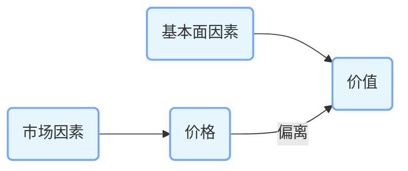

# 巴菲特的价格与价值区分：投资的核心智慧

> 关键词：巴菲特、价格与价值区分、投资智慧、价值投资、安全边际

> 摘要：本文围绕巴菲特投资理念中价格与价值区分这一核心智慧展开。首先介绍相关背景知识，包括目的、预期读者等。接着阐述价格与价值的核心概念及联系，分析其背后的原理与架构。详细讲解核心算法原理，结合Python代码示例说明。通过数学模型和公式深入剖析，辅以实际案例。进行项目实战，给出代码实现与解读。探讨该理念在实际中的应用场景，推荐学习资源、开发工具及相关论文著作。最后总结未来发展趋势与挑战，解答常见问题并提供扩展阅读和参考资料，旨在帮助读者深入理解并运用这一投资核心智慧。

## 1. 背景介绍 
### 1.1 目的和范围
本文旨在深入剖析巴菲特投资理念中价格与价值区分这一核心智慧。通过详细讲解相关概念、原理、算法，结合实际案例和代码实现，让读者全面理解价格与价值区分在投资中的重要性，并掌握运用这一智慧进行投资决策的方法。范围涵盖投资领域的股票、债券等多种资产类型，不仅适用于专业投资者，也为普通投资者提供有价值的参考。

### 1.2 预期读者
本文预期读者包括对投资感兴趣的普通大众、初涉投资领域的新手、专业的投资人士以及金融相关专业的学生。无论你是想学习投资基础知识，还是希望提升投资决策能力，都能从本文中获得有价值的信息。

### 1.3 文档结构概述
本文首先介绍背景知识，让读者了解文章的目的、受众和整体结构。接着阐述价格与价值的核心概念及联系，通过文本示意图和Mermaid流程图直观展示。然后详细讲解核心算法原理，结合Python代码进行说明。运用数学模型和公式深入分析，并举例说明。进行项目实战，包括开发环境搭建、源代码实现与解读。探讨实际应用场景，推荐学习资源、开发工具和相关论文著作。最后总结未来发展趋势与挑战，解答常见问题并提供扩展阅读和参考资料。

### 1.4 术语表
#### 1.4.1 核心术语定义
- **价格**：指在市场上买卖资产时实际成交的货币金额，是市场供需关系的体现。例如，在股票市场中，某只股票的当前成交价就是其价格。
- **价值**：资产本身所具有的内在价值，是基于资产的基本面因素，如盈利能力、现金流、资产质量等进行评估得出的。以一家公司为例，其价值取决于公司的业务前景、管理团队、财务状况等。
- **价值投资**：一种投资策略，强调通过分析资产的内在价值，寻找价格低于价值的投资机会，以获取长期稳定的收益。
- **安全边际**：指股票价格低于其内在价值的幅度，是价值投资中的重要概念，用于降低投资风险。例如，当一只股票的内在价值为100元，而市场价格为80元时，安全边际为20%。

#### 1.4.2 相关概念解释
- **市场效率**：市场能够迅速、准确地反映资产所有可用信息的程度。在有效市场中，价格能够及时反映价值；而在非有效市场中，价格可能会偏离价值。
- **基本面分析**：通过研究公司的财务报表、行业前景、宏观经济环境等基本面因素，评估公司的内在价值。
- **现金流折现模型**：一种常用的评估资产价值的方法，通过预测资产未来的现金流，并将其折现到当前时点，得出资产的内在价值。

#### 1.4.3 缩略词列表
- **DCF**：Discounted Cash Flow，现金流折现。
- **PE**：Price-to-Earnings Ratio，市盈率。
- **PB**：Price-to-Book Ratio，市净率。

## 2. 核心概念与联系 
### 核心概念原理
价格是市场交易的结果，它受到多种因素的影响，包括市场供需关系、投资者情绪、宏观经济环境等。价格是动态变化的，可能会在短期内大幅波动。例如，在股票市场中，当大量投资者买入某只股票时，需求增加，价格可能会迅速上涨；反之，当大量投资者卖出时，价格可能会下跌。

价值则是资产的内在属性，它基于资产的基本面因素。对于一家公司来说，其价值主要取决于公司的盈利能力、现金流状况、资产质量、竞争优势等。价值的变化相对较为缓慢，因为公司的基本面因素不会在短期内发生巨大改变。例如，一家具有稳定盈利能力和良好发展前景的公司，其价值会随着时间的推移逐步增长。

巴菲特认为，价格与价值之间存在着密切的关系，但两者并不总是相等的。在市场中，价格常常会偏离价值，有时价格高于价值，有时价格低于价值。投资者的任务就是通过深入分析，发现价格低于价值的投资机会，从而实现投资的增值。

### 架构的文本示意图
```plaintext
            市场因素
              │
              ▼
        ┌─────────┐
        │  价格   │
        └─────────┘
              │
              │  偏离
              │
              ▼
        ┌─────────┐
        │  价值   │
        └─────────┘
              │
              ▼
      基本面因素
```
这个示意图展示了价格与价值的关系。市场因素影响价格的形成，而价值则由基本面因素决定。价格可能会偏离价值，投资者需要通过分析来发现这种偏离。

### Mermaid流程图

该流程图清晰地展示了市场因素影响价格，基本面因素决定价值，并且价格会偏离价值的关系。

## 3. 核心算法原理 & 具体操作步骤 
### 核心算法原理
在投资中，判断价格与价值的关系是关键。常用的方法之一是通过估值模型来计算资产的内在价值，然后与市场价格进行比较。其中，现金流折现模型（DCF）是一种经典的估值方法。

现金流折现模型的基本原理是将资产未来的现金流折现到当前时点，以确定其内在价值。其核心公式为：

$$V = \sum_{t=1}^{n} \frac{CF_t}{(1 + r)^t}$$

其中，$V$ 表示资产的内在价值，$CF_t$ 表示第 $t$ 期的现金流，$r$ 表示折现率，$n$ 表示现金流的期数。

### 具体操作步骤
1. **预测现金流**：对资产未来的现金流进行预测。这需要考虑资产的业务模式、市场前景、竞争状况等因素。对于一家公司来说，可以通过分析其历史财务报表、行业发展趋势等，预测其未来的营业收入、成本、利润等，进而得出未来的现金流。
2. **确定折现率**：折现率反映了投资者对投资回报的要求，通常与投资的风险程度相关。一般来说，风险越高，折现率越高。可以使用资本资产定价模型（CAPM）来确定折现率，其公式为：

$$r = R_f + \beta (R_m - R_f)$$

其中，$r$ 表示折现率，$R_f$ 表示无风险利率，$\beta$ 表示资产的系统性风险系数，$R_m$ 表示市场预期收益率。

3. **计算内在价值**：将预测的现金流代入现金流折现模型的公式中，计算资产的内在价值。
4. **比较价格与价值**：将计算得到的内在价值与市场价格进行比较。如果市场价格低于内在价值，说明该资产可能被低估，具有投资价值；反之，如果市场价格高于内在价值，说明该资产可能被高估，投资风险较大。

### Python源代码实现
```python
import numpy as np

def dcf_valuation(cash_flows, discount_rate):
    """
    计算现金流折现模型的内在价值
    :param cash_flows: 未来各期的现金流列表
    :param discount_rate: 折现率
    :return: 内在价值
    """
    n = len(cash_flows)
    present_values = []
    for t in range(n):
        present_value = cash_flows[t] / ((1 + discount_rate) ** (t + 1))
        present_values.append(present_value)
    intrinsic_value = np.sum(present_values)
    return intrinsic_value

# 示例数据
cash_flows = [100, 120, 150, 180, 200]  # 未来5期的现金流
discount_rate = 0.1  # 折现率为10%

# 计算内在价值
intrinsic_value = dcf_valuation(cash_flows, discount_rate)
print(f"资产的内在价值为: {intrinsic_value}")
```
### 代码解释
- `dcf_valuation` 函数接受两个参数：`cash_flows` 表示未来各期的现金流列表，`discount_rate` 表示折现率。
- 在函数内部，通过循环计算每一期现金流的现值，并将其添加到 `present_values` 列表中。
- 最后，使用 `np.sum` 函数计算所有现值的总和，得到资产的内在价值。

## 4. 数学模型和公式 & 详细讲解 & 举例说明 
### 现金流折现模型（DCF）
#### 公式
$$V = \sum_{t=1}^{n} \frac{CF_t}{(1 + r)^t}$$

#### 详细讲解
- $V$ 表示资产的内在价值，即我们要计算的结果。
- $CF_t$ 表示第 $t$ 期的现金流。现金流可以是正的，也可以是负的，取决于资产的盈利或支出情况。例如，对于一家公司来说，现金流可能包括营业收入、净利润、折旧等。
- $r$ 表示折现率，它反映了资金的时间价值和投资的风险。折现率越高，未来现金流的现值越低，说明投资者对投资回报的要求越高。
- $n$ 表示现金流的期数。可以根据资产的具体情况确定期数，一般来说，对于长期投资，可以预测较长的期数。

#### 举例说明
假设我们要评估一家公司的内在价值。预测该公司未来 5 年的现金流分别为 100 万元、120 万元、150 万元、180 万元和 200 万元，折现率为 10%。

首先，计算每一期现金流的现值：

第 1 期：$PV_1 = \frac{100}{(1 + 0.1)^1} = \frac{100}{1.1} \approx 90.91$（万元）

第 2 期：$PV_2 = \frac{120}{(1 + 0.1)^2} = \frac{120}{1.21} \approx 99.17$（万元）

第 3 期：$PV_3 = \frac{150}{(1 + 0.1)^3} = \frac{150}{1.331} \approx 112.69$（万元）

第 4 期：$PV_4 = \frac{180}{(1 + 0.1)^4} = \frac{180}{1.4641} \approx 122.94$（万元）

第 5 期：$PV_5 = \frac{200}{(1 + 0.1)^5} = \frac{200}{1.61051} \approx 124.18$（万元）

然后，将各期现值相加，得到公司的内在价值：

$V = PV_1 + PV_2 + PV_3 + PV_4 + PV_5 \approx 90.91 + 99.17 + 112.69 + 122.94 + 124.18 = 549.89$（万元）

### 资本资产定价模型（CAPM）
#### 公式
$$r = R_f + \beta (R_m - R_f)$$

#### 详细讲解
- $r$ 表示折现率，即投资者要求的必要回报率。
- $R_f$ 表示无风险利率，通常可以用国债收益率来近似代替。无风险利率反映了资金的基本时间价值。
- $\beta$ 表示资产的系统性风险系数，它衡量了资产的收益率相对于市场收益率的波动程度。$\beta$ 值大于 1 表示资产的波动幅度大于市场，风险较高；$\beta$ 值小于 1 表示资产的波动幅度小于市场，风险较低。
- $R_m$ 表示市场预期收益率，即整个市场的平均回报率。

#### 举例说明
假设无风险利率 $R_f$ 为 3%，市场预期收益率 $R_m$ 为 10%，某只股票的 $\beta$ 值为 1.2。

根据资本资产定价模型，该股票的折现率为：

$r = 3\% + 1.2 \times (10\% - 3\%) = 3\% + 1.2 \times 7\% = 3\% + 8.4\% = 11.4\%$

这意味着投资者对该股票要求的必要回报率为 11.4%。

## 5. 项目实战：代码实际案例和详细解释说明 
### 5.1  开发环境搭建
#### 操作系统
可以选择 Windows、Mac OS 或 Linux 操作系统。不同操作系统的开发环境搭建步骤略有不同，但基本原理是相同的。

#### Python 安装
首先需要安装 Python 解释器。可以从 Python 官方网站（https://www.python.org/downloads/）下载适合自己操作系统的 Python 版本。建议安装 Python 3.6 及以上版本。

#### 开发工具
推荐使用 PyCharm 作为开发工具。PyCharm 是一款专业的 Python 集成开发环境（IDE），具有代码编辑、调试、自动补全、版本控制等功能，非常适合 Python 开发。可以从 JetBrains 官方网站（https://www.jetbrains.com/pycharm/download/）下载 PyCharm 社区版或专业版。

#### 第三方库安装
在项目中，需要使用 `numpy` 库进行数值计算。可以使用以下命令通过 `pip` 安装 `numpy` 库：

```sh
pip install numpy
```

### 5.2  源代码详细实现和代码解读
```python
import numpy as np

def dcf_valuation(cash_flows, discount_rate):
    """
    计算现金流折现模型的内在价值
    :param cash_flows: 未来各期的现金流列表
    :param discount_rate: 折现率
    :return: 内在价值
    """
    n = len(cash_flows)
    present_values = []
    for t in range(n):
        present_value = cash_flows[t] / ((1 + discount_rate) ** (t + 1))
        present_values.append(present_value)
    intrinsic_value = np.sum(present_values)
    return intrinsic_value

def capm_discount_rate(rf, beta, rm):
    """
    计算资本资产定价模型的折现率
    :param rf: 无风险利率
    :param beta: 资产的系统性风险系数
    :param rm: 市场预期收益率
    :return: 折现率
    """
    discount_rate = rf + beta * (rm - rf)
    return discount_rate

# 示例数据
cash_flows = [100, 120, 150, 180, 200]  # 未来5期的现金流
rf = 0.03  # 无风险利率为3%
beta = 1.2  # 资产的系统性风险系数
rm = 0.1  # 市场预期收益率为10%

# 计算折现率
discount_rate = capm_discount_rate(rf, beta, rm)
print(f"折现率为: {discount_rate}")

# 计算内在价值
intrinsic_value = dcf_valuation(cash_flows, discount_rate)
print(f"资产的内在价值为: {intrinsic_value}")
```
### 代码解读
- `dcf_valuation` 函数：该函数实现了现金流折现模型的计算。它接受未来各期的现金流列表和折现率作为参数，通过循环计算每一期现金流的现值，并将其相加得到资产的内在价值。
- `capm_discount_rate` 函数：该函数实现了资本资产定价模型的计算。它接受无风险利率、资产的系统性风险系数和市场预期收益率作为参数，根据公式计算折现率。
- 示例数据部分：定义了未来 5 期的现金流、无风险利率、资产的系统性风险系数和市场预期收益率。
- 计算折现率：调用 `capm_discount_rate` 函数计算折现率，并将结果打印输出。
- 计算内在价值：调用 `dcf_valuation` 函数，使用计算得到的折现率计算资产的内在价值，并将结果打印输出。

### 5.3  代码解读与分析
#### 优点
- **模块化设计**：将现金流折现模型和资本资产定价模型分别封装成函数，提高了代码的复用性和可维护性。
- **易于理解**：代码结构清晰，注释详细，便于初学者理解和学习。
- **灵活性**：可以根据需要修改示例数据，对不同的资产进行估值计算。

#### 局限性
- **数据准确性**：现金流和折现率的预测需要大量的分析和判断，数据的准确性会影响估值结果的可靠性。
- **模型简化**：现金流折现模型和资本资产定价模型都是基于一定的假设条件，实际情况可能更为复杂，模型的简化可能会导致估值偏差。

## 6. 实际应用场景 
### 股票投资
在股票投资中，价格与价值区分的智慧至关重要。投资者可以通过分析公司的基本面，如财务报表、行业前景、竞争优势等，使用现金流折现模型等方法计算公司的内在价值。然后，将内在价值与股票的市场价格进行比较。如果市场价格低于内在价值，说明股票可能被低估，具有投资价值；反之，如果市场价格高于内在价值，说明股票可能被高估，投资风险较大。例如，巴菲特在投资可口可乐公司时，通过深入分析公司的品牌价值、市场份额、现金流等因素，认为公司的内在价值远高于当时的市场价格，从而大量买入可口可乐股票，获得了丰厚的回报。

### 债券投资
在债券投资中，同样可以运用价格与价值区分的理念。债券的价值取决于债券的票面利率、到期时间、信用等级等因素。投资者可以通过计算债券的内在价值，与债券的市场价格进行比较。如果市场价格低于内在价值，说明债券可能被低估，投资者可以考虑买入；反之，如果市场价格高于内在价值，说明债券可能被高估，投资者可以考虑卖出或避免买入。

### 房地产投资
在房地产投资中，价格与价值的区分也很重要。房地产的价值受到地理位置、房屋质量、周边配套设施、市场供需关系等因素的影响。投资者可以通过对这些因素的分析，评估房地产的内在价值。然后，将内在价值与房地产的市场价格进行比较。如果市场价格低于内在价值，说明房地产可能被低估，具有投资潜力；反之，如果市场价格高于内在价值，说明房地产可能被高估，投资风险较大。

### 企业并购
在企业并购中，价格与价值的区分是关键决策因素之一。收购方需要对目标企业的内在价值进行评估，包括目标企业的资产、负债、盈利能力、市场份额等。通过与目标企业的市场价格或收购报价进行比较，判断是否值得进行并购。如果目标企业的内在价值高于收购价格，说明并购可能具有投资价值；反之，如果目标企业的内在价值低于收购价格，说明并购可能存在风险。

## 7. 工具和资源推荐
### 7.1 学习资源推荐
#### 7.1.1 书籍推荐
- 《聪明的投资者》（The Intelligent Investor）：作者是本杰明·格雷厄姆（Benjamin Graham），这本书是价值投资的经典之作，巴菲特称其为“有史以来最伟大的投资著作”。书中详细阐述了价值投资的理念和方法，对价格与价值的区分进行了深入探讨。
- 《巴菲特致股东的信：投资者和公司高管教程》（Letters to Shareholders of Berkshire Hathaway）：这本书收录了巴菲特多年来致股东的信，通过这些信件可以深入了解巴菲特的投资思想、决策过程和对价格与价值的看法。
- 《财务报表分析与证券定价》（Financial Statement Analysis and Security Valuation）：作者是斯蒂芬·佩因曼（Stephen Penman），该书系统地介绍了如何通过分析财务报表来评估企业的内在价值，对于理解价格与价值的关系具有重要意义。

#### 7.1.2 在线课程
- Coursera 上的“投资学原理”（Principles of Investing）：该课程由知名教授授课，涵盖了投资的基本原理、资产估值方法等内容，对价格与价值区分的概念进行了详细讲解。
- edX 上的“财务分析与决策”（Financial Analysis and Decision Making）：课程通过实际案例分析，教授如何运用财务分析工具评估企业的价值，帮助学员掌握价格与价值分析的方法。

#### 7.1.3 技术博客和网站
- 雪球网（https://xueqiu.com/）：国内知名的投资交流社区，汇聚了众多投资者和投资专家。在雪球网上可以找到关于价格与价值分析的大量文章和讨论，与其他投资者分享经验和观点。
- Seeking Alpha（https://seekingalpha.com/）：国外著名的金融投资网站，提供丰富的投资分析文章和研究报告，对于了解国际市场的价格与价值动态具有重要参考价值。

### 7.2 开发工具框架推荐
#### 7.2.1 IDE和编辑器
- PyCharm：如前文所述，是一款专业的 Python 集成开发环境，具有强大的代码编辑、调试和自动补全功能，适合进行投资分析相关的代码开发。
- Jupyter Notebook：是一个交互式的开发环境，支持多种编程语言，特别适合进行数据探索和分析。在投资分析中，可以使用 Jupyter Notebook 进行数据可视化、模型验证等工作。

#### 7.2.2 调试和性能分析工具
- PDB：Python 自带的调试器，可以帮助开发者在代码运行过程中进行调试，查找错误和问题。
- cProfile：Python 标准库中的性能分析工具，可以分析代码的运行时间和函数调用情况，帮助开发者优化代码性能。

#### 7.2.3 相关框架和库
- Pandas：是一个强大的数据分析库，提供了高效的数据结构和数据处理工具，在投资分析中可以用于数据清洗、整理和分析。
- Matplotlib：是一个常用的数据可视化库，可以绘制各种类型的图表，如折线图、柱状图、散点图等，帮助投资者直观地展示数据和分析结果。

### 7.3 相关论文著作推荐
#### 7.3.1 经典论文
- 《证券分析》（Security Analysis）：本杰明·格雷厄姆和戴维·多德（David Dodd）所著，该书被认为是价值投资理论的奠基之作，对价格与价值的关系进行了深入研究。
- 《有效资本市场：理论与实证研究回顾》（Efficient Capital Markets: A Review of Theory and Empirical Work）：作者是尤金·法玛（Eugene F. Fama），这篇论文提出了有效市场假说，对理解市场价格与价值的关系具有重要意义。

#### 7.3.2 最新研究成果
- 关注《金融研究》《经济研究》等国内外知名金融经济期刊，这些期刊会发表关于投资理论、资产定价等方面的最新研究成果，有助于了解价格与价值区分领域的前沿动态。
- 参加金融学术会议，如美国金融协会（American Finance Association）年会等，在会议上可以接触到最新的研究论文和研究思路。

#### 7.3.3 应用案例分析
- 可以参考各大投资银行和咨询公司发布的研究报告，这些报告通常会包含对具体公司或行业的价格与价值分析案例，通过学习这些案例可以提高实际应用能力。
- 研究知名投资者的投资案例，如巴菲特的投资组合和投资决策过程，分析他是如何运用价格与价值区分的智慧进行投资的。

## 8. 总结：未来发展趋势与挑战
### 未来发展趋势
#### 数字化和智能化
随着科技的不断发展，投资领域将越来越数字化和智能化。利用大数据、人工智能等技术，可以更准确地分析资产的价格与价值关系。例如，通过机器学习算法可以对大量的财务数据、市场数据进行分析和预测，提高估值的准确性和效率。

#### 全球化投资
全球经济一体化的趋势使得投资市场越来越全球化。投资者可以更容易地投资于不同国家和地区的资产。在全球化投资的背景下，价格与价值的区分将面临更多的挑战和机遇。投资者需要考虑不同国家和地区的经济环境、政策法规、文化差异等因素，对资产进行全面的评估。

#### 可持续投资
可持续投资已经成为未来投资的重要趋势。投资者在评估资产的价值时，不仅会考虑财务因素，还会考虑环境、社会和治理（ESG）因素。具有良好 ESG 表现的公司可能具有更高的内在价值，而价格与价值的区分也将更加复杂。

### 挑战
#### 数据质量和可靠性
在数字化和智能化的投资环境中，数据的质量和可靠性至关重要。不准确或不完整的数据可能会导致估值结果的偏差，影响投资决策的正确性。因此，如何获取高质量的数据，并对数据进行有效的清洗和处理，是未来面临的一个重要挑战。

#### 市场不确定性
市场环境充满了不确定性，如宏观经济波动、政策变化、突发事件等。这些不确定性因素会对资产的价格和价值产生影响，使得价格与价值的区分更加困难。投资者需要具备更强的风险意识和应对能力，及时调整投资策略。

#### 模型局限性
现有的估值模型和方法都存在一定的局限性，无法完全准确地反映资产的内在价值。例如，现金流折现模型需要对未来现金流和折现率进行预测，而这些预测往往具有不确定性。如何改进和完善现有的模型，提高估值的准确性，是未来需要解决的问题。

## 9. 附录：常见问题与解答
### 如何准确预测现金流？
预测现金流需要综合考虑多种因素，包括公司的业务模式、市场前景、竞争状况、宏观经济环境等。可以通过分析公司的历史财务报表，了解其营业收入、成本、利润等指标的变化趋势。同时，关注行业的发展动态和市场需求，对公司未来的业务增长进行合理预测。此外，还可以参考行业研究报告、分析师的预测等信息，但需要注意对这些信息进行批判性分析。

### 折现率的选择对估值结果有多大影响？
折现率的选择对估值结果有很大影响。折现率越高，未来现金流的现值越低，资产的内在价值也越低；反之，折现率越低，资产的内在价值越高。因此，在选择折现率时，需要谨慎考虑投资的风险程度、市场利率水平等因素。可以使用资本资产定价模型等方法来确定折现率，但也需要结合实际情况进行调整。

### 价格与价值的偏离会持续多久？
价格与价值的偏离持续时间是不确定的，受到多种因素的影响，如市场情绪、宏观经济环境、公司基本面变化等。在某些情况下，价格与价值的偏离可能会在短期内得到纠正；而在另一些情况下，偏离可能会持续较长时间。投资者需要有耐心，等待价格回归价值的时机。同时，也需要不断跟踪和评估资产的基本面情况，及时调整投资策略。

### 价值投资是否适用于所有市场和资产？
价值投资的理念适用于大多数市场和资产，但在不同的市场环境和资产类型中，其应用方式和效果可能会有所不同。在有效市场中，价格可能更接近价值，价值投资的机会相对较少；而在非有效市场中，价格与价值的偏离可能更明显，价值投资的机会也更多。此外，不同类型的资产，如股票、债券、房地产等，其价值评估方法和影响因素也有所不同，需要根据具体情况进行分析和应用。

## 10. 扩展阅读 & 参考资料
### 扩展阅读
- 《漫步华尔街》（A Random Walk Down Wall Street）：作者是伯顿·马尔基尔（Burton G. Malkiel），这本书介绍了各种投资理论和方法，对价格与价值的关系进行了深入探讨，适合进一步拓展投资知识。
- 《投资最重要的事》（The Most Important Thing Illuminated）：作者是霍华德·马克斯（Howard Marks），书中分享了作者多年的投资经验和智慧，强调了在投资中识别价格与价值差异的重要性。

### 参考资料
- 本杰明·格雷厄姆. 《证券分析》. 海南出版社.
- 沃伦·巴菲特. 《巴菲特致股东的信》. 机械工业出版社.
- Eugene F. Fama. “Efficient Capital Markets: A Review of Theory and Empirical Work”. Journal of Finance, 1970.

作者：AI天才研究院/AI Genius Institute & 禅与计算机程序设计艺术 /Zen And The Art of Computer Programming