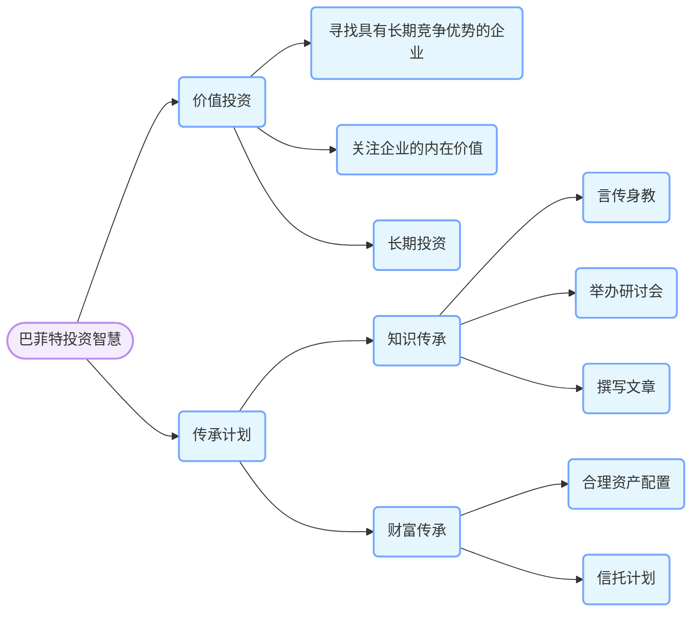

# 巴菲特的传承计划：如何传递投资智慧

> 关键词：巴菲特、传承计划、投资智慧、价值投资、财富传承

> 摘要：本文深入探讨了巴菲特的传承计划以及如何传递投资智慧这一核心主题。通过介绍背景信息，剖析核心概念，阐述相关算法原理与操作步骤，建立数学模型并举例说明，结合实际项目案例进行分析，探讨实际应用场景，推荐学习工具和资源，最后总结未来发展趋势与挑战，解答常见问题并提供扩展阅读与参考资料。旨在全面展现巴菲特投资智慧传承的全貌，为投资者和对投资传承感兴趣的人士提供深入且系统的参考。

## 1. 背景介绍 
### 1.1 目的和范围
本文章的主要目的是全面深入地研究巴菲特的传承计划以及他是如何将自己独特的投资智慧进行传递的。范围涵盖了巴菲特投资理念的核心内容、传承计划的具体策略和实施方式，以及这种传承对投资界和财富传承领域的影响。通过对相关资料的收集、整理和分析，揭示投资智慧传承背后的原理和方法，为投资者和关注财富传承的人群提供有价值的见解和指导。

### 1.2 预期读者
预期读者包括广大的投资者，无论是个人投资者还是专业投资机构的从业者，他们希望从巴菲特的传承计划中汲取投资智慧，提升自己的投资能力和决策水平。同时，也适合对财富传承感兴趣的家族企业所有者、高净值人士以及研究金融和投资领域的学者和学生，为他们在财富管理和传承方面提供参考和启示。

### 1.3 文档结构概述
本文首先介绍背景信息，让读者了解研究的目的、范围、预期读者和文档结构。接着阐述核心概念与联系，包括巴菲特投资智慧的核心要点以及传承计划的架构。然后讲解核心算法原理和具体操作步骤，用Python代码进行示例。之后建立数学模型和公式，并举例说明。再通过项目实战，展示代码实际案例并进行详细解释。探讨实际应用场景，推荐相关的工具和资源。最后总结未来发展趋势与挑战，解答常见问题并提供扩展阅读与参考资料。

### 1.4 术语表
#### 1.4.1 核心术语定义
- **价值投资**：是一种投资策略，强调通过对公司内在价值的评估，寻找被市场低估的股票进行投资，长期持有以获取价值回归带来的收益。
- **传承计划**：指为了将特定的知识、技能、财富等从一代人传递到下一代人而制定的一系列规划和策略。
- **投资智慧**：包含投资者在长期投资实践中积累的经验、知识、判断力和决策能力等综合素养。

#### 1.4.2 相关概念解释
- **护城河理论**：巴菲特提出的概念，指企业具有的一种可持续的竞争优势，如同城堡周围的护城河一样，能够保护企业在市场中抵御竞争对手的侵蚀，保持长期的盈利能力。
- **安全边际**：在价值投资中，安全边际是指股票的市场价格低于其内在价值的幅度。购买具有安全边际的股票可以降低投资风险，提高投资回报率。

#### 1.4.3 缩略词列表
- **ROE**：Return on Equity，净资产收益率，衡量企业盈利能力的重要指标，反映股东权益的收益水平。
- **PEG**：Price/Earnings to Growth ratio，市盈率相对盈利增长比率，用于评估股票的估值是否合理，综合考虑了公司的市盈率和盈利增长率。

## 2. 核心概念与联系 

### 巴菲特投资智慧的核心概念
巴菲特的投资智慧建立在价值投资的基础之上，其核心要点包括：
- **寻找具有长期竞争优势的企业**：巴菲特认为，优秀的企业应该具有宽阔的“护城河”，即可持续的竞争优势。这种竞争优势可以表现为品牌优势、成本优势、技术优势等。例如，可口可乐公司凭借其强大的品牌影响力，在全球饮料市场占据着主导地位，其品牌价值就是一种重要的“护城河”。
- **关注企业的内在价值**：内在价值是企业未来现金流的折现值。巴菲特通过深入研究企业的财务报表、行业前景、管理团队等因素，评估企业的内在价值。他认为，只有当股票的市场价格低于其内在价值时，才是值得投资的机会。
- **长期投资**：巴菲特主张长期持有优质股票，避免频繁交易。他认为，股票市场短期波动是不可预测的，但优秀企业的长期价值会随着时间的推移不断增长。例如，他长期持有富国银行、美国运通等公司的股票，获得了丰厚的回报。

### 传承计划的架构
巴菲特的传承计划主要包括两个方面：知识传承和财富传承。
- **知识传承**：通过言传身教、举办研讨会、撰写文章等方式，将自己的投资理念和经验传授给下一代投资者。例如，巴菲特每年都会发布致股东的信，分享自己的投资见解和对市场的看法。此外，他还会邀请年轻的投资者到伯克希尔·哈撒韦公司实习，让他们亲身感受和学习自己的投资方法。
- **财富传承**：通过合理的资产配置和信托计划，将自己的财富传递给下一代。巴菲特计划将自己的大部分财富捐赠给慈善事业，但同时也会为家人和后代保留一定的财富。他会根据不同的情况，制定个性化的财富传承方案，确保财富的安全和可持续增长。

### 核心概念的联系
巴菲特的投资智慧是其传承计划的核心内容，知识传承是为了让更多的人理解和掌握这些投资智慧，而财富传承则是投资智慧在实践中的体现和延续。通过知识传承，可以培养出更多具有投资智慧的人才，他们在实践中运用这些智慧进行投资，实现财富的增长，进而推动财富传承的顺利进行。同时，财富传承也为知识传承提供了物质基础，使得更多的人有机会接受投资教育和实践锻炼。

### 文本示意图
```plaintext
巴菲特投资智慧
|-- 价值投资
|   |-- 寻找具有长期竞争优势的企业
|   |-- 关注企业的内在价值
|   |-- 长期投资
|-- 传承计划
|   |-- 知识传承
|   |   |-- 言传身教
|   |   |-- 举办研讨会
|   |   |-- 撰写文章
|   |-- 财富传承
|       |-- 合理资产配置
|       |-- 信托计划
```

### Mermaid 流程图


## 3. 核心算法原理 & 具体操作步骤 

### 核心算法原理
在巴菲特的投资理念中，评估企业的内在价值是核心环节。一种常用的评估方法是现金流折现法（Discounted Cash Flow, DCF）。该方法的原理是将企业未来预计产生的现金流按照一定的折现率折现到当前时刻，从而得到企业的内在价值。

现金流折现法的基本公式为：
$$V = \sum_{t=1}^{n} \frac{CF_t}{(1 + r)^t}$$
其中，$V$ 表示企业的内在价值，$CF_t$ 表示第 $t$ 期的现金流，$r$ 表示折现率，$n$ 表示预测的期数。

### 具体操作步骤
1. **预测未来现金流**：通过对企业的历史财务数据、行业发展趋势、市场竞争状况等因素的分析，预测企业未来若干年的现金流。这需要对企业的业务模式、产品市场、成本结构等有深入的了解。
2. **确定折现率**：折现率反映了投资者对投资回报的要求，通常可以使用资本资产定价模型（Capital Asset Pricing Model, CAPM）来确定。CAPM 的公式为：
$$r = R_f + \beta (R_m - R_f)$$
其中，$r$ 表示折现率，$R_f$ 表示无风险利率，$\beta$ 表示股票的贝塔系数，$R_m$ 表示市场收益率。
3. **计算内在价值**：将预测的未来现金流按照确定的折现率折现到当前时刻，求和得到企业的内在价值。
4. **比较内在价值和市场价格**：如果企业的内在价值高于市场价格，则认为该股票被低估，具有投资价值；反之，则认为该股票被高估，不建议投资。

### Python 源代码实现
```python
import numpy as np

def calculate_dcf(cash_flows, discount_rate):
    """
    计算现金流折现法的内在价值
    :param cash_flows: 未来现金流列表
    :param discount_rate: 折现率
    :return: 内在价值
    """
    periods = np.arange(1, len(cash_flows) + 1)
    discounted_cash_flows = [cf / ((1 + discount_rate) ** t) for cf, t in zip(cash_flows, periods)]
    intrinsic_value = sum(discounted_cash_flows)
    return intrinsic_value

# 示例数据
cash_flows = [100, 120, 150, 180, 200]  # 未来 5 年的现金流
discount_rate = 0.1  # 折现率为 10%

# 计算内在价值
intrinsic_value = calculate_dcf(cash_flows, discount_rate)
print(f"企业的内在价值为: {intrinsic_value}")
```
### 代码解释
1. **函数定义**：`calculate_dcf` 函数接受两个参数：`cash_flows` 表示未来现金流列表，`discount_rate` 表示折现率。
2. **计算折现现金流**：使用列表推导式将未来现金流按照折现率折现到当前时刻。
3. **求和得到内在价值**：将折现后的现金流求和，得到企业的内在价值。
4. **示例数据**：定义了未来 5 年的现金流和折现率，并调用 `calculate_dcf` 函数计算内在价值。最后打印出计算结果。

## 4. 数学模型和公式 & 详细讲解 & 举例说明 

### 现金流折现法（DCF）公式
$$V = \sum_{t=1}^{n} \frac{CF_t}{(1 + r)^t}$$
- **详细讲解**：
  - $V$ 表示企业的内在价值，是我们最终要计算的结果。
  - $CF_t$ 表示第 $t$ 期的现金流，它反映了企业在该时期内实际产生的现金流入减去现金流出后的净额。现金流是企业价值的核心驱动因素，因为只有现金才能真正用于支付债务、进行再投资和分配给股东。
  - $r$ 表示折现率，它考虑了资金的时间价值和投资风险。折现率越高，说明投资者对投资回报的要求越高，未来现金流的现值就越低。
  - $n$ 表示预测的期数，通常根据企业的业务特点和行业发展趋势来确定。一般来说，预测期数越长，不确定性就越大。

### 资本资产定价模型（CAPM）公式
$$r = R_f + \beta (R_m - R_f)$$
- **详细讲解**：
  - $r$ 表示折现率，即投资者要求的预期回报率。
  - $R_f$ 表示无风险利率，通常可以使用国债收益率来近似代替。无风险利率反映了资金的基本时间价值。
  - $\beta$ 表示股票的贝塔系数，它衡量了股票相对于市场的波动程度。$\beta$ 值大于 1 表示股票的波动比市场大，风险也相对较高；$\beta$ 值小于 1 表示股票的波动比市场小，风险相对较低。
  - $R_m$ 表示市场收益率，通常可以使用股票市场指数的平均收益率来近似代替。$R_m - R_f$ 表示市场风险溢价，反映了投资者承担市场风险所要求的额外回报。

### 举例说明
假设我们要评估一家公司的内在价值，预测该公司未来 5 年的现金流分别为 100 万元、120 万元、150 万元、180 万元和 200 万元。无风险利率为 3%，市场收益率为 10%，该公司股票的贝塔系数为 1.2。

1. **计算折现率**：
使用 CAPM 公式计算折现率：
$$r = 0.03 + 1.2 \times (0.1 - 0.03) = 0.114$$
即折现率为 11.4%。

2. **计算内在价值**：
使用现金流折现法公式计算内在价值：
$$V = \frac{100}{(1 + 0.114)^1} + \frac{120}{(1 + 0.114)^2} + \frac{150}{(1 + 0.114)^3} + \frac{180}{(1 + 0.114)^4} + \frac{200}{(1 + 0.114)^5}$$
```python
import numpy as np

cash_flows = [100, 120, 150, 180, 200]
discount_rate = 0.114
periods = np.arange(1, len(cash_flows) + 1)
discounted_cash_flows = [cf / ((1 + discount_rate) ** t) for cf, t in zip(cash_flows, periods)]
intrinsic_value = sum(discounted_cash_flows)
print(f"企业的内在价值为: {intrinsic_value} 万元")
```
通过计算，得到该公司的内在价值约为 552.37 万元。如果该公司的市场价值低于这个数值，则可以认为该股票具有投资价值。

## 5. 项目实战：代码实际案例和详细解释说明 

### 5.1  开发环境搭建
为了实现巴菲特投资理念的相关代码，我们可以使用 Python 语言进行开发。以下是搭建开发环境的具体步骤：

1. **安装 Python**：访问 Python 官方网站（https://www.python.org/downloads/），根据自己的操作系统选择合适的 Python 版本进行下载和安装。建议安装 Python 3.7 及以上版本。
2. **安装开发工具**：可以选择使用 PyCharm、Jupyter Notebook 等开发工具。PyCharm 是一款功能强大的 Python 集成开发环境（IDE），适合开发大型项目；Jupyter Notebook 则是一个交互式的开发环境，适合进行数据分析和代码演示。
3. **安装必要的库**：在命令行中使用 `pip` 命令安装所需的库，例如 `numpy`、`pandas` 等。
```sh
pip install numpy pandas
```

### 5.2  源代码详细实现和代码解读
以下是一个使用 Python 实现的简单投资分析案例，通过计算股票的市盈率（PE）、市净率（PB）和净资产收益率（ROE）来评估股票的投资价值。

```python
import pandas as pd

# 定义股票数据
data = {
    '股票代码': ['000001', '000002', '000003'],
    '每股收益（元）': [1.2, 0.8, 1.5],
    '每股净资产（元）': [5, 4, 6],
    '股价（元）': [20, 15, 30]
}

# 创建 DataFrame
df = pd.DataFrame(data)

# 计算市盈率（PE）
df['市盈率（PE）'] = df['股价（元）'] / df['每股收益（元）']

# 计算市净率（PB）
df['市净率（PB）'] = df['股价（元）'] / df['每股净资产（元）']

# 计算净资产收益率（ROE）
df['净资产收益率（ROE）'] = df['每股收益（元）'] / df['每股净资产（元）']

# 筛选出符合条件的股票
# 假设我们选择市盈率低于 20，市净率低于 3，净资产收益率高于 0.1 的股票
selected_stocks = df[(df['市盈率（PE）'] < 20) & (df['市净率（PB）'] < 3) & (df['净资产收益率（ROE）'] > 0.1)]

print(selected_stocks)
```

### 代码解读
1. **导入必要的库**：使用 `import pandas as pd` 导入 `pandas` 库，用于数据处理和分析。
2. **定义股票数据**：创建一个字典 `data`，包含股票代码、每股收益、每股净资产和股价等信息。
3. **创建 DataFrame**：使用 `pd.DataFrame(data)` 将字典转换为 `pandas` 的 `DataFrame` 对象，方便进行数据操作。
4. **计算指标**：分别计算市盈率（PE）、市净率（PB）和净资产收益率（ROE），并将结果添加到 `DataFrame` 中。
5. **筛选股票**：使用布尔索引筛选出符合条件的股票，即市盈率低于 20，市净率低于 3，净资产收益率高于 0.1 的股票。
6. **打印结果**：打印筛选后的股票信息。

### 5.3  代码解读与分析
通过上述代码，我们可以快速计算出股票的关键指标，并筛选出符合投资条件的股票。市盈率（PE）反映了市场对公司盈利的预期，较低的市盈率可能意味着股票被低估；市净率（PB）衡量了股票价格相对于每股净资产的倍数，较低的市净率通常表示股票具有较高的安全边际；净资产收益率（ROE）则反映了公司的盈利能力，较高的 ROE 说明公司能够有效地利用股东的资金创造利润。

需要注意的是，这只是一个简单的投资分析案例，实际的投资决策需要考虑更多的因素，如公司的财务状况、行业前景、宏观经济环境等。此外，股票市场具有不确定性，投资决策应该谨慎做出。

## 6. 实际应用场景 
### 个人投资者
对于个人投资者来说，学习巴菲特的投资智慧和传承计划可以帮助他们建立正确的投资理念，避免盲目跟风和投机行为。个人投资者可以通过分析企业的基本面，寻找具有长期竞争优势和内在价值的股票，进行长期投资。同时，他们也可以借鉴巴菲特的传承计划，将自己的投资经验和财富传递给下一代，实现家族财富的可持续增长。

### 家族企业
家族企业在传承过程中面临着诸多挑战，如股权分配、管理交接、文化传承等。巴菲特的传承计划为家族企业提供了有益的借鉴。家族企业可以通过制定明确的传承规划，将企业的经营理念、管理经验和核心价值观传递给下一代，确保企业的稳定发展。此外，家族企业还可以借鉴巴菲特的投资策略，合理配置资产，实现企业财富的保值增值。

### 投资机构
投资机构可以将巴菲特的投资智慧融入到自己的投资策略中，提高投资决策的科学性和准确性。投资机构可以通过深入研究企业的基本面，挖掘被市场低估的投资机会，为客户创造更高的回报。同时，投资机构也可以开展相关的培训和教育活动，将巴菲特的投资理念传递给更多的投资者，提升整个投资行业的专业水平。

### 慈善事业
巴菲特计划将自己的大部分财富捐赠给慈善事业，这体现了他的社会责任感和慈善精神。他的传承计划也为慈善事业提供了新的思路和模式。慈善机构可以借鉴巴菲特的投资智慧，合理管理和运营慈善基金，实现慈善资金的保值增值，从而更好地服务社会公益事业。

## 7. 工具和资源推荐
### 7.1 学习资源推荐
#### 7.1.1 书籍推荐
- 《聪明的投资者》（The Intelligent Investor）：本杰明·格雷厄姆（Benjamin Graham）所著，被誉为投资界的圣经。这本书介绍了价值投资的基本原理和方法，对巴菲特的投资理念产生了深远的影响。
- 《巴菲特致股东的信：股份公司教程》（Letters to Shareholders of Berkshire Hathaway）：沃伦·巴菲特（Warren Buffett）撰写的一系列致股东的信，收录了他对投资、企业管理、财务等方面的深刻见解。通过阅读这些信件，读者可以深入了解巴菲特的投资智慧和决策思路。
- 《穷查理宝典：查理·芒格的智慧箴言录》（Poor Charlie's Almanack: The Wit and Wisdom of Charles T. Munger）：收录了查理·芒格（Charlie Munger）的演讲、文章和访谈等内容，展现了他的多元思维模型和投资哲学。芒格是巴菲特的长期合作伙伴，他的思想对巴菲特的投资决策也起到了重要的作用。

#### 7.1.2 在线课程
- Coursera 平台上的《投资学原理》（Principles of Investing）：由知名教授授课，系统介绍了投资学的基本概念、理论和方法，包括资产定价、投资组合管理、风险管理等内容。
- edX 平台上的《价值投资基础》（Foundations of Value Investing）：课程深入讲解了价值投资的核心原理和分析方法，通过实际案例分析帮助学员掌握价值投资的技巧。

#### 7.1.3 技术博客和网站
- 伯克希尔·哈撒韦公司官方网站（https://www.berkshirehathaway.com/）：可以获取巴菲特每年致股东的信、公司的财务报表、投资组合等重要信息。
- 雪球网（https://xueqiu.com/）：国内知名的投资社区，提供股票行情、财经新闻、投资分析等服务。用户可以在雪球网上关注巴菲特的投资动态，与其他投资者交流经验和心得。

### 7.2 开发工具框架推荐
#### 7.2.1 IDE和编辑器
- PyCharm：功能强大的 Python 集成开发环境，提供代码编辑、调试、版本控制等功能，适合开发大型的 Python 项目。
- Jupyter Notebook：交互式的开发环境，支持多种编程语言，适合进行数据分析、模型训练和代码演示。

#### 7.2.2 调试和性能分析工具
- pdb：Python 内置的调试器，可以帮助开发者定位和解决代码中的问题。
- cProfile：Python 标准库中的性能分析工具，可以分析代码的运行时间和函数调用情况，帮助开发者优化代码性能。

#### 7.2.3 相关框架和库
- pandas：用于数据处理和分析的 Python 库，提供了高效的数据结构和数据操作方法，方便处理股票数据、财务报表等。
- numpy：Python 的数值计算库，提供了高性能的多维数组对象和各种数学函数，用于进行数值计算和统计分析。

### 7.3 相关论文著作推荐
#### 7.3.1 经典论文
- 《证券分析》（Security Analysis）：本杰明·格雷厄姆和戴维·多德（David Dodd）合著的经典论文，奠定了价值投资的理论基础。论文提出了“内在价值”的概念，并介绍了评估企业内在价值的方法。
- 《有效市场假说》（Efficient Market Hypothesis）：由尤金·法玛（Eugene F. Fama）提出，该假说认为在有效市场中，股票价格已经反映了所有可用的信息，投资者无法通过分析历史数据或其他公开信息获得超额收益。虽然巴菲特的投资实践与有效市场假说存在一定的冲突，但该假说对投资理论的发展产生了重要的影响。

#### 7.3.2 最新研究成果
- 学术界对巴菲特投资策略的实证研究：近年来，许多学者通过实证分析的方法，研究巴菲特的投资策略在不同市场环境下的有效性和适应性。这些研究成果可以为投资者提供新的视角和参考。
- 关于财富传承的研究：随着家族企业和高净值人群的增加，财富传承问题受到了越来越多的关注。相关的研究成果可以帮助家族企业和个人制定更加合理的传承计划。

#### 7.3.3 应用案例分析
- 巴菲特投资案例分析：通过对巴菲特投资的具体案例进行深入分析，如投资可口可乐、富国银行等，可以了解他的投资决策过程和分析方法，为投资者提供实际操作的借鉴。
- 家族企业传承案例分析：研究国内外成功的家族企业传承案例，如杜邦家族、洛克菲勒家族等，可以学习他们在传承过程中的经验和教训，为家族企业的传承提供参考。

## 8. 总结：未来发展趋势与挑战
### 未来发展趋势
- **数字化转型**：随着科技的不断发展，投资领域也将迎来数字化转型。未来，投资者可以利用大数据、人工智能等技术，更加精准地分析企业的基本面和市场趋势，提高投资决策的效率和准确性。
- **社会责任投资**：越来越多的投资者开始关注企业的社会责任和可持续发展。未来，社会责任投资将成为一种重要的投资趋势，投资者将更加倾向于投资那些具有良好社会形象和环保意识的企业。
- **全球资产配置**：随着经济全球化的深入发展，投资者将更加注重全球资产配置。通过投资不同国家和地区的资产，可以降低投资风险，提高投资回报。

### 挑战
- **市场不确定性增加**：全球政治经济形势的不确定性增加，如贸易摩擦、地缘政治冲突等，将给投资市场带来更大的波动和风险。投资者需要更加谨慎地进行投资决策，做好风险管理。
- **技术变革带来的挑战**：科技的快速发展也给投资领域带来了新的挑战。例如，人工智能和量化投资的兴起，可能会导致市场竞争加剧，传统的投资策略面临失效的风险。投资者需要不断学习和更新知识，适应技术变革的趋势。
- **传承难度加大**：随着社会的发展和家族结构的变化，财富传承面临着越来越多的挑战。如何确保财富的安全和可持续增长，如何将投资智慧和家族文化传承给下一代，是家族企业和高净值人群需要解决的重要问题。

## 9. 附录：常见问题与解答
### 问题 1：巴菲特的投资理念是否适用于所有市场？
解答：巴菲特的投资理念强调价值投资和长期投资，其核心是寻找具有长期竞争优势和内在价值的企业。虽然这种理念在不同的市场环境中都有一定的适用性，但由于不同市场的特点和投资者行为存在差异，在应用时需要结合具体情况进行调整。例如，在新兴市场中，市场波动较大，信息不对称问题较为严重，投资者需要更加谨慎地评估企业的价值和风险。

### 问题 2：如何判断企业是否具有“护城河”？
解答：判断企业是否具有“护城河”可以从以下几个方面入手：
- **品牌优势**：企业是否拥有知名品牌，品牌是否具有较高的美誉度和忠诚度。
- **成本优势**：企业是否能够以较低的成本生产产品或提供服务，从而在市场竞争中占据优势。
- **技术优势**：企业是否拥有先进的技术和研发能力，是否能够不断推出新产品和服务。
- **网络效应**：企业的产品或服务是否具有网络效应，即随着用户数量的增加，产品或服务的价值也会不断提高。

### 问题 3：财富传承过程中需要注意哪些问题？
解答：财富传承过程中需要注意以下几个问题：
- **制定明确的传承规划**：提前制定详细的传承规划，明确传承的对象、方式和时间，避免传承过程中出现纠纷。
- **培养继承人的能力和素质**：继承人需要具备一定的投资知识、管理能力和社会责任感，因此需要提前进行培养和教育。
- **合理配置资产**：根据家族的风险承受能力和投资目标，合理配置资产，确保财富的安全和可持续增长。
- **考虑税收问题**：财富传承过程中可能会涉及到税收问题，需要提前进行规划和安排，降低税收负担。

## 10. 扩展阅读 & 参考资料
### 扩展阅读
- 《金融炼金术》（The Alchemy of Finance）：乔治·索罗斯（George Soros）所著，介绍了他的反身性理论和投资哲学，对理解金融市场的运行机制和投资决策有一定的启发。
- 《黑天鹅：如何应对不可预知的未来》（The Black Swan: The Impact of the Highly Improbable）：纳西姆·尼古拉斯·塔勒布（Nassim Nicholas Taleb）所著，探讨了不可预测的重大事件对金融市场和投资决策的影响，提醒投资者要做好风险管理。

### 参考资料
- 伯克希尔·哈撒韦公司历年年报和致股东的信。
- 相关学术期刊和研究报告，如《金融研究》、《经济研究》等。
- 财经媒体报道，如《华尔街日报》、《金融时报》、《中国证券报》等。

作者：AI天才研究院/AI Genius Institute & 禅与计算机程序设计艺术 /Zen And The Art of Computer Programming