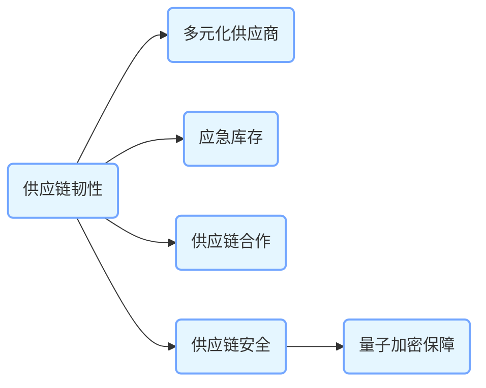

# 巴菲特的供应链韧性分析：量子加密在供应链安全中的应用

> 关键词：巴菲特、供应链韧性、量子加密、供应链安全、应用

> 摘要：本文围绕巴菲特所关注的供应链韧性展开，深入探讨量子加密在供应链安全中的应用。首先介绍了研究的背景、目的、预期读者等信息，接着阐述了供应链韧性和量子加密的核心概念及联系，详细讲解了量子加密的核心算法原理与操作步骤，给出了相关数学模型和公式并举例说明。通过项目实战展示了量子加密在供应链安全中的具体应用，分析了实际应用场景。同时推荐了相关的学习资源、开发工具框架和论文著作。最后总结了未来发展趋势与挑战，并提供常见问题解答和扩展阅读参考资料，旨在为提升供应链安全提供理论和实践上的指导。

## 1. 背景介绍 
### 1.1 目的和范围
本研究的主要目的是结合巴菲特对供应链韧性的观点，深入分析量子加密技术在供应链安全领域的应用。在当今全球化的商业环境下，供应链面临着诸多安全威胁，如数据泄露、恶意攻击等，而量子加密技术凭借其独特的优势为解决这些问题提供了新的思路。研究范围涵盖了供应链韧性的基本概念、量子加密技术的原理和算法、以及量子加密在供应链安全中的具体应用场景和实施方法。

### 1.2 预期读者
本文预期读者包括供应链管理领域的专业人士、信息技术专家、对量子计算和加密技术感兴趣的研究人员、以及关注企业供应链安全和风险管理的企业管理人员。这些读者可以从本文中获取关于供应链安全和量子加密技术的最新知识，为实际工作和研究提供参考。

### 1.3 文档结构概述
本文共分为十个部分。第一部分为背景介绍，阐述了研究的目的、范围、预期读者和文档结构；第二部分介绍供应链韧性和量子加密的核心概念及它们之间的联系；第三部分详细讲解量子加密的核心算法原理和具体操作步骤，并给出 Python 代码示例；第四部分给出量子加密相关的数学模型和公式，并进行详细讲解和举例说明；第五部分通过项目实战展示量子加密在供应链安全中的应用，包括开发环境搭建、源代码实现和代码解读；第六部分分析量子加密在供应链安全中的实际应用场景；第七部分推荐相关的学习资源、开发工具框架和论文著作；第八部分总结量子加密在供应链安全中的未来发展趋势与挑战；第九部分为附录，提供常见问题与解答；第十部分列出扩展阅读和参考资料。

### 1.4 术语表
#### 1.4.1 核心术语定义
- **供应链韧性**：指供应链在面临内外部干扰（如自然灾害、经济危机、网络攻击等）时，能够快速恢复到正常运营状态，并在必要时进行适应性调整以维持其功能和绩效的能力。
- **量子加密**：基于量子力学原理的加密技术，利用量子态的特性（如量子纠缠、量子不可克隆定理等）来实现信息的安全传输和加密，具有极高的安全性。
- **供应链安全**：指保护供应链中的信息、资产和流程免受各种安全威胁（如数据泄露、恶意攻击、假冒伪劣产品等）的影响，确保供应链的正常运行和可靠性。

#### 1.4.2 相关概念解释
- **量子态**：量子系统的状态，是量子力学中的基本概念。量子态可以用波函数来描述，具有叠加、纠缠等特性。
- **量子纠缠**：是一种量子力学现象，指两个或多个量子系统之间存在一种特殊的关联，使得一个量子系统的状态变化会瞬间影响到其他与之纠缠的量子系统的状态，无论它们之间的距离有多远。
- **量子不可克隆定理**：指在量子力学中，不可能对任意一个未知的量子态进行精确的复制。这一特性为量子加密提供了理论基础，确保了量子密钥的安全性。

#### 1.4.3 缩略词列表
- **QKD**：Quantum Key Distribution，量子密钥分发，是一种基于量子力学原理的密钥分发技术，用于在通信双方之间安全地共享密钥。
- **VPN**：Virtual Private Network，虚拟专用网络，通过公共网络建立安全的专用通信通道，常用于企业内部网络的远程访问和数据传输。

## 2. 核心概念与联系 

### 供应链韧性
供应链韧性是现代供应链管理中的一个重要概念。在全球化的背景下，供应链变得越来越复杂，涉及到众多的供应商、制造商、物流商和零售商等环节。任何一个环节出现问题，都可能对整个供应链的正常运行产生影响。因此，提高供应链的韧性至关重要。

供应链韧性的提升可以通过多种方式实现，如多元化供应商、建立应急库存、加强供应链伙伴之间的合作等。同时，保障供应链的安全也是提高供应链韧性的关键因素之一。如果供应链中的信息和数据遭到泄露或篡改，可能会导致供应链的混乱和中断，从而降低供应链的韧性。

### 量子加密
量子加密是一种基于量子力学原理的加密技术，它利用量子态的特性来实现信息的安全传输和加密。与传统的加密技术相比，量子加密具有更高的安全性。传统加密技术的安全性往往基于数学难题，如大整数分解、离散对数等，但随着计算机计算能力的不断提高，这些数学难题可能会被破解。而量子加密则是基于量子力学的基本原理，如量子不可克隆定理和量子纠缠，这些原理是由物理定律所保证的，具有天然的安全性。

### 核心概念联系
量子加密技术可以为供应链安全提供强大的保障，从而提升供应链的韧性。在供应链中，涉及到大量的敏感信息，如订单信息、物流信息、产品设计图纸等。这些信息的安全对于供应链的正常运行至关重要。通过使用量子加密技术，可以确保这些信息在传输和存储过程中的安全性，防止信息泄露和篡改。

例如，在供应链的物流环节，通过量子加密技术可以对货物的运输信息进行加密，确保货物的运输路径、到达时间等信息不被泄露。在供应商与制造商之间的通信中，使用量子加密技术可以保证订单信息的真实性和完整性，防止中间人攻击。

### 文本示意图
```plaintext
供应链韧性
├── 多元化供应商
├── 应急库存
├── 供应链合作
└── 供应链安全
    └── 量子加密保障
```

### Mermaid 流程图


## 3. 核心算法原理 & 具体操作步骤 

### 量子密钥分发（QKD）算法原理
量子密钥分发是量子加密技术中的核心算法之一，其最著名的协议是 BB84 协议。BB84 协议的基本原理是利用光子的偏振态来编码信息，并通过量子信道进行传输。

#### 基本步骤
1. **发送方准备量子态**：发送方（通常称为 Alice）随机选择一组偏振基（如水平/垂直偏振基或 +45°/-45°偏振基），并根据要发送的比特信息（0 或 1）制备相应的光子偏振态。例如，在水平/垂直偏振基中，水平偏振表示 0，垂直偏振表示 1；在 +45°/-45°偏振基中，+45°偏振表示 0，-45°偏振表示 1。
2. **发送量子态**：Alice 通过量子信道将制备好的光子发送给接收方（通常称为 Bob）。
3. **接收方测量量子态**：Bob 随机选择一组偏振基对接收到的光子进行测量。由于量子态的测量结果是随机的，只有当 Bob 选择的偏振基与 Alice 制备光子时使用的偏振基相同时，测量结果才与 Alice 发送的比特信息一致。
4. **基比对**：Bob 通过经典信道告诉 Alice 他所使用的偏振基，Alice 则告诉 Bob 哪些基是正确的。双方只保留使用相同基进行测量的结果，这些结果构成了初始密钥。
5. **纠错和隐私放大**：为了确保密钥的准确性和安全性，双方还需要进行纠错和隐私放大操作。纠错是通过经典信道交换部分密钥信息来检测和纠正可能存在的错误；隐私放大则是通过哈希函数等方法进一步压缩密钥，去除可能被窃听者获取的信息。

### Python 代码实现

```python
import random

# 定义偏振基
BASES = ['X', 'Z']
# 定义偏振态
STATES = {
    ('Z', 0): '|0>',
    ('Z', 1): '|1>',
    ('X', 0): '|+>',
    ('X', 1): '|->'
}

# 生成随机比特序列
def generate_random_bits(length):
    return [random.randint(0, 1) for _ in range(length)]

# 生成随机基序列
def generate_random_bases(length):
    return [random.choice(BASES) for _ in range(length)]

# 制备量子态
def prepare_states(bits, bases):
    return [STATES[(bases[i], bits[i])] for i in range(len(bits))]

# 测量量子态
def measure_states(states, bases):
    measured_bits = []
    for i in range(len(states)):
        if bases[i] == 'Z':
            if states[i] == '|0>':
                measured_bits.append(0)
            elif states[i] == '|1>':
                measured_bits.append(1)
            else:
                # 如果基不匹配，随机测量结果
                measured_bits.append(random.randint(0, 1))
        elif bases[i] == 'X':
            if states[i] == '|+>':
                measured_bits.append(0)
            elif states[i] == '|->':
                measured_bits.append(1)
            else:
                # 如果基不匹配，随机测量结果
                measured_bits.append(random.randint(0, 1))
    return measured_bits

# 基比对
def sift_bits(alice_bases, bob_bases, alice_bits, bob_bits):
    sifted_alice_bits = []
    sifted_bob_bits = []
    for i in range(len(alice_bases)):
        if alice_bases[i] == bob_bases[i]:
            sifted_alice_bits.append(alice_bits[i])
            sifted_bob_bits.append(bob_bits[i])
    return sifted_alice_bits, sifted_bob_bits

# 主函数
def bb84_protocol(length):
    # 生成随机比特和基
    alice_bits = generate_random_bits(length)
    alice_bases = generate_random_bases(length)
    bob_bases = generate_random_bases(length)
    
    # 制备和测量量子态
    states = prepare_states(alice_bits, alice_bases)
    bob_measured_bits = measure_states(states, bob_bases)
    
    # 基比对
    sifted_alice_bits, sifted_bob_bits = sift_bits(alice_bases, bob_bases, alice_bits, bob_measured_bits)
    
    return sifted_alice_bits, sifted_bob_bits

# 示例运行
key_length = 100
alice_key, bob_key = bb84_protocol(key_length)
print("Alice's sifted key:", alice_key)
print("Bob's sifted key:", bob_key)
```

### 代码解释
1. **生成随机比特和基**：`generate_random_bits` 函数用于生成指定长度的随机比特序列，`generate_random_bases` 函数用于生成随机的偏振基序列。
2. **制备量子态**：`prepare_states` 函数根据发送方的比特信息和基信息制备相应的量子态。
3. **测量量子态**：`measure_states` 函数根据接收方选择的基对量子态进行测量，并返回测量结果。如果接收方选择的基与发送方制备量子态时使用的基不匹配，则测量结果是随机的。
4. **基比对**：`sift_bits` 函数通过比较发送方和接收方使用的基，只保留使用相同基进行测量的结果，从而得到筛选后的密钥。
5. **主函数**：`bb84_protocol` 函数将上述步骤整合在一起，完成整个 BB84 协议的执行，并返回筛选后的密钥。

## 4. 数学模型和公式 & 详细讲解 & 举例说明 

### 量子态的表示
在量子力学中，量子态可以用向量来表示。例如，在二维希尔伯特空间中，一个量子比特的状态可以用基态 $|0\rangle$ 和 $|1\rangle$ 的线性组合来表示：

$$|\psi\rangle = \alpha|0\rangle + \beta|1\rangle$$

其中，$\alpha$ 和 $\beta$ 是复数，且满足 $|\alpha|^2 + |\beta|^2 = 1$。$|\alpha|^2$ 表示测量量子比特得到 $|0\rangle$ 态的概率，$|\beta|^2$ 表示测量量子比特得到 $|1\rangle$ 态的概率。

### BB84 协议的数学原理
在 BB84 协议中，发送方（Alice）随机选择两个正交基：标准基 $\{|0\rangle, |1\rangle\}$ 和对角基 $\{|+\rangle, |-\rangle\}$，其中：

$$|+\rangle = \frac{1}{\sqrt{2}}(|0\rangle + |1\rangle)$$
$$|-\rangle = \frac{1}{\sqrt{2}}(|0\rangle - |1\rangle)$$

Alice 根据要发送的比特信息选择相应的基和态进行制备。例如，如果要发送比特 0，她可以选择标准基并制备 $|0\rangle$ 态，或者选择对角基并制备 $|+\rangle$ 态；如果要发送比特 1，她可以选择标准基并制备 $|1\rangle$ 态，或者选择对角基并制备 $|-\rangle$ 态。

接收方（Bob）也随机选择一个基进行测量。如果 Bob 选择的基与 Alice 制备态时使用的基相同，那么测量结果将准确地反映 Alice 发送的比特信息；如果基不同，那么测量结果将是随机的。

### 举例说明
假设 Alice 要发送比特序列 `[0, 1, 0]`，她随机选择的基序列为 `['Z', 'X', 'Z']`。根据上述规则，她制备的量子态序列为 `[|0>, |->, |0>]`。

Bob 随机选择的基序列为 `['Z', 'Z', 'X']`。他对接收到的量子态进行测量：
- 对于第一个量子态 $|0\rangle$，Bob 使用标准基 `Z` 进行测量，测量结果为 0。
- 对于第二个量子态 $|-\rangle$，Bob 使用标准基 `Z` 进行测量，测量结果是随机的，假设为 1。
- 对于第三个量子态 $|0\rangle$，Bob 使用对角基 `X` 进行测量，测量结果是随机的，假设为 0。

然后，Bob 通过经典信道告诉 Alice 他所使用的基，Alice 告诉 Bob 哪些基是正确的。在这个例子中，第一个基是相同的，所以双方保留第一个测量结果，得到筛选后的密钥比特为 `[0]`。

## 5. 项目实战：代码实际案例和详细解释说明 

### 5.1  开发环境搭建
#### 硬件环境
- **计算机**：建议使用性能较好的台式机或笔记本电脑，具备多核处理器和足够的内存（至少 8GB）。
- **量子通信设备**：如果要进行实际的量子密钥分发实验，需要配备量子通信设备，如单光子源、光子探测器等。在本项目实战中，我们主要进行模拟实验，暂不需要实际的量子通信设备。

#### 软件环境
- **操作系统**：推荐使用 Linux 系统（如 Ubuntu）或 macOS，也可以使用 Windows 系统。
- **Python 环境**：安装 Python 3.7 及以上版本，可以使用 Anaconda 来管理 Python 环境。
- **开发工具**：可以使用 PyCharm、Jupyter Notebook 等开发工具进行代码编写和调试。

#### 安装依赖库
在项目中，我们主要使用 Python 的标准库，不需要额外安装其他依赖库。如果需要进行更复杂的实验和模拟，可以安装一些科学计算库，如 NumPy、SciPy 等。可以使用以下命令安装：

```bash
pip install numpy scipy
```

### 5.2  源代码详细实现和代码解读
我们将基于前面介绍的 BB84 协议的 Python 代码进行扩展，实现一个简单的量子密钥分发系统，并使用生成的密钥对明文信息进行加密和解密。

```python
import random
from Crypto.Cipher import AES
from Crypto.Util.Padding import pad, unpad

# 定义偏振基
BASES = ['X', 'Z']
# 定义偏振态
STATES = {
    ('Z', 0): '|0>',
    ('Z', 1): '|1>',
    ('X', 0): '|+>',
    ('X', 1): '|->'
}

# 生成随机比特序列
def generate_random_bits(length):
    return [random.randint(0, 1) for _ in range(length)]

# 生成随机基序列
def generate_random_bases(length):
    return [random.choice(BASES) for _ in range(length)]

# 制备量子态
def prepare_states(bits, bases):
    return [STATES[(bases[i], bits[i])] for i in range(len(bits))]

# 测量量子态
def measure_states(states, bases):
    measured_bits = []
    for i in range(len(states)):
        if bases[i] == 'Z':
            if states[i] == '|0>':
                measured_bits.append(0)
            elif states[i] == '|1>':
                measured_bits.append(1)
            else:
                # 如果基不匹配，随机测量结果
                measured_bits.append(random.randint(0, 1))
        elif bases[i] == 'X':
            if states[i] == '|+>':
                measured_bits.append(0)
            elif states[i] == '|->':
                measured_bits.append(1)
            else:
                # 如果基不匹配，随机测量结果
                measured_bits.append(random.randint(0, 1))
    return measured_bits

# 基比对
def sift_bits(alice_bases, bob_bases, alice_bits, bob_bits):
    sifted_alice_bits = []
    sifted_bob_bits = []
    for i in range(len(alice_bases)):
        if alice_bases[i] == bob_bases[i]:
            sifted_alice_bits.append(alice_bits[i])
            sifted_bob_bits.append(bob_bits[i])
    return sifted_alice_bits, sifted_bob_bits

# 将比特序列转换为字节序列
def bits_to_bytes(bits):
    num_bytes = len(bits) // 8
    byte_list = []
    for i in range(num_bytes):
        byte = 0
        for j in range(8):
            byte = (byte << 1) | bits[i * 8 + j]
        byte_list.append(byte)
    return bytes(byte_list)

# 量子密钥分发协议
def bb84_protocol(length):
    # 生成随机比特和基
    alice_bits = generate_random_bits(length)
    alice_bases = generate_random_bases(length)
    bob_bases = generate_random_bases(length)
    
    # 制备和测量量子态
    states = prepare_states(alice_bits, alice_bases)
    bob_measured_bits = measure_states(states, bob_bases)
    
    # 基比对
    sifted_alice_bits, sifted_bob_bits = sift_bits(alice_bases, bob_bases, alice_bits, bob_measured_bits)
    
    return sifted_alice_bits, sifted_bob_bits

# 使用 AES 加密信息
def encrypt_message(message, key):
    cipher = AES.new(key, AES.MODE_ECB)
    padded_message = pad(message.encode(), AES.block_size)
    encrypted_message = cipher.encrypt(padded_message)
    return encrypted_message

# 使用 AES 解密信息
def decrypt_message(encrypted_message, key):
    cipher = AES.new(key, AES.MODE_ECB)
    decrypted_message = cipher.decrypt(encrypted_message)
    unpadded_message = unpad(decrypted_message, AES.block_size)
    return unpadded_message.decode()

# 主函数
def main():
    key_length = 256  # 密钥长度为 256 比特
    alice_key_bits, bob_key_bits = bb84_protocol(key_length)
    
    # 将比特序列转换为字节序列
    alice_key_bytes = bits_to_bytes(alice_key_bits)
    bob_key_bytes = bits_to_bytes(bob_key_bits)
    
    # 确保密钥长度为 16、24 或 32 字节
    alice_key_bytes = alice_key_bytes[:32]
    bob_key_bytes = bob_key_bytes[:32]
    
    # 明文信息
    message = "Hello, Quantum Encryption in Supply Chain!"
    
    # 加密信息
    encrypted_message = encrypt_message(message, alice_key_bytes)
    
    # 解密信息
    decrypted_message = decrypt_message(encrypted_message, bob_key_bytes)
    
    print("Original message:", message)
    print("Encrypted message:", encrypted_message)
    print("Decrypted message:", decrypted_message)

if __name__ == "__main__":
    main()
```

### 5.3  代码解读与分析
1. **量子密钥分发部分**：代码中的 `bb84_protocol` 函数实现了 BB84 协议的主要步骤，包括生成随机比特和基、制备和测量量子态、基比对等，最终得到筛选后的密钥比特序列。
2. **比特序列转换为字节序列**：`bits_to_bytes` 函数将筛选后的密钥比特序列转换为字节序列，以便后续使用 AES 加密算法进行加密和解密。
3. **AES 加密和解密**：`encrypt_message` 函数使用 AES 加密算法对明文信息进行加密，`decrypt_message` 函数使用相同的密钥对加密信息进行解密。
4. **主函数**：`main` 函数将上述步骤整合在一起，完成量子密钥分发、信息加密和解密的整个过程，并输出原始信息、加密信息和解密信息。

### 安全性分析
在这个项目中，量子密钥分发的安全性基于量子力学的基本原理，如量子不可克隆定理。只要量子信道没有被干扰，窃听者无法获取密钥信息。而 AES 加密算法是一种广泛使用的对称加密算法，具有较高的安全性。因此，整个系统在理论上可以提供较高的信息安全保障。

## 6. 实际应用场景 
### 供应链金融
在供应链金融中，涉及到大量的资金交易和敏感信息，如企业的财务报表、信用评级等。量子加密技术可以用于保障这些信息在供应链金融平台上的安全传输和存储。例如，银行在为供应链中的企业提供贷款时，通过量子加密技术可以确保企业提交的财务信息不被泄露，同时也可以保证贷款合同等重要文件的真实性和完整性。

### 物流跟踪
在供应链的物流环节，货物的运输信息需要实时跟踪和共享。通过量子加密技术，可以对物流信息进行加密，确保货物的运输路径、到达时间等信息不被泄露。同时，量子加密还可以防止物流信息被篡改，保证物流信息的准确性和可靠性。例如，在跨境物流中，海关、货代、物流公司等各方可以通过量子加密技术实现信息的安全共享，提高物流效率和安全性。

### 供应商与制造商之间的通信
供应商与制造商之间的通信涉及到订单信息、产品设计图纸、生产计划等敏感信息。使用量子加密技术可以保证这些信息在传输过程中的安全性，防止中间人攻击。例如，制造商向供应商发送订单信息时，通过量子加密技术可以确保订单信息不被窃取或篡改，从而保证供应链的正常运行。

### 产品溯源
在供应链中，产品溯源是保障产品质量和安全的重要手段。通过量子加密技术，可以对产品的溯源信息进行加密，确保消费者能够获取到真实可靠的产品信息。例如，在食品供应链中，消费者可以通过扫描产品上的二维码，获取到食品的产地、生产日期、加工过程等信息，而这些信息是经过量子加密保护的，无法被篡改。

## 7. 工具和资源推荐
### 7.1 学习资源推荐
#### 7.1.1 书籍推荐
- 《量子计算与量子信息》（*Quantum Computation and Quantum Information*）：由 Michael A. Nielsen 和 Isaac L. Chuang 所著，是量子计算和量子信息领域的经典教材，全面介绍了量子计算的基本原理、算法和应用。
- 《密码学原理与实践》（*Cryptography: Theory and Practice*）：由 Douglas R. Stinson 所著，详细介绍了密码学的基本概念、算法和协议，包括对称加密、非对称加密、哈希函数等内容。
- 《供应链管理：战略、规划与运营》（*Supply Chain Management: Strategy, Planning, and Operation*）：由 Sunil Chopra 和 Peter Meindl 所著，是供应链管理领域的经典教材，涵盖了供应链战略、采购、生产、物流等方面的内容。

#### 7.1.2 在线课程
- Coursera 上的 “Quantum Computing for Everyone” 课程：由 University of Maryland 提供，适合初学者了解量子计算的基本概念和原理。
- edX 上的 “Introduction to Cryptography” 课程：由 Stanford University 提供，介绍了密码学的基本原理和应用。
- Coursera 上的 “Supply Chain Analytics” 课程：由 University of Colorado Boulder 提供，讲解了供应链分析的方法和技术。

#### 7.1.3 技术博客和网站
- Quantum Computing Report：提供量子计算领域的最新新闻、技术分析和研究报告。
- Cryptography Stack Exchange：一个关于密码学的问答社区，用户可以在这里提问、分享经验和获取最新的密码学知识。
- Supply Chain Dive：专注于供应链管理领域的新闻和分析，提供供应链行业的最新动态和趋势。

### 7.2 开发工具框架推荐
#### 7.2.1 IDE和编辑器
- PyCharm：一款功能强大的 Python 集成开发环境，提供代码编辑、调试、版本控制等功能，适合开发 Python 项目。
- Jupyter Notebook：一种交互式的开发环境，支持多种编程语言，适合进行数据分析、算法验证和代码演示。
- Visual Studio Code：一款轻量级的代码编辑器，支持多种编程语言和插件扩展，具有丰富的代码编辑和调试功能。

#### 7.2.2 调试和性能分析工具
- PDB：Python 的内置调试器，可以帮助开发者定位代码中的错误和问题。
- cProfile：Python 的性能分析工具，可以分析代码的运行时间和函数调用次数，帮助开发者优化代码性能。
- Py-Spy：一个用于分析 Python 程序性能的工具，可以实时监控 Python 程序的 CPU 使用率和函数调用情况。

#### 7.2.3 相关框架和库
- Qiskit：IBM 开发的开源量子计算框架，提供了量子算法、量子电路模拟等功能，方便开发者进行量子计算实验和开发。
- Cryptography：Python 的加密库，提供了多种加密算法和协议的实现，如 AES、RSA、SHA 等。
- NumPy 和 SciPy：Python 的科学计算库，提供了高效的数组操作和数学计算功能，适合进行量子算法的模拟和实验。

### 7.3 相关论文著作推荐
#### 7.3.1 经典论文
- “Quantum cryptography based on Bell's theorem”：由 Artur K. Ekert 发表于 1991 年，提出了基于贝尔定理的量子密码学方案。
- “A public key cryptosystem and a signature scheme based on discrete logarithms”：由 Taher ElGamal 发表于 1985 年，介绍了基于离散对数的公钥加密算法和签名方案。
- “Supply chain resilience: Definition, review and research agenda”：由 J. Christopher 和 M. Peck 发表于 2004 年，对供应链韧性的概念进行了定义和综述，并提出了研究议程。

#### 7.3.2 最新研究成果
- 关注 Quantum Information Processing、IEEE Transactions on Information Theory 等学术期刊，这些期刊经常发表量子计算和密码学领域的最新研究成果。
- 参加量子计算和供应链管理领域的国际学术会议，如 Quantum Computing Technology Conference、Council of Supply Chain Management Professionals (CSCMP) Annual Conference 等，了解最新的研究动态和趋势。

#### 7.3.3 应用案例分析
- 一些知名企业的案例研究，如 IBM 在量子计算领域的应用案例、华为在供应链安全管理方面的实践经验等。可以通过企业的官方网站、学术论文和行业报告等渠道获取相关信息。

## 8. 总结：未来发展趋势与挑战
### 未来发展趋势
#### 量子加密技术的普及
随着量子计算技术的不断发展和成熟，量子加密技术将逐渐得到更广泛的应用。在供应链安全领域，越来越多的企业将采用量子加密技术来保障供应链中的信息安全，提高供应链的韧性。

#### 供应链数字化转型
供应链数字化转型是未来的发展趋势，量子加密技术将与其他数字化技术（如区块链、物联网、大数据等）相结合，共同推动供应链的智能化和安全化发展。例如，量子加密可以为区块链上的交易信息提供更高的安全性，物联网设备之间的通信可以通过量子加密技术进行保护。

#### 国际合作与标准制定
量子加密技术是一个全球性的研究领域，国际合作将变得越来越重要。各国政府和企业将加强在量子加密技术研发、应用和标准制定方面的合作，推动量子加密技术的国际标准化进程，促进全球供应链的安全和稳定。

### 挑战
#### 技术成本
目前，量子加密技术的实现成本较高，包括量子通信设备的研发和生产成本、量子密钥分发系统的运营成本等。降低技术成本是推广量子加密技术在供应链安全中应用的关键挑战之一。

#### 技术兼容性
在供应链中，已经存在大量的传统信息系统和通信协议。如何实现量子加密技术与这些传统系统的兼容性，是一个需要解决的问题。需要开发相应的接口和转换技术，确保量子加密技术能够无缝集成到现有的供应链信息系统中。

#### 人才短缺
量子加密技术是一个新兴的领域，相关的专业人才相对短缺。培养和吸引量子计算、密码学和供应链管理等领域的专业人才，是推动量子加密技术在供应链安全中应用的重要保障。

## 9. 附录：常见问题与解答
### 1. 量子加密技术与传统加密技术有什么区别？
量子加密技术基于量子力学原理，如量子不可克隆定理和量子纠缠，具有天然的安全性。而传统加密技术的安全性往往基于数学难题，随着计算机计算能力的不断提高，这些数学难题可能会被破解。此外，量子加密技术可以检测到窃听者的存在，而传统加密技术很难做到这一点。

### 2. 量子加密技术在供应链安全中的应用是否成熟？
目前，量子加密技术在供应链安全中的应用还处于起步阶段。虽然量子加密技术在理论上具有很高的安全性，但在实际应用中还面临一些技术和成本方面的挑战。随着技术的不断发展和成本的降低，量子加密技术在供应链安全中的应用将逐渐成熟。

### 3. 量子密钥分发系统的安全性如何保障？
量子密钥分发系统的安全性基于量子力学的基本原理。在量子密钥分发过程中，窃听者无法在不干扰量子态的情况下获取密钥信息，一旦窃听者进行窃听，就会被通信双方检测到。此外，量子密钥分发系统还需要进行纠错和隐私放大等操作，以确保密钥的准确性和安全性。

### 4. 如何选择适合的量子加密技术应用于供应链安全？
选择适合的量子加密技术需要考虑多个因素，如供应链的规模、安全需求、成本预算等。对于大型供应链企业，可以考虑采用量子密钥分发系统来保障供应链中的信息安全；对于小型企业，可以选择一些基于量子加密算法的软件解决方案。同时，还需要考虑量子加密技术与现有信息系统的兼容性。

### 5. 量子加密技术的发展对供应链管理会产生哪些影响？
量子加密技术的发展将为供应链管理带来更高的信息安全保障，提高供应链的韧性。通过保障供应链中的信息安全，可以减少信息泄露和篡改的风险，降低供应链中断的可能性。此外，量子加密技术还将推动供应链的数字化转型，促进供应链的智能化和安全化发展。

## 10. 扩展阅读 & 参考资料
### 扩展阅读
- 《量子霸权：开启未来世界新图景》：介绍了量子计算和量子技术的发展现状和未来趋势，以及它们对各个领域的影响。
- 《供应链的未来：数字化转型与智能化升级》：探讨了供应链数字化转型的趋势和方法，以及如何利用新兴技术提升供应链的竞争力。
- 《密码朋克：自由与互联网的未来》：讲述了密码学在互联网发展中的重要作用，以及密码朋克运动对现代社会的影响。

### 参考资料
- Nielsen, M. A., & Chuang, I. L. (2010). *Quantum Computation and Quantum Information*. Cambridge University Press.
- Stinson, D. R. (2005). *Cryptography: Theory and Practice*. Chapman & Hall/CRC.
- Chopra, S., & Meindl, P. (2016). *Supply Chain Management: Strategy, Planning, and Operation*. Pearson.
- Ekert, A. K. (1991). Quantum cryptography based on Bell's theorem. *Physical Review Letters*, 67(6), 661-663.
- ElGamal, T. (1985). A public key cryptosystem and a signature scheme based on discrete logarithms. *IEEE Transactions on Information Theory*, 31(4), 469-472.
- Christopher, M., & Peck, H. (2004). Supply chain resilience: Definition, review and research agenda. *International Journal of Physical Distribution & Logistics Management*, 34(6), 537-552.

作者：AI天才研究院/AI Genius Institute & 禅与计算机程序设计艺术 /Zen And The Art of Computer Programming