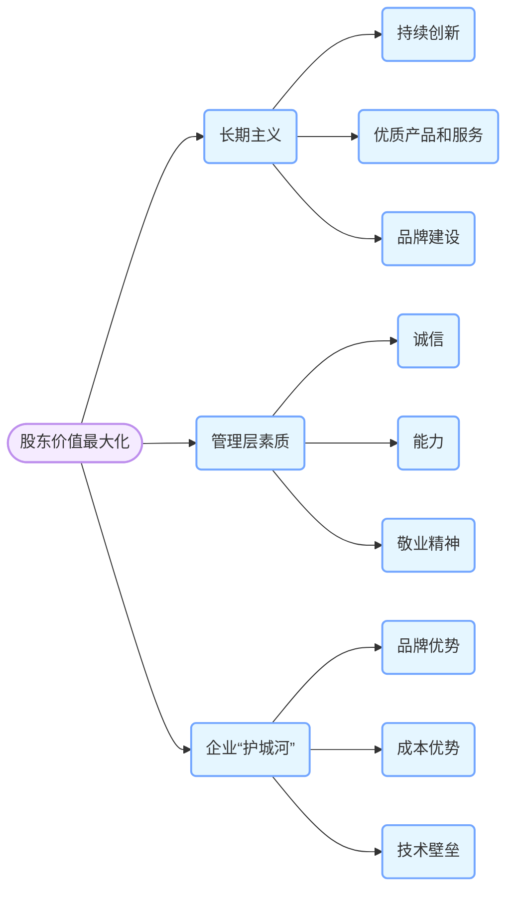

# 巴菲特的公司治理观点

> 关键词：巴菲特、公司治理、股东价值、长期主义、管理层激励

> 摘要：本文深入探讨了巴菲特的公司治理观点。从背景介绍入手，阐述了研究巴菲特公司治理观点的目的、范围、预期读者等内容。详细剖析了巴菲特公司治理核心概念与联系，包括股东导向、管理层素质等方面。介绍了其在公司治理中可能涉及的核心算法原理及操作步骤，通过数学模型和公式对相关理念进行量化说明。结合项目实战，给出了基于巴菲特观点的公司治理实际案例及代码解读。分析了其公司治理观点的实际应用场景，推荐了学习相关知识的工具和资源，最后总结了未来发展趋势与挑战，解答常见问题并提供扩展阅读和参考资料，旨在为读者全面呈现巴菲特公司治理观点的精髓与应用。

## 1. 背景介绍 
### 1.1 目的和范围
本部分旨在深入探究巴菲特的公司治理观点，明确研究的目标是全面理解巴菲特所倡导的公司治理理念、方法及其背后的逻辑。范围涵盖了巴菲特在不同场合对公司治理发表的言论、伯克希尔·哈撒韦公司的实际治理实践，以及这些观点对全球公司治理领域产生的影响。通过对这些内容的研究，我们可以从中汲取有益的经验，为企业的治理和发展提供参考。

### 1.2 预期读者
预期读者包括企业管理者、投资者、公司治理研究人员以及对商业和投资领域感兴趣的人士。企业管理者可以从巴菲特的观点中获取提升公司治理水平的思路和方法；投资者可以借助这些观点评估企业的投资价值；研究人员则可以将其作为学术研究的重要案例；而普通的商业爱好者也能通过了解巴菲特的智慧，拓宽对公司治理的认知。

### 1.3 文档结构概述
本文将按照以下结构展开：首先介绍核心概念与联系，梳理巴菲特公司治理观点中的关键概念及其相互关系；接着阐述核心算法原理和具体操作步骤，虽然公司治理并非传统意义上的算法问题，但我们可以用类似的逻辑来分析其中的决策过程；然后通过数学模型和公式对相关观点进行量化说明，并举例阐释；之后进行项目实战，结合实际案例分析如何应用巴菲特的公司治理观点；再探讨其实际应用场景；推荐学习相关知识的工具和资源；最后总结未来发展趋势与挑战，解答常见问题并提供扩展阅读和参考资料。

### 1.4 术语表
#### 1.4.1 核心术语定义
- **股东价值最大化**：指公司的经营决策和管理活动应以增加股东的财富为首要目标，通过提高公司的盈利能力、市场竞争力等方式，使股东获得最大的回报。
- **长期主义**：强调在公司治理和经营过程中，关注企业的长期发展，而不是追求短期的利益。通过制定长期战略、持续投入研发等方式，为企业的可持续发展奠定基础。
- **管理层激励**：为了促使管理层更好地为公司和股东利益服务，采用的一系列激励措施，如股票期权、奖金等，将管理层的利益与公司的业绩挂钩。

#### 1.4.2 相关概念解释
- **护城河理论**：巴菲特提出的一个重要概念，指企业具有的一种可持续的竞争优势，就像城堡周围的护城河一样，能够保护企业免受竞争对手的侵蚀。这种优势可以来自品牌、成本、技术等多个方面。
- **内在价值**：企业的内在价值是指其未来现金流的折现价值，是评估企业真实价值的重要指标。巴菲特认为，投资者应该关注企业的内在价值，而不是短期的股价波动。

#### 1.4.3 缩略词列表
- **ROE**：Return on Equity，净资产收益率，反映股东权益的收益水平，用以衡量公司运用自有资本的效率。
- **EPS**：Earnings Per Share，每股收益，是指税后利润与股本总数的比率，它是测定股票投资价值的重要指标之一。

## 2. 核心概念与联系 
### 核心概念原理
巴菲特的公司治理观点围绕着几个核心概念展开，其中股东价值最大化是核心目标。他认为公司的管理层应该将股东的利益放在首位，通过有效的经营决策和资源配置，实现公司价值的增长，从而为股东带来丰厚的回报。

长期主义是实现股东价值最大化的重要理念。巴菲特强调企业应该着眼于长期发展，避免短视行为。他认为，只有通过持续的创新、优质的产品和服务，以及良好的品牌建设，企业才能在激烈的市场竞争中立于不败之地，实现长期的盈利增长。

管理层素质也是巴菲特非常看重的因素。他认为优秀的管理层应该具备诚信、能力和敬业精神。诚信是管理层的基本品质，只有诚信经营，才能赢得股东和市场的信任；能力则包括战略眼光、决策能力、管理能力等多个方面，能够带领企业实现发展目标；敬业精神则确保管理层全身心地投入到公司的运营中。

此外，巴菲特还强调了企业的“护城河”。具有宽阔“护城河”的企业能够在市场竞争中保持优势，抵御竞争对手的冲击，从而为股东创造持续的价值。“护城河”可以表现为品牌优势、成本优势、技术壁垒等多种形式。

### 架构的文本示意图
```plaintext
股东价值最大化
|
|-- 长期主义
|   |-- 持续创新
|   |-- 优质产品和服务
|   |-- 品牌建设
|
|-- 管理层素质
|   |-- 诚信
|   |-- 能力
|   |-- 敬业精神
|
|-- 企业“护城河”
|   |-- 品牌优势
|   |-- 成本优势
|   |-- 技术壁垒
```

### Mermaid 流程图


## 3. 核心算法原理 & 具体操作步骤 
### 核心算法原理
虽然公司治理并非严格意义上的算法问题，但我们可以用类似的逻辑来分析巴菲特的决策过程。以评估一家企业是否值得投资为例，可以将其看作一个多因素决策的过程。

假设我们有几个关键因素需要考虑，如企业的盈利能力、竞争优势、管理层素质等。我们可以为每个因素设定一个权重，然后根据企业在每个因素上的表现进行打分，最后将各个因素的得分乘以其权重并相加，得到一个综合得分。如果综合得分超过某个阈值，则认为该企业值得投资。

以下是一个简化的 Python 代码示例，用于说明这个决策过程：

```python
# 定义各个因素的权重
weights = {
    "盈利能力": 0.3,
    "竞争优势": 0.3,
    "管理层素质": 0.2,
    "财务健康状况": 0.2
}

# 定义企业在各个因素上的得分
company_scores = {
    "盈利能力": 8,
    "竞争优势": 7,
    "管理层素质": 9,
    "财务健康状况": 6
}

# 计算综合得分
total_score = 0
for factor, weight in weights.items():
    score = company_scores[factor]
    total_score += weight * score

# 设定阈值
threshold = 7

# 判断是否值得投资
if total_score > threshold:
    print("该企业值得投资")
else:
    print("该企业不值得投资")
```

### 具体操作步骤
1. **确定关键因素**：根据巴菲特的公司治理观点，确定影响企业投资价值的关键因素，如上述代码中的盈利能力、竞争优势、管理层素质和财务健康状况等。
2. **设定权重**：根据各个因素的重要程度，为每个因素设定相应的权重。权重的设定可以基于经验、研究或专业判断。
3. **评估得分**：对目标企业在每个关键因素上的表现进行评估，给出相应的得分。得分可以采用主观评估或客观数据相结合的方式。
4. **计算综合得分**：将各个因素的得分乘以其权重，并相加得到综合得分。
5. **决策判断**：将综合得分与设定的阈值进行比较，如果超过阈值，则认为该企业值得投资；否则，认为不值得投资。

## 4. 数学模型和公式 & 详细讲解 & 举例说明 
### 数学模型和公式
我们可以用以下数学模型来表示上述的决策过程：

设共有 $n$ 个关键因素，第 $i$ 个因素的权重为 $w_i$，目标企业在第 $i$ 个因素上的得分是 $s_i$，则综合得分 $S$ 可以表示为：

$$S = \sum_{i=1}^{n} w_i s_i$$

其中，$\sum_{i=1}^{n} w_i = 1$，即所有因素的权重之和为 1。

### 详细讲解
这个公式的含义是，综合得分是各个因素得分的加权平均值。权重 $w_i$ 反映了第 $i$ 个因素在决策中的重要程度，得分 $s_i$ 表示目标企业在该因素上的表现。通过加权求和，我们可以综合考虑各个因素的影响，得到一个全面的评估结果。

### 举例说明
假设我们要评估两家企业 A 和 B 的投资价值，关键因素包括盈利能力、竞争优势和管理层素质，权重分别为 0.4、0.3 和 0.3。两家企业在各个因素上的得分如下表所示：

| 企业 | 盈利能力 | 竞争优势 | 管理层素质 |
| ---- | ---- | ---- | ---- |
| A | 8 | 7 | 9 |
| B | 6 | 8 | 7 |

根据上述公式，计算企业 A 的综合得分：

$$S_A = 0.4 \times 8 + 0.3 \times 7 + 0.3 \times 9 = 3.2 + 2.1 + 2.7 = 8$$

计算企业 B 的综合得分：

$$S_B = 0.4 \times 6 + 0.3 \times 8 + 0.3 \times 7 = 2.4 + 2.4 + 2.1 = 6.9$$

设定阈值为 7，由于 $S_A > 7$ 且 $S_B < 7$，所以企业 A 值得投资，而企业 B 不值得投资。

## 5. 项目实战：代码实际案例和详细解释说明 
### 5.1  开发环境搭建
为了实现上述的决策模型，我们可以使用 Python 语言进行开发。以下是搭建开发环境的步骤：

1. **安装 Python**：从 Python 官方网站（https://www.python.org/downloads/）下载并安装适合你操作系统的 Python 版本。建议安装 Python 3.6 及以上版本。
2. **安装开发工具**：可以选择使用集成开发环境（IDE），如 PyCharm、VS Code 等，也可以使用文本编辑器，如 Sublime Text 等。这里以 PyCharm 为例，从 JetBrains 官方网站（https://www.jetbrains.com/pycharm/download/）下载并安装 PyCharm 社区版。
3. **创建项目**：打开 PyCharm，选择“Create New Project”，选择合适的项目路径和 Python 解释器，然后点击“Create”创建项目。

### 5.2  源代码详细实现和代码解读
以下是一个完整的 Python 代码示例，用于评估多个企业的投资价值：

```python
# 定义各个因素的权重
weights = {
    "盈利能力": 0.3,
    "竞争优势": 0.3,
    "管理层素质": 0.2,
    "财务健康状况": 0.2
}

# 定义多个企业在各个因素上的得分
companies_scores = {
    "企业 A": {
        "盈利能力": 8,
        "竞争优势": 7,
        "管理层素质": 9,
        "财务健康状况": 6
    },
    "企业 B": {
        "盈利能力": 6,
        "竞争优势": 8,
        "管理层素质": 7,
        "财务健康状况": 8
    },
    "企业 C": {
        "盈利能力": 7,
        "竞争优势": 6,
        "管理层素质": 8,
        "财务健康状况": 7
    }
}

# 设定阈值
threshold = 7

# 评估每个企业的投资价值
for company, scores in companies_scores.items():
    total_score = 0
    for factor, weight in weights.items():
        score = scores[factor]
        total_score += weight * score

    if total_score > threshold:
        print(f"{company} 值得投资，综合得分: {total_score}")
    else:
        print(f"{company} 不值得投资，综合得分: {total_score}")
```

### 代码解读与分析
1. **权重定义**：`weights` 字典定义了各个关键因素的权重，这些权重反映了每个因素在决策中的重要程度。
2. **企业得分定义**：`companies_scores` 字典存储了多个企业在各个因素上的得分。每个企业对应一个子字典，子字典的键是因素名称，值是该企业在该因素上的得分。
3. **阈值设定**：`threshold` 变量设定了判断企业是否值得投资的阈值。
4. **评估过程**：使用 `for` 循环遍历每个企业，对于每个企业，计算其综合得分，并与阈值进行比较。根据比较结果输出相应的评估结论。

通过这个代码示例，我们可以对多个企业的投资价值进行快速评估，为投资决策提供参考。

## 6. 实际应用场景 
### 投资决策
在投资领域，巴菲特的公司治理观点可以帮助投资者筛选出具有投资价值的企业。投资者可以根据巴菲特强调的股东价值最大化、长期主义、管理层素质和企业“护城河”等因素，对目标企业进行全面评估。例如，投资者可以关注企业的长期盈利能力、品牌影响力、管理层的诚信和能力等方面，从而做出更明智的投资决策。

### 企业管理
对于企业管理者来说，巴菲特的公司治理观点可以作为提升企业治理水平的指导原则。企业管理者可以学习如何以股东价值最大化为目标，制定长期发展战略，加强管理层团队建设，打造企业的核心竞争力。例如，通过持续创新、优化成本结构、提高产品和服务质量等方式，提升企业的市场竞争力和盈利能力。

### 公司并购
在公司并购过程中，巴菲特的公司治理观点可以帮助评估目标企业的价值和潜力。收购方可以关注目标企业的管理层素质、竞争优势和财务状况等因素，判断并购是否能够实现协同效应，提升股东价值。例如，如果目标企业具有强大的品牌优势和良好的管理层团队，收购方可以考虑通过并购来扩大市场份额，实现资源整合。

### 行业研究
对于行业研究人员来说，巴菲特的公司治理观点可以为分析行业内企业的竞争格局和发展趋势提供新的视角。研究人员可以对比不同企业在公司治理方面的差异，找出具有竞争优势的企业，预测行业的发展方向。例如，在某个行业中，如果一些企业注重长期发展，拥有强大的“护城河”，那么这些企业可能在未来的市场竞争中占据主导地位。

## 7. 工具和资源推荐
### 7.1 学习资源推荐
#### 7.1.1 书籍推荐
- 《巴菲特致股东的信：投资者和公司高管教程》：这本书收集了巴菲特多年来致股东的信，全面阐述了他的投资理念、公司治理观点和商业智慧，是学习巴菲特思想的经典读物。
- 《穷查理宝典：查理·芒格的智慧箴言录》：查理·芒格是巴菲特的长期合作伙伴，这本书介绍了芒格的多元思维模型和投资哲学，与巴菲特的观点相互补充，对理解公司治理和投资决策具有重要的参考价值。
- 《聪明的投资者》：作者是本杰明·格雷厄姆，他是巴菲特的导师，这本书被誉为投资领域的圣经，其中的价值投资理念对巴菲特产生了深远的影响。

#### 7.1.2 在线课程
- Coursera 上的“投资学原理”课程：该课程由知名教授授课，涵盖了投资领域的基本原理和方法，包括公司估值、风险管理等内容，有助于深入理解巴菲特的投资理念。
- edX 上的“商业伦理与公司治理”课程：课程介绍了商业伦理和公司治理的相关理论和实践，通过案例分析和讨论，帮助学习者掌握公司治理的关键要点。

#### 7.1.3 技术博客和网站
- 伯克希尔·哈撒韦公司官方网站（https://www.berkshirehathaway.com/）：该网站发布了巴菲特每年致股东的信以及公司的财务报告等重要信息，是获取巴菲特最新观点和公司动态的重要渠道。
- Seeking Alpha（https://seekingalpha.com/）：这是一个财经媒体网站，提供了大量关于投资和公司治理的分析文章和研究报告，其中不乏对巴菲特观点的解读和应用案例。

### 7.2 开发工具框架推荐
#### 7.2.1 IDE和编辑器
- PyCharm：功能强大的 Python 集成开发环境，提供了代码编辑、调试、版本控制等一系列功能，适合开发与公司治理相关的数据分析和决策模型。
- VS Code：轻量级的代码编辑器，支持多种编程语言和插件扩展，具有良好的可定制性，可用于快速编写和调试代码。

#### 7.2.2 调试和性能分析工具
- Py-Spy：一个用于分析 Python 程序性能的工具，可以帮助开发者找出程序中的性能瓶颈，优化代码性能。
- pdb：Python 自带的调试器，可以在代码中设置断点，逐步执行代码，方便调试和排查问题。

#### 7.2.3 相关框架和库
- Pandas：用于数据处理和分析的 Python 库，提供了高效的数据结构和数据操作方法，可用于处理和分析企业的财务数据和市场数据。
- NumPy：Python 的科学计算库，提供了多维数组对象和各种数学函数，可用于进行数值计算和模型优化。

### 7.3 相关论文著作推荐
#### 7.3.1 经典论文
- Jensen, M. C., & Meckling, W. H. (1976). Theory of the firm: managerial behavior, agency costs and ownership structure. Journal of Financial Economics, 3(4), 305-360. 这篇论文提出了代理理论，探讨了管理层与股东之间的利益冲突和代理成本问题，对理解公司治理的本质具有重要意义。
- Fama, E. F., & Jensen, M. C. (1983). Separation of ownership and control. Journal of Law and Economics, 26(2), 301-325. 该论文分析了所有权和控制权分离带来的问题，并提出了相应的解决方案，为公司治理的研究提供了重要的理论基础。

#### 7.3.2 最新研究成果
- 关注顶级学术期刊如 The Journal of Finance、The Review of Financial Studies 等，这些期刊经常发表关于公司治理、投资决策等方面的最新研究成果。
- 可以通过 Google Scholar 等学术搜索引擎，搜索与巴菲特公司治理观点相关的最新论文，了解该领域的前沿研究动态。

#### 7.3.3 应用案例分析
- Harvard Business School Publishing 出版了许多关于公司治理和投资的案例分析，其中不乏涉及巴菲特投资案例的内容。这些案例可以帮助读者深入了解巴菲特的决策过程和公司治理实践。
- McKinsey Quarterly 等商业杂志也会发布一些关于企业治理和战略决策的案例分析，为读者提供实际应用的参考。

## 8. 总结：未来发展趋势与挑战
### 未来发展趋势
- **数字化转型对公司治理的影响**：随着信息技术的快速发展，企业面临着数字化转型的挑战和机遇。未来，公司治理将更加注重数字化技术的应用，如大数据分析、人工智能等，以提高决策的效率和准确性。例如，通过大数据分析可以更全面地了解企业的运营状况和市场动态，为管理层提供更有价值的决策依据。
- **社会责任与公司治理的融合**：社会对企业的社会责任要求越来越高，未来的公司治理将更加注重企业的社会责任履行。企业不仅要追求股东价值最大化，还要考虑员工、客户、社区等利益相关者的利益，实现可持续发展。例如，企业可以通过制定环保政策、开展公益活动等方式，提升企业的社会形象和声誉。
- **国际化背景下的公司治理协调**：随着经济全球化的深入发展，企业的跨国经营越来越普遍。未来，公司治理需要在不同国家和地区的法律、文化和监管环境下进行协调。例如，企业需要了解不同国家的公司治理规则，制定符合当地要求的治理策略，以应对国际化带来的挑战。

### 挑战
- **管理层短期利益与股东长期利益的平衡**：在实际运营中，管理层可能会为了追求短期的业绩和个人利益，而忽视企业的长期发展。如何建立有效的激励机制和监督机制，确保管理层的决策符合股东的长期利益，是公司治理面临的一个重要挑战。
- **信息不对称问题**：股东与管理层之间存在信息不对称的问题，管理层往往掌握更多的企业内部信息，而股东难以全面了解企业的真实情况。这可能导致管理层做出不利于股东的决策，如何解决信息不对称问题，提高信息透明度，是公司治理需要解决的关键问题之一。
- **新兴技术带来的风险**：虽然数字化技术为公司治理带来了机遇，但也带来了新的风险，如数据安全、隐私保护等问题。企业需要加强对新兴技术的管理和控制，建立相应的风险防范机制，以应对技术带来的挑战。

## 9. 附录：常见问题与解答
### 问题 1：巴菲特的公司治理观点是否适用于所有类型的企业？
解答：巴菲特的公司治理观点具有一定的普遍性和指导性，但并不是适用于所有类型的企业。不同行业、不同规模的企业面临的市场环境和竞争压力不同，需要根据自身情况进行调整和应用。例如，对于一些初创企业，可能更注重创新和快速发展，而对于一些成熟的大型企业，则更注重稳定的盈利和长期发展。

### 问题 2：如何衡量企业的“护城河”？
解答：衡量企业的“护城河”可以从多个方面入手。品牌优势可以通过品牌知名度、品牌忠诚度等指标来衡量；成本优势可以通过成本结构、毛利率等指标来评估；技术壁垒可以通过专利数量、研发投入等指标来判断。此外，还可以通过分析企业的市场份额、客户转换成本等因素，综合评估企业的“护城河”宽度。

### 问题 3：在实际应用中，如何确定各个因素的权重？
解答：确定各个因素的权重需要综合考虑多个因素。可以参考行业经验、历史数据、专家意见等。例如，对于一些盈利能力较强的行业，可以适当提高盈利能力因素的权重；对于一些技术创新驱动的行业，可以提高技术研发因素的权重。同时，也可以通过敏感性分析等方法，对不同的权重组合进行测试，以确定最合适的权重。

### 问题 4：如何评估管理层的素质？
解答：评估管理层的素质可以从多个方面进行。诚信方面，可以通过了解管理层的过往经历、是否有违规记录等方式进行判断；能力方面，可以考察管理层的战略眼光、决策能力、管理能力等，可以通过分析企业的业绩表现、市场竞争力等指标来评估；敬业精神可以通过观察管理层的工作态度、投入时间等方面来判断。此外，还可以与管理层进行沟通交流，了解他们的经营理念和价值观。

## 10. 扩展阅读 & 参考资料
### 扩展阅读
- 《投资最重要的事》：作者霍华德·马克斯，书中分享了他在投资领域的经验和见解，与巴菲特的投资理念有很多相通之处，值得深入阅读。
- 《商业冒险：华尔街的12个经典故事》：这本书通过讲述华尔街的经典商业故事，展现了商业决策的复杂性和挑战性，对理解公司治理和投资决策具有启发作用。

### 参考资料
- Buffett, W. E. (Various years). Letters to shareholders of Berkshire Hathaway Inc. 巴菲特每年致伯克希尔·哈撒韦公司股东的信是研究他公司治理观点的重要原始资料。
- Jensen, M. C., & Murphy, K. J. (1990). Performance pay and top-management incentives. Journal of Political Economy, 98(2), 225-264. 这篇论文研究了管理层激励与企业绩效之间的关系，为理解巴菲特的管理层激励观点提供了理论支持。

作者：AI天才研究院/AI Genius Institute & 禅与计算机程序设计艺术 /Zen And The Art of Computer Programming