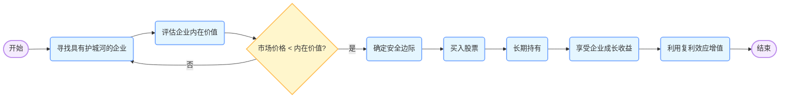

# 巴菲特的创新能力评估：如何在快速变化的市场中保持领先

> 关键词：巴菲特、创新能力评估、快速变化市场、投资策略、长期领先

> 摘要：本文聚焦于评估巴菲特在投资领域的创新能力，深入探讨他如何在快速变化的市场环境中保持领先地位。通过对巴菲特核心投资理念、策略的剖析，结合具体的数学模型和公式，展示其投资方法的科学性。同时，通过实际案例分析他的投资决策过程，并列举在投资过程中可使用的工具和资源。最后，总结巴菲特投资模式的未来发展趋势与挑战，为投资者在复杂多变的市场中提供有益的参考。

## 1. 背景介绍 
### 1.1 目的和范围
本文旨在全面评估巴菲特的创新能力，研究他在瞬息万变的金融市场中，如何凭借独特的投资策略和敏锐的市场洞察力保持领先。我们将深入分析他的投资理念、决策过程、资产配置等方面，探讨其成功背后的创新因素，并分析这些因素在不同市场环境下的适用性和局限性。范围涵盖巴菲特从早期投资到近期的主要投资案例，以及他对市场趋势的判断和应对策略。

### 1.2 预期读者
本文预期读者包括金融投资者、投资领域的研究人员、金融专业的学生以及对投资策略和市场趋势感兴趣的人士。无论是希望学习巴菲特投资智慧的新手投资者，还是想要深入研究投资理论的专业人士，都能从本文中获得有价值的信息和启示。

### 1.3 文档结构概述
本文首先介绍相关背景信息，包括目的、预期读者和文档结构。接着阐述核心概念与联系，展示巴菲特投资理念的原理和架构。然后详细讲解核心算法原理和具体操作步骤，并用 Python 代码进行说明。之后介绍数学模型和公式，并结合实际例子进行详细讲解。通过项目实战，展示实际案例和代码实现，并进行解读和分析。随后探讨巴菲特投资策略的实际应用场景。推荐相关的工具和资源，包括学习资源、开发工具框架和相关论文著作。最后总结未来发展趋势与挑战，提供常见问题解答和扩展阅读参考资料。

### 1.4 术语表
#### 1.4.1 核心术语定义
- **价值投资**：一种投资策略，强调寻找被低估的资产，通过长期持有来获取资产价值回归带来的收益。
- **安全边际**：指投资者购买股票时，股票价格低于其内在价值的幅度，用于降低投资风险。
- **护城河**：指企业拥有的可持续竞争优势，使其在市场中能够长期保持领先地位。

#### 1.4.2 相关概念解释
- **内在价值**：资产在未来产生的现金流的现值，是价值投资中评估股票是否被低估的重要指标。
- **复利效应**：指在投资过程中，将本金和利息不断滚存，使得资产规模呈指数级增长的效应。

#### 1.4.3 缩略词列表
- **ROE**：Return on Equity，净资产收益率，衡量企业盈利能力的重要指标。
- **EPS**：Earnings Per Share，每股收益，反映公司盈利能力和股东回报水平。

## 2. 核心概念与联系 

### 核心概念原理
巴菲特的投资理念核心是价值投资，其原理基于对企业内在价值的评估。他认为股票不仅仅是一张交易凭证，而是代表了企业的一部分所有权。通过深入研究企业的基本面，包括财务状况、行业地位、管理层能力等，来确定企业的内在价值。当股票价格低于其内在价值时，就存在投资机会，此时买入股票并长期持有，等待价值回归。

### 架构的文本示意图
```plaintext
价值投资理念
|
|-- 寻找具有护城河的企业
|   |-- 品牌优势
|   |-- 成本优势
|   |-- 技术优势
|
|-- 评估企业内在价值
|   |-- 财务分析
|   |   |-- 净利润
|   |   |-- 净资产收益率
|   |   |-- 现金流
|   |-- 行业分析
|   |   |-- 行业前景
|   |   |-- 竞争格局
|
|-- 确定安全边际
|   |-- 计算内在价值
|   |-- 比较市场价格与内在价值
|
|-- 长期持有
|   |-- 享受企业成长带来的收益
|   |-- 利用复利效应实现资产增值
```

### Mermaid 流程图


## 3. 核心算法原理 & 具体操作步骤 

### 核心算法原理
巴菲特评估企业内在价值的核心算法基于现金流折现模型（Discounted Cash Flow, DCF）。该模型的基本思想是，企业的内在价值等于其未来预期产生的现金流的现值之和。

### Python 代码实现
```python
def dcf_valuation(free_cash_flow, growth_rate, discount_rate, years):
    """
    现金流折现模型计算企业内在价值
    :param free_cash_flow: 初始自由现金流
    :param growth_rate: 现金流增长率
    :param discount_rate: 折现率
    :param years: 预测年限
    :return: 企业内在价值
    """
    total_value = 0
    for i in range(years):
        future_cash_flow = free_cash_flow * ((1 + growth_rate) ** i)
        discounted_cash_flow = future_cash_flow / ((1 + discount_rate) ** (i + 1))
        total_value += discounted_cash_flow
    return total_value

# 示例参数
free_cash_flow = 100  # 初始自由现金流为 100 万元
growth_rate = 0.05  # 现金流增长率为 5%
discount_rate = 0.1  # 折现率为 10%
years = 10  # 预测年限为 10 年

intrinsic_value = dcf_valuation(free_cash_flow, growth_rate, discount_rate, years)
print(f"企业内在价值: {intrinsic_value} 万元")
```

### 具体操作步骤
1. **确定初始自由现金流**：通过分析企业的财务报表，确定其当前的自由现金流。自由现金流是指企业在满足所有运营和资本支出后剩余的现金流量。
2. **预测现金流增长率**：综合考虑企业的历史业绩、行业发展趋势、市场竞争状况等因素，预测企业未来的现金流增长率。
3. **选择折现率**：折现率反映了投资者对投资回报的要求，通常可以使用企业的加权平均资本成本（WACC）作为折现率。
4. **确定预测年限**：根据企业的发展阶段和行业特点，确定合理的预测年限。一般来说，预测年限不宜过长，以免预测误差过大。
5. **计算内在价值**：使用现金流折现模型，将未来各年的现金流折现到当前，得到企业的内在价值。

## 4. 数学模型和公式 & 详细讲解 & 举例说明 

### 数学模型和公式
现金流折现模型的数学公式为：

$$V = \sum_{t=1}^{n} \frac{FCF_t}{(1 + r)^t}$$

其中：
- $V$ 表示企业的内在价值
- $FCF_t$ 表示第 $t$ 年的自由现金流
- $r$ 表示折现率
- $n$ 表示预测年限

### 详细讲解
该公式的核心思想是将未来各年的自由现金流按照一定的折现率折现到当前，以反映货币的时间价值。因为未来的现金流量在当前的价值是低于其名义金额的，所以需要通过折现来计算其现值。折现率 $r$ 越高，未来现金流的现值就越低，说明投资者对投资回报的要求越高。

### 举例说明
假设一家企业当前的自由现金流为 $100$ 万元，预计未来每年的现金流增长率为 $5\%$，折现率为 $10\%$，预测年限为 $10$ 年。

首先，计算每年的自由现金流：
第 1 年：$FCF_1 = 100 \times (1 + 0.05) = 105$ 万元
第 2 年：$FCF_2 = 105 \times (1 + 0.05) = 110.25$ 万元
以此类推，计算出未来 10 年的自由现金流。

然后，计算每年现金流的现值：
第 1 年：$PV_1 = \frac{105}{(1 + 0.1)^1} \approx 95.45$ 万元
第 2 年：$PV_2 = \frac{110.25}{(1 + 0.1)^2} \approx 90.91$ 万元
以此类推，计算出未来 10 年现金流的现值。

最后，将每年现金流的现值相加，得到企业的内在价值：
$V = PV_1 + PV_2 + \cdots + PV_{10} \approx 772.17$ 万元

## 5. 项目实战：代码实际案例和详细解释说明 

### 5.1  开发环境搭建
- **Python 安装**：从 Python 官方网站（https://www.python.org/downloads/）下载并安装 Python 3.x 版本。
- **开发工具**：推荐使用 PyCharm 或 Jupyter Notebook 作为开发工具。
- **必要库安装**：在命令行中使用以下命令安装所需的库：
```bash
pip install pandas numpy matplotlib
```

### 5.2  源代码详细实现和代码解读
```python
import pandas as pd
import numpy as np
import matplotlib.pyplot as plt

# 模拟企业财务数据
years = np.arange(1, 11)
free_cash_flows = np.array([100 * (1 + 0.05) ** i for i in range(10)])
discount_rate = 0.1

# 计算每年现金流的现值
discounted_cash_flows = []
for i, fcf in enumerate(free_cash_flows):
    pv = fcf / ((1 + discount_rate) ** (i + 1))
    discounted_cash_flows.append(pv)

# 计算企业内在价值
intrinsic_value = sum(discounted_cash_flows)

# 创建 DataFrame 展示数据
data = {
    'Year': years,
    'Free Cash Flow': free_cash_flows,
    'Discounted Cash Flow': discounted_cash_flows
}
df = pd.DataFrame(data)

# 打印结果
print("企业各年自由现金流及折现后现金流：")
print(df)
print(f"企业内在价值: {intrinsic_value} 万元")

# 可视化现金流和折现后现金流
plt.figure(figsize=(10, 6))
plt.plot(years, free_cash_flows, label='Free Cash Flow')
plt.plot(years, discounted_cash_flows, label='Discounted Cash Flow')
plt.xlabel('Year')
plt.ylabel('Cash Flow (万元)')
plt.title('企业自由现金流与折现后现金流')
plt.legend()
plt.grid(True)
plt.show()
```

### 代码解读与分析
1. **数据模拟**：使用 `numpy` 数组模拟企业未来 10 年的自由现金流，假设每年增长率为 $5\%$。
2. **现值计算**：通过循环计算每年自由现金流的现值，并将其存储在 `discounted_cash_flows` 列表中。
3. **内在价值计算**：将每年现金流的现值相加，得到企业的内在价值。
4. **数据展示**：使用 `pandas` 的 `DataFrame` 展示各年的自由现金流和折现后现金流，方便查看。
5. **可视化**：使用 `matplotlib` 绘制自由现金流和折现后现金流的折线图，直观展示两者的变化趋势。

## 6. 实际应用场景 
### 股票投资决策
巴菲特的价值投资理念在股票投资中具有广泛的应用。投资者可以通过分析企业的内在价值和安全边际，选择被低估的股票进行投资。例如，当一家公司的股票价格远低于其内在价值时，投资者可以认为该股票具有投资价值，从而买入并长期持有。

### 企业并购评估
在企业并购过程中，评估目标企业的价值是关键环节。巴菲特的投资方法可以帮助并购方准确评估目标企业的内在价值，从而确定合理的并购价格。通过分析目标企业的现金流、竞争优势等因素，并购方可以判断是否值得进行并购。

### 资产配置
投资者可以根据巴菲特的投资理念进行资产配置。将资金分配到具有稳定现金流和竞争优势的企业股票上，同时适当配置一些固定收益类资产，以降低投资组合的风险。通过长期持有优质资产，实现资产的稳健增值。

## 7. 工具和资源推荐
### 7.1 学习资源推荐
#### 7.1.1 书籍推荐
- 《聪明的投资者》（The Intelligent Investor）：本杰明·格雷厄姆著，被誉为投资领域的圣经，详细阐述了价值投资的基本原理和方法。
- 《巴菲特致股东的信：投资者和公司高管教程》（Letters to Shareholders of Berkshire Hathaway）：沃伦·巴菲特著，收录了巴菲特多年来致股东的信，展示了他的投资理念和决策过程。
- 《穷查理宝典：查理·芒格的智慧箴言录》（Poor Charlie's Almanack: The Wit and Wisdom of Charles T. Munger）：查理·芒格著，介绍了芒格的多元思维模型和投资哲学。

#### 7.1.2 在线课程
- Coursera 上的“投资学原理”课程：由知名高校教授授课，系统介绍投资学的基本理论和方法。
- Udemy 上的“价值投资实战课程”：通过实际案例讲解价值投资的应用和技巧。

#### 7.1.3 技术博客和网站
- 雪球网：国内知名的投资交流社区，提供股票分析、投资策略分享等内容。
- Seeking Alpha：国外的投资研究网站，汇聚了众多专业投资者的分析和观点。

### 7.2 开发工具框架推荐
#### 7.2.1 IDE和编辑器
- PyCharm：专业的 Python 集成开发环境，提供代码编辑、调试、版本控制等功能。
- Jupyter Notebook：交互式的开发环境，适合进行数据分析和可视化。

#### 7.2.2 调试和性能分析工具
- Py-Spy：用于分析 Python 程序的性能瓶颈，找出耗时较长的代码段。
- PDB：Python 自带的调试器，可用于逐步调试代码，查找错误。

#### 7.2.3 相关框架和库
- Pandas：用于数据处理和分析，提供高效的数据结构和数据操作方法。
- Numpy：用于科学计算，提供多维数组和各种数学函数。
- Matplotlib：用于数据可视化，可绘制各种类型的图表。

### 7.3 相关论文著作推荐
#### 7.3.1 经典论文
- “The Superinvestors of Graham-and-Doddsville”：沃伦·巴菲特著，阐述了价值投资的有效性和成功案例。
- “Efficient Capital Markets: A Review of Theory and Empirical Work”：尤金·法玛著，讨论了有效市场假说的理论和实证研究。

#### 7.3.2 最新研究成果
- 关注顶尖金融学术期刊，如《Journal of Finance》《Review of Financial Studies》等，获取价值投资领域的最新研究成果。

#### 7.3.3 应用案例分析
- 《投资大家芒格》：详细分析了查理·芒格的投资案例和决策思路，为投资者提供实际操作的参考。

## 8. 总结：未来发展趋势与挑战
### 未来发展趋势
- **数字化转型**：随着科技的发展，金融市场将更加数字化。巴菲特的投资理念可能需要与数字化技术相结合，如利用大数据和人工智能进行企业分析和估值。
- **可持续投资**：社会对环境保护和社会责任的关注度不断提高，可持续投资将成为未来的重要趋势。巴菲特可能会更加关注具有良好社会形象和可持续发展能力的企业。
- **全球投资**：经济全球化的趋势将继续加强，巴菲特的投资范围可能会进一步扩大到全球市场，寻找更多的投资机会。

### 挑战
- **科技变革**：快速的科技变革可能导致一些传统行业的企业价值下降，而新兴科技企业的估值难以准确评估，这对巴菲特的价值投资理念提出了挑战。
- **市场波动**：金融市场的波动日益加剧，宏观经济环境的不确定性增加，使得准确评估企业内在价值变得更加困难。
- **竞争加剧**：随着价值投资理念的普及，越来越多的投资者采用类似的投资策略，导致市场竞争加剧，寻找被低估的股票变得更加困难。

## 9. 附录：常见问题与解答
### 问题 1：巴菲特的价值投资理念是否适用于所有市场？
答：巴菲特的价值投资理念在大多数市场环境下都具有一定的适用性，但并非适用于所有市场。在市场泡沫时期，股票价格普遍高估，可能难以找到符合价值投资标准的股票。此外，新兴市场的波动性较大，企业的基本面变化较快，也增加了价值投资的难度。

### 问题 2：如何准确评估企业的内在价值？
答：评估企业的内在价值需要综合考虑多个因素，包括财务状况、行业前景、竞争优势等。常用的方法有现金流折现模型、市盈率法、市净率法等。但这些方法都存在一定的局限性，需要结合定性分析和定量分析，以及对市场和行业的深入理解。

### 问题 3：巴菲特为什么强调长期持有？
答：长期持有可以让投资者充分享受企业成长带来的收益，同时避免短期市场波动的影响。此外，长期持有还可以减少交易成本和税收支出，提高投资回报率。通过复利效应，长期投资的收益将更加显著。

## 10. 扩展阅读 & 参考资料
- 《金融炼金术》（The Alchemy of Finance），乔治·索罗斯著
- 《金融市场技术分析》（Technical Analysis of the Financial Markets），约翰·墨菲著
- 沃伦·巴菲特官方网站：https://www.berkshirehathaway.com/
- 查理·芒格官方资料：https://mungerlibrary.org/

作者：AI天才研究院/AI Genius Institute & 禅与计算机程序设计艺术 /Zen And The Art of Computer Programming