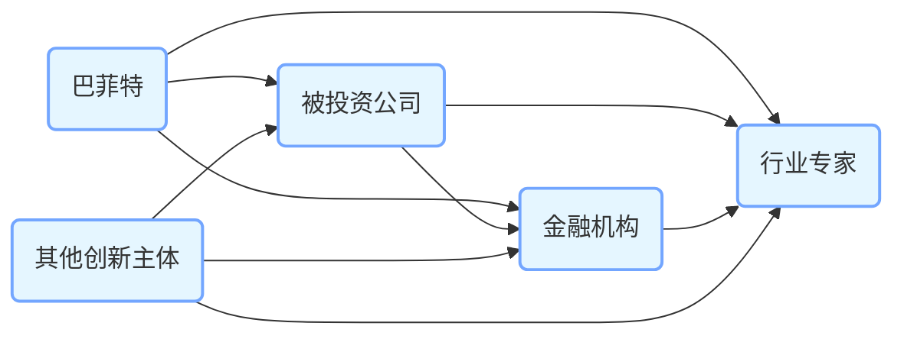

# 巴菲特的创新能力评估：量子创新生态系统的价值网络分析

> 关键词：巴菲特、创新能力评估、量子创新生态系统、价值网络分析、金融投资

> 摘要：本文旨在深入探讨巴菲特的创新能力评估，借助量子创新生态系统的价值网络分析这一独特视角。通过详细剖析量子创新生态系统的核心概念、相关算法原理以及数学模型，结合实际案例进行项目实战分析，明确其在金融投资领域的实际应用场景。同时，为读者推荐相关的学习资源、开发工具框架和论文著作。最后总结未来发展趋势与挑战，并对常见问题进行解答，以期为金融投资和创新能力评估领域提供新的思路和方法。

## 1. 背景介绍 
### 1.1 目的和范围
本研究的主要目的是全面评估巴菲特的创新能力，突破传统评估方式的局限，引入量子创新生态系统的价值网络分析方法。研究范围不仅涵盖巴菲特在投资决策、公司管理等方面的创新表现，还将深入探讨量子创新生态系统如何为这种评估提供新的视角和工具。通过分析价值网络中各节点的相互关系和价值流动，更精准地衡量巴菲特的创新能力及其对金融市场的影响。

### 1.2 预期读者
本文预期读者包括金融投资领域的从业者，如基金经理、投资顾问等，他们可以从本文中获取新的评估方法和投资思路；学术研究人员，特别是对创新理论、金融市场分析感兴趣的学者，能够在文中找到新的研究方向和理论支持；此外，对巴菲特投资理念和创新能力感兴趣的普通投资者也可以通过本文深入了解相关内容。

### 1.3 文档结构概述
本文将按照以下结构展开：首先介绍量子创新生态系统和巴菲特创新能力评估的背景知识，包括相关术语和概念；接着阐述核心概念及其联系，通过文本示意图和 Mermaid 流程图展示；然后详细讲解核心算法原理和具体操作步骤，并给出 Python 源代码；之后介绍数学模型和公式，结合实际例子进行说明；通过项目实战展示如何运用这些理论和方法进行分析；探讨实际应用场景；推荐相关的学习资源、开发工具框架和论文著作；最后总结未来发展趋势与挑战，解答常见问题，并提供扩展阅读和参考资料。

### 1.4 术语表
#### 1.4.1 核心术语定义
- **巴菲特的创新能力**：指巴菲特在投资策略、公司运营管理、市场洞察等方面展现出的独特思维和创造能力，这种能力使他能够在金融市场中取得长期的成功。
- **量子创新生态系统**：一种将量子理论的概念和方法应用于创新研究的生态系统模型，强调创新主体之间的相互作用、不确定性和量子纠缠等特性。
- **价值网络分析**：通过分析网络中各节点之间的价值流动和相互关系，揭示网络的结构和功能，从而评估各节点的价值和影响力。

#### 1.4.2 相关概念解释
- **量子纠缠**：在量子创新生态系统中，指创新主体之间存在的一种紧密的、非经典的关联关系，一个主体的创新行为可能会对其他主体产生即时的、不可预测的影响。
- **价值创造**：在价值网络中，指各节点通过自身的活动和相互合作，为整个网络创造新的价值的过程。

#### 1.4.3 缩略词列表
- QIES：Quantum Innovation Ecosystem，量子创新生态系统
- VNA：Value Network Analysis，价值网络分析

## 2. 核心概念与联系 
### 核心概念原理
量子创新生态系统是一个复杂的系统，它将量子理论中的一些概念，如量子纠缠、不确定性等引入到创新研究中。在这个生态系统中，创新主体（如企业、投资者、科研机构等）被视为量子粒子，它们之间的相互作用类似于量子纠缠。这种相互作用可以促进信息的快速传播和共享，激发创新的产生。

价值网络分析则是一种用于研究网络中价值流动和节点关系的方法。在量子创新生态系统中，价值网络由创新主体及其之间的价值联系构成。通过分析价值网络，可以了解各创新主体在生态系统中的地位和作用，以及它们之间的价值创造和传递机制。

### 架构的文本示意图
在量子创新生态系统的价值网络中，巴菲特作为一个重要的节点，与其他创新主体（如被投资公司、金融机构、行业专家等）相互连接。巴菲特通过投资决策和管理经验，为被投资公司提供价值，同时从被投资公司获得回报。其他创新主体之间也存在着各种价值联系，如技术合作、信息共享等。这些价值联系形成了一个复杂的网络，共同推动着创新的发展。

### Mermaid 流程图

这个流程图展示了巴菲特在量子创新生态系统的价值网络中的位置和与其他节点的关系。巴菲特与被投资公司、金融机构、行业专家等节点相互连接，这些节点之间也存在着相互联系，形成了一个复杂的价值网络。

## 3. 核心算法原理 & 具体操作步骤 
### 核心算法原理
在量子创新生态系统的价值网络分析中，我们可以使用图论和机器学习的方法来评估各节点的重要性和价值。其中，PageRank 算法是一种常用的方法，它最初用于评估网页的重要性，现在也可以应用于价值网络分析中。

PageRank 算法的基本思想是：一个节点的重要性不仅取决于指向它的节点数量，还取决于这些节点的重要性。具体来说，一个节点的 PageRank 值可以通过以下公式计算：

$$PR(u) = (1 - d) + d \sum_{v \in B_u} \frac{PR(v)}{L(v)}$$

其中，$PR(u)$ 表示节点 $u$ 的 PageRank 值，$d$ 是阻尼系数（通常取值为 0.85），$B_u$ 是指向节点 $u$ 的所有节点的集合，$PR(v)$ 是节点 $v$ 的 PageRank 值，$L(v)$ 是节点 $v$ 指向其他节点的数量。

### 具体操作步骤
1. **构建价值网络**：根据量子创新生态系统中各创新主体之间的价值联系，构建一个有向图，其中节点表示创新主体，边表示价值联系。
2. **初始化 PageRank 值**：为每个节点分配一个初始的 PageRank 值，通常所有节点的初始值都相等。
3. **迭代计算 PageRank 值**：根据上述公式，迭代计算每个节点的 PageRank 值，直到收敛。
4. **评估节点重要性**：根据计算得到的 PageRank 值，评估各节点在价值网络中的重要性。

### Python 源代码实现
```python
import numpy as np

def pagerank(graph, d=0.85, max_iterations=100, tol=1e-6):
    """
    实现 PageRank 算法
    :param graph: 邻接矩阵，表示价值网络
    :param d: 阻尼系数
    :param max_iterations: 最大迭代次数
    :param tol: 收敛阈值
    :return: 各节点的 PageRank 值
    """
    n = graph.shape[0]
    # 初始化 PageRank 值
    pr = np.ones(n) / n
    for _ in range(max_iterations):
        new_pr = (1 - d) / n + d * np.dot(graph.T, pr / np.sum(graph, axis=1))
        if np.linalg.norm(new_pr - pr) < tol:
            break
        pr = new_pr
    return pr

# 示例：构建一个简单的价值网络
graph = np.array([
    [0, 1, 1],
    [1, 0, 0],
    [1, 0, 0]
], dtype=float)

# 计算 PageRank 值
pr = pagerank(graph)
print("各节点的 PageRank 值:", pr)
```
在这个代码中，我们首先定义了一个 `pagerank` 函数，用于实现 PageRank 算法。然后，我们构建了一个简单的价值网络，并调用 `pagerank` 函数计算各节点的 PageRank 值。

## 4. 数学模型和公式 & 详细讲解 & 举例说明 
### 数学模型和公式
除了 PageRank 算法中的公式外，我们还可以使用其他数学模型和公式来分析量子创新生态系统的价值网络。例如，我们可以使用社会网络分析中的中心性指标来评估节点的重要性。

- **度中心性（Degree Centrality）**：表示一个节点与其他节点的连接数量。节点的度中心性可以通过以下公式计算：

$$C_D(v) = \frac{k_v}{n - 1}$$

其中，$C_D(v)$ 表示节点 $v$ 的度中心性，$k_v$ 是节点 $v$ 的度（即与它连接的节点数量），$n$ 是网络中的节点总数。

- **接近中心性（Closeness Centrality）**：表示一个节点与其他节点的接近程度。节点的接近中心性可以通过以下公式计算：

$$C_C(v) = \frac{n - 1}{\sum_{u \neq v} d(v, u)}$$

其中，$C_C(v)$ 表示节点 $v$ 的接近中心性，$d(v, u)$ 是节点 $v$ 到节点 $u$ 的最短路径长度。

### 详细讲解
度中心性反映了一个节点在网络中的直接影响力，度中心性越高，说明该节点与其他节点的连接越广泛，能够更快地传播信息和价值。接近中心性则反映了一个节点在网络中的传播效率，接近中心性越高，说明该节点能够更快速地到达其他节点，在信息传播和价值传递方面具有优势。

### 举例说明
假设我们有一个简单的价值网络，包含 4 个节点 A、B、C、D，它们之间的连接关系如下：
- A 与 B、C 相连
- B 与 A、D 相连
- C 与 A 相连
- D 与 B 相连

我们可以计算各节点的度中心性和接近中心性：
- **度中心性**：
    - $C_D(A) = \frac{2}{4 - 1} = \frac{2}{3}$
    - $C_D(B) = \frac{2}{4 - 1} = \frac{2}{3}$
    - $C_D(C) = \frac{1}{4 - 1} = \frac{1}{3}$
    - $C_D(D) = \frac{1}{4 - 1} = \frac{1}{3}$
- **接近中心性**：
    - 首先计算各节点之间的最短路径长度：
        - $d(A, B) = 1$，$d(A, C) = 1$，$d(A, D) = 2$
        - $d(B, A) = 1$，$d(B, C) = 2$，$d(B, D) = 1$
        - $d(C, A) = 1$，$d(C, B) = 2$，$d(C, D) = 3$
        - $d(D, A) = 2$，$d(D, B) = 1$，$d(D, C) = 3$
    - 然后计算接近中心性：
        - $C_C(A) = \frac{4 - 1}{1 + 1 + 2} = \frac{3}{4}$
        - $C_C(B) = \frac{4 - 1}{1 + 2 + 1} = \frac{3}{4}$
        - $C_C(C) = \frac{4 - 1}{1 + 2 + 3} = \frac{1}{2}$
        - $C_C(D) = \frac{4 - 1}{2 + 1 + 3} = \frac{1}{2}$

从计算结果可以看出，节点 A 和 B 的度中心性和接近中心性都较高，说明它们在价值网络中具有较高的重要性。

## 5. 项目实战：代码实际案例和详细解释说明 
### 5.1  开发环境搭建
为了实现量子创新生态系统的价值网络分析，我们需要搭建一个 Python 开发环境。以下是具体的搭建步骤：
1. **安装 Python**：从 Python 官方网站（https://www.python.org/downloads/）下载并安装 Python 3.x 版本。
2. **安装必要的库**：使用 `pip` 命令安装以下库：
    - `numpy`：用于数值计算
    - `networkx`：用于图论分析
    - `matplotlib`：用于数据可视化

```bash
pip install numpy networkx matplotlib
```

### 5.2  源代码详细实现和代码解读
```python
import networkx as nx
import matplotlib.pyplot as plt
import numpy as np

# 构建价值网络
G = nx.DiGraph()
# 添加节点
nodes = ['巴菲特', '被投资公司1', '被投资公司2', '金融机构', '行业专家']
G.add_nodes_from(nodes)
# 添加边
edges = [('巴菲特', '被投资公司1'), ('巴菲特', '被投资公司2'), ('被投资公司1', '金融机构'),
         ('被投资公司2', '金融机构'), ('金融机构', '行业专家'), ('行业专家', '巴菲特')]
G.add_edges_from(edges)

# 计算 PageRank 值
pr = nx.pagerank(G)

# 计算度中心性
degree_centrality = nx.degree_centrality(G)

# 计算接近中心性
closeness_centrality = nx.closeness_centrality(G)

# 打印结果
print("PageRank 值:", pr)
print("度中心性:", degree_centrality)
print("接近中心性:", closeness_centrality)

# 可视化价值网络
pos = nx.spring_layout(G)
nx.draw_networkx_nodes(G, pos)
nx.draw_networkx_edges(G, pos)
nx.draw_networkx_labels(G, pos)
plt.title("量子创新生态系统的价值网络")
plt.show()
```
### 代码解读与分析
1. **构建价值网络**：使用 `networkx` 库的 `DiGraph` 类构建一个有向图，表示量子创新生态系统的价值网络。添加节点和边来表示创新主体及其之间的价值联系。
2. **计算 PageRank 值**：使用 `nx.pagerank` 函数计算各节点的 PageRank 值，评估节点在价值网络中的重要性。
3. **计算度中心性和接近中心性**：使用 `nx.degree_centrality` 和 `nx.closeness_centrality` 函数分别计算各节点的度中心性和接近中心性，进一步评估节点的重要性和传播效率。
4. **打印结果**：将计算得到的 PageRank 值、度中心性和接近中心性打印输出，方便分析。
5. **可视化价值网络**：使用 `matplotlib` 库将价值网络可视化，直观地展示各节点之间的关系。

通过这个项目实战，我们可以更深入地理解量子创新生态系统的价值网络分析方法，并将其应用到实际的创新能力评估中。

## 6. 实际应用场景 
### 金融投资领域
在金融投资领域，量子创新生态系统的价值网络分析可以帮助投资者评估投资对象的创新能力和潜在价值。通过分析投资对象在价值网络中的位置和与其他节点的关系，投资者可以更准确地判断其未来的发展趋势和盈利能力。例如，巴菲特在选择投资对象时，可以使用这种分析方法来评估被投资公司的创新能力和在行业中的竞争力，从而做出更明智的投资决策。

### 企业创新管理
企业可以利用量子创新生态系统的价值网络分析来优化自身的创新管理策略。通过分析企业在价值网络中的地位和与合作伙伴的关系，企业可以发现创新的机会和瓶颈，加强与关键合作伙伴的合作，提高创新效率和效果。例如，企业可以通过与行业专家和科研机构建立更紧密的联系，获取更多的创新资源和技术支持。

### 行业发展研究
对于行业研究人员来说，量子创新生态系统的价值网络分析可以帮助他们了解行业的创新生态和发展趋势。通过分析行业内各企业、机构之间的价值联系和创新互动，研究人员可以发现行业的创新热点和潜在的发展方向，为行业政策的制定和企业的战略规划提供参考。

## 7. 工具和资源推荐
### 7.1 学习资源推荐
#### 7.1.1 书籍推荐
- 《创新的艺术》：这本书介绍了创新的基本原理和方法，以及如何在不同的领域中激发创新思维。
- 《复杂网络理论及其应用》：详细讲解了复杂网络的理论和分析方法，对于理解量子创新生态系统的价值网络有很大的帮助。
- 《巴菲特致股东的信》：通过阅读巴菲特的信件，读者可以深入了解他的投资理念和创新思维。

#### 7.1.2 在线课程
- Coursera 上的“创新管理与创业”课程：提供了系统的创新管理知识和实践案例。
- edX 上的“复杂网络分析”课程：介绍了复杂网络的建模、分析和应用方法。

#### 7.1.3 技术博客和网站
- 36氪：关注科技创新和创业领域，提供最新的行业动态和创新案例。
- 量子位：专注于量子计算、人工智能等前沿技术的报道和分析。

### 7.2 开发工具框架推荐
#### 7.2.1 IDE和编辑器
- PyCharm：一款功能强大的 Python 集成开发环境，提供了丰富的代码编辑、调试和分析功能。
- Jupyter Notebook：交互式的编程环境，适合进行数据分析和模型验证。

#### 7.2.2 调试和性能分析工具
- pdb：Python 自带的调试工具，方便对代码进行调试和排查问题。
- cProfile：Python 的性能分析工具，可以帮助开发者找出代码中的性能瓶颈。

#### 7.2.3 相关框架和库
- NetworkX：用于图论分析和复杂网络建模的 Python 库。
- NumPy：用于数值计算的 Python 库，提供了高效的数组操作和数学函数。

### 7.3 相关论文著作推荐
#### 7.3.1 经典论文
- “The Anatomy of a Large-Scale Hypertextual Web Search Engine”：介绍了 PageRank 算法的原理和应用。
- “Complex Networks: Structure and Dynamics”：对复杂网络的结构和动力学进行了系统的研究。

#### 7.3.2 最新研究成果
- 关注学术数据库如 IEEE Xplore、ACM Digital Library 等，搜索关于量子创新生态系统、价值网络分析等方面的最新研究论文。

#### 7.3.3 应用案例分析
- 一些商业杂志和研究报告中会有关于创新能力评估和价值网络分析的应用案例，可以从中学习实际应用的方法和经验。

## 8. 总结：未来发展趋势与挑战
### 未来发展趋势
- **跨学科融合**：量子创新生态系统的价值网络分析将与量子物理学、生物学、社会学等多个学科进行更深入的融合，为创新研究提供更丰富的理论和方法。
- **智能化应用**：随着人工智能技术的发展，价值网络分析将更加智能化，能够自动识别创新模式和潜在的价值机会。
- **全球化应用**：该分析方法将在全球范围内得到更广泛的应用，促进不同国家和地区之间的创新合作和交流。

### 挑战
- **数据获取和质量**：准确的价值网络分析需要大量的高质量数据，但在实际应用中，数据的获取和质量可能存在一定的困难。
- **理论模型的完善**：目前量子创新生态系统的理论模型还不够完善，需要进一步的研究和验证。
- **人才培养**：该领域需要具备跨学科知识和技能的人才，目前相关人才的培养还相对滞后。

## 9. 附录：常见问题与解答
### 问题 1：量子创新生态系统与传统创新理论有什么区别？
解答：量子创新生态系统引入了量子理论的概念和方法，强调创新主体之间的相互作用、不确定性和量子纠缠等特性，与传统创新理论相比，更能反映创新过程中的复杂性和动态性。

### 问题 2：价值网络分析的结果是否可靠？
解答：价值网络分析的结果可靠性取决于数据的质量和分析方法的合理性。在实际应用中，需要确保数据的准确性和完整性，并选择合适的分析方法。

### 问题 3：如何将量子创新生态系统的价值网络分析应用到实际项目中？
解答：可以按照本文中介绍的步骤，首先构建价值网络，然后选择合适的分析方法（如 PageRank 算法、中心性指标等）进行分析，最后根据分析结果做出决策。

## 10. 扩展阅读 & 参考资料
- 《量子计算与量子信息》
- 《社会网络分析：方法与应用》
- https://en.wikipedia.org/wiki/PageRank
- https://networkx.org/documentation/stable/

作者：AI天才研究院/AI Genius Institute & 禅与计算机程序设计艺术 /Zen And The Art of Computer Programming