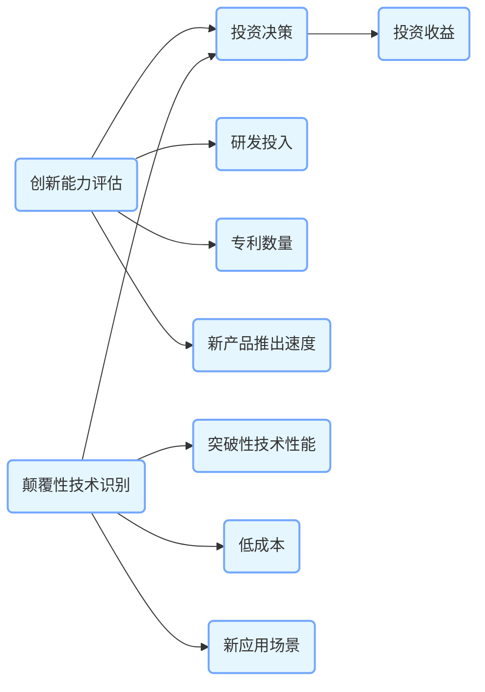

# 巴菲特的创新能力评估：颠覆性技术的识别与投资

> 关键词：巴菲特、创新能力评估、颠覆性技术、技术识别、投资策略

> 摘要：本文旨在深入探讨巴菲特在创新能力评估以及颠覆性技术识别与投资方面的理念和方法。通过对相关背景的介绍，明确研究的目的、范围和预期读者。详细阐述核心概念，包括创新能力、颠覆性技术等，给出原理和架构的示意图与流程图。深入分析核心算法原理及具体操作步骤，并结合数学模型和公式进行详细讲解与举例说明。通过项目实战案例，展示在实际中如何运用这些方法进行投资。探讨其在实际应用场景中的表现，推荐相关的学习资源、开发工具框架和论文著作。最后总结未来发展趋势与挑战，解答常见问题，并提供扩展阅读和参考资料，为投资者和研究者提供全面的参考。

## 1. 背景介绍 
### 1.1 目的和范围
本研究的目的在于剖析巴菲特在创新能力评估以及对颠覆性技术的识别与投资决策方面的独特见解和方法。通过系统性的分析，揭示其投资策略背后的逻辑，为投资者和研究者提供借鉴。研究范围涵盖巴菲特的投资理念、创新能力评估的相关理论、颠覆性技术的特点以及投资决策的过程和方法。

### 1.2 预期读者
本文预期读者包括专业投资者、金融分析师、对投资和创新领域感兴趣的研究者、高校金融和计算机相关专业的学生，以及希望提升自身投资知识和技能的个人。

### 1.3 文档结构概述
本文将按照以下结构展开：首先介绍背景信息，包括目的、范围、预期读者和文档结构概述。接着阐述核心概念与联系，给出原理和架构的示意图与流程图。然后详细讲解核心算法原理和具体操作步骤，并结合数学模型和公式进行说明。通过项目实战案例展示实际应用。探讨实际应用场景，推荐相关工具和资源。最后总结未来发展趋势与挑战，解答常见问题并提供扩展阅读和参考资料。

### 1.4 术语表
#### 1.4.1 核心术语定义
- **创新能力评估**：对企业或个人在创造新的产品、服务、技术或商业模式等方面的能力进行评价和分析的过程。
- **颠覆性技术**：指那些能够打破现有市场格局、改变行业竞争规则、创造新的市场需求或取代现有技术的技术。
- **投资决策**：投资者在考虑各种因素后，决定是否对特定的资产或项目进行投资的过程。

#### 1.4.2 相关概念解释
- **护城河理论**：巴菲特提出的概念，指企业拥有的一种可持续的竞争优势，使其能够在市场中抵御竞争对手的攻击，就像城堡周围的护城河一样保护企业的利润和市场份额。
- **内在价值**：企业或资产在未来所能产生的现金流的现值，是巴菲特进行投资决策的重要依据。

#### 1.4.3 缩略词列表
- **DCF**：Discounted Cash Flow，现金流折现法，一种用于评估资产价值的方法。

## 2. 核心概念与联系 
### 核心概念原理
#### 创新能力评估原理
创新能力评估是一个综合性的过程，涉及多个维度。从企业层面来看，创新能力可以体现在研发投入、专利数量、新产品推出速度等方面。研发投入反映了企业对创新的重视程度和资源投入，专利数量则是创新成果的一种体现，新产品推出速度则展示了企业将创新想法转化为实际产品的能力。

从个人层面来看，创新能力包括创造力、思维灵活性、问题解决能力等。创造力是产生新颖想法的能力，思维灵活性使个人能够从不同角度看待问题，问题解决能力则确保个人能够将创新想法付诸实践。

#### 颠覆性技术原理
颠覆性技术通常具有以下特点：一是具有突破性的技术性能，能够在某些关键指标上远远超过现有技术；二是具有较低的成本，能够降低产品或服务的价格，从而吸引更多的用户；三是具有新的应用场景，能够满足市场上未被满足的需求。

例如，互联网技术的出现，打破了传统媒体的传播模式，创造了新的信息传播和交流方式；智能手机的出现，取代了传统的功能手机，成为人们生活中不可或缺的一部分。

#### 投资决策原理
巴菲特的投资决策基于价值投资理念，即寻找那些被市场低估的资产，并且这些资产具有可持续的竞争优势和良好的发展前景。在进行投资决策时，需要考虑多个因素，包括企业的财务状况、行业竞争格局、管理团队的能力等。

### 核心概念架构
下面是核心概念之间的架构示意图：



该架构图展示了创新能力评估、颠覆性技术识别与投资决策之间的关系。创新能力评估和颠覆性技术识别是投资决策的重要依据，投资决策的结果将影响投资收益。创新能力评估可以从研发投入、专利数量和新产品推出速度等方面进行，颠覆性技术识别可以从突破性技术性能、低成本和新应用场景等方面进行。

## 3. 核心算法原理 & 具体操作步骤 
### 创新能力评估算法原理及Python代码实现
#### 算法原理
我们可以通过综合考虑多个指标来评估企业的创新能力。假设我们考虑研发投入、专利数量和新产品推出速度三个指标，为每个指标赋予一定的权重，然后计算加权平均值作为创新能力得分。

#### Python代码实现
```python
def innovation_ability_evaluation(research_investment, patent_number, new_product_speed):
    # 定义各指标的权重
    weight_research = 0.4
    weight_patent = 0.3
    weight_new_product = 0.3

    # 计算加权得分
    score = research_investment * weight_research + patent_number * weight_patent + new_product_speed * weight_new_product
    return score

# 示例数据
research_investment = 1000  # 研发投入
patent_number = 20  # 专利数量
new_product_speed = 5  # 新产品推出速度

# 计算创新能力得分
score = innovation_ability_evaluation(research_investment, patent_number, new_product_speed)
print(f"创新能力得分: {score}")
```

### 颠覆性技术识别算法原理及Python代码实现
#### 算法原理
对于颠覆性技术的识别，我们可以通过比较技术的关键性能指标、成本和应用场景与现有技术的差异来进行判断。假设我们有一个技术的性能指标得分、成本得分和应用场景得分，我们可以计算综合得分来判断该技术是否具有颠覆性。

#### Python代码实现
```python
def disruptive_technology_identification(performance_score, cost_score, application_score):
    # 定义各指标的权重
    weight_performance = 0.4
    weight_cost = 0.3
    weight_application = 0.3

    # 计算综合得分
    total_score = performance_score * weight_performance + cost_score * weight_cost + application_score * weight_application

    # 判断是否为颠覆性技术
    if total_score > 7:
        return True
    else:
        return False

# 示例数据
performance_score = 8
cost_score = 6
application_score = 7

# 判断是否为颠覆性技术
is_disruptive = disruptive_technology_identification(performance_score, cost_score, application_score)
print(f"该技术是否为颠覆性技术: {is_disruptive}")
```

### 投资决策算法原理及Python代码实现
#### 算法原理
在进行投资决策时，我们可以结合创新能力评估得分和颠覆性技术识别结果，同时考虑企业的内在价值和市场价格。假设我们通过现金流折现法计算企业的内在价值，然后比较内在价值和市场价格的比率。如果该比率大于1，且企业具有较高的创新能力和颠覆性技术潜力，则可以考虑投资。

#### Python代码实现
```python
def investment_decision(innovation_score, is_disruptive, intrinsic_value, market_price):
    ratio = intrinsic_value / market_price

    if ratio > 1 and innovation_score > 6 and is_disruptive:
        return "建议投资"
    else:
        return "不建议投资"

# 示例数据
innovation_score = 7
is_disruptive = True
intrinsic_value = 100
market_price = 80

# 做出投资决策
decision = investment_decision(innovation_score, is_disruptive, intrinsic_value, market_price)
print(f"投资决策结果: {decision}")
```

### 具体操作步骤
1. **数据收集**：收集企业的研发投入、专利数量、新产品推出速度等数据，以及技术的性能指标、成本和应用场景等数据。
2. **指标计算**：根据上述算法计算创新能力得分、颠覆性技术综合得分和企业的内在价值与市场价格的比率。
3. **决策判断**：根据计算结果，结合投资决策算法做出投资决策。

## 4. 数学模型和公式 & 详细讲解 & 举例说明 
### 创新能力评估数学模型
创新能力得分 $S_{innovation}$ 可以通过以下公式计算：

$$S_{innovation} = w_{research} \times R + w_{patent} \times P + w_{new\_product} \times N$$

其中，$w_{research}$ 是研发投入的权重，$R$ 是研发投入指标值；$w_{patent}$ 是专利数量的权重，$P$ 是专利数量指标值；$w_{new\_product}$ 是新产品推出速度的权重，$N$ 是新产品推出速度指标值。

例如，假设 $w_{research} = 0.4$，$R = 1000$，$w_{patent} = 0.3$，$P = 20$，$w_{new\_product} = 0.3$，$N = 5$，则创新能力得分：

$$S_{innovation} = 0.4 \times 1000 + 0.3 \times 20 + 0.3 \times 5 = 400 + 6 + 1.5 = 407.5$$

### 颠覆性技术识别数学模型
颠覆性技术综合得分 $S_{disruptive}$ 可以通过以下公式计算：

$$S_{disruptive} = w_{performance} \times P_{score} + w_{cost} \times C_{score} + w_{application} \times A_{score}$$

其中，$w_{performance}$ 是性能指标的权重，$P_{score}$ 是性能指标得分；$w_{cost}$ 是成本指标的权重，$C_{score}$ 是成本指标得分；$w_{application}$ 是应用场景指标的权重，$A_{score}$ 是应用场景指标得分。

例如，假设 $w_{performance} = 0.4$，$P_{score} = 8$，$w_{cost} = 0.3$，$C_{score} = 6$，$w_{application} = 0.3$，$A_{score} = 7$，则颠覆性技术综合得分：

$$S_{disruptive} = 0.4 \times 8 + 0.3 \times 6 + 0.3 \times 7 = 3.2 + 1.8 + 2.1 = 7.1$$

因为 $S_{disruptive} > 7$，所以该技术被判断为颠覆性技术。

### 投资决策数学模型
投资决策可以通过比较企业的内在价值 $V_{intrinsic}$ 和市场价格 $V_{market}$ 的比率 $r$ 来进行：

$$r = \frac{V_{intrinsic}}{V_{market}}$$

如果 $r > 1$，且企业的创新能力得分 $S_{innovation} > 6$，同时该企业涉及的技术被判断为颠覆性技术，则建议投资。

例如，假设 $V_{intrinsic} = 100$，$V_{market} = 80$，$S_{innovation} = 7$，且该企业涉及的技术被判断为颠覆性技术，则：

$$r = \frac{100}{80} = 1.25$$

因为 $r > 1$，$S_{innovation} > 6$，且技术具有颠覆性，所以建议投资。

## 5. 项目实战：代码实际案例和详细解释说明 
### 5.1  开发环境搭建
#### 安装Python
首先，需要安装Python开发环境。可以从Python官方网站（https://www.python.org/downloads/）下载适合自己操作系统的Python版本，并按照安装向导进行安装。

#### 安装必要的库
在本项目中，主要使用Python的基础库，无需额外安装第三方库。如果需要进行数据处理和可视化等操作，可以安装 `pandas`、`numpy` 和 `matplotlib` 等库。可以使用以下命令进行安装：

```sh
pip install pandas numpy matplotlib
```

### 5.2  源代码详细实现和代码解读
```python
# 创新能力评估函数
def innovation_ability_evaluation(research_investment, patent_number, new_product_speed):
    # 定义各指标的权重
    weight_research = 0.4
    weight_patent = 0.3
    weight_new_product = 0.3

    # 计算加权得分
    score = research_investment * weight_research + patent_number * weight_patent + new_product_speed * weight_new_product
    return score

# 颠覆性技术识别函数
def disruptive_technology_identification(performance_score, cost_score, application_score):
    # 定义各指标的权重
    weight_performance = 0.4
    weight_cost = 0.3
    weight_application = 0.3

    # 计算综合得分
    total_score = performance_score * weight_performance + cost_score * weight_cost + application_score * weight_application

    # 判断是否为颠覆性技术
    if total_score > 7:
        return True
    else:
        return False

# 投资决策函数
def investment_decision(innovation_score, is_disruptive, intrinsic_value, market_price):
    ratio = intrinsic_value / market_price

    if ratio > 1 and innovation_score > 6 and is_disruptive:
        return "建议投资"
    else:
        return "不建议投资"

# 示例数据
research_investment = 1200
patent_number = 25
new_product_speed = 6
performance_score = 8
cost_score = 7
application_score = 7
intrinsic_value = 120
market_price = 100

# 计算创新能力得分
innovation_score = innovation_ability_evaluation(research_investment, patent_number, new_product_speed)
print(f"创新能力得分: {innovation_score}")

# 判断是否为颠覆性技术
is_disruptive = disruptive_technology_identification(performance_score, cost_score, application_score)
print(f"该技术是否为颠覆性技术: {is_disruptive}")

# 做出投资决策
decision = investment_decision(innovation_score, is_disruptive, intrinsic_value, market_price)
print(f"投资决策结果: {decision}")
```

### 代码解读与分析
1. **创新能力评估函数**：`innovation_ability_evaluation` 函数接受研发投入、专利数量和新产品推出速度作为输入，根据预设的权重计算加权得分，返回创新能力得分。
2. **颠覆性技术识别函数**：`disruptive_technology_identification` 函数接受性能指标得分、成本得分和应用场景得分作为输入，计算综合得分，根据综合得分判断该技术是否为颠覆性技术。
3. **投资决策函数**：`investment_decision` 函数接受创新能力得分、颠覆性技术判断结果、企业的内在价值和市场价格作为输入，计算内在价值与市场价格的比率，根据比率和其他条件做出投资决策。
4. **示例数据和结果输出**：在代码中，我们定义了示例数据，调用上述函数进行计算，并输出创新能力得分、颠覆性技术判断结果和投资决策结果。

## 6. 实际应用场景 
### 投资机构
投资机构可以使用上述方法对潜在的投资项目进行评估。通过评估企业的创新能力和识别其涉及的颠覆性技术，结合企业的内在价值和市场价格，做出更明智的投资决策。例如，在科技领域，投资机构可以寻找那些具有高创新能力和颠覆性技术的初创企业进行投资。

### 企业战略规划
企业可以运用这些方法评估自身的创新能力和所处行业的技术发展趋势。通过了解自身的创新优势和劣势，企业可以制定更有效的战略规划，加大对创新的投入，布局具有颠覆性潜力的技术领域，以保持市场竞争力。

### 政府政策制定
政府在制定科技政策和产业政策时，可以参考创新能力评估和颠覆性技术识别的方法。通过扶持具有高创新能力和颠覆性技术潜力的企业和项目，促进产业升级和经济发展。

## 7. 工具和资源推荐
### 7.1 学习资源推荐
#### 7.1.1 书籍推荐
- 《聪明的投资者》：本杰明·格雷厄姆著，这是价值投资领域的经典之作，巴菲特称这本书是他投资的启蒙书籍。
- 《巴菲特致股东的信：股份公司教程》：沃伦·巴菲特著，书中包含了巴菲特多年来给股东的信，详细阐述了他的投资理念和方法。
- 《创新者的窘境》：克莱顿·克里斯坦森著，探讨了颠覆性技术对企业的影响以及企业如何应对颠覆性创新。

#### 7.1.2 在线课程
- Coursera上的“投资学原理”课程，由知名高校教授授课，系统介绍了投资的基本原理和方法。
- edX上的“创新管理”课程，帮助学习者了解创新的过程和管理方法。

#### 7.1.3 技术博客和网站
- Seeking Alpha：提供专业的投资分析和研究报告，涵盖了各种行业和公司。
- TechCrunch：专注于科技领域的新闻和分析，及时报道最新的技术发展和创新动态。

### 7.2 开发工具框架推荐
#### 7.2.1 IDE和编辑器
- PyCharm：一款功能强大的Python集成开发环境，提供代码编辑、调试、版本控制等功能。
- Jupyter Notebook：适合进行数据分析和代码演示，支持多种编程语言，具有交互式的编程环境。

#### 7.2.2 调试和性能分析工具
- pdb：Python自带的调试工具，可以帮助开发者定位和解决代码中的问题。
- cProfile：用于分析Python代码的性能，找出性能瓶颈。

#### 7.2.3 相关框架和库
- pandas：用于数据处理和分析，提供了高效的数据结构和数据操作方法。
- numpy：用于科学计算，提供了高性能的多维数组对象和数学函数。

### 7.3 相关论文著作推荐
#### 7.3.1 经典论文
- “The Capital Asset Pricing Model: Theory and Evidence”：由 Eugene F. Fama 和 Kenneth R. French 撰写，对资本资产定价模型进行了深入的研究和分析。
- “The Theory of Economic Development”：约瑟夫·熊彼特著，提出了创新理论，对经济发展和创新的关系进行了探讨。

#### 7.3.2 最新研究成果
- 可以关注顶级学术期刊如《Journal of Finance》《Management Science》等，获取关于投资和创新领域的最新研究成果。

#### 7.3.3 应用案例分析
- 一些咨询公司和研究机构会发布关于投资和创新的应用案例分析报告，可以通过这些报告了解实际案例中的应用方法和效果。

## 8. 总结：未来发展趋势与挑战
### 未来发展趋势
- **技术融合加速**：未来，不同领域的技术将加速融合，如人工智能与生物技术、物联网与能源技术等。这将产生更多具有颠覆性的技术，为投资者带来更多的机会。
- **数据驱动的投资决策**：随着大数据和人工智能技术的发展，投资决策将越来越依赖于数据和算法。通过对海量数据的分析和挖掘，可以更准确地评估企业的创新能力和技术潜力。
- **社会责任投资兴起**：投资者将越来越关注企业的社会责任和可持续发展。具有良好社会形象和环境友好型的企业将更受投资者青睐。

### 挑战
- **技术不确定性**：颠覆性技术的发展具有很大的不确定性，很难准确预测哪些技术将取得成功。投资者需要承担更高的风险。
- **数据质量和隐私问题**：在数据驱动的投资决策中，数据质量和隐私问题至关重要。不准确的数据可能导致错误的决策，而数据隐私问题可能引发法律风险。
- **竞争加剧**：随着投资领域对创新能力和颠覆性技术的关注度不断提高，竞争将越来越激烈。投资者需要不断提升自己的分析能力和决策水平。

## 9. 附录：常见问题与解答
### 如何确定各指标的权重？
各指标的权重可以根据具体的行业特点、投资目标和个人经验来确定。一般来说，可以通过专家咨询、历史数据分析等方法来确定合理的权重。

### 如何计算企业的内在价值？
企业的内在价值可以通过现金流折现法（DCF）来计算。该方法需要预测企业未来的现金流，并将其折现到当前时点。具体的计算过程较为复杂，需要考虑多个因素，如增长率、折现率等。

### 颠覆性技术的判断标准是否固定？
颠覆性技术的判断标准不是固定的，会随着技术的发展和市场环境的变化而变化。在不同的行业和时期，颠覆性技术的特点和判断标准可能会有所不同。

## 10. 扩展阅读 & 参考资料
### 扩展阅读
- 《黑天鹅：如何应对不可预知的未来》：纳西姆·尼古拉斯·塔勒布著，探讨了不确定性对投资和决策的影响。
- 《穷查理宝典：查理·芒格的智慧箴言录》：查理·芒格著，书中包含了芒格的投资智慧和人生哲学。

### 参考资料
- 巴菲特历年致股东的信，可从伯克希尔·哈撒韦公司官方网站获取。
- 相关学术期刊和研究报告，如《金融研究》《管理世界》等。

作者：AI天才研究院/AI Genius Institute & 禅与计算机程序设计艺术 /Zen And The Art of Computer Programming