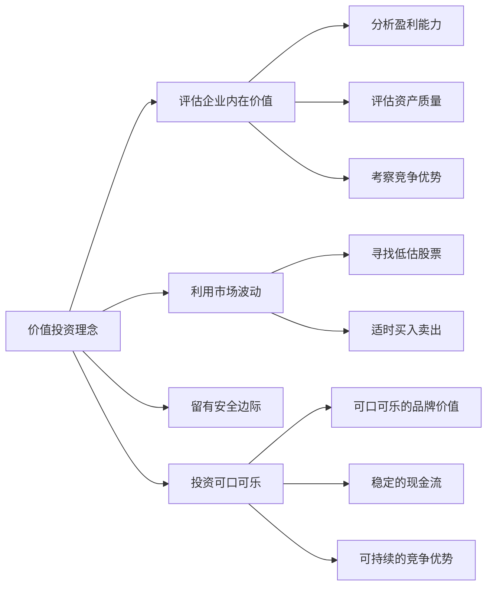

# 巴菲特的可口可乐投资案例分析

> 关键词：巴菲特、可口可乐、投资案例、价值投资、财务分析

> 摘要：本文深入分析了巴菲特投资可口可乐这一经典案例。通过对该案例的研究，阐述了巴菲特价值投资理念在实际投资中的应用，包括对企业基本面的分析、财务指标的考量等。详细探讨了可口可乐的核心竞争力、市场地位以及巴菲特投资前后的市场表现。同时，结合数学模型和公式对投资回报进行了评估，并给出了实际开发环境下模拟投资分析的代码案例。此外，还介绍了该案例在实际投资领域的应用场景，推荐了相关的学习资源、开发工具和论文著作。最后对未来投资趋势与挑战进行了总结，并对常见问题进行了解答。

## 1. 背景介绍 
### 1.1 目的和范围
本分析的主要目的是深入研究巴菲特投资可口可乐这一具有里程碑意义的案例，揭示其投资决策背后的逻辑和方法。通过对该案例的全面剖析，为投资者提供有价值的参考，帮助他们更好地理解价值投资理念，并应用于实际投资中。分析范围涵盖了可口可乐公司的历史发展、财务状况、市场竞争地位，以及巴菲特投资前后的市场表现和投资回报等方面。

### 1.2 预期读者
本文预期读者包括对投资领域感兴趣的个人投资者、金融专业学生、投资机构从业者以及希望深入了解价值投资理念的人士。无论您是投资新手还是有一定经验的专业人士，都能从本案例分析中获得启发和知识。

### 1.3 文档结构概述
本文将按照以下结构进行组织：首先介绍核心概念与联系，阐述价值投资的原理和相关架构；接着详细讲解核心算法原理和具体操作步骤，通过Python代码实现投资分析；然后给出数学模型和公式，对投资回报进行量化分析；之后进行项目实战，提供代码实际案例并详细解释说明；再探讨该案例在实际投资中的应用场景；推荐相关的工具和资源；最后总结未来发展趋势与挑战，解答常见问题，并提供扩展阅读和参考资料。

### 1.4 术语表
#### 1.4.1 核心术语定义
- **价值投资**：一种投资策略，强调通过分析企业的内在价值，寻找被低估的股票进行投资，以获取长期稳定的回报。
- **内在价值**：企业在未来所能产生的现金流的现值，是评估企业真实价值的重要指标。
- **护城河**：指企业拥有的一种可持续的竞争优势，能够保护企业的市场份额和盈利能力，使其在市场竞争中脱颖而出。

#### 1.4.2 相关概念解释
- **现金流折现模型**：一种用于计算企业内在价值的方法，通过预测企业未来的现金流，并将其折现到当前时点，得到企业的内在价值。
- **净资产收益率（ROE）**：衡量企业盈利能力的重要指标，反映了股东权益的收益水平。
- **市盈率（PE）**：股票价格与每股收益的比率，用于评估股票的估值水平。

#### 1.4.3 缩略词列表
- **ROE**：Return on Equity，净资产收益率
- **PE**：Price-to-Earnings Ratio，市盈率
- **DCF**：Discounted Cash Flow，现金流折现

## 2. 核心概念与联系 

### 价值投资原理
价值投资的核心思想是寻找被市场低估的股票，通过长期持有来获得企业价值增长带来的回报。其基本原理基于以下几点：
1. **企业内在价值**：企业的内在价值是其未来现金流的现值。投资者应该关注企业的基本面，包括盈利能力、资产质量、竞争优势等，以评估其内在价值。
2. **市场先生**：市场价格会受到各种因素的影响而波动，有时会偏离企业的内在价值。投资者应该利用市场先生的情绪波动，在价格低于内在价值时买入，在价格高于内在价值时卖出。
3. **安全边际**：为了降低投资风险，投资者应该在买入股票时留有一定的安全边际，即股票价格与内在价值之间的差距。安全边际越大，投资风险越低。

### 价值投资与可口可乐的联系
巴菲特投资可口可乐正是基于价值投资理念。可口可乐作为一家具有悠久历史和强大品牌的企业，拥有稳定的现金流和较高的盈利能力。巴菲特认为，可口可乐的品牌价值和市场地位构成了其强大的“护城河”，使其在市场竞争中具有可持续的竞争优势。因此，巴菲特在1988年开始大量买入可口可乐股票，长期持有并获得了丰厚的回报。

### 文本示意图
```plaintext
价值投资理念
|
|-- 评估企业内在价值
|   |-- 分析盈利能力
|   |-- 评估资产质量
|   |-- 考察竞争优势
|
|-- 利用市场波动
|   |-- 寻找低估股票
|   |-- 适时买入卖出
|
|-- 留有安全边际
|
|-- 投资可口可乐
|   |-- 可口可乐的品牌价值
|   |-- 稳定的现金流
|   |-- 可持续的竞争优势
```

### Mermaid 流程图


## 3. 核心算法原理 & 具体操作步骤 

### 现金流折现模型原理
现金流折现模型（DCF）是价值投资中常用的一种评估企业内在价值的方法。其基本原理是将企业未来的现金流折现到当前时点，得到企业的内在价值。具体公式如下：

$$V = \sum_{t=1}^{n} \frac{CF_t}{(1 + r)^t} + \frac{TV}{(1 + r)^n}$$

其中：
- $V$ 表示企业的内在价值
- $CF_t$ 表示第 $t$ 年的现金流
- $r$ 表示折现率
- $n$ 表示预测期数
- $TV$ 表示终值

### Python 代码实现
```python
import numpy as np

def dcf_valuation(cash_flows, discount_rate, terminal_growth_rate):
    """
    现金流折现模型计算企业内在价值
    :param cash_flows: 预测的未来现金流列表
    :param discount_rate: 折现率
    :param terminal_growth_rate: 终值增长率
    :return: 企业内在价值
    """
    n = len(cash_flows)
    # 计算预测期内现金流的现值
    present_values = []
    for i, cf in enumerate(cash_flows):
        present_value = cf / ((1 + discount_rate) ** (i + 1))
        present_values.append(present_value)
    
    # 计算终值
    last_cf = cash_flows[-1]
    terminal_value = last_cf * (1 + terminal_growth_rate) / (discount_rate - terminal_growth_rate)
    terminal_present_value = terminal_value / ((1 + discount_rate) ** n)
    
    # 计算企业内在价值
    intrinsic_value = sum(present_values) + terminal_present_value
    return intrinsic_value

# 示例数据
cash_flows = [100, 110, 120, 130, 140]  # 预测的未来 5 年现金流
discount_rate = 0.1  # 折现率为 10%
terminal_growth_rate = 0.03  # 终值增长率为 3%

# 计算内在价值
intrinsic_value = dcf_valuation(cash_flows, discount_rate, terminal_growth_rate)
print(f"企业内在价值: {intrinsic_value}")
```

### 具体操作步骤
1. **预测未来现金流**：根据企业的历史财务数据和市场前景，预测企业未来的现金流。
2. **确定折现率**：折现率反映了投资者对投资风险的预期。通常可以使用资本资产定价模型（CAPM）来确定折现率。
3. **确定终值增长率**：终值增长率表示企业在预测期结束后的长期增长率。一般可以参考行业平均增长率来确定。
4. **计算内在价值**：将预测的未来现金流和终值代入现金流折现模型，计算企业的内在价值。
5. **比较内在价值和市场价格**：如果内在价值高于市场价格，则说明股票被低估，可以考虑买入；反之，则说明股票被高估，应该谨慎投资。

## 4. 数学模型和公式 & 详细讲解 & 举例说明 

### 净资产收益率（ROE）
净资产收益率（ROE）是衡量企业盈利能力的重要指标，反映了股东权益的收益水平。其计算公式如下：

$$ROE = \frac{净利润}{净资产} \times 100\%$$

ROE 越高，说明企业的盈利能力越强，股东权益的回报越高。例如，可口可乐公司在过去几十年中一直保持着较高的 ROE 水平，这表明其具有较强的盈利能力。

### 市盈率（PE）
市盈率（PE）是股票价格与每股收益的比率，用于评估股票的估值水平。其计算公式如下：

$$PE = \frac{股票价格}{每股收益}$$

PE 越低，说明股票的估值越低，投资价值越高。例如，如果一只股票的价格为 100 元，每股收益为 10 元，则其 PE 为 10 倍。如果同行业的平均 PE 为 15 倍，则说明该股票的估值相对较低。

### 举例说明
假设可口可乐公司的净利润为 100 亿美元，净资产为 500 亿美元，则其 ROE 为：

$$ROE = \frac{100}{500} \times 100\% = 20\%$$

这表明可口可乐公司每投入 1 美元的净资产，可以获得 0.2 美元的净利润，盈利能力较强。

再假设可口可乐公司的股票价格为 50 美元，每股收益为 2 美元，则其 PE 为：

$$PE = \frac{50}{2} = 25$$

如果同行业的平均 PE 为 20 倍，则说明可口可乐公司的股票估值相对较高。投资者需要进一步分析其高估值的原因，判断是否值得投资。

## 5. 项目实战：代码实际案例和详细解释说明 

### 5.1  开发环境搭建
- **Python 安装**：从 Python 官方网站（https://www.python.org/downloads/）下载并安装 Python 3.x 版本。
- **开发工具**：推荐使用 PyCharm 或 Jupyter Notebook 作为开发工具。
- **必要库安装**：使用以下命令安装所需的库：
```bash
pip install pandas numpy matplotlib yfinance
```

### 5.2  源代码详细实现和代码解读
```python
import yfinance as yf
import pandas as pd
import matplotlib.pyplot as plt

# 下载可口可乐股票数据
start_date = '1988-01-01'
end_date = '2023-12-31'
ticker = 'KO'
data = yf.download(ticker, start=start_date, end=end_date)

# 计算累计收益率
data['Cumulative Return'] = (1 + data['Close'].pct_change()).cumprod()

# 绘制累计收益率曲线
plt.figure(figsize=(12, 6))
plt.plot(data['Cumulative Return'])
plt.title('Coca-Cola Cumulative Return (1988 - 2023)')
plt.xlabel('Date')
plt.ylabel('Cumulative Return')
plt.grid(True)
plt.show()

# 计算年化收益率
total_years = (pd.Timestamp(end_date) - pd.Timestamp(start_date)).days / 365
initial_price = data['Close'].iloc[0]
final_price = data['Close'].iloc[-1]
annualized_return = (final_price / initial_price) ** (1 / total_years) - 1
print(f"可口可乐年化收益率: {annualized_return * 100:.2f}%")
```

### 代码解读与分析
1. **数据下载**：使用 `yfinance` 库下载可口可乐股票从 1988 年到 2023 年的历史数据。
2. **累计收益率计算**：通过 `pct_change()` 方法计算每日收益率，然后使用 `cumprod()` 方法计算累计收益率。
3. **绘制累计收益率曲线**：使用 `matplotlib` 库绘制累计收益率曲线，直观展示可口可乐股票的长期表现。
4. **年化收益率计算**：根据投资期限和初始价格、最终价格计算年化收益率，评估投资回报。

从代码运行结果可以看出，可口可乐股票在 1988 年到 2023 年期间取得了较高的累计收益率和年化收益率，这充分证明了巴菲特投资决策的正确性。

## 6. 实际应用场景 
### 个人投资者
个人投资者可以借鉴巴菲特投资可口可乐的案例，学习价值投资理念，通过分析企业的基本面和财务指标，寻找被低估的股票进行长期投资。在投资过程中，要注重企业的内在价值和竞争优势，避免盲目跟风和短期投机。

### 投资机构
投资机构可以将该案例作为研究对象，深入分析巴菲特的投资策略和决策过程，应用于自身的投资组合管理中。同时，投资机构还可以通过对可口可乐等优质企业的投资，为客户实现资产的保值增值。

### 金融教育
该案例可以作为金融教育的经典案例，用于教学和培训。通过对案例的分析，帮助学生和学员更好地理解价值投资理念、财务分析方法和投资决策过程，提高他们的投资素养和实践能力。

## 7. 工具和资源推荐
### 7.1 学习资源推荐
#### 7.1.1 书籍推荐
- 《聪明的投资者》（The Intelligent Investor）：本杰明·格雷厄姆著，价值投资领域的经典之作，被誉为“投资者的圣经”。
- 《巴菲特致股东的信》（Letters to Shareholders）：沃伦·巴菲特著，收录了巴菲特历年致股东的信，是学习巴菲特投资思想的重要资料。
- 《证券分析》（Security Analysis）：本杰明·格雷厄姆和戴维·多德著，价值投资的奠基之作，系统阐述了价值投资的理论和方法。

#### 7.1.2 在线课程
- Coursera 上的“投资学原理”（Principles of Investing）：由宾夕法尼亚大学教授授课，介绍了投资的基本原理和方法。
- edX 上的“价值投资基础”（Foundations of Value Investing）：由哥伦比亚大学教授授课，深入讲解了价值投资的理念和实践。

#### 7.1.3 技术博客和网站
- Seeking Alpha（https://seekingalpha.com/）：提供股票分析、投资策略和市场评论等内容，是投资者获取信息和交流的重要平台。
- GuruFocus（https://www.gurufocus.com/）：专注于价值投资领域，提供企业基本面分析、估值模型和投资组合管理等工具和服务。

### 7.2 开发工具框架推荐
#### 7.2.1 IDE和编辑器
- PyCharm：一款专业的 Python 集成开发环境，具有强大的代码编辑、调试和项目管理功能。
- Jupyter Notebook：一种交互式的编程环境，适合数据分析和可视化，支持多种编程语言。

#### 7.2.2 调试和性能分析工具
- PDB：Python 自带的调试器，可用于调试 Python 代码。
- cProfile：Python 标准库中的性能分析工具，可用于分析代码的性能瓶颈。

#### 7.2.3 相关框架和库
- Pandas：用于数据处理和分析的 Python 库，提供了高效的数据结构和数据分析工具。
- NumPy：用于科学计算的 Python 库，提供了多维数组和数学函数等功能。
- Matplotlib：用于数据可视化的 Python 库，可绘制各种类型的图表。

### 7.3 相关论文著作推荐
#### 7.3.1 经典论文
- 《普通股定价原则》（The Theory of Common Stock Pricing）：由本杰明·格雷厄姆和戴维·多德发表，提出了价值投资的基本理论。
- 《有效市场假说》（Efficient Market Hypothesis）：由尤金·法玛发表，探讨了市场效率和股票价格的关系。

#### 7.3.2 最新研究成果
- 《行为金融学》（Behavioral Finance）：研究投资者的心理和行为对投资决策的影响，是近年来投资领域的热门研究方向。
- 《量化投资》（Quantitative Investment）：利用数学模型和计算机技术进行投资决策，提高投资效率和收益。

#### 7.3.3 应用案例分析
- 《巴菲特投资案例集》（Warren Buffett's Investment Case Studies）：收集了巴菲特的多个投资案例，详细分析了其投资决策过程和成功经验。
- 《价值投资实战案例分析》（Value Investment Practical Case Analysis）：结合实际案例，介绍了价值投资的应用方法和技巧。

## 8. 总结：未来发展趋势与挑战
### 未来发展趋势
- **数字化转型**：随着科技的不断发展，企业的数字化转型将成为未来的发展趋势。可口可乐等传统企业也在积极推进数字化转型，通过大数据、人工智能等技术提升运营效率和市场竞争力。
- **健康消费需求增长**：消费者对健康和营养的关注度不断提高，对低糖、低卡、天然等健康饮品的需求也在增加。可口可乐等企业需要不断创新产品，满足消费者的健康需求。
- **可持续发展**：可持续发展已成为全球关注的焦点，企业需要在经济、社会和环境方面实现可持续发展。可口可乐等企业需要加强环境保护、社会责任等方面的工作，树立良好的企业形象。

### 挑战
- **市场竞争加剧**：饮料市场竞争激烈，可口可乐面临着来自百事可乐、雀巢等竞争对手的挑战。企业需要不断创新产品、优化营销策略，以保持市场份额。
- **原材料价格波动**：可口可乐的生产需要大量的原材料，如糖、水、包装材料等。原材料价格的波动会对企业的成本和盈利能力产生影响。企业需要加强成本控制和风险管理，应对原材料价格波动的挑战。
- **消费者口味变化**：消费者的口味和需求不断变化，企业需要及时了解消费者的需求，开发符合市场需求的新产品。如果企业不能及时跟上消费者口味的变化，可能会导致市场份额下降。

## 9. 附录：常见问题与解答
### 问题 1：巴菲特为什么选择投资可口可乐？
解答：巴菲特选择投资可口可乐主要基于以下几点原因：
- **强大的品牌价值**：可口可乐是全球知名品牌，具有极高的品牌知名度和美誉度，消费者对其产品具有较高的忠诚度。
- **稳定的现金流**：可口可乐的业务模式简单，产品销售稳定，能够产生持续的现金流。
- **可持续的竞争优势**：可口可乐拥有独特的配方和生产工艺，以及广泛的销售渠道和营销网络，形成了强大的“护城河”，使其在市场竞争中具有可持续的竞争优势。

### 问题 2：如何评估企业的内在价值？
解答：评估企业的内在价值可以采用多种方法，如现金流折现模型、相对估值法等。现金流折现模型是一种较为常用的方法，其基本思路是将企业未来的现金流折现到当前时点，得到企业的内在价值。相对估值法是通过比较企业与同行业其他企业的估值指标，如市盈率、市净率等，来评估企业的估值水平。

### 问题 3：价值投资适合所有投资者吗？
解答：价值投资并不适合所有投资者。价值投资需要投资者具备一定的财务知识和分析能力，能够深入研究企业的基本面和财务指标。同时，价值投资强调长期投资，需要投资者具备较强的耐心和毅力。对于一些追求短期收益、缺乏投资经验的投资者来说，价值投资可能并不适合。

## 10. 扩展阅读 & 参考资料
- 《沃伦·巴菲特的投资组合》（Warren Buffett's Portfolio），罗伯特·哈格斯特朗著
- 《从优秀到卓越》（Good to Great），吉姆·柯林斯著
- 可口可乐公司官方网站（https://www.coca-colacompany.com/）
- 雅虎财经（https://finance.yahoo.com/）

作者：AI天才研究院/AI Genius Institute & 禅与计算机程序设计艺术 /Zen And The Art of Computer Programming