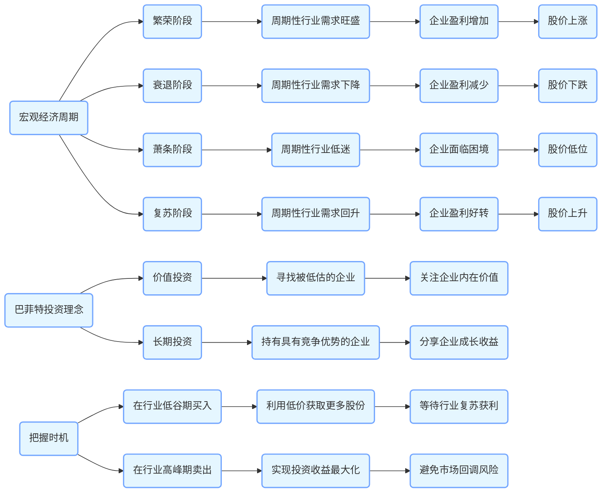

# 巴菲特的周期性行业投资策略：把握时机的重要性

> 关键词：巴菲特、周期性行业、投资策略、把握时机、价值投资

> 摘要：本文深入探讨了巴菲特在周期性行业的投资策略，着重分析把握时机在其中的重要性。通过对周期性行业的特点、巴菲特投资理念的剖析，结合相关核心概念、算法原理、数学模型等多方面内容，阐述了如何在周期性行业投资中精准把握时机以实现价值最大化。同时，借助项目实战案例和实际应用场景的分析，展示投资策略的实际运用，并推荐了相关学习资源、开发工具及论文著作，最后对未来发展趋势与挑战进行总结，旨在为投资者提供全面且深入的投资参考。

## 1. 背景介绍 
### 1.1 目的和范围
本文旨在深入研究巴菲特在周期性行业的投资策略，重点聚焦于把握时机在其中的关键作用。范围涵盖周期性行业的特点分析、巴菲特投资理念的解读、投资时机选择的理论与实践探讨，以及对相关投资策略的全面剖析和未来展望。通过对这些内容的研究，帮助投资者更好地理解和应用巴菲特的投资策略，提高在周期性行业的投资成功率。

### 1.2 预期读者
本文预期读者包括对投资领域感兴趣的个人投资者、金融从业者、投资研究人员以及相关专业的学生。无论是初涉投资领域希望学习投资知识的新手，还是有一定投资经验想要深入了解巴菲特投资策略的专业人士，都能从本文中获得有价值的信息和启示。

### 1.3 文档结构概述
本文首先介绍研究的背景，包括目的、预期读者和文档结构概述等内容。接着阐述周期性行业投资的核心概念与联系，通过文本示意图和 Mermaid 流程图进行直观展示。然后详细讲解核心算法原理及具体操作步骤，并运用 Python 源代码进行说明。随后介绍相关的数学模型和公式，通过举例进行详细讲解。在项目实战部分，给出代码实际案例并进行详细解释说明。之后分析实际应用场景，推荐相关工具和资源。最后总结未来发展趋势与挑战，解答常见问题并提供扩展阅读和参考资料。

### 1.4 术语表
#### 1.4.1 核心术语定义
- **周期性行业**：指和国内或国际经济波动相关性较强的行业，其发展状况与宏观经济周期密切相关，如钢铁、煤炭、汽车等行业。
- **投资策略**：投资者为实现投资目标而采取的一系列投资方法和决策的组合。
- **价值投资**：一种基于公司内在价值进行投资的理念，强调通过对公司基本面的分析，寻找被低估的股票进行投资。
- **投资时机**：指投资者在进行投资决策时选择的合适时间点，在周期性行业中，把握正确的投资时机对于投资收益至关重要。

#### 1.4.2 相关概念解释
- **宏观经济周期**：经济活动沿着经济发展的总体趋势所经历的有规律的扩张和收缩，一般包括繁荣、衰退、萧条和复苏四个阶段。
- **行业景气度**：反映行业发展状况的综合指标，体现行业在一定时期内的繁荣程度和发展趋势。
- **内在价值**：公司未来现金流的现值，是价值投资中评估股票是否被低估或高估的重要依据。

#### 1.4.3 缩略词列表
- **PE**：市盈率（Price Earnings Ratio），是股票价格除以每股收益的比率，用于衡量股票的估值水平。
- **PB**：市净率（Price to Book Ratio），是股票价格与每股净资产的比率，反映了股票的市场价值与账面价值的关系。

## 2. 核心概念与联系 

### 周期性行业的特点
周期性行业的发展与宏观经济周期紧密相连。在经济繁荣阶段，市场需求旺盛，周期性行业的产品或服务销量大增，企业盈利水平提高，行业呈现快速发展的态势；而在经济衰退阶段，市场需求下降，产品或服务供过于求，企业盈利减少，行业发展陷入困境。例如，钢铁行业在经济繁荣时期，房地产、基础设施建设等领域对钢铁的需求大增，钢铁企业的产量和利润都会显著提高；而在经济衰退时，这些领域的需求减少，钢铁企业面临产能过剩、价格下跌等问题。

### 巴菲特的投资理念
巴菲特秉持价值投资理念，强调投资于具有长期竞争优势和稳定现金流的企业。他认为股票的价格会围绕其内在价值波动，投资者应该寻找那些价格低于内在价值的股票进行投资。在周期性行业中，巴菲特并非盲目跟风，而是通过深入研究行业和企业的基本面，寻找那些在行业低谷期被低估但具有强大竞争力和复苏潜力的企业。

### 把握时机的重要性
在周期性行业投资中，把握时机至关重要。如果在行业景气度高峰期投资，此时股票价格往往已经处于高位，企业盈利可能已经达到顶峰，后续可能面临业绩下滑和股价下跌的风险；而在行业低谷期投资，虽然市场情绪低迷，但此时股票价格可能被低估，一旦行业复苏，企业盈利回升，股票价格也会随之上涨，投资者能够获得丰厚的回报。例如，巴菲特在 2008 年金融危机期间，对一些金融和能源等周期性行业的企业进行了投资，在市场恐慌时抓住了低价买入的机会，随着经济的复苏，这些投资获得了巨大的收益。

### 核心概念原理和架构的文本示意图
```plaintext
宏观经济周期
    |
    |---- 繁荣阶段 ---- 周期性行业需求旺盛 ---- 企业盈利增加 ---- 股价上涨
    |
    |---- 衰退阶段 ---- 周期性行业需求下降 ---- 企业盈利减少 ---- 股价下跌
    |
    |---- 萧条阶段 ---- 周期性行业低迷 ---- 企业面临困境 ---- 股价低位
    |
    |---- 复苏阶段 ---- 周期性行业需求回升 ---- 企业盈利好转 ---- 股价上升

巴菲特投资理念
    |
    |---- 价值投资 ---- 寻找被低估的企业 ---- 关注企业内在价值
    |
    |---- 长期投资 ---- 持有具有竞争优势的企业 ---- 分享企业成长收益

把握时机
    |
    |---- 在行业低谷期买入 ---- 利用低价获取更多股份 ---- 等待行业复苏获利
    |
    |---- 在行业高峰期卖出 ---- 实现投资收益最大化 ---- 避免市场回调风险
```

### Mermaid 流程图


## 3. 核心算法原理 & 具体操作步骤 

### 核心算法原理
在分析周期性行业投资时机时，可以结合行业的财务指标和宏观经济数据进行综合判断。其中，市盈率（PE）和市净率（PB）是常用的估值指标，通过与历史数据和行业平均水平进行比较，可以判断股票是否被低估或高估。同时，宏观经济数据如 GDP 增长率、通货膨胀率等可以反映宏观经济周期的变化，为投资时机的选择提供参考。

以下是一个简单的 Python 代码示例，用于计算股票的市盈率和市净率，并根据历史数据判断其估值水平：

```python
# 定义股票类
class Stock:
    def __init__(self, price, earnings_per_share, book_value_per_share):
        self.price = price
        self.earnings_per_share = earnings_per_share
        self.book_value_per_share = book_value_per_share

    # 计算市盈率
    def calculate_pe(self):
        if self.earnings_per_share == 0:
            return None
        return self.price / self.earnings_per_share

    # 计算市净率
    def calculate_pb(self):
        if self.book_value_per_share == 0:
            return None
        return self.price / self.book_value_per_share

# 示例数据
stock = Stock(50, 5, 20)

# 计算市盈率和市净率
pe = stock.calculate_pe()
pb = stock.calculate_pb()

print(f"市盈率: {pe}")
print(f"市净率: {pb}")

# 假设历史平均市盈率为 15，历史平均市净率为 2
historical_avg_pe = 15
historical_avg_pb = 2

# 判断估值水平
if pe is not None and pe < historical_avg_pe and pb is not None and pb < historical_avg_pb:
    print("股票可能被低估")
elif pe is not None and pe > historical_avg_pe and pb is not None and pb > historical_avg_pb:
    print("股票可能被高估")
else:
    print("股票估值处于合理水平")
```

### 具体操作步骤
1. **数据收集**：收集周期性行业相关企业的财务数据，包括股价、每股收益、每股净资产等，以及宏观经济数据，如 GDP 增长率、通货膨胀率等。
2. **指标计算**：根据收集到的数据，计算市盈率、市净率等估值指标。
3. **历史数据比较**：将计算得到的估值指标与历史数据和行业平均水平进行比较，判断股票的估值水平。
4. **宏观经济分析**：结合宏观经济数据，判断宏观经济周期所处的阶段，如繁荣、衰退、萧条或复苏。
5. **投资决策**：根据估值水平和宏观经济周期的判断，决定是否进行投资以及投资的时机。在行业低谷期，当股票被低估且宏观经济有复苏迹象时，可以考虑买入；在行业高峰期，当股票被高估且宏观经济有衰退风险时，可以考虑卖出。

## 4. 数学模型和公式 & 详细讲解 & 举例说明 

### 市盈率（PE）
市盈率是股票价格与每股收益的比率，计算公式为：
$$PE = \frac{P}{EPS}$$
其中，$PE$ 表示市盈率，$P$ 表示股票价格，$EPS$ 表示每股收益。

市盈率反映了投资者为获得公司每一元盈利所愿意支付的价格。一般来说，市盈率越低，股票越被低估；市盈率越高，股票越被高估。例如，某股票价格为 50 元，每股收益为 5 元，则其市盈率为：
$$PE = \frac{50}{5} = 10$$

### 市净率（PB）
市净率是股票价格与每股净资产的比率，计算公式为：
$$PB = \frac{P}{BVPS}$$
其中，$PB$ 表示市净率，$P$ 表示股票价格，$BVPS$ 表示每股净资产。

市净率反映了股票的市场价值与账面价值的关系。一般来说，市净率越低，股票越被低估；市净率越高，股票越被高估。例如，某股票价格为 50 元，每股净资产为 20 元，则其市净率为：
$$PB = \frac{50}{20} = 2.5$$

### 举例说明
假设我们要分析一家钢铁企业的投资价值。该企业当前股票价格为 30 元，每股收益为 3 元，每股净资产为 15 元。

计算市盈率：
$$PE = \frac{30}{3} = 10$$

计算市净率：
$$PB = \frac{30}{15} = 2$$

假设钢铁行业的历史平均市盈率为 12，历史平均市净率为 2.5。通过比较可以发现，该企业的市盈率低于历史平均水平，市净率也低于历史平均水平，说明该股票可能被低估，具有一定的投资价值。

同时，我们可以结合宏观经济数据进行分析。如果当前宏观经济处于衰退后期，有复苏的迹象，而钢铁行业作为周期性行业，往往会在经济复苏阶段首先受益，那么此时可以考虑买入该股票，等待行业复苏和企业盈利的提升。

## 5. 项目实战：代码实际案例和详细解释说明 

### 5.1  开发环境搭建
在进行周期性行业投资分析的项目实战时，我们可以使用 Python 语言进行开发。以下是搭建开发环境的步骤：
1. **安装 Python**：从 Python 官方网站（https://www.python.org/downloads/）下载并安装 Python 3.x 版本。
2. **安装开发工具**：推荐使用 PyCharm 作为开发工具，它是一款功能强大的 Python 集成开发环境（IDE）。可以从 PyCharm 官方网站（https://www.jetbrains.com/pycharm/download/）下载并安装。
3. **安装必要的库**：在项目中，我们需要使用一些库来进行数据处理和分析，如 Pandas、Numpy 等。可以使用以下命令进行安装：
```sh
pip install pandas numpy
```

### 5.2  源代码详细实现和代码解读
以下是一个完整的 Python 代码示例，用于分析周期性行业股票的投资价值：

```python
import pandas as pd
import numpy as np

# 定义股票类
class Stock:
    def __init__(self, price, earnings_per_share, book_value_per_share):
        self.price = price
        self.earnings_per_share = earnings_per_share
        self.book_value_per_share = book_value_per_share

    # 计算市盈率
    def calculate_pe(self):
        if self.earnings_per_share == 0:
            return None
        return self.price / self.earnings_per_share

    # 计算市净率
    def calculate_pb(self):
        if self.book_value_per_share == 0:
            return None
        return self.price / self.book_value_per_share

# 读取股票数据
def read_stock_data(file_path):
    data = pd.read_csv(file_path)
    return data

# 分析股票投资价值
def analyze_stock_value(data, historical_avg_pe, historical_avg_pb):
    results = []
    for index, row in data.iterrows():
        stock = Stock(row['price'], row['earnings_per_share'], row['book_value_per_share'])
        pe = stock.calculate_pe()
        pb = stock.calculate_pb()

        if pe is not None and pe < historical_avg_pe and pb is not None and pb < historical_avg_pb:
            value_judgment = "股票可能被低估"
        elif pe is not None and pe > historical_avg_pe and pb is not None and pb > historical_avg_pb:
            value_judgment = "股票可能被高估"
        else:
            value_judgment = "股票估值处于合理水平"

        result = {
            'stock_name': row['stock_name'],
            'pe': pe,
            'pb': pb,
            'value_judgment': value_judgment
        }
        results.append(result)

    return pd.DataFrame(results)

# 主函数
def main():
    file_path = 'stock_data.csv'  # 股票数据文件路径
    historical_avg_pe = 15  # 历史平均市盈率
    historical_avg_pb = 2  # 历史平均市净率

    # 读取股票数据
    stock_data = read_stock_data(file_path)

    # 分析股票投资价值
    analysis_results = analyze_stock_value(stock_data, historical_avg_pe, historical_avg_pb)

    # 输出分析结果
    print(analysis_results)

if __name__ == "__main__":
    main()
```

### 代码解读与分析
1. **股票类（Stock）**：定义了一个股票类，包含股票价格、每股收益和每股净资产等属性，并提供了计算市盈率和市净率的方法。
2. **读取股票数据（read_stock_data）**：使用 Pandas 库读取存储股票数据的 CSV 文件，并返回一个 DataFrame 对象。
3. **分析股票投资价值（analyze_stock_value）**：遍历股票数据，计算每只股票的市盈率和市净率，并与历史平均水平进行比较，判断股票的估值水平。
4. **主函数（main）**：设置股票数据文件路径、历史平均市盈率和市净率，调用读取数据和分析价值的函数，最后输出分析结果。

通过这个代码示例，我们可以对周期性行业的股票进行批量分析，判断其投资价值，为投资决策提供参考。

## 6. 实际应用场景 
### 钢铁行业投资
在钢铁行业，其发展与宏观经济周期高度相关。当经济处于繁荣阶段时，房地产、基础设施建设等领域对钢铁的需求大增，钢铁企业的产量和利润都会显著提高；而在经济衰退阶段，这些领域的需求减少，钢铁企业面临产能过剩、价格