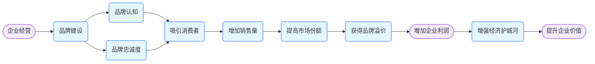

# 巴菲特的品牌价值理论：无形资产的重要性

> 关键词：巴菲特、品牌价值理论、无形资产、企业估值、竞争优势、投资策略、经济护城河

> 摘要：本文深入探讨了巴菲特的品牌价值理论，着重阐述无形资产在企业经营与投资领域的重要性。从背景介绍入手，剖析该理论的目的、适用范围、预期读者和文档结构。详细解析品牌价值等核心概念及其内在联系，通过 Python 代码阐释核心算法原理与操作步骤，运用数学模型和公式进一步说明品牌价值对企业的影响。结合项目实战案例，展示如何在实际中评估品牌等无形资产。探讨其在不同场景的应用，推荐相关学习资源、开发工具和研究论文。最后总结品牌价值理论的未来发展趋势与挑战，解答常见问题并提供扩展阅读和参考资料，旨在为投资者、企业管理者等提供全面深入的理论与实践指导。

## 1. 背景介绍 

### 1.1 目的和范围
巴菲特作为投资界的传奇人物，其品牌价值理论对理解企业的真实价值和投资潜力具有重要意义。本文的目的在于深入剖析巴菲特的品牌价值理论，揭示无形资产在企业发展和投资决策中的关键作用。通过对该理论的研究，我们将探讨如何评估品牌等无形资产的价值，以及这些资产如何影响企业的长期竞争力和财务表现。本文的范围涵盖了品牌价值理论的核心概念、算法原理、数学模型，还包括实际应用场景、相关工具资源以及未来发展趋势等方面。

### 1.2 预期读者
本文预期读者包括投资者，无论是专业的基金经理、个人投资者还是投资研究人员，他们可以通过本文学习如何运用巴菲特的品牌价值理论来评估投资标的，挖掘具有潜在价值的企业。企业管理者也能从本文中获得启示，了解如何提升企业的品牌价值和无形资产，增强企业的市场竞争力。此外，对商业和投资领域感兴趣的学者、学生以及行业分析师等也能从本文中获取有价值的信息。

### 1.3 文档结构概述
本文将按照以下结构展开：首先介绍品牌价值理论的背景信息，包括目的、预期读者和文档结构概述。接着详细阐述核心概念与联系，通过文本示意图和 Mermaid 流程图展示品牌价值与其他相关概念的关系。然后讲解核心算法原理和具体操作步骤，使用 Python 代码进行详细说明。随后介绍数学模型和公式，并通过具体例子进行讲解。在项目实战部分，给出代码实际案例并进行详细解释。接着探讨该理论的实际应用场景，推荐相关的工具和资源。最后总结未来发展趋势与挑战，解答常见问题并提供扩展阅读和参考资料。

### 1.4 术语表
#### 1.4.1 核心术语定义
- **品牌价值**：品牌在消费者心目中的认知和评价所形成的价值，它体现了品牌对消费者的吸引力和影响力，以及品牌为企业带来的未来收益的能力。
- **无形资产**：企业拥有或控制的没有实物形态的可辨认非货币性资产，如品牌、专利、商标、商誉等。
- **经济护城河**：企业所拥有的可持续的竞争优势，能够保护企业的市场份额和利润，使其在长期内抵御竞争对手的侵蚀。
- **企业估值**：对企业的价值进行评估的过程，通常考虑企业的财务状况、市场前景、无形资产等多种因素。

#### 1.4.2 相关概念解释
- **品牌忠诚度**：消费者对某个品牌的信任和依赖程度，表现为消费者在多次购买决策中持续选择该品牌的产品或服务。
- **品牌溢价**：消费者愿意为某个品牌的产品或服务支付高于同类非品牌产品或服务的价格，它反映了品牌的市场竞争力和消费者对品牌的认可程度。
- **商誉**：企业在合并或收购过程中，购买方支付的超过被购买方可辨认净资产公允价值的部分，它反映了企业的声誉、客户关系、管理团队等因素所带来的价值。

#### 1.4.3 缩略词列表
- **DCF**：Discounted Cash Flow，现金流折现法，一种常用的企业估值方法，通过预测企业未来的现金流并将其折现到当前来计算企业的价值。
- **ROE**：Return on Equity，净资产收益率，衡量企业运用自有资本的效率和盈利能力的指标。

## 2. 核心概念与联系 

### 核心概念原理
巴菲特认为，品牌是企业最重要的无形资产之一，具有强大的品牌价值的企业往往具有更持久的竞争优势和更高的盈利能力。品牌价值的形成源于消费者对品牌的认知、信任和情感认同。一个具有良好品牌形象的企业，能够吸引更多的消费者，提高产品或服务的销售量和市场份额，同时还能获得品牌溢价，从而增加企业的利润。

品牌价值与企业的经济护城河密切相关。经济护城河是企业抵御竞争对手的屏障，而品牌价值是构成经济护城河的重要因素之一。强大的品牌可以让企业在市场中脱颖而出，使消费者更愿意选择该品牌的产品或服务，即使竞争对手提供类似的产品或服务，消费者也会因为对品牌的信任而选择该品牌。

### 架构的文本示意图
```plaintext
               企业价值
              /         \
         有形资产      无形资产
                      /   |   \
                   品牌  专利  商誉
                  / |
  品牌认知  品牌忠诚度
```
这个示意图展示了企业价值由有形资产和无形资产组成，而无形资产中品牌是重要的一部分。品牌又与品牌认知和品牌忠诚度相关，这些因素共同影响着企业的价值。

### Mermaid 流程图

该流程图展示了从企业的品牌建设开始，通过提高品牌认知和品牌忠诚度，吸引消费者，增加销售量和市场份额，获得品牌溢价，最终增加企业利润，增强经济护城河，提升企业价值的整个过程。

## 3. 核心算法原理 & 具体操作步骤 

### 品牌价值评估的核心算法原理
评估品牌价值的方法有多种，其中一种常用的方法是基于现金流折现法（DCF）。该方法的基本原理是将品牌未来能够为企业带来的现金流进行折现，得到品牌的当前价值。

假设品牌在未来 $n$ 年内每年为企业带来的现金流分别为 $CF_1, CF_2, \cdots, CF_n$，折现率为 $r$，则品牌的价值 $V$ 可以通过以下公式计算：

$$V = \sum_{i=1}^{n} \frac{CF_i}{(1 + r)^i}$$

### Python 代码实现
```python
def brand_value(cash_flows, discount_rate):
    """
    计算品牌价值
    :param cash_flows: 未来每年的现金流列表
    :param discount_rate: 折现率
    :return: 品牌价值
    """
    total_value = 0
    for i, cf in enumerate(cash_flows, start=1):
        total_value += cf / ((1 + discount_rate) ** i)
    return total_value

# 示例数据
cash_flows = [100, 120, 150, 180, 200]  # 未来 5 年的现金流
discount_rate = 0.1  # 折现率为 10%

# 计算品牌价值
value = brand_value(cash_flows, discount_rate)
print(f"品牌价值为: {value}")
```

### 具体操作步骤
1. **预测未来现金流**：分析品牌的市场地位、竞争优势、行业发展趋势等因素，预测品牌在未来若干年内每年能够为企业带来的现金流。
2. **确定折现率**：折现率反映了资金的时间价值和投资的风险。一般可以参考市场上类似投资的收益率来确定折现率。
3. **计算品牌价值**：将预测的未来现金流代入上述公式，使用 Python 代码或其他计算工具计算品牌的价值。

## 4. 数学模型和公式 & 详细讲解 & 举例说明 

### 数学模型和公式
#### 品牌价值的现金流折现模型
如前文所述，品牌价值的计算公式为：

$$V = \sum_{i=1}^{n} \frac{CF_i}{(1 + r)^i}$$

其中，$V$ 表示品牌价值，$CF_i$ 表示第 $i$ 年的现金流，$r$ 表示折现率，$n$ 表示预测的年数。

#### 品牌溢价模型
品牌溢价可以通过以下公式计算：

$$P = (P_b - P_n) \times Q$$

其中，$P$ 表示品牌溢价，$P_b$ 表示品牌产品的价格，$P_n$ 表示非品牌同类产品的价格，$Q$ 表示品牌产品的销售量。

### 详细讲解
#### 现金流折现模型
现金流折现模型的核心思想是将未来的现金流折现到当前，考虑了资金的时间价值。因为同样的一笔钱，现在的价值要高于未来的价值，所以需要对未来的现金流进行折现。折现率 $r$ 反映了投资者对资金的时间价值和投资风险的要求。如果折现率较高，说明投资者对风险的要求较高，未来现金流的现值就会较低；反之，如果折现率较低，未来现金流的现值就会较高。

#### 品牌溢价模型
品牌溢价模型通过比较品牌产品和非品牌同类产品的价格差异，并乘以品牌产品的销售量，来计算品牌为企业带来的额外收益。品牌溢价反映了品牌在市场上的竞争力和消费者对品牌的认可程度。

### 举例说明
#### 现金流折现模型举例
假设某品牌预计未来 3 年的现金流分别为 200 万元、250 万元和 300 万元，折现率为 10%。则该品牌的价值计算如下：

第 1 年现金流的现值：$\frac{200}{(1 + 0.1)^1} = \frac{200}{1.1} \approx 181.82$（万元）

第 2 年现金流的现值：$\frac{250}{(1 + 0.1)^2} = \frac{250}{1.21} \approx 206.61$（万元）

第 3 年现金流的现值：$\frac{300}{(1 + 0.1)^3} = \frac{300}{1.331} \approx 225.39$（万元）

品牌价值：$181.82 + 206.61 + 225.39 = 613.82$（万元）

#### 品牌溢价模型举例
某品牌的一款产品价格为 500 元，非品牌同类产品价格为 300 元，该品牌产品的年销售量为 10000 件。则该品牌的品牌溢价为：

$(500 - 300) \times 10000 = 200 \times 10000 = 2000000$（元）

## 5. 项目实战：代码实际案例和详细解释说明 

### 5.1  开发环境搭建
在进行品牌价值评估的项目实战时，我们可以使用 Python 进行开发。以下是搭建开发环境的步骤：
1. **安装 Python**：从 Python 官方网站（https://www.python.org/downloads/）下载并安装适合你操作系统的 Python 版本。建议安装 Python 3.7 及以上版本。
2. **安装开发工具**：可以选择使用 PyCharm、Jupyter Notebook 等开发工具。PyCharm 是一款功能强大的 Python 集成开发环境，适合进行大型项目的开发；Jupyter Notebook 则适合进行交互式的数据分析和代码演示。
3. **安装必要的库**：在项目中，我们可能会用到一些 Python 库，如 `numpy`、`pandas` 等。可以使用以下命令安装这些库：
```bash
pip install numpy pandas
```

### 5.2  源代码详细实现和代码解读
```python
import numpy as np
import pandas as pd

def predict_cash_flows(historical_data, growth_rate, years):
    """
    预测未来现金流
    :param historical_data: 历史现金流数据
    :param growth_rate: 现金流增长率
    :param years: 预测的年数
    :return: 未来现金流列表
    """
    last_cash_flow = historical_data[-1]
    cash_flows = []
    for i in range(years):
        next_cash_flow = last_cash_flow * (1 + growth_rate)
        cash_flows.append(next_cash_flow)
        last_cash_flow = next_cash_flow
    return cash_flows

def brand_value(cash_flows, discount_rate):
    """
    计算品牌价值
    :param cash_flows: 未来每年的现金流列表
    :param discount_rate: 折现率
    :return: 品牌价值
    """
    years = len(cash_flows)
    discount_factors = 1 / (1 + discount_rate) ** np.arange(1, years + 1)
    present_values = np.array(cash_flows) * discount_factors
    return present_values.sum()

# 示例数据
historical_data = [100, 110, 120]  # 历史现金流数据
growth_rate = 0.1  # 现金流增长率为 10%
years = 5  # 预测未来 5 年的现金流
discount_rate = 0.1  # 折现率为 10%

# 预测未来现金流
future_cash_flows = predict_cash_flows(historical_data, growth_rate, years)

# 计算品牌价值
value = brand_value(future_cash_flows, discount_rate)

print(f"预测的未来现金流: {future_cash_flows}")
print(f"品牌价值为: {value}")
```

### 代码解读与分析
1. **`predict_cash_flows` 函数**：该函数根据历史现金流数据和现金流增长率，预测未来若干年的现金流。它通过循环计算每年的现金流，假设现金流按照固定的增长率增长。
2. **`brand_value` 函数**：该函数使用现金流折现法计算品牌价值。它首先计算折现因子，然后将未来现金流乘以折现因子得到现值，最后将所有现值相加得到品牌价值。
3. **主程序**：在主程序中，我们定义了历史现金流数据、现金流增长率、预测年数和折现率。然后调用 `predict_cash_flows` 函数预测未来现金流，再调用 `brand_value` 函数计算品牌价值。最后打印出预测的未来现金流和品牌价值。

## 6. 实际应用场景 
### 投资决策
在投资领域，巴菲特的品牌价值理论可以帮助投资者评估企业的真实价值，筛选出具有投资潜力的企业。投资者可以通过分析企业的品牌价值、品牌忠诚度、品牌溢价等因素，判断企业是否具有可持续的竞争优势和良好的财务前景。例如，可口可乐公司凭借其强大的品牌价值，在全球饮料市场占据主导地位，其品牌忠诚度高，消费者愿意为其产品支付较高的价格，因此具有较高的投资价值。

### 企业战略规划
企业管理者可以运用品牌价值理论来制定企业的战略规划。通过提升品牌价值，企业可以增强市场竞争力，扩大市场份额，提高盈利能力。例如，苹果公司通过不断创新和提供高品质的产品和服务，提升了其品牌价值，使其在全球智能手机市场处于领先地位。企业管理者还可以通过品牌延伸、品牌合作等策略，进一步挖掘品牌的价值，实现企业的多元化发展。

### 企业并购与重组
在企业并购与重组过程中，品牌价值是一个重要的考虑因素。收购方需要评估被收购企业的品牌价值，以确定合理的收购价格。一个具有强大品牌价值的企业，其收购价格往往会高于其账面价值。例如，雀巢公司在收购惠氏奶粉业务时，就考虑了惠氏品牌的价值，支付了较高的收购价格。同时，在企业重组过程中，品牌的整合和提升也是关键环节，有助于提高企业的整体竞争力。

### 市场营销
品牌价值理论对企业的市场营销活动具有重要指导意义。企业可以通过品牌建设和传播，提高品牌的知名度、美誉度和忠诚度。例如，通过广告宣传、公关活动、赞助体育赛事等方式，提升品牌的曝光度和影响力。同时，企业还可以根据品牌价值的评估结果，制定差异化的市场营销策略，满足不同消费者群体的需求，提高市场销售业绩。

## 7. 工具和资源推荐
### 7.1 学习资源推荐
#### 7.1.1 书籍推荐
- 《巴菲特致股东的信：投资者和公司高管教程》：这本书收录了巴菲特多年来致股东的信，其中包含了他对投资、企业管理、品牌价值等方面的深刻见解，是学习巴菲特投资理念的经典书籍。
- 《品牌洗脑：世界著名品牌只做不说的营销秘密》：该书深入探讨了品牌营销的奥秘，揭示了品牌如何影响消费者的心理和行为，对于理解品牌价值的形成和传播具有重要意义。
- 《竞争战略》：作者迈克尔·波特提出了著名的竞争战略理论，包括成本领先战略、差异化战略和集中化战略，对于企业如何构建品牌竞争优势提供了理论指导。

#### 7.1.2 在线课程
- Coursera 上的“Investment Management Specialization”：该课程由知名高校的教授授课，涵盖了投资管理的各个方面，包括企业估值、品牌价值评估等内容。
- edX 上的“Marketing Analytics”：课程主要介绍了市场营销分析的方法和工具，其中涉及到品牌价值的评估和分析，有助于提升学习者在市场营销领域的数据分析能力。

#### 7.1.3 技术博客和网站
- Seeking Alpha：这是一个知名的投资研究网站，提供了大量关于企业分析、投资策略的文章和研究报告，其中不乏对品牌价值的深入分析。
- BrandFinance：该网站专注于品牌价值评估和研究，定期发布全球品牌价值排行榜和相关研究报告，是获取品牌价值信息的重要渠道。

### 7.2 开发工具框架推荐
#### 7.2.1 IDE和编辑器
- PyCharm：一款功能强大的 Python 集成开发环境，具有代码自动补全、调试、版本控制等功能，适合进行品牌价值评估项目的开发。
- Jupyter Notebook：交互式的数据分析工具，支持 Python 代码的编写和运行，方便进行数据探索、模型验证和结果展示。

#### 7.2.2 调试和性能分析工具
- PySnooper：一个简单易用的 Python 调试工具，可以在不修改代码的情况下，输出函数的执行过程和变量的值，帮助开发者快速定位问题。
- cProfile：Python 内置的性能分析工具，可以分析代码的运行时间和函数调用次数，帮助开发者优化代码性能。

#### 7.2.3 相关框架和库
- `numpy`：用于进行数值计算和数组操作的 Python 库，在品牌价值评估的算法实现中经常会用到。
- `pandas`：用于数据处理和分析的 Python 库，提供了强大的数据结构和数据操作功能，方便处理历史现金流数据等。

### 7.3 相关论文著作推荐
#### 7.3.1 经典论文
- “The Economic Implications of Brand Equity”：该论文探讨了品牌资产的经济含义，分析了品牌价值对企业财务绩效和市场竞争力的影响，是品牌价值研究领域的经典之作。
- “Consumer-Based Brand Equity: Conceptualization, Measurement, and Management”：论文提出了基于消费者的品牌资产概念，并介绍了品牌资产的测量方法和管理策略，对于理解品牌价值的形成机制具有重要意义。

#### 7.3.2 最新研究成果
- 近年来，随着人工智能和大数据技术的发展，一些学者开始将这些技术应用于品牌价值评估中。例如，有研究利用机器学习算法分析社交媒体数据，以评估品牌的声誉和消费者情感，从而更准确地评估品牌价值。
- 另一些研究则关注品牌价值与可持续发展的关系，探讨品牌如何通过履行社会责任来提升品牌价值和企业形象。

#### 7.3.3 应用案例分析
- 一些知名企业的品牌价值评估案例可以为我们提供实际应用的参考。例如，星巴克公司通过品牌建设和营销策略，成功提升了品牌价值，其品牌溢价和市场份额不断增长。相关的案例分析可以帮助我们了解企业在品牌价值管理方面的成功经验和实践方法。

## 8. 总结：未来发展趋势与挑战
### 未来发展趋势
#### 数字化与智能化
随着互联网和移动技术的普及，品牌的传播和营销方式将更加数字化和智能化。企业可以利用大数据、人工智能等技术，深入了解消费者的需求和行为，精准地进行品牌推广和营销活动。同时，数字化技术也为品牌价值的评估提供了更多的数据来源和分析方法，使评估结果更加准确和及时。

#### 品牌全球化
在经济全球化的背景下，品牌的全球化趋势将更加明显。越来越多的企业将目光投向国际市场，打造具有全球影响力的品牌。品牌全球化不仅要求企业在产品质量、服务水平等方面达到国际标准，还需要在品牌文化、品牌形象等方面进行跨文化的传播和融合。

#### 可持续发展与社会责任
消费者对企业的社会责任和可持续发展越来越关注，一个具有良好社会形象和可持续发展理念的品牌将更容易获得消费者的认可和信任。未来，企业将更加注重品牌的社会责任建设，通过环保、公益等活动提升品牌价值和企业形象。

### 挑战
#### 品牌竞争加剧
随着市场竞争的日益激烈，品牌之间的竞争也将更加残酷。企业需要不断创新和提升品牌价值，以在激烈的市场竞争中脱颖而出。同时，新品牌的不断涌现也给现有品牌带来了巨大的挑战，如何保持品牌的竞争力和市场份额是企业面临的重要问题。

#### 品牌危机管理
在信息传播迅速的时代，品牌一旦出现危机事件，将迅速在网络上传播，对品牌形象造成严重的损害。企业需要建立完善的品牌危机管理机制，及时应对和处理品牌危机事件，降低危机对品牌价值的影响。

#### 数据安全与隐私保护
在数字化时代，品牌价值评估和营销活动离不开大量的数据支持。然而，数据安全和隐私保护问题也日益凸显。企业需要加强数据安全管理，保护消费者的隐私信息，避免因数据泄露等问题对品牌形象造成负面影响。

## 9. 附录：常见问题与解答
### 问题 1：如何准确预测品牌未来的现金流？
解答：准确预测品牌未来的现金流需要综合考虑多个因素。首先，要对品牌的历史财务数据进行分析，了解品牌的销售增长趋势、利润率等指标。其次，要研究品牌所处的行业发展趋势，包括市场规模、竞争格局、技术创新等因素。此外，还需要考虑品牌的市场定位、品牌忠诚度、品牌营销策略等因素对现金流的影响。可以采用定性和定量相结合的方法，结合专家意见和数据分析来进行预测。

### 问题 2：折现率的确定有哪些方法？
解答：折现率的确定方法有多种。一种常用的方法是参考市场上类似投资的收益率，例如国债收益率、股票市场的平均收益率等。可以根据品牌的风险水平，在市场收益率的基础上进行适当调整。另一种方法是使用资本资产定价模型（CAPM）来计算折现率，该模型考虑了无风险收益率、市场风险溢价和品牌的贝塔系数等因素。此外，还可以根据企业的加权平均资本成本（WACC）来确定折现率。

### 问题 3：品牌价值评估的结果是否具有可靠性？
解答：品牌价值评估的结果具有一定的主观性和不确定性，其可靠性受到多种因素的影响。评估方法的选择、数据的准确性和完整性、假设条件的合理性等都会影响评估结果的可靠性。因此，在进行品牌价值评估时，需要采用多种评估方法进行相互验证，同时要对评估过程中的假设条件进行充分的披露和分析。评估结果只能作为参考，不能作为绝对的决策依据。

### 问题 4：品牌价值与企业的市场价值有什么关系？
解答：品牌价值是企业市场价值的重要组成部分。一个具有强大品牌价值的企业，往往具有更高的市场竞争力和盈利能力，其市场价值也会相应较高。品牌价值可以通过影响企业的销售业绩、品牌溢价、客户忠诚度等因素，进而影响企业的市场价值。然而，企业的市场价值还受到其他因素的影响，如企业的财务状况、行业前景、管理团队等。因此，品牌价值只是企业市场价值的一个方面，不能完全代表企业的市场价值。

## 10. 扩展阅读 & 参考资料
### 扩展阅读
- 《创新者的窘境》：该书探讨了企业在面对技术创新和市场变革时所面临的挑战和机遇，对于理解品牌在创新时代的发展具有一定的启示作用。
- 《营销管理》：菲利普·科特勒的经典著作，全面介绍了市场营销的理论和实践，包括品牌管理、市场细分、目标市场选择等内容。

### 参考资料
- 巴菲特历年致股东的信官方网站
- BrandFinance 发布的品牌价值研究报告
- 学术数据库如知网、万方等收录的关于品牌价值的研究论文

作者：AI天才研究院/AI Genius Institute & 禅与计算机程序设计艺术 /Zen And The Art of Computer Programming