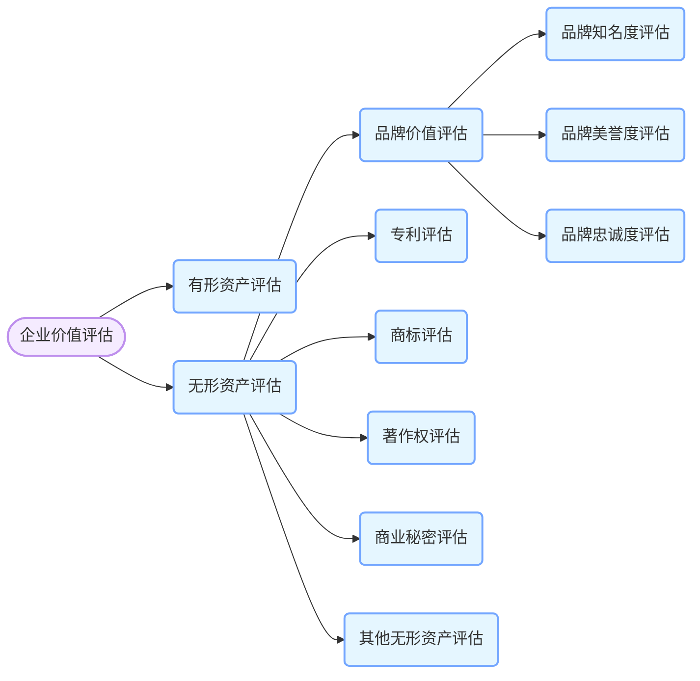

# 巴菲特的品牌价值评估：无形资产的重要性

> 关键词：巴菲特、品牌价值评估、无形资产、企业价值、经济护城河、投资策略

> 摘要：本文围绕巴菲特对品牌价值评估以及无形资产重要性展开探讨。首先介绍了研究此主题的目的、范围、预期读者和文档结构，明确相关术语。接着阐述品牌价值等核心概念及其联系，用示意图和流程图直观展示。详细讲解品牌价值评估的核心算法原理与操作步骤，并给出 Python 代码示例。通过数学模型和公式深入分析品牌价值对企业的影响。结合项目实战，从开发环境搭建到源代码实现与解读，呈现品牌价值评估的实际应用。探讨了品牌价值评估在不同场景下的应用，推荐了学习资源、开发工具框架和相关论文著作。最后总结品牌价值评估的未来趋势与挑战，解答常见问题并提供扩展阅读与参考资料，强调无形资产在企业价值和投资决策中的关键作用。

## 1. 背景介绍 
### 1.1 目的和范围
本研究的目的在于深入剖析巴菲特的品牌价值评估理念，探究无形资产在企业价值中的重要性。通过对相关理论和实践案例的研究，为投资者、企业管理者以及对商业价值评估感兴趣的人士提供全面且深入的见解。研究范围涵盖了品牌价值评估的基本概念、核心算法、数学模型，以及在实际项目中的应用和不同场景下的体现。同时，还将介绍与品牌价值评估相关的学习资源、开发工具和研究论文，为进一步深入研究提供指导。

### 1.2 预期读者
本文预期读者包括但不限于以下几类人群：
- **投资者**：希望通过了解品牌价值评估方法，更好地评估企业的内在价值，从而做出更明智的投资决策。
- **企业管理者**：关注企业无形资产的管理和提升，通过评估品牌价值，制定更有效的品牌战略，增强企业的竞争力。
- **学术研究者**：对商业价值评估、无形资产理论等领域进行深入研究，本文可提供相关理论和实践案例的参考。
- **金融分析师**：在进行企业财务分析和估值时，能够将品牌价值等无形资产纳入考量，提高分析的准确性和全面性。

### 1.3 文档结构概述
本文将按照以下结构进行阐述：
- **核心概念与联系**：介绍品牌价值、无形资产等核心概念，以及它们之间的相互关系，并通过示意图和流程图进行直观展示。
- **核心算法原理 & 具体操作步骤**：详细讲解品牌价值评估的核心算法原理，并用 Python 代码实现具体操作步骤。
- **数学模型和公式 & 详细讲解 & 举例说明**：运用数学模型和公式对品牌价值进行量化分析，并通过实际案例进行说明。
- **项目实战：代码实际案例和详细解释说明**：通过实际项目，展示品牌价值评估的具体实现过程，包括开发环境搭建、源代码实现和代码解读。
- **实际应用场景**：探讨品牌价值评估在不同场景下的应用，如企业并购、投资决策、品牌战略制定等。
- **工具和资源推荐**：推荐与品牌价值评估相关的学习资源、开发工具框架和研究论文。
- **总结：未来发展趋势与挑战**：总结品牌价值评估的发展趋势和面临的挑战。
- **附录：常见问题与解答**：解答读者在品牌价值评估过程中常见的问题。
- **扩展阅读 & 参考资料**：提供进一步深入研究的扩展阅读材料和参考资料。

### 1.4 术语表
#### 1.4.1 核心术语定义
- **品牌价值**：品牌在市场中所具有的价值，是品牌在消费者心目中的形象、声誉、忠诚度等因素的综合体现，能够为企业带来未来经济利益。
- **无形资产**：企业拥有或者控制的没有实物形态的可辨认非货币性资产，包括品牌、专利、商标、著作权、商业秘密等。
- **经济护城河**：由巴菲特提出的概念，指企业抵御竞争对手侵蚀其市场份额和盈利能力的可持续竞争优势，品牌价值是经济护城河的重要组成部分。
- **现金流折现模型（DCF）**：一种常用的企业估值方法，通过预测企业未来的现金流，并将其折现到当前，以评估企业的内在价值。

#### 1.4.2 相关概念解释
- **品牌资产**：与品牌价值密切相关，是品牌所拥有的全部资产，包括品牌知名度、美誉度、忠诚度等，是品牌价值的基础。
- **品牌溢价**：消费者愿意为某个品牌支付的高于同类产品或服务的价格，是品牌价值的一种外在表现。
- **品牌忠诚度**：消费者对某个品牌的重复购买意愿和行为，是衡量品牌价值的重要指标之一。

#### 1.4.3 缩略词列表
- **DCF**：Discounted Cash Flow，现金流折现模型
- **ROE**：Return on Equity，净资产收益率
- **P/E**：Price-to-Earnings Ratio，市盈率

## 2. 核心概念与联系 

### 核心概念原理
品牌价值是企业无形资产的重要组成部分，它源于品牌在消费者心目中的形象、声誉和认知。一个具有高品牌价值的企业，能够吸引更多的消费者，提高产品或服务的价格，从而增加企业的市场份额和盈利能力。品牌价值的形成是一个长期的过程，受到多种因素的影响，如品牌定位、品牌传播、产品质量、客户服务等。

无形资产是企业拥有的没有实物形态的资产，它们虽然不具有物理实体，但却能够为企业带来巨大的经济利益。除了品牌价值外，无形资产还包括专利、商标、著作权、商业秘密等。这些无形资产在企业的发展过程中起着至关重要的作用，它们可以提高企业的创新能力、市场竞争力和可持续发展能力。

经济护城河是巴菲特提出的一个重要概念，它指的是企业抵御竞争对手侵蚀其市场份额和盈利能力的可持续竞争优势。品牌价值是经济护城河的重要组成部分，一个强大的品牌可以形成较高的进入壁垒，使竞争对手难以模仿和超越。此外，专利、成本优势、网络效应等也可以构成企业的经济护城河。

### 架构的文本示意图
```plaintext
企业价值
|
|-- 有形资产
|
|-- 无形资产
    |
    |-- 品牌价值
    |   |
    |   |-- 品牌知名度
    |   |-- 品牌美誉度
    |   |-- 品牌忠诚度
    |
    |-- 专利
    |-- 商标
    |-- 著作权
    |-- 商业秘密
    |-- 其他
```

### Mermaid 流程图


## 3. 核心算法原理 & 具体操作步骤 

### 核心算法原理
品牌价值评估的方法有很多种，其中一种常用的方法是基于现金流折现模型（DCF）。该模型的基本原理是，将品牌未来能够带来的现金流折现到当前，以评估品牌的内在价值。具体步骤如下：
1. **预测品牌未来的现金流**：通过对品牌历史数据的分析和市场趋势的预测，估算品牌在未来一段时间内能够带来的现金流。
2. **确定折现率**：折现率反映了资金的时间价值和风险水平，通常可以根据企业的加权平均资本成本（WACC）来确定。
3. **计算品牌价值**：将预测的未来现金流按照折现率进行折现，然后求和，得到品牌的现值，即品牌价值。

### Python 代码实现
```python
import numpy as np

def calculate_brand_value(cash_flows, discount_rate):
    """
    计算品牌价值
    :param cash_flows: 未来各期的现金流列表
    :param discount_rate: 折现率
    :return: 品牌价值
    """
    n = len(cash_flows)
    present_values = []
    for i in range(n):
        present_value = cash_flows[i] / ((1 + discount_rate) ** (i + 1))
        present_values.append(present_value)
    brand_value = np.sum(present_values)
    return brand_value

# 示例数据
cash_flows = [100, 120, 130, 140, 150]  # 未来 5 年的现金流
discount_rate = 0.1  # 折现率为 10%

# 计算品牌价值
brand_value = calculate_brand_value(cash_flows, discount_rate)
print(f"品牌价值为: {brand_value}")
```

### 代码解释
1. **定义函数 `calculate_brand_value`**：该函数接受两个参数，`cash_flows` 表示未来各期的现金流列表，`discount_rate` 表示折现率。
2. **计算各期现金流的现值**：通过循环遍历现金流列表，将每一期的现金流按照折现率进行折现，得到各期现金流的现值。
3. **求和得到品牌价值**：将各期现金流的现值相加，得到品牌的现值，即品牌价值。
4. **示例数据和调用函数**：定义了未来 5 年的现金流和折现率，调用 `calculate_brand_value` 函数计算品牌价值，并打印结果。

## 4. 数学模型和公式 & 详细讲解 & 举例说明 

### 数学模型和公式
现金流折现模型（DCF）的数学公式为：
$$
V = \sum_{t=1}^{n} \frac{CF_t}{(1 + r)^t}
$$
其中：
- $V$ 表示品牌价值
- $CF_t$ 表示第 $t$ 期的现金流
- $r$ 表示折现率
- $n$ 表示预测的期数

### 详细讲解
该公式的含义是，将品牌未来 $n$ 期的现金流 $CF_t$ 按照折现率 $r$ 折现到当前，然后求和，得到品牌的现值 $V$。折现率 $r$ 反映了资金的时间价值和风险水平，折现率越高，未来现金流的现值越低，品牌价值也就越低。

### 举例说明
假设某品牌未来 3 年的现金流分别为 100 万元、120 万元和 130 万元，折现率为 10%。则该品牌的价值计算如下：
第 1 年现金流的现值：
$$
PV_1 = \frac{CF_1}{(1 + r)^1} = \frac{100}{(1 + 0.1)^1} \approx 90.91 \text{（万元）}
$$
第 2 年现金流的现值：
$$
PV_2 = \frac{CF_2}{(1 + r)^2} = \frac{120}{(1 + 0.1)^2} \approx 99.17 \text{（万元）}
$$
第 3 年现金流的现值：
$$
PV_3 = \frac{CF_3}{(1 + r)^3} = \frac{130}{(1 + 0.1)^3} \approx 97.67 \text{（万元）}
$$
品牌价值：
$$
V = PV_1 + PV_2 + PV_3 \approx 90.91 + 99.17 + 97.67 = 287.75 \text{（万元）}
$$

## 5. 项目实战：代码实际案例和详细解释说明 

### 5.1  开发环境搭建
为了实现品牌价值评估的项目，我们需要搭建以下开发环境：
- **Python 环境**：建议使用 Python 3.7 及以上版本，可以从 Python 官方网站（https://www.python.org/downloads/）下载并安装。
- **开发工具**：可以使用 PyCharm、Jupyter Notebook 等开发工具，这里推荐使用 Jupyter Notebook，它具有交互式编程的特点，方便代码的编写和调试。
- **必要的库**：需要安装 `numpy` 库，用于数值计算。可以使用以下命令进行安装：
```sh
pip install numpy
```

### 5.2  源代码详细实现和代码解读
```python
import numpy as np

# 定义函数计算品牌价值
def calculate_brand_value(cash_flows, discount_rate):
    """
    计算品牌价值
    :param cash_flows: 未来各期的现金流列表
    :param discount_rate: 折现率
    :return: 品牌价值
    """
    n = len(cash_flows)
    present_values = []
    for i in range(n):
        present_value = cash_flows[i] / ((1 + discount_rate) ** (i + 1))
        present_values.append(present_value)
    brand_value = np.sum(present_values)
    return brand_value

# 示例数据
# 假设某品牌未来 5 年的现金流分别为 80、90、100、110、120 万元
cash_flows = [80, 90, 100, 110, 120]
# 折现率为 8%
discount_rate = 0.08

# 计算品牌价值
brand_value = calculate_brand_value(cash_flows, discount_rate)
print(f"该品牌的价值为: {brand_value} 万元")
```

### 代码解读与分析
1. **导入必要的库**：导入 `numpy` 库，用于数值计算。
2. **定义函数 `calculate_brand_value`**：该函数接受两个参数，`cash_flows` 表示未来各期的现金流列表，`discount_rate` 表示折现率。函数内部通过循环遍历现金流列表，将每一期的现金流按照折现率进行折现，得到各期现金流的现值，然后将这些现值相加，得到品牌的价值。
3. **示例数据**：定义了某品牌未来 5 年的现金流和折现率。
4. **调用函数计算品牌价值**：调用 `calculate_brand_value` 函数计算品牌价值，并打印结果。

## 6. 实际应用场景 
### 企业并购
在企业并购中，品牌价值评估是非常重要的。收购方需要评估被收购企业的品牌价值，以确定合理的收购价格。一个具有高品牌价值的企业，通常具有更高的市场竞争力和盈利能力，收购方愿意支付更高的价格进行收购。例如，可口可乐公司在收购其他饮料品牌时，会对目标品牌的价值进行详细评估，以确保收购的合理性和效益性。

### 投资决策
投资者在进行投资决策时，也会考虑企业的品牌价值。一个具有强大品牌的企业，往往具有更稳定的现金流和更高的成长潜力，能够为投资者带来更好的回报。例如，巴菲特在投资股票时，非常注重企业的品牌价值，他认为像可口可乐、吉列等具有强大品牌的企业，具有较高的投资价值。

### 品牌战略制定
企业管理者在制定品牌战略时，需要了解品牌的价值和市场地位。通过品牌价值评估，企业可以了解自己的品牌在消费者心目中的形象和声誉，找出品牌的优势和劣势，从而制定出更有效的品牌战略。例如，苹果公司通过不断提升品牌价值，推出具有创新性和高品质的产品，保持了在全球智能手机市场的领先地位。

### 融资活动
企业在进行融资活动时，品牌价值也可以作为重要的资产进行评估。银行等金融机构在为企业提供贷款时，会考虑企业的品牌价值，一个具有高品牌价值的企业，往往更容易获得融资支持。例如，一些知名品牌企业在发行债券或进行股权融资时，由于其品牌价值较高，投资者更愿意购买其债券或股票。

## 7. 工具和资源推荐
### 7.1 学习资源推荐
#### 7.1.1 书籍推荐
- 《巴菲特致股东的信：投资者和公司高管教程》：这本书收录了巴菲特历年致股东的信，通过这些信件可以深入了解巴菲特的投资理念和方法，包括对品牌价值的评估。
- 《品牌资产管理》：系统介绍了品牌资产的概念、评估方法和管理策略，对于理解品牌价值评估具有重要的参考价值。
- 《价值评估：公司价值的衡量与管理》：详细讲解了企业价值评估的各种方法，包括现金流折现模型等，对于品牌价值评估的理论和实践具有重要的指导作用。

#### 7.1.2 在线课程
- Coursera 上的“Financial Markets”课程：由耶鲁大学教授罗伯特·席勒（Robert Shiller）讲授，课程涵盖了金融市场的各个方面，包括企业估值和投资决策，对于学习品牌价值评估的理论和方法具有重要的帮助。
- edX 上的“Valuation for Mergers, Acquisitions, and Restructuring”课程：该课程主要介绍了企业并购、重组中的估值方法，包括品牌价值评估，适合有一定财务基础的学习者。

#### 7.1.3 技术博客和网站
- Seeking Alpha：提供了大量的金融分析文章和研究报告，包括对企业品牌价值的分析和评估，是投资者和分析师获取信息的重要平台。
- Brand Finance：专注于品牌价值评估的专业机构，其官方网站提供了全球品牌价值排行榜和相关研究报告，对于了解品牌价值评估的最新动态和方法具有重要的参考价值。

### 7.2 开发工具框架推荐
#### 7.2.1 IDE和编辑器
- PyCharm：一款专业的 Python 集成开发环境，具有代码编辑、调试、代码分析等功能，适合开发大型的 Python 项目。
- Jupyter Notebook：一种交互式编程环境，支持多种编程语言，适合进行数据探索、分析和可视化，对于品牌价值评估的数据分析和代码实现非常方便。

#### 7.2.2 调试和性能分析工具
- pdb：Python 内置的调试工具，可以帮助开发者在代码运行过程中进行调试，查找和解决问题。
- cProfile：Python 内置的性能分析工具，可以分析代码的执行时间和函数调用情况，帮助开发者优化代码性能。

#### 7.2.3 相关框架和库
- numpy：用于数值计算的 Python 库，提供了高效的数组和矩阵运算功能，在品牌价值评估的计算中非常有用。
- pandas：用于数据处理和分析的 Python 库，提供了数据结构和数据操作方法，方便对品牌相关数据进行处理和分析。

### 7.3 相关论文著作推荐
#### 7.3.1 经典论文
- “The Economics of Brand Equity”：该论文深入探讨了品牌资产的经济学原理，分析了品牌价值的形成机制和影响因素，是品牌价值评估领域的经典论文之一。
- “Valuing Brands”：详细介绍了品牌价值评估的方法和模型，对现金流折现模型等进行了深入分析，为品牌价值评估的实践提供了理论支持。

#### 7.3.2 最新研究成果
- 近年来，随着大数据和人工智能技术的发展，一些研究开始将这些技术应用于品牌价值评估中。例如，通过分析社交媒体数据和消费者行为数据，更准确地评估品牌的知名度、美誉度和忠诚度，从而提高品牌价值评估的准确性和可靠性。
- 一些研究还关注品牌价值与企业社会责任的关系，认为企业积极履行社会责任可以提升品牌价值，增强企业的可持续发展能力。

#### 7.3.3 应用案例分析
- 许多知名企业的品牌价值评估案例可以为我们提供实际应用的参考。例如，可口可乐、苹果、星巴克等企业的品牌价值评估案例，分析它们的品牌战略、市场表现和财务数据，了解品牌价值评估在实际企业中的应用和效果。

## 8. 总结：未来发展趋势与挑战
### 未来发展趋势
- **技术驱动的精准评估**：随着大数据、人工智能、机器学习等技术的不断发展，品牌价值评估将更加精准和高效。通过分析海量的消费者数据、市场数据和企业财务数据，可以更准确地评估品牌的知名度、美誉度、忠诚度等指标，从而提高品牌价值评估的准确性和可靠性。
- **跨学科融合**：品牌价值评估将不再局限于财务和营销领域，而是与心理学、社会学、经济学等多个学科进行深度融合。例如，通过运用心理学原理，更好地理解消费者的品牌认知和购买行为，从而更准确地评估品牌价值。
- **可持续发展导向**：未来的品牌价值评估将更加注重企业的可持续发展能力。企业的社会责任、环境保护、员工福利等方面将成为品牌价值评估的重要因素。一个具有良好社会形象和可持续发展能力的企业，其品牌价值将得到更高的认可。

### 挑战
- **数据质量和隐私问题**：品牌价值评估需要大量的数据支持，但数据质量和隐私问题是当前面临的主要挑战之一。如何确保数据的准确性、完整性和可靠性，以及如何保护消费者的隐私，是需要解决的重要问题。
- **评估方法的主观性**：目前的品牌价值评估方法仍然存在一定的主观性，不同的评估机构和评估人员可能会得出不同的评估结果。如何建立更加客观、科学的评估方法和标准，是品牌价值评估领域需要解决的关键问题。
- **市场变化的不确定性**：市场环境是不断变化的，品牌的价值也会随着市场变化而波动。如何及时、准确地评估市场变化对品牌价值的影响，是品牌价值评估面临的另一个挑战。

## 9. 附录：常见问题与解答
### 问题 1：品牌价值评估的结果准确吗？
品牌价值评估的结果受到多种因素的影响，包括评估方法、数据质量、市场环境等，因此评估结果存在一定的不确定性。不同的评估机构和评估人员可能会得出不同的评估结果。但是，通过采用科学合理的评估方法、收集准确可靠的数据，并结合专业的分析和判断，可以提高品牌价值评估结果的准确性和可靠性。

### 问题 2：品牌价值评估对企业有什么作用？
品牌价值评估对企业具有重要的作用，主要包括以下几个方面：
- **战略决策**：帮助企业了解自己的品牌在市场中的地位和价值，为品牌战略的制定提供依据。
- **融资活动**：作为企业的重要资产，品牌价值可以在融资活动中起到重要的作用，提高企业的融资能力。
- **企业并购**：在企业并购中，品牌价值评估可以帮助收购方确定合理的收购价格，避免过高或过低的收购。
- **品牌管理**：通过品牌价值评估，企业可以发现品牌的优势和劣势，采取针对性的措施进行品牌管理和提升。

### 问题 3：品牌价值评估的方法有哪些？
常见的品牌价值评估方法包括：
- **成本法**：通过计算创建和维护品牌所花费的成本来评估品牌价值。
- **市场法**：通过比较类似品牌的市场交易价格来评估品牌价值。
- **收益法**：通过预测品牌未来能够带来的现金流，并将其折现到当前，来评估品牌价值，如现金流折现模型（DCF）。

### 问题 4：如何提高品牌价值？
提高品牌价值可以从以下几个方面入手：
- **提升产品质量**：提供高品质的产品或服务是提高品牌价值的基础。
- **加强品牌传播**：通过广告、公关、社交媒体等渠道，提高品牌的知名度和美誉度。
- **建立品牌忠诚度**：通过提供优质的客户服务、建立会员制度等方式，增强消费者对品牌的忠诚度。
- **创新和差异化**：不断推出创新的产品或服务，形成差异化竞争优势，提高品牌的竞争力。

## 10. 扩展阅读 & 参考资料
### 扩展阅读
- 《竞争优势》：迈克尔·波特（Michael Porter）的经典著作，深入探讨了企业的竞争优势来源和战略选择，对于理解品牌价值在企业竞争中的作用具有重要的参考价值。
- 《定位》：艾·里斯（Al Ries）和杰克·特劳特（Jack Trout）的著作，介绍了品牌定位的理论和方法，对于企业制定品牌战略具有重要的指导意义。

### 参考资料
- Interbrand：全球知名的品牌价值评估机构，其官方网站提供了丰富的品牌价值评估报告和研究资料。
- 中国品牌价值评价信息发布平台：由中国品牌建设促进会等机构主办，发布中国品牌价值评价结果和相关研究报告。

作者：AI天才研究院/AI Genius Institute & 禅与计算机程序设计艺术 /Zen And The Art of Computer Programming