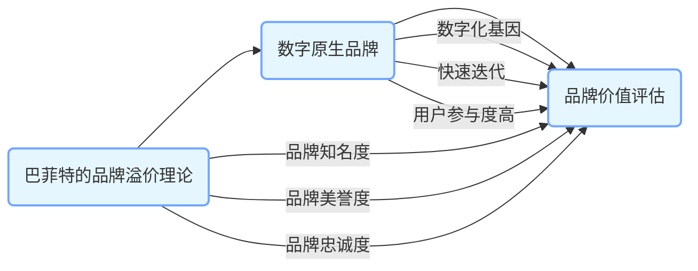

# 巴菲特的品牌溢价理论：数字原生品牌的价值评估

> 关键词：巴菲特品牌溢价理论、数字原生品牌、价值评估、品牌资产、品牌影响力

> 摘要：本文深入探讨了巴菲特的品牌溢价理论在数字原生品牌价值评估中的应用。首先介绍了研究的背景、目的、预期读者和文档结构，解释了相关术语。接着阐述了品牌溢价理论及数字原生品牌的核心概念和联系，给出了原理和架构的示意图与流程图。详细讲解了核心算法原理及操作步骤，并结合 Python 代码进行说明。同时，引入数学模型和公式对品牌价值评估进行详细讲解和举例。通过项目实战，展示了开发环境搭建、源代码实现与解读。分析了数字原生品牌的实际应用场景，推荐了学习资源、开发工具框架和相关论文著作。最后总结了未来发展趋势与挑战，提供了常见问题解答和扩展阅读参考资料，旨在为数字原生品牌的价值评估提供全面且深入的技术视角。

## 1. 背景介绍 
### 1.1 目的和范围
在当今数字化时代，数字原生品牌如雨后春笋般涌现。这些品牌从诞生之初就依托于数字技术和互联网平台，与传统品牌有着不同的发展模式和特点。巴菲特的品牌溢价理论在传统品牌价值评估中有着广泛的应用和认可，但对于数字原生品牌，如何将该理论进行有效应用以准确评估其价值，是一个亟待解决的问题。本文的目的就是深入研究巴菲特的品牌溢价理论在数字原生品牌价值评估中的应用，探讨适合数字原生品牌的价值评估方法和体系。研究范围涵盖了数字原生品牌的特点、品牌溢价理论的核心内容、数字原生品牌价值评估的算法和模型，以及实际应用案例等方面。

### 1.2 预期读者
本文预期读者主要包括从事品牌管理、市场营销、投资分析等领域的专业人士，他们希望深入了解数字原生品牌的价值评估方法，以便在品牌建设、投资决策等方面做出更科学的判断。同时，对于对数字经济和品牌理论感兴趣的学者和研究人员，本文也提供了有价值的参考资料。此外，有志于进入数字原生品牌创业领域的创业者，也可以从本文中获取关于品牌价值评估的相关知识，为创业项目的规划和发展提供指导。

### 1.3 文档结构概述
本文将按照以下结构进行阐述：首先介绍核心概念与联系，包括巴菲特的品牌溢价理论和数字原生品牌的定义、特点以及它们之间的关联；接着详细讲解核心算法原理和具体操作步骤，并给出 Python 代码实现；然后引入数学模型和公式对品牌价值评估进行深入分析和举例说明；通过项目实战展示如何在实际中应用这些理论和方法进行数字原生品牌的价值评估；分析数字原生品牌的实际应用场景；推荐相关的学习资源、开发工具框架和论文著作；最后总结未来发展趋势与挑战，提供常见问题解答和扩展阅读参考资料。

### 1.4 术语表
#### 1.4.1 核心术语定义
- **巴菲特的品牌溢价理论**：巴菲特认为，具有强大品牌的企业能够在市场上获得高于平均水平的利润，这种由于品牌优势而产生的额外利润就是品牌溢价。品牌溢价反映了品牌在消费者心目中的地位和价值，是品牌资产的重要体现。
- **数字原生品牌**：指那些从诞生之初就基于数字技术和互联网平台进行运营和发展的品牌。这些品牌依赖于数字营销、社交媒体、电子商务等渠道来建立品牌形象、推广产品和服务，并与消费者进行互动。
- **品牌价值评估**：是指通过一定的方法和模型，对品牌所具有的经济价值进行量化评估的过程。品牌价值评估可以帮助企业了解品牌的市场地位和竞争力，为品牌战略制定、投资决策等提供依据。

#### 1.4.2 相关概念解释
- **品牌资产**：是指品牌所拥有的一系列资产，包括品牌知名度、品牌美誉度、品牌忠诚度等。品牌资产是品牌价值的重要组成部分，它可以为企业带来长期的竞争优势和经济利益。
- **品牌影响力**：是指品牌在市场上对消费者的认知、态度和行为产生的影响程度。品牌影响力可以通过品牌知名度、美誉度、忠诚度等指标来衡量，它是品牌价值的重要体现。

#### 1.4.3 缩略词列表
- **ROI**：Return on Investment，投资回报率
- **CRM**：Customer Relationship Management，客户关系管理

## 2. 核心概念与联系 
### 2.1 巴菲特的品牌溢价理论原理
巴菲特的品牌溢价理论基于这样一个观点：消费者在购买产品或服务时，往往会对具有强大品牌的产品或服务支付更高的价格。这是因为品牌代表了产品或服务的质量、可靠性、信誉等方面的保证，消费者愿意为这种保证支付额外的费用。品牌溢价的产生主要源于以下几个方面：
- **品牌知名度**：消费者对品牌的熟悉程度越高，越容易选择该品牌的产品或服务。高知名度的品牌可以降低消费者的搜索成本和购买风险，从而使消费者愿意支付更高的价格。
- **品牌美誉度**：品牌在消费者心目中的良好形象和口碑可以增加消费者对品牌的信任和好感度。消费者更愿意购买具有良好美誉度的品牌产品，即使价格相对较高。
- **品牌忠诚度**：消费者对品牌的忠诚意味着他们会持续购买该品牌的产品或服务，并且对价格的敏感度相对较低。品牌忠诚度高的企业可以通过稳定的客户群体获得更高的利润。

### 2.2 数字原生品牌的特点
数字原生品牌与传统品牌相比，具有以下几个显著特点：
- **数字化基因**：数字原生品牌从诞生之初就依托于数字技术和互联网平台，其运营模式、营销方式、客户服务等都具有明显的数字化特征。例如，通过社交媒体进行品牌推广、利用大数据分析了解消费者需求等。
- **快速迭代**：数字原生品牌能够快速响应市场变化和消费者需求，不断推出新的产品或服务。这种快速迭代的能力使得数字原生品牌能够在激烈的市场竞争中保持领先地位。
- **用户参与度高**：数字原生品牌注重与用户的互动和参与，通过用户生成内容、社区建设等方式，增强用户对品牌的认同感和归属感。用户参与度高不仅可以提高品牌的知名度和美誉度，还可以为品牌的发展提供宝贵的建议和反馈。

### 2.3 品牌溢价理论与数字原生品牌的联系
虽然数字原生品牌具有与传统品牌不同的特点，但巴菲特的品牌溢价理论同样适用于数字原生品牌的价值评估。数字原生品牌通过数字化手段可以更有效地提高品牌知名度、美誉度和忠诚度，从而获得品牌溢价。例如，通过社交媒体的传播，可以迅速扩大品牌的影响力；通过个性化的营销和服务，可以提高用户的满意度和忠诚度。同时，数字原生品牌也面临着一些新的挑战，如品牌竞争激烈、用户忠诚度容易受到影响等。因此，在应用品牌溢价理论评估数字原生品牌价值时，需要充分考虑这些因素。

### 2.4 核心概念原理和架构的文本示意图
```plaintext
+----------------------+
| 巴菲特的品牌溢价理论 |
|                      |
| - 品牌知名度         |
| - 品牌美誉度         |
| - 品牌忠诚度         |
+----------------------+
           |
           v
+----------------------+
| 数字原生品牌         |
|                      |
| - 数字化基因         |
| - 快速迭代           |
| - 用户参与度高       |
+----------------------+
           |
           v
+----------------------+
| 品牌价值评估         |
|                      |
| - 考虑数字特点       |
| - 应用品牌溢价理论   |
+----------------------+
```

### 2.5 Mermaid 流程图


## 3. 核心算法原理 & 具体操作步骤 
### 3.1 核心算法原理
在应用巴菲特的品牌溢价理论评估数字原生品牌价值时，我们可以采用以下核心算法原理：
品牌价值 = 品牌溢价收益的现值 + 基础业务价值

品牌溢价收益是指由于品牌优势而获得的额外利润。计算品牌溢价收益的关键在于确定品牌溢价率，即品牌产品或服务的价格高于同类无品牌产品或服务价格的比例。品牌溢价率可以通过市场调研、数据分析等方法来确定。

基础业务价值是指在不考虑品牌因素的情况下，企业的业务所具有的价值。可以采用现金流折现法等方法来计算基础业务价值。

### 3.2 具体操作步骤
#### 步骤 1：确定品牌溢价率
- 进行市场调研，收集同类有品牌和无品牌产品或服务的价格数据。
- 计算品牌产品或服务价格与无品牌产品或服务价格的差值。
- 用差值除以无品牌产品或服务的价格，得到品牌溢价率。

#### 步骤 2：计算品牌溢价收益
- 确定品牌产品或服务的销售额。
- 用销售额乘以品牌溢价率，得到品牌溢价收益。

#### 步骤 3：计算品牌溢价收益的现值
- 预测品牌溢价收益的未来增长情况。
- 选择合适的折现率，将未来的品牌溢价收益折现到当前时刻。

#### 步骤 4：计算基础业务价值
- 预测企业未来的现金流。
- 用现金流折现法将未来现金流折现到当前时刻，得到基础业务价值。

#### 步骤 5：计算品牌价值
- 将品牌溢价收益的现值与基础业务价值相加，得到品牌价值。

### 3.3 Python 代码实现
```python
import numpy as np

# 步骤 1：确定品牌溢价率
def calculate_brand_premium_rate(branded_price, unbranded_price):
    """
    计算品牌溢价率
    :param branded_price: 品牌产品或服务的价格
    :param unbranded_price: 无品牌产品或服务的价格
    :return: 品牌溢价率
    """
    return (branded_price - unbranded_price) / unbranded_price

# 步骤 2：计算品牌溢价收益
def calculate_brand_premium_profit(sales_volume, brand_premium_rate):
    """
    计算品牌溢价收益
    :param sales_volume: 品牌产品或服务的销售额
    :param brand_premium_rate: 品牌溢价率
    :return: 品牌溢价收益
    """
    return sales_volume * brand_premium_rate

# 步骤 3：计算品牌溢价收益的现值
def calculate_present_value_of_brand_premium_profit(brand_premium_profits, discount_rate):
    """
    计算品牌溢价收益的现值
    :param brand_premium_profits: 未来各年的品牌溢价收益列表
    :param discount_rate: 折现率
    :return: 品牌溢价收益的现值
    """
    present_values = []
    for i, profit in enumerate(brand_premium_profits):
        present_value = profit / ((1 + discount_rate) ** (i + 1))
        present_values.append(present_value)
    return np.sum(present_values)

# 步骤 4：计算基础业务价值
def calculate_basic_business_value(cash_flows, discount_rate):
    """
    计算基础业务价值
    :param cash_flows: 未来各年的现金流列表
    :param discount_rate: 折现率
    :return: 基础业务价值
    """
    present_values = []
    for i, cash_flow in enumerate(cash_flows):
        present_value = cash_flow / ((1 + discount_rate) ** (i + 1))
        present_values.append(present_value)
    return np.sum(present_values)

# 步骤 5：计算品牌价值
def calculate_brand_value(brand_premium_profits, cash_flows, discount_rate):
    """
    计算品牌价值
    :param brand_premium_profits: 未来各年的品牌溢价收益列表
    :param cash_flows: 未来各年的现金流列表
    :param discount_rate: 折现率
    :return: 品牌价值
    """
    present_value_of_brand_premium = calculate_present_value_of_brand_premium_profit(brand_premium_profits, discount_rate)
    basic_business_value = calculate_basic_business_value(cash_flows, discount_rate)
    return present_value_of_brand_premium + basic_business_value

# 示例数据
branded_price = 120
unbranded_price = 100
sales_volume = 1000000
brand_premium_profits = [100000, 120000, 150000]  # 未来三年的品牌溢价收益
cash_flows = [500000, 600000, 700000]  # 未来三年的现金流
discount_rate = 0.1

# 计算品牌溢价率
brand_premium_rate = calculate_brand_premium_rate(branded_price, unbranded_price)
print(f"品牌溢价率: {brand_premium_rate * 100:.2f}%")

# 计算品牌溢价收益
brand_premium_profit = calculate_brand_premium_profit(sales_volume, brand_premium_rate)
print(f"品牌溢价收益: {brand_premium_profit}")

# 计算品牌价值
brand_value = calculate_brand_value(brand_premium_profits, cash_flows, discount_rate)
print(f"品牌价值: {brand_value}")
```

## 4. 数学模型和公式 & 详细讲解 & 举例说明 
### 4.1 品牌溢价率的数学模型和公式
品牌溢价率 $r$ 的计算公式为：
$$r = \frac{P_b - P_u}{P_u}$$
其中，$P_b$ 表示品牌产品或服务的价格，$P_u$ 表示无品牌产品或服务的价格。

例如，某品牌手机的价格为 $P_b = 5000$ 元，同类无品牌手机的价格为 $P_u = 4000$ 元，则该品牌手机的品牌溢价率为：
$$r = \frac{5000 - 4000}{4000} = 0.25 = 25\%$$

### 4.2 品牌溢价收益的数学模型和公式
品牌溢价收益 $R$ 的计算公式为：
$$R = S \times r$$
其中，$S$ 表示品牌产品或服务的销售额，$r$ 表示品牌溢价率。

假设该品牌手机的年销售额为 $S = 10000000$ 元，品牌溢价率为 $r = 25\%$，则该品牌手机的年品牌溢价收益为：
$$R = 10000000 \times 0.25 = 2500000$$ 元

### 4.3 品牌溢价收益现值的数学模型和公式
品牌溢价收益现值 $PV_{bp}$ 的计算公式为：
$$PV_{bp} = \sum_{i = 1}^{n} \frac{R_i}{(1 + d)^i}$$
其中，$R_i$ 表示第 $i$ 年的品牌溢价收益，$d$ 表示折现率，$n$ 表示预测的年数。

假设未来三年该品牌手机的品牌溢价收益分别为 $R_1 = 2500000$ 元，$R_2 = 3000000$ 元，$R_3 = 3500000$ 元，折现率为 $d = 10\%$，则品牌溢价收益的现值为：
$$PV_{bp} = \frac{2500000}{(1 + 0.1)^1} + \frac{3000000}{(1 + 0.1)^2} + \frac{3500000}{(1 + 0.1)^3}$$
$$PV_{bp} = \frac{2500000}{1.1} + \frac{3000000}{1.21} + \frac{3500000}{1.331}$$
$$PV_{bp} \approx 2272727.27 + 2479338.84 + 2629601.80$$
$$PV_{bp} \approx 7381667.91$$ 元

### 4.4 基础业务价值的数学模型和公式
基础业务价值 $V_{bb}$ 的计算公式为：
$$V_{bb} = \sum_{i = 1}^{n} \frac{CF_i}{(1 + d)^i}$$
其中，$CF_i$ 表示第 $i$ 年的现金流，$d$ 表示折现率，$n$ 表示预测的年数。

假设未来三年该品牌手机业务的现金流分别为 $CF_1 = 5000000$ 元，$CF_2 = 6000000$ 元，$CF_3 = 7000000$ 元，折现率为 $d = 10\%$，则基础业务价值为：
$$V_{bb} = \frac{5000000}{(1 + 0.1)^1} + \frac{6000000}{(1 + 0.1)^2} + \frac{7000000}{(1 + 0.1)^3}$$
$$V_{bb} = \frac{5000000}{1.1} + \frac{6000000}{1.21} + \frac{7000000}{1.331}$$
$$V_{bb} \approx 4545454.55 + 4958677.69 + 5259203.61$$
$$V_{bb} \approx 14763335.85$$ 元

### 4.5 品牌价值的数学模型和公式
品牌价值 $V_{b}$ 的计算公式为：
$$V_{b} = PV_{bp} + V_{bb}$$
将上面计算得到的品牌溢价收益现值 $PV_{bp} \approx 7381667.91$ 元和基础业务价值 $V_{bb} \approx 14763335.85$ 元代入公式，可得该品牌手机的品牌价值为：
$$V_{b} \approx 7381667.91 + 14763335.85 = 22145003.76$$ 元

## 5. 项目实战：代码实际案例和详细解释说明 
### 5.1  开发环境搭建
#### 安装 Python
首先，需要安装 Python 编程语言。可以从 Python 官方网站（https://www.python.org/downloads/）下载适合自己操作系统的 Python 安装包，并按照安装向导进行安装。

#### 安装必要的库
在本项目中，我们使用了 `numpy` 库来进行数值计算。可以使用以下命令来安装 `numpy` 库：
```sh
pip install numpy
```

### 5.2  源代码详细实现和代码解读
以下是完整的 Python 代码：
```python
import numpy as np

# 步骤 1：确定品牌溢价率
def calculate_brand_premium_rate(branded_price, unbranded_price):
    """
    计算品牌溢价率
    :param branded_price: 品牌产品或服务的价格
    :param unbranded_price: 无品牌产品或服务的价格
    :return: 品牌溢价率
    """
    return (branded_price - unbranded_price) / unbranded_price

# 步骤 2：计算品牌溢价收益
def calculate_brand_premium_profit(sales_volume, brand_premium_rate):
    """
    计算品牌溢价收益
    :param sales_volume: 品牌产品或服务的销售额
    :param brand_premium_rate: 品牌溢价率
    :return: 品牌溢价收益
    """
    return sales_volume * brand_premium_rate

# 步骤 3：计算品牌溢价收益的现值
def calculate_present_value_of_brand_premium_profit(brand_premium_profits, discount_rate):
    """
    计算品牌溢价收益的现值
    :param brand_premium_profits: 未来各年的品牌溢价收益列表
    :param discount_rate: 折现率
    :return: 品牌溢价收益的现值
    """
    present_values = []
    for i, profit in enumerate(brand_premium_profits):
        present_value = profit / ((1 + discount_rate) ** (i + 1))
        present_values.append(present_value)
    return np.sum(present_values)

# 步骤 4：计算基础业务价值
def calculate_basic_business_value(cash_flows, discount_rate):
    """
    计算基础业务价值
    :param cash_flows: 未来各年的现金流列表
    :param discount_rate: 折现率
    :return: 基础业务价值
    """
    present_values = []
    for i, cash_flow in enumerate(cash_flows):
        present_value = cash_flow / ((1 + discount_rate) ** (i + 1))
        present_values.append(present_value)
    return np.sum(present_values)

# 步骤 5：计算品牌价值
def calculate_brand_value(brand_premium_profits, cash_flows, discount_rate):
    """
    计算品牌价值
    :param brand_premium_profits: 未来各年的品牌溢价收益列表
    :param cash_flows: 未来各年的现金流列表
    :param discount_rate: 折现率
    :return: 品牌价值
    """
    present_value_of_brand_premium = calculate_present_value_of_brand_premium_profit(brand_premium_profits, discount_rate)
    basic_business_value = calculate_basic_business_value(cash_flows, discount_rate)
    return present_value_of_brand_premium + basic_business_value

# 示例数据
branded_price = 120
unbranded_price = 100
sales_volume = 1000000
brand_premium_profits = [100000, 120000, 150000]  # 未来三年的品牌溢价收益
cash_flows = [500000, 600000, 700000]  # 未来三年的现金流
discount_rate = 0.1

# 计算品牌溢价率
brand_premium_rate = calculate_brand_premium_rate(branded_price, unbranded_price)
print(f"品牌溢价率: {brand_premium_rate * 100:.2f}%")

# 计算品牌溢价收益
brand_premium_profit = calculate_brand_premium_profit(sales_volume, brand_premium_rate)
print(f"品牌溢价收益: {brand_premium_profit}")

# 计算品牌价值
brand_value = calculate_brand_value(brand_premium_profits, cash_flows, discount_rate)
print(f"品牌价值: {brand_value}")
```

### 5.3  代码解读与分析
#### 函数定义部分
- `calculate_brand_premium_rate` 函数：该函数接受品牌产品或服务的价格和无品牌产品或服务的价格作为参数，根据品牌溢价率的计算公式计算并返回品牌溢价率。
- `calculate_brand_premium_profit` 函数：该函数接受品牌产品或服务的销售额和品牌溢价率作为参数，根据品牌溢价收益的计算公式计算并返回品牌溢价收益。
- `calculate_present_value_of_brand_premium_profit` 函数：该函数接受未来各年的品牌溢价收益列表和折现率作为参数，使用循环遍历列表，根据品牌溢价收益现值的计算公式计算每年的现值，并将它们累加起来，最后返回品牌溢价收益的现值。
- `calculate_basic_business_value` 函数：该函数接受未来各年的现金流列表和折现率作为参数，使用循环遍历列表，根据基础业务价值的计算公式计算每年的现值，并将它们累加起来，最后返回基础业务价值。
- `calculate_brand_value` 函数：该函数接受未来各年的品牌溢价收益列表、未来各年的现金流列表和折现率作为参数，调用前面定义的函数分别计算品牌溢价收益的现值和基础业务价值，然后将它们相加，返回品牌价值。

#### 示例数据部分
定义了示例数据，包括品牌产品或服务的价格、无品牌产品或服务的价格、销售额、未来三年的品牌溢价收益、未来三年的现金流和折现率。

#### 计算和输出部分
调用前面定义的函数，依次计算品牌溢价率、品牌溢价收益和品牌价值，并将结果打印输出。

通过这个项目实战，我们可以看到如何使用 Python 代码实现基于巴菲特品牌溢价理论的数字原生品牌价值评估。

## 6. 实际应用场景 
### 6.1 品牌投资决策
在进行品牌投资时，准确评估品牌价值是非常重要的。通过应用巴菲特的品牌溢价理论对数字原生品牌进行价值评估，可以帮助投资者了解品牌的潜在价值和投资回报率。投资者可以根据品牌价值评估结果，决定是否投资该品牌，以及投资的金额和方式。例如，如果一个数字原生品牌的品牌价值较高，且具有良好的发展前景，投资者可能会选择加大对该品牌的投资；反之，如果品牌价值较低，且面临较大的市场风险，投资者可能会谨慎考虑投资决策。

### 6.2 品牌并购与重组
在品牌并购与重组过程中，需要对目标品牌的价值进行评估，以确定合理的并购价格和交易方案。数字原生品牌的价值评估可以为品牌并购与重组提供重要的参考依据。通过评估品牌价值，可以了解目标品牌的市场地位、竞争力和发展潜力，从而制定出更加科学合理的并购与重组策略。例如，在并购一个数字原生品牌时，如果评估结果显示该品牌具有较高的品牌价值和增长潜力，并购方可能会愿意支付较高的价格；反之，如果品牌价值较低，并购方可能会要求降低价格或调整交易方案。

### 6.3 品牌战略规划
品牌战略规划是企业发展的重要组成部分。通过对数字原生品牌进行价值评估，可以帮助企业了解品牌的优势和劣势，明确品牌的市场定位和发展方向。企业可以根据品牌价值评估结果，制定出更加符合品牌实际情况的品牌战略规划。例如，如果品牌价值评估结果显示品牌的知名度较低，但具有较高的品牌忠诚度，企业可以制定提高品牌知名度的战略规划，如加大品牌推广力度、开展营销活动等；如果品牌价值评估结果显示品牌的溢价率较低，企业可以考虑提升品牌的品质和形象，以提高品牌溢价率。

### 6.4 品牌营销效果评估
品牌营销活动的目的是提高品牌知名度、美誉度和忠诚度，从而提升品牌价值。通过对数字原生品牌进行价值评估，可以评估品牌营销活动的效果。在开展品牌营销活动前后，分别对品牌价值进行评估，比较评估结果的变化，可以了解品牌营销活动对品牌价值的影响程度。例如，如果品牌营销活动后品牌价值有所提升，说明营销活动取得了较好的效果；反之，如果品牌价值没有明显变化或下降，说明营销活动可能存在问题，需要进行调整和改进。

## 7. 工具和资源推荐
### 7.1 学习资源推荐
#### 7.1.1 书籍推荐
- 《巴菲特致股东的信：投资者和公司高管教程》：这本书收录了巴菲特历年致股东的信，其中包含了他对品牌价值、投资理念等方面的深刻见解，是学习巴菲特品牌溢价理论的经典读物。
- 《品牌洗脑：世界著名品牌只做不说的营销秘密》：该书揭示了品牌营销的各种策略和方法，对于理解品牌如何塑造和提升价值具有重要的参考价值。
- 《数字营销：从策略到执行》：介绍了数字营销的基本原理、方法和技巧，对于了解数字原生品牌的运营和发展具有很大的帮助。

#### 7.1.2 在线课程
- Coursera 平台上的“品牌管理”课程：该课程由知名高校的教授授课，系统地介绍了品牌管理的理论和实践，包括品牌价值评估等方面的内容。
- edX 平台上的“数字营销基础”课程：课程涵盖了数字营销的各个方面，如社交媒体营销、搜索引擎优化等，对于了解数字原生品牌的营销方式非常有帮助。

#### 7.1.3 技术博客和网站
- 哈佛商业评论（https://hbr.org/）：该网站提供了大量关于品牌管理、市场营销等方面的高质量文章和研究报告，是获取最新行业动态和理论知识的重要来源。
- 品牌星球（https://www.brandstar.com.cn/）：专注于品牌领域的资讯和研究，提供了丰富的品牌案例和分析文章，对于了解数字原生品牌的发展趋势和实践经验具有重要的参考价值。

### 7.2 开发工具框架推荐
#### 7.2.1 IDE和编辑器
- PyCharm：一款专业的 Python 集成开发环境，具有代码编辑、调试、自动补全等强大功能，非常适合开发基于 Python 的品牌价值评估程序。
- Jupyter Notebook：一种交互式的开发环境，可以方便地进行代码编写、数据可视化和文档编写，对于数据分析和模型验证非常有用。

#### 7.2.2 调试和性能分析工具
- pdb：Python 自带的调试工具，可以帮助开发者在代码执行过程中进行调试，查找和解决问题。
- cProfile：Python 标准库中的性能分析工具，可以帮助开发者分析代码的性能瓶颈，优化代码性能。

#### 7.2.3 相关框架和库
- pandas：一个强大的数据处理和分析库，提供了丰富的数据结构和数据操作方法，对于处理和分析品牌价值评估所需的数据非常有用。
- scikit-learn：一个机器学习库，提供了各种机器学习算法和工具，可用于构建更复杂的品牌价值评估模型。

### 7.3 相关论文著作推荐
#### 7.3.1 经典论文
- “The Economic Value of Brands” by David Aaker：该论文深入探讨了品牌的经济价值，提出了品牌资产的概念和评估方法，对品牌价值评估领域产生了深远的影响。
- “Building Strong Brands” by Kevin Lane Keller：论文阐述了品牌建设的理论和方法，强调了品牌形象、品牌联想等因素对品牌价值的重要性。

#### 7.3.2 最新研究成果
- 关注顶级学术期刊如《Journal of Marketing》《Journal of Consumer Research》等，这些期刊经常发表关于品牌管理、市场营销等领域的最新研究成果，包括数字原生品牌价值评估方面的研究。

#### 7.3.3 应用案例分析
- 一些商业咨询公司和研究机构会发布关于品牌价值评估的应用案例分析报告，如 Interbrand 的《全球最佳品牌报告》，这些报告提供了实际案例和数据分析，对于理解品牌价值评估的实践应用具有重要的参考价值。

## 8. 总结：未来发展趋势与挑战
### 8.1 未来发展趋势
#### 数字化程度不断加深
随着数字技术的不断发展，数字原生品牌的数字化程度将不断加深。未来，数字原生品牌将更加依赖大数据、人工智能等技术来进行品牌建设、营销和价值评估。例如，通过大数据分析可以更精准地了解消费者需求和行为，从而制定更加个性化的品牌营销策略；利用人工智能技术可以实现品牌价值评估的自动化和智能化。

#### 跨平台融合发展
数字原生品牌将不再局限于单一的数字平台，而是会实现跨平台融合发展。品牌将在多个数字平台上进行布局，通过整合不同平台的资源和优势，扩大品牌影响力和市场份额。例如，一个数字原生品牌可能会同时在社交媒体平台、电商平台、短视频平台等开展营销活动，实现多渠道的品牌传播和销售。

#### 品牌价值评估方法不断创新
随着数字原生品牌的不断发展和变化，传统的品牌价值评估方法可能无法满足实际需求。未来，品牌价值评估方法将不断创新，更加注重数字因素的影响。例如，可能会引入新的指标和模型来评估数字原生品牌的用户参与度、数据资产价值等，以更准确地反映品牌的真实价值。

### 8.2 挑战
#### 数据质量和安全问题
数字原生品牌的价值评估依赖于大量的数据，数据的质量和安全直接影响评估结果的准确性和可靠性。然而，在实际应用中，数据质量可能存在问题，如数据缺失、数据错误等；同时，数据安全也面临着严峻的挑战，如数据泄露、数据被篡改等。因此，如何保证数据质量和安全是数字原生品牌价值评估面临的重要挑战之一。

#### 品牌竞争加剧
数字原生品牌市场竞争激烈，新的品牌不断涌现，品牌之间的竞争日益加剧。在这种情况下，品牌的市场地位和价值可能会随时发生变化，给品牌价值评估带来了很大的困难。如何准确评估品牌在激烈竞争环境中的价值，以及如何帮助品牌提升竞争力，是需要解决的重要问题。

#### 消费者行为变化快速
数字时代消费者的行为变化快速，消费者的需求和偏好不断变化。数字原生品牌需要及时响应消费者行为的变化，调整品牌策略和营销方式。然而，消费者行为的快速变化也给品牌价值评估带来了挑战，因为评估模型需要不断更新和调整，以适应消费者行为的变化。

## 9. 附录：常见问题与解答
### 9.1 如何确定合适的折现率？
折现率的确定需要考虑多个因素，包括市场利率、投资风险、行业平均回报率等。一般来说，可以参考同行业类似投资的回报率来确定折现率。同时，也可以根据投资的风险程度进行适当调整，如果投资风险较高，折现率可以适当提高；如果投资风险较低，折现率可以适当降低。

### 9.2 数字原生品牌的品牌溢价率是否稳定？
数字原生品牌的品牌溢价率并不一定稳定。它受到多种因素的影响，如市场竞争、消费者需求变化、品牌营销策略等。在市场竞争激烈的情况下，品牌溢价率可能会下降；而通过有效的品牌建设和营销活动，品牌溢价率可能会提高。因此，需要定期对品牌溢价率进行评估和监测，以便及时调整品牌策略。

### 9.3 如何处理未来数据的不确定性？
未来数据的不确定性是品牌价值评估中面临的一个重要问题。可以采用以下方法来处理：一是进行敏感性分析，通过改变不同的参数值，分析对品牌价值评估结果的影响，了解评估结果的稳定性；二是采用情景分析，设定不同的情景，如乐观情景、悲观情景和中性情景，分别计算不同情景下的品牌价值，以评估不确定性对品牌价值的影响。

## 10. 扩展阅读 & 参考资料
- Aaker, D. A. (1991). Managing brand equity: Capitalizing on the value of a brand name. Free Press.
- Keller, K. L. (1993). Conceptualizing, measuring, and managing customer-based brand equity. Journal of Marketing, 57(1), 1-22.
- Interbrand. (Annual). Best Global Brands Report.
- 菲利普·科特勒. (2016). 营销管理（第15版）. 格致出版社.

作者：AI天才研究院/AI Genius Institute & 禅与计算机程序设计艺术 /Zen And The Art of Computer Programming