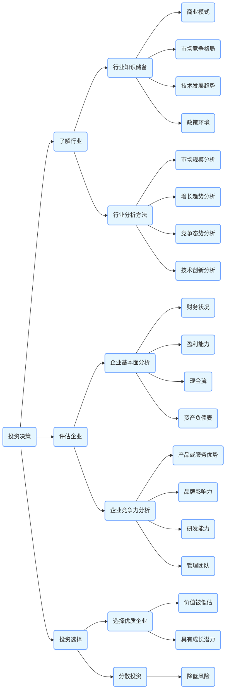

# 巴菲特的圈子理论：投资你懂的行业

> 关键词：巴菲特圈子理论、投资、懂的行业、核心概念、算法原理、实战案例、应用场景

> 摘要：本文围绕巴菲特的圈子理论——投资你懂的行业展开深入探讨。首先介绍了该理论提出的背景，包括目的、预期读者、文档结构和相关术语。接着阐述了核心概念与联系，以清晰的示意图和流程图展示其原理架构。详细讲解了核心算法原理和具体操作步骤，并结合Python代码进行说明。运用数学模型和公式对理论进行剖析，并举例加深理解。通过项目实战案例，从开发环境搭建到代码实现与解读，全面展示理论在实际中的应用。分析了该理论的实际应用场景，推荐了相关的学习资源、开发工具框架和论文著作。最后总结了未来发展趋势与挑战，解答常见问题并提供扩展阅读和参考资料，旨在帮助投资者更好地理解和运用巴菲特的圈子理论进行投资决策。

## 1. 背景介绍 
### 1.1 目的和范围
巴菲特的圈子理论“投资你懂的行业”在投资界具有深远的影响力。本文的目的在于深入剖析这一理论，详细阐述其核心概念、算法原理、数学模型，并通过实际案例展示如何在投资实践中运用该理论。范围涵盖了从理论基础到实际应用的各个方面，包括对相关概念的解释、算法的实现、实际项目的操作以及未来发展趋势的探讨等。

### 1.2 预期读者
本文预期读者主要包括对投资领域感兴趣的个人投资者、金融行业从业者、投资研究人员以及相关专业的学生等。无论你是投资新手，希望了解如何选择投资方向，还是有一定经验的投资者，想要进一步优化投资策略，都能从本文中获得有价值的信息。

### 1.3 文档结构概述
本文共分为十个部分。第一部分为背景介绍，包括目的、预期读者、文档结构概述和术语表；第二部分阐述核心概念与联系，通过文本示意图和Mermaid流程图展示理论架构；第三部分讲解核心算法原理和具体操作步骤，并给出Python代码示例；第四部分运用数学模型和公式对理论进行详细讲解和举例说明；第五部分是项目实战，包括开发环境搭建、源代码实现与解读；第六部分分析实际应用场景；第七部分推荐相关的学习资源、开发工具框架和论文著作；第八部分总结未来发展趋势与挑战；第九部分是附录，解答常见问题；第十部分提供扩展阅读和参考资料。

### 1.4 术语表
#### 1.4.1 核心术语定义
- **巴菲特的圈子理论**：指投资者应将投资范围限定在自己熟悉和理解的行业内，避免投资于不了解的领域，以降低投资风险，提高投资成功的概率。
- **懂的行业**：投资者对该行业的商业模式、市场竞争格局、技术发展趋势、政策环境等方面有较为深入的了解和认识，能够准确评估行业内企业的价值和发展前景。
- **投资**：指投资者为了获取未来收益而将资金投入到特定的资产或项目中的行为。

#### 1.4.2 相关概念解释
- **行业分析**：对特定行业的市场规模、增长趋势、竞争态势、技术创新等方面进行研究和评估的过程，旨在了解行业的现状和未来发展前景。
- **企业价值评估**：对企业的资产、负债、盈利能力、现金流等方面进行综合分析和评估，以确定企业的内在价值。
- **风险评估**：对投资过程中可能面临的各种风险进行识别、分析和评估的过程，包括市场风险、行业风险、企业风险等。

#### 1.4.3 缩略词列表
本文无缩略词。

## 2. 核心概念与联系 

### 核心概念原理
巴菲特的圈子理论基于一个简单而深刻的逻辑：投资者只有对某个行业有足够的了解，才能准确判断该行业内企业的价值和发展前景，从而做出明智的投资决策。当投资者投资于自己懂的行业时，他们能够更好地理解企业的商业模式、竞争优势、面临的挑战等，更容易发现被市场低估的优质企业，同时也能更及时地识别和应对潜在的风险。

例如，一位长期从事医疗行业工作的投资者，对医疗行业的技术发展、市场需求、政策法规等方面有深入的了解。当他投资医疗行业的企业时，他能够根据自己的专业知识判断企业的研发实力、产品竞争力、市场份额等，从而更准确地评估企业的价值。相反，如果他投资于一个完全陌生的行业，如人工智能或新能源汽车，由于缺乏相关的知识和经验，他很难对企业的情况做出准确的判断，投资风险也会相应增加。

### 架构的文本示意图
```plaintext
投资决策
|
|-- 了解行业
|   |-- 行业知识储备
|   |   |-- 商业模式
|   |   |-- 市场竞争格局
|   |   |-- 技术发展趋势
|   |   |-- 政策环境
|   |
|   |-- 行业分析方法
|       |-- 市场规模分析
|       |-- 增长趋势分析
|       |-- 竞争态势分析
|       |-- 技术创新分析
|
|-- 评估企业
|   |-- 企业基本面分析
|   |   |-- 财务状况
|   |   |-- 盈利能力
|   |   |-- 现金流
|   |   |-- 资产负债表
|   |
|   |-- 企业竞争力分析
|       |-- 产品或服务优势
|       |-- 品牌影响力
|       |-- 研发能力
|       |-- 管理团队
|
|-- 投资选择
|   |-- 选择优质企业
|   |   |-- 价值被低估
|   |   |-- 具有成长潜力
|   |
|   |-- 分散投资
|       |-- 降低风险
```

### Mermaid 流程图


## 3. 核心算法原理 & 具体操作步骤 

### 核心算法原理
虽然巴菲特的圈子理论本身并没有严格意义上的算法，但可以将其核心思想转化为一种决策算法。该算法的核心在于通过对行业和企业的评估，筛选出符合投资标准的优质企业。具体来说，可以分为以下几个步骤：

1. **行业评估**：对各个行业进行评估，确定投资者熟悉和了解的行业范围。评估指标可以包括行业的市场规模、增长趋势、竞争态势、技术创新等。
2. **企业筛选**：在熟悉的行业范围内，筛选出具有投资潜力的企业。筛选指标可以包括企业的财务状况、盈利能力、现金流、产品或服务优势、品牌影响力、研发能力、管理团队等。
3. **价值评估**：对筛选出的企业进行价值评估，确定其内在价值。价值评估方法可以包括市盈率法、市净率法、现金流折现法等。
4. **投资决策**：根据企业的内在价值和市场价格，做出投资决策。如果企业的内在价值高于市场价格，则可以考虑买入；如果内在价值低于市场价格，则可以考虑卖出或不投资。

### 具体操作步骤
以下是基于上述算法原理的具体操作步骤：

1. **确定熟悉的行业**：投资者根据自己的专业知识、工作经验、兴趣爱好等，确定自己熟悉和了解的行业范围。例如，投资者是一名医生，可以选择医疗行业；如果投资者是一名程序员，可以选择科技行业。
2. **收集行业信息**：收集熟悉行业的相关信息，包括行业报告、市场数据、企业财报等。可以通过专业的金融网站、行业协会、证券公司等渠道获取信息。
3. **进行行业分析**：运用行业分析方法，对收集到的信息进行分析，评估行业的市场规模、增长趋势、竞争态势、技术创新等。例如，可以通过分析行业的市场份额、增长率、利润率等指标，判断行业的竞争程度和发展前景。
4. **筛选企业**：在熟悉的行业范围内，根据企业的财务状况、盈利能力、现金流、产品或服务优势、品牌影响力、研发能力、管理团队等指标，筛选出具有投资潜力的企业。可以通过财务报表分析、实地调研、与企业管理层交流等方式获取企业信息。
5. **进行企业价值评估**：运用价值评估方法，对筛选出的企业进行价值评估，确定其内在价值。例如，可以通过计算企业的市盈率、市净率、现金流折现等指标，评估企业的价值。
6. **做出投资决策**：根据企业的内在价值和市场价格，做出投资决策。如果企业的内在价值高于市场价格，则可以考虑买入；如果内在价值低于市场价格，则可以考虑卖出或不投资。同时，为了降低风险，可以采取分散投资的策略，将资金投资于多个不同的企业。

### Python 代码示例
```python
import pandas as pd
import numpy as np

# 假设我们有一个包含行业和企业信息的数据集
data = {
    '行业': ['医疗', '科技', '金融', '医疗', '科技'],
    '企业名称': ['企业A', '企业B', '企业C', '企业D', '企业E'],
    '市盈率': [20, 30, 15, 25, 35],
    '市净率': [2, 3, 1.5, 2.5, 3.5],
    '净利润增长率': [0.1, 0.2, 0.05, 0.15, 0.25]
}

df = pd.DataFrame(data)

# 步骤1：确定熟悉的行业
familiar_industries = ['医疗', '科技']

# 步骤2：筛选出熟悉行业的企业
familiar_df = df[df['行业'].isin(familiar_industries)]

# 步骤3：设定筛选条件
# 假设我们要求市盈率小于30，市净率小于3，净利润增长率大于0.1
condition = (familiar_df['市盈率'] < 30) & (familiar_df['市净率'] < 3) & (familiar_df['净利润增长率'] > 0.1)

# 步骤4：筛选出符合条件的企业
selected_df = familiar_df[condition]

print(selected_df)
```
在上述代码中，我们首先创建了一个包含行业和企业信息的数据集。然后，我们确定了熟悉的行业范围，并筛选出这些行业的企业。接着，我们设定了筛选条件，包括市盈率小于30，市净率小于3，净利润增长率大于0.1。最后，我们筛选出符合条件的企业并打印输出。

## 4. 数学模型和公式 & 详细讲解 & 举例说明 

### 数学模型和公式
在投资领域，常用的价值评估方法包括市盈率法、市净率法和现金流折现法等。以下是这些方法的数学模型和公式：

#### 市盈率法
市盈率（PE）是指股票价格与每股收益的比率，计算公式为：
$$PE = \frac{P}{EPS}$$
其中，$P$ 表示股票价格，$EPS$ 表示每股收益。

通过市盈率法评估企业价值的公式为：
$$V = EPS \times PE_{avg}$$
其中，$V$ 表示企业的内在价值，$PE_{avg}$ 表示行业平均市盈率。

#### 市净率法
市净率（PB）是指股票价格与每股净资产的比率，计算公式为：
$$PB = \frac{P}{BVPS}$$
其中，$P$ 表示股票价格，$BVPS$ 表示每股净资产。

通过市净率法评估企业价值的公式为：
$$V = BVPS \times PB_{avg}$$
其中，$V$ 表示企业的内在价值，$PB_{avg}$ 表示行业平均市净率。

#### 现金流折现法
现金流折现法是通过预测企业未来的现金流，并将其折现到当前时刻来评估企业价值的方法。其基本公式为：
$$V = \sum_{t=1}^{n} \frac{FCF_t}{(1 + r)^t} + \frac{TV}{(1 + r)^n}$$
其中，$V$ 表示企业的内在价值，$FCF_t$ 表示第 $t$ 年的自由现金流，$r$ 表示折现率，$n$ 表示预测期数，$TV$ 表示终值。

### 详细讲解
#### 市盈率法
市盈率法是一种简单易懂的价值评估方法，它通过比较企业的市盈率与行业平均市盈率来判断企业的价值是否被低估或高估。如果企业的市盈率低于行业平均市盈率，则说明企业的价值可能被低估，具有投资价值；反之，如果企业的市盈率高于行业平均市盈率，则说明企业的价值可能被高估，投资风险较大。

#### 市净率法
市净率法主要用于评估企业的净资产价值。市净率反映了市场对企业净资产的估值水平。如果企业的市净率低于行业平均市净率，则说明企业的净资产价值可能被低估，具有投资价值；反之，如果企业的市净率高于行业平均市净率，则说明企业的净资产价值可能被高估，投资风险较大。

#### 现金流折现法
现金流折现法是一种较为复杂但更为准确的价值评估方法。它考虑了企业未来的现金流和时间价值，能够更全面地反映企业的内在价值。在使用现金流折现法时，需要对企业未来的现金流进行预测，并选择合适的折现率。折现率的选择通常考虑了市场利率、企业风险等因素。

### 举例说明
假设我们要评估一家医疗企业的价值，该企业的每股收益为 2 元，行业平均市盈率为 25。根据市盈率法，该企业的内在价值为：
$$V = EPS \times PE_{avg} = 2 \times 25 = 50$$（元）
即该企业的内在价值为每股 50 元。如果该企业的当前股价为 40 元，则说明企业的价值被低估，具有投资价值。

再假设该企业的每股净资产为 10 元，行业平均市净率为 3。根据市净率法，该企业的内在价值为：
$$V = BVPS \times PB_{avg} = 10 \times 3 = 30$$（元）
即该企业的内在价值为每股 30 元。如果该企业的当前股价为 25 元，则说明企业的价值被低估，具有投资价值。

最后，假设我们使用现金流折现法评估该企业的价值。预测该企业未来 5 年的自由现金流分别为 100 万元、120 万元、140 万元、160 万元、180 万元，第 5 年后的终值为 1000 万元，折现率为 10%。则该企业的内在价值为：
$$V = \frac{100}{(1 + 0.1)^1} + \frac{120}{(1 + 0.1)^2} + \frac{140}{(1 + 0.1)^3} + \frac{160}{(1 + 0.1)^4} + \frac{180}{(1 + 0.1)^5} + \frac{1000}{(1 + 0.1)^5}$$
```python
import numpy as np

cash_flows = [100, 120, 140, 160, 180]
terminal_value = 1000
discount_rate = 0.1

present_values = []
for i, cf in enumerate(cash_flows):
    pv = cf / (1 + discount_rate) ** (i + 1)
    present_values.append(pv)

pv_terminal_value = terminal_value / (1 + discount_rate) ** 5
present_values.append(pv_terminal_value)

intrinsic_value = np.sum(present_values)
print("企业的内在价值为:", intrinsic_value, "万元")
```
通过计算，我们可以得到该企业的内在价值。如果该企业的市场价值低于内在价值，则说明企业具有投资价值。

## 5. 项目实战：代码实际案例和详细解释说明 

### 5.1  开发环境搭建
为了实现基于巴菲特圈子理论的投资决策系统，我们可以使用Python作为开发语言，并使用以下库：
- **pandas**：用于数据处理和分析。
- **numpy**：用于数值计算。
- **matplotlib**：用于数据可视化。

可以使用以下命令安装这些库：
```sh
pip install pandas numpy matplotlib
```

### 5.2  源代码详细实现和代码解读
以下是一个基于Python的简单投资决策系统的代码示例：
```python
import pandas as pd
import numpy as np
import matplotlib.pyplot as plt

# 步骤1：读取数据
data = {
    '行业': ['医疗', '科技', '金融', '医疗', '科技'],
    '企业名称': ['企业A', '企业B', '企业C', '企业D', '企业E'],
    '市盈率': [20, 30, 15, 25, 35],
    '市净率': [2, 3, 1.5, 2.5, 3.5],
    '净利润增长率': [0.1, 0.2, 0.05, 0.15, 0.25]
}

df = pd.DataFrame(data)

# 步骤2：确定熟悉的行业
familiar_industries = ['医疗', '科技']

# 步骤3：筛选出熟悉行业的企业
familiar_df = df[df['行业'].isin(familiar_industries)]

# 步骤4：设定筛选条件
# 假设我们要求市盈率小于30，市净率小于3，净利润增长率大于0.1
condition = (familiar_df['市盈率'] < 30) & (familiar_df['市净率'] < 3) & (familiar_df['净利润增长率'] > 0.1)

# 步骤5：筛选出符合条件的企业
selected_df = familiar_df[condition]

# 步骤6：可视化结果
plt.bar(selected_df['企业名称'], selected_df['净利润增长率'])
plt.xlabel('企业名称')
plt.ylabel('净利润增长率')
plt.title('符合条件的企业净利润增长率')
plt.show()

print(selected_df)
```

### 代码解读与分析
1. **读取数据**：使用`pandas`库创建一个包含行业和企业信息的数据集。
2. **确定熟悉的行业**：通过定义一个列表`familiar_industries`来确定投资者熟悉的行业范围。
3. **筛选出熟悉行业的企业**：使用`isin()`方法筛选出数据集中属于熟悉行业的企业。
4. **设定筛选条件**：根据市盈率、市净率和净利润增长率等指标设定筛选条件。
5. **筛选出符合条件的企业**：使用筛选条件对熟悉行业的企业进行筛选，得到符合条件的企业数据集。
6. **可视化结果**：使用`matplotlib`库绘制符合条件的企业的净利润增长率柱状图，直观展示筛选结果。
7. **打印结果**：打印出符合条件的企业数据集。

通过这个简单的代码示例，我们可以看到如何运用巴菲特的圈子理论进行投资决策。首先，我们确定了熟悉的行业范围，然后在这些行业中筛选出符合一定条件的企业，最后通过可视化和打印结果来展示筛选结果。

## 6. 实际应用场景 
### 个人投资者
对于个人投资者来说，巴菲特的圈子理论具有重要的指导意义。个人投资者通常没有专业的投资知识和丰富的投资经验，投资于自己懂的行业可以降低投资风险，提高投资成功的概率。例如，一位从事教育行业的个人投资者，可以利用自己对教育行业的了解，投资教育行业的优质企业，如在线教育平台、教育培训机构等。通过对行业的深入了解，他可以更好地判断企业的发展前景和价值，做出更明智的投资决策。

### 机构投资者
机构投资者如基金公司、证券公司等，也可以运用巴菲特的圈子理论进行投资组合管理。机构投资者通常拥有专业的研究团队和丰富的资源，可以对多个行业进行深入研究。他们可以根据研究团队的专业领域和投资策略，确定熟悉的行业范围，并在这些行业中选择优质企业进行投资。例如，一家专注于科技行业的基金公司，可以利用其对科技行业的专业研究，投资于人工智能、云计算、半导体等领域的优质企业，构建具有竞争力的投资组合。

### 企业战略投资
企业在进行战略投资时，也可以借鉴巴菲特的圈子理论。企业可以根据自身的核心业务和发展战略，投资于与自身业务相关或具有协同效应的行业和企业。例如，一家汽车制造企业可以投资于新能源汽车技术研发企业、汽车零部件供应商等，以提升自身的技术实力和市场竞争力。通过投资于自己熟悉的行业和企业，企业可以更好地整合资源，实现战略目标。

## 7. 工具和资源推荐
### 7.1 学习资源推荐
#### 7.1.1 书籍推荐
- 《聪明的投资者》（The Intelligent Investor）：本杰明·格雷厄姆（Benjamin Graham）著，这本书是价值投资的经典之作，介绍了价值投资的基本原理和方法，对巴菲特的投资理念产生了深远的影响。
- 《巴菲特致股东的信：股份公司教程》（Letters to Shareholders of Berkshire Hathaway）：沃伦·巴菲特（Warren Buffett）著，这本书收录了巴菲特历年致股东的信，通过这些信件可以深入了解巴菲特的投资思想和决策过程。
- 《穷查理宝典：查理·芒格的智慧箴言录》（Poor Charlie's Almanack: The Wit and Wisdom of Charles T. Munger）：彼得·考夫曼（Peter D. Kaufman）编著，这本书介绍了查理·芒格的投资理念和思维方式，芒格是巴菲特的长期合作伙伴，他的思想对巴菲特的投资决策产生了重要影响。

#### 7.1.2 在线课程
- Coursera上的“投资学原理”（Principles of Investing）：该课程由宾夕法尼亚大学的教授授课，介绍了投资学的基本原理和方法，包括资产定价、投资组合理论、风险管理等内容。
- edX上的“金融市场”（Financial Markets）：该课程由耶鲁大学的教授授课，探讨了金融市场的运作机制和投资策略，对理解投资领域的基本概念和方法有很大帮助。

#### 7.1.3 技术博客和网站
- 雪球网（xueqiu.com）：国内知名的投资社区，提供股票、基金、债券等投资品种的信息和分析，用户可以在上面交流投资经验和观点。
- 价值投资者网（valueinvestorsclub.com）：一个专注于价值投资的网站，提供价值投资的理论、案例和分析，适合对价值投资感兴趣的投资者学习和交流。

### 7.2 开发工具框架推荐
#### 7.2.1 IDE和编辑器
- PyCharm：一款专业的Python集成开发环境，提供代码编辑、调试、版本控制等功能，适合Python开发者使用。
- Jupyter Notebook：一个交互式的编程环境，支持Python、R等多种编程语言，适合进行数据处理、分析和可视化。

#### 7.2.2 调试和性能分析工具
- pdb：Python自带的调试工具，可以帮助开发者定位和解决代码中的问题。
- cProfile：Python的性能分析工具，可以分析代码的运行时间和函数调用情况，帮助开发者优化代码性能。

#### 7.2.3 相关框架和库
- pandas：用于数据处理和分析的Python库，提供了丰富的数据结构和函数，方便进行数据清洗、转换和分析。
- numpy：用于数值计算的Python库，提供了高效的数组和矩阵运算功能，是许多科学计算和数据分析库的基础。
- matplotlib：用于数据可视化的Python库，提供了丰富的绘图函数和工具，能够绘制各种类型的图表。

### 7.3 相关论文著作推荐
#### 7.3.1 经典论文
- “The Security Market Line: Some Empirical Tests”（《证券市场线：一些实证检验》）：由威廉·夏普（William Sharpe）发表，该论文提出了资本资产定价模型（CAPM），对投资领域的理论和实践产生了深远的影响。
- “Efficient Capital Markets: A Review of Theory and Empirical Work”（《有效资本市场：理论与实证研究综述》）：由尤金·法玛（Eugene F. Fama）发表，该论文阐述了有效市场假说，对理解金融市场的效率和投资策略有重要意义。

#### 7.3.2 最新研究成果
- 可以关注《Journal of Finance》《Review of Financial Studies》等顶级金融学术期刊，了解投资领域的最新研究成果和前沿动态。

#### 7.3.3 应用案例分析
- 可以阅读一些关于巴菲特投资案例的分析文章和书籍，如《巴菲特投资案例集》等，通过实际案例深入理解巴菲特的投资理念和方法。

## 8. 总结：未来发展趋势与挑战
### 未来发展趋势
- **行业融合加速**：随着科技的不断发展，各个行业之间的融合趋势越来越明显。例如，医疗行业与科技行业的融合催生了医疗科技领域，金融行业与科技行业的融合产生了金融科技领域。投资者需要不断学习和了解新兴行业的知识，扩大自己的“能力圈”，以适应行业融合的发展趋势。
- **数据驱动的投资决策**：大数据、人工智能等技术的发展为投资决策提供了更多的数据和工具。投资者可以利用数据分析和机器学习算法，对行业和企业进行更精准的评估和预测。例如，通过分析社交媒体数据、企业财务数据等，挖掘潜在的投资机会。
- **可持续投资兴起**：随着社会对环境保护、社会责任和公司治理（ESG）的关注度不断提高，可持续投资逐渐成为一种趋势。投资者在选择投资标的时，不仅会考虑企业的财务表现，还会关注企业的ESG表现。未来，投资于具有良好ESG表现的企业可能会获得更好的长期回报。

### 挑战
- **知识更新速度快**：科技的快速发展使得各个行业的知识和技术不断更新换代。投资者需要不断学习和跟进行业动态，保持对行业的深入了解。否则，他们的“能力圈”可能会逐渐缩小，无法适应市场的变化。
- **市场不确定性增加**：全球经济、政治环境的不确定性增加，如贸易摩擦、疫情等因素，给投资市场带来了更大的波动和风险。投资者需要具备更强的风险管理能力，灵活调整投资策略，以应对市场的不确定性。
- **信息过载**：在信息爆炸的时代，投资者面临着大量的信息和数据。如何从海量的信息中筛选出有价值的信息，做出准确的投资决策，是投资者面临的一个挑战。投资者需要提高信息分析和处理能力，学会运用科学的方法和工具进行信息筛选和分析。

## 9. 附录：常见问题与解答
### 问题1：如何确定自己懂的行业？
解答：可以从自己的专业知识、工作经验、兴趣爱好等方面入手。如果你在某个行业有多年的工作经验，对该行业的商业模式、市场竞争格局、技术发展趋势等有深入的了解，那么这个行业很可能就是你懂的行业。此外，如果你对某个行业有浓厚的兴趣，并且通过学习和研究积累了一定的知识，也可以将其纳入自己懂的行业范围。

### 问题2：如果我对多个行业都有一定的了解，应该如何选择投资行业？
解答：可以从以下几个方面进行考虑：
- **行业发展前景**：选择具有良好发展前景的行业，如新兴科技行业、医疗健康行业等。
- **行业竞争格局**：选择竞争格局相对稳定、龙头企业具有较强竞争力的行业。
- **个人投资目标和风险承受能力**：根据自己的投资目标和风险承受能力，选择适合自己的行业。例如，如果你追求稳健的投资回报，可以选择传统行业；如果你愿意承担较高的风险以获取更高的收益，可以选择新兴行业。

### 问题3：投资自己懂的行业是否意味着不能投资其他行业？
解答：并不是。投资自己懂的行业是一种降低风险的投资策略，但并不意味着完全排除投资其他行业。如果你对某个新兴行业有强烈的兴趣，并且愿意投入时间和精力去学习和了解该行业，也可以适当进行投资。不过，在投资其他行业时，需要更加谨慎，充分评估投资风险。

### 问题4：如何评估企业的价值？
解答：可以使用多种方法评估企业的价值，如市盈率法、市净率法、现金流折现法等。不同的方法适用于不同类型的企业和行业。在评估企业价值时，需要综合考虑企业的财务状况、盈利能力、现金流、市场竞争力等因素，并结合行业平均水平进行比较。

## 10. 扩展阅读 & 参考资料
### 扩展阅读
- 《金融炼金术》（The Alchemy of Finance）：乔治·索罗斯（George Soros）著，这本书介绍了索罗斯的投资哲学和金融市场理论，对投资者的思维方式有很大的启发。
- 《投资最重要的事》（The Most Important Thing Illuminated: Uncommon Sense for the Thoughtful Investor）：霍华德·马克斯（Howard Marks）著，书中分享了马克斯的投资经验和智慧，强调了投资中的风险控制和逆向思维。

### 参考资料
- 沃伦·巴菲特历年致股东的信，可在伯克希尔·哈撒韦公司（Berkshire Hathaway）官方网站上查阅。
- 相关金融学术期刊，如《Journal of Finance》《Review of Financial Studies》等。
- 专业的金融数据提供商，如彭博（Bloomberg）、万得（Wind）等提供的行业报告和企业数据。

作者：AI天才研究院/AI Genius Institute & 禅与计算机程序设计艺术 /Zen And The Art of Computer Programming