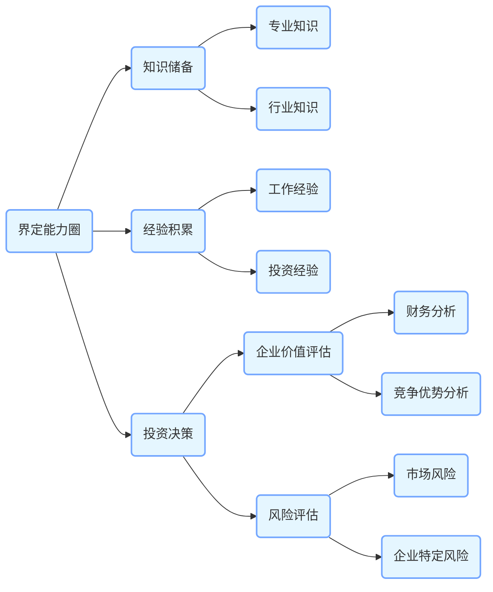

# 巴菲特的圈子理论：投资你懂的领域

> 关键词：巴菲特圈子理论、投资领域、核心概念、算法原理、实战案例、应用场景、未来趋势

> 摘要：本文深入探讨了巴菲特的圈子理论，即投资你懂的领域。首先介绍了该理论的背景，包括目的、预期读者、文档结构和相关术语。接着阐述了核心概念与联系，通过文本示意图和 Mermaid 流程图展示其原理和架构。详细讲解了核心算法原理及具体操作步骤，并用 Python 代码进行了阐述。还给出了数学模型和公式，并举例说明。通过项目实战案例，展示了如何在实际中应用该理论。分析了该理论的实际应用场景，推荐了相关的学习资源、开发工具框架和论文著作。最后总结了未来发展趋势与挑战，提供了常见问题解答和扩展阅读参考资料，旨在帮助投资者更好地理解和运用巴菲特的圈子理论进行投资决策。

## 1. 背景介绍 
### 1.1 目的和范围
巴菲特的圈子理论作为投资领域的经典理念，对投资者有着深远的指导意义。本文的目的在于全面、深入地剖析这一理论，让投资者清晰地理解其内涵、原理和应用方法。范围涵盖从理论的核心概念、算法原理到实际的项目实战案例，以及该理论在不同场景下的应用，同时还会提供相关的学习资源和对未来发展的展望。

### 1.2 预期读者
本文预期读者主要包括各类投资者，无论是初涉投资领域的新手，还是有一定投资经验的专业人士，都能从本文中获取有价值的信息。对于想要学习投资理念和方法的金融从业者、经济专业学生等也具有重要的参考价值。

### 1.3 文档结构概述
本文将按照以下结构进行阐述：首先介绍理论的背景信息，让读者对文章有一个整体的了解；接着讲解核心概念与联系，通过示意图和流程图直观呈现理论架构；然后详细说明核心算法原理和具体操作步骤，并辅以 Python 代码；随后给出数学模型和公式并举例；再通过项目实战案例进行实际应用的展示和分析；接着探讨实际应用场景；之后推荐相关的工具和资源；最后总结未来发展趋势与挑战，提供常见问题解答和扩展阅读参考资料。

### 1.4 术语表
#### 1.4.1 核心术语定义
- **巴菲特的圈子理论**：指投资者应专注于自己熟悉、理解的领域进行投资，避免涉足不了解的领域，以降低投资风险，提高投资成功的概率。
- **投资领域**：是指投资者进行资金投入的行业或业务范围，如金融、科技、医疗等。
- **能力圈**：即投资者所具备的知识、经验和技能能够覆盖和理解的投资范围。

#### 1.4.2 相关概念解释
- **信息不对称**：在投资中，不同投资者对同一投资领域的信息掌握程度不同。在自己熟悉的领域，投资者更容易获取准确、全面的信息，而在不熟悉的领域则可能面临信息不足的问题。
- **风险与回报**：投资必然伴随着风险，而在自己懂的领域投资，由于对行业的了解更深入，能够更好地评估风险，从而有可能获得更合理的回报。

#### 1.4.3 缩略词列表
本文暂未涉及缩略词。

## 2. 核心概念与联系 

### 核心概念原理
巴菲特的圈子理论核心在于强调投资者要明确自己的能力圈，并将投资集中在这个范围内。能力圈是投资者基于自身的教育背景、工作经验、兴趣爱好等因素所形成的对特定投资领域的理解和认知范围。在这个范围内，投资者能够更好地评估企业的价值、竞争优势和发展前景，从而做出更明智的投资决策。

例如，一个具有计算机专业背景且从事软件开发工作的投资者，他对科技行业的技术发展趋势、企业的研发能力和市场竞争力有更深入的了解，那么科技行业就可能是他的能力圈范围。在这个范围内进行投资，他能够更准确地判断一家科技企业的股票是否具有投资价值。

### 架构的文本示意图
```plaintext
巴菲特的圈子理论
|
|-- 能力圈界定
|   |-- 知识储备
|   |   |-- 专业知识
|   |   |-- 行业知识
|   |-- 经验积累
|   |   |-- 工作经验
|   |   |-- 投资经验
|
|-- 投资决策
|   |-- 企业价值评估
|   |   |-- 财务分析
|   |   |-- 竞争优势分析
|   |-- 风险评估
|   |   |-- 市场风险
|   |   |-- 企业特定风险
```

### Mermaid 流程图


这个流程图展示了巴菲特圈子理论的核心流程。首先要界定自己的能力圈，这需要通过知识储备和经验积累来实现。在明确能力圈后，进行投资决策，包括对企业价值的评估和风险的评估。企业价值评估又包括财务分析和竞争优势分析，风险评估包括市场风险和企业特定风险。

## 3. 核心算法原理 & 具体操作步骤 

### 核心算法原理
从数学角度来看，巴菲特的圈子理论可以类比为一个优化问题。投资者的目标是在投资过程中实现收益最大化和风险最小化。假设投资者有 $n$ 个可投资的领域，每个领域的预期收益率为 $r_i$，风险为 $\sigma_i$，投资者在每个领域的投资比例为 $x_i$，且 $\sum_{i=1}^{n}x_i = 1$。

投资者的目标函数可以表示为：

$$\max_{x_1,x_2,\cdots,x_n} \sum_{i=1}^{n}x_ir_i - \lambda\sum_{i=1}^{n}x_i\sigma_i$$

其中，$\lambda$ 是一个风险厌恶系数，反映了投资者对风险的偏好程度。

在能力圈的约束下，对于不在能力圈内的领域，$x_i = 0$。

### 具体操作步骤

#### 步骤 1：界定能力圈
- 评估自己的知识储备，包括专业知识和行业知识。例如，如果你是一名医生，那么医疗行业可能是你的能力圈范围。
- 回顾自己的工作经验和投资经验，确定自己熟悉的领域。如果你曾经在金融行业工作多年，那么金融投资领域可能更适合你。

#### 步骤 2：筛选投资目标
在能力圈内筛选出具有投资潜力的企业。可以通过以下方式进行：
- 财务分析：查看企业的财务报表，包括利润表、资产负债表和现金流量表，评估企业的盈利能力、偿债能力和现金流状况。
- 竞争优势分析：分析企业在行业中的竞争地位，如是否具有独特的技术、品牌优势或成本优势。

#### 步骤 3：风险评估
对筛选出的投资目标进行风险评估，包括市场风险和企业特定风险。可以使用历史数据和行业分析来估计风险。

#### 步骤 4：确定投资比例
根据目标函数和风险评估结果，确定在每个投资目标上的投资比例。

### Python 代码实现
```python
import numpy as np

# 假设有 3 个投资领域，其中领域 1 和 2 在能力圈内，领域 3 不在能力圈内
# 预期收益率
r = np.array([0.1, 0.15, 0.2])
# 风险
sigma = np.array([0.05, 0.08, 0.1])
# 风险厌恶系数
lambda_ = 0.5

# 能力圈约束，领域 3 不在能力圈内，投资比例为 0
ability_circle = np.array([1, 1, 0])

# 定义目标函数
def objective_function(x):
    return np.sum(x * r) - lambda_ * np.sum(x * sigma)

# 约束条件：投资比例之和为 1
constraint = ({'type': 'eq', 'fun': lambda x: np.sum(x) - 1})
# 能力圈约束
bounds = [(0, 1) if ability_circle[i] == 1 else (0, 0) for i in range(len(r))]

from scipy.optimize import minimize

# 初始猜测值
x0 = np.array([0.5, 0.5, 0])

# 优化求解
result = minimize(lambda x: -objective_function(x), x0, method='SLSQP', bounds=bounds, constraints=constraint)

# 最优投资比例
optimal_x = result.x

print("最优投资比例:", optimal_x)
```

这段代码实现了在能力圈约束下的投资比例优化问题。首先定义了预期收益率、风险和风险厌恶系数，然后根据能力圈约束设置了投资比例的边界。使用 `scipy.optimize.minimize` 函数求解目标函数的最大值，得到最优投资比例。

## 4. 数学模型和公式 & 详细讲解 & 举例说明 

### 数学模型和公式
在前面的核心算法原理中，我们已经给出了目标函数：

$$\max_{x_1,x_2,\cdots,x_n} \sum_{i=1}^{n}x_ir_i - \lambda\sum_{i=1}^{n}x_i\sigma_i$$

其中，$x_i$ 是在第 $i$ 个投资领域的投资比例，$r_i$ 是第 $i$ 个投资领域的预期收益率，$\sigma_i$ 是第 $i$ 个投资领域的风险，$\lambda$ 是风险厌恶系数。

约束条件为：

$$\sum_{i=1}^{n}x_i = 1$$

以及能力圈约束：对于不在能力圈内的领域 $j$，$x_j = 0$。

### 详细讲解
目标函数的第一项 $\sum_{i=1}^{n}x_ir_i$ 表示投资组合的预期收益率，投资者希望最大化这个值。第二项 $\lambda\sum_{i=1}^{n}x_i\sigma_i$ 表示投资组合的风险，乘以风险厌恶系数 $\lambda$ 后，反映了投资者对风险的厌恶程度。投资者希望在追求高收益的同时，尽量降低风险。

约束条件 $\sum_{i=1}^{n}x_i = 1$ 确保投资者将所有资金都进行了投资。能力圈约束则限制了投资者只能在自己熟悉的领域进行投资。

### 举例说明
假设投资者有三个投资领域：科技、金融和房地产。预期收益率分别为 $r_1 = 0.15$，$r_2 = 0.1$，$r_3 = 0.08$，风险分别为 $\sigma_1 = 0.1$，$\sigma_2 = 0.05$，$\sigma_3 = 0.03$。投资者的风险厌恶系数 $\lambda = 0.3$。

投资者的能力圈只包括科技和金融领域，即 $x_3 = 0$。

根据目标函数和约束条件，我们可以列出以下方程组：

目标函数：

$$\max_{x_1,x_2} x_1\times0.15 + x_2\times0.1 - 0.3\times(x_1\times0.1 + x_2\times0.05)$$

约束条件：

$$x_1 + x_2 = 1$$

$$x_1 \geq 0, x_2 \geq 0$$

将目标函数化简为：

$$\max_{x_1,x_2} 0.12x_1 + 0.085x_2$$

结合约束条件 $x_2 = 1 - x_1$，代入目标函数得到：

$$\max_{x_1} 0.12x_1 + 0.085(1 - x_1) = 0.035x_1 + 0.085$$

因为 $x_1 \geq 0$，要使目标函数最大，$x_1$ 应取最大值 1，此时 $x_2 = 0$。

这意味着在这种情况下，投资者应将所有资金投入到科技领域。

## 5. 项目实战：代码实际案例和详细解释说明 

### 5.1  开发环境搭建
为了运行前面的 Python 代码，需要搭建以下开发环境：

- **Python 安装**：建议安装 Python 3.7 及以上版本。可以从 Python 官方网站（https://www.python.org/downloads/）下载并安装。
- **依赖库安装**：使用 `pip` 安装所需的依赖库，包括 `numpy` 和 `scipy`。可以在命令行中运行以下命令：

```sh
pip install numpy scipy
```

### 5.2  源代码详细实现和代码解读
以下是完整的源代码：

```python
import numpy as np

# 假设有 3 个投资领域，其中领域 1 和 2 在能力圈内，领域 3 不在能力圈内
# 预期收益率
r = np.array([0.1, 0.15, 0.2])
# 风险
sigma = np.array([0.05, 0.08, 0.1])
# 风险厌恶系数
lambda_ = 0.5

# 能力圈约束，领域 3 不在能力圈内，投资比例为 0
ability_circle = np.array([1, 1, 0])

# 定义目标函数
def objective_function(x):
    return np.sum(x * r) - lambda_ * np.sum(x * sigma)

# 约束条件：投资比例之和为 1
constraint = ({'type': 'eq', 'fun': lambda x: np.sum(x) - 1})
# 能力圈约束
bounds = [(0, 1) if ability_circle[i] == 1 else (0, 0) for i in range(len(r))]

from scipy.optimize import minimize

# 初始猜测值
x0 = np.array([0.5, 0.5, 0])

# 优化求解
result = minimize(lambda x: -objective_function(x), x0, method='SLSQP', bounds=bounds, constraints=constraint)

# 最优投资比例
optimal_x = result.x

print("最优投资比例:", optimal_x)
```

### 代码解读与分析
- **导入必要的库**：`import numpy as np` 导入 `numpy` 库，用于处理数组和矩阵运算。
- **定义投资领域的预期收益率和风险**：`r` 和 `sigma` 分别表示预期收益率和风险，这里假设有 3 个投资领域。
- **定义风险厌恶系数**：`lambda_` 表示投资者对风险的厌恶程度。
- **定义能力圈约束**：`ability_circle` 数组用于标记哪些领域在能力圈内，不在能力圈内的领域投资比例为 0。
- **定义目标函数**：`objective_function` 函数计算投资组合的预期收益率减去风险调整后的收益。
- **定义约束条件**：`constraint` 确保投资比例之和为 1，`bounds` 根据能力圈约束设置投资比例的边界。
- **使用 `scipy.optimize.minimize` 进行优化求解**：`minimize` 函数用于求解目标函数的最大值，由于 `minimize` 函数是求最小值，所以需要对目标函数取负。
- **输出最优投资比例**：最后打印出最优投资比例。

## 6. 实际应用场景 
### 个人投资者
对于个人投资者来说，巴菲特的圈子理论具有重要的指导意义。个人投资者通常没有专业的投资团队和大量的时间进行研究，因此专注于自己熟悉的领域可以降低投资风险。例如，一个从事教育行业的个人投资者，可以利用自己对教育行业的了解，投资教育相关的企业股票或基金。通过对教育行业的政策、市场需求和竞争格局的熟悉，能够更准确地评估企业的价值和发展前景。

### 机构投资者
机构投资者虽然拥有更丰富的资源和专业的团队，但在投资决策中也可以借鉴巴菲特的圈子理论。机构投资者可以根据自身的研究优势和投资策略，确定自己的核心能力圈。例如，一家专注于科技投资的机构，可以将主要精力放在科技行业的投资上，深入研究科技企业的技术创新、市场竞争力和行业趋势，从而做出更明智的投资决策。

### 企业战略投资
企业在进行战略投资时，也可以遵循巴菲特的圈子理论。企业可以利用自身的核心业务优势和行业经验，选择与自身业务相关或互补的领域进行投资。例如，一家汽车制造企业可以投资新能源汽车技术研发企业，利用自己在汽车制造领域的技术和市场资源，推动新能源汽车技术的发展，同时也为自身的业务转型和升级提供支持。

## 7. 工具和资源推荐
### 7.1 学习资源推荐
#### 7.1.1 书籍推荐
- 《巴菲特致股东的信：投资者和公司高管教程》：这本书收录了巴菲特多年来致股东的信，通过这些信件可以深入了解巴菲特的投资理念和方法。
- 《聪明的投资者》：作者是本杰明·格雷厄姆，他是巴菲特的导师，这本书被誉为投资领域的圣经，介绍了价值投资的基本原理和方法。
- 《穷查理宝典：查理·芒格的智慧箴言录》：查理·芒格是巴菲特的长期合作伙伴，这本书收录了芒格的演讲和文章，包含了许多关于投资、人生和思维方式的智慧。

#### 7.1.2 在线课程
- Coursera 上的《投资学原理》：这门课程由知名大学的教授授课，介绍了投资学的基本原理和方法，包括资产定价、投资组合理论等。
- edX 上的《价值投资基础》：课程详细讲解了价值投资的理念和方法，适合想要学习巴菲特投资理念的初学者。

#### 7.1.3 技术博客和网站
- 雪球网：是一个投资者社区，上面有很多投资者分享自己的投资经验和研究成果，可以从中获取关于不同行业和企业的信息。
- 东方财富网：提供丰富的金融资讯和数据，包括股票行情、财务报表、行业分析等，是投资者进行研究和分析的重要工具。

### 7.2 开发工具框架推荐
#### 7.2.1 IDE和编辑器
- PyCharm：是一款专业的 Python 集成开发环境，具有代码编辑、调试、版本控制等功能，适合开发 Python 投资分析程序。
- Jupyter Notebook：是一个交互式的开发环境，支持 Python 代码的编写和运行，同时可以添加文本说明和可视化图表，方便进行数据分析和展示。

#### 7.2.2 调试和性能分析工具
- pdb：是 Python 自带的调试工具，可以帮助开发者在代码运行过程中进行调试，查看变量的值和程序的执行流程。
- cProfile：是 Python 的性能分析工具，可以分析代码的运行时间和函数调用次数，帮助开发者找出代码中的性能瓶颈。

#### 7.2.3 相关框架和库
- Pandas：是一个用于数据处理和分析的 Python 库，提供了丰富的数据结构和函数，方便进行财务数据的处理和分析。
- Matplotlib：是一个用于数据可视化的 Python 库，可以绘制各种类型的图表，如折线图、柱状图、散点图等，帮助投资者直观地展示数据和分析结果。

### 7.3 相关论文著作推荐
#### 7.3.1 经典论文
- 《证券分析》（Security Analysis）：本杰明·格雷厄姆和大卫·多德所著，奠定了价值投资的理论基础，对巴菲特的投资理念产生了深远影响。
- 《有效市场假说》（Efficient Market Hypothesis）：由尤金·法玛提出，探讨了市场效率和股票价格的关系，虽然与巴菲特的价值投资理念有所不同，但对于理解市场有重要意义。

#### 7.3.2 最新研究成果
- 近年来，有许多关于行为金融学的研究成果，探讨了投资者的心理和行为对投资决策的影响。这些研究可以帮助投资者更好地理解市场的非理性因素，从而做出更明智的投资决策。
- 关于人工智能在投资领域的应用研究也越来越多，如利用机器学习算法进行股票价格预测和投资组合优化。

#### 7.3.3 应用案例分析
- 可以关注一些知名投资机构和投资者的实际投资案例分析，了解他们如何运用巴菲特的圈子理论进行投资决策，以及在不同市场环境下的投资策略调整。

## 8. 总结：未来发展趋势与挑战
### 未来发展趋势
- **科技融合**：随着科技的不断发展，人工智能、大数据等技术将与巴菲特的圈子理论进一步融合。投资者可以利用这些技术更深入地了解自己的能力圈，更准确地评估投资目标的价值和风险。例如，通过大数据分析可以获取更多的行业信息和企业数据，利用人工智能算法进行投资组合优化。
- **跨领域投资**：虽然巴菲特强调投资自己懂的领域，但未来投资者可能会在能力圈的基础上进行适度的跨领域投资。随着全球化和产业融合的发展，不同领域之间的联系越来越紧密，投资者需要不断拓展自己的知识和视野，以适应市场的变化。
- **社会责任投资**：未来投资者将更加注重企业的社会责任和可持续发展。在选择投资领域和企业时，除了考虑财务指标外，还会关注企业的环境、社会和治理（ESG）表现。这将对投资者的能力圈提出新的要求，需要投资者了解相关的政策和标准。

### 挑战
- **信息过载**：在信息爆炸的时代，投资者面临着大量的信息，如何从海量信息中筛选出有价值的信息，准确界定自己的能力圈，是一个挑战。
- **市场变化快速**：市场环境变化迅速，行业和企业的发展也充满不确定性。投资者需要不断学习和更新自己的知识，以适应市场的变化，确保自己的能力圈始终有效。
- **心理因素影响**：投资者的心理因素，如贪婪、恐惧等，会影响投资决策。即使在自己的能力圈内，也可能因为心理因素而做出错误的决策。

## 9. 附录：常见问题与解答
### 问题 1：如何准确界定自己的能力圈？
解答：界定自己的能力圈需要综合考虑自己的知识储备、工作经验和兴趣爱好。可以回顾自己的学习和工作经历，确定自己熟悉的行业和领域。同时，也可以通过不断学习和实践，逐步拓展自己的能力圈。

### 问题 2：如果我对多个领域都有一定的了解，应该如何选择投资领域？
解答：可以对这些领域进行深入分析，比较它们的发展前景、竞争格局和投资风险。优先选择自己最熟悉、最有信心的领域进行投资。也可以根据市场情况和自身的投资目标，在多个领域进行适度的分散投资。

### 问题 3：巴菲特的圈子理论是否适用于所有投资者？
解答：巴菲特的圈子理论具有普遍的指导意义，但并不是适用于所有投资者。对于一些专业的投资机构和有丰富投资经验的投资者，可以在遵循该理论的基础上进行适度的创新和拓展。对于初学者来说，遵循该理论可以降低投资风险，逐步积累投资经验。

### 问题 4：如何处理能力圈外出现的投资机会？
解答：对于能力圈外的投资机会，建议谨慎对待。可以先学习相关的知识，了解该领域的基本情况，评估自己是否有能力进入这个领域。如果没有足够的能力和信心，最好不要轻易涉足。

## 10. 扩展阅读 & 参考资料
### 扩展阅读
- 《投资最重要的事》：作者霍华德·马克斯，介绍了投资中的一些重要原则和思维方式。
- 《金融炼金术》：乔治·索罗斯所著，探讨了金融市场的运行规律和投资者的行为。

### 参考资料
- Buffett, Warren E. "The Essays of Warren Buffett: Lessons for Corporate America." Lawrence A. Cunningham, ed.
- Graham, Benjamin, and David Dodd. "Security Analysis." McGraw-Hill, 1934.
- Fama, Eugene F. "Efficient Capital Markets: A Review of Theory and Empirical Work." The Journal of Finance, Vol. 25, No. 2, 1970.

作者：AI天才研究院/AI Genius Institute & 禅与计算机程序设计艺术 /Zen And The Art of Computer Programming