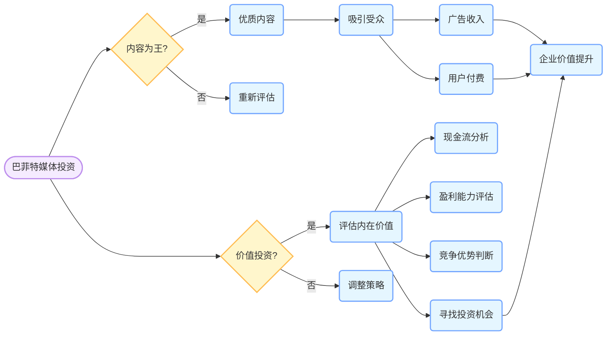

# 巴菲特的媒体行业投资：内容为王的时代

> 关键词：巴菲特、媒体行业投资、内容为王、投资策略、媒体发展趋势

> 摘要：本文深入探讨了巴菲特在媒体行业的投资理念与实践，剖析了在内容为王时代媒体行业的特点和发展趋势。通过对巴菲特投资案例的分析，阐述了核心概念、算法原理（类比商业决策逻辑）、数学模型等内容。同时给出项目实战案例，介绍了媒体行业实际应用场景，推荐了相关学习资源、开发工具和论文著作。最后总结了媒体行业未来发展趋势与挑战，并解答常见问题，提供扩展阅读和参考资料，旨在为投资者和媒体从业者提供全面而深入的见解。

## 1. 背景介绍 
### 1.1 目的和范围
本文章旨在全面分析巴菲特在媒体行业的投资策略，揭示在当前内容为王的时代背景下，媒体行业投资的核心要点和发展规律。范围涵盖巴菲特投资媒体企业的历史案例、媒体行业的发展现状与趋势、投资决策背后的逻辑以及对未来的展望等方面。通过对这些内容的研究，帮助投资者更好地理解媒体行业投资的本质，为媒体从业者提供借鉴，促进媒体行业的健康发展。

### 1.2 预期读者
本文预期读者包括对投资领域尤其是媒体行业投资感兴趣的投资者，无论是个人投资者还是机构投资者，都能从本文中获取有价值的投资思路和决策参考。同时，媒体行业的从业者，如媒体企业的管理者、内容创作者、市场营销人员等，也可以通过了解巴菲特的投资视角，更好地把握行业发展方向，提升自身的业务能力。此外，对商业和经济领域有研究需求的学者和学生，也能从本文中获取丰富的案例和理论分析，为学术研究提供素材。

### 1.3 文档结构概述
本文将按照以下结构展开：首先介绍相关背景知识，包括目的、预期读者和文档结构概述，并给出术语表。接着阐述核心概念与联系，通过文本示意图和 Mermaid 流程图展示媒体行业投资的关键要素和相互关系。然后讲解核心算法原理和具体操作步骤，以 Python 代码类比投资决策过程。再介绍数学模型和公式，结合实际案例进行详细讲解。之后通过项目实战，展示代码实现和解读。随后分析媒体行业的实际应用场景。接着推荐相关的学习资源、开发工具和论文著作。最后总结未来发展趋势与挑战，解答常见问题，并提供扩展阅读和参考资料。

### 1.4 术语表
#### 1.4.1 核心术语定义
- **巴菲特投资理念**：以价值投资为核心，强调寻找具有长期竞争优势和稳定现金流的企业，在价格低于内在价值时进行投资，并长期持有。
- **媒体行业**：指从事信息传播和内容创作、生产、分发的行业，包括传统媒体（如报纸、杂志、广播、电视）和新媒体（如互联网媒体、社交媒体等）。
- **内容为王**：强调在媒体行业中，优质的内容是吸引受众、创造价值的关键因素，具有核心竞争力。
- **内在价值**：企业在其存续期间所产生的现金流量的折现值，是价值投资中评估企业投资价值的重要指标。

#### 1.4.2 相关概念解释
- **护城河理论**：巴菲特提出的概念，指企业具有的一种可持续的竞争优势，如同城堡周围的护城河，能够保护企业抵御竞争对手的攻击，保持长期的盈利能力。在媒体行业中，品牌影响力、内容独家性、用户粘性等都可以构成企业的护城河。
- **现金流折现模型**：一种估值方法，通过预测企业未来的现金流量，并将其按照一定的折现率折现到当前，来计算企业的内在价值。在媒体行业投资中，该模型可以帮助投资者评估媒体企业的投资价值。

#### 1.4.3 缩略词列表
- **DCF**：Discounted Cash Flow，现金流折现模型
- **ROE**：Return on Equity，净资产收益率，衡量企业盈利能力的指标

## 2. 核心概念与联系 

### 核心概念原理
在巴菲特的媒体行业投资中，核心概念围绕着“内容为王”和价值投资展开。“内容为王”强调优质内容是媒体企业吸引受众、获取广告收入和用户付费的基础。优质内容具有独特性、深度和吸引力，能够满足受众的需求和兴趣，从而建立起强大的品牌影响力和用户粘性。

价值投资则是巴菲特投资的核心策略，他通过分析媒体企业的内在价值，寻找那些价格低于内在价值的投资机会。内在价值的评估主要基于企业的现金流、盈利能力、竞争优势等因素。在媒体行业中，具有优质内容的企业往往能够产生稳定的现金流和较高的盈利能力，因为它们能够吸引大量的受众和广告商。

### 架构的文本示意图
```plaintext
巴菲特媒体投资理念
|
|-- 内容为王
|   |-- 优质内容吸引受众
|   |   |-- 独特性
|   |   |-- 深度
|   |   |-- 吸引力
|   |-- 受众带来价值
|       |-- 广告收入
|       |-- 用户付费
|
|-- 价值投资
|   |-- 评估内在价值
|       |-- 现金流分析
|       |-- 盈利能力评估
|       |-- 竞争优势判断
|   |-- 寻找投资机会
|       |-- 价格低于内在价值
```

### Mermaid 流程图


## 3. 核心算法原理 & 具体操作步骤 

### 核心算法原理
在巴菲特的媒体行业投资决策中，虽然没有严格意义上的数学算法，但可以类比为一个基于多因素评估的决策过程。可以将投资决策看作是一个对媒体企业的多个指标进行综合评估的过程，类似于机器学习中的多特征分类问题。

假设我们有一组特征向量 $X = [x_1, x_2,..., x_n]$ ，其中 $x_i$ 代表不同的评估指标，如现金流、盈利能力、内容质量等。我们的目标是通过对这些特征的评估，判断该媒体企业是否具有投资价值。

可以使用一个简单的加权求和模型来进行评估：

$$Score = \sum_{i=1}^{n} w_i x_i$$

其中 $w_i$ 是每个特征的权重，代表该特征在投资决策中的重要性。如果 $Score$ 超过某个阈值 $T$ ，则认为该媒体企业具有投资价值。

### 具体操作步骤

#### 步骤 1：数据收集
收集媒体企业的相关数据，包括财务报表、市场份额、内容质量评估等。以下是一个简单的 Python 代码示例，用于模拟数据收集：

```python
# 模拟数据收集
def collect_data():
    cash_flow = 1000000  # 现金流
    roe = 0.2  # 净资产收益率
    content_quality = 8  # 内容质量评分（1-10分）
    market_share = 0.1  # 市场份额
    return [cash_flow, roe, content_quality, market_share]

data = collect_data()
print("收集到的数据：", data)
```

#### 步骤 2：特征权重设置
根据投资经验和对各指标重要性的判断，设置每个特征的权重。

```python
# 特征权重设置
weights = [0.3, 0.2, 0.4, 0.1]

```

#### 步骤 3：计算得分
根据加权求和模型计算媒体企业的得分。

```python
# 计算得分
def calculate_score(data, weights):
    score = 0
    for i in range(len(data)):
        score += weights[i] * data[i]
    return score

score = calculate_score(data, weights)
print("计算得到的得分：", score)

```

#### 步骤 4：决策判断
根据得分和阈值进行决策判断。

```python
# 决策判断
threshold = 500000
if score > threshold:
    print("该媒体企业具有投资价值")
else:
    print("该媒体企业不具有投资价值")

```

## 4. 数学模型和公式 & 详细讲解 & 举例说明 

### 现金流折现模型（DCF）
现金流折现模型是巴菲特评估企业内在价值的重要工具之一。该模型的基本原理是将企业未来的现金流量按照一定的折现率折现到当前，从而计算出企业的内在价值。

#### 公式
$$V = \sum_{t=1}^{n} \frac{CF_t}{(1 + r)^t} + \frac{TV}{(1 + r)^n}$$

其中：
- $V$ 是企业的内在价值
- $CF_t$ 是第 $t$ 期的现金流量
- $r$ 是折现率
- $n$ 是预测期数
- $TV$ 是终值，通常采用永续增长模型计算：$TV = \frac{CF_{n+1}}{r - g}$ ，其中 $CF_{n+1}$ 是预测期结束后下一期的现金流量，$g$ 是永续增长率

#### 详细讲解
现金流折现模型的核心思想是考虑货币的时间价值，即未来的现金流量在当前的价值是不同的。折现率 $r$ 反映了投资者对资金的时间价值和风险的要求，通常可以使用资本资产定价模型（CAPM）来确定。预测期数 $n$ 一般根据企业的发展阶段和行业特点来确定。终值 $TV$ 是为了考虑企业在预测期结束后的持续经营价值。

#### 举例说明
假设一家媒体企业未来 5 年的现金流量分别为 100 万元、120 万元、140 万元、160 万元和 180 万元，折现率为 10%，预测期结束后现金流量的永续增长率为 3%。

首先计算终值：
$CF_{6} = 180 \times (1 + 0.03) = 185.4$（万元）
$TV = \frac{185.4}{0.1 - 0.03} = 2648.57$（万元）

然后计算内在价值：
$$V = \frac{100}{(1 + 0.1)^1} + \frac{120}{(1 + 0.1)^2} + \frac{140}{(1 + 0.1)^3} + \frac{160}{(1 + 0.1)^4} + \frac{180}{(1 + 0.1)^5} + \frac{2648.57}{(1 + 0.1)^5}$$
$$V \approx 90.91 + 99.17 + 105.18 + 109.28 + 111.78 + 1643.72$$
$$V \approx 2159.04$$（万元）

### 净资产收益率（ROE）与内在价值的关系
ROE 是衡量企业盈利能力的重要指标，它反映了企业利用自有资本获取收益的能力。ROE 与内在价值之间存在着密切的关系，可以通过以下公式来表示：

#### 公式
$$V = \frac{EPS}{r - g}$$

其中：
- $V$ 是企业的内在价值
- $EPS$ 是每股收益
- $r$ 是折现率
- $g$ 是可持续增长率，$g = ROE \times b$ ，其中 $b$ 是留存收益率

#### 详细讲解
该公式表明，企业的内在价值与每股收益成正比，与折现率和可持续增长率的差值成反比。ROE 越高，可持续增长率 $g$ 就越高，在其他条件不变的情况下，企业的内在价值也就越高。留存收益率 $b$ 反映了企业将利润留存用于再投资的比例，留存收益率越高，企业的再投资能力越强，可持续增长率也就越高。

#### 举例说明
假设一家媒体企业的每股收益为 2 元，折现率为 10%，ROE 为 20%，留存收益率为 0.5。

首先计算可持续增长率：
$g = 0.2 \times 0.5 = 0.1$

然后计算内在价值：
$$V = \frac{2}{0.1 - 0.1} = \text{无穷大}$$

在实际情况中，由于各种因素的限制，可持续增长率不可能一直保持不变，因此需要对模型进行适当的调整和修正。

## 5. 项目实战：代码实际案例和详细解释说明 

### 5.1  开发环境搭建
为了实现一个简单的媒体企业投资评估系统，我们可以使用 Python 编程语言。以下是开发环境搭建的步骤：

#### 步骤 1：安装 Python
从 Python 官方网站（https://www.python.org/downloads/） 下载并安装适合你操作系统的 Python 版本。建议安装 Python 3.7 及以上版本。

#### 步骤 2：安装必要的库
我们需要使用一些 Python 库来进行数据处理和分析，如 `pandas` 和 `numpy`。可以使用以下命令来安装这些库：

```sh
pip install pandas numpy
```

### 5.2  源代码详细实现和代码解读

```python
import pandas as pd
import numpy as np

# 模拟媒体企业数据
data = {
    '企业名称': ['媒体企业 A', '媒体企业 B', '媒体企业 C'],
    '现金流': [1000000, 1200000, 800000],
    '净资产收益率': [0.2, 0.18, 0.22],
    '内容质量评分': [8, 7, 9],
    '市场份额': [0.1, 0.12, 0.08]
}

df = pd.DataFrame(data)

# 特征权重设置
weights = {
    '现金流': 0.3,
    '净资产收益率': 0.2,
    '内容质量评分': 0.4,
    '市场份额': 0.1
}

# 计算得分
def calculate_scores(df, weights):
    scores = []
    for index, row in df.iterrows():
        score = 0
        for feature, weight in weights.items():
            score += row[feature] * weight
        scores.append(score)
    df['得分'] = scores
    return df

df = calculate_scores(df, weights)

# 排序并输出结果
df = df.sort_values(by='得分', ascending=False)
print(df)
```

### 代码解读与分析
1. **数据模拟**：使用 `pandas` 库创建一个包含多家媒体企业数据的 DataFrame，包括现金流、净资产收益率、内容质量评分和市场份额等信息。
2. **特征权重设置**：定义一个字典 `weights` ，用于存储每个特征的权重。
3. **得分计算**：定义一个函数 `calculate_scores` ，用于计算每家媒体企业的得分。该函数遍历 DataFrame 中的每一行，根据特征权重计算得分，并将得分添加到 DataFrame 中。
4. **排序与输出**：使用 `sort_values` 方法对 DataFrame 按照得分进行降序排序，并输出结果。

通过这个简单的代码示例，我们可以对不同媒体企业的投资价值进行初步评估，得分越高的企业可能具有更高的投资价值。

## 6. 实际应用场景 
### 传统媒体领域
在传统媒体领域，如报纸、杂志和电视广播，巴菲特的投资理念依然具有重要的指导意义。例如，他投资的《华盛顿邮报》，该媒体凭借其优质的新闻内容和强大的品牌影响力，吸引了大量的读者和广告商。在内容创作方面，《华盛顿邮报》拥有专业的记者团队，能够提供深入、客观的新闻报道，满足读者对高质量信息的需求。在经营管理上，通过合理的成本控制和多元化的业务拓展，实现了稳定的现金流和盈利能力。

### 新媒体领域
随着互联网和移动技术的发展，新媒体领域成为了投资的热点。巴菲特也关注到了一些具有潜力的新媒体企业。例如，一些社交媒体平台通过提供个性化的内容推荐和互动体验，吸引了大量的用户。这些平台凭借庞大的用户基础和精准的广告投放能力，实现了高额的广告收入。在投资新媒体企业时，需要关注其内容创新能力、用户粘性和商业模式的可持续性。

### 内容制作与分发领域
内容制作与分发领域是媒体行业的核心环节。一些制作精良的影视作品、综艺节目和网络视频等，通过各大平台进行广泛分发，获得了巨大的市场成功。例如，一些知名的影视制作公司，凭借其优秀的剧本、精湛的制作团队和强大的发行渠道，制作出了一系列受欢迎的作品。巴菲特在投资该领域时，会注重企业的内容制作能力、版权储备和市场推广能力。

## 7. 工具和资源推荐
### 7.1 学习资源推荐
#### 7.1.1 书籍推荐
- 《聪明的投资者》（The Intelligent Investor）：本杰明·格雷厄姆（Benjamin Graham）著，这本书是价值投资的经典之作，巴菲特称其为有史以来关于投资的最佳著作。书中详细阐述了价值投资的理念和方法，对投资者具有重要的指导意义。
- 《巴菲特致股东的信：股份公司教程》（Letters to Shareholders of Berkshire Hathaway）：沃伦·巴菲特（Warren Buffett）著，这本书收录了巴菲特历年致股东的信，通过这些信件，读者可以深入了解巴菲特的投资思想、经营理念和对宏观经济的看法。
- 《媒体产业经济学》（Media Economics: Theory and Practice）：艾伦·艾尔巴朗（Alan B. Albarran）著，该书系统地介绍了媒体产业的经济原理、市场结构和经营策略，对于理解媒体行业的投资环境具有重要的参考价值。

#### 7.1.2 在线课程
- Coursera 平台上的“投资学原理”（Principles of Investing）课程：由哥伦比亚大学教授授课，课程内容涵盖了投资的基本概念、资产定价模型和投资组合管理等方面的知识，适合初学者和有一定投资基础的学习者。
- edX 平台上的“媒体与社会”（Media and Society）课程：该课程从社会学和经济学的角度探讨了媒体行业的发展和影响，帮助学习者了解媒体行业的社会背景和市场机制。

#### 7.3.3 技术博客和网站
- Seeking Alpha（https://seekingalpha.com/）：这是一个专业的投资研究网站，提供了大量的投资分析文章和研究报告，其中包括对媒体行业的深入分析和投资建议。
- MediaPost（https://www.mediapost.com/）：专注于媒体行业的新闻和趋势报道，涵盖了广告、营销、数字媒体等多个领域，是了解媒体行业最新动态的重要渠道。

### 7.2 开发工具框架推荐
#### 7.2.1 IDE和编辑器
- PyCharm：一款专业的 Python 集成开发环境，具有代码自动补全、调试、版本控制等功能，适合开发 Python 投资分析程序。
- Jupyter Notebook：一个交互式的开发环境，支持多种编程语言，尤其适合进行数据分析和可视化。通过 Jupyter Notebook，投资者可以方便地进行数据处理、模型构建和结果展示。

#### 7.2.2 调试和性能分析工具
- `pdb`：Python 自带的调试工具，可以帮助开发者定位代码中的错误和问题。通过设置断点、单步执行等功能，开发者可以深入了解代码的执行过程。
- `cProfile`：Python 标准库中的性能分析工具，用于分析代码的运行时间和资源消耗情况。通过分析性能瓶颈，开发者可以对代码进行优化，提高程序的运行效率。

#### 7.2.3 相关框架和库
- `pandas`：一个强大的数据处理和分析库，提供了丰富的数据结构和函数，方便投资者进行数据清洗、转换和分析。
- `numpy`：Python 的数值计算库，支持高效的数组操作和数学运算，是进行投资模型构建和数据分析的基础库。
- `matplotlib`：一个用于数据可视化的库，可以创建各种类型的图表和图形，帮助投资者直观地展示数据和分析结果。

### 7.3 相关论文著作推荐
#### 7.3.1 经典论文
- “The Theory of Investment Value”（投资价值理论）：由约翰·伯尔·威廉姆斯（John Burr Williams）撰写，该论文提出了现金流折现模型的基本思想，为价值投资提供了重要的理论基础。
- “Efficient Capital Markets: A Review of Theory and Empirical Work”（有效资本市场：理论与实证研究综述）：由尤金·法玛（Eugene F. Fama）撰写，该论文对有效市场假说进行了系统的阐述和总结，对投资理论和实践产生了深远的影响。

#### 7.3.2 最新研究成果
- “The Digital Transformation of the Media Industry: Opportunities and Challenges”（媒体行业的数字化转型：机遇与挑战）：该研究探讨了数字技术对媒体行业的影响，分析了新媒体企业的发展模式和竞争策略。
- “Content Strategy in the Media Industry: A Theoretical Framework”（媒体行业的内容策略：一个理论框架）：该论文提出了媒体行业内容策略的理论模型，为媒体企业的内容创作和运营提供了理论指导。

#### 7.3.3 应用案例分析
- “Case Studies in Media Industry Investment: Lessons from Warren Buffett”（媒体行业投资案例分析：来自沃伦·巴菲特的经验教训）：该案例分析深入研究了巴菲特在媒体行业的投资案例，总结了他的投资策略和决策方法，为投资者提供了实际操作的参考。

## 8. 总结：未来发展趋势与挑战
### 未来发展趋势
#### 数字化转型加速
随着互联网和移动技术的不断发展，媒体行业的数字化转型将进一步加速。传统媒体将逐渐向新媒体融合，实现内容的数字化生产、传播和消费。例如，报纸和杂志将推出电子版，电视广播将实现网络直播和视频点播。新媒体平台将不断创新，提供更加个性化、互动化的内容服务。

#### 内容多元化与精品化
在内容为王的时代，媒体企业将更加注重内容的多元化和精品化。除了传统的新闻、娱乐、体育等内容，将涌现出更多的垂直领域内容，如科技、健康、教育等。同时，为了满足受众对高质量内容的需求，媒体企业将加大对内容创作的投入，打造更多具有影响力的精品内容。

#### 人工智能与大数据应用
人工智能和大数据技术将在媒体行业得到广泛应用。人工智能可以用于内容创作、推荐和审核，提高内容生产效率和质量。大数据可以用于用户画像和市场分析，帮助媒体企业更好地了解受众需求和市场趋势，实现精准营销和个性化服务。

### 挑战
#### 竞争加剧
随着媒体行业的数字化转型和市场的开放，竞争将日益激烈。传统媒体面临着新媒体的冲击，新媒体企业之间也存在着激烈的竞争。媒体企业需要不断创新和提升自身的竞争力，才能在市场中立足。

#### 内容监管加强
为了维护社会稳定和文化安全，政府将加强对媒体内容的监管。媒体企业需要遵守相关法律法规，确保内容的合法性和健康性。这对媒体企业的内容创作和运营提出了更高的要求。

#### 技术更新换代快
媒体行业是一个技术驱动的行业，技术更新换代非常快。媒体企业需要不断投入资金和人力进行技术研发和创新，以跟上技术发展的步伐。否则，将面临被市场淘汰的风险。

## 9. 附录：常见问题与解答
### 问题 1：巴菲特为什么喜欢投资媒体行业？
解答：巴菲特投资媒体行业主要是因为媒体行业具有一些吸引他的特点。首先，优质的媒体企业具有强大的品牌影响力和用户粘性，能够产生稳定的现金流。其次，媒体行业的内容具有一定的垄断性，优秀的内容资源可以形成竞争壁垒，保护企业的盈利能力。此外，随着社会的发展，媒体在信息传播和文化交流方面的作用越来越重要，具有长期的发展潜力。

### 问题 2：如何评估媒体企业的内容质量？
解答：评估媒体企业的内容质量可以从多个方面进行。一是内容的独特性，即是否具有独家报道、原创内容等；二是内容的深度和专业性，是否能够提供深入的分析和专业的知识；三是内容的吸引力，是否能够满足受众的兴趣和需求；四是内容的时效性，是否能够及时报道最新的新闻和事件。此外，还可以通过用户反馈、口碑和市场份额等指标来间接评估内容质量。

### 问题 3：在新媒体时代，传统媒体还有投资价值吗？
解答：在新媒体时代，传统媒体仍然具有一定的投资价值。虽然传统媒体面临着新媒体的冲击，但一些具有强大品牌和优质内容的传统媒体企业，通过数字化转型和多元化发展，依然能够保持竞争力。例如，一些传统报纸和杂志通过推出电子版和移动应用，扩大了受众群体；一些电视台通过制作高质量的综艺节目和电视剧，获得了良好的市场反响。此外，传统媒体在公信力和权威性方面具有一定的优势，这也是其投资价值的体现。

## 10. 扩展阅读 & 参考资料
### 扩展阅读
- 《媒体融合发展研究报告》：深入分析了媒体融合的发展现状、趋势和挑战，为媒体行业的投资者和从业者提供了全面的参考。
- 《投资的艺术》：从哲学和心理学的角度探讨了投资的本质和方法，帮助读者提升投资的思维境界和决策能力。

### 参考资料
- Berkshire Hathaway 官方网站（https://www.berkshirehathaway.com/）：获取巴菲特投资案例和公司年报等资料的重要渠道。
- 《华尔街日报》（https://www.wsj.com/）：提供了全球金融市场和商业领域的最新新闻和分析，对了解媒体行业的投资环境具有重要的参考价值。

作者：AI天才研究院/AI Genius Institute & 禅与计算机程序设计艺术 /Zen And The Art of Computer Programming