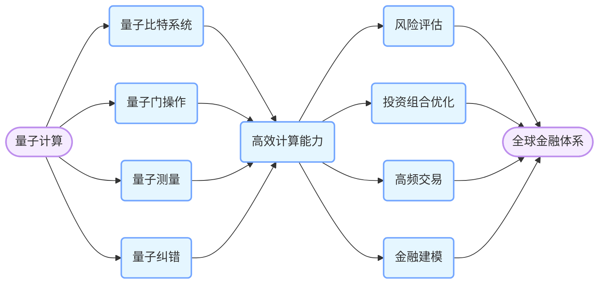

# 巴菲特的宏观经济分析：量子计算对全球金融体系的影响

> 关键词：巴菲特、宏观经济分析、量子计算、全球金融体系、金融影响、技术变革、金融创新

> 摘要：本文以巴菲特的宏观经济分析视角为切入点，深入探讨量子计算对全球金融体系的多维度影响。从量子计算的核心概念与原理出发，阐述其与金融体系的内在联系，剖析相关算法原理及数学模型。通过项目实战案例，展示量子计算在金融领域的实际应用，并分析其具体应用场景。同时，推荐相关的学习资源、开发工具和论文著作，最后总结量子计算在金融领域的未来发展趋势与面临的挑战，解答常见问题并提供扩展阅读与参考资料，旨在全面呈现量子计算对全球金融体系的深远影响。

## 1. 背景介绍 
### 1.1 目的和范围
本文旨在深入探讨量子计算这一前沿技术对全球金融体系的影响，基于巴菲特的宏观经济分析理念，研究量子计算在金融领域的应用潜力、挑战以及未来发展趋势。范围涵盖量子计算的基本原理、与金融体系的关联、相关算法和数学模型、实际应用案例，以及对未来金融格局的影响等方面。

### 1.2 预期读者
本文预期读者包括金融从业者、量子计算领域的科研人员、技术爱好者、经济学者以及对金融与科技融合发展感兴趣的人群。通过本文，读者可以全面了解量子计算对全球金融体系的影响，为其在各自领域的研究、决策和实践提供参考。

### 1.3 文档结构概述
本文将按照以下结构展开：首先介绍量子计算的核心概念与联系，包括其原理和架构；接着阐述核心算法原理及具体操作步骤，并给出相应的Python源代码；然后介绍量子计算相关的数学模型和公式，并举例说明；通过项目实战展示量子计算在金融领域的实际应用，包括开发环境搭建、源代码实现和代码解读；分析量子计算在金融领域的实际应用场景；推荐相关的学习资源、开发工具和论文著作；总结量子计算对全球金融体系的未来发展趋势与挑战；附录部分解答常见问题；最后提供扩展阅读与参考资料。

### 1.4 术语表
#### 1.4.1 核心术语定义
- **量子计算**：基于量子力学原理进行信息处理的计算模式，利用量子比特（qubit）的叠加、纠缠等特性实现高效计算。
- **量子比特（qubit）**：量子计算中的基本信息单位，与经典比特不同，它可以同时处于0和1的叠加态。
- **量子纠缠**：多个量子比特之间存在的一种特殊关联，使得一个量子比特的状态改变会瞬间影响其他纠缠的量子比特。
- **全球金融体系**：由各国金融机构、金融市场、金融监管等组成的相互关联的系统，负责资金的融通和配置。

#### 1.4.2 相关概念解释
- **叠加态**：量子比特可以同时处于0和1的线性组合状态，这使得量子计算机在处理某些问题时能够并行计算，大大提高计算效率。
- **量子门**：类似于经典计算机中的逻辑门，用于对量子比特进行操作，改变其状态。
- **金融风险**：金融机构或投资者在金融活动中面临的各种不确定性，可能导致损失。

#### 1.4.3 缩略词列表
- **QC**：量子计算（Quantum Computing）
- **QUBIT**：量子比特（Quantum Bit）
- **HFT**：高频交易（High - Frequency Trading）

## 2. 核心概念与联系 
### 2.1 量子计算原理
量子计算基于量子力学的基本原理，利用量子比特的特性进行信息处理。与经典计算机使用的二进制比特（0或1）不同，量子比特可以处于0和1的叠加态，即一个量子比特可以同时表示0和1。这种叠加态使得量子计算机在处理某些问题时能够并行计算，大大提高计算效率。

例如，一个由 $n$ 个经典比特组成的系统只能表示 $2^n$ 种状态中的一种，而一个由 $n$ 个量子比特组成的系统可以同时表示 $2^n$ 种状态的叠加。这意味着量子计算机可以同时处理多个计算任务，从而在某些问题上比经典计算机快指数级。

量子计算还利用了量子纠缠的特性。当两个或多个量子比特处于纠缠态时，它们之间存在一种特殊的关联，使得一个量子比特的状态改变会瞬间影响其他纠缠的量子比特，无论它们之间的距离有多远。这种特性可以用于实现高效的量子通信和量子算法。

### 2.2 量子计算架构
量子计算的架构主要包括量子比特系统、量子门操作、量子测量和量子纠错等部分。

量子比特系统是量子计算的基础，用于存储和处理量子信息。常见的量子比特实现方式包括超导量子比特、离子阱量子比特、量子点量子比特等。

量子门操作是对量子比特进行的基本操作，用于改变量子比特的状态。常见的量子门包括单量子比特门（如哈达玛门、泡利门等）和多量子比特门（如受控非门等）。

量子测量是将量子比特的状态转换为经典信息的过程。由于量子测量会导致量子态的塌缩，因此需要在合适的时机进行测量。

量子纠错是为了克服量子比特的噪声和退相干问题而采取的措施。由于量子比特非常脆弱，容易受到外界环境的干扰，因此需要使用量子纠错码来保护量子信息。

### 2.3 量子计算与全球金融体系的联系
量子计算与全球金融体系有着密切的联系。在金融领域，许多问题都涉及到复杂的计算和优化，如风险评估、投资组合优化、高频交易等。量子计算的高效计算能力可以为这些问题提供更优的解决方案。

例如，在风险评估中，量子计算机可以快速计算各种金融资产的风险指标，如VaR（Value at Risk）等，从而帮助金融机构更好地管理风险。在投资组合优化中，量子计算机可以在更短的时间内找到最优的投资组合，提高投资回报率。在高频交易中，量子计算的快速计算能力可以使交易策略更加精准和高效。

### 2.4 文本示意图
量子计算与全球金融体系的联系可以用以下文本示意图表示：

量子计算：量子比特系统 -> 量子门操作 -> 量子测量 -> 量子纠错
|
| 高效计算能力
|
全球金融体系：风险评估、投资组合优化、高频交易、金融建模等

### 2.5 Mermaid 流程图


## 3. 核心算法原理 & 具体操作步骤 
### 3.1 量子算法概述
量子算法是利用量子计算的特性设计的算法，旨在解决某些经典算法难以解决的问题。常见的量子算法包括量子傅里叶变换（QFT）、量子搜索算法（如Grover算法）、量子模拟算法等。

### 3.2 Grover算法原理
Grover算法是一种量子搜索算法，用于在未排序的数据库中查找特定元素。与经典算法相比，Grover算法的时间复杂度为 $O(\sqrt{N})$，而经典算法的时间复杂度为 $O(N)$，其中 $N$ 是数据库的大小。

Grover算法的基本步骤如下：
1. **初始化**：将所有量子比特初始化为叠加态。
2. **迭代**：重复执行以下两个步骤多次：
    - **Oracle操作**：标记目标元素。
    - **扩散操作**：增强目标元素的振幅。
3. **测量**：对量子比特进行测量，得到目标元素。

### 3.3 Grover算法的Python实现
以下是使用Qiskit库实现Grover算法的Python代码：

```python
from qiskit import QuantumCircuit, Aer, execute
from qiskit.visualization import plot_histogram
import numpy as np

# 定义数据库大小
N = 4
n = int(np.log2(N))

# 初始化量子电路
qc = QuantumCircuit(n, n)

# 步骤1: 初始化所有量子比特为叠加态
for qubit in range(n):
    qc.h(qubit)

# 步骤2: 定义Oracle操作（假设目标元素为|11>）
def oracle(qc, n):
    target = 3  # 目标元素的十进制表示
    oracle_qc = QuantumCircuit(n)
    for qubit in range(n):
        if not (target & (1 << qubit)):
            oracle_qc.x(qubit)
    oracle_qc.mct(list(range(n - 1)), n - 1)  # 多控非门
    for qubit in range(n):
        if not (target & (1 << qubit)):
            oracle_qc.x(qubit)
    qc.compose(oracle_qc, inplace=True)

# 步骤3: 定义扩散操作
def diffusion(qc, n):
    diffusion_qc = QuantumCircuit(n)
    for qubit in range(n):
        diffusion_qc.h(qubit)
        diffusion_qc.x(qubit)
    diffusion_qc.mct(list(range(n - 1)), n - 1)  # 多控非门
    for qubit in range(n):
        diffusion_qc.x(qubit)
        diffusion_qc.h(qubit)
    qc.compose(diffusion_qc, inplace=True)

# 步骤4: 迭代执行Oracle和扩散操作
iterations = int(np.pi / 4 * np.sqrt(N))
for _ in range(iterations):
    oracle(qc, n)
    diffusion(qc, n)

# 步骤5: 测量量子比特
for qubit in range(n):
    qc.measure(qubit, qubit)

# 执行量子电路
backend = Aer.get_backend('qasm_simulator')
job = execute(qc, backend, shots=1024)
result = job.result()
counts = result.get_counts(qc)

# 绘制测量结果
plot_histogram(counts).show()
```

### 3.4 代码解释
1. **初始化量子电路**：创建一个包含 $n$ 个量子比特和 $n$ 个经典比特的量子电路，并将所有量子比特初始化为叠加态。
2. **定义Oracle操作**：标记目标元素，通过多控非门实现。
3. **定义扩散操作**：增强目标元素的振幅，通过一系列的哈达玛门和X门实现。
4. **迭代执行Oracle和扩散操作**：根据Grover算法的理论，迭代次数为 $\frac{\pi}{4}\sqrt{N}$。
5. **测量量子比特**：将量子比特的状态转换为经典信息。
6. **执行量子电路**：使用Qiskit的模拟器执行量子电路，并获取测量结果。
7. **绘制测量结果**：使用Matplotlib库绘制测量结果的直方图。

### 3.5 具体操作步骤
1. **安装Qiskit库**：使用pip命令安装Qiskit库：
```sh
pip install qiskit
```
2. **运行代码**：将上述代码保存为一个Python文件（如`grover_algorithm.py`），然后在终端中运行：
```sh
python grover_algorithm.py
```
3. **查看结果**：运行代码后，会弹出一个窗口显示测量结果的直方图，其中概率最高的状态即为目标元素。

## 4. 数学模型和公式 & 详细讲解 & 举例说明 
### 4.1 量子比特的数学表示
量子比特可以用二维希尔伯特空间中的向量表示。一个量子比特的状态可以表示为：
$$|\psi\rangle = \alpha|0\rangle + \beta|1\rangle$$
其中，$\alpha$ 和 $\beta$ 是复数，满足 $|\alpha|^2 + |\beta|^2 = 1$。$|0\rangle$ 和 $|1\rangle$ 是量子比特的基态。

### 4.2 量子门的矩阵表示
量子门可以用矩阵表示。例如，哈达玛门（H门）的矩阵表示为：
$$H = \frac{1}{\sqrt{2}}\begin{bmatrix}1 & 1\\1 & -1\end{bmatrix}$$
对一个量子比特 $|\psi\rangle = \alpha|0\rangle + \beta|1\rangle$ 应用哈达玛门，得到：
$$H|\psi\rangle = \frac{1}{\sqrt{2}}\begin{bmatrix}1 & 1\\1 & -1\end{bmatrix}\begin{bmatrix}\alpha\\\beta\end{bmatrix} = \frac{\alpha + \beta}{\sqrt{2}}|0\rangle + \frac{\alpha - \beta}{\sqrt{2}}|1\rangle$$

### 4.3 Grover算法的数学原理
Grover算法的核心是通过Oracle操作和扩散操作来增强目标元素的振幅。设数据库的大小为 $N = 2^n$，所有元素的初始状态为：
$$|\psi_0\rangle = \frac{1}{\sqrt{N}}\sum_{x = 0}^{N - 1}|x\rangle$$
Oracle操作可以表示为一个对角矩阵 $U_{\omega}$，其中 $\omega$ 是目标元素的索引：
$$U_{\omega}|x\rangle = (-1)^{f(x)}|x\rangle$$
其中，$f(x)$ 是一个布尔函数，当 $x = \omega$ 时，$f(x) = 1$，否则 $f(x) = 0$。

扩散操作可以表示为：
$$U_s = 2|\psi_0\rangle\langle\psi_0| - I$$
其中，$I$ 是单位矩阵。

Grover算法的迭代过程可以表示为：
$$|\psi_{k + 1}\rangle = U_sU_{\omega}|\psi_k\rangle$$
经过 $k$ 次迭代后，目标元素的振幅会逐渐增大。当 $k \approx \frac{\pi}{4}\sqrt{N}$ 时，目标元素的振幅接近1。

### 4.4 举例说明
假设数据库的大小为 $N = 4$，目标元素为 $|11\rangle$。初始状态为：
$$|\psi_0\rangle = \frac{1}{2}(|00\rangle + |01\rangle + |10\rangle + |11\rangle)$$
Oracle操作 $U_{\omega}$ 可以表示为：
$$U_{\omega} = \begin{bmatrix}1 & 0 & 0 & 0\\0 & 1 & 0 & 0\\0 & 0 & 1 & 0\\0 & 0 & 0 & -1\end{bmatrix}$$
扩散操作 $U_s$ 可以表示为：
$$U_s = \frac{1}{2}\begin{bmatrix}-1 & 1 & 1 & 1\\1 & -1 & 1 & 1\\1 & 1 & -1 & 1\\1 & 1 & 1 & -1\end{bmatrix}$$
经过一次迭代后，状态变为：
$$|\psi_1\rangle = U_sU_{\omega}|\psi_0\rangle = \frac{1}{2}(|00\rangle + |01\rangle + |10\rangle - |11\rangle)$$
经过两次迭代后，状态变为：
$$|\psi_2\rangle = U_sU_{\omega}|\psi_1\rangle = |11\rangle$$
此时，测量量子比特得到目标元素 $|11\rangle$ 的概率为1。

## 5. 项目实战：代码实际案例和详细解释说明 
### 5.1  开发环境搭建
#### 5.1.1 安装Python
首先，需要安装Python环境。可以从Python官方网站（https://www.python.org/downloads/） 下载适合自己操作系统的Python安装包，并按照安装向导进行安装。

#### 5.1.2 安装Qiskit库
Qiskit是一个用于量子计算的开源Python库，可以使用pip命令进行安装：
```sh
pip install qiskit
```

#### 5.1.3 安装Matplotlib库
Matplotlib是一个用于数据可视化的Python库，用于绘制测量结果的直方图。可以使用pip命令进行安装：
```sh
pip install matplotlib
```

### 5.2  源代码详细实现和代码解读
#### 5.2.1 量子投资组合优化案例
以下是一个使用量子计算进行投资组合优化的Python代码示例：

```python
from qiskit import Aer, execute
from qiskit.optimization.applications.ising import portfolio
from qiskit.optimization.converters import IsingToQuadraticProgram
from qiskit.aqua.algorithms import NumPyMinimumEigensolver
from qiskit.aqua import QuantumInstance
from qiskit.aqua.algorithms import QAOA
import numpy as np

# 定义投资组合优化问题的参数
num_assets = 4
mu = np.array([0.73, 0.9, 0.92, 0.85])
sigma = np.array([[0.18, 0.02, 0.12, 0.1],
                  [0.02, 0.11, 0.04, 0.08],
                  [0.12, 0.04, 0.11, 0.05],
                  [0.1, 0.08, 0.05, 0.18]])
q = 0.5  # 风险偏好参数
budget = num_assets // 2  # 投资预算

# 将投资组合优化问题转换为Ising模型
qubit_op, offset = portfolio.get_operator(mu, sigma, q, budget)

# 将Ising模型转换为二次规划问题
qp = IsingToQuadraticProgram().convert(qubit_op, offset)

# 使用经典算法求解二次规划问题
exact_mes = NumPyMinimumEigensolver()
result = exact_mes.run(qubit_op)
classical_result = portfolio.sample_most_likely(result.eigenstate)
print("Classical solution:", classical_result)

# 使用量子算法（QAOA）求解二次规划问题
backend = Aer.get_backend('qasm_simulator')
quantum_instance = QuantumInstance(backend, shots=1024)
qaoa = QAOA(quantum_instance=quantum_instance, p=2)
result = qaoa.run(qubit_op)
quantum_result = portfolio.sample_most_likely(result.eigenstate)
print("Quantum solution:", quantum_result)
```

#### 5.2.2 代码解读
1. **定义投资组合优化问题的参数**：包括资产数量、预期收益率、协方差矩阵、风险偏好参数和投资预算。
2. **将投资组合优化问题转换为Ising模型**：使用`portfolio.get_operator`函数将投资组合优化问题转换为Ising模型。
3. **将Ising模型转换为二次规划问题**：使用`IsingToQuadraticProgram`类将Ising模型转换为二次规划问题。
4. **使用经典算法求解二次规划问题**：使用`NumPyMinimumEigensolver`类求解二次规划问题，并得到经典解。
5. **使用量子算法（QAOA）求解二次规划问题**：使用`QAOA`类求解二次规划问题，并得到量子解。

### 5.3  代码解读与分析
#### 5.3.1 经典解与量子解的比较
从代码运行结果可以看出，经典解和量子解可能会有所不同。这是因为量子算法在处理某些问题时具有优势，但也受到量子比特噪声和退相干等因素的影响。

#### 5.3.2 量子算法的优势
量子算法（如QAOA）在处理大规模投资组合优化问题时，可能比经典算法更快。这是因为量子算法可以利用量子比特的叠加和纠缠特性，并行处理多个计算任务。

#### 5.3.3 量子算法的挑战
量子算法的实现需要高精度的量子比特和有效的量子纠错技术。目前，量子计算机的性能还受到量子比特噪声和退相干等因素的限制，因此量子算法的实际应用还面临一定的挑战。

## 6. 实际应用场景 
### 6.1 风险评估
在金融领域，风险评估是一个重要的任务。量子计算可以通过快速计算各种金融资产的风险指标，如VaR（Value at Risk）、CVaR（Conditional Value at Risk）等，帮助金融机构更好地管理风险。

例如，在计算VaR时，需要对大量的历史数据进行模拟和分析。经典计算机在处理大规模数据时可能会遇到计算瓶颈，而量子计算机可以利用其并行计算能力，快速完成计算任务。

### 6.2 投资组合优化
投资组合优化是指在给定的风险水平下，选择最优的投资组合，以实现投资回报率的最大化。量子计算可以通过快速搜索所有可能的投资组合，找到最优的解决方案。

例如，在一个包含大量资产的投资组合中，经典算法需要遍历所有可能的组合，计算复杂度非常高。而量子算法可以利用其高效的搜索能力，在更短的时间内找到最优的投资组合。

### 6.3 高频交易
高频交易是指在极短的时间内进行大量的交易操作。量子计算的快速计算能力可以使高频交易策略更加精准和高效。

例如，在高频交易中，需要实时分析市场数据，快速做出交易决策。量子计算机可以在短时间内处理大量的市场数据，提供更准确的交易信号，从而提高交易效率和盈利能力。

### 6.4 金融建模
金融建模是指用数学模型来描述金融市场的行为和规律。量子计算可以通过模拟复杂的金融系统，提高金融建模的准确性和效率。

例如，在模拟金融市场的波动和风险时，需要考虑大量的因素和变量。量子计算机可以利用其强大的计算能力，更准确地模拟金融市场的行为，为金融决策提供更可靠的依据。

## 7. 工具和资源推荐
### 7.1 学习资源推荐
#### 7.1.1 书籍推荐
- 《量子计算与量子信息》（Quantum Computation and Quantum Information）：由Michael A. Nielsen和Isaac L. Chuang编写，是量子计算领域的经典教材，全面介绍了量子计算的基本原理和算法。
- 《量子计算编程实战》（Programming Quantum Computers）：由Eric R. Johnston、Nicolas P. Rubin和Andy M. Kamal编写，通过实际案例介绍了如何使用Qiskit等工具进行量子计算编程。

#### 7.1.2 在线课程
- Coursera上的“Quantum Computing for Everyone”：由Michigan State University提供，适合初学者学习量子计算的基本概念和原理。
- edX上的“Quantum Mechanics and Quantum Computation”：由University of California, Berkeley提供，深入介绍了量子力学和量子计算的理论知识。

#### 7.1.3 技术博客和网站
- Qiskit官方博客（https://qiskit.org/blog/）：提供了关于量子计算的最新技术和研究成果。
- Medium上的“Quantum Computing Now”：汇集了量子计算领域的优秀文章和观点。

### 7.2 开发工具框架推荐
#### 7.2.1 IDE和编辑器
- PyCharm：一款功能强大的Python集成开发环境，支持Qiskit等量子计算库的开发。
- Visual Studio Code：一款轻量级的代码编辑器，具有丰富的插件和扩展功能，适合量子计算代码的编写和调试。

#### 7.2.2 调试和性能分析工具
- Qiskit Aer：Qiskit的模拟器，用于模拟量子电路的运行和调试。
- Qiskit Ignis：Qiskit的量子误差校正和噪声分析工具，用于分析量子计算机的性能和误差。

#### 7.2.3 相关框架和库
- Qiskit：一个用于量子计算的开源Python库，提供了丰富的量子算法和工具。
- Cirq：Google开发的用于量子计算的Python库，支持自定义量子电路和算法。

### 7.3 相关论文著作推荐
#### 7.3.1 经典论文
- “Algorithms for Quantum Computation: Discrete Logarithms and Factoring” by Peter W. Shor：介绍了Shor算法，该算法可以在量子计算机上高效地进行整数分解，对密码学产生了重大影响。
- “A Fast Quantum Mechanical Algorithm for Database Search” by Lov K. Grover：介绍了Grover算法，该算法可以在量子计算机上高效地进行数据库搜索。

#### 7.3.2 最新研究成果
- 关注arXiv（https://arxiv.org/） 上关于量子计算和金融领域的最新研究论文，了解该领域的前沿动态。

#### 7.3.3 应用案例分析
- 查阅相关的学术期刊和会议论文，了解量子计算在金融领域的实际应用案例和效果分析。

## 8. 总结：未来发展趋势与挑战
### 8.1 未来发展趋势
- **技术突破**：随着量子计算技术的不断发展，量子比特的数量和质量将不断提高，量子纠错技术也将不断完善。这将使得量子计算机的性能得到大幅提升，能够处理更加复杂的金融问题。
- **金融创新**：量子计算将推动金融领域的创新，如开发新的金融产品和服务、优化金融市场的运行机制等。例如，基于量子计算的风险管理系统可以更加准确地评估风险，为投资者提供更可靠的决策依据。
- **跨领域合作**：量子计算与金融领域的跨领域合作将越来越密切。金融机构将与科研机构、科技企业等合作，共同探索量子计算在金融领域的应用，推动金融科技的发展。

### 8.2 挑战
- **技术难题**：量子计算技术仍然面临许多技术难题，如量子比特的噪声和退相干、量子纠错的复杂性等。这些问题限制了量子计算机的性能和可靠性，需要进一步的研究和突破。
- **人才短缺**：量子计算是一个新兴领域，相关的专业人才短缺。金融机构和科研机构需要加强人才培养和引进，提高从业人员的量子计算知识和技能水平。
- **安全风险**：量子计算的发展也带来了新的安全风险。例如，量子计算机可以破解现有的加密算法，威胁金融信息的安全。因此，需要研究和开发新的量子安全技术，保障金融系统的安全。

## 9. 附录：常见问题与解答
### 9.1 量子计算什么时候能够广泛应用于金融领域？
目前，量子计算技术还处于发展阶段，距离广泛应用于金融领域还有一定的距离。预计在未来5 - 10年内，随着量子计算技术的不断进步，量子计算机的性能将得到大幅提升，量子计算在金融领域的应用将逐渐增多。

### 9.2 量子计算会取代经典计算吗？
量子计算不会完全取代经典计算。虽然量子计算在处理某些问题时具有优势，但经典计算在大多数情况下仍然是有效的。未来，量子计算和经典计算将相互补充，共同推动科学技术的发展。

### 9.3 量子计算对金融安全有什么影响？
量子计算的发展对金融安全既有挑战也有机遇。一方面，量子计算机可以破解现有的加密算法，威胁金融信息的安全；另一方面，量子计算也可以用于开发新的量子安全技术，如量子加密、量子签名等，保障金融系统的安全。

## 10. 扩展阅读 & 参考资料
### 10.1 扩展阅读
- 《量子计算：从基础到应用》
- 《金融科技前沿：量子计算与金融创新》

### 10.2 参考资料
- Nielsen, M. A., & Chuang, I. L. (2010). Quantum Computation and Quantum Information. Cambridge University Press.
- Johnston, E. R., Rubin, N. P., & Kamal, A. M. (2020). Programming Quantum Computers. O'Reilly Media.

作者：AI天才研究院/AI Genius Institute & 禅与计算机程序设计艺术 /Zen And The Art of Computer Programming