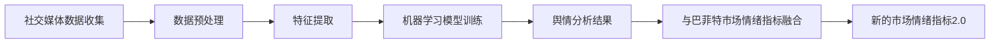

# 巴菲特的市场情绪指标2.0：社交媒体时代的舆情分析

> 关键词：巴菲特市场情绪指标、社交媒体、舆情分析、金融市场、数据挖掘、机器学习、投资决策

> 摘要：本文深入探讨了在社交媒体时代，对巴菲特市场情绪指标进行升级的舆情分析方法。首先介绍了研究的背景、目的、预期读者和文档结构等内容。接着阐述了核心概念及其联系，详细讲解了核心算法原理和具体操作步骤，并给出了相应的Python代码。同时，介绍了相关的数学模型和公式，通过实际案例进行说明。在项目实战部分，从开发环境搭建到源代码实现和解读进行了全面分析。还探讨了该舆情分析在金融市场的实际应用场景，推荐了相关的学习资源、开发工具框架和论文著作。最后总结了未来发展趋势与挑战，并提供了常见问题解答和扩展阅读参考资料。旨在帮助投资者更好地利用社交媒体舆情信息进行投资决策，提升市场分析能力。

## 1. 背景介绍 
### 1.1 目的和范围
在传统金融市场分析中，巴菲特提出的市场情绪指标为投资者评估市场整体状况提供了重要参考。然而，随着社交媒体的兴起，大量的投资者观点、市场传闻等信息在网络上快速传播，这些信息蕴含着丰富的市场情绪线索。本研究的目的是将社交媒体舆情分析融入巴菲特的市场情绪指标体系，构建“巴菲特的市场情绪指标2.0”，以更准确地反映市场参与者的情绪和预期，为投资者提供更全面、及时的市场分析工具。

研究范围涵盖了主要社交媒体平台（如Twitter、微博等）上与金融市场相关的文本数据，包括股票、基金、债券等各类金融产品的讨论内容。通过对这些文本数据的挖掘和分析，提取其中的情绪信息，并与传统的市场数据相结合，形成新的市场情绪指标。

### 1.2 预期读者
本文的预期读者主要包括金融投资者、金融分析师、量化交易员、金融科技研究者以及对金融市场和数据分析感兴趣的专业人士。对于投资者来说，希望通过了解社交媒体舆情分析方法，更好地把握市场情绪，优化投资决策；金融分析师可以借助新的市场情绪指标，提供更准确的市场研究报告；量化交易员能够将舆情数据纳入交易策略，提高交易绩效；金融科技研究者则可以关注舆情分析技术在金融领域的应用和创新；而对金融市场和数据分析感兴趣的专业人士可以从中获取相关知识和研究思路。

### 1.3 文档结构概述
本文将按照以下结构进行阐述：首先介绍核心概念与联系，明确相关术语和原理；接着详细讲解核心算法原理和具体操作步骤，并给出Python代码实现；然后介绍相关的数学模型和公式，并通过举例进行说明；在项目实战部分，从开发环境搭建到源代码详细实现和解读进行全面分析；探讨实际应用场景；推荐相关的工具和资源；总结未来发展趋势与挑战；提供常见问题解答和扩展阅读参考资料。

### 1.4 术语表
#### 1.4.1 核心术语定义
- **巴菲特市场情绪指标**：由巴菲特提出的用于衡量市场整体情绪和估值水平的指标，通常基于市场总市值与国内生产总值（GDP）的比率等传统金融数据。
- **社交媒体舆情分析**：通过对社交媒体上的文本数据进行挖掘和分析，提取其中的情绪信息、主题信息等，以了解公众对特定事件、产品或话题的看法和态度。
- **市场情绪**：指市场参与者对市场未来走势的总体看法和预期，包括乐观、悲观、中性等不同情绪状态。
- **文本挖掘**：从大量文本数据中提取有价值的信息和知识的过程，包括文本分类、情感分析、关键词提取等技术。
- **情感分析**：一种文本挖掘技术，用于判断文本所表达的情感倾向，通常分为积极、消极和中性三类。

#### 1.4.2 相关概念解释
- **自然语言处理（NLP）**：是计算机科学与语言学的交叉领域，研究如何让计算机理解和处理人类语言。在社交媒体舆情分析中，NLP技术用于对文本数据进行预处理、特征提取和情感分析等。
- **机器学习**：是一门多领域交叉学科，涉及概率论、统计学、逼近论、凸分析、算法复杂度理论等多门学科。它专门研究计算机怎样模拟或实现人类的学习行为，以获取新的知识或技能，重新组织已有的知识结构使之不断改善自身的性能。在舆情分析中，机器学习算法用于构建情感分类模型、预测市场走势等。
- **大数据**：指无法在一定时间范围内用常规软件工具进行捕捉、管理和处理的数据集合，是需要新处理模式才能具有更强的决策力、洞察发现力和流程优化能力的海量、高增长率和多样化的信息资产。社交媒体上产生的海量文本数据属于大数据范畴，需要采用大数据技术进行存储、处理和分析。

#### 1.4.3 缩略词列表
- **GDP**：国内生产总值（Gross Domestic Product）
- **NLP**：自然语言处理（Natural Language Processing）
- **ML**：机器学习（Machine Learning）
- **API**：应用程序编程接口（Application Programming Interface）

## 2. 核心概念与联系 

### 核心概念原理
#### 巴菲特市场情绪指标原理
巴菲特市场情绪指标的核心思想是通过比较市场总市值与国内生产总值（GDP）的比率来评估市场的估值水平和投资者情绪。当该比率较高时，意味着市场可能被高估，投资者情绪较为乐观，市场存在泡沫风险；反之，当该比率较低时，市场可能被低估，投资者情绪较为悲观，存在投资机会。其基本公式为：

$$巴菲特市场情绪指标 = \frac{市场总市值}{GDP}$$

#### 社交媒体舆情分析原理
社交媒体舆情分析主要基于自然语言处理和机器学习技术。首先，从社交媒体平台上收集与金融市场相关的文本数据；然后，对这些文本数据进行预处理，包括去除噪声、分词、词性标注等；接着，提取文本的特征，如关键词、词频、情感极性等；最后，利用机器学习算法构建分类模型，对文本的情感倾向进行分类，判断其是积极、消极还是中性。

### 架构的文本示意图
```plaintext
           社交媒体数据收集
                 |
                 v
         数据预处理（清洗、分词等）
                 |
                 v
        特征提取（关键词、情感极性等）
                 |
                 v
    机器学习模型训练（情感分类模型）
                 |
                 v
  舆情分析结果（市场情绪得分）
                 |
                 v
与巴菲特市场情绪指标融合
                 |
                 v
新的市场情绪指标2.0
```

### Mermaid 流程图


## 3. 核心算法原理 & 具体操作步骤 

### 核心算法原理
在社交媒体舆情分析中，常用的情感分析算法有朴素贝叶斯算法、支持向量机算法和深度学习算法（如循环神经网络、卷积神经网络等）。这里以朴素贝叶斯算法为例进行介绍。

朴素贝叶斯算法基于贝叶斯定理和特征条件独立假设，用于文本分类任务。贝叶斯定理的公式为：

$$P(C|X) = \frac{P(X|C)P(C)}{P(X)}$$

其中，$P(C|X)$ 表示在给定特征 $X$ 的情况下，样本属于类别 $C$ 的概率；$P(X|C)$ 表示在类别 $C$ 下，特征 $X$ 出现的概率；$P(C)$ 表示类别 $C$ 出现的先验概率；$P(X)$ 表示特征 $X$ 出现的概率。

在情感分析中，假设文本的每个特征（如单词）之间是相互独立的，那么可以通过计算文本属于不同情感类别的概率来进行分类。具体来说，对于一个文本 $X = (x_1, x_2, \cdots, x_n)$，其中 $x_i$ 表示文本中的第 $i$ 个特征，计算其属于积极、消极和中性类别的概率 $P(positive|X)$、$P(negative|X)$ 和 $P(neutral|X)$，然后选择概率最大的类别作为文本的情感类别。

### 具体操作步骤

#### 步骤 1：数据收集
使用社交媒体平台提供的API（如Twitter API、微博API等）收集与金融市场相关的文本数据。以下是一个使用Python和Tweepy库收集Twitter数据的示例代码：

```python
import tweepy

# 填写你的Twitter API凭证
consumer_key = 'your_consumer_key'
consumer_secret = 'your_consumer_secret'
access_token = 'your_access_token'
access_token_secret = 'your_access_token_secret'

# 认证
auth = tweepy.OAuthHandler(consumer_key, consumer_secret)
auth.set_access_token(access_token, access_token_secret)

# 创建API对象
api = tweepy.API(auth)

# 搜索关键词
query = 'stock market'
tweets = api.search_tweets(q=query, count=100)

# 提取推文文本
tweet_texts = [tweet.text for tweet in tweets]
```

#### 步骤 2：数据预处理
对收集到的文本数据进行预处理，包括去除噪声（如HTML标签、特殊字符等）、分词、去除停用词等。以下是一个使用Python和NLTK库进行数据预处理的示例代码：

```python
import re
import nltk
from nltk.corpus import stopwords
from nltk.tokenize import word_tokenize

nltk.download('stopwords')
nltk.download('punkt')

# 定义预处理函数
def preprocess_text(text):
    # 去除HTML标签
    text = re.sub(r'<.*?>', '', text)
    # 去除特殊字符
    text = re.sub(r'[^a-zA-Z0-9\s]', '', text)
    # 转换为小写
    text = text.lower()
    # 分词
    tokens = word_tokenize(text)
    # 去除停用词
    stop_words = set(stopwords.words('english'))
    filtered_tokens = [token for token in tokens if token not in stop_words]
    # 合并分词结果
    preprocessed_text = ' '.join(filtered_tokens)
    return preprocessed_text

# 对推文文本进行预处理
preprocessed_tweet_texts = [preprocess_text(text) for text in tweet_texts]
```

#### 步骤 3：特征提取
使用词袋模型（Bag of Words）提取文本的特征。词袋模型将文本表示为一个向量，向量的每个元素表示一个单词的出现频率。以下是一个使用Python和Scikit-learn库进行特征提取的示例代码：

```python
from sklearn.feature_extraction.text import CountVectorizer

# 创建词袋模型
vectorizer = CountVectorizer()

# 提取特征
X = vectorizer.fit_transform(preprocessed_tweet_texts)
```

#### 步骤 4：模型训练
使用朴素贝叶斯算法训练情感分类模型。以下是一个使用Python和Scikit-learn库进行模型训练的示例代码：

```python
from sklearn.naive_bayes import MultinomialNB
from sklearn.model_selection import train_test_split

# 假设已经有标注好的训练数据
# X_train 是训练数据的特征矩阵
# y_train 是训练数据的标签
X_train, X_test, y_train, y_test = train_test_split(X, y, test_size=0.2, random_state=42)

# 创建朴素贝叶斯分类器
clf = MultinomialNB()

# 训练模型
clf.fit(X_train, y_train)

# 评估模型
accuracy = clf.score(X_test, y_test)
print(f"模型准确率: {accuracy}")
```

#### 步骤 5：舆情分析
使用训练好的模型对新的文本数据进行情感分析，得到舆情分析结果。以下是一个使用训练好的模型进行舆情分析的示例代码：

```python
# 假设 new_tweet_texts 是新的推文文本
new_preprocessed_tweet_texts = [preprocess_text(text) for text in new_tweet_texts]
new_X = vectorizer.transform(new_preprocessed_tweet_texts)
predictions = clf.predict(new_X)

# 统计积极、消极和中性推文的数量
positive_count = sum(predictions == 'positive')
negative_count = sum(predictions == 'negative')
neutral_count = sum(predictions == 'neutral')

# 计算市场情绪得分
total_count = len(predictions)
sentiment_score = (positive_count - negative_count) / total_count
print(f"市场情绪得分: {sentiment_score}")
```

#### 步骤 6：与巴菲特市场情绪指标融合
将舆情分析得到的市场情绪得分与巴菲特市场情绪指标进行融合，形成新的市场情绪指标2.0。可以采用加权平均的方法进行融合，例如：

$$新的市场情绪指标2.0 = \alpha \times 巴菲特市场情绪指标 + (1 - \alpha) \times 舆情分析市场情绪得分$$

其中，$\alpha$ 是权重系数，取值范围为 $[0, 1]$，可以根据实际情况进行调整。

## 4. 数学模型和公式 & 详细讲解 & 举例说明 

### 贝叶斯定理公式
$$P(C|X) = \frac{P(X|C)P(C)}{P(X)}$$

详细讲解：
- $P(C|X)$：后验概率，表示在给定特征 $X$ 的情况下，样本属于类别 $C$ 的概率。在情感分析中，就是给定一个文本的特征（如单词），该文本属于积极、消极或中性类别的概率。
- $P(X|C)$：似然概率，表示在类别 $C$ 下，特征 $X$ 出现的概率。例如，在积极类别的文本中，某个单词出现的概率。
- $P(C)$：先验概率，表示类别 $C$ 出现的概率。可以通过训练数据中各类别样本的比例来估计。
- $P(X)$：证据概率，表示特征 $X$ 出现的概率。在分类任务中，$P(X)$ 对于所有类别都是相同的，因此在比较不同类别的后验概率时，可以忽略 $P(X)$。

举例说明：
假设我们有一个简单的文本分类任务，判断文本是关于“体育”还是“科技”。训练数据中有 100 个文本，其中 60 个是关于体育的，40 个是关于科技的。那么先验概率 $P(体育) = 0.6$，$P(科技) = 0.4$。

现在有一个新的文本 $X$，其中包含单词“篮球”。在体育类别的文本中，“篮球”出现的概率 $P(篮球|体育) = 0.2$；在科技类别的文本中，“篮球”出现的概率 $P(篮球|科技) = 0.05$。

根据贝叶斯定理，计算该文本属于体育类别的后验概率：

$$P(体育|篮球) = \frac{P(篮球|体育)P(体育)}{P(篮球)} = \frac{0.2 \times 0.6}{P(篮球)}$$

计算该文本属于科技类别的后验概率：

$$P(科技|篮球) = \frac{P(篮球|科技)P(科技)}{P(篮球)} = \frac{0.05 \times 0.4}{P(篮球)}$$

比较 $P(体育|篮球)$ 和 $P(科技|篮球)$ 的大小，选择概率大的类别作为文本的分类结果。

### 词袋模型公式
词袋模型将文本表示为一个向量，向量的每个元素表示一个单词的出现频率。假设我们有一个包含 $n$ 个单词的词汇表 $V = \{w_1, w_2, \cdots, w_n\}$，对于一个文本 $X$，其词袋模型表示为一个 $n$ 维向量 $\mathbf{x} = (x_1, x_2, \cdots, x_n)$，其中 $x_i$ 表示单词 $w_i$ 在文本 $X$ 中出现的频率。

详细讲解：
词袋模型的核心思想是将文本看作是单词的集合，不考虑单词的顺序和语法结构。通过统计每个单词的出现频率，将文本转换为一个向量，方便进行机器学习算法的处理。

举例说明：
假设词汇表 $V = \{苹果, 手机, 电脑, 科技\}$，有一个文本“苹果公司推出了新的手机”，其词袋模型表示为 $\mathbf{x} = (1, 1, 0, 0)$，表示“苹果”和“手机”各出现了 1 次，“电脑”和“科技”没有出现。

### 新的市场情绪指标2.0公式
$$新的市场情绪指标2.0 = \alpha \times 巴菲特市场情绪指标 + (1 - \alpha) \times 舆情分析市场情绪得分$$

详细讲解：
- $\alpha$：权重系数，取值范围为 $[0, 1]$。当 $\alpha$ 接近 1 时，新的市场情绪指标更依赖于巴菲特市场情绪指标；当 $\alpha$ 接近 0 时，新的市场情绪指标更依赖于舆情分析市场情绪得分。可以根据实际情况调整 $\alpha$ 的值，以平衡传统金融数据和社交媒体舆情数据的影响。
- 巴菲特市场情绪指标：通过比较市场总市值与国内生产总值（GDP）的比率来评估市场的估值水平和投资者情绪。
- 舆情分析市场情绪得分：通过对社交媒体上的文本数据进行情感分析，统计积极、消极和中性推文的数量，计算得到的市场情绪得分。

举例说明：
假设巴菲特市场情绪指标为 1.2，舆情分析市场情绪得分为 0.3，$\alpha = 0.7$。则新的市场情绪指标2.0为：

$$新的市场情绪指标2.0 = 0.7 \times 1.2 + (1 - 0.7) \times 0.3 = 0.84 + 0.09 = 0.93$$

## 5. 项目实战：代码实际案例和详细解释说明 

### 5.1  开发环境搭建
#### 操作系统
推荐使用Linux或Windows操作系统。Linux系统具有良好的稳定性和开源软件支持，适合进行数据处理和机器学习开发；Windows系统则具有友好的图形界面，方便初学者使用。

#### Python环境
安装Python 3.x版本，可以从Python官方网站（https://www.python.org/downloads/）下载安装包进行安装。安装完成后，建议使用虚拟环境（如venv或conda）来管理项目的依赖包，避免不同项目之间的包冲突。

#### 依赖包安装
使用pip命令安装项目所需的依赖包，以下是主要的依赖包及其安装命令：

```bash
pip install tweepy nltk scikit-learn pandas matplotlib
```

- `tweepy`：用于访问Twitter API，收集Twitter数据。
- `nltk`：自然语言处理工具包，用于文本预处理和分词等操作。
- `scikit-learn`：机器学习工具包，用于特征提取、模型训练和评估等操作。
- `pandas`：数据处理和分析工具包，用于数据的存储和处理。
- `matplotlib`：数据可视化工具包，用于绘制图表。

### 5.2  源代码详细实现和代码解读
以下是一个完整的项目实战代码示例，包括数据收集、预处理、特征提取、模型训练、舆情分析和指标融合等步骤：

```python
import tweepy
import re
import nltk
from nltk.corpus import stopwords
from nltk.tokenize import word_tokenize
from sklearn.feature_extraction.text import CountVectorizer
from sklearn.naive_bayes import MultinomialNB
from sklearn.model_selection import train_test_split
import pandas as pd
import matplotlib.pyplot as plt

# 步骤 1：数据收集
# 填写你的Twitter API凭证
consumer_key = 'your_consumer_key'
consumer_secret = 'your_consumer_secret'
access_token = 'your_access_token'
access_token_secret = 'your_access_token_secret'

# 认证
auth = tweepy.OAuthHandler(consumer_key, consumer_secret)
auth.set_access_token(access_token, access_token_secret)

# 创建API对象
api = tweepy.API(auth)

# 搜索关键词
query = 'stock market'
tweets = api.search_tweets(q=query, count=100)

# 提取推文文本
tweet_texts = [tweet.text for tweet in tweets]

# 步骤 2：数据预处理
nltk.download('stopwords')
nltk.download('punkt')

# 定义预处理函数
def preprocess_text(text):
    # 去除HTML标签
    text = re.sub(r'<.*?>', '', text)
    # 去除特殊字符
    text = re.sub(r'[^a-zA-Z0-9\s]', '', text)
    # 转换为小写
    text = text.lower()
    # 分词
    tokens = word_tokenize(text)
    # 去除停用词
    stop_words = set(stopwords.words('english'))
    filtered_tokens = [token for token in tokens if token not in stop_words]
    # 合并分词结果
    preprocessed_text = ' '.join(filtered_tokens)
    return preprocessed_text

# 对推文文本进行预处理
preprocessed_tweet_texts = [preprocess_text(text) for text in tweet_texts]

# 步骤 3：特征提取
# 创建词袋模型
vectorizer = CountVectorizer()

# 提取特征
X = vectorizer.fit_transform(preprocessed_tweet_texts)

# 假设已经有标注好的训练数据
# 这里简单模拟训练数据
import numpy as np
y = np.random.choice(['positive', 'negative', 'neutral'], size=len(X))

# 步骤 4：模型训练
# 划分训练集和测试集
X_train, X_test, y_train, y_test = train_test_split(X, y, test_size=0.2, random_state=42)

# 创建朴素贝叶斯分类器
clf = MultinomialNB()

# 训练模型
clf.fit(X_train, y_train)

# 评估模型
accuracy = clf.score(X_test, y_test)
print(f"模型准确率: {accuracy}")

# 步骤 5：舆情分析
# 假设 new_tweet_texts 是新的推文文本
new_tweet_texts = tweet_texts[:10]
new_preprocessed_tweet_texts = [preprocess_text(text) for text in new_tweet_texts]
new_X = vectorizer.transform(new_preprocessed_tweet_texts)
predictions = clf.predict(new_X)

# 统计积极、消极和中性推文的数量
positive_count = sum(predictions == 'positive')
negative_count = sum(predictions == 'negative')
neutral_count = sum(predictions == 'neutral')

# 计算市场情绪得分
total_count = len(predictions)
sentiment_score = (positive_count - negative_count) / total_count
print(f"市场情绪得分: {sentiment_score}")

# 步骤 6：与巴菲特市场情绪指标融合
# 假设巴菲特市场情绪指标为 1.2
buffett_index = 1.2
alpha = 0.7
new_index = alpha * buffett_index + (1 - alpha) * sentiment_score
print(f"新的市场情绪指标2.0: {new_index}")

# 数据可视化
labels = ['Positive', 'Negative', 'Neutral']
sizes = [positive_count, negative_count, neutral_count]
colors = ['green', 'red', 'gray']

plt.pie(sizes, labels=labels, colors=colors, autopct='%1.1f%%', startangle=90)
plt.axis('equal')
plt.title('Sentiment Distribution of Tweets')
plt.show()
```

### 5.3  代码解读与分析
#### 数据收集部分
使用Tweepy库访问Twitter API，搜索包含关键词“stock market”的推文，并提取推文文本。需要注意的是，使用Twitter API需要申请开发者账号，并获取相应的API凭证。

#### 数据预处理部分
定义了一个预处理函数 `preprocess_text`，用于去除推文文本中的HTML标签、特殊字符，将文本转换为小写，进行分词和去除停用词等操作。通过对推文文本进行预处理，可以提高后续特征提取和模型训练的效果。

#### 特征提取部分
使用Scikit-learn库的 `CountVectorizer` 类创建词袋模型，将预处理后的推文文本转换为特征矩阵。词袋模型将文本表示为一个向量，向量的每个元素表示一个单词的出现频率。

#### 模型训练部分
使用Scikit-learn库的 `MultinomialNB` 类创建朴素贝叶斯分类器，并使用训练数据进行模型训练。划分训练集和测试集，评估模型的准确率。

#### 舆情分析部分
使用训练好的模型对新的推文文本进行情感分析，统计积极、消极和中性推文的数量，计算市场情绪得分。

#### 指标融合部分
将舆情分析得到的市场情绪得分与假设的巴菲特市场情绪指标进行融合，计算新的市场情绪指标2.0。

#### 数据可视化部分
使用Matplotlib库绘制饼图，展示推文的情感分布情况，直观地反映市场参与者的情绪状态。

## 6. 实际应用场景 
### 投资决策
投资者可以使用新的市场情绪指标2.0来辅助投资决策。当新的市场情绪指标2.0较高时，说明市场整体情绪较为乐观，可能存在投资机会；反之，当新的市场情绪指标2.0较低时，说明市场整体情绪较为悲观，可能需要谨慎投资。例如，投资者可以根据新的市场情绪指标2.0的变化，调整股票、基金等金融产品的持仓比例。

### 风险管理
金融机构可以利用新的市场情绪指标2.0进行风险管理。通过实时监测市场情绪的变化，及时发现潜在的市场风险。例如，当市场情绪突然从乐观转为悲观时，金融机构可以采取相应的风险控制措施，如减少投资组合的风险暴露、增加对冲头寸等。

### 市场研究
金融分析师可以使用新的市场情绪指标2.0进行市场研究，分析市场参与者的情绪和预期对市场走势的影响。通过对不同时间段的市场情绪指标进行比较和分析，预测市场的未来走势。例如，分析师可以研究市场情绪指标与股票指数、债券收益率等金融指标之间的相关性，为投资者提供更准确的市场研究报告。

### 量化交易
量化交易员可以将新的市场情绪指标2.0纳入交易策略，开发基于市场情绪的量化交易模型。例如，当市场情绪指标达到一定阈值时，触发买入或卖出信号，实现自动化交易。通过利用社交媒体舆情信息，量化交易员可以捕捉到传统金融数据无法反映的市场情绪变化，提高交易绩效。

## 7. 工具和资源推荐
### 7.1 学习资源推荐
#### 7.1.1 书籍推荐
- 《Python数据分析实战》：本书介绍了使用Python进行数据分析的方法和技巧，包括数据收集、清洗、分析和可视化等方面的内容，适合初学者入门。
- 《自然语言处理入门》：全面介绍了自然语言处理的基本概念、算法和应用，包括文本分类、情感分析、命名实体识别等内容，是学习自然语言处理的经典书籍。
- 《机器学习实战》：通过实际案例介绍了机器学习的基本算法和应用，包括决策树、支持向量机、神经网络等内容，适合想要深入学习机器学习的读者。

#### 7.1.2 在线课程
- Coursera上的“Python for Data Science and Machine Learning Bootcamp”：由知名教授授课，介绍了使用Python进行数据分析和机器学习的方法和技巧，包括数据处理、可视化、模型训练等内容。
- edX上的“Natural Language Processing with Python and NLTK”：讲解了使用Python和NLTK库进行自然语言处理的方法和技术，包括文本预处理、特征提取、情感分析等内容。
- Udemy上的“Quantitative Trading with Python”：介绍了使用Python进行量化交易的方法和策略，包括数据获取、策略开发、回测和实盘交易等内容。

#### 7.1.3 技术博客和网站
- Medium：是一个知名的技术博客平台，上面有很多关于金融科技、数据分析、机器学习等领域的优质文章。
- Towards Data Science：专注于数据科学和机器学习领域的技术博客，提供了很多实用的教程和案例。
- Kaggle：是一个数据科学竞赛平台，上面有很多公开的数据集和优秀的数据分析项目，可以学习到很多实际应用的经验和技巧。

### 7.2 开发工具框架推荐
#### 7.2.1 IDE和编辑器
- PyCharm：是一款专业的Python集成开发环境（IDE），提供了丰富的代码编辑、调试、版本控制等功能，适合Python开发。
- Jupyter Notebook：是一个交互式的开发环境，支持Python、R等多种编程语言，适合进行数据探索、分析和可视化。
- Visual Studio Code：是一款轻量级的代码编辑器，支持多种编程语言和插件扩展，具有良好的用户体验。

#### 7.2.2 调试和性能分析工具
- PDB：是Python自带的调试工具，可以在代码中设置断点，逐步执行代码，查看变量的值和程序的执行流程。
- cProfile：是Python的性能分析工具，可以统计程序中各个函数的执行时间和调用次数，帮助开发者找出性能瓶颈。
- TensorBoard：是TensorFlow提供的可视化工具，可以用于可视化深度学习模型的训练过程和性能指标。

#### 7.2.3 相关框架和库
- Tweepy：用于访问Twitter API，收集Twitter数据。
- NLTK：自然语言处理工具包，提供了丰富的文本处理功能，如分词、词性标注、情感分析等。
- Scikit-learn：机器学习工具包，提供了多种机器学习算法和工具，如分类、回归、聚类等。
- TensorFlow和PyTorch：深度学习框架，用于构建和训练深度学习模型，如神经网络、循环神经网络等。

### 7.3 相关论文著作推荐
#### 7.3.1 经典论文
- “Mining and Summarizing Customer Reviews”：介绍了文本挖掘和情感分析的基本方法和技术，是该领域的经典论文之一。
- “A Sentimental Education: Sentiment Analysis Using Subjectivity Summarization Based on Minimum Cuts”：提出了一种基于最小割的主观性总结方法，用于情感分析任务。
- “Efficient Estimation of Word Representations in Vector Space”：介绍了Word2Vec模型，用于将单词表示为向量，提高了自然语言处理的效果。

#### 7.3.2 最新研究成果
- 关注顶级学术会议和期刊，如ACM SIGKDD、NeurIPS、ICML等，上面会发表很多关于数据挖掘、机器学习和自然语言处理等领域的最新研究成果。
- 关注知名研究机构和学者的研究动态，如斯坦福大学、麻省理工学院、谷歌研究院等，他们在金融科技和数据科学领域有很多前沿的研究工作。

#### 7.3.3 应用案例分析
- 可以参考一些金融科技公司的研究报告和案例分析，了解他们如何将社交媒体舆情分析应用于金融市场分析和投资决策。例如，一些量化投资公司会分享他们的交易策略和研究成果。

## 8. 总结：未来发展趋势与挑战
### 未来发展趋势
#### 多源数据融合
未来，社交媒体舆情分析将不仅仅局限于文本数据，还将融合图像、视频、音频等多源数据，以更全面地反映市场参与者的情绪和预期。例如，通过分析金融新闻视频中的主播表情和语气，提取更丰富的情感信息。

#### 实时分析与预测
随着大数据技术和计算能力的不断提升，社交媒体舆情分析将实现实时处理和分析，及时捕捉市场情绪的变化，并进行准确的预测。例如，利用实时数据流处理技术，对社交媒体上的实时文本数据进行情感分析，为投资者提供实时的市场情绪指标。

#### 个性化服务
根据投资者的不同需求和偏好，提供个性化的市场情绪分析服务。例如，为不同类型的投资者（如个人投资者、机构投资者）定制不同的市场情绪指标和分析报告，满足他们的个性化投资决策需求。

#### 与人工智能技术深度融合
将社交媒体舆情分析与人工智能技术（如深度学习、强化学习等）深度融合，提高舆情分析的准确性和智能化水平。例如，使用深度学习模型对社交媒体文本进行情感分析，利用强化学习算法优化投资策略。

### 挑战
#### 数据质量和噪声问题
社交媒体上的数据质量参差不齐，存在大量的噪声和虚假信息。如何有效地过滤噪声和虚假信息，提高数据质量，是社交媒体舆情分析面临的一个重要挑战。

#### 情感分析的准确性
情感分析是社交媒体舆情分析的核心技术之一，但目前的情感分析算法仍然存在一定的局限性，难以准确地理解文本的语义和情感。例如，一些具有讽刺意味的文本，情感分析算法可能会误判其情感倾向。

#### 法律法规和隐私问题
社交媒体数据涉及用户的个人隐私和信息安全，如何在合法合规的前提下收集、使用和分析这些数据，是需要解决的重要问题。同时，不同国家和地区的法律法规对数据隐私和安全的要求也不尽相同，增加了数据处理的复杂性。

#### 模型的可解释性
深度学习等人工智能模型在舆情分析中取得了较好的效果，但这些模型往往是黑盒模型，难以解释其决策过程和结果。在金融市场分析中，投资者需要了解模型的决策依据，以便做出合理的投资决策。因此，提高模型的可解释性是一个亟待解决的问题。

## 9. 附录：常见问题与解答
### 问题 1：如何获取社交媒体平台的API凭证？
答：不同的社交媒体平台获取API凭证的方式不同。以Twitter为例，需要先注册一个Twitter开发者账号，然后创建一个应用程序，在应用程序的设置中可以获取API密钥（Consumer Key）、API密钥密码（Consumer Secret）、访问令牌（Access Token）和访问令牌密码（Access Token Secret）。

### 问题 2：如何提高情感分析的准确性？
答：可以从以下几个方面提高情感分析的准确性：
- 增加训练数据的数量和质量，使用标注准确、多样化的训练数据进行模型训练。
- 选择合适的情感分析算法，根据具体的应用场景和数据特点选择合适的算法，如深度学习算法在处理复杂文本时具有较好的效果。
- 进行特征工程，提取更有代表性的特征，如词向量、主题特征等，提高模型的表达能力。
- 结合上下文信息，考虑文本的上下文语境，避免孤立地分析单个单词或句子的情感倾向。

### 问题 3：如何处理社交媒体上的大量数据？
答：可以采用以下方法处理社交媒体上的大量数据：
- 使用大数据技术，如Hadoop、Spark等，进行数据的存储和处理。这些技术具有分布式计算和存储的能力，可以处理大规模的数据。
- 进行数据采样，从大量数据中抽取一部分有代表性的数据进行分析，减少数据处理的工作量。
- 采用流式处理技术，实时处理和分析数据流，避免数据积压。例如，使用Kafka、Flink等流式处理框架。

### 问题 4：如何评估新的市场情绪指标2.0的有效性？
答：可以从以下几个方面评估新的市场情绪指标2.0的有效性：
- 与市场实际走势进行对比，观察新的市场情绪指标2.0与股票指数、债券收益率等金融指标之间的相关性。如果相关性较高，说明该指标能够较好地反映市场情绪和走势。
- 进行回测分析，使用历史数据对新的市场情绪指标2.0进行回测，评估其在不同市场环境下的表现。例如，计算指标的胜率、夏普比率等指标，评估其投资绩效。
- 与传统的市场情绪指标进行比较，分析新的市场情绪指标2.0的优势和不足，评估其改进效果。

## 10. 扩展阅读 & 参考资料
- 《金融市场技术分析》，约翰·墨菲著，这本书介绍了金融市场的技术分析方法和工具，对于理解市场走势和投资者情绪有很大的帮助。
- 《聪明的投资者》，本杰明·格雷厄姆著，是价值投资领域的经典著作，强调了投资者的理性和风险控制。
- Twitter官方文档（https://developer.twitter.com/en/docs），提供了关于Twitter API的详细文档和使用指南。
- Scikit-learn官方文档（https://scikit-learn.org/stable/），提供了Scikit-learn库的详细文档和示例代码。
- NLTK官方文档（https://www.nltk.org/），提供了NLTK库的详细文档和教程。

作者：AI天才研究院/AI Genius Institute & 禅与计算机程序设计艺术 /Zen And The Art of Computer Programming