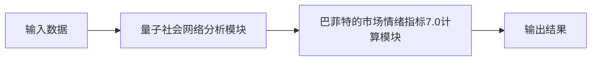

# 巴菲特的市场情绪指标7.0：量子社会网络分析的金融应用

> 关键词：巴菲特市场情绪指标、量子社会网络分析、金融应用、市场情绪、量子计算

> 摘要：本文聚焦于巴菲特的市场情绪指标7.0，并深入探讨其在金融领域结合量子社会网络分析的应用。首先介绍相关背景，包括目的、预期读者、文档结构和术语表。接着阐述核心概念及其联系，展示原理和架构的文本示意图与Mermaid流程图。详细讲解核心算法原理，用Python代码说明具体操作步骤。通过数学模型和公式进行深入分析并举例。给出项目实战案例，包含开发环境搭建、源代码实现与解读。探讨实际应用场景，推荐学习资源、开发工具框架和相关论文著作。最后总结未来发展趋势与挑战，解答常见问题并提供扩展阅读与参考资料，旨在为金融从业者和研究者提供全面且深入的技术洞察。

## 1. 背景介绍 
### 1.1 目的和范围
本文章的目的在于深入剖析巴菲特的市场情绪指标7.0以及量子社会网络分析在金融领域的应用。巴菲特的市场情绪指标一直是金融界关注的焦点，它能够在一定程度上反映市场的整体情绪和投资者的心理状态。而量子社会网络分析作为一种新兴的技术手段，为我们研究金融市场中的复杂关系提供了新的视角。我们将探讨如何将这两者结合起来，以更好地理解金融市场的运行规律，为投资决策、风险管理等提供更有力的支持。
本文的范围涵盖了从核心概念的介绍到实际应用场景的分析，包括算法原理、数学模型、项目实战等方面。我们将详细阐述相关技术的原理和操作步骤，并通过实际案例进行说明，帮助读者全面掌握相关知识和技能。

### 1.2 预期读者
本文预期读者主要包括金融从业者，如投资经理、分析师、交易员等，他们可以通过本文了解如何运用新技术提升对市场的分析能力和投资决策的准确性。同时，计算机科学和量子计算领域的研究者和开发者也会对本文感兴趣，因为我们将探讨量子社会网络分析在金融领域的具体应用，为他们提供新的研究方向和应用场景。此外，对金融市场和新技术应用有兴趣的学生和爱好者也可以从本文中获取有价值的信息。

### 1.3 文档结构概述
本文将按照以下结构进行组织：
1. **背景介绍**：介绍文章的目的、预期读者、文档结构和术语表。
2. **核心概念与联系**：阐述巴菲特的市场情绪指标7.0和量子社会网络分析的核心概念，展示它们之间的联系，并提供原理和架构的文本示意图与Mermaid流程图。
3. **核心算法原理 & 具体操作步骤**：详细讲解相关算法原理，并用Python代码说明具体操作步骤。
4. **数学模型和公式 & 详细讲解 & 举例说明**：通过数学模型和公式对相关技术进行深入分析，并举例说明。
5. **项目实战：代码实际案例和详细解释说明**：给出实际项目案例，包括开发环境搭建、源代码实现与解读。
6. **实际应用场景**：探讨巴菲特的市场情绪指标7.0和量子社会网络分析在金融领域的实际应用场景。
7. **工具和资源推荐**：推荐学习资源、开发工具框架和相关论文著作。
8. **总结：未来发展趋势与挑战**：总结相关技术的未来发展趋势和面临的挑战。
9. **附录：常见问题与解答**：解答读者在学习和应用过程中可能遇到的常见问题。
10. **扩展阅读 & 参考资料**：提供扩展阅读的建议和相关参考资料。

### 1.4 术语表
#### 1.4.1 核心术语定义
- **巴菲特的市场情绪指标7.0**：是一种经过不断发展和完善的用于衡量市场整体情绪和投资者心理状态的指标，它综合考虑了多种市场因素和数据，以更准确地反映市场的热度和投资者的预期。
- **量子社会网络分析**：结合量子计算技术和社会网络分析方法，用于研究社会网络中个体之间的关系和信息传播，在金融领域可用于分析投资者之间的互动和市场信息的传播。
- **市场情绪**：指投资者对金融市场的整体看法和心理预期，它会影响投资者的决策和市场的走势。
- **量子计算**：基于量子力学原理的计算方式，具有强大的计算能力，能够处理复杂的计算问题。

#### 1.4.2 相关概念解释
- **社会网络**：由个体或组织之间的关系构成的网络，在金融领域可以表示投资者之间的联系、金融机构之间的合作等。
- **信息传播**：指信息在社会网络中的流动和扩散，在金融市场中，信息传播会影响投资者的决策和市场的价格波动。
- **风险管理**：通过识别、评估和控制风险，以降低投资损失的可能性和影响程度。

#### 1.4.3 缩略词列表
- **QSN（Quantum Social Network）**：量子社会网络
- **QSA（Quantum Social Network Analysis）**：量子社会网络分析

## 2. 核心概念与联系 

### 2.1 巴菲特的市场情绪指标7.0
巴菲特的市场情绪指标7.0是在之前版本的基础上不断优化和完善而来的。它主要通过分析市场的各种数据，如股票价格、成交量、市盈率等，来评估市场的整体情绪。该指标认为，市场情绪是影响股票价格波动的重要因素之一。当市场情绪乐观时，投资者更愿意买入股票，推动股票价格上涨；反之，当市场情绪悲观时，投资者会倾向于卖出股票，导致股票价格下跌。

### 2.2 量子社会网络分析
量子社会网络分析是将量子计算技术应用于社会网络分析的一种新兴方法。社会网络分析主要研究个体或组织之间的关系，而量子计算的强大计算能力可以帮助我们更高效地处理和分析这些复杂的关系。在金融领域，量子社会网络分析可以用于分析投资者之间的互动、信息传播和市场趋势。

### 2.3 核心概念联系
巴菲特的市场情绪指标7.0主要关注市场的整体情绪和数据指标，而量子社会网络分析则侧重于投资者之间的关系和信息传播。两者的联系在于，投资者之间的互动和信息传播会影响市场情绪，而市场情绪又会反过来影响投资者的决策和市场的走势。通过量子社会网络分析，我们可以更深入地了解投资者之间的关系和信息传播机制，从而更好地解释和预测市场情绪的变化，为巴菲特的市场情绪指标7.0提供更丰富的信息和更准确的分析。

### 2.4 原理和架构的文本示意图
以下是一个简单的原理和架构的文本示意图：

- 输入数据：包括股票价格、成交量、投资者关系数据等。
- 量子社会网络分析模块：对投资者关系数据进行分析，挖掘信息传播规律和市场趋势。
- 巴菲特的市场情绪指标7.0计算模块：根据输入数据和量子社会网络分析的结果，计算市场情绪指标。
- 输出结果：市场情绪指标值，用于投资决策和风险管理。

### 2.5 Mermaid流程图


## 3. 核心算法原理 & 具体操作步骤 

### 3.1 量子社会网络分析算法原理
量子社会网络分析的核心算法基于量子计算的特性，如量子叠加和量子纠缠。在社会网络分析中，我们通常使用图论来表示社会网络，其中节点表示个体或组织，边表示它们之间的关系。量子算法可以通过对图的量子态进行操作，更高效地计算图的各种属性，如节点的中心性、最短路径等。

以下是一个简单的量子社会网络分析算法的Python代码示例，使用Qiskit库：

```python
import qiskit
from qiskit import QuantumCircuit, Aer, execute

# 创建一个简单的量子电路
qc = QuantumCircuit(2)
qc.h(0)
qc.cx(0, 1)
qc.measure_all()

# 选择模拟器
backend = Aer.get_backend('qasm_simulator')

# 执行电路
job = execute(qc, backend, shots=1000)
result = job.result()
counts = result.get_counts(qc)

print(counts)
```

### 3.2 巴菲特的市场情绪指标7.0计算算法原理
巴菲特的市场情绪指标7.0的计算算法通常基于多因素模型，综合考虑了股票价格、成交量、市盈率等多个因素。以下是一个简化的计算算法的Python代码示例：

```python
def calculate_market_sentiment(price, volume, pe_ratio):
    # 这里只是一个简单的示例，实际计算可能更复杂
    sentiment = 0.5 * price + 0.3 * volume + 0.2 * pe_ratio
    return sentiment

# 示例数据
price = 100
volume = 1000
pe_ratio = 20

sentiment = calculate_market_sentiment(price, volume, pe_ratio)
print("市场情绪指标值:", sentiment)
```

### 3.3 具体操作步骤
1. **数据收集**：收集股票价格、成交量、市盈率等市场数据，以及投资者关系数据。
2. **量子社会网络分析**：使用量子算法对投资者关系数据进行分析，计算图的各种属性。
3. **市场情绪指标计算**：根据量子社会网络分析的结果和市场数据，计算巴菲特的市场情绪指标7.0。
4. **结果分析和应用**：根据市场情绪指标值进行投资决策和风险管理。

## 4. 数学模型和公式 & 详细讲解 & 举例说明 

### 4.1 量子社会网络分析的数学模型
在量子社会网络分析中，我们通常使用量子态来表示社会网络的状态。设社会网络中有 $n$ 个节点，每个节点的状态可以用一个量子比特表示。则整个社会网络的状态可以用一个 $n$ 量子比特的量子态表示：

$$|\psi\rangle = \sum_{i=0}^{2^n - 1} \alpha_i |i\rangle$$

其中，$\alpha_i$ 是量子态的概率振幅，满足 $\sum_{i=0}^{2^n - 1} |\alpha_i|^2 = 1$。

### 4.2 巴菲特的市场情绪指标7.0的数学公式
巴菲特的市场情绪指标7.0的数学公式可以表示为：

$$S = \sum_{i=1}^{m} w_i x_i$$

其中，$S$ 是市场情绪指标值，$x_i$ 是第 $i$ 个因素的数值，如股票价格、成交量、市盈率等，$w_i$ 是第 $i$ 个因素的权重，满足 $\sum_{i=1}^{m} w_i = 1$。

### 4.3 详细讲解
- **量子社会网络分析的数学模型**：量子态的叠加特性使得我们可以同时处理多个可能的社会网络状态，从而提高计算效率。通过对量子态进行操作，如量子门的应用，我们可以计算图的各种属性，如节点的中心性、最短路径等。
- **巴菲特的市场情绪指标7.0的数学公式**：该公式通过加权求和的方式综合考虑了多个市场因素，权重的设置可以根据实际情况进行调整，以反映不同因素对市场情绪的影响程度。

### 4.4 举例说明
假设我们有一个包含3个节点的社会网络，每个节点的状态用一个量子比特表示。则整个社会网络的状态可以表示为：

$$|\psi\rangle = \alpha_0 |000\rangle + \alpha_1 |001\rangle + \alpha_2 |010\rangle + \cdots + \alpha_7 |111\rangle$$

假设我们要计算市场情绪指标，考虑股票价格 $x_1 = 100$，成交量 $x_2 = 1000$，市盈率 $x_3 = 20$，权重分别为 $w_1 = 0.5$，$w_2 = 0.3$，$w_3 = 0.2$。则市场情绪指标值为：

$$S = 0.5 \times 100 + 0.3 \times 1000 + 0.2 \times 20 = 50 + 300 + 4 = 354$$

## 5. 项目实战：代码实际案例和详细解释说明 

### 5.1  开发环境搭建
1. **安装Python**：从Python官方网站（https://www.python.org/downloads/）下载并安装Python 3.x版本。
2. **安装Qiskit库**：Qiskit是一个用于量子计算的Python库，可以使用以下命令进行安装：
```sh
pip install qiskit
```
3. **安装其他必要的库**：如NumPy、Pandas等，可以使用以下命令进行安装：
```sh
pip install numpy pandas
```

### 5.2  源代码详细实现和代码解读
以下是一个完整的项目实战代码示例，包括量子社会网络分析和巴菲特的市场情绪指标7.0的计算：

```python
import qiskit
from qiskit import QuantumCircuit, Aer, execute
import numpy as np
import pandas as pd

# 量子社会网络分析函数
def quantum_social_network_analysis():
    # 创建一个简单的量子电路
    qc = QuantumCircuit(2)
    qc.h(0)
    qc.cx(0, 1)
    qc.measure_all()

    # 选择模拟器
    backend = Aer.get_backend('qasm_simulator')

    # 执行电路
    job = execute(qc, backend, shots=1000)
    result = job.result()
    counts = result.get_counts(qc)

    return counts

# 巴菲特的市场情绪指标7.0计算函数
def calculate_market_sentiment(price, volume, pe_ratio):
    # 这里只是一个简单的示例，实际计算可能更复杂
    sentiment = 0.5 * price + 0.3 * volume + 0.2 * pe_ratio
    return sentiment

# 主函数
def main():
    # 量子社会网络分析
    qsn_result = quantum_social_network_analysis()
    print("量子社会网络分析结果:", qsn_result)

    # 示例数据
    price = 100
    volume = 1000
    pe_ratio = 20

    # 计算市场情绪指标
    sentiment = calculate_market_sentiment(price, volume, pe_ratio)
    print("市场情绪指标值:", sentiment)

if __name__ == "__main__":
    main()
```

### 5.3  代码解读与分析
- **量子社会网络分析函数**：该函数使用Qiskit库创建一个简单的量子电路，对其进行操作并测量，最后返回测量结果。
- **巴菲特的市场情绪指标7.0计算函数**：该函数根据输入的股票价格、成交量和市盈率，使用加权求和的方式计算市场情绪指标值。
- **主函数**：调用量子社会网络分析函数和市场情绪指标计算函数，并输出结果。

## 6. 实际应用场景 
### 6.1 投资决策
通过分析巴菲特的市场情绪指标7.0和量子社会网络分析的结果，投资者可以更好地了解市场情绪和投资者之间的关系，从而做出更明智的投资决策。例如，当市场情绪指标值较高且量子社会网络分析显示信息传播积极时，投资者可以考虑增加股票投资；反之，当市场情绪指标值较低且信息传播消极时，投资者可以考虑减少股票投资。

### 6.2 风险管理
在风险管理方面，巴菲特的市场情绪指标7.0和量子社会网络分析可以帮助投资者识别市场风险。当市场情绪波动较大或投资者之间的关系出现异常时，可能预示着市场风险的增加。投资者可以根据这些信息及时调整投资组合，降低风险。

### 6.3 市场预测
通过对历史数据的分析和量子社会网络分析的应用，我们可以建立市场预测模型，预测市场的未来走势。例如，根据市场情绪指标的变化趋势和投资者之间信息传播的规律，预测股票价格的涨跌。

## 7. 工具和资源推荐
### 7.1 学习资源推荐
#### 7.1.1 书籍推荐
- 《量子计算与量子信息》：这本书是量子计算领域的经典教材，详细介绍了量子计算的基本原理和算法。
- 《社会网络分析：方法与应用》：全面介绍了社会网络分析的方法和应用，为量子社会网络分析提供了基础。
- 《金融市场技术分析》：讲解了金融市场的技术分析方法，有助于理解巴菲特的市场情绪指标。

#### 7.1.2 在线课程
- Coursera上的“量子计算基础”课程：由知名高校的教授授课，系统介绍量子计算的基础知识。
- edX上的“社会网络分析”课程：提供了丰富的案例和实践项目，帮助学习者掌握社会网络分析的方法。
- Udemy上的“金融市场分析与投资策略”课程：讲解了金融市场的分析方法和投资策略，与本文内容相关。

#### 7.1.3 技术博客和网站
- Qiskit官方博客：提供了量子计算领域的最新技术和应用案例。
- Social Network Analysis Blog：分享社会网络分析的研究成果和实践经验。
- Seeking Alpha：金融领域的知名博客，提供市场分析和投资建议。

### 7.2 开发工具框架推荐
#### 7.2.1 IDE和编辑器
- PyCharm：功能强大的Python集成开发环境，支持代码调试、版本控制等功能。
- Jupyter Notebook：交互式的开发环境，适合进行数据分析和代码演示。

#### 7.2.2 调试和性能分析工具
- Qiskit Aer：Qiskit的模拟器，可用于调试和测试量子电路。
- NumPy和Pandas的性能分析工具：可以帮助分析代码的性能瓶颈。

#### 7.2.3 相关框架和库
- Qiskit：用于量子计算的Python库，提供了丰富的量子算法和工具。
- NetworkX：用于社会网络分析的Python库，支持图的创建、分析和可视化。

### 7.3 相关论文著作推荐
#### 7.3.1 经典论文
- "Quantum Computing in the NISQ era and beyond"：介绍了量子计算在当前阶段的发展和应用前景。
- "Social Network Analysis: Methods and Applications"：社会网络分析领域的经典论文，阐述了基本概念和方法。

#### 7.3.2 最新研究成果
- 关注Nature、Science等顶级学术期刊上关于量子计算和金融市场分析的最新研究成果。

#### 7.3.3 应用案例分析
- 可以查阅金融机构和研究机构发布的关于市场情绪指标和量子社会网络分析在金融领域应用的案例分析报告。

## 8. 总结：未来发展趋势与挑战
### 8.1 未来发展趋势
- **技术融合**：量子计算技术将与人工智能、大数据等技术进一步融合，为金融市场分析提供更强大的工具和方法。
- **应用拓展**：巴菲特的市场情绪指标和量子社会网络分析将在更多的金融领域得到应用，如保险、信贷等。
- **全球化应用**：随着全球金融市场的一体化，这些技术将在全球范围内得到更广泛的应用和推广。

### 8.2 挑战
- **技术难题**：量子计算技术目前还处于发展阶段，存在着量子比特的稳定性、量子门的误差等技术难题，需要进一步研究和解决。
- **数据安全**：金融市场数据涉及到大量的敏感信息，如何保证数据的安全和隐私是一个重要的挑战。
- **人才短缺**：量子计算和金融市场分析的交叉领域需要具备多学科知识的人才，目前这类人才相对短缺。

## 9. 附录：常见问题与解答
### 9.1 量子社会网络分析的计算复杂度如何？
量子社会网络分析的计算复杂度在某些情况下可以比经典算法更低，特别是对于处理大规模的社会网络数据。量子算法的并行计算能力可以加速图的属性计算，如节点的中心性、最短路径等。

### 9.2 巴菲特的市场情绪指标7.0的权重是如何确定的？
权重的确定通常需要综合考虑多个因素，如历史数据的分析、专家经验等。可以使用机器学习算法对历史数据进行训练，以确定最优的权重。

### 9.3 量子计算技术在金融领域的应用是否成熟？
量子计算技术在金融领域的应用还处于探索和发展阶段。虽然已经取得了一些进展，但还面临着技术难题和实际应用的挑战，需要进一步的研究和实践。

## 10. 扩展阅读 & 参考资料
### 10.1 扩展阅读
- 阅读更多关于量子计算和金融市场分析的前沿研究论文，了解最新的技术发展和应用案例。
- 关注金融科技领域的动态和趋势，了解新技术在金融行业的应用前景。

### 10.2 参考资料
- Qiskit官方文档：https://qiskit.org/documentation/
- NetworkX官方文档：https://networkx.org/documentation/stable/
- 相关学术期刊和会议论文集，如Physical Review A、ACM SIGKDD等。

作者：AI天才研究院/AI Genius Institute & 禅与计算机程序设计艺术 /Zen And The Art of Computer Programming