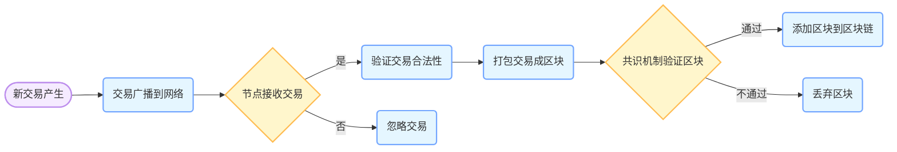

# 巴菲特的市场情绪指标：区块链技术在金融市场的应用

> 关键词：巴菲特市场情绪指标、区块链技术、金融市场、分布式账本、智能合约

> 摘要：本文聚焦于巴菲特的市场情绪指标与区块链技术在金融市场的应用。首先介绍了相关背景知识，包括目的、预期读者、文档结构和术语表。接着阐述了核心概念与联系，展示了区块链与金融市场相关的原理和架构示意图。详细讲解了核心算法原理及具体操作步骤，通过Python代码进行阐述。深入探讨了数学模型和公式，并举例说明。在项目实战部分，给出了开发环境搭建、源代码实现及解读。还探讨了实际应用场景，推荐了相关工具和资源。最后总结了未来发展趋势与挑战，提供了常见问题解答和扩展阅读参考资料。旨在全面剖析区块链技术如何结合巴菲特市场情绪指标在金融市场中发挥重要作用。

## 1. 背景介绍 
### 1.1 目的和范围
本文章的目的在于深入探讨巴菲特的市场情绪指标与区块链技术在金融市场的应用，旨在揭示两者结合所带来的创新机遇和潜在价值。通过对相关概念、算法、数学模型、实际案例等多方面的研究，为读者提供全面且深入的理解。范围涵盖了区块链技术的基本原理、在金融市场不同领域的应用场景，以及巴菲特市场情绪指标的内涵和作用，并分析两者结合的可能性和优势。

### 1.2 预期读者
预期读者包括金融领域的从业者，如银行家、投资经理、交易员等，他们可以从文章中了解区块链技术对金融业务的影响以及如何结合市场情绪指标进行决策。计算机领域的开发者和研究人员可以学习到区块链技术在金融场景中的具体实现和应用。同时，对金融科技感兴趣的学生和爱好者也能通过本文获得相关知识，拓宽视野。

### 1.3 文档结构概述
本文首先介绍背景知识，包括目的、读者和文档结构等。然后阐述核心概念与联系，展示相关原理和架构。接着讲解核心算法原理和具体操作步骤，给出数学模型和公式。通过项目实战展示代码案例和详细解释。探讨实际应用场景，推荐相关工具和资源。最后总结未来发展趋势与挑战，提供常见问题解答和扩展阅读参考资料。

### 1.4 术语表
#### 1.4.1 核心术语定义
- **巴菲特市场情绪指标**：是基于巴菲特的投资理念和对市场的观察所形成的一种衡量市场情绪的指标，用于判断市场的乐观或悲观程度，辅助投资决策。
- **区块链技术**：是一种分布式账本技术，通过去中心化、不可篡改、共识机制等特点，实现数据的安全存储和可信传输。
- **分布式账本**：是一种在多个节点之间共享、复制和同步的数据库，每个节点都保存着完整的账本信息，确保数据的一致性和可靠性。
- **智能合约**：是一种以代码形式编写的合约，当满足预设条件时，自动执行合约条款，实现自动化的交易和结算。

#### 1.4.2 相关概念解释
- **去中心化**：区块链网络中不存在单一的中心化机构，所有节点地位平等，共同维护网络的运行和数据的安全。
- **共识机制**：是区块链网络中节点达成一致的算法，确保所有节点对账本的状态和交易记录达成共识，常见的共识机制有工作量证明（PoW）、权益证明（PoS）等。
- **哈希函数**：是一种将任意长度的输入转换为固定长度输出的函数，具有不可逆性和唯一性，常用于区块链中的数据验证和加密。

#### 1.4.3 缩略词列表
- **PoW**：Proof of Work，工作量证明
- **PoS**：Proof of Stake，权益证明
- **DApp**：Decentralized Application，去中心化应用

## 2. 核心概念与联系 

### 区块链技术原理
区块链技术的核心是分布式账本，它由多个区块组成，每个区块包含一定数量的交易记录。区块通过哈希指针连接成链，形成一个不可篡改的账本。区块链网络中的节点通过共识机制达成一致，确保账本的一致性和可靠性。

以下是区块链技术原理的文本示意图：

区块链网络由多个节点组成，每个节点都有一个完整的账本副本。新的交易记录会被打包成区块，节点通过共识机制对区块进行验证和确认。一旦区块被确认，就会被添加到区块链中，成为账本的一部分。

### Mermaid 流程图


### 巴菲特市场情绪指标与区块链技术的联系
巴菲特市场情绪指标主要关注市场参与者的情绪和心理状态，而区块链技术的特点可以为获取和分析市场情绪提供更可靠的数据和方法。例如，区块链的分布式账本可以记录市场交易的详细信息，这些信息可以反映市场参与者的行为和决策，从而辅助判断市场情绪。同时，智能合约可以根据市场情绪指标自动执行相关的交易策略，实现更高效的投资决策。

## 3. 核心算法原理 & 具体操作步骤 

### 区块链核心算法原理 - 工作量证明（PoW）
工作量证明是一种常见的区块链共识机制，其核心思想是通过计算复杂的哈希函数来证明节点在网络中做了一定的工作量。具体步骤如下：
1. 节点接收到新的交易记录后，将其打包成一个区块。
2. 节点在区块中添加一个随机数（nonce），并计算该区块的哈希值。
3. 节点不断尝试不同的随机数，直到计算出的哈希值满足一定的难度要求。
4. 当节点找到满足条件的哈希值后，将该区块广播到网络中。
5. 其他节点验证该区块的哈希值是否满足难度要求，如果满足则接受该区块，并将其添加到区块链中。

### Python 代码实现
```python
import hashlib
import time

class Block:
    def __init__(self, index, previous_hash, transactions):
        self.index = index
        self.previous_hash = previous_hash
        self.transactions = transactions
        self.timestamp = time.time()
        self.nonce = 0
        self.hash = self.calculate_hash()

    def calculate_hash(self):
        block_string = f"{self.index}{self.previous_hash}{self.transactions}{self.timestamp}{self.nonce}"
        return hashlib.sha256(block_string.encode()).hexdigest()

    def mine_block(self, difficulty):
        target = "0" * difficulty
        while self.hash[:difficulty] != target:
            self.nonce += 1
            self.hash = self.calculate_hash()
        print(f"Block mined: {self.hash}")

class Blockchain:
    def __init__(self):
        self.chain = [self.create_genesis_block()]
        self.difficulty = 2

    def create_genesis_block(self):
        return Block(0, "0", [])

    def get_latest_block(self):
        return self.chain[-1]

    def add_block(self, new_block):
        new_block.previous_hash = self.get_latest_block().hash
        new_block.mine_block(self.difficulty)
        self.chain.append(new_block)

# 示例使用
blockchain = Blockchain()
block1 = Block(1, "", ["Transaction 1", "Transaction 2"])
blockchain.add_block(block1)
block2 = Block(2, "", ["Transaction 3", "Transaction 4"])
blockchain.add_block(block2)
```

### 具体操作步骤
1. **初始化区块链**：创建一个区块链对象，并生成创世区块。
2. **创建新的区块**：根据交易记录创建新的区块，并设置其索引、前一个区块的哈希值等信息。
3. **挖矿**：调用 `mine_block` 方法，不断尝试不同的随机数，直到找到满足难度要求的哈希值。
4. **添加区块到区块链**：将挖矿成功的区块添加到区块链中。

## 4. 数学模型和公式 & 详细讲解 & 举例说明 

### 哈希函数数学模型
哈希函数是区块链技术中的重要组成部分，其数学模型可以表示为：
$$H: M \to \{0, 1\}^n$$
其中，$H$ 表示哈希函数，$M$ 表示输入的消息，$\{0, 1\}^n$ 表示固定长度的二进制输出。哈希函数具有以下特性：
- **确定性**：对于相同的输入，哈希函数总是产生相同的输出。
- **快速计算**：哈希函数的计算速度应该足够快，以确保高效的处理。
- **抗碰撞性**：很难找到两个不同的输入 $M_1$ 和 $M_2$，使得 $H(M_1) = H(M_2)$。

### 工作量证明难度调整公式
工作量证明的难度调整公式可以根据网络的计算能力和出块时间进行动态调整。一种简单的难度调整公式为：
$$D_{new} = D_{old} \times \frac{T_{target}}{T_{actual}}$$
其中，$D_{new}$ 表示新的难度，$D_{old}$ 表示旧的难度，$T_{target}$ 表示目标出块时间，$T_{actual}$ 表示实际出块时间。

### 举例说明
假设初始难度 $D_{old} = 2$，目标出块时间 $T_{target} = 10$ 分钟，实际出块时间 $T_{actual} = 5$ 分钟。根据难度调整公式，新的难度为：
$$D_{new} = 2 \times \frac{10}{5} = 4$$
这意味着下一个区块的挖矿难度将增加，需要找到满足更严格哈希值要求的随机数。

## 5. 项目实战：代码实际案例和详细解释说明 

### 5.1  开发环境搭建
- **安装 Python**：确保系统中安装了 Python 3.x 版本。
- **安装相关库**：在命令行中执行以下命令安装 `hashlib` 库（Python 标准库，一般无需额外安装）。

### 5.2  源代码详细实现和代码解读
以下是一个简单的区块链项目示例，包含区块链和区块的基本实现：

```python
import hashlib
import time

class Block:
    def __init__(self, index, previous_hash, transactions):
        # 区块索引
        self.index = index
        # 前一个区块的哈希值
        self.previous_hash = previous_hash
        # 交易记录
        self.transactions = transactions
        # 时间戳
        self.timestamp = time.time()
        # 随机数
        self.nonce = 0
        # 计算当前区块的哈希值
        self.hash = self.calculate_hash()

    def calculate_hash(self):
        # 将区块的各个属性拼接成字符串
        block_string = f"{self.index}{self.previous_hash}{self.transactions}{self.timestamp}{self.nonce}"
        # 使用 SHA-256 哈希函数计算哈希值
        return hashlib.sha256(block_string.encode()).hexdigest()

    def mine_block(self, difficulty):
        # 目标哈希值前缀，难度越高，前缀 0 的数量越多
        target = "0" * difficulty
        # 不断尝试不同的随机数，直到找到满足难度要求的哈希值
        while self.hash[:difficulty] != target:
            self.nonce += 1
            self.hash = self.calculate_hash()
        print(f"Block mined: {self.hash}")

class Blockchain:
    def __init__(self):
        # 初始化区块链，创建创世区块
        self.chain = [self.create_genesis_block()]
        # 挖矿难度
        self.difficulty = 2

    def create_genesis_block(self):
        # 创建创世区块，索引为 0，前一个哈希值为 "0"，无交易记录
        return Block(0, "0", [])

    def get_latest_block(self):
        # 获取区块链中最新的区块
        return self.chain[-1]

    def add_block(self, new_block):
        # 设置新区块的前一个哈希值为最新区块的哈希值
        new_block.previous_hash = self.get_latest_block().hash
        # 挖矿
        new_block.mine_block(self.difficulty)
        # 将挖矿成功的区块添加到区块链中
        self.chain.append(new_block)

# 示例使用
blockchain = Blockchain()
block1 = Block(1, "", ["Transaction 1", "Transaction 2"])
blockchain.add_block(block1)
block2 = Block(2, "", ["Transaction 3", "Transaction 4"])
blockchain.add_block(block2)
```

### 5.3  代码解读与分析
- **Block 类**：表示区块链中的一个区块，包含区块的基本属性和方法。`__init__` 方法用于初始化区块的各个属性，`calculate_hash` 方法用于计算区块的哈希值，`mine_block` 方法用于挖矿，不断尝试不同的随机数，直到找到满足难度要求的哈希值。
- **Blockchain 类**：表示区块链，包含区块链的基本属性和方法。`__init__` 方法用于初始化区块链，创建创世区块，`create_genesis_block` 方法用于创建创世区块，`get_latest_block` 方法用于获取区块链中最新的区块，`add_block` 方法用于添加新的区块到区块链中。
- **示例使用**：创建一个区块链对象，添加两个新的区块到区块链中，演示了区块链的基本操作流程。

## 6. 实际应用场景 

### 证券交易
区块链技术可以实现证券交易的自动化和透明化。通过智能合约，可以自动执行交易条款，实现实时结算，减少中间环节和交易成本。同时，分布式账本可以记录所有的交易信息，确保交易的透明度和可追溯性，提高市场的公信力。

### 跨境支付
跨境支付通常面临着手续繁琐、费用高、到账时间长等问题。区块链技术可以实现跨境支付的快速、安全和低成本。通过分布式账本，交易信息可以在全球范围内实时共享，减少了中间机构的参与，提高了支付效率。

### 供应链金融
在供应链金融中，区块链技术可以实现供应链上各参与方之间的信息共享和信任传递。通过记录供应链上的交易信息和物流信息，可以为金融机构提供更准确的风险评估依据，降低融资成本，提高供应链的效率。

### 保险业务
区块链技术可以应用于保险业务的多个环节，如保险产品设计、风险评估、理赔处理等。通过智能合约，可以实现保险条款的自动执行，提高理赔效率，减少欺诈行为。同时，分布式账本可以记录保险业务的所有信息，确保信息的真实性和完整性。

## 7. 工具和资源推荐
### 7.1 学习资源推荐
#### 7.1.1 书籍推荐
- 《区块链：技术驱动金融》：全面介绍了区块链技术的原理、应用和发展趋势。
- 《精通以太坊》：深入讲解了以太坊的技术细节和智能合约开发。

#### 7.1.2 在线课程
- Coursera 上的“区块链基础”课程：由知名教授授课，系统介绍区块链的基本概念和技术。
- edX 上的“区块链与数字货币”课程：涵盖了区块链技术在金融领域的应用和数字货币的相关知识。

#### 7.1.3 技术博客和网站
- 区块链技术中文社区：提供了丰富的区块链技术文章和论坛交流平台。
- CoinDesk：专注于区块链和数字货币的新闻和分析网站。

### 7.2 开发工具框架推荐
#### 7.2.1 IDE和编辑器
- Visual Studio Code：功能强大的代码编辑器，支持多种编程语言和插件扩展。
- PyCharm：专业的 Python 开发 IDE，提供了丰富的调试和代码分析工具。

#### 7.2.2 调试和性能分析工具
- Ganache：以太坊开发的本地测试网络，用于调试和测试智能合约。
- Remix：基于浏览器的以太坊智能合约开发和调试工具。

#### 7.2.3 相关框架和库
- web3.py：Python 语言的以太坊开发库，用于与以太坊网络进行交互。
- Truffle：以太坊智能合约开发框架，提供了项目管理、编译、部署等功能。

### 7.3 相关论文著作推荐
#### 7.3.1 经典论文
- “Bitcoin: A Peer-to-Peer Electronic Cash System”：比特币的白皮书，奠定了区块链技术的基础。
- “Ethereum: A Next-Generation Smart Contract and Decentralized Application Platform”：以太坊的白皮书，介绍了以太坊的技术架构和应用场景。

#### 7.3.2 最新研究成果
- 关注顶级学术会议和期刊，如 IEEE Transactions on Computers、ACM SIGCOMM 等，获取区块链技术的最新研究成果。

#### 7.3.3 应用案例分析
- 分析国内外知名企业的区块链应用案例，如摩根大通的 Quorum 区块链平台、蚂蚁金服的区块链应用等，了解区块链技术在实际业务中的应用和效果。

## 8. 总结：未来发展趋势与挑战
### 未来发展趋势
- **广泛应用**：区块链技术将在金融市场及其他领域得到更广泛的应用，如医疗、教育、政务等，推动各行业的数字化转型。
- **与其他技术融合**：区块链技术将与人工智能、大数据、物联网等技术深度融合，创造出更具创新性的应用场景。
- **监管完善**：随着区块链技术的发展，监管政策将逐渐完善，为区块链技术的健康发展提供保障。

### 挑战
- **技术性能**：区块链技术目前还存在性能瓶颈，如交易处理速度慢、吞吐量低等问题，需要进一步优化和改进。
- **安全风险**：区块链技术面临着多种安全风险，如黑客攻击、智能合约漏洞等，需要加强安全防护措施。
- **法律和监管**：区块链技术的发展给法律和监管带来了新的挑战，需要建立相应的法律和监管框架，确保其合法合规发展。

## 9. 附录：常见问题与解答
### 区块链技术是否安全？
区块链技术具有多种安全机制，如加密算法、共识机制、分布式账本等，能够有效保障数据的安全性和完整性。但区块链技术也面临着一些安全风险，如黑客攻击、智能合约漏洞等，需要加强安全防护措施。

### 区块链技术的性能如何？
目前区块链技术的性能还存在一定的瓶颈，如交易处理速度慢、吞吐量低等问题。但随着技术的不断发展和优化，区块链技术的性能将得到逐步提升。

### 区块链技术与传统金融技术有何不同？
区块链技术具有去中心化、不可篡改、共识机制等特点，与传统金融技术相比，能够实现更高效、透明、安全的交易和结算。同时，区块链技术还可以降低中间环节的成本，提高金融市场的效率。

## 10. 扩展阅读 & 参考资料
- Nakamoto, S. (2008). Bitcoin: A Peer-to-Peer Electronic Cash System.
- Buterin, V. (2013). Ethereum: A Next-Generation Smart Contract and Decentralized Application Platform.
- Antonopoulos, A. M. (2014). Mastering Bitcoin: Unlocking Digital Cryptocurrencies.
- Wood, G. (2014). Ethereum: A Secure Decentralised Generalised Transaction Ledger.

作者：AI天才研究院/AI Genius Institute & 禅与计算机程序设计艺术 /Zen And The Art of Computer Programming