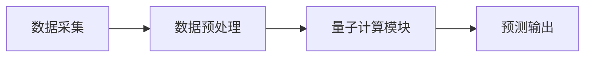

# 巴菲特的市场情绪指标：量子计算驱动的情绪预测模型

> 关键词：巴菲特市场情绪指标、量子计算、情绪预测模型、金融市场、数据分析

> 摘要：本文聚焦于将巴菲特的市场情绪指标与量子计算相结合，构建情绪预测模型。详细介绍了相关核心概念，深入剖析了模型的算法原理与操作步骤，通过数学模型和公式进行理论阐释，并给出实际案例加以说明。同时探讨了该模型在金融市场的实际应用场景，推荐了相关的学习资源、开发工具和研究论文。最后对未来发展趋势与挑战进行总结，并提供常见问题解答和扩展阅读参考资料，旨在为金融市场的情绪预测提供新的思路和方法。

## 1. 背景介绍 
### 1.1 目的和范围
在金融市场中，准确预测市场情绪对于投资者做出明智决策至关重要。巴菲特的市场情绪指标是一种具有广泛影响力的衡量市场整体情绪的方法，但传统计算方式在处理复杂多变的市场数据时存在一定局限性。本研究的目的是引入量子计算技术，构建更为精准高效的情绪预测模型，以提高市场情绪预测的准确性和及时性。本研究的范围涵盖了从核心概念的阐述、算法原理的推导、实际案例的分析，到该模型在金融市场不同场景下的应用探讨。

### 1.2 预期读者
本文预期读者包括金融领域的投资者、分析师、量化交易员，计算机科学领域对量子计算和数据分析感兴趣的研究人员和开发者，以及对金融市场情绪预测有深入学习需求的学生和专业人士。

### 1.3 文档结构概述
本文首先介绍相关的核心概念及其联系，包括巴菲特市场情绪指标和量子计算的基本原理和架构。接着详细阐述核心算法原理和具体操作步骤，并给出Python源代码示例。然后通过数学模型和公式对模型进行理论解释，并举例说明。之后展示项目实战部分，包括开发环境搭建、源代码实现和代码解读。再探讨该模型在实际金融市场中的应用场景。随后推荐相关的学习资源、开发工具和研究论文。最后总结未来发展趋势与挑战，提供常见问题解答和扩展阅读参考资料。

### 1.4 术语表
#### 1.4.1 核心术语定义
- **巴菲特市场情绪指标**：是基于股票市场总市值与国内生产总值（GDP）的比例关系来衡量市场整体情绪的指标，当该比例过高时，市场可能处于高估状态，投资者情绪较为乐观；反之则可能处于低估状态，投资者情绪较为悲观。
- **量子计算**：是一种基于量子力学原理的计算方式，利用量子比特的叠加和纠缠特性，能够在某些问题上实现比传统计算机指数级的计算速度提升。
- **情绪预测模型**：通过对各种市场数据进行分析和处理，预测市场参与者情绪状态的模型，本研究中是结合巴菲特市场情绪指标和量子计算构建的模型。

#### 1.4.2 相关概念解释
- **量子比特**：是量子计算中的基本信息单位，与传统比特不同，量子比特可以同时处于0和1的叠加态，这使得量子计算机能够同时处理多个计算任务。
- **市场情绪**：反映了市场参与者对市场未来走势的预期和心理状态，包括乐观、悲观、恐慌等不同情绪，会对市场价格产生重要影响。

#### 1.4.3 缩略词列表
- **GDP**：国内生产总值（Gross Domestic Product）
- **QUBIT**：量子比特（Quantum Bit）

## 2. 核心概念与联系 

### 2.1 巴菲特市场情绪指标原理
巴菲特市场情绪指标主要基于股票市场总市值与GDP的比例关系。其基本思想是，股票市场的整体价值应该与宏观经济的规模相匹配。如果股票市场总市值远高于GDP，说明市场可能被高估，投资者情绪过于乐观，存在泡沫风险；反之，如果股票市场总市值远低于GDP，市场可能被低估，投资者情绪较为悲观，存在投资机会。

用公式表示为：
$$巴菲特市场情绪指标 = \frac{股票市场总市值}{GDP}$$

### 2.2 量子计算原理
量子计算基于量子力学的叠加和纠缠特性。量子比特可以同时处于0和1的叠加态，例如一个量子比特可以表示为 $\alpha|0\rangle + \beta|1\rangle$，其中 $\alpha$ 和 $\beta$ 是复数，且满足 $|\alpha|^2 + |\beta|^2 = 1$。通过对多个量子比特进行操作，可以实现并行计算，大大提高计算效率。

### 2.3 量子计算驱动的情绪预测模型架构
该模型的架构主要包括数据采集、数据预处理、量子计算模块和预测输出四个部分。

数据采集部分负责收集股票市场总市值、GDP等相关数据。数据预处理部分对采集到的数据进行清洗、归一化等操作，以便后续处理。量子计算模块利用量子算法对预处理后的数据进行分析和计算，挖掘数据中的潜在模式和规律。预测输出部分根据量子计算的结果，输出市场情绪的预测结果。

以下是该模型架构的Mermaid流程图：


## 3. 核心算法原理 & 具体操作步骤 

### 3.1 算法原理
本模型的核心算法基于量子机器学习中的量子支持向量机（QSVM）。量子支持向量机利用量子比特的叠加和纠缠特性，能够在高维空间中更高效地进行数据分类和回归分析。

具体来说，对于给定的市场数据样本 $\{(x_1, y_1), (x_2, y_2), \cdots, (x_n, y_n)\}$，其中 $x_i$ 是第 $i$ 个样本的特征向量（包含股票市场总市值、GDP等数据），$y_i$ 是对应的市场情绪标签（如乐观、悲观等），量子支持向量机的目标是找到一个最优的超平面，使得不同类别的样本能够被尽可能准确地分开。

### 3.2 具体操作步骤

#### 步骤1：数据采集
使用Python的第三方库 `pandas-datareader` 从金融数据接口（如雅虎财经）采集股票市场总市值和GDP数据。示例代码如下：
```python
import pandas_datareader.data as web
import datetime

# 定义数据采集时间范围
start = datetime.datetime(2010, 1, 1)
end = datetime.datetime(2023, 12, 31)

# 采集股票市场总市值数据（示例，实际中需根据具体数据接口调整）
market_cap_data = web.DataReader('^GSPC', 'yahoo', start, end)

# 采集GDP数据（示例，实际中需根据具体数据源调整）
gdp_data = web.DataReader('GDP', 'fred', start, end)
```

#### 步骤2：数据预处理
对采集到的数据进行清洗、归一化等操作，以提高模型的训练效果。示例代码如下：
```python
import numpy as np
from sklearn.preprocessing import MinMaxScaler

# 合并数据
data = pd.concat([market_cap_data['Close'], gdp_data], axis=1)
data = data.dropna()

# 数据归一化
scaler = MinMaxScaler()
data_scaled = scaler.fit_transform(data)
```

#### 步骤3：量子计算模块
使用量子计算库 `qiskit` 实现量子支持向量机。示例代码如下：
```python
from qiskit import Aer
from qiskit_machine_learning.kernels import QuantumKernel
from qiskit_machine_learning.algorithms import QSVC

# 定义量子核
backend = Aer.get_backend('statevector_simulator')
quantum_kernel = QuantumKernel(feature_map=feature_map, quantum_instance=backend)

# 初始化量子支持向量机
qsvc = QSVC(quantum_kernel=quantum_kernel)

# 训练模型
X = data_scaled[:, :-1]
y = data_scaled[:, -1]
qsvc.fit(X, y)
```

#### 步骤4：预测输出
使用训练好的模型对新的数据进行预测。示例代码如下：
```python
# 准备新的数据
new_data = np.array([[0.5, 0.6]])

# 进行预测
prediction = qsvc.predict(new_data)
print("预测结果:", prediction)
```

## 4. 数学模型和公式 & 详细讲解 & 举例说明 

### 4.1 量子支持向量机的数学模型
量子支持向量机的目标是求解以下优化问题：
$$\min_{\alpha} \frac{1}{2} \sum_{i=1}^{n} \sum_{j=1}^{n} \alpha_i \alpha_j y_i y_j K(x_i, x_j) - \sum_{i=1}^{n} \alpha_i$$
$$s.t. \sum_{i=1}^{n} \alpha_i y_i = 0$$
$$0 \leq \alpha_i \leq C, i = 1, 2, \cdots, n$$

其中，$\alpha_i$ 是拉格朗日乘子，$y_i$ 是样本的标签，$K(x_i, x_j)$ 是量子核函数，$C$ 是惩罚参数。

### 4.2 量子核函数
量子核函数是量子支持向量机的核心，它通过量子电路来计算样本之间的相似度。常见的量子核函数有基于泡利旋转门的核函数。

假设输入的样本 $x_i$ 和 $x_j$ 是 $d$ 维向量，量子核函数的计算过程可以表示为：
$$K(x_i, x_j) = |\langle\psi(x_i)|\psi(x_j)\rangle|^2$$

其中，$|\psi(x_i)\rangle$ 和 $|\psi(x_j)\rangle$ 是通过量子电路将样本 $x_i$ 和 $x_j$ 编码得到的量子态。

### 4.3 举例说明
假设我们有两个二维样本 $x_1 = [0.1, 0.2]$ 和 $x_2 = [0.3, 0.4]$，使用基于泡利旋转门的量子核函数计算它们之间的相似度。

首先，将样本编码到量子态：
$$|\psi(x_1)\rangle = U(x_1)|0\rangle$$
$$|\psi(x_2)\rangle = U(x_2)|0\rangle$$

其中，$U(x)$ 是基于泡利旋转门的量子电路。

然后，计算量子核函数的值：
$$K(x_1, x_2) = |\langle\psi(x_1)|\psi(x_2)\rangle|^2$$

通过具体的量子电路实现和计算，可以得到 $K(x_1, x_2)$ 的值，从而衡量两个样本之间的相似度。

## 5. 项目实战：代码实际案例和详细解释说明 

### 5.1  开发环境搭建
#### 安装Python
首先需要安装Python环境，建议使用Python 3.7及以上版本。可以从Python官方网站（https://www.python.org/downloads/）下载安装包进行安装。

#### 安装必要的库
使用 `pip` 命令安装以下必要的库：
```sh
pip install pandas pandas-datareader numpy scikit-learn qiskit
```

### 5.2  源代码详细实现和代码解读

```python
import pandas_datareader.data as web
import datetime
import numpy as np
from sklearn.preprocessing import MinMaxScaler
from qiskit import Aer
from qiskit_machine_learning.kernels import QuantumKernel
from qiskit_machine_learning.algorithms import QSVC

# 步骤1：数据采集
start = datetime.datetime(2010, 1, 1)
end = datetime.datetime(2023, 12, 31)
market_cap_data = web.DataReader('^GSPC', 'yahoo', start, end)
gdp_data = web.DataReader('GDP', 'fred', start, end)

# 步骤2：数据预处理
data = pd.concat([market_cap_data['Close'], gdp_data], axis=1)
data = data.dropna()
scaler = MinMaxScaler()
data_scaled = scaler.fit_transform(data)

# 步骤3：量子计算模块
backend = Aer.get_backend('statevector_simulator')
feature_map =...  # 定义特征映射
quantum_kernel = QuantumKernel(feature_map=feature_map, quantum_instance=backend)
qsvc = QSVC(quantum_kernel=quantum_kernel)
X = data_scaled[:, :-1]
y = data_scaled[:, -1]
qsvc.fit(X, y)

# 步骤4：预测输出
new_data = np.array([[0.5, 0.6]])
prediction = qsvc.predict(new_data)
print("预测结果:", prediction)
```

### 5.3  代码解读与分析
- **数据采集部分**：使用 `pandas-datareader` 库从雅虎财经和FRED数据库采集股票市场总市值和GDP数据。
- **数据预处理部分**：使用 `pandas` 库合并数据，并使用 `MinMaxScaler` 对数据进行归一化处理，将数据缩放到[0, 1]区间。
- **量子计算模块**：使用 `qiskit` 库定义量子核函数和量子支持向量机，并对模型进行训练。
- **预测输出部分**：使用训练好的模型对新的数据进行预测，并输出预测结果。

## 6. 实际应用场景 
### 6.1 投资者决策支持
投资者可以利用该模型预测市场情绪，从而做出更明智的投资决策。当模型预测市场情绪乐观时，投资者可以适当增加股票投资比例；当模型预测市场情绪悲观时，投资者可以减少股票投资比例，增加现金或债券等安全资产的配置。

### 6.2 量化交易策略制定
量化交易员可以将该模型的预测结果融入到量化交易策略中。例如，当模型预测市场情绪发生转变时，触发相应的交易信号，进行买入或卖出操作，以获取超额收益。

### 6.3 金融机构风险管理
金融机构可以使用该模型监测市场情绪的变化，及时调整风险敞口。当市场情绪过于乐观或悲观时，金融机构可以采取相应的风险控制措施，如增加保证金要求、减少杠杆比例等，以降低潜在的风险。

## 7. 工具和资源推荐
### 7.1 学习资源推荐
#### 7.1.1 书籍推荐
- 《量子计算与量子信息》：全面介绍了量子计算的基本原理、算法和应用，是量子计算领域的经典教材。
- 《金融市场技术分析》：详细讲解了金融市场的技术分析方法和工具，对于理解市场情绪和价格走势有很大帮助。

#### 7.1.2 在线课程
- Coursera上的“Quantum Computing for Everyone”：适合初学者了解量子计算的基本概念和原理。
- edX上的“Financial Markets”：由耶鲁大学教授罗伯特·席勒（Robert Shiller）授课，深入探讨了金融市场的运行机制和投资者行为。

#### 7.1.3 技术博客和网站
- Qiskit官方博客：提供了量子计算领域的最新技术和研究成果。
- Seeking Alpha：是一个金融市场分析和投资建议的网站，有很多关于市场情绪和投资策略的文章。

### 7.2 开发工具框架推荐
#### 7.2.1 IDE和编辑器
- PyCharm：是一款功能强大的Python集成开发环境，提供了代码编辑、调试、版本控制等功能。
- Jupyter Notebook：是一个交互式的开发环境，适合进行数据探索和模型开发。

#### 7.2.2 调试和性能分析工具
- Qiskit的调试工具：可以帮助开发者调试量子电路和算法。
- Python的 `cProfile` 模块：可以对Python代码进行性能分析，找出性能瓶颈。

#### 7.2.3 相关框架和库
- Qiskit：是IBM开发的开源量子计算框架，提供了量子电路设计、模拟和运行的工具。
- PennyLane：是一个跨平台的量子机器学习库，支持多种量子计算后端。

### 7.3 相关论文著作推荐
#### 7.3.1 经典论文
- “Quantum Computing in the NISQ era and beyond”：介绍了量子计算在近期（NISQ时代）和未来的发展趋势和挑战。
- “The Limits of Arbitrage”：探讨了金融市场中套利的局限性，对于理解市场情绪和价格波动有重要意义。

#### 7.3.2 最新研究成果
- 关注arXiv.org上关于量子计算和金融市场的最新研究论文，了解该领域的前沿动态。

#### 7.3.3 应用案例分析
- 一些金融科技公司和研究机构会发布关于量子计算在金融市场应用的案例分析报告，可以从中学习实际应用经验。

## 8. 总结：未来发展趋势与挑战
### 8.1 未来发展趋势
- **量子计算技术的不断进步**：随着量子计算硬件和算法的不断发展，量子计算的计算能力和稳定性将不断提高，为情绪预测模型提供更强大的计算支持。
- **多学科融合**：该领域将与人工智能、机器学习、量子物理等多学科进行更深入的融合，推动模型的不断创新和完善。
- **实际应用的拓展**：该模型将在金融市场的更多领域得到应用，如风险管理、资产定价等，为金融行业带来更多的价值。

### 8.2 挑战
- **量子计算技术的局限性**：目前量子计算技术仍处于发展阶段，存在量子比特的退相干、噪声等问题，影响了量子计算的准确性和可靠性。
- **数据质量和隐私问题**：情绪预测模型需要大量的高质量数据，但金融市场数据存在噪声、缺失值等问题，同时数据隐私保护也是一个重要的挑战。
- **人才短缺**：量子计算和金融市场分析都是专业性很强的领域，目前缺乏既懂量子计算又懂金融市场的复合型人才。

## 9. 附录：常见问题与解答
### 问题1：量子计算在情绪预测模型中的优势是什么？
答：量子计算利用量子比特的叠加和纠缠特性，能够在某些问题上实现比传统计算机指数级的计算速度提升。在情绪预测模型中，量子计算可以更高效地处理复杂的市场数据，挖掘数据中的潜在模式和规律，提高预测的准确性和及时性。

### 问题2：如何评估情绪预测模型的性能？
答：可以使用常见的机器学习评估指标，如准确率、召回率、F1值等，来评估模型的分类性能。对于回归问题，可以使用均方误差（MSE）、均方根误差（RMSE）等指标来评估模型的预测精度。

### 问题3：该模型在实际应用中需要注意什么？
答：在实际应用中，需要注意数据的质量和可靠性，避免使用有噪声或错误的数据。同时，要考虑模型的局限性和不确定性，不能完全依赖模型的预测结果进行决策。此外，还需要关注量子计算技术的发展和变化，及时对模型进行优化和调整。

## 10. 扩展阅读 & 参考资料
### 扩展阅读
- 《量子力学导论》：深入学习量子力学的基本原理和概念，有助于更好地理解量子计算。
- 《行为金融学》：研究投资者的心理和行为对金融市场的影响，与市场情绪预测密切相关。

### 参考资料
- Qiskit官方文档：https://qiskit.org/documentation/
- pandas-datareader官方文档：https://pandas-datareader.readthedocs.io/
- scikit-learn官方文档：https://scikit-learn.org/stable/documentation.html

作者：AI天才研究院/AI Genius Institute & 禅与计算机程序设计艺术 /Zen And The Art of Computer Programming