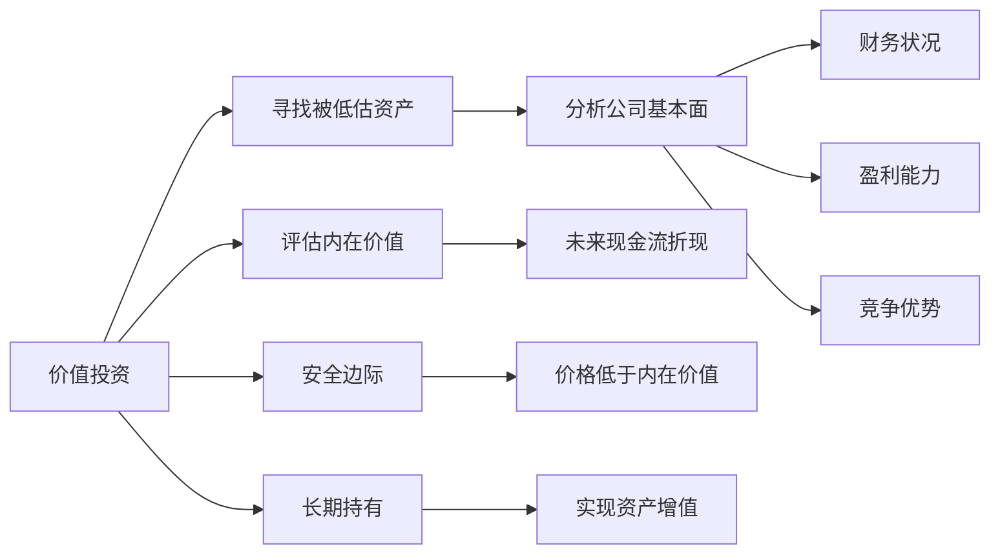

# 巴菲特的年度股东信：价值投资智慧的年度盛宴

> 关键词：巴菲特、年度股东信、价值投资、投资智慧、金融市场

> 摘要：本文围绕巴菲特的年度股东信展开，深入剖析这一投资界年度盛宴所蕴含的价值投资智慧。通过对背景的介绍，让读者了解股东信的重要地位；详细阐述核心概念，明确价值投资的内涵与联系；讲解核心算法原理和操作步骤，以 Python 代码示例呈现投资决策的逻辑；借助数学模型和公式进行量化分析；通过项目实战案例加深对投资策略的理解；探讨其在实际应用场景中的作用；推荐学习所需的工具和资源；最后总结未来发展趋势与挑战，解答常见问题并提供扩展阅读和参考资料，帮助读者全面领悟巴菲特价值投资的精髓。

## 1. 背景介绍 
### 1.1 目的和范围
巴菲特的年度股东信被誉为投资界的“圣经”，每年都会吸引全球投资者的目光。本文章的目的在于深入解读这些股东信中所蕴含的价值投资智慧，帮助投资者更好地理解巴菲特的投资理念和策略。文章的范围涵盖了从股东信的历史发展、核心概念、算法原理、数学模型到实际应用案例等多个方面，旨在为读者提供一个全面而深入的学习视角。

### 1.2 预期读者
本文预期读者包括各类投资者，无论是专业的金融从业者、机构投资者，还是普通的个人投资者，都能从本文中获得有价值的信息和启示。同时，对于对金融投资领域感兴趣的学生、研究人员以及关注商业和经济发展的人士来说，本文也具有一定的参考价值。

### 1.3 文档结构概述
本文将按照以下结构进行组织：首先介绍背景信息，包括目的、预期读者和文档结构概述；接着阐述核心概念与联系，明确价值投资的相关概念和原理；然后讲解核心算法原理和具体操作步骤，通过 Python 代码示例进行详细说明；随后介绍数学模型和公式，并结合实际例子进行讲解；再通过项目实战案例展示价值投资策略的实际应用；探讨实际应用场景；推荐相关的工具和资源；最后总结未来发展趋势与挑战，解答常见问题并提供扩展阅读和参考资料。

### 1.4 术语表
#### 1.4.1 核心术语定义
- **价值投资**：一种投资策略，强调通过分析公司的基本面，如财务状况、盈利能力、竞争优势等，寻找被市场低估的股票，并长期持有以获得投资回报。
- **股东信**：巴菲特每年写给伯克希尔·哈撒韦公司股东的信，信中包含了他对过去一年公司业绩的总结、对市场和经济形势的看法以及对未来投资策略的展望。
- **内在价值**：公司的真实价值，是基于公司的未来现金流折现计算得出的。
- **安全边际**：投资者在购买股票时，为了降低风险，所要求的股票价格低于其内在价值的幅度。

#### 1.4.2 相关概念解释
- **护城河**：指公司具有的可持续竞争优势，能够保护公司的市场份额和盈利能力，使其在市场竞争中脱颖而出。
- **复利效应**：指在投资过程中，通过将投资收益不断再投资，实现资产的持续增长。随着时间的推移，复利效应会使投资收益呈现指数级增长。

#### 1.4.3 缩略词列表
- **BRK**：伯克希尔·哈撒韦公司（Berkshire Hathaway）的股票代码。

## 2. 核心概念与联系 

### 价值投资的核心概念原理
价值投资的核心原理在于寻找被市场低估的资产，并在其价格回归到内在价值时实现盈利。巴菲特认为，股票不仅仅是一张纸，而是代表了公司的一部分所有权。因此，投资者应该关注公司的基本面，包括其财务状况、盈利能力、竞争优势等，以评估公司的内在价值。

### 股东信在价值投资中的作用
巴菲特的年度股东信是价值投资理念的重要传播渠道。通过股东信，巴菲特向股东和投资者分享他的投资经验、对市场和经济形势的看法以及对未来投资策略的展望。股东信不仅是对过去一年投资业绩的总结，更是对价值投资理念的深入阐述和实践案例的分享。

### 核心概念架构的文本示意图
```plaintext
价值投资
|-- 寻找被低估资产
|   |-- 分析公司基本面
|       |-- 财务状况
|       |-- 盈利能力
|       |-- 竞争优势
|-- 评估内在价值
|   |-- 未来现金流折现
|-- 安全边际
|   |-- 价格低于内在价值
|-- 长期持有
|   |-- 实现资产增值
```

### Mermaid 流程图


## 3. 核心算法原理 & 具体操作步骤 

### 未来现金流折现模型原理
未来现金流折现模型（Discounted Cash Flow, DCF）是价值投资中常用的评估公司内在价值的方法。该模型的基本思想是，公司的内在价值等于其未来产生的现金流的现值之和。具体来说，需要预测公司未来每年的现金流，并将其按照一定的折现率折现到当前时刻。

### Python 代码实现
```python
import numpy as np

def dcf_valuation(cash_flows, discount_rate):
    """
    计算未来现金流折现模型的公司内在价值
    :param cash_flows: 未来每年的现金流列表
    :param discount_rate: 折现率
    :return: 公司的内在价值
    """
    n = len(cash_flows)
    present_values = []
    for i in range(n):
        present_value = cash_flows[i] / ((1 + discount_rate) ** (i + 1))
        present_values.append(present_value)
    intrinsic_value = np.sum(present_values)
    return intrinsic_value

# 示例数据
cash_flows = [100, 120, 150, 180, 200]  # 未来五年的现金流
discount_rate = 0.1  # 折现率为 10%

# 计算内在价值
intrinsic_value = dcf_valuation(cash_flows, discount_rate)
print(f"公司的内在价值为: {intrinsic_value}")
```

### 具体操作步骤
1. **预测未来现金流**：对公司未来每年的现金流进行预测。这需要对公司的业务模式、市场前景、竞争状况等进行深入分析。
2. **确定折现率**：折现率反映了投资者对投资回报的要求和对风险的承受能力。一般来说，折现率可以参考市场利率、公司的风险水平等因素来确定。
3. **计算现值**：将预测的未来现金流按照确定的折现率折现到当前时刻，得到每年现金流的现值。
4. **求和得到内在价值**：将每年现金流的现值相加，得到公司的内在价值。

## 4. 数学模型和公式 & 详细讲解 & 举例说明 

### 未来现金流折现模型公式
未来现金流折现模型的数学公式为：
$$
V = \sum_{t=1}^{n} \frac{CF_t}{(1 + r)^t}
$$
其中，$V$ 表示公司的内在价值，$CF_t$ 表示第 $t$ 年的现金流，$r$ 表示折现率，$n$ 表示预测的年数。

### 详细讲解
- **现金流预测**：准确预测未来现金流是该模型的关键。需要考虑公司的历史业绩、行业发展趋势、市场竞争状况等因素。一般来说，可以采用线性增长、指数增长等方法进行预测。
- **折现率选择**：折现率的选择直接影响到内在价值的计算结果。折现率越高，未来现金流的现值越低，公司的内在价值也就越低。折现率的选择需要综合考虑市场利率、公司的风险水平等因素。
- **预测期确定**：预测期的长短也会对内在价值的计算结果产生影响。一般来说，预测期越长，不确定性越大，因此需要谨慎选择预测期。

### 举例说明
假设一家公司未来五年的现金流分别为 100 万元、120 万元、150 万元、180 万元和 200 万元，折现率为 10%。则该公司的内在价值为：
$$
\begin{align*}
V &= \frac{100}{(1 + 0.1)^1} + \frac{120}{(1 + 0.1)^2} + \frac{150}{(1 + 0.1)^3} + \frac{180}{(1 + 0.1)^4} + \frac{200}{(1 + 0.1)^5}\\
&= \frac{100}{1.1} + \frac{120}{1.21} + \frac{150}{1.331} + \frac{180}{1.4641} + \frac{200}{1.61051}\\
&\approx 90.91 + 99.17 + 112.69 + 122.94 + 124.18\\
&= 549.89
\end{align*}
$$
因此，该公司的内在价值约为 549.89 万元。

## 5. 项目实战：代码实际案例和详细解释说明 

### 5.1  开发环境搭建
- **Python 安装**：确保你的计算机上已经安装了 Python 3.x 版本。可以从 Python 官方网站（https://www.python.org/downloads/）下载并安装。
- **安装必要的库**：在命令行中使用以下命令安装必要的库：
```sh
pip install numpy pandas matplotlib
```

### 5.2  源代码详细实现和代码解读
```python
import numpy as np
import pandas as pd
import matplotlib.pyplot as plt

# 模拟公司未来十年的现金流数据
years = np.arange(1, 11)
cash_flows = np.random.randint(50, 200, 10)  # 随机生成现金流数据

# 折现率
discount_rate = 0.1

# 计算每年现金流的现值
present_values = []
for i in range(len(years)):
    present_value = cash_flows[i] / ((1 + discount_rate) ** (i + 1))
    present_values.append(present_value)

# 计算公司的内在价值
intrinsic_value = np.sum(present_values)

# 输出结果
print(f"未来十年的现金流数据: {cash_flows}")
print(f"每年现金流的现值: {present_values}")
print(f"公司的内在价值: {intrinsic_value}")

# 绘制现金流和现值的折线图
plt.figure(figsize=(10, 6))
plt.plot(years, cash_flows, label='Cash Flows')
plt.plot(years, present_values, label='Present Values')
plt.xlabel('Year')
plt.ylabel('Amount')
plt.title('Cash Flows and Present Values')
plt.legend()
plt.grid(True)
plt.show()
```

### 5.3  代码解读与分析
- **数据生成**：使用 `numpy` 库随机生成公司未来十年的现金流数据。
- **现值计算**：通过循环计算每年现金流的现值，并将其存储在 `present_values` 列表中。
- **内在价值计算**：使用 `numpy` 库的 `sum` 函数计算所有现值的总和，得到公司的内在价值。
- **结果输出**：打印未来十年的现金流数据、每年现金流的现值和公司的内在价值。
- **可视化**：使用 `matplotlib` 库绘制现金流和现值的折线图，直观展示数据的变化趋势。

## 6. 实际应用场景 
### 股票投资
在股票投资中，价值投资者可以通过分析公司的基本面和使用未来现金流折现模型等方法，评估股票的内在价值。当股票价格低于其内在价值时，投资者可以考虑买入该股票，并长期持有，等待价格回归到内在价值时实现盈利。

### 企业并购
在企业并购中，收购方可以使用价值投资的方法评估目标企业的内在价值，以确定合理的收购价格。通过对目标企业的财务状况、盈利能力、竞争优势等进行深入分析，收购方可以避免支付过高的价格，从而提高并购的成功率和投资回报率。

### 基金投资
基金经理可以借鉴价值投资的理念，选择具有良好基本面和被市场低估的股票构建投资组合。通过长期持有这些股票，基金可以实现资产的稳定增长，为投资者带来丰厚的回报。

## 7. 工具和资源推荐
### 7.1 学习资源推荐
#### 7.1.1 书籍推荐
- 《聪明的投资者》（The Intelligent Investor）：本杰明·格雷厄姆（Benjamin Graham）著，被誉为价值投资的圣经，详细阐述了价值投资的理念和方法。
- 《巴菲特致股东的信：股份公司教程》（The Essays of Warren Buffett: Lessons for Corporate America）：沃伦·巴菲特（Warren Buffett）著，收集了巴菲特历年写给股东的信，是学习巴菲特投资思想的重要资料。
- 《财务报表分析与证券定价》（Financial Statement Analysis and Security Valuation）：斯蒂芬·H·佩因曼（Stephen H. Penman）著，介绍了如何通过分析财务报表来评估公司的价值。

#### 7.1.2 在线课程
- Coursera 上的“投资学原理”（Principles of Investing）课程：由哥伦比亚大学教授授课，系统介绍了投资学的基本原理和方法。
- edX 上的“价值投资：从入门到精通”（Value Investing: From Beginner to Expert）课程：深入讲解了价值投资的理念、策略和实践技巧。

#### 7.1.3 技术博客和网站
- 雪球网（https://xueqiu.com/）：国内知名的投资社区，提供股票、基金等投资产品的分析和讨论。
- Seeking Alpha（https://seekingalpha.com/）：全球领先的投资研究平台，提供专业的投资分析和评论。

### 7.2 开发工具框架推荐
#### 7.2.1 IDE和编辑器
- PyCharm：一款功能强大的 Python 集成开发环境，提供代码编辑、调试、版本控制等功能。
- Jupyter Notebook：一个交互式的编程环境，适合进行数据分析和可视化。

#### 7.2.2 调试和性能分析工具
- Py-Spy：一个轻量级的 Python 性能分析工具，可以帮助开发者找出代码中的性能瓶颈。
- PDB：Python 自带的调试器，可以帮助开发者调试代码中的错误。

#### 7.2.3 相关框架和库
- Pandas：一个强大的数据分析库，提供数据结构和数据分析工具，方便进行数据处理和分析。
- NumPy：一个用于科学计算的 Python 库，提供高效的多维数组对象和数学函数。
- Matplotlib：一个用于数据可视化的 Python 库，提供各种绘图功能，方便展示数据和分析结果。

### 7.3 相关论文著作推荐
#### 7.3.1 经典论文
- “The Superinvestors of Graham-and-Doddsville”：沃伦·巴菲特著，阐述了价值投资的有效性和长期投资的重要性。
- “Security Analysis”：本杰明·格雷厄姆和戴维·多德（David Dodd）著，是价值投资领域的经典著作，提出了价值投资的基本理论和方法。

#### 7.3.2 最新研究成果
- 可以关注《金融研究》《经济研究》等学术期刊，了解价值投资领域的最新研究成果。

#### 7.3.3 应用案例分析
- 可以参考一些专业的投资研究报告和案例分析书籍，了解价值投资在实际应用中的案例和经验。

## 8. 总结：未来发展趋势与挑战
### 未来发展趋势
- **数字化和智能化**：随着科技的不断发展，价值投资将越来越多地借助数字化和智能化工具进行数据分析和决策。例如，利用人工智能和机器学习算法对公司的基本面和市场数据进行分析，提高投资决策的准确性和效率。
- **全球化**：全球经济的一体化将使得价值投资的范围更加广泛。投资者可以更加容易地投资于全球范围内的优质资产，获取更高的投资回报。
- **社会责任投资**：越来越多的投资者开始关注企业的社会责任和可持续发展。未来，价值投资将更加注重企业的社会和环境绩效，将社会责任纳入投资决策的考虑因素。

### 挑战
- **市场不确定性**：金融市场充满了不确定性，如宏观经济环境的变化、政策调整、突发事件等，这些因素都会对价值投资的决策和收益产生影响。
- **信息不对称**：在投资过程中，投资者可能面临信息不对称的问题，难以获取准确和全面的信息。这可能导致投资者对公司的内在价值评估出现偏差，从而影响投资决策的正确性。
- **竞争加剧**：随着价值投资理念的普及，越来越多的投资者开始采用价值投资策略，市场竞争将越来越激烈。这将增加投资者寻找被低估资产的难度，降低投资回报率。

## 9. 附录：常见问题与解答
### 问题 1：价值投资是否适用于所有市场环境？
价值投资并不适用于所有市场环境。在市场泡沫时期，股票价格普遍高估，很难找到被低估的资产，此时价值投资策略可能会面临挑战。而在市场低迷时期，股票价格普遍低估，价值投资策略更容易发挥作用。

### 问题 2：如何准确预测公司的未来现金流？
准确预测公司的未来现金流是一项具有挑战性的任务。需要对公司的业务模式、市场前景、竞争状况等进行深入分析，同时参考公司的历史业绩和行业发展趋势。可以采用定性分析和定量分析相结合的方法，综合考虑各种因素，提高预测的准确性。

### 问题 3：价值投资需要多长时间才能看到效果？
价值投资是一种长期投资策略，通常需要较长的时间才能看到效果。巴菲特的投资理念强调长期持有，通过复利效应实现资产的增值。一般来说，投资者需要持有股票数年甚至数十年，才能充分享受价值投资带来的回报。

## 10. 扩展阅读 & 参考资料
### 扩展阅读
- 《投资最重要的事》（The Most Important Thing Illuminated）：霍华德·马克斯（Howard Marks）著，分享了投资过程中的重要原则和经验。
- 《穷查理宝典：查理·芒格的智慧箴言录》（Poor Charlie's Almanack: The Wit and Wisdom of Charles T. Munger）：查理·芒格（Charlie Munger）著，介绍了芒格的投资思想和生活智慧。

### 参考资料
- 巴菲特历年的年度股东信，可以在伯克希尔·哈撒韦公司的官方网站（https://www.berkshirehathaway.com/）上查阅。
- 相关的学术论文和研究报告，可以通过学术数据库如知网、万方、Web of Science 等进行检索。

作者：AI天才研究院/AI Genius Institute & 禅与计算机程序设计艺术 /Zen And The Art of Computer Programming