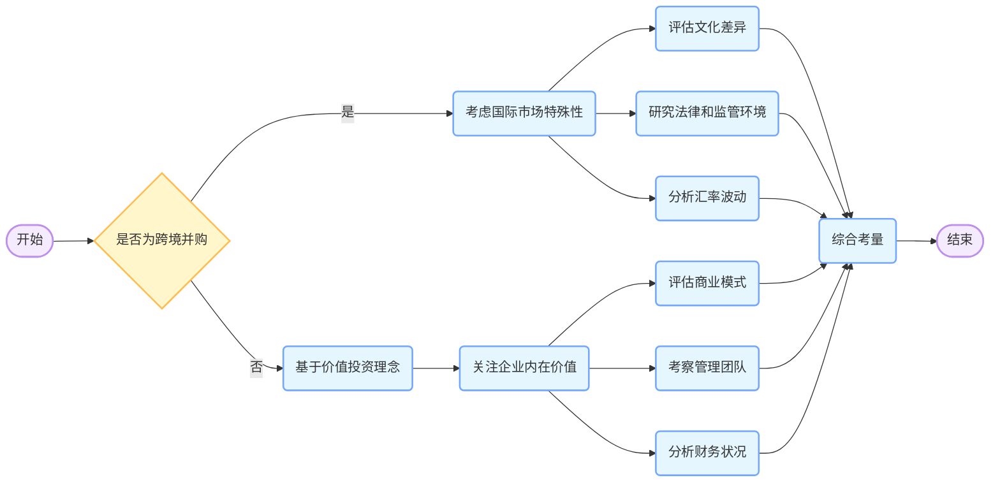

# 巴菲特的并购策略：在跨境并购中的新考量

> 关键词：巴菲特、并购策略、跨境并购、新考量、价值投资

> 摘要：本文深入探讨了巴菲特的并购策略在跨境并购场景下的新考量。首先介绍了背景信息，包括目的范围、预期读者等。接着阐述了核心概念与联系，分析了核心算法原理及操作步骤，用数学模型和公式进行辅助说明。通过项目实战案例展示了相关策略的实际应用，探讨了其在不同场景下的应用情况。还推荐了学习资源、开发工具和相关论文著作。最后总结了未来发展趋势与挑战，提供常见问题解答及扩展阅读参考资料，旨在为读者全面剖析巴菲特跨境并购策略的新特点和应用要点。

## 1. 背景介绍 
### 1.1 目的和范围
本文旨在深入剖析巴菲特的并购策略在跨境并购环境中的新考量因素。通过对巴菲特长期以来所秉持的投资理念和并购实践进行研究，结合跨境并购的特殊背景，揭示在国际市场、不同文化、法律和经济环境下，其并购策略所发生的变化和新的思考维度。范围涵盖巴菲特的经典并购理论、跨境并购的主要特点和挑战，以及如何将两者相结合以适应新的市场形势。

### 1.2 预期读者
本文预期读者包括投资领域的专业人士，如基金经理、投资顾问等，他们可以从本文中获取对巴菲特跨境并购策略的深入理解，为实际投资决策提供参考。同时，企业管理人员，尤其是涉及跨境业务和并购活动的管理者，能够借鉴其中的策略和考量因素，优化企业的并购决策。此外，对投资和金融领域感兴趣的学者和学生也可以通过本文了解相关领域的前沿知识和实践案例。

### 1.3 文档结构概述
本文首先介绍背景信息，让读者了解研究的目的、范围、预期读者和文档结构。接着阐述核心概念与联系，构建起理论框架。然后详细讲解核心算法原理和具体操作步骤，结合数学模型和公式进行深入分析。通过项目实战案例展示策略的实际应用和代码实现。探讨实际应用场景，分析其在不同行业和市场中的适用性。推荐学习资源、开发工具和相关论文著作，为读者提供进一步学习的途径。最后总结未来发展趋势与挑战，解答常见问题，并提供扩展阅读和参考资料。

### 1.4 术语表
#### 1.4.1 核心术语定义
- **并购策略**：指企业或投资者在进行并购活动时所采用的一系列规划和方法，旨在实现特定的战略目标，如扩大市场份额、获取资源、实现协同效应等。
- **跨境并购**：是指涉及不同国家或地区企业之间的并购活动，涉及到国际市场、不同法律和监管环境、文化差异等因素。
- **价值投资**：由巴菲特所倡导的投资理念，强调通过分析企业的内在价值，寻找被低估的股票或企业进行投资，长期持有以获取回报。

#### 1.4.2 相关概念解释
- **协同效应**：在并购中，协同效应是指两个或多个企业合并后所产生的整体效益大于各个企业单独运营时的效益之和。协同效应可以体现在成本节约、收入增加、市场拓展等方面。
- **内在价值**：企业的内在价值是指其未来现金流的现值，是评估企业真实价值的重要指标。巴菲特认为，投资者应该关注企业的内在价值，而不是市场短期波动。

#### 1.4.3 缩略词列表
本文未涉及特定缩略词。

## 2. 核心概念与联系 

### 核心概念原理
巴菲特的并购策略核心基于价值投资理念。他认为，并购的目标应该是具有长期竞争优势和稳定现金流的企业，这些企业的内在价值被市场低估。在跨境并购中，除了考虑企业的内在价值，还需要考虑国际市场的特殊性。

从价值投资角度来看，巴菲特会关注企业的商业模式、管理团队、财务状况等因素。商业模式决定了企业的盈利能力和可持续性，优秀的管理团队能够有效地运营企业，而良好的财务状况则是企业稳定发展的基础。

在跨境并购中，还需要考虑文化差异、法律和监管环境、汇率波动等因素。文化差异可能会影响企业的整合和运营，不同国家的法律和监管环境对并购活动有不同的要求和限制，汇率波动则会影响并购的成本和收益。

### 架构的文本示意图
```plaintext
巴菲特并购策略
|-- 价值投资理念
|   |-- 关注企业内在价值
|       |-- 商业模式
|       |-- 管理团队
|       |-- 财务状况
|-- 跨境并购考量
|   |-- 国际市场特殊性
|       |-- 文化差异
|       |-- 法律和监管环境
|       |-- 汇率波动
```

### Mermaid 流程图


## 3. 核心算法原理 & 具体操作步骤 

### 核心算法原理
在巴菲特的并购策略中，核心算法可以简化为对企业内在价值的评估。内在价值的评估通常基于现金流折现模型（DCF）。该模型的基本思想是，企业的价值等于其未来所有现金流的现值之和。

### Python 代码实现
```python
import numpy as np

def calculate_intrinsic_value(cash_flows, discount_rate):
    """
    计算企业的内在价值
    :param cash_flows: 未来各期的现金流列表
    :param discount_rate: 折现率
    :return: 企业的内在价值
    """
    present_values = []
    for i, cf in enumerate(cash_flows):
        present_value = cf / ((1 + discount_rate) ** (i + 1))
        present_values.append(present_value)
    intrinsic_value = np.sum(present_values)
    return intrinsic_value

# 示例数据
cash_flows = [100, 120, 150, 180, 200]  # 未来五年的现金流
discount_rate = 0.1  # 折现率为 10%

intrinsic_value = calculate_intrinsic_value(cash_flows, discount_rate)
print(f"企业的内在价值为: {intrinsic_value}")
```

### 具体操作步骤
1. **确定未来现金流**：通过对企业的历史财务数据和市场趋势进行分析，预测企业未来各期的现金流。这需要考虑企业的商业模式、市场份额、竞争优势等因素。
2. **选择折现率**：折现率反映了资金的时间价值和投资风险。通常可以使用企业的加权平均资本成本（WACC）作为折现率。WACC 的计算需要考虑企业的股权成本和债务成本。
3. **计算现值**：将未来各期的现金流按照折现率进行折现，得到每期现金流的现值。
4. **求和得到内在价值**：将各期现金流的现值相加，得到企业的内在价值。

在跨境并购中，还需要对上述步骤进行调整。例如，在预测现金流时，需要考虑国际市场的需求和竞争情况；在选择折现率时，需要考虑汇率波动和不同国家的利率水平。

## 4. 数学模型和公式 & 详细讲解 & 举例说明 

### 现金流折现模型（DCF）公式
$$
V = \sum_{t=1}^{n} \frac{CF_t}{(1 + r)^t}
$$
其中：
- $V$ 表示企业的内在价值
- $CF_t$ 表示第 $t$ 期的现金流
- $r$ 表示折现率
- $n$ 表示预测的期数

### 详细讲解
该公式的核心思想是将未来的现金流按照一定的折现率折现到当前时刻，以反映资金的时间价值。随着时间的推移，未来的现金流在当前的价值会逐渐降低，因为资金具有时间价值，现在的资金可以用于投资获取收益。

折现率 $r$ 反映了投资的风险和机会成本。风险越高，折现率就越高，未来现金流的现值就越低。预测的期数 $n$ 通常根据企业的经营情况和市场前景来确定。

### 举例说明
假设一家企业未来五年的现金流分别为 100 万元、120 万元、150 万元、180 万元和 200 万元，折现率为 10%。则该企业的内在价值计算如下：

第 1 期现金流的现值：$PV_1 = \frac{100}{(1 + 0.1)^1} = 90.91$（万元）
第 2 期现金流的现值：$PV_2 = \frac{120}{(1 + 0.1)^2} = 99.17$（万元）
第 3 期现金流的现值：$PV_3 = \frac{150}{(1 + 0.1)^3} = 112.69$（万元）
第 4 期现金流的现值：$PV_4 = \frac{180}{(1 + 0.1)^4} = 122.94$（万元）
第 5 期现金流的现值：$PV_5 = \frac{200}{(1 + 0.1)^5} = 124.18$（万元）

企业的内在价值：$V = PV_1 + PV_2 + PV_3 + PV_4 + PV_5 = 90.91 + 99.17 + 112.69 + 122.94 + 124.18 = 549.89$（万元）

在跨境并购中，由于涉及不同国家的货币和经济环境，需要对现金流和折现率进行相应的调整。例如，如果目标企业位于国外，需要将其现金流按照当前汇率换算成本国货币，同时考虑汇率波动对未来现金流的影响。折现率也需要考虑目标国家的利率水平和市场风险。

## 5. 项目实战：代码实际案例和详细解释说明 

### 5.1  开发环境搭建
- **Python 环境**：建议使用 Python 3.7 及以上版本。可以从 Python 官方网站（https://www.python.org/downloads/）下载并安装。
- **开发工具**：推荐使用 PyCharm 或 Jupyter Notebook。PyCharm 是一款功能强大的 Python 集成开发环境，适合大型项目的开发；Jupyter Notebook 则适合进行交互式的数据分析和代码演示。
- **依赖库**：本项目需要使用 `numpy` 库进行数值计算。可以使用以下命令进行安装：
```sh
pip install numpy
```

### 5.2  源代码详细实现和代码解读
```python
import numpy as np

def calculate_intrinsic_value(cash_flows, discount_rate):
    """
    计算企业的内在价值
    :param cash_flows: 未来各期的现金流列表
    :param discount_rate: 折现率
    :return: 企业的内在价值
    """
    present_values = []
    for i, cf in enumerate(cash_flows):
        # 计算每期现金流的现值
        present_value = cf / ((1 + discount_rate) ** (i + 1))
        present_values.append(present_value)
    # 求和得到企业的内在价值
    intrinsic_value = np.sum(present_values)
    return intrinsic_value

def adjust_cash_flows_for_crossborder(cash_flows, exchange_rates):
    """
    调整跨境并购中的现金流，考虑汇率因素
    :param cash_flows: 未来各期的现金流列表（外币）
    :param exchange_rates: 未来各期的汇率列表（本币/外币）
    :return: 调整后的现金流列表（本币）
    """
    adjusted_cash_flows = []
    for cf, er in zip(cash_flows, exchange_rates):
        # 将外币现金流换算成本币现金流
        adjusted_cf = cf * er
        adjusted_cash_flows.append(adjusted_cf)
    return adjusted_cash_flows

# 示例数据
cash_flows_foreign = [100, 120, 150, 180, 200]  # 未来五年的外币现金流
exchange_rates = [6.5, 6.6, 6.7, 6.8, 6.9]  # 未来五年的汇率（本币/外币）
discount_rate = 0.1  # 折现率为 10%

# 调整现金流
adjusted_cash_flows = adjust_cash_flows_for_crossborder(cash_flows_foreign, exchange_rates)

# 计算内在价值
intrinsic_value = calculate_intrinsic_value(adjusted_cash_flows, discount_rate)
print(f"跨境并购中企业的内在价值为: {intrinsic_value}")
```

### 代码解读与分析
- `calculate_intrinsic_value` 函数：该函数接受未来各期的现金流列表和折现率作为输入，通过循环计算每期现金流的现值，并将其累加到 `present_values` 列表中。最后，使用 `np.sum` 函数将所有现值相加，得到企业的内在价值。
- `adjust_cash_flows_for_crossborder` 函数：该函数接受未来各期的外币现金流列表和汇率列表作为输入，通过循环将每期的外币现金流乘以对应的汇率，得到调整后的本币现金流，并将其添加到 `adjusted_cash_flows` 列表中。
- 主程序部分：首先定义了未来五年的外币现金流列表和汇率列表，以及折现率。然后调用 `adjust_cash_flows_for_crossborder` 函数调整现金流，将外币现金流换算成本币现金流。最后调用 `calculate_intrinsic_value` 函数计算跨境并购中企业的内在价值，并将结果打印输出。

通过这个案例可以看出，在跨境并购中，需要考虑汇率因素对现金流的影响，从而准确评估企业的内在价值。

## 6. 实际应用场景 
### 制造业跨境并购
在制造业领域，巴菲特的并购策略可以帮助企业通过跨境并购获取先进的技术和生产设备，扩大市场份额。例如，一家美国制造企业可能通过并购一家德国的高端制造企业，获得其先进的生产工艺和技术专利，提升自身的产品质量和竞争力。在进行跨境并购时，需要考虑德国的法律和监管环境，以及文化差异对企业整合的影响。同时，通过现金流折现模型评估目标企业的内在价值，确定合理的并购价格。

### 金融服务业跨境并购
金融服务业的跨境并购可以实现资源共享和业务拓展。一家中国的银行可能通过并购一家美国的金融科技公司，获取其先进的金融科技技术和客户资源，拓展国际市场。在这个过程中，需要考虑美国的金融监管政策和文化差异，以及汇率波动对并购成本和收益的影响。通过对目标企业未来现金流的预测和折现，评估其内在价值，为并购决策提供依据。

### 能源行业跨境并购
能源行业的跨境并购可以获取资源和市场。一家俄罗斯的能源企业可能通过并购一家中东的石油公司，获取其丰富的石油资源和销售渠道。在进行跨境并购时，需要考虑中东地区的政治稳定性、法律环境和文化差异。同时，分析国际油价的波动对目标企业现金流的影响，通过现金流折现模型评估其内在价值，制定合理的并购策略。

## 7. 工具和资源推荐
### 7.1 学习资源推荐
#### 7.1.1 书籍推荐
- 《聪明的投资者》（The Intelligent Investor）：本杰明·格雷厄姆（Benjamin Graham）所著，是价值投资领域的经典之作，巴菲特称其为自己投资生涯的启蒙书籍。
- 《巴菲特致股东的信：股份公司教程》（Letters to Shareholders of Berkshire Hathaway）：收录了巴菲特历年致股东的信，详细阐述了他的投资理念和并购策略。
- 《跨境并购：战略、操作与案例》：系统介绍了跨境并购的相关知识和实践案例，对理解跨境并购的流程和要点有很大帮助。

#### 7.1.2 在线课程
- Coursera 平台上的“投资学原理”课程：由知名高校教授授课，涵盖了投资领域的基本原理和方法，包括价值投资和并购策略。
- Udemy 平台上的“跨境并购实战课程”：通过实际案例分析，讲解跨境并购的操作流程和技巧。

#### 7.1.3 技术博客和网站
- Seeking Alpha：提供专业的投资分析和研究报告，涵盖了全球各类投资机会和并购案例。
- Bloomberg：全球知名的财经媒体，提供实时的金融市场信息和跨境并购动态。

### 7.2 开发工具框架推荐
#### 7.2.1 IDE和编辑器
- PyCharm：功能强大的 Python 集成开发环境，提供代码编辑、调试、版本控制等功能，适合开发复杂的投资分析模型。
- Jupyter Notebook：交互式的数据分析工具，支持 Python、R 等多种编程语言，方便进行数据可视化和代码演示。

#### 7.2.2 调试和性能分析工具
- pdb：Python 自带的调试工具，可以帮助开发者定位代码中的问题。
- cProfile：Python 的性能分析工具，可以分析代码的运行时间和资源消耗情况。

#### 7.2.3 相关框架和库
- numpy：用于数值计算和数组操作的 Python 库，在现金流折现模型的计算中非常有用。
- pandas：用于数据处理和分析的 Python 库，可以方便地处理和分析财务数据。

### 7.3 相关论文著作推荐
#### 7.3.1 经典论文
- Jensen, M. C., & Meckling, W. H. (1976). Theory of the firm: Managerial behavior, agency costs and ownership structure. Journal of Financial Economics, 3(4), 305-360. 该论文提出了代理理论，对理解企业并购中的代理问题有重要意义。
- Roll, R. (1986). The hubris hypothesis of corporate takeovers. Journal of Business, 59(2), 197-216. 提出了并购中的傲慢假说，解释了一些并购活动失败的原因。

#### 7.3.2 最新研究成果
- 近年来，关于跨境并购的研究主要集中在文化差异、制度环境和企业绩效等方面。可以通过学术数据库如 EBSCO、JSTOR 等查找相关的最新研究论文。

#### 7.3.3 应用案例分析
- Harvard Business Review 上经常发表一些跨境并购的实际案例分析，通过对这些案例的学习，可以了解不同企业在跨境并购中的策略和经验教训。

## 8. 总结：未来发展趋势与挑战
### 未来发展趋势
- **数字化转型推动跨境并购**：随着全球数字化进程的加速，企业越来越注重数字化技术的应用。未来，跨境并购将更多地围绕数字化转型展开，例如收购具有先进数字技术的企业，以提升自身的竞争力。
- **新兴市场成为并购热点**：新兴市场国家的经济增长迅速，市场潜力巨大。未来，巴菲特等投资者可能会更多地关注新兴市场的并购机会，通过并购获取新兴市场的资源和市场份额。
- **绿色并购兴起**：随着全球对环境保护的重视，绿色产业将迎来发展机遇。未来，跨境并购中可能会出现更多的绿色并购案例，例如收购可再生能源企业、环保技术企业等。

### 挑战
- **政治和政策风险**：不同国家的政治和政策环境存在差异，政治不稳定、政策变化等因素可能会对跨境并购产生不利影响。例如，贸易保护主义政策可能会增加跨境并购的难度和成本。
- **文化整合难题**：文化差异是跨境并购中面临的一大挑战。不同国家和地区的文化差异可能会导致企业在整合过程中出现沟通障碍、管理冲突等问题，影响并购的效果。
- **汇率波动风险**：汇率波动会影响跨境并购的成本和收益。如果汇率波动较大，可能会导致并购成本增加或收益减少，给投资者带来风险。

## 9. 附录：常见问题与解答
### 问题 1：巴菲特的并购策略在跨境并购中是否仍然适用？
解答：巴菲特的价值投资理念在跨境并购中仍然具有重要的指导意义。虽然跨境并购面临着更多的挑战和不确定性，但通过深入分析目标企业的内在价值，结合对国际市场的了解，可以制定出合理的并购策略。不过，在跨境并购中需要考虑更多的因素，如文化差异、法律和监管环境等。

### 问题 2：如何评估跨境并购中的文化差异风险？
解答：可以从以下几个方面评估文化差异风险：
- **价值观差异**：了解不同国家和地区的价值观差异，例如个人主义与集体主义、权力距离等。
- **管理风格差异**：分析目标企业和并购方的管理风格差异，例如决策方式、沟通方式等。
- **员工行为差异**：观察目标企业员工的工作习惯和行为方式，评估文化差异对员工绩效和团队合作的影响。

### 问题 3：在跨境并购中如何应对汇率波动风险？
解答：可以采取以下措施应对汇率波动风险：
- **套期保值**：通过外汇期货、外汇期权等金融工具进行套期保值，锁定汇率，降低汇率波动的影响。
- **多元化投资**：在不同国家和地区进行投资，分散汇率波动风险。
- **合理安排资金**：根据汇率走势，合理安排资金的流入和流出，避免在汇率不利时进行大额资金的兑换。

## 10. 扩展阅读 & 参考资料
### 扩展阅读
- 《并购之王：KKR 的崛起与运营》：介绍了全球知名私募股权投资机构 KKR 的并购策略和运营经验。
- 《门口的野蛮人：RJR纳贝斯克公司的陨落》：讲述了 RJR 纳贝斯克公司的并购故事，深入剖析了并购过程中的各方利益博弈和决策过程。

### 参考资料
- 巴菲特历年致股东的信，可从 Berkshire Hathaway 官方网站获取。
- 各类财经媒体和研究机构发布的跨境并购报告和分析文章。
- 相关学术期刊上发表的关于并购和投资的研究论文。

作者：AI天才研究院/AI Genius Institute & 禅与计算机程序设计艺术 /Zen And The Art of Computer Programming