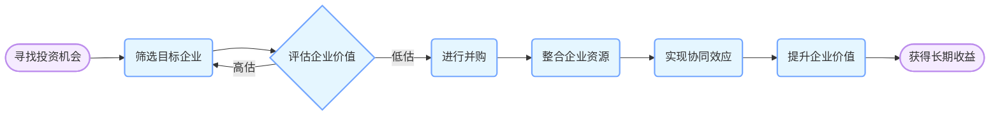

# 巴菲特的并购艺术：在全球化背景下的新策略

> 关键词：巴菲特、并购艺术、全球化背景、新策略、价值投资

> 摘要：本文深入探讨了巴菲特在全球化背景下的并购艺术及新策略。首先介绍了相关背景，包括研究目的、预期读者等内容。接着阐述了巴菲特并购的核心概念与联系，详细讲解了核心算法原理及具体操作步骤，并通过数学模型和公式进行理论支撑。在项目实战部分，给出代码实际案例并详细解读。同时分析了其并购策略的实际应用场景，推荐了相关学习资源、开发工具框架以及论文著作。最后总结了未来发展趋势与挑战，还提供了常见问题解答和扩展阅读参考资料，旨在全面剖析巴菲特在全球化浪潮中的并购智慧。

## 1. 背景介绍 
### 1.1 目的和范围
本研究的目的在于深入剖析巴菲特在全球化背景下的并购艺术及其新策略。全球化使得市场环境更加复杂多变，企业面临着来自全球范围内的竞争与合作机遇。巴菲特作为投资界的传奇人物，其并购策略一直备受关注。我们将研究他如何在全球化的大背景下调整和优化并购策略，以实现企业价值的最大化。研究范围涵盖了巴菲特旗下伯克希尔·哈撒韦公司在全球范围内的并购案例，分析其并购目标的选择、并购时机的把握以及并购后的整合策略等方面。

### 1.2 预期读者
本文预期读者包括投资领域的专业人士，如基金经理、投资分析师等，他们可以从巴菲特的并购策略中获取灵感，优化自己的投资组合。同时，企业管理者也能从中学到如何进行有效的并购决策，提升企业的竞争力。此外，对投资和商业感兴趣的普通读者也可以通过本文了解巴菲特的投资智慧和全球化背景下的商业运作模式。

### 1.3 文档结构概述
本文将按照以下结构展开：首先介绍核心概念与联系，阐述巴菲特并购策略的基本原理和架构；接着详细讲解核心算法原理及具体操作步骤，通过Python代码进行说明；然后给出数学模型和公式，并举例说明；在项目实战部分，提供代码实际案例并进行详细解读；分析实际应用场景，展示巴菲特并购策略在不同行业和地区的应用；推荐相关的学习资源、开发工具框架和论文著作；最后总结未来发展趋势与挑战，解答常见问题，并提供扩展阅读和参考资料。

### 1.4 术语表
#### 1.4.1 核心术语定义
- **并购**：指两家或更多的独立企业、公司合并组成一家企业，通常由一家占优势的公司吸收一家或更多的公司。
- **价值投资**：一种投资策略，核心是寻找被低估的资产，通过长期持有来获得资产价值回归带来的收益。
- **协同效应**：指并购后企业整体效益大于并购前各企业效益之和的效应，包括经营协同、财务协同等。

#### 1.4.2 相关概念解释
- **全球化**：指全球范围内的经济、文化、技术等方面的交流与融合不断加强，企业面临着更加广阔的市场和更加激烈的竞争。
- **护城河**：巴菲特提出的概念，指企业具有的一种可持续的竞争优势，能够保护企业的利润和市场份额。

#### 1.4.3 缩略词列表
- **BRK**：伯克希尔·哈撒韦公司（Berkshire Hathaway）的股票代码。

## 2. 核心概念与联系 
巴菲特的并购艺术基于其独特的价值投资理念。他认为并购的核心是寻找具有长期竞争优势和稳定现金流的企业，并且以合理的价格进行收购。其并购策略的架构可以用以下示意图表示：



在这个架构中，寻找投资机会是第一步，巴菲特会关注全球各个行业和市场的动态，寻找可能被低估的企业。筛选目标企业时，他会考虑企业的行业地位、管理团队、财务状况等因素。评估企业价值是关键环节，巴菲特会运用各种方法来确定企业的内在价值，只有当企业的市场价格低于其内在价值时，才会考虑进行并购。并购完成后，会进行企业资源的整合，实现协同效应，最终提升企业价值，获得长期收益。

## 3. 核心算法原理 & 具体操作步骤 
### 核心算法原理
巴菲特评估企业价值的核心算法基于现金流折现模型（DCF）。该模型的基本思想是将企业未来的现金流按照一定的折现率折现到当前时刻，得到企业的内在价值。具体公式如下：

$$V = \sum_{t=1}^{n} \frac{CF_t}{(1 + r)^t}$$

其中，$V$ 表示企业的内在价值，$CF_t$ 表示第 $t$ 期的现金流，$r$ 表示折现率，$n$ 表示预测的期数。

### 具体操作步骤
以下是使用Python实现现金流折现模型的代码示例：

```python
import numpy as np

def dcf_valuation(cash_flows, discount_rate):
    """
    计算企业的现金流折现价值
    :param cash_flows: 未来各期的现金流列表
    :param discount_rate: 折现率
    :return: 企业的内在价值
    """
    n = len(cash_flows)
    present_values = []
    for t in range(n):
        present_value = cash_flows[t] / ((1 + discount_rate) ** (t + 1))
        present_values.append(present_value)
    return np.sum(present_values)

# 示例数据
cash_flows = [100, 120, 150, 180, 200]
discount_rate = 0.1

# 计算企业的内在价值
intrinsic_value = dcf_valuation(cash_flows, discount_rate)
print(f"企业的内在价值为: {intrinsic_value}")
```

在上述代码中，我们定义了一个 `dcf_valuation` 函数，该函数接受未来各期的现金流列表和折现率作为输入，通过循环计算每一期现金流的现值，并将它们相加得到企业的内在价值。最后，我们使用示例数据调用该函数并打印结果。

## 4. 数学模型和公式 & 详细讲解 & 举例说明 
### 数学模型和公式
除了现金流折现模型，巴菲特在评估企业时还会考虑其他因素，如净资产收益率（ROE）、市盈率（PE）等。

- **净资产收益率（ROE）**：反映了企业运用自有资本的效率，计算公式为：

$$ROE = \frac{净利润}{净资产} \times 100\%$$

- **市盈率（PE）**：衡量了股票价格相对于每股收益的倍数，计算公式为：

$$PE = \frac{股票价格}{每股收益}$$

### 详细讲解
ROE 越高，说明企业运用自有资本的效率越高，盈利能力越强。巴菲特通常会选择 ROE 持续稳定在较高水平的企业进行投资。PE 则可以帮助投资者判断股票的估值水平，较低的 PE 可能意味着股票被低估。

### 举例说明
假设某企业的净利润为 1000 万元，净资产为 5000 万元，则其 ROE 为：

$$ROE = \frac{1000}{5000} \times 100\% = 20\%$$

如果该企业的股票价格为 20 元，每股收益为 2 元，则其 PE 为：

$$PE = \frac{20}{2} = 10$$

通过计算 ROE 和 PE，投资者可以对企业的盈利能力和估值水平有一个初步的了解。

## 5. 项目实战：代码实际案例和详细解释说明 
### 5.1  开发环境搭建
为了运行我们的代码示例，需要搭建以下开发环境：
- **Python 环境**：建议使用 Python 3.7 及以上版本。
- **开发工具**：可以使用 PyCharm、Jupyter Notebook 等开发工具。
- **依赖库**：需要安装 `numpy` 库，可以使用以下命令进行安装：

```sh
pip install numpy
```

### 5.2  源代码详细实现和代码解读
以下是一个更复杂的代码示例，用于评估多个企业的价值并进行比较：

```python
import numpy as np

def dcf_valuation(cash_flows, discount_rate):
    """
    计算企业的现金流折现价值
    :param cash_flows: 未来各期的现金流列表
    :param discount_rate: 折现率
    :return: 企业的内在价值
    """
    n = len(cash_flows)
    present_values = []
    for t in range(n):
        present_value = cash_flows[t] / ((1 + discount_rate) ** (t + 1))
        present_values.append(present_value)
    return np.sum(present_values)

# 定义多个企业的现金流数据
company_cash_flows = [
    [100, 120, 150, 180, 200],
    [80, 100, 130, 160, 190],
    [120, 140, 170, 200, 230]
]

discount_rate = 0.1

# 计算每个企业的内在价值
intrinsic_values = []
for cash_flows in company_cash_flows:
    intrinsic_value = dcf_valuation(cash_flows, discount_rate)
    intrinsic_values.append(intrinsic_value)

# 打印每个企业的内在价值
for i, value in enumerate(intrinsic_values):
    print(f"企业 {i + 1} 的内在价值为: {value}")

# 找出内在价值最高的企业
best_company_index = np.argmax(intrinsic_values)
print(f"内在价值最高的企业是企业 {best_company_index + 1}")
```

### 代码解读与分析
- **`dcf_valuation` 函数**：该函数用于计算企业的现金流折现价值，通过循环计算每一期现金流的现值并求和得到企业的内在价值。
- **企业现金流数据**：定义了一个二维列表 `company_cash_flows`，包含了多个企业未来各期的现金流数据。
- **计算内在价值**：通过循环调用 `dcf_valuation` 函数，计算每个企业的内在价值，并将结果存储在 `intrinsic_values` 列表中。
- **找出最佳企业**：使用 `np.argmax` 函数找出内在价值最高的企业的索引，并打印结果。

通过这个代码示例，我们可以对多个企业的价值进行评估和比较，为投资决策提供参考。

## 6. 实际应用场景 
### 传统行业并购
在全球化背景下，巴菲特在传统行业的并购中仍然秉持着价值投资的理念。例如，他对铁路行业的投资，通过收购伯灵顿北方圣太菲铁路公司（BNSF），获得了稳定的现金流和长期的竞争优势。铁路行业具有较高的进入壁垒和规模经济效应，巴菲特认为这是一个具有“护城河”的行业。并购后，通过整合资源，提高了运营效率，实现了协同效应。

### 新兴行业布局
除了传统行业，巴菲特也开始关注新兴行业的并购机会。例如，他对科技行业的投资逐渐增加，尽管他过去对科技股持谨慎态度。他投资苹果公司，是因为看到了苹果公司强大的品牌影响力、庞大的用户基础和稳定的现金流。在全球化的浪潮中，科技行业发展迅速，巴菲特通过并购和投资新兴行业的企业，来适应市场的变化。

### 跨国并购
全球化为巴菲特提供了更广阔的并购市场。他进行了多起跨国并购，例如收购欧洲和亚洲的企业。跨国并购可以帮助企业拓展国际市场，获取新的技术和资源。在跨国并购过程中，巴菲特会考虑目标企业所在国家的政治、经济、法律等环境因素，以及文化差异对企业整合的影响。

## 7. 工具和资源推荐
### 7.1 学习资源推荐
#### 7.1.1 书籍推荐
- 《巴菲特致股东的信：投资者和公司高管教程》：这本书收录了巴菲特多年来致股东的信，通过这些信件可以深入了解他的投资理念和并购策略。
- 《聪明的投资者》：作者是本杰明·格雷厄姆，巴菲特的老师，这本书是价值投资的经典之作，对巴菲特的投资思想产生了深远影响。

#### 7.1.2 在线课程
- Coursera 上的“投资学原理”课程：该课程涵盖了投资领域的基本原理和方法，包括价值投资、并购分析等内容。
- Udemy 上的“巴菲特投资策略实战课程”：专门讲解巴菲特的投资策略和并购技巧，通过实际案例进行分析。

#### 7.1.3 技术博客和网站
- 伯克希尔·哈撒韦公司官方网站：可以获取巴菲特的最新言论和公司的并购动态。
- 雪球网：一个投资社区，有很多关于巴菲特投资策略的讨论和分析文章。

### 7.2 开发工具框架推荐
#### 7.2.1 IDE和编辑器
- PyCharm：一款功能强大的 Python 集成开发环境，提供了代码编辑、调试、代码分析等功能。
- Jupyter Notebook：适合进行数据分析和代码演示，支持 Python 代码的交互式运行。

#### 7.2.2 调试和性能分析工具
- Py-Spy：可以对 Python 程序进行性能分析，找出性能瓶颈。
- PDB：Python 自带的调试工具，用于调试 Python 代码。

#### 7.2.3 相关框架和库
- Pandas：用于数据处理和分析，在财务数据分析中非常有用。
- NumPy：提供了高效的数值计算功能，用于处理大规模数据。

### 7.3 相关论文著作推荐
#### 7.3.1 经典论文
- “The Superinvestors of Graham-and-Doddsville”：巴菲特撰写的一篇论文，阐述了价值投资的有效性。
- “Corporate Financing and Investment Decisions When Firms Have Information That Investors Do Not Have”：探讨了企业融资和投资决策中的信息不对称问题。

#### 7.3.2 最新研究成果
- 一些顶级学术期刊，如《Journal of Financial Economics》《The Review of Financial Studies》等，会发表关于并购和投资的最新研究成果。

#### 7.3.3 应用案例分析
- 《并购之王：KKR的投资之道》：分析了 KKR 公司的并购案例，从中可以学习到并购的策略和技巧。

## 8. 总结：未来发展趋势与挑战
### 未来发展趋势
- **多元化投资**：随着全球化的深入，巴菲特可能会继续扩大投资领域，涉足更多新兴行业和地区，实现多元化投资。
- **科技融合**：科技在企业发展中的作用越来越重要，巴菲特可能会加强与科技企业的合作和并购，将科技元素融入传统企业，提升企业的竞争力。
- **可持续投资**：社会对可持续发展的关注度不断提高，巴菲特可能会更加注重企业的社会责任和环境影响，将可持续投资纳入并购策略中。

### 挑战
- **市场不确定性**：全球化带来了更复杂的市场环境，政治、经济、贸易等因素的不确定性增加，给巴菲特的并购决策带来了挑战。
- **科技变革**：科技发展日新月异，新兴技术不断涌现，巴菲特需要不断学习和适应科技变革，以准确评估科技企业的价值和发展潜力。
- **竞争加剧**：随着投资市场的发展，越来越多的投资者和机构参与到并购活动中，竞争加剧，使得寻找优质并购目标变得更加困难。

## 9. 附录：常见问题与解答
### 问题1：巴菲特的并购策略适用于所有企业吗？
解答：巴菲特的并购策略基于价值投资理念，强调寻找具有长期竞争优势和稳定现金流的企业。这种策略并不适用于所有企业，尤其是那些处于快速变化行业、缺乏核心竞争力的企业。不同企业需要根据自身的情况制定适合自己的并购策略。

### 问题2：如何确定现金流折现模型中的折现率？
解答：折现率的确定是一个复杂的问题，需要考虑多种因素，如市场利率、企业的风险水平等。一般来说，可以使用资本资产定价模型（CAPM）来估算折现率，公式为：

$$r = R_f + \beta (R_m - R_f)$$

其中，$r$ 表示折现率，$R_f$ 表示无风险利率，$\beta$ 表示企业的贝塔系数，$R_m$ 表示市场收益率。

### 问题3：巴菲特在跨国并购中如何应对文化差异？
解答：巴菲特在跨国并购中会充分了解目标企业所在国家的文化和商业习惯。在并购后，会尊重当地的文化差异，保留目标企业的优秀管理团队和企业文化。同时，通过建立有效的沟通机制，促进双方的文化融合。

## 10. 扩展阅读 & 参考资料
- 《穷查理宝典：查理·芒格的智慧箴言录》，彼得·考夫曼编著
- 《巴菲特的投资组合》，罗伯特·哈格斯特朗著
- “The Theory of Mergers and Acquisitions”，Andrei Shleifer 和 Robert W. Vishny 著
- 伯克希尔·哈撒韦公司历年年报

作者：AI天才研究院/AI Genius Institute & 禅与计算机程序设计艺术 /Zen And The Art of Computer Programming