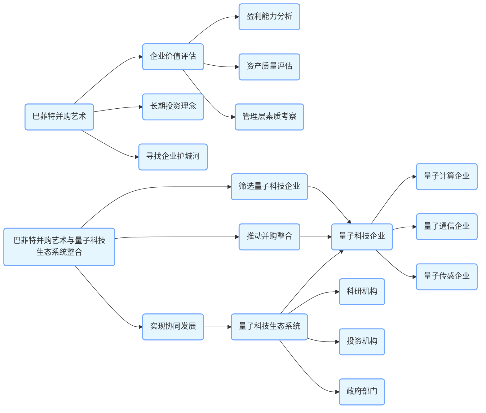

# 巴菲特的并购艺术：量子科技生态系统整合的新策略

> 关键词：巴菲特并购艺术、量子科技、生态系统整合、新策略、投资并购

> 摘要：本文深入探讨了巴菲特的并购艺术在量子科技生态系统整合中的新应用策略。首先介绍了研究的背景、目的、预期读者等信息，接着阐述了核心概念如巴菲特并购艺术、量子科技生态系统等及其相互联系。详细讲解了相关核心算法原理，并给出具体操作步骤及Python代码示例。通过数学模型和公式进一步剖析其中的逻辑和规律，结合项目实战案例进行代码实现和解读。分析了该策略在实际中的应用场景，推荐了相关的学习资源、开发工具框架以及论文著作。最后总结了未来发展趋势与挑战，解答常见问题，并提供扩展阅读和参考资料，旨在为读者全面呈现巴菲特并购艺术与量子科技生态系统整合的新策略。

## 1. 背景介绍 
### 1.1 目的和范围
本研究旨在探索如何将巴菲特的并购艺术应用于量子科技生态系统的整合中，以寻找新的投资和发展策略。通过对巴菲特并购理念、量子科技产业特点以及生态系统整合方法的研究，分析在量子科技领域实施并购的可行性、潜在价值和操作方式。研究范围涵盖了量子科技的主要领域，包括量子计算、量子通信、量子传感等，以及与之相关的产业链上下游企业。同时，还会参考巴菲特过往在其他行业的并购案例，总结经验教训并应用到量子科技领域。

### 1.2 预期读者
本文预期读者包括投资领域的专业人士，如投资经理、分析师等，他们可以从中获取在量子科技领域进行投资并购的新思路和方法；量子科技企业的管理者和创业者，有助于他们了解如何借助并购手段实现企业的发展和生态系统的构建；学术界的研究人员，为他们在量子科技产业经济和投资并购理论方面的研究提供参考；对科技投资和巴菲特投资理念感兴趣的普通投资者，帮助他们拓宽投资视野和理解复杂的科技投资逻辑。

### 1.3 文档结构概述
本文首先介绍研究的背景信息，包括目的、预期读者和文档结构。接着阐述核心概念，如巴菲特并购艺术和量子科技生态系统，并展示它们之间的联系。然后详细讲解核心算法原理和具体操作步骤，同时给出Python代码示例。通过数学模型和公式进一步分析策略的内在逻辑，并举例说明。结合项目实战，展示代码实现和详细解读。分析该策略在实际中的应用场景，推荐相关的学习资源、开发工具框架和论文著作。最后总结未来发展趋势与挑战，解答常见问题，并提供扩展阅读和参考资料。

### 1.4 术语表
#### 1.4.1 核心术语定义
- **巴菲特并购艺术**：指沃伦·巴菲特在长期投资并购实践中形成的一套独特的投资理念、分析方法和决策策略。包括对企业内在价值的评估、管理层能力的考察、长期投资的视角等。
- **量子科技**：基于量子力学原理发展起来的一系列前沿科技，主要包括量子计算、量子通信、量子传感等领域，具有高速度、高安全性等特点。
- **生态系统整合**：将不同的企业、组织、技术和资源整合到一个相互关联、协同发展的生态系统中，以实现资源共享、优势互补和价值创造的过程。
- **并购**：企业通过收购或合并其他企业的方式，实现资产、业务、市场等方面的扩张和整合。

#### 1.4.2 相关概念解释
- **量子计算**：利用量子比特的叠加和纠缠特性进行信息处理的新型计算模式，具有比传统计算机更强大的计算能力，可解决一些传统计算机难以处理的复杂问题。
- **量子通信**：基于量子力学原理实现信息安全传输的通信技术，主要包括量子密钥分发和量子隐形传态等，具有极高的安全性。
- **量子传感**：利用量子系统对物理量的敏感特性进行高精度测量的技术，可应用于导航、地质勘探、生物医学等多个领域。

#### 1.4.3 缩略词列表
- **QC**：Quantum Computing，量子计算
- **QCOM**：Quantum Communication，量子通信
- **QS**：Quantum Sensing，量子传感

## 2. 核心概念与联系 
### 核心概念原理
#### 巴菲特并购艺术原理
巴菲特的并购艺术核心在于寻找具有长期竞争优势和稳定现金流的企业。他强调对企业内在价值的深入分析，通过评估企业的盈利能力、资产质量、管理层素质等因素来确定企业的价值。巴菲特注重企业的护城河，即企业在市场竞争中所拥有的独特优势，如品牌、技术、成本等，以确保企业在长期内能够保持盈利和增长。他还倾向于进行长期投资，不被短期市场波动所影响，相信优秀的企业在长期内会为投资者带来丰厚的回报。

#### 量子科技生态系统原理
量子科技生态系统是一个由量子科技企业、科研机构、投资机构、政府部门等组成的复杂网络。在这个生态系统中，量子科技企业负责技术研发和产品商业化，科研机构提供基础研究支持，投资机构为企业发展提供资金，政府部门通过政策引导和资金扶持促进产业发展。各个主体之间相互协作、相互依存，形成一个有机的整体。例如，科研机构的研究成果可以为企业提供技术创新的源泉，企业的发展又可以吸引更多的投资和人才，进一步推动科研的进步。

### 架构的文本示意图
```plaintext
巴菲特并购艺术
|-- 企业价值评估
|   |-- 盈利能力分析
|   |-- 资产质量评估
|   |-- 管理层素质考察
|-- 长期投资理念
|-- 寻找企业护城河

量子科技生态系统
|-- 量子科技企业
|   |-- 量子计算企业
|   |-- 量子通信企业
|   |-- 量子传感企业
|-- 科研机构
|-- 投资机构
|-- 政府部门

巴菲特并购艺术与量子科技生态系统整合
|-- 基于巴菲特并购艺术筛选量子科技企业
|-- 推动量子科技生态系统内的并购整合
|-- 实现生态系统的协同发展和价值提升
```

### Mermaid 流程图


## 3. 核心算法原理 & 具体操作步骤 
### 核心算法原理
在将巴菲特并购艺术应用于量子科技生态系统整合时，核心算法的目标是筛选出具有投资价值的量子科技企业，并确定合理的并购策略。主要算法步骤包括企业价值评估、风险评估和协同效应评估。

#### 企业价值评估算法
企业价值评估采用现金流折现模型（DCF），该模型的基本原理是将企业未来的现金流折现到当前时刻，以确定企业的内在价值。公式如下：
$$V = \sum_{t=1}^{n} \frac{CF_t}{(1 + r)^t} + \frac{TV}{(1 + r)^n}$$
其中，$V$ 表示企业的内在价值，$CF_t$ 表示第 $t$ 年的自由现金流，$r$ 表示折现率，$n$ 表示预测期，$TV$ 表示预测期末的企业终值。

#### 风险评估算法
风险评估采用多因素模型，考虑量子科技企业面临的技术风险、市场风险、竞争风险等因素。通过对每个风险因素进行量化评估，并赋予相应的权重，计算出企业的综合风险得分。公式如下：
$$R = \sum_{i=1}^{m} w_i \times r_i$$
其中，$R$ 表示企业的综合风险得分，$w_i$ 表示第 $i$ 个风险因素的权重，$r_i$ 表示第 $i$ 个风险因素的得分，$m$ 表示风险因素的数量。

#### 协同效应评估算法
协同效应评估主要考虑并购后企业在技术、市场、成本等方面的协同作用。通过分析并购前后企业的各项指标变化，计算出协同效应的价值。例如，技术协同效应可以通过评估并购后企业的研发效率提升来衡量，市场协同效应可以通过分析市场份额的增加来计算。

### 具体操作步骤
#### 步骤 1：数据收集
收集量子科技企业的财务数据、技术研发数据、市场竞争数据等信息，以及宏观经济数据和行业数据。

#### 步骤 2：企业价值评估
使用现金流折现模型对量子科技企业进行价值评估。首先，预测企业未来的自由现金流，包括营业收入、成本、折旧等项目。然后，确定折现率，折现率可以根据企业的风险水平和市场利率来确定。最后，计算企业的内在价值。

#### 步骤 3：风险评估
使用多因素模型对企业的风险进行评估。确定风险因素和相应的权重，对每个风险因素进行量化评估，计算出企业的综合风险得分。

#### 步骤 4：协同效应评估
分析并购后企业可能产生的协同效应，包括技术协同、市场协同、成本协同等。通过对比并购前后企业的各项指标，计算出协同效应的价值。

#### 步骤 5：并购决策
根据企业价值评估、风险评估和协同效应评估的结果，做出并购决策。如果企业的内在价值高于市场价格，且综合风险在可接受范围内，同时并购后能够产生显著的协同效应，则可以考虑进行并购。

### Python 代码示例
```python
import numpy as np

# 企业价值评估函数
def dcf_valuation(cash_flows, discount_rate, terminal_value, years):
    present_values = []
    for t in range(1, years + 1):
        present_value = cash_flows[t - 1] / ((1 + discount_rate) ** t)
        present_values.append(present_value)
    terminal_present_value = terminal_value / ((1 + discount_rate) ** years)
    total_value = sum(present_values) + terminal_present_value
    return total_value

# 风险评估函数
def risk_assessment(weights, risk_scores):
    risk_score = np.dot(weights, risk_scores)
    return risk_score

# 示例数据
cash_flows = [100, 120, 150, 180, 200]
discount_rate = 0.1
terminal_value = 2500
years = 5
weights = [0.3, 0.3, 0.2, 0.2]
risk_scores = [0.8, 0.7, 0.6, 0.9]

# 企业价值评估
enterprise_value = dcf_valuation(cash_flows, discount_rate, terminal_value, years)
print(f"企业内在价值: {enterprise_value}")

# 风险评估
risk = risk_assessment(weights, risk_scores)
print(f"企业综合风险得分: {risk}")
```

## 4. 数学模型和公式 & 详细讲解 & 举例说明 
### 现金流折现模型（DCF）
#### 公式
$$V = \sum_{t=1}^{n} \frac{CF_t}{(1 + r)^t} + \frac{TV}{(1 + r)^n}$$
#### 详细讲解
- $V$：企业的内在价值，是我们要计算的目标值。
- $CF_t$：第 $t$ 年的自由现金流，自由现金流是指企业在满足了所有必要的资本支出和运营成本后剩余的现金流量，它反映了企业实际可用于分配给投资者的现金。
- $r$：折现率，是将未来现金流折现到当前时刻的比率。折现率的确定需要考虑企业的风险水平、市场利率等因素。一般来说，风险越高的企业，折现率也越高。
- $n$：预测期，是我们对企业未来现金流进行预测的时间段。预测期的长度通常根据企业的行业特点和发展阶段来确定。
- $TV$：预测期末的企业终值，是指在预测期结束后企业的价值。终值的计算可以采用多种方法，如永续增长模型等。

#### 举例说明
假设一家量子科技企业未来 5 年的自由现金流分别为 100 万元、120 万元、150 万元、180 万元和 200 万元，折现率为 10%，预测期末的企业终值为 2500 万元。则该企业的内在价值计算如下：

第 1 年现金流的现值：$PV_1 = \frac{100}{(1 + 0.1)^1} \approx 90.91$（万元）
第 2 年现金流的现值：$PV_2 = \frac{120}{(1 + 0.1)^2} \approx 99.17$（万元）
第 3 年现金流的现值：$PV_3 = \frac{150}{(1 + 0.1)^3} \approx 112.69$（万元）
第 4 年现金流的现值：$PV_4 = \frac{180}{(1 + 0.1)^4} \approx 122.94$（万元）
第 5 年现金流的现值：$PV_5 = \frac{200}{(1 + 0.1)^5} \approx 124.18$（万元）
终值的现值：$PV_{TV} = \frac{2500}{(1 + 0.1)^5} \approx 1552.30$（万元）

企业的内在价值：$V = PV_1 + PV_2 + PV_3 + PV_4 + PV_5 + PV_{TV} \approx 90.91 + 99.17 + 112.69 + 122.94 + 124.18 + 1552.30 = 2102.19$（万元）

### 多因素风险评估模型
#### 公式
$$R = \sum_{i=1}^{m} w_i \times r_i$$
#### 详细讲解
- $R$：企业的综合风险得分，反映了企业面临的整体风险水平。
- $w_i$：第 $i$ 个风险因素的权重，权重的确定需要根据各个风险因素对企业的重要程度来分配。
- $r_i$：第 $i$ 个风险因素的得分，得分可以通过对风险因素进行量化评估得到。
- $m$：风险因素的数量，根据企业的特点和行业环境，可以选择不同的风险因素进行评估。

#### 举例说明
假设对一家量子科技企业进行风险评估，考虑技术风险、市场风险、竞争风险和政策风险四个因素，权重分别为 0.3、0.3、0.2 和 0.2，相应的风险得分分别为 0.8、0.7、0.6 和 0.9。则该企业的综合风险得分计算如下：

$R = 0.3 \times 0.8 + 0.3 \times 0.7 + 0.2 \times 0.6 + 0.2 \times 0.9 = 0.24 + 0.21 + 0.12 + 0.18 = 0.75$

## 5. 项目实战：代码实际案例和详细解释说明 
### 5.1  开发环境搭建
#### 操作系统
可以选择 Windows、Linux 或 macOS 操作系统，本示例以 Windows 10 为例。

#### Python 环境
安装 Python 3.7 及以上版本，可以从 Python 官方网站（https://www.python.org/downloads/）下载安装包进行安装。安装完成后，确保将 Python 添加到系统环境变量中，以便在命令行中可以直接使用 Python 命令。

#### 开发工具
推荐使用 PyCharm 作为开发工具，它是一款功能强大的 Python 集成开发环境（IDE）。可以从 JetBrains 官方网站（https://www.jetbrains.com/pycharm/download/）下载社区版进行安装。

#### 第三方库安装
在命令行中使用以下命令安装所需的第三方库：
```sh
pip install numpy pandas matplotlib
```

### 5.2  源代码详细实现和代码解读
```python
import numpy as np
import pandas as pd
import matplotlib.pyplot as plt

# 企业价值评估函数
def dcf_valuation(cash_flows, discount_rate, terminal_value, years):
    present_values = []
    for t in range(1, years + 1):
        present_value = cash_flows[t - 1] / ((1 + discount_rate) ** t)
        present_values.append(present_value)
    terminal_present_value = terminal_value / ((1 + discount_rate) ** years)
    total_value = sum(present_values) + terminal_present_value
    return total_value

# 风险评估函数
def risk_assessment(weights, risk_scores):
    risk_score = np.dot(weights, risk_scores)
    return risk_score

# 示例数据
cash_flows = [100, 120, 150, 180, 200]
discount_rate = 0.1
terminal_value = 2500
years = 5
weights = [0.3, 0.3, 0.2, 0.2]
risk_scores = [0.8, 0.7, 0.6, 0.9]

# 企业价值评估
enterprise_value = dcf_valuation(cash_flows, discount_rate, terminal_value, years)
print(f"企业内在价值: {enterprise_value}")

# 风险评估
risk = risk_assessment(weights, risk_scores)
print(f"企业综合风险得分: {risk}")

# 数据可视化
years_list = list(range(1, years + 1))
present_values = []
for t in range(1, years + 1):
    present_value = cash_flows[t - 1] / ((1 + discount_rate) ** t)
    present_values.append(present_value)

plt.figure(figsize=(10, 6))
plt.bar(years_list, present_values)
plt.xlabel('年份')
plt.ylabel('现金流现值（万元）')
plt.title('各年现金流现值')
plt.show()
```

### 代码解读与分析
#### 企业价值评估函数 `dcf_valuation`
该函数接受现金流列表 `cash_flows`、折现率 `discount_rate`、终值 `terminal_value` 和预测期 `years` 作为输入。通过循环计算每年现金流的现值，并将其累加到 `present_values` 列表中。最后，计算终值的现值并与各年现金流现值之和相加，得到企业的内在价值。

#### 风险评估函数 `risk_assessment`
该函数使用 `numpy` 库的 `dot` 函数计算风险因素权重和风险得分的点积，得到企业的综合风险得分。

#### 数据可视化部分
使用 `matplotlib` 库绘制各年现金流现值的柱状图，直观展示各年现金流现值的分布情况。

通过这个项目实战，我们可以更深入地理解如何使用 Python 实现巴菲特并购艺术在量子科技企业评估中的应用，以及如何对评估结果进行可视化展示。

## 6. 实际应用场景 
### 量子科技企业扩张
对于量子科技企业来说，通过并购可以快速获取技术、人才和市场资源，实现企业的扩张。例如，一家量子计算企业可以并购一家拥有先进量子算法技术的初创企业，以提升自身的技术实力和市场竞争力。并购后，两家企业可以实现技术共享和协同创新，加速产品研发和商业化进程。

### 产业链整合
量子科技产业链涉及多个环节，包括基础研究、设备制造、软件开发等。通过并购可以实现产业链上下游企业的整合，提高产业链的协同效率和整体竞争力。例如，一家量子通信设备制造商可以并购一家从事量子密钥分发算法研究的企业，实现从设备制造到核心算法的全产业链覆盖，为客户提供更完整的解决方案。

### 投资机构布局
投资机构可以运用巴菲特的并购艺术，在量子科技生态系统中寻找具有投资价值的企业进行并购投资。通过整合不同的量子科技企业，形成一个协同发展的投资组合，实现资产的增值。例如，一家风险投资机构可以并购多家量子传感领域的初创企业，将它们的技术和市场资源进行整合，打造一个具有强大竞争力的量子传感产业集群。

### 政府推动产业发展
政府可以通过引导和支持量子科技企业的并购整合，推动量子科技产业的发展。政府可以出台相关政策，提供资金支持和税收优惠，鼓励企业进行并购重组。例如，政府可以设立专项基金，用于支持量子科技企业的并购项目，促进产业的规模化和集约化发展。

## 7. 工具和资源推荐
### 7.1 学习资源推荐
#### 7.1.1 书籍推荐
- 《巴菲特致股东的信：投资者和公司高管教程》：这本书收录了巴菲特历年致股东的信，详细阐述了他的投资理念、并购策略和企业管理方法，是学习巴菲特投资思想的经典读物。
- 《量子计算：从基础到应用》：全面介绍了量子计算的基本原理、算法和应用，适合对量子科技感兴趣的读者深入学习。
- 《并购之王：KKR的成功之道》：讲述了全球知名私募股权投资机构 KKR 的并购案例和经验，对理解并购操作和策略有很大帮助。

#### 7.1.2 在线课程
- Coursera 上的“投资学原理”：由知名高校教授授课，系统讲解投资学的基本原理和方法，包括企业估值、并购分析等内容。
- edX 上的“量子信息科学与技术”：介绍量子信息科学的基本概念和前沿技术，帮助学习者了解量子科技的发展趋势。
- Udemy 上的“企业并购与重组实战课程”：通过实际案例分析，详细讲解企业并购的流程、策略和操作技巧。

#### 7.1.3 技术博客和网站
- 量子位（https://www.qbitai.com/）：专注于量子科技领域的资讯和深度报道，提供最新的行业动态和技术进展。
- 雪球（https://xueqiu.com/）：一个投资交流社区，有很多关于巴菲特投资理念和并购案例的讨论和分析。
- 麻省理工科技评论（https://www.technologyreview.com/）：涵盖了科技领域的前沿研究和创新动态，对量子科技和投资并购有一定的报道和分析。

### 7.2 开发工具框架推荐
#### 7.2.1 IDE和编辑器
- PyCharm：功能强大的 Python 集成开发环境，提供代码编辑、调试、版本控制等一系列功能，适合开发量子科技相关的 Python 代码。
- Visual Studio Code：一款轻量级的代码编辑器，支持多种编程语言和插件扩展，可用于编写和调试量子科技项目的代码。

#### 7.2.2 调试和性能分析工具
- PDB：Python 自带的调试工具，可以在代码中设置断点，逐行调试代码，帮助排查错误。
- cProfile：Python 的性能分析工具，可以统计代码的运行时间和函数调用次数，找出性能瓶颈。

#### 7.2.3 相关框架和库
- NumPy：Python 的数值计算库，提供了高效的数组操作和数学函数，在企业价值评估和风险评估的计算中经常使用。
- Pandas：用于数据处理和分析的 Python 库，可用于读取、清洗和分析量子科技企业的财务数据和市场数据。
- Matplotlib：Python 的绘图库，可用于绘制各种图表，对评估结果进行可视化展示。

### 7.3 相关论文著作推荐
#### 7.3.1 经典论文
- “The Theory of Investment Value” by John Burr Williams：提出了现金流折现模型的基本思想，是企业价值评估领域的经典论文。
- “The Nature of the Firm” by Ronald Coase：探讨了企业存在的原因和边界问题，对理解企业并购的动机和意义有重要启示。
- “Quantum Computation and Quantum Information” by Michael A. Nielsen and Isaac L. Chuang：量子计算和量子信息领域的权威著作，全面介绍了量子计算的理论和实践。

#### 7.3.2 最新研究成果
- 关注《Nature》《Science》等顶级学术期刊上关于量子科技的研究论文，了解量子科技领域的最新进展和突破。
- 关注国际知名学术会议，如量子计算大会（QIP）、量子信息处理会议（QIP）等，获取最新的研究成果和学术动态。

#### 7.3.3 应用案例分析
- 分析一些知名企业在量子科技领域的并购案例，如谷歌、IBM 等公司的量子计算相关并购案例，学习它们的并购策略和整合经验。
- 研究一些成功的产业生态系统整合案例，如苹果公司的生态系统构建，了解如何通过并购和整合实现产业的协同发展和价值提升。

## 8. 总结：未来发展趋势与挑战
### 未来发展趋势
#### 量子科技与并购的深度融合
随着量子科技的不断发展和成熟，巴菲特的并购艺术将在量子科技生态系统整合中发挥越来越重要的作用。更多的投资机构和企业将采用并购手段来布局量子科技领域，加速产业的发展和整合。

#### 跨领域并购增多
量子科技具有广泛的应用前景，未来可能会出现更多跨领域的并购案例。例如，量子科技企业与金融、医疗、能源等行业的企业进行并购合作，实现技术的跨界应用和创新。

#### 国际合作与并购加强
量子科技是全球竞争的焦点领域，各国政府和企业都在加大投入。未来，国际间的合作与并购将不断加强，通过整合全球资源，提升量子科技产业的整体竞争力。

### 挑战
#### 技术风险
量子科技仍处于发展阶段，技术不确定性较大。在并购过程中，如何准确评估目标企业的技术实力和发展前景，是一个巨大的挑战。如果对技术风险评估不足，可能会导致并购失败。

#### 人才短缺
量子科技领域需要大量的专业人才，包括量子物理学家、计算机科学家等。人才短缺可能会影响企业的研发和发展速度，也会增加并购后的整合难度。

#### 政策和法规限制
量子科技涉及国家安全和信息安全等敏感领域，各国政府可能会出台相关的政策和法规来限制量子科技企业的并购活动。如何应对政策和法规限制，是企业在并购过程中需要面对的问题。

## 9. 附录：常见问题与解答
### 问题 1：巴菲特的并购艺术是否适用于所有量子科技企业？
解答：巴菲特的并购艺术强调寻找具有长期竞争优势和稳定现金流的企业。并非所有量子科技企业都符合这些条件，一些处于初创阶段的量子科技企业可能还没有实现盈利，或者技术还不够成熟。因此，需要对量子科技企业进行具体分析，结合企业的发展阶段、技术实力、市场前景等因素来判断是否适用巴菲特的并购艺术。

### 问题 2：如何评估量子科技企业的协同效应？
解答：评估量子科技企业的协同效应可以从技术、市场、成本等多个方面入手。在技术方面，可以分析并购后企业的研发效率是否提升，是否能够实现技术共享和创新；在市场方面，可以考察市场份额是否增加，客户资源是否得到整合；在成本方面，可以评估是否能够实现成本节约，如采购成本、运营成本等。通过对比并购前后企业的各项指标，来量化协同效应的价值。

### 问题 3：量子科技企业并购面临哪些法律风险？
解答：量子科技企业并购面临的法律风险包括反垄断风险、知识产权风险、国家安全审查风险等。反垄断风险是指并购可能导致市场垄断，受到反垄断机构的审查和限制；知识产权风险是指并购过程中可能涉及知识产权的归属和侵权问题；国家安全审查风险是指由于量子科技涉及国家安全和信息安全，并购可能需要经过国家安全审查。企业在并购前需要充分了解相关法律法规，做好风险评估和防范。

## 10. 扩展阅读 & 参考资料
### 扩展阅读
- 《聪明的投资者》：本杰明·格雷厄姆的经典投资著作，对巴菲特的投资理念产生了深远影响，进一步深入了解价值投资的思想和方法。
- 《创新者的窘境》：探讨了企业在面对技术创新时的困境和应对策略，对量子科技企业的发展和并购有一定的启示作用。
- 《量子力学史话》：以生动有趣的方式讲述了量子力学的发展历程，帮助读者更好地理解量子科技的理论基础。

### 参考资料
- 巴菲特历年致股东的信，可从伯克希尔·哈撒韦公司官方网站获取。
- 量子科技领域的研究报告和行业数据，可从相关科研机构、行业协会和咨询公司获取。
- 企业并购案例分析报告，可从金融媒体、研究机构和专业书籍中获取。

作者：AI天才研究院/AI Genius Institute & 禅与计算机程序设计艺术 /Zen And The Art of Computer Programming